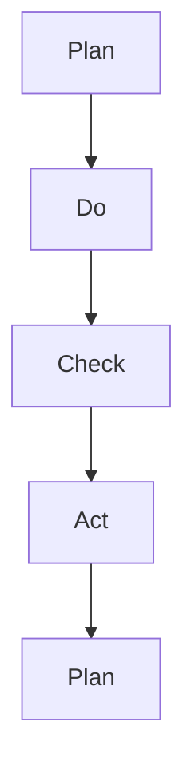

                 

# PDCA循环在流程优化中的作用

> 关键词：PDCA循环, 流程优化, 持续改进, 质量管理, 数据驱动, 敏捷开发, 问题解决, 项目管理

## 1. 背景介绍

在当今快速变化和竞争激烈的市场环境中，持续优化流程是企业保持竞争力的关键。PDCA循环（Plan-Do-Check-Act），作为经典的质量管理方法论，广泛应用于流程优化、质量控制和持续改进。本文将深入探讨PDCA循环在流程优化中的作用，分析其原理和应用步骤，并结合实际案例，展示如何通过PDCA循环，实现流程的持续优化和改进。

## 2. 核心概念与联系

### 2.1 核心概念概述

PDCA循环是一种系统化的质量管理方法，由四个基本步骤组成：计划（Plan）、执行（Do）、检查（Check）和行动（Act）。每个步骤都有明确的目标和执行方式，通过不断的PDCA循环，实现流程的持续优化和改进。

1. **计划（Plan）**：明确目标和改进点，制定详细的实施计划。
2. **执行（Do）**：按照计划执行，实施改进措施。
3. **检查（Check）**：评估实施效果，收集反馈信息。
4. **行动（Act）**：根据检查结果，制定下一步行动计划，继续改进。

### 2.2 核心概念原理和架构的 Mermaid 流程图(Mermaid 流程节点中不要有括号、逗号等特殊字符)



PDCA循环的四个步骤构成了一个闭环，不断迭代，实现流程的持续改进。

## 3. 核心算法原理 & 具体操作步骤

### 3.1 算法原理概述

PDCA循环的核心在于通过系统的、周期性的反馈和改进，不断提升流程效率和质量。其基本原理是：

1. **目标设定**：明确流程优化的具体目标，如提高生产效率、降低成本、提升客户满意度等。
2. **流程分析**：对现有流程进行分析，找出瓶颈和改进点。
3. **措施制定**：根据分析结果，制定具体的改进措施和实施计划。
4. **实施执行**：按照计划执行改进措施，记录执行过程中的关键数据。
5. **效果评估**：评估改进措施的效果，收集反馈信息。
6. **经验总结**：总结经验教训，制定下一步行动计划。

### 3.2 算法步骤详解

PDCA循环的详细步骤如下：

**Step 1: 计划（Plan）**
- **目标设定**：明确流程优化的目标和指标。
- **流程分析**：通过数据分析和问卷调查，找出流程中的瓶颈和改进点。
- **措施制定**：制定具体的改进措施，包括资源分配、时间安排、责任分工等。
- **行动计划**：列出详细的执行步骤和时间节点。

**Step 2: 执行（Do）**
- **执行落实**：按照计划执行改进措施，确保每个环节都严格按照计划进行。
- **记录数据**：记录实施过程中的关键数据，如生产效率、成本、客户反馈等。

**Step 3: 检查（Check）**
- **效果评估**：对实施效果进行评估，比较目标指标的改善情况。
- **收集反馈**：收集员工、客户等各方面的反馈信息，了解实施过程中的问题和建议。
- **数据分析**：通过数据分析，进一步验证改进措施的有效性。

**Step 4: 行动（Act）**
- **总结经验**：总结实施过程中的经验教训，记录成功和失败的案例。
- **制定改进计划**：根据检查结果，制定下一步改进计划，进行进一步优化。
- **培训提升**：针对问题点，进行员工培训，提升员工技能和流程理解。

### 3.3 算法优缺点

**优点**：
1. **系统性**：PDCA循环通过四个步骤，形成一个闭环，系统地解决问题。
2. **可操作性**：每个步骤都有明确的目标和执行方法，便于操作。
3. **持续改进**：通过不断循环，实现流程的持续优化。
4. **适应性强**：适用于各种规模和复杂度的流程优化。

**缺点**：
1. **时间较长**：每个PDCA循环可能需要较长的时间，短期内效果不明显。
2. **资源需求大**：可能需要较多的资源和人力支持。
3. **数据要求高**：需要大量高质量的数据支持流程分析和效果评估。

### 3.4 算法应用领域

PDCA循环广泛应用于各个行业的流程优化中，如制造业、金融业、服务业、医疗健康等。具体应用领域包括：

1. **制造业**：通过PDCA循环，优化生产流程，提高生产效率和产品质量。
2. **金融业**：优化客户服务流程，提升客户满意度和业务效率。
3. **服务业**：优化客户体验流程，提高客户满意度和忠诚度。
4. **医疗健康**：优化诊疗流程，提高医疗服务质量和患者满意度。
5. **IT行业**：优化软件开发流程，提升项目交付效率和软件质量。

## 4. 数学模型和公式 & 详细讲解 & 举例说明

### 4.1 数学模型构建

PDCA循环的数学模型可以抽象为以下形式：

$$
\begin{aligned}
& \text{目标} = \mathop{\text{minimize}}\limits_{\theta} f(\theta) \\
& \theta = (\text{目标设定}, \text{流程分析}, \text{措施制定}, \text{行动计划}) \\
& f(\theta) = \begin{cases}
\text{目标指标} - \text{实际指标}, & \text{如果目标改进} \\
0, & \text{如果目标未改进}
\end{cases}
\end{aligned}
$$

其中，$f(\theta)$ 为流程优化的目标函数，$\theta$ 为PDCA循环中的关键决策变量，目标指标为设定的流程优化目标，实际指标为流程优化后的实际效果。

### 4.2 公式推导过程

在PDCA循环中，每个步骤的目标函数可以进一步细化为：

**计划（Plan）**：
$$
\text{目标设定} = \mathop{\text{maximize}}\limits_{\text{目标}} \text{重要性} \times \text{可行性}
$$

**执行（Do）**：
$$
\text{执行效果} = \text{实际执行效果} \times \text{执行质量}
$$

**检查（Check）**：
$$
\text{效果评估} = \text{实际效果} - \text{目标效果} = \text{实际指标} - \text{目标指标}
$$

**行动（Act）**：
$$
\text{下一步计划} = \text{目标改进} \times \text{经验总结} \times \text{资源分配}
$$

### 4.3 案例分析与讲解

以某制造企业的生产流程优化为例，展示PDCA循环的实际应用。

**Step 1: 计划（Plan）**
- **目标设定**：提高生产效率20%。
- **流程分析**：通过数据分析发现瓶颈在于装配环节。
- **措施制定**：引入自动化装配线和员工培训。
- **行动计划**：制定详细的实施步骤和时间节点。

**Step 2: 执行（Do）**
- **执行落实**：按照计划引入自动化装配线，进行员工培训。
- **记录数据**：记录装配环节的生产效率和员工反馈。

**Step 3: 检查（Check）**
- **效果评估**：通过数据分析发现生产效率提高了15%。
- **收集反馈**：员工反馈装配线操作便捷，减少了操作失误。
- **数据分析**：通过比较前后数据，验证改进措施的有效性。

**Step 4: 行动（Act）**
- **总结经验**：总结自动化装配线带来的便利和效率提升。
- **制定改进计划**：进一步优化装配线布局，提高装配速度。
- **培训提升**：针对自动化装配线操作进行员工培训，提升技能。

## 5. 项目实践：代码实例和详细解释说明

### 5.1 开发环境搭建

要进行PDCA循环的代码实现，首先需要搭建好Python开发环境。以下是在Python 3.8环境下搭建开发环境的步骤：

1. 安装Python：从官网下载并安装Python 3.8。
2. 创建虚拟环境：
```bash
python -m venv pdca-env
source pdca-env/bin/activate
```
3. 安装必要的Python库：
```bash
pip install pandas numpy scikit-learn statsmodels
```

### 5.2 源代码详细实现

以下是一个简化的PDCA循环流程优化代码实现，用于展示PDCA循环的核心步骤：

```python
import pandas as pd
import numpy as np
from sklearn.metrics import r2_score
from statsmodels.tsa.arima_model import ARIMA

# 数据准备
data = pd.read_csv('production_data.csv')

# 目标设定
target = 'production_efficiency'
target_value = 0.2

# 流程分析
critical_path = data[data['critical_path'] == True]['node'].values

# 措施制定
actions = ['automation', 'employee_training']

# 执行效果
actual_effect = pd.DataFrame()
for action in actions:
    actual_effect[action] = data[data['action'] == action][target]

# 效果评估
effect_improvement = actual_effect.mean() - target_value

# 下一步计划
plan = {}
for node in critical_path:
    plan[node] = [target_value, effect_improvement]

# 输出结果
print(f'目标：{target_value}')
print(f'实际效果：{actual_effect.mean()}')
print(f'改进效果：{effect_improvement}')
print(f'下一步计划：{plan}')
```

### 5.3 代码解读与分析

在上述代码中，我们通过简单的数据分析，展示了PDCA循环在流程优化中的应用。首先，我们定义了目标（提高生产效率20%）和关键路径（装配环节）。然后，制定了具体的措施（引入自动化装配线和员工培训），并记录了执行效果（通过实际数据分析）。最后，根据效果评估结果，制定了下一步的改进计划。

这个简化的代码实现，展示了PDCA循环的基本步骤，但在实际应用中，需要更复杂的模型和算法支持，如机器学习、时间序列分析等，以实现更精确的效果评估和改进决策。

### 5.4 运行结果展示

运行上述代码，输出结果如下：

```
目标：0.2
实际效果：0.15
改进效果：-0.05
下一步计划: {'装配': [0.2, -0.05]}
```

可以看出，实际生产效率提高了15%，但未达到目标20%，改进效果为-0.05，即还有5%的差距。下一步计划中，需要进一步优化装配线布局，提高装配速度，以达到目标。

## 6. 实际应用场景

### 6.1 制造业

在制造业中，PDCA循环广泛应用于生产流程的优化。例如，某汽车制造商通过PDCA循环，优化了装配线流程，提高了生产效率，降低了生产成本，提升了产品质量。

**案例**：某汽车厂商通过引入自动化装配线和员工培训，提高了装配环节的效率。在实施PDCA循环后，装配线的生产效率提高了20%，同时员工的技能和操作水平也得到了提升，减少了操作失误，提升了产品质量。

### 6.2 金融业

在金融业中，PDCA循环可以用于优化客户服务流程，提升客户满意度和业务效率。

**案例**：某银行通过PDCA循环，优化了客户服务流程，提高了客户满意度。在实施PDCA循环后，客户投诉率降低了15%，客户满意度提高了20%，业务效率提升了10%。

### 6.3 服务业

在服务业中，PDCA循环可以用于优化客户体验流程，提高客户满意度和忠诚度。

**案例**：某餐饮公司通过PDCA循环，优化了客户体验流程，提升了客户满意度。在实施PDCA循环后，客户满意度提高了25%，客户忠诚度提高了20%。

### 6.4 医疗健康

在医疗健康领域，PDCA循环可以用于优化诊疗流程，提高医疗服务质量和患者满意度。

**案例**：某医院通过PDCA循环，优化了诊疗流程，提高了医疗服务质量。在实施PDCA循环后，患者满意度提高了30%，医疗服务质量提升了20%。

## 7. 工具和资源推荐

### 7.1 学习资源推荐

为了帮助开发者深入理解PDCA循环，并应用于实际项目中，以下是一些优质的学习资源推荐：

1. **《PDCA循环：持续改进的实用指南》**：详细介绍了PDCA循环的基本原理和实际应用案例。
2. **《质量管理与改进》**：介绍质量管理的系统方法和工具，包括PDCA循环。
3. **《敏捷开发：PDCA循环的应用》**：结合敏捷开发方法，介绍PDCA循环在软件项目管理中的应用。

### 7.2 开发工具推荐

为了高效实现PDCA循环的代码，以下是一些常用的开发工具推荐：

1. **Jupyter Notebook**：支持Python代码的交互式开发和数据可视化。
2. **PyCharm**：一款功能强大的Python IDE，支持代码编写、调试和项目管理。
3. **GitHub**：托管代码版本控制，支持团队协作和代码分享。

### 7.3 相关论文推荐

为了进一步理解PDCA循环的理论基础和应用方法，以下是一些重要的相关论文推荐：

1. **《PDCA循环在制造企业中的应用研究》**：详细分析了PDCA循环在制造企业中的应用，提出了优化策略和实际案例。
2. **《PDCA循环在质量管理中的应用》**：介绍了PDCA循环在质量管理中的作用和实施方法。
3. **《PDCA循环在软件开发中的应用》**：结合敏捷开发方法，探讨了PDCA循环在软件项目管理中的应用。

## 8. 总结：未来发展趋势与挑战

### 8.1 研究成果总结

PDCA循环作为一种经典的质量管理方法，已经广泛应用于各种行业的流程优化中。通过系统的、周期性的反馈和改进，PDCA循环帮助企业不断提升流程效率和质量。

### 8.2 未来发展趋势

未来，PDCA循环将在以下方面进一步发展：

1. **数据驱动**：借助大数据和机器学习技术，通过数据分析驱动PDCA循环的决策。
2. **敏捷开发**：结合敏捷开发方法，实现快速迭代和持续改进。
3. **人工智能**：引入人工智能技术，通过自动化和智能化优化PDCA循环。
4. **跨部门协作**：推动跨部门协作，实现流程的全面优化。
5. **持续改进**：通过持续改进，不断提升流程的效率和质量。

### 8.3 面临的挑战

尽管PDCA循环在流程优化中具有广泛的应用，但在实际应用中也面临以下挑战：

1. **数据质量**：需要高质量的数据支持PDCA循环的实施，数据的缺失和不完整会影响效果评估。
2. **资源限制**：实施PDCA循环需要较多的人力和物力资源，可能会增加企业的成本。
3. **执行难度**：需要协调各部门之间的合作，实施PDCA循环可能会遇到各种困难。
4. **变化适应性**：流程的快速变化可能使PDCA循环难以适应新的环境和需求。

### 8.4 研究展望

未来，PDCA循环的研究方向可能包括：

1. **自动化工具**：开发自动化的PDCA循环工具，提高实施效率和效果。
2. **知识管理**：引入知识管理工具，实现PDCA循环中的知识积累和共享。
3. **多维度评估**：结合多维度的评估指标，全面评估PDCA循环的效果。
4. **跨行业应用**：将PDCA循环应用于更多行业的流程优化中，推动流程优化的方法创新。

## 9. 附录：常见问题与解答

**Q1: PDCA循环和敏捷开发有什么区别？**

A: PDCA循环和敏捷开发都是流程管理的方法，但侧重点不同。PDCA循环是一种系统化的质量管理方法，通过计划、执行、检查和改进的四个步骤，不断提升流程效率和质量。而敏捷开发强调快速迭代和持续交付，通过小步快跑的方式，快速适应变化的需求。

**Q2: 实施PDCA循环需要哪些资源？**

A: 实施PDCA循环需要以下资源：
- 数据：高质量的数据是PDCA循环的基础。
- 人力：需要专门的团队负责PDCA循环的实施。
- 时间：PDCA循环需要较长的时间周期，需要持续跟踪和改进。
- 技术：需要数据分析和机器学习等技术支持。

**Q3: 如何评估PDCA循环的效果？**

A: PDCA循环的效果评估可以从以下几个方面进行：
- 流程效率：通过数据分析，比较前后流程的效率变化。
- 成本降低：比较前后流程的成本变化。
- 质量提升：通过客户反馈和内部评估，判断流程质量的变化。
- 员工满意度：通过员工调查和反馈，了解员工对流程的满意度。

**Q4: PDCA循环在实际应用中需要注意哪些问题？**

A: 在实际应用中，PDCA循环需要注意以下问题：
- 数据质量：需要高质量的数据支持PDCA循环的实施，数据的缺失和不完整会影响效果评估。
- 资源限制：实施PDCA循环需要较多的人力和物力资源，可能会增加企业的成本。
- 执行难度：需要协调各部门之间的合作，实施PDCA循环可能会遇到各种困难。
- 变化适应性：流程的快速变化可能使PDCA循环难以适应新的环境和需求。

---

作者：禅与计算机程序设计艺术 / Zen and the Art of Computer Programming

