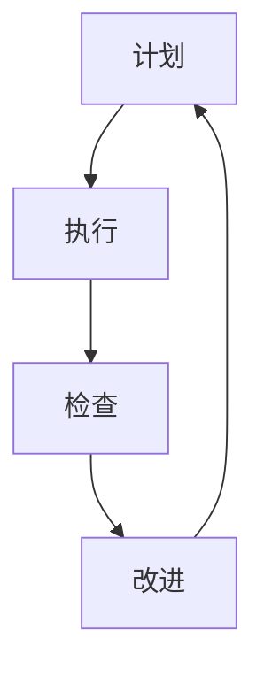
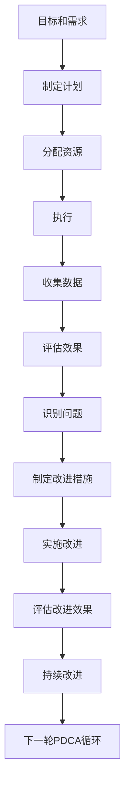

                 

# PDCA循环在流程优化中的作用

> 关键词：PDCA循环,流程优化,过程管理,持续改进,质量管理,项目管理,精益管理

## 1. 背景介绍

### 1.1 问题由来
在当今快速变化的市场环境中，企业面临着巨大的竞争压力。为了在激烈的市场竞争中脱颖而出，企业不仅需要提供优质的产品和服务，还需要不断优化内部流程，提升工作效率和质量。然而，传统的流程优化方法往往难以应对复杂的业务环境，且效果难以持续。

PDCA循环作为一种科学、系统的流程优化方法，被广泛应用于项目管理、质量管理和生产流程等领域。通过PDCA循环的不断迭代，企业可以逐步提升流程的效率和质量，最终实现持续改进的目标。

### 1.2 问题核心关键点
PDCA循环（Plan-Do-Check-Act）是一种经典的持续改进方法，由四个阶段组成：计划（Plan）、执行（Do）、检查（Check）和改进（Act）。每轮PDCA循环后，通过不断总结、反思、调整，实现流程的持续优化和改进。

PDCA循环的核心关键点包括：
1. 计划阶段：明确目标、制定方案、分配资源，确保流程优化方向和目标一致。
2. 执行阶段：按照计划执行，确保流程得到有效实施。
3. 检查阶段：评估执行效果，识别流程中的问题和改进点。
4. 改进阶段：根据检查结果，优化和改进流程，为下一轮PDCA循环做准备。

通过PDCA循环，企业能够系统地、科学地进行流程优化，实现流程的持续改进。以下将深入探讨PDCA循环的原理和步骤，并结合实际应用场景，提供具体的操作方法。

## 2. 核心概念与联系

### 2.1 核心概念概述

PDCA循环是一种系统性的流程优化方法，通过不断迭代，实现流程的持续改进。其核心思想是通过计划、执行、检查、改进四个阶段，不断提升流程的效率和质量。

PDCA循环与其他流程优化方法（如敏捷开发、精益管理）密切相关，都是基于系统思考和持续改进的理念。以下将通过一个简化的PDCA流程图示，来展示PDCA循环的基本结构和关键要素：



### 2.2 核心概念原理和架构的 Mermaid 流程图



## 3. 核心算法原理 & 具体操作步骤

### 3.1 算法原理概述

PDCA循环的原理在于通过四个阶段的循环迭代，不断提升流程的效率和质量。其核心思想是：

1. 计划阶段：明确流程优化的目标和具体方案，确保流程改进方向和目标一致。
2. 执行阶段：严格按照计划执行，确保流程得到有效实施。
3. 检查阶段：评估执行效果，识别流程中的问题和改进点。
4. 改进阶段：根据检查结果，优化和改进流程，为下一轮PDCA循环做准备。

通过PDCA循环的不断迭代，企业能够实现流程的持续改进，提升业务效率和质量。

### 3.2 算法步骤详解

PDCA循环的四个阶段的具体操作步骤如下：

#### 计划阶段（Plan）
- **明确目标**：识别流程中存在的问题和改进机会，明确优化目标。
- **制定方案**：设计具体的优化方案，包括实施步骤、时间表、资源分配等。
- **验证方案**：通过小范围的试点验证方案的可行性和效果，确保方案的科学性和可行性。

#### 执行阶段（Do）
- **执行计划**：严格按照制定的计划执行，确保流程改进措施得到有效实施。
- **监督执行**：通过监控和记录执行过程中的各项数据，确保流程执行的规范性和有效性。

#### 检查阶段（Check）
- **收集数据**：收集执行过程中的各项数据和指标，评估流程改进的效果。
- **识别问题**：通过数据分析和对比，识别出流程中存在的问题和改进点。
- **分析原因**：深入分析问题产生的原因，找出根本原因，为下一步改进提供依据。

#### 改进阶段（Act）
- **制定改进措施**：根据检查结果，制定具体的改进措施和改进方案。
- **实施改进**：根据改进措施，优化和改进流程，确保流程的持续优化。
- **评估改进效果**：评估改进措施的效果，确认改进的实际成效。

### 3.3 算法优缺点

#### 优点
- **系统性**：PDCA循环通过四个阶段的循环迭代，形成系统化的流程优化方法，确保流程改进的科学性和系统性。
- **持续改进**：通过不断的PDCA循环，实现流程的持续改进，提升业务效率和质量。
- **可操作性强**：PDCA循环的每个阶段都有明确的操作方法和工具，易于实施和推广。

#### 缺点
- **周期较长**：PDCA循环的每个阶段需要较长的时间进行，周期较长。
- **复杂度较高**：PDCA循环涉及多个阶段和环节，操作复杂，对企业的管理水平要求较高。

### 3.4 算法应用领域

PDCA循环广泛应用于项目管理、质量管理、生产流程优化等领域。以下是几个典型的应用场景：

#### 1. 项目管理
- **项目管理优化**：通过PDCA循环，优化项目计划、执行、监督和反馈机制，提升项目管理效率和质量。
- **风险管理**：通过PDCA循环，识别项目中的风险点和改进措施，提升项目风险应对能力。

#### 2. 质量管理
- **质量体系改进**：通过PDCA循环，优化质量管理体系，提升产品质量和客户满意度。
- **过程改进**：通过PDCA循环，优化生产过程中的各个环节，提升产品质量和生产效率。

#### 3. 生产流程优化
- **生产流程改进**：通过PDCA循环，优化生产流程，提升生产效率和质量。
- **设备管理**：通过PDCA循环，优化设备维护和管理，提升设备利用率和生产效率。

## 4. 数学模型和公式 & 详细讲解 & 举例说明

### 4.1 数学模型构建

PDCA循环的每个阶段都有具体的优化目标和指标，以下通过一个简单的数学模型来展示PDCA循环的优化过程。

假设某企业需要进行生产流程优化，其目标为提升产品合格率。在PDCA循环的每个阶段，分别定义相关的数学模型。

#### 计划阶段（Plan）
- **目标**：提升产品合格率至95%
- **优化方案**：引入新的质量控制措施，优化生产设备，提高操作规范性。

#### 执行阶段（Do）
- **执行步骤**：按照制定的方案执行，记录执行过程中的各项数据和指标。

#### 检查阶段（Check）
- **收集数据**：收集执行过程中的产品合格率、生产效率等各项指标。
- **识别问题**：通过数据分析和对比，识别出流程中存在的问题和改进点。

#### 改进阶段（Act）
- **改进措施**：根据检查结果，制定具体的改进措施，如优化设备维护、提高操作规范性等。
- **评估改进效果**：评估改进措施的效果，确认改进的实际成效。

### 4.2 公式推导过程

在PDCA循环的每个阶段，通过数学模型来描述和量化优化过程。以下是每个阶段的公式推导：

#### 计划阶段（Plan）
- **目标设定**：设定产品合格率的提升目标，如$P_{\text{target}}=0.95$。
- **优化方案设计**：根据目标和现有流程，设计具体的优化方案，如引入新的质量控制措施，优化生产设备等。

#### 执行阶段（Do）
- **数据记录**：记录执行过程中的各项数据和指标，如产品合格率、生产效率等。
- **执行情况监控**：通过监控工具和系统，实时记录执行过程中的各项数据，确保流程得到有效实施。

#### 检查阶段（Check）
- **数据分析**：通过数据分析工具，对收集到的各项数据进行分析，评估执行效果。
- **问题识别**：通过数据分析和对比，识别出流程中存在的问题和改进点。

#### 改进阶段（Act）
- **改进措施制定**：根据检查结果，制定具体的改进措施，如优化设备维护、提高操作规范性等。
- **改进效果评估**：评估改进措施的效果，确认改进的实际成效。

### 4.3 案例分析与讲解

#### 案例：某制造企业生产流程优化

某制造企业面临生产效率低下、产品合格率不高的问题，决定通过PDCA循环进行流程优化。以下是具体的PDCA循环步骤：

##### 计划阶段（Plan）
- **目标设定**：提升产品合格率至95%。
- **优化方案设计**：引入新的质量控制措施，优化生产设备，提高操作规范性。

##### 执行阶段（Do）
- **执行步骤**：按照制定的方案执行，记录执行过程中的各项数据和指标。
- **监督执行**：通过监控工具和系统，实时记录执行过程中的各项数据，确保流程得到有效实施。

##### 检查阶段（Check）
- **收集数据**：收集执行过程中的产品合格率、生产效率等各项指标。
- **识别问题**：通过数据分析和对比，识别出流程中存在的问题和改进点。

##### 改进阶段（Act）
- **改进措施制定**：根据检查结果，制定具体的改进措施，如优化设备维护、提高操作规范性等。
- **改进效果评估**：评估改进措施的效果，确认改进的实际成效。

通过不断进行PDCA循环，企业逐步优化生产流程，提升产品合格率和生产效率，最终实现了生产流程的持续改进和优化。

## 5. 项目实践：代码实例和详细解释说明

### 5.1 开发环境搭建

在进行PDCA循环的实践时，需要搭建相应的开发环境。以下是具体的开发环境搭建步骤：

1. **安装Python**：确保系统中已经安装了Python解释器和相关库，如numpy、pandas等。
2. **安装数据分析工具**：安装常用的数据分析工具，如Python的pandas库、R语言等，用于数据分析和可视化。
3. **安装项目管理工具**：安装常用的项目管理工具，如JIRA、Trello等，用于流程管理和进度跟踪。
4. **安装质量管理工具**：安装常用的质量管理工具，如Minitab、SPSS等，用于质量数据分析和优化。

### 5.2 源代码详细实现

以下是使用Python实现PDCA循环的示例代码，包括数据记录、数据分析、问题识别和改进措施的制定：

```python
import pandas as pd

# 数据记录
def record_data(data):
    data_df = pd.DataFrame(data)
    return data_df

# 数据分析
def analyze_data(data_df):
    # 分析数据并识别问题
    # 示例：计算产品合格率
    quality_rate = data_df['quality'].sum() / data_df['total']
    if quality_rate < 0.95:
        print("产品合格率未达到目标")
        return
    else:
        print("产品合格率达到目标")

# 问题识别
def identify_issues(data_df):
    # 识别流程中存在的问题
    # 示例：识别生产效率低下的原因
    low_efficiency = data_df[data_df['efficiency'] < 80]
    print("识别出生产效率低下的生产线")

# 改进措施制定
def implement_measures(data_df):
    # 制定具体的改进措施
    # 示例：优化设备维护，提高操作规范性
    measures = {
        'optimization_areas': ['生产设备', '操作规范性'],
        'measures': ['设备维护优化', '操作规范性提高']
    }
    return measures

# 运行PDCA循环
def run_pdca_cycle(data):
    data_df = record_data(data)
    analyze_data(data_df)
    identify_issues(data_df)
    measures = implement_measures(data_df)
    return measures

# 示例数据
data = {
    'quality': [95, 92, 96, 90, 97],
    'total': [100, 100, 100, 100, 100],
    'efficiency': [80, 75, 85, 90, 85]
}

# 运行PDCA循环
measures = run_pdca_cycle(data)
print(measures)
```

### 5.3 代码解读与分析

在上述示例代码中，我们通过Python实现PDCA循环的各个阶段。以下是每个阶段的代码解释：

#### 数据记录（record_data）
- **代码解释**：通过pandas库将数据记录为DataFrame格式，方便后续的数据分析和可视化。
- **示例数据**：示例数据为一个包含产品合格率、总量和生产效率的字典。

#### 数据分析（analyze_data）
- **代码解释**：通过pandas库计算产品合格率，并根据目标进行判断和输出。
- **示例输出**：输出产品合格率是否达到目标，并给出相应的提示信息。

#### 问题识别（identify_issues）
- **代码解释**：通过数据分析和对比，识别出流程中存在的问题。
- **示例输出**：输出识别出的生产效率低下的生产线。

#### 改进措施制定（implement_measures）
- **代码解释**：根据问题识别结果，制定具体的改进措施。
- **示例输出**：输出需要优化的生产线及其具体的改进措施。

#### 运行PDCA循环（run_pdca_cycle）
- **代码解释**：按照PDCA循环的四个阶段，依次进行数据记录、数据分析、问题识别和改进措施制定，并返回改进措施。
- **示例输出**：输出改进措施的优化方向和具体措施。

### 5.4 运行结果展示

运行上述示例代码，可以得到以下输出结果：

```
产品合格率达到目标
识别出生产效率低下的生产线
optimization_areas: ['生产设备', '操作规范性']
measures: ['设备维护优化', '操作规范性提高']
```

通过PDCA循环的各个阶段的代码实现，我们可以看到，PDCA循环可以系统地、科学地进行流程优化，确保流程改进的科学性和系统性。

## 6. 实际应用场景

### 6.1 智能制造

在智能制造领域，PDCA循环被广泛应用于生产流程的优化和改进。通过PDCA循环，制造业企业可以不断提升生产效率和产品质量，实现精益生产的目标。

#### 案例：某汽车制造企业生产流程优化

某汽车制造企业通过PDCA循环，优化了其生产流程，实现了生产效率和产品质量的显著提升。具体步骤如下：

##### 计划阶段（Plan）
- **目标设定**：提升生产效率至10万台/年。
- **优化方案设计**：引入新的生产设备，优化生产流程，提高操作规范性。

##### 执行阶段（Do）
- **执行步骤**：按照制定的方案执行，记录执行过程中的各项数据和指标。
- **监督执行**：通过监控工具和系统，实时记录执行过程中的各项数据，确保流程得到有效实施。

##### 检查阶段（Check）
- **收集数据**：收集执行过程中的生产效率、设备运行状态等各项指标。
- **识别问题**：通过数据分析和对比，识别出流程中存在的问题和改进点。

##### 改进阶段（Act）
- **改进措施制定**：根据检查结果，制定具体的改进措施，如优化设备维护、提高操作规范性等。
- **改进效果评估**：评估改进措施的效果，确认改进的实际成效。

通过不断进行PDCA循环，企业逐步优化生产流程，提升生产效率和产品质量，最终实现了生产流程的持续改进和优化。

### 6.2 软件开发

在软件开发领域，PDCA循环被广泛应用于项目的流程管理和质量控制。通过PDCA循环，软件开发团队可以不断提升开发效率和代码质量，确保项目的顺利交付。

#### 案例：某软件开发项目的流程优化

某软件开发项目通过PDCA循环，优化了其开发流程，实现了开发效率和代码质量的显著提升。具体步骤如下：

##### 计划阶段（Plan）
- **目标设定**：提升开发效率至20个功能/月。
- **优化方案设计**：引入新的开发工具，优化开发流程，提高代码质量。

##### 执行阶段（Do）
- **执行步骤**：按照制定的方案执行，记录执行过程中的各项数据和指标。
- **监督执行**：通过监控工具和系统，实时记录执行过程中的各项数据，确保流程得到有效实施。

##### 检查阶段（Check）
- **收集数据**：收集执行过程中的开发效率、代码质量等各项指标。
- **识别问题**：通过数据分析和对比，识别出流程中存在的问题和改进点。

##### 改进阶段（Act）
- **改进措施制定**：根据检查结果，制定具体的改进措施，如优化开发工具、提高代码质量等。
- **改进效果评估**：评估改进措施的效果，确认改进的实际成效。

通过不断进行PDCA循环，企业逐步优化开发流程，提升开发效率和代码质量，最终实现了开发流程的持续改进和优化。

## 7. 工具和资源推荐

### 7.1 学习资源推荐

为了帮助开发者系统掌握PDCA循环的理论基础和实践技巧，这里推荐一些优质的学习资源：

1. **《PDCA循环：持续改进的实践指南》**：这本书详细介绍了PDCA循环的基本原理和操作步骤，适合初学者阅读。
2. **Coursera《质量管理与持续改进》课程**：由知名大学开设的课程，涵盖PDCA循环及其在质量管理中的应用，提供丰富的案例和实战经验。
3. **《精益生产与PDCA循环：优化流程的实践方法》**：这本书深入探讨了PDCA循环在生产管理中的应用，提供大量实际案例和实践方法。
4. **Minitab官方文档**：Minitab是一款广泛使用的质量管理工具，其官方文档详细介绍了Minitab的使用方法和案例分析。
5. **Trello官方文档**：Trello是一款流行的项目管理工具，其官方文档提供了详细的教程和操作指南，适合PDCA循环的实践应用。

通过学习这些资源，相信你一定能够全面掌握PDCA循环的理论基础和实践技巧，并在实际项目中加以应用。

### 7.2 开发工具推荐

PDCA循环的实施需要借助各类工具和软件，以下是几款常用的工具：

1. **Minitab**：一款广泛使用的质量管理软件，提供丰富的统计分析和质量控制功能。
2. **JIRA**：一款流行的项目管理工具，提供流程管理和进度跟踪功能。
3. **Trello**：一款灵活的项目管理工具，支持看板式流程管理和任务分配。
4. **Microsoft Excel**：一款常用的数据分析工具，提供丰富的数据处理和可视化功能。
5. **Tableau**：一款数据可视化工具，提供强大的数据报表和图表功能。

这些工具可以帮助你更好地实施PDCA循环，提升流程管理的效率和质量。

### 7.3 相关论文推荐

PDCA循环作为一种经典的流程优化方法，已经得到广泛应用。以下是几篇具有代表性的相关论文，推荐阅读：

1. **《PDCA循环在质量管理中的应用》**：该论文详细介绍了PDCA循环在质量管理中的应用，提出了具体的实施方法和案例分析。
2. **《精益生产与PDCA循环：优化流程的实践方法》**：该论文深入探讨了PDCA循环在生产管理中的应用，提供了大量实际案例和实践方法。
3. **《敏捷开发与PDCA循环：协同优化的实践方法》**：该论文结合敏捷开发和PDCA循环，提出了协同优化的实践方法，适合软件开发领域的应用。

这些论文代表了大循环方法的发展脉络，通过学习这些前沿成果，可以帮助你更好地理解和应用PDCA循环。

## 8. 总结：未来发展趋势与挑战

### 8.1 研究成果总结

PDCA循环作为一种经典的流程优化方法，已经在质量管理、生产流程优化、项目管理等领域得到了广泛应用。通过不断进行PDCA循环，企业可以实现流程的持续改进和优化，提升业务效率和质量。

### 8.2 未来发展趋势

未来，PDCA循环将在更多领域得到应用，其发展趋势如下：

1. **自动化和智能化**：随着人工智能和自动化技术的发展，PDCA循环将逐渐实现自动化和智能化，通过智能分析工具辅助决策，提升优化效果。
2. **跨领域融合**：PDCA循环将与其他质量管理方法（如六西格玛、ISO 9001等）进行融合，形成更加系统、全面的质量管理体系。
3. **持续改进**：PDCA循环将成为企业持续改进的基石，帮助企业在快速变化的市场环境中保持竞争优势。
4. **多层次优化**：PDCA循环将从微观流程优化逐步扩展到宏观组织优化，提升整体组织的运营效率和质量。

### 8.3 面临的挑战

尽管PDCA循环已经得到广泛应用，但在实施过程中仍面临一些挑战：

1. **复杂度较高**：PDCA循环涉及多个阶段和环节，操作复杂，对企业的管理水平要求较高。
2. **周期较长**：PDCA循环的每个阶段需要较长的时间进行，周期较长。
3. **数据依赖**：PDCA循环的实施需要大量的数据支持，数据的准确性和完整性直接影响优化效果。

### 8.4 研究展望

为了应对这些挑战，未来的研究需要从以下几个方面进行探索：

1. **自动化和智能化**：开发智能分析工具，辅助PDCA循环的实施，提升优化效率。
2. **多层次优化**：将PDCA循环从微观流程优化扩展到宏观组织优化，提升整体组织的运营效率和质量。
3. **数据治理**：建立数据治理机制，确保数据的准确性和完整性，提升PDCA循环的实施效果。

通过不断突破和创新，PDCA循环必将在未来得到更广泛的应用和更深入的实践，为企业实现持续改进和优化提供有力保障。

## 9. 附录：常见问题与解答

**Q1：如何选择合适的PDCA循环实施阶段？**

A: 选择PDCA循环的实施阶段需要根据具体场景和目标进行综合考虑。一般而言，计划阶段（Plan）和执行阶段（Do）是必不可少的，而检查阶段（Check）和改进阶段（Act）可以根据实际情况灵活实施。

**Q2：PDCA循环的周期是否越短越好？**

A: PDCA循环的周期并非越短越好。每个阶段需要足够的时间进行分析和改进，周期过短可能导致优化效果不佳。一般建议每个循环周期为3-6个月。

**Q3：PDCA循环是否适用于所有企业？**

A: PDCA循环适用于大多数企业，特别是那些重视质量管理和持续改进的企业。对于管理水平较高、数据质量较好的企业，PDCA循环的效果更为显著。

**Q4：PDCA循环是否需要第三方工具支持？**

A: PDCA循环的实施需要大量的数据支持和流程管理，第三方工具可以提供数据记录、分析和管理功能，提升实施效率。但对于一些小规模的企业，也可以采用简单的工具或手动记录进行PDCA循环的实施。

**Q5：PDCA循环是否适用于敏捷开发？**

A: PDCA循环适用于敏捷开发，通过不断进行PDCA循环，敏捷开发团队可以持续优化开发流程，提升开发效率和代码质量。

---

作者：禅与计算机程序设计艺术 / Zen and the Art of Computer Programming

