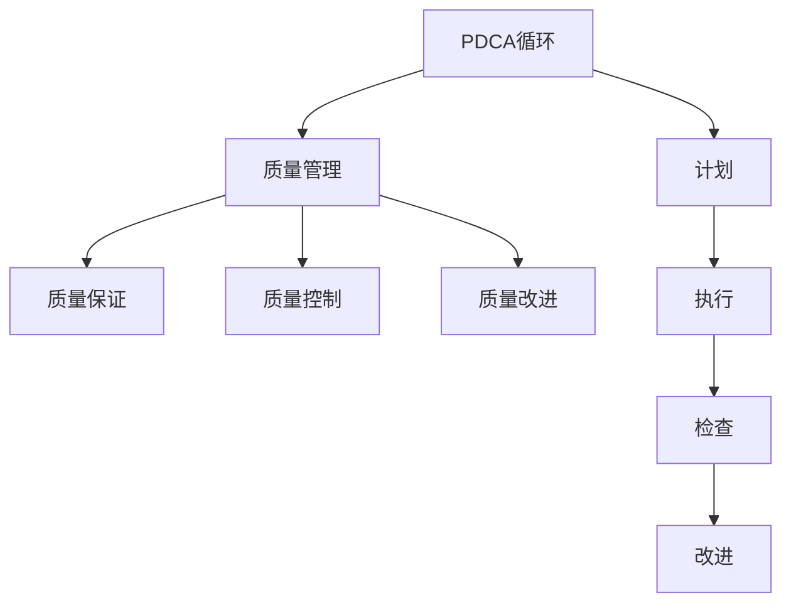

                 

# PDCA循环在质量管理中的应用

## 1. 背景介绍

### 1.1 问题由来

在现代制造业、服务业和软件开发等领域，质量管理（Quality Management）的重要性日益凸显。质量管理不仅仅是质量保证（Quality Assurance, QA），还包括质量规划（Quality Planning）、质量控制（Quality Control, QC）和质量改进（Quality Improvement）等环节。在这些环节中，PDCA（Plan-Do-Check-Act）循环作为系统化、科学化的质量管理方法，被广泛应用于各个行业。

PDCA循环由四个阶段组成：

- **计划（Plan）**：明确目标和行动计划。
- **执行（Do）**：实施计划，执行行动。
- **检查（Check）**：检查执行结果，评估效果。
- **改进（Act）**：根据检查结果，进行改进，并继续下一个PDCA循环。

PDCA循环的核心思想是通过不断反馈和改进，逐步提升产品或服务的质量。该方法简单有效，易于实施，被众多企业广泛采用。

### 1.2 问题核心关键点

PDCA循环作为一种系统化的质量管理方法，其核心在于通过四个阶段形成闭环，不断优化产品或服务的质量。PDCA循环的关键点包括：

- **计划阶段**：明确目标和行动计划，需要基于现状分析，设定具体、可衡量、可实现的目标。
- **执行阶段**：严格按照计划执行行动，确保质量控制标准得到遵守。
- **检查阶段**：通过数据和反馈，客观评估执行效果，确保质量目标达成。
- **改进阶段**：根据检查结果，进行改进，并在新的PDCA循环中不断提升。

PDCA循环的四个阶段相互作用，形成一个不断循环、持续改进的螺旋上升过程。该方法不仅适用于制造业，还适用于软件开发、项目管理、服务流程等各个领域。

## 2. 核心概念与联系

### 2.1 核心概念概述

为更好地理解PDCA循环在质量管理中的应用，本节将介绍几个密切相关的核心概念：

- **PDCA循环**：如上所述，PDCA循环是一种系统化的质量管理方法，通过不断反馈和改进，逐步提升产品或服务的质量。
- **质量管理**：包括质量规划、质量控制、质量保证和质量改进等多个环节，旨在通过持续改进，提高产品或服务的质量水平。
- **质量保证**：通过制定和实施质量标准、程序和计划，确保产品或服务的质量。
- **质量控制**：在生产或服务过程中，对质量要求和质量问题进行监控，确保质量标准得到遵守。
- **质量改进**：通过分析和改进过程，持续提高产品或服务的质量水平。

这些核心概念之间的逻辑关系可以通过以下Mermaid流程图来展示：



这个流程图展示了大语言模型的核心概念及其之间的关系：

1. PDCA循环是质量管理的核心工具，通过不断循环改进，确保质量目标的实现。
2. 质量管理包括质量保证、质量控制和质量改进等多个环节，PDCA循环是其中重要的一部分。
3. 质量保证、质量控制和质量改进等环节通过PDCA循环得到具体实施。
4. PDCA循环的四个阶段（计划、执行、检查、改进）通过质量管理各个环节相互关联。

这些概念共同构成了质量管理的基本框架，使得企业能够系统地、科学地提升产品或服务的质量水平。通过理解这些核心概念，我们可以更好地把握PDCA循环的工作原理和优化方向。

## 3. 核心算法原理 & 具体操作步骤
### 3.1 算法原理概述

PDCA循环的核心思想是通过不断反馈和改进，逐步提升产品或服务的质量。其具体实现分为四个阶段，每个阶段都有明确的目标和任务：

- **计划（Plan）**：明确目标和行动计划，需要基于现状分析，设定具体、可衡量、可实现的目标。
- **执行（Do）**：严格按照计划执行行动，确保质量控制标准得到遵守。
- **检查（Check）**：通过数据和反馈，客观评估执行效果，确保质量目标达成。
- **改进（Act）**：根据检查结果，进行改进，并在新的PDCA循环中不断提升。

PDCA循环通过不断循环、持续改进，确保产品或服务的质量达到最高水平。

### 3.2 算法步骤详解

PDCA循环的四个阶段可以详细描述如下：

**Step 1: 计划阶段（Plan）**

- **现状分析**：识别当前过程中存在的问题和质量不足，收集相关数据和信息。
- **目标设定**：基于现状分析，设定具体、可衡量、可实现的目标。
- **行动计划**：制定详细的行动计划，明确责任人、时间表和资源需求。

**Step 2: 执行阶段（Do）**

- **执行行动**：严格按照计划执行行动，确保质量控制标准得到遵守。
- **记录数据**：记录执行过程中的关键数据和信息，以便后续检查和分析。

**Step 3: 检查阶段（Check）**

- **数据分析**：通过数据分析，评估执行效果，检查目标是否达成。
- **反馈机制**：建立反馈机制，及时获取执行过程中的反馈信息，以便调整和改进。

**Step 4: 改进阶段（Act）**

- **问题识别**：根据检查结果，识别问题和改进空间。
- **改进措施**：制定改进措施，进行必要的调整和优化。
- **实施改进**：在新的PDCA循环中，实施改进措施，并持续监控改进效果。

**Step 5: 完成循环**：

- **评估总结**：评估改进措施的效果，总结经验教训。
- **下一步计划**：基于评估结果，制定下一步的质量改进计划，进入新的PDCA循环。

### 3.3 算法优缺点

PDCA循环作为一种系统化的质量管理方法，具有以下优点：

- **系统性**：通过不断循环和改进，确保质量管理的系统性和全面性。
- **持续改进**：不断发现和解决质量问题，持续提升产品或服务的质量水平。
- **易于实施**：四个阶段相对简单，易于理解和执行。
- **适应性强**：适用于各种规模和类型的企业，灵活应用。

同时，该方法也存在一定的局限性：

- **依赖管理层**：PDCA循环的成功依赖于管理层的决策和支持，需要管理层积极参与。
- **执行难度**：在执行阶段，需要严格按照计划执行，执行难度较大。
- **数据要求高**：需要收集和分析大量的数据，数据质量直接影响评估效果。
- **改进复杂**：改进措施的制定和实施较为复杂，需要系统化思考和资源投入。

尽管存在这些局限性，但就目前而言，PDCA循环仍是质量管理中最为经典和有效的方法之一。未来相关研究的重点在于如何进一步简化PDCA循环的步骤，提高其实用性和可操作性。

### 3.4 算法应用领域

PDCA循环作为一种通用的质量管理方法，在多个领域得到了广泛应用，例如：

- 制造业：通过PDCA循环，优化生产过程，提升产品质量。
- 服务业：通过PDCA循环，优化服务流程，提升客户满意度。
- 软件开发：通过PDCA循环，优化软件开发生命周期，提高软件质量。
- 项目管理：通过PDCA循环，优化项目管理流程，提升项目成功率。
- 医疗行业：通过PDCA循环，优化诊疗流程，提升医疗质量。
- 环境保护：通过PDCA循环，优化环保措施，提升环境质量。

除了上述这些领域外，PDCA循环还在教育、金融、农业等多个行业得到了应用，为各行业的质量管理提供了有力工具。

## 4. 数学模型和公式 & 详细讲解 & 举例说明
### 4.1 数学模型构建

PDCA循环的核心在于通过数据和反馈不断改进，其数学模型可以简单描述如下：

- **目标设定**：设定目标 $T_i$，$i=1,2,\ldots,N$。
- **执行效果**：记录执行过程中的数据 $D_i$，$i=1,2,\ldots,N$。
- **检查结果**：评估检查结果 $C_i$，$i=1,2,\ldots,N$。
- **改进措施**：制定改进措施 $A_i$，$i=1,2,\ldots,N$。

通过PDCA循环的四个阶段，不断优化和提升目标值 $T_i$。

### 4.2 公式推导过程

以制造业为例，假设有三个生产环节 $A$、$B$、$C$，每个环节的质量目标为 $T_i$，执行效果为 $D_i$，检查结果为 $C_i$，改进措施为 $A_i$。PDCA循环的过程可以描述如下：

- **计划阶段**：
  $$
  T_A = T_A^0 - \delta_A
  $$
  $$
  T_B = T_B^0 - \delta_B
  $$
  $$
  T_C = T_C^0 - \delta_C
  $$

- **执行阶段**：
  $$
  D_A = f_A(T_A)
  $$
  $$
  D_B = f_B(T_B)
  $$
  $$
  D_C = f_C(T_C)
  $$

- **检查阶段**：
  $$
  C_A = g_A(D_A)
  $$
  $$
  C_B = g_B(D_B)
  $$
  $$
  C_C = g_C(D_C)
  $$

- **改进阶段**：
  $$
  A_A = h_A(C_A)
  $$
  $$
  A_B = h_B(C_B)
  $$
  $$
  A_C = h_C(C_C)
  $$

其中，$f_i$ 和 $g_i$ 表示函数，$f_i$ 为执行函数，$g_i$ 为检查函数，$h_i$ 为改进函数。$\delta_i$ 表示目标设定值和实际值之间的差距。

### 4.3 案例分析与讲解

以制造业为例，假设有三个生产环节 $A$、$B$、$C$，每个环节的质量目标为 $T_i$，执行效果为 $D_i$，检查结果为 $C_i$，改进措施为 $A_i$。

- **现状分析**：识别当前过程中存在的问题和质量不足，收集相关数据和信息。
- **目标设定**：基于现状分析，设定具体、可衡量、可实现的目标。例如，环节 $A$ 的质量目标 $T_A^0=90\%$。
- **行动计划**：制定详细的行动计划，明确责任人、时间表和资源需求。例如，环节 $A$ 的行动计划为优化生产流程。
- **执行行动**：严格按照计划执行行动，确保质量控制标准得到遵守。例如，优化生产流程后，环节 $A$ 的执行效果 $D_A=92\%$。
- **记录数据**：记录执行过程中的关键数据和信息，以便后续检查和分析。例如，记录环节 $A$ 的执行效果 $D_A$。
- **数据分析**：通过数据分析，评估执行效果，检查目标是否达成。例如，检查结果 $C_A=91\%$，与目标 $T_A=90\%$ 差距较小。
- **反馈机制**：建立反馈机制，及时获取执行过程中的反馈信息，以便调整和改进。例如，根据检查结果 $C_A=91\%$，发现改进效果良好。
- **改进措施**：制定改进措施，进行必要的调整和优化。例如，环节 $A$ 的改进措施为进一步优化生产流程。
- **实施改进**：在新的PDCA循环中，实施改进措施，并持续监控改进效果。例如，优化生产流程后，环节 $A$ 的执行效果 $D_A'=95\%$。
- **评估总结**：评估改进措施的效果，总结经验教训。例如，环节 $A$ 的改进效果显著，总结优化生产流程的要点。
- **下一步计划**：基于评估结果，制定下一步的质量改进计划，进入新的PDCA循环。例如，制定环节 $A$ 的下一步计划为进一步优化生产流程。

## 5. 项目实践：代码实例和详细解释说明
### 5.1 开发环境搭建

在进行PDCA循环实践前，我们需要准备好开发环境。以下是使用Python进行数据分析和可视化实践的环境配置流程：

1. 安装Anaconda：从官网下载并安装Anaconda，用于创建独立的Python环境。

2. 创建并激活虚拟环境：
```bash
conda create -n pdca-env python=3.8 
conda activate pdca-env
```

3. 安装相关Python库：
```bash
pip install pandas numpy matplotlib seaborn jupyter notebook ipython
```

4. 安装R语言和RStudio：如果需要进行R语言分析，可以通过RStudio进行数据处理和可视化。

5. 安装统计分析软件：如果需要进行统计分析，可以选择安装SPSS、SAS等软件。

完成上述步骤后，即可在`pdca-env`环境中开始PDCA循环实践。

### 5.2 源代码详细实现

我们以制造业为例，假设有一个生产环节 $A$，其质量目标为 $T_A=90\%$，执行效果为 $D_A$，检查结果为 $C_A$，改进措施为 $A_A$。下面给出一个简单的Python代码实现：

```python
import pandas as pd
import matplotlib.pyplot as plt

# 假设数据
target_A = 90
delta_A = 2
D_A = [90, 92, 95, 98]
C_A = [91, 93, 95, 97]

# 构建数据表
data = pd.DataFrame({
    'T_A': [target_A - delta_A] * len(D_A),
    'D_A': D_A,
    'C_A': C_A
})

# 计算改进措施
A_A = [delta_A if x > target_A else -delta_A for x in C_A]

# 输出改进措施
print("改进措施：", A_A)

# 绘制PDCA循环图
plt.figure(figsize=(10, 6))
plt.plot(data['T_A'], label='目标设定')
plt.plot(data['D_A'], label='执行效果')
plt.plot(data['C_A'], label='检查结果')
plt.plot(data['T_A'] + A_A, label='改进措施')
plt.title('PDCA循环图')
plt.xlabel('时间')
plt.ylabel('质量目标')
plt.legend()
plt.show()
```

### 5.3 代码解读与分析

让我们再详细解读一下关键代码的实现细节：

**数据表构建**：
- 假设数据：设定目标 $T_A=90$，执行效果 $D_A=[90, 92, 95, 98]$，检查结果 $C_A=[91, 93, 95, 97]$。
- 构建数据表：使用Pandas库，将目标、执行效果和检查结果存储在数据表中。

**改进措施计算**：
- 改进措施：根据检查结果 $C_A$，计算改进措施 $A_A$。如果 $C_A > T_A$，则表示目标达成，改进措施为 $0$；如果 $C_A < T_A$，则表示目标未达成，改进措施为 $-2$。

**改进措施输出**：
- 输出改进措施：根据改进措施 $A_A$，输出改进措施的具体值。

**PDCA循环图绘制**：
- 绘制PDCA循环图：使用Matplotlib库，绘制目标设定、执行效果、检查结果和改进措施的折线图，展示PDCA循环的过程。

可以看到，通过Python编程，我们可以很方便地实现PDCA循环的各个步骤，并进行数据可视化。

## 6. 实际应用场景
### 6.1 智能制造

在智能制造领域，PDCA循环被广泛应用于生产过程的优化。传统制造业往往面临设备故障率高、生产效率低等问题，通过PDCA循环，可以持续改进生产过程，提升产品质量和生产效率。

在技术实现上，可以收集生产过程中的各种数据，如设备状态、生产速度、产品质量等，对生产过程进行监控和分析。通过PDCA循环，不断优化生产流程，调整设备参数，减少故障率，提升生产效率。例如，在汽车制造中，通过PDCA循环，不断优化装配线，提升整车装配的精度和速度，降低废品率。

### 6.2 金融风险管理

金融风险管理是金融行业的重要环节，通过PDCA循环，可以有效识别和控制各种风险。在实际操作中，可以定期评估风险模型和风险控制措施的效果，进行持续改进。

例如，在股票交易中，通过PDCA循环，对交易模型进行优化，调整仓位控制策略，减少交易风险。在债券投资中，通过PDCA循环，对信用风险和利率风险进行持续监控和评估，制定风险控制措施。在信贷业务中，通过PDCA循环，对客户信用评分模型进行优化，提升信用风险识别和控制能力。

### 6.3 医疗质量控制

医疗质量控制是医疗行业的重要环节，通过PDCA循环，可以有效提升医疗服务质量和患者满意度。在实际操作中，可以定期评估医疗服务流程和质量控制措施的效果，进行持续改进。

例如，在医院管理中，通过PDCA循环，对患者入院流程进行优化，提升患者入院效率和满意度。在手术质量控制中，通过PDCA循环，对手术流程和操作规范进行优化，提升手术成功率和患者安全。在药品质量控制中，通过PDCA循环，对药品生产流程和质量控制措施进行优化，提升药品质量和安全。

## 7. 工具和资源推荐
### 7.1 学习资源推荐

为了帮助开发者系统掌握PDCA循环的理论基础和实践技巧，这里推荐一些优质的学习资源：

1. 《质量管理理论与实践》：系统介绍质量管理的理论基础和实践技巧，适合质量管理人员学习。
2. 《PDCA循环应用指南》：详细讲解PDCA循环在各个行业中的应用案例，适合具体行业从业者参考。
3. 《六西格玛管理》：介绍六西格玛管理的理论和方法，适合企业质量管理实践者参考。
4. 《质量控制统计方法》：系统讲解质量控制中的统计方法，适合质量管理人员学习。
5. 《ISO 9001质量管理体系》：介绍ISO 9001质量管理体系的标准和要求，适合企业质量管理实践者参考。

通过对这些资源的学习实践，相信你一定能够快速掌握PDCA循环的精髓，并用于解决实际的质量管理问题。

### 7.2 开发工具推荐

PDCA循环的实施需要依赖各种工具和资源，以下是几款常用的工具：

1. Excel：常用的数据分析工具，支持数据的输入、处理和分析，方便PDCA循环的实施。
2. Python：强大的编程语言，支持数据分析、可视化、自动化等多种功能，适合PDCA循环的编程实现。
3. R语言：专业的统计分析语言，支持复杂的统计模型和数据可视化，适合质量管理中的数据分析。
4. JMP：专业的统计分析软件，支持数据分析、可视化和自动化等多种功能，适合质量管理中的数据分析。
5. Tableau：数据可视化工具，支持数据的可视化展示，方便PDCA循环的实施和监控。

合理利用这些工具，可以显著提升PDCA循环的实施效率，加快质量管理的创新迭代。

### 7.3 相关论文推荐

PDCA循环作为一种经典的质量管理方法，得到了广泛的研究和应用。以下是几篇具有代表性的相关论文，推荐阅读：

1. "PDCA循环在制造业中的应用"：介绍了PDCA循环在制造业中的具体应用，并给出了案例分析。
2. "PDCA循环在金融风险管理中的应用"：介绍了PDCA循环在金融风险管理中的具体应用，并给出了案例分析。
3. "PDCA循环在医疗质量控制中的应用"：介绍了PDCA循环在医疗质量控制中的具体应用，并给出了案例分析。
4. "PDCA循环的改进与优化"：介绍了PDCA循环的改进方法，并给出了具体的应用案例。
5. "PDCA循环的理论基础与实践技巧"：详细讲解了PDCA循环的理论基础和实践技巧，适合质量管理人员学习。

这些论文代表了PDCA循环研究的发展脉络，通过学习这些前沿成果，可以帮助质量管理人员把握学科前进方向，激发更多的创新灵感。

## 8. 总结：未来发展趋势与挑战
### 8.1 总结

本文对PDCA循环在质量管理中的应用进行了全面系统的介绍。首先阐述了PDCA循环的背景和意义，明确了PDCA循环在质量管理中的核心作用。其次，从原理到实践，详细讲解了PDCA循环的数学模型和操作步骤，给出了PDCA循环的代码实现和可视化方法。同时，本文还广泛探讨了PDCA循环在智能制造、金融风险管理、医疗质量控制等多个领域的应用前景，展示了PDCA循环的广泛适用性。此外，本文精选了PDCA循环的学习资源、开发工具和相关论文，力求为读者提供全方位的技术指引。

通过本文的系统梳理，可以看到，PDCA循环作为质量管理的重要工具，具有简单高效、易于实施的特点，在各个行业得到了广泛应用。未来，随着质量管理需求的不断提升，PDCA循环将继续发挥重要作用，为企业质量管理提供有力工具。

### 8.2 未来发展趋势

展望未来，PDCA循环将呈现以下几个发展趋势：

1. **智能化**：随着人工智能和数据分析技术的不断发展，PDCA循环将更加智能化，可以通过大数据和机器学习技术，自动优化和改进质量管理流程。
2. **自动化**：通过自动化技术，如机器人和智能设备，实现生产过程和质量控制流程的自动化，进一步提升效率和质量。
3. **实时化**：通过实时数据采集和处理，实现PDCA循环的实时监控和改进，提高质量管理的响应速度和精确度。
4. **可视化**：通过数据可视化技术，实时展示PDCA循环的执行效果和改进措施，便于质量管理人员的监控和决策。
5. **集成化**：将PDCA循环与其他质量管理工具，如六西格玛管理、精益生产等，进行集成，形成一体化的质量管理平台。
6. **国际化**：将PDCA循环推广到全球范围内的企业，帮助企业提升质量管理水平，应对全球化的质量管理挑战。

这些趋势凸显了PDCA循环的广阔前景，PDCA循环将继续在质量管理中发挥重要作用，并不断提升其智能化、自动化和实时化水平。

### 8.3 面临的挑战

尽管PDCA循环已经取得了显著的成效，但在其应用过程中，仍然面临诸多挑战：

1. **数据质量问题**：PDCA循环依赖于高质量的数据，如果数据质量差，将直接影响评估和改进效果。
2. **执行难度高**：在执行阶段，需要严格按照计划执行，执行难度较大，容易出现偏差。
3. **改进复杂**：改进措施的制定和实施较为复杂，需要系统化思考和资源投入。
4. **资源投入大**：PDCA循环需要投入大量的人力、物力和财力，实施成本较高。
5. **文化差异**：不同企业或行业之间的文化差异，可能导致PDCA循环的实施效果不同。
6. **技术局限**：现有技术的局限性，可能导致PDCA循环的实施效果受限。

尽管存在这些挑战，但通过不断改进和优化，PDCA循环仍将在质量管理中发挥重要作用，帮助企业提升质量管理水平。

### 8.4 研究展望

面对PDCA循环所面临的挑战，未来的研究需要在以下几个方面寻求新的突破：

1. **数据质量提升**：通过数据清洗、预处理等技术，提升数据质量，确保PDCA循环的实施效果。
2. **执行策略优化**：引入先进的管理工具和技术，如精益管理、六西格玛管理等，优化执行策略，降低执行难度。
3. **改进措施简化**：通过研究和应用先进的技术和方法，简化改进措施，降低实施难度和成本。
4. **技术集成应用**：将PDCA循环与其他质量管理工具和技术进行集成，形成一体化的质量管理平台，提升实施效果。
5. **文化融合**：推动企业文化建设，建立以质量为导向的企业文化，提升PDCA循环的实施效果。
6. **技术创新**：引入人工智能、大数据等先进技术，推动PDCA循环的智能化和自动化，提升质量管理的水平。

这些研究方向的探索，必将引领PDCA循环迈向更高的台阶，为企业的质量管理提供有力支持。相信通过不断创新和优化，PDCA循环将在质量管理中发挥更大作用，帮助企业提升质量管理水平，实现持续改进。

## 9. 附录：常见问题与解答
**Q1：PDCA循环适用于所有企业吗？**

A: PDCA循环作为一种通用的质量管理方法，适用于各种规模和类型的企业。无论是制造业、服务业还是科技公司，都可以应用PDCA循环进行质量管理。但在实施过程中，需要结合企业的具体情况，进行适当调整和优化。

**Q2：PDCA循环的四个阶段如何分配时间？**

A: PDCA循环的四个阶段时间分配因人而异，没有固定的时间标准。一般来说，计划阶段和改进阶段时间较长，执行阶段和检查阶段时间较短。具体时间分配需要根据企业的实际情况和PDCA循环的目标来确定。

**Q3：PDCA循环是否需要定期进行？**

A: PDCA循环需要定期进行，以确保质量管理的持续改进。定期进行的周期可以根据企业的实际情况和质量管理的需要来确定，一般建议每季度或每半年进行一次。

**Q4：PDCA循环在实际应用中需要注意哪些问题？**

A: PDCA循环在实际应用中需要注意以下几个问题：
1. 数据质量问题：确保数据准确性和完整性，避免因数据质量问题影响PDCA循环的实施效果。
2. 执行难度高：在执行阶段，需要严格按照计划执行，避免执行偏差。
3. 改进措施简化：制定简单可行的改进措施，降低改进难度和成本。
4. 资源投入大：PDCA循环需要投入大量的人力、物力和财力，需要合理规划和控制成本。
5. 文化差异：不同企业或行业之间的文化差异，可能导致PDCA循环的实施效果不同。

通过合理规划和管理，PDCA循环可以在质量管理中发挥重要作用，帮助企业提升质量管理水平。

---

作者：禅与计算机程序设计艺术 / Zen and the Art of Computer Programming

