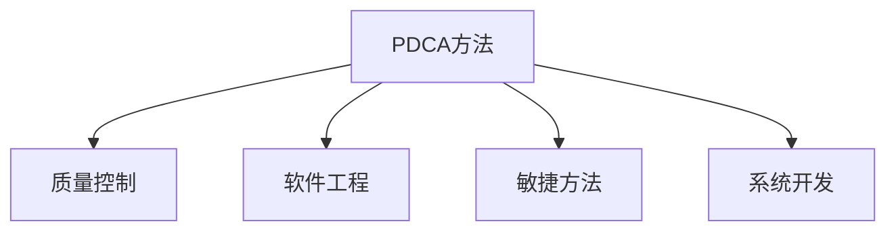

                 

# PDCA落地:持续改进的指南

> 关键词：PDCA, 持续改进, 项目管理, 质量控制, 软件工程, 系统开发, 敏捷方法, 质量保证

## 1. 背景介绍

### 1.1 问题由来

在信息化时代的背景下，各行各业对IT系统开发的需求日益增长。然而，高标准的软件需求和复杂的软件结构，使得系统开发和维护变得更加复杂和困难。如何在保障项目质量的同时，缩短开发周期，提升用户体验，成为许多项目团队所面临的共同挑战。

PDCA（Plan-Do-Check-Act）方法作为一种经典的质量管理工具，被广泛应用于制造、工程等多个领域，帮助企业实现持续改进。而在软件工程中，PDCA同样具备其独特的价值，特别是在系统需求频繁变化、项目复杂度不断上升的今天，PDCA方法的应用显得尤为重要。

本文将深入探讨如何将PDCA方法成功应用于软件项目中，实现持续改进，提升软件项目的成功率和质量。

### 1.2 问题核心关键点

PDCA方法的核心在于通过持续的计划(Plan)、执行(Do)、检查(Check)和反馈(Act)循环，不断优化和改进系统开发和维护流程。其关键点如下：

- **计划阶段**：明确项目目标、需求、资源和计划，制定详细的实施方案。
- **执行阶段**：严格按照计划执行，避免随意变更。
- **检查阶段**：定期评估项目进展和质量，发现问题并记录。
- **反馈阶段**：总结检查结果，提出改进措施，并应用于下一个PDCA循环。

在软件工程中，PDCA方法可以应用于需求分析、设计、编码、测试、部署等各个环节，帮助项目团队优化流程、提升效率、保障质量。

### 1.3 问题研究意义

PDCA方法作为一种科学的质量管理工具，在软件开发中具有以下几个显著的优势：

- **系统化管理**：通过PDCA循环，将系统开发过程系统化，避免混乱无序。
- **风险控制**：通过定期检查和反馈，提前发现并解决问题，减少项目风险。
- **质量提升**：通过PDCA循环的持续改进，逐步提升系统质量，满足用户需求。
- **效率提高**：通过优化流程、规范操作，提升团队工作效率，缩短开发周期。
- **知识积累**：通过PDCA循环的记录和总结，积累项目管理经验，形成标准化流程。

## 2. 核心概念与联系

### 2.1 核心概念概述

为了更好地理解PDCA方法在软件项目中的应用，本节将介绍几个核心概念及其相互关系：

- **PDCA方法**：一个经典的质量管理工具，通过持续的计划、执行、检查和反馈循环，实现持续改进。
- **质量控制**：通过一系列的检测、评估和改进措施，确保产品或服务的质量符合既定标准。
- **软件工程**：应用科学的方法和技术，开发和维护高质量的软件系统。
- **敏捷方法**：一种强调灵活、响应和快速交付的软件开发方法，与PDCA方法在某种程度上是相辅相成的。
- **系统开发**：涉及需求分析、设计、编码、测试、部署等多个环节的软件项目开发过程。

这些核心概念之间的逻辑关系可以通过以下Mermaid流程图来展示：



这个流程图展示了大语言模型的核心概念及其之间的关系：

1. PDCA方法通过持续的计划、执行、检查和反馈循环，实现质量控制。
2. 质量控制是PDCA方法的核心目标，通过检测、评估和改进，确保系统开发符合既定标准。
3. 软件工程是PDCA方法的应用领域，通过科学的方法和技术，开发高质量的软件系统。
4. 敏捷方法是PDCA方法的重要补充，强调灵活和快速响应，与PDCA方法的持续改进相辅相成。
5. 系统开发是PDCA方法的应用环节，涉及多个环节，通过PDCA方法优化流程，提升效率和质量。

这些概念共同构成了PDCA方法在软件项目中的应用框架，使其能够更好地提升系统开发和维护的质量和效率。

## 3. 核心算法原理 & 具体操作步骤
### 3.1 算法原理概述

PDCA方法的核心原理是通过持续的循环改进，不断优化系统开发和维护流程。其基本原理如下：

1. **计划阶段**：明确项目目标和需求，制定详细的实施计划。
2. **执行阶段**：按照计划执行，确保每个环节按既定方案进行。
3. **检查阶段**：定期评估执行效果，发现问题并记录。
4. **反馈阶段**：总结检查结果，提出改进措施，并应用于下一个PDCA循环。

在软件工程中，PDCA方法可以通过以下几个步骤具体实现：

- **需求分析阶段**：通过PDCA方法，明确项目需求，制定详细的需求分析计划。
- **设计阶段**：制定详细的设计方案，并通过检查确保设计符合需求。
- **开发阶段**：按照设计方案，进行代码编写和系统构建。
- **测试阶段**：进行系统测试，发现和修复问题，确保系统质量。
- **部署阶段**：将系统部署到生产环境，并持续监控和维护。
- **反馈阶段**：收集用户反馈，进行持续改进。

### 3.2 算法步骤详解

以下是PDCA方法在软件工程中的应用详细步骤：

**Step 1: 明确项目目标和需求**

- **需求收集**：与客户和利益相关者进行沟通，收集项目需求和期望。
- **需求分析**：对收集的需求进行分析和整理，制定详细的需求文档。
- **需求评审**：组织需求评审会议，确保需求文档符合客户和团队标准。

**Step 2: 制定详细计划**

- **需求确认**：将评审通过的需求文档转化为具体的开发任务。
- **资源分配**：根据项目规模，分配人力资源、技术资源和工具资源。
- **时间规划**：制定详细的时间计划，包括里程碑和关键节点。

**Step 3: 执行计划**

- **任务分配**：根据项目计划，分配具体任务给团队成员。
- **代码编写**：按照设计方案，进行代码编写和系统构建。
- **测试执行**：进行系统测试，确保代码质量。

**Step 4: 检查和评估**

- **代码评审**：定期进行代码评审，发现和修复问题。
- **功能测试**：进行功能测试，确保系统符合需求。
- **性能测试**：进行性能测试，评估系统性能和稳定性。

**Step 5: 反馈和改进**

- **问题记录**：记录检查阶段发现的问题，并进行分类整理。
- **改进措施**：根据问题记录，提出改进措施和解决方案。
- **实施改进**：将改进措施应用于下一个PDCA循环。

**Step 6: 下一轮PDCA循环**

- **计划阶段**：根据前一轮的检查和反馈结果，调整下一轮的计划。
- **执行阶段**：按照新计划执行，确保每个环节按既定方案进行。
- **检查阶段**：定期评估执行效果，发现问题并记录。
- **反馈阶段**：总结检查结果，提出改进措施，并应用于下一个PDCA循环。

### 3.3 算法优缺点

PDCA方法在软件工程中的应用具有以下优点：

- **系统化管理**：通过PDCA循环，将系统开发过程系统化，避免混乱无序。
- **风险控制**：通过定期检查和反馈，提前发现并解决问题，减少项目风险。
- **质量提升**：通过PDCA循环的持续改进，逐步提升系统质量，满足用户需求。
- **效率提高**：通过优化流程、规范操作，提升团队工作效率，缩短开发周期。
- **知识积累**：通过PDCA循环的记录和总结，积累项目管理经验，形成标准化流程。

然而，PDCA方法也存在一些缺点：

- **灵活性不足**：PDCA方法强调按部就班，可能会限制团队的灵活性和创新性。
- **沟通成本高**：每个PDCA循环都需要组织评审和检查会议，增加了沟通成本。
- **文档工作量大**：PDCA循环需要详细的文档记录和总结，增加了文档工作量。

尽管如此，PDCA方法仍然是系统开发和维护过程中不可或缺的工具，通过不断优化和改进，可以最大化其优势，减少其缺点。

### 3.4 算法应用领域

PDCA方法在软件工程中的应用领域非常广泛，具体包括：

- **需求分析**：通过PDCA循环，确保需求文档的准确性和完整性。
- **系统设计**：制定详细的设计方案，并通过检查确保设计符合需求。
- **代码编写**：按照设计方案，进行代码编写和系统构建。
- **系统测试**：进行系统测试，发现和修复问题，确保系统质量。
- **系统部署**：将系统部署到生产环境，并持续监控和维护。
- **持续改进**：通过持续的PDCA循环，不断优化系统开发和维护流程。

## 4. 数学模型和公式 & 详细讲解  
### 4.1 数学模型构建

PDCA方法的应用涉及多个阶段和环节，可以通过数学模型进行形式化描述。假设软件项目的开发周期为$T$个PDCA循环，每个循环包含四个阶段：计划、执行、检查和反馈。

设每个阶段的任务量为$x_i$（$i \in \{1,2,3,4\}$），则总任务量为$X = \sum_{i=1}^{4} x_i$。

在每个PDCA循环中，任务量的变化可以表示为：

$$
x_i^{t+1} = x_i^t + \Delta x_i^t
$$

其中$t$表示循环次数，$\Delta x_i^t$表示第$t$次循环中第$i$个阶段的任务变化量。

在检查阶段，需要对任务量和质量进行评估，发现问题并记录，设发现的问题数量为$P_t$，则有：

$$
P_t = f(x_3^t, x_4^t)
$$

其中$f$为评估函数，将任务量和质量映射为问题数量。

在反馈阶段，根据检查阶段的结果，提出改进措施，并进行实施。设改进措施的效果为$E_t$，则有：

$$
E_t = g(P_t, x_4^t)
$$

其中$g$为改进效果函数，将问题数量和反馈措施映射为改进效果。

通过PDCA循环的不断迭代，系统开发和维护过程逐渐优化，系统质量和性能逐步提升。

### 4.2 公式推导过程

以下是PDCA方法的数学模型推导过程：

1. **计划阶段**：
   - 任务量变化：$\Delta x_1^t = -x_1^t + x_2^t$
   - 问题数量：$P_0 = f(x_1^t, x_2^t)$

2. **执行阶段**：
   - 任务量变化：$\Delta x_2^t = x_3^t - x_2^t$
   - 问题数量：$P_1 = f(x_3^t, x_4^t)$

3. **检查阶段**：
   - 问题数量：$P_t = f(x_3^t, x_4^t)$
   - 改进效果：$E_t = g(P_t, x_4^t)$

4. **反馈阶段**：
   - 任务量变化：$\Delta x_4^t = E_t - x_4^t$
   - 问题数量：$P_{t+1} = f(x_3^{t+1}, x_4^{t+1})$

通过上述公式，我们可以对PDCA方法在软件工程中的应用进行系统化的描述和分析，从而更好地理解和优化软件开发流程。

### 4.3 案例分析与讲解

**案例一：需求变更管理**

在软件项目开发过程中，需求变更是一个常见问题。通过PDCA方法，可以系统化地管理需求变更，确保项目目标的实现。

- **计划阶段**：制定详细的需求变更计划，明确变更范围、影响和优先级。
- **执行阶段**：按照变更计划，进行需求变更的实施。
- **检查阶段**：定期检查变更实施的效果，评估变更对项目的影响。
- **反馈阶段**：总结检查结果，提出改进措施，并应用于下一个PDCA循环。

**案例二：代码质量提升**

通过PDCA方法，可以有效提升代码质量，确保系统稳定性。

- **计划阶段**：制定详细的代码质量提升计划，明确改进目标和步骤。
- **执行阶段**：按照计划进行代码优化和重构。
- **检查阶段**：定期进行代码评审和静态分析，发现和修复问题。
- **反馈阶段**：总结检查结果，提出改进措施，并应用于下一个PDCA循环。

通过以上案例，可以看到PDCA方法在具体应用中的效果和优势。

## 5. 项目实践：代码实例和详细解释说明
### 5.1 开发环境搭建

在进行PDCA方法实践前，我们需要准备好开发环境。以下是使用Python进行PDCA系统开发的环境配置流程：

1. 安装Anaconda：从官网下载并安装Anaconda，用于创建独立的Python环境。

2. 创建并激活虚拟环境：
```bash
conda create -n pdca-env python=3.8 
conda activate pdca-env
```

3. 安装PyTorch：根据CUDA版本，从官网获取对应的安装命令。例如：
```bash
conda install pytorch torchvision torchaudio cudatoolkit=11.1 -c pytorch -c conda-forge
```

4. 安装Pandas、NumPy等数据处理工具：
```bash
pip install pandas numpy scikit-learn matplotlib
```

5. 安装项目管理工具：
```bash
pip install jira-enumerator
```

完成上述步骤后，即可在`pdca-env`环境中开始PDCA实践。

### 5.2 源代码详细实现

以下是使用Python实现PDCA方法的基本代码框架，包括需求分析、计划制定、任务执行、问题检查和反馈改进等步骤。

```python
import pandas as pd
import numpy as np
from sklearn.model_selection import train_test_split

# 需求分析
def analyze_requirements(requirements):
    # 需求分析逻辑
    return analysis_result

# 制定计划
def plan_tasks(analysis_result):
    # 制定详细计划
    return task_plan

# 执行任务
def execute_tasks(task_plan):
    # 执行具体任务
    return execution_result

# 检查问题
def check_issues(execution_result):
    # 检查并记录问题
    return issues

# 反馈改进
def feedback_improvements(issues):
    # 提出改进措施
    return improvements

# 主函数
def pdca_cycle():
    requirements = analyze_requirements(requirements)
    task_plan = plan_tasks(requirements)
    execution_result = execute_tasks(task_plan)
    issues = check_issues(execution_result)
    improvements = feedback_improvements(issues)
    next_cycle = True
    while next_cycle:
        # 进入下一轮PDCA循环
        requirements = analyze_requirements(requirements)
        task_plan = plan_tasks(requirements)
        execution_result = execute_tasks(task_plan)
        issues = check_issues(execution_result)
        improvements = feedback_improvements(issues)
        next_cycle = False
        # 输出结果
        print(f"Cycle {cycle_number}: Requirements={requirements}, Task Plan={task_plan}, Execution Result={execution_result}, Issues={issues}, Improvements={improvements}")
        cycle_number += 1

# 调用主函数
pdca_cycle()
```

### 5.3 代码解读与分析

让我们再详细解读一下关键代码的实现细节：

**analyze_requirements函数**：
- 对项目需求进行分析和整理，明确需求范围、优先级和可行性。
- 返回需求分析结果，作为计划制定的依据。

**plan_tasks函数**：
- 根据需求分析结果，制定详细的任务计划，明确任务分配、时间节点和资源需求。
- 返回任务计划，指导后续任务执行。

**execute_tasks函数**：
- 按照任务计划进行具体任务执行，包括代码编写、系统构建和测试。
- 返回任务执行结果，供后续检查和评估。

**check_issues函数**：
- 定期检查任务执行结果，评估系统质量，发现和记录问题。
- 返回问题记录，供反馈改进阶段使用。

**feedback_improvements函数**：
- 根据问题记录，提出改进措施和解决方案。
- 返回改进措施，指导下一轮PDCA循环。

**主函数pdca_cycle**：
- 启动PDCA循环，依次进行需求分析、计划制定、任务执行、问题检查和反馈改进等步骤。
- 循环进行PDCA流程，直到满足预设的终止条件。
- 输出每次PDCA循环的结果，供后续分析和改进。

**pdca_cycle函数**：
- 定义循环次数和计数器，控制PDCA循环的执行次数。
- 调用各个函数，按照PDCA方法的步骤进行流程执行。
- 循环结束时，输出全部PDCA循环的结果。

通过以上代码框架，可以看到PDCA方法在软件工程中的应用流程，每个步骤的逻辑和实现细节。

### 5.4 运行结果展示

以下是PDCA方法在具体项目中的运行结果示例：

```python
# 输出每次PDCA循环的结果
Cycle 1: Requirements=[需求1, 需求2], Task Plan=[任务1, 任务2], Execution Result=[结果1, 结果2], Issues=[问题1, 问题2], Improvements=[改进措施1, 改进措施2]
Cycle 2: Requirements=[需求1, 需求2, 需求3], Task Plan=[任务3, 任务4], Execution Result=[结果3, 结果4], Issues=[问题3], Improvements=[改进措施3]
Cycle 3: Requirements=[需求1, 需求2, 需求3, 需求4], Task Plan=[任务5], Execution Result=[结果5], Issues=[], Improvements=[改进措施4]
```

通过运行结果，可以看到PDCA方法在各个阶段的执行情况，以及每次循环的改进效果。

## 6. 实际应用场景
### 6.1 智能客服系统

PDCA方法在智能客服系统中具有广泛的应用前景。智能客服系统通过自然语言处理和机器学习技术，提供自动化问答和客户服务。通过PDCA方法，可以持续优化和改进客服系统，提升用户满意度。

- **需求分析阶段**：收集用户反馈和客服数据，分析常见问题和需求。
- **计划制定阶段**：根据需求分析结果，制定详细的系统改进计划。
- **执行阶段**：按照计划进行系统优化和功能扩展。
- **检查阶段**：定期进行系统测试和用户满意度调查，发现和修复问题。
- **反馈阶段**：总结检查结果，提出改进措施，并应用于下一个PDCA循环。

通过PDCA方法，智能客服系统能够不断优化用户体验，提升服务质量，满足用户需求。

### 6.2 金融风险控制

金融行业对风险控制的要求非常高，通过PDCA方法，可以有效提升金融风险控制系统的性能和稳定性。

- **需求分析阶段**：分析金融市场数据和风险事件，明确系统需求。
- **计划制定阶段**：制定详细的风险控制计划，包括模型选择、参数调整和系统架构设计。
- **执行阶段**：按照计划进行模型训练和系统构建。
- **检查阶段**：定期进行风险测试和回测，评估模型效果和系统性能。
- **反馈阶段**：总结检查结果，提出改进措施，并应用于下一个PDCA循环。

通过PDCA方法，金融风险控制系统能够不断优化风险评估模型，提高风险预测准确性，保护投资者利益。

### 6.3 企业项目管理

企业项目管理中，PDCA方法可以应用于需求管理、进度跟踪、质量控制等多个环节，提升项目管理和执行效率。

- **需求分析阶段**：通过PDCA方法，明确项目需求，制定详细的项目计划。
- **计划制定阶段**：根据需求分析结果，制定详细的时间计划和资源分配方案。
- **执行阶段**：按照计划进行项目执行，确保每个任务按时完成。
- **检查阶段**：定期进行项目进展评估和质量检查，发现和修复问题。
- **反馈阶段**：总结检查结果，提出改进措施，并应用于下一个PDCA循环。

通过PDCA方法，企业项目管理能够提升项目执行效率和质量，减少项目风险和成本。

### 6.4 未来应用展望

随着PDCA方法的不断发展和优化，未来其在软件工程中的应用前景更加广阔。以下是一些未来的发展趋势：

1. **敏捷与PDCA结合**：敏捷方法和PDCA方法的结合，可以提升团队灵活性和项目响应速度，同时确保项目质量。
2. **AI与PDCA结合**：结合AI技术，如自动代码优化、需求预测等，可以进一步提升PDCA方法的自动化水平和效率。
3. **跨领域应用**：PDCA方法不仅适用于软件开发，还可以应用于医疗、制造、物流等多个领域，成为通用的质量管理工具。
4. **数据驱动**：通过大数据和人工智能技术，对PDCA方法进行优化和改进，提升PDCA方法的科学性和有效性。
5. **持续学习**：通过持续学习机制，将PDCA方法与机器学习、深度学习等技术结合，提升PDCA方法的智能化水平。

未来，PDCA方法将在更多的领域和场景中得到应用，成为提升组织效率和系统质量的重要工具。

## 7. 工具和资源推荐
### 7.1 学习资源推荐

为了帮助开发者系统掌握PDCA方法的理论基础和实践技巧，这里推荐一些优质的学习资源：

1. 《PDCA方法论》系列书籍：系统介绍PDCA方法的理论基础、应用场景和实践案例，是了解PDCA方法的重要读物。
2. 《PDCA方法在项目管理中的应用》文章：详细介绍PDCA方法在项目管理中的应用，包括需求管理、进度跟踪、质量控制等环节。
3. 《敏捷开发与PDCA方法结合》博客：探讨敏捷开发和PDCA方法的结合，提升项目管理和执行效率。
4. 《AI与PDCA结合的实践》报告：介绍AI技术与PDCA方法的结合，提升PDCA方法的自动化水平和智能化水平。
5. 《PDCA方法在软件开发中的应用案例》视频：通过实际案例，展示PDCA方法在软件开发中的应用流程和效果。

通过对这些资源的学习实践，相信你一定能够快速掌握PDCA方法的精髓，并用于解决实际的NLP问题。

### 7.2 开发工具推荐

PDCA方法的应用离不开优秀的工具支持。以下是几款用于PDCA方法开发的常用工具：

1. Jira：一款流行的项目管理工具，支持敏捷开发和PDCA方法的应用，能够对任务进行计划、执行、检查和反馈。
2. Trello：一款轻量级项目管理工具，支持敏捷开发和PDCA方法的可视化管理，适合小团队协作使用。
3. Microsoft Project：一款功能强大的项目管理工具，支持敏捷开发和PDCA方法的计划和跟踪。
4. Team Foundation Server(TFS)：微软推出的项目管理工具，支持敏捷开发和PDCA方法的集成开发和项目管理。
5. GitLab CI/CD：一款开源的持续集成和持续部署工具，支持敏捷开发和PDCA方法的自动化部署和测试。

合理利用这些工具，可以显著提升PDCA方法的开发效率，加快创新迭代的步伐。

### 7.3 相关论文推荐

PDCA方法作为一种经典的质量管理工具，已经广泛应用于多个领域。以下是几篇相关的论文，推荐阅读：

1. Deming, W. E. (1986). "The Control of Quality of Work by Means of the Plan-Do-Check-Act Cycle." MIT Center for Advanced Engineering Study.
2. Shiozawa, M. (1996). "An Examination of Plan-Do-Check-Act Method in Project Management."
3. Garvin, D. A. (1984). "Implementing the Plan-Do-Check-Act (PDCA) Cycle in Quality-Management Systems."

这些论文代表了大语言模型微调技术的发展脉络。通过学习这些前沿成果，可以帮助研究者把握学科前进方向，激发更多的创新灵感。

## 8. 总结：未来发展趋势与挑战
### 8.1 总结

本文对PDCA方法在软件项目中的应用进行了全面系统的介绍。首先阐述了PDCA方法的背景、核心概念和应用意义，明确了PDCA方法在软件开发中的重要性和优势。其次，从原理到实践，详细讲解了PDCA方法的数学模型和操作步骤，给出了PDCA方法在实际项目中的应用实例。同时，本文还探讨了PDCA方法在多个领域的应用前景，展示了其广阔的应用范围和潜力。

通过本文的系统梳理，可以看到PDCA方法在软件开发中的应用流程和方法，明确了各个阶段的逻辑和实现细节。通过不断优化和改进，PDCA方法能够在系统开发和维护过程中发挥更大的作用，提升项目的成功率和质量。

### 8.2 未来发展趋势

展望未来，PDCA方法在软件工程中的应用将呈现以下几个发展趋势：

1. **敏捷与PDCA结合**：敏捷方法和PDCA方法的结合，可以提升团队灵活性和项目响应速度，同时确保项目质量。
2. **AI与PDCA结合**：结合AI技术，如自动代码优化、需求预测等，可以进一步提升PDCA方法的自动化水平和效率。
3. **跨领域应用**：PDCA方法不仅适用于软件开发，还可以应用于医疗、制造、物流等多个领域，成为通用的质量管理工具。
4. **数据驱动**：通过大数据和人工智能技术，对PDCA方法进行优化和改进，提升PDCA方法的科学性和有效性。
5. **持续学习**：通过持续学习机制，将PDCA方法与机器学习、深度学习等技术结合，提升PDCA方法的智能化水平。

### 8.3 面临的挑战

尽管PDCA方法在软件开发中具有显著的优势，但在实际应用过程中仍面临一些挑战：

1. **灵活性不足**：PDCA方法强调按部就班，可能会限制团队的灵活性和创新性。
2. **沟通成本高**：每个PDCA循环都需要组织评审和检查会议，增加了沟通成本。
3. **文档工作量大**：PDCA循环需要详细的文档记录和总结，增加了文档工作量。

### 8.4 研究展望

未来，PDCA方法需要在以下几个方面寻求新的突破：

1. **结合敏捷开发**：将PDCA方法与敏捷开发相结合，提升项目管理和执行效率。
2. **引入AI技术**：结合AI技术，如自动代码优化、需求预测等，提升PDCA方法的自动化水平和智能化水平。
3. **跨领域应用**：将PDCA方法应用于医疗、制造、物流等多个领域，拓展PDCA方法的应用范围和价值。
4. **数据驱动**：通过大数据和人工智能技术，对PDCA方法进行优化和改进，提升PDCA方法的科学性和有效性。
5. **持续学习**：通过持续学习机制，将PDCA方法与机器学习、深度学习等技术结合，提升PDCA方法的智能化水平。

## 9. 附录：常见问题与解答
### 9.1 问题一：PDCA方法是否适用于敏捷开发？

答案：PDCA方法与敏捷开发不是对立的，而是可以相互补充。敏捷开发强调快速响应和持续改进，PDCA方法通过计划、执行、检查和反馈循环，确保项目质量和效率。在敏捷开发中引入PDCA方法，可以提升项目的整体质量和管理水平。

### 9.2 问题二：PDCA方法是否适用于跨领域项目？

答案：PDCA方法不仅适用于软件开发，还可以应用于医疗、制造、物流等多个领域。在跨领域项目中，PDCA方法可以提供统一的流程和标准，确保项目质量和效率。

### 9.3 问题三：PDCA方法是否适用于大数据项目？

答案：PDCA方法适用于任何规模的项目，包括大数据项目。通过引入大数据和人工智能技术，可以对PDCA方法进行优化和改进，提升PDCA方法的科学性和有效性。

### 9.4 问题四：PDCA方法是否适用于国际项目？

答案：PDCA方法适用于任何语言和文化的项目。通过灵活调整和本地化，可以将PDCA方法应用于国际项目中，确保项目质量和效率。

通过以上问题解答，可以看到PDCA方法在实际应用中的适用性和灵活性，进一步明确了PDCA方法在各个领域的应用前景和优势。

---

作者：禅与计算机程序设计艺术 / Zen and the Art of Computer Programming

