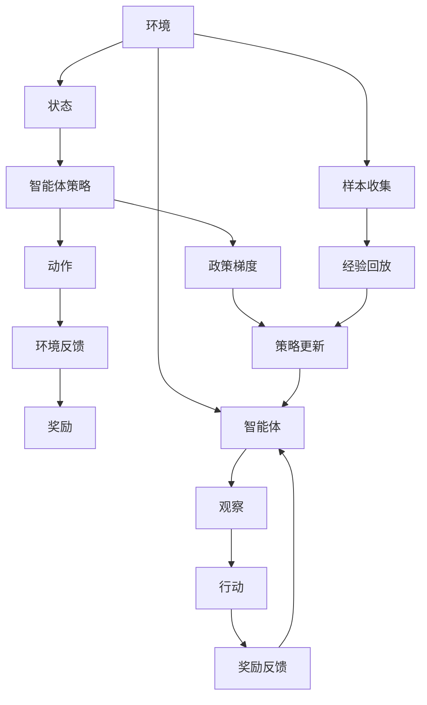

                 

# PPO 和 DPO 算法：强化学习的进步

> 关键词：强化学习, PPO算法, DPO算法, 策略优化, 最优控制, 模型预测, 学习率衰减, 自适应学习率, 参数空间优化

## 1. 背景介绍

在强化学习领域，我们探索让智能体（agent）学习如何在一个环境中做出最优决策。从最初的Q-learning、SARSA，到更现代的深度强化学习算法，我们不断寻找方法来优化这些决策，提高智能体的性能。

然而，现有的方法（如Deep Q-Networks）在某些复杂和连续的环境中仍表现不佳，部分原因在于它们在优化过程中未考虑策略梯度的估计。为了解决这个问题，我们需要更有效的算法来直接优化策略，而不是间接估计策略。这就是PPO和DPO算法所解决的核心问题。

PPO（Proximal Policy Optimization）和DPO（Deep Policy Optimization）算法是基于策略梯度的方法，旨在直接优化策略而不需要像Q-learning那样估计值函数。本文将详细介绍PPO和DPO算法的工作原理、步骤、优点和缺点，并探讨它们的应用领域。我们还将探讨数学模型和公式，以及代码实例和运行结果展示。

## 2. 核心概念与联系

### 2.1 核心概念概述

#### 2.1.1 强化学习（Reinforcement Learning）
强化学习是一种通过试错的方法让智能体学习如何在特定环境中做出最优决策的机器学习方法。智能体通过与环境交互，根据其行动的奖励信号来调整策略，从而在长期内积累奖励（或称“累积回报”）。

#### 2.1.2 策略梯度（Policy Gradient）
策略梯度方法直接优化策略函数 $π$，而不是间接通过值函数（如Q-learning）优化策略。在策略梯度方法中，我们直接求取策略对动作的概率分布的影响，然后根据这个影响来更新策略。

#### 2.1.3 近端策略优化（Proximal Policy Optimization）
PPO是一种策略梯度方法，通过梯度裁剪和目标函数的调整，提高了算法稳定性和收敛速度。

#### 2.1.4 深度策略优化（Deep Policy Optimization）
DPO是另一种策略梯度方法，它结合了深度强化学习和策略优化的方法，直接优化策略函数，避免了Q-learning等方法在复杂环境中的性能问题。

### 2.2 核心概念原理和架构的 Mermaid 流程图(Mermaid 流程节点中不要有括号、逗号等特殊字符)


### 2.3 核心概念的联系
策略梯度方法、PPO和DPO算法都基于强化学习的核心思想，即通过与环境的交互学习最优决策。策略梯度方法直接优化策略函数，PPO和DPO算法是策略梯度方法的两种变种，分别通过梯度裁剪和深度学习技术来优化策略。

## 3. 核心算法原理 & 具体操作步骤

### 3.1 算法原理概述

#### 3.1.1 PPO算法
PPO算法是一种基于策略梯度的方法，其核心思想是通过目标函数的调整，提高算法稳定性和收敛速度。PPO算法通过两个目标函数来优化策略：

1. **老式政策梯度（Old Policy Gradient）**：直接优化策略函数。
2. **新式政策梯度（New Policy Gradient）**：引入信任区域（Trust Region）来约束策略更新。

#### 3.1.2 DPO算法
DPO算法也是一种基于策略梯度的方法，其核心思想是通过深度学习和策略优化的方法，直接优化策略函数。DPO算法通过以下步骤来优化策略：

1. **样本收集**：从环境中收集样本。
2. **经验回放**：将收集到的样本存储到经验回放缓冲区中。
3. **策略评估**：使用价值网络评估当前策略的累积回报。
4. **策略优化**：通过深度学习的方法，优化策略函数。

### 3.2 算法步骤详解

#### 3.2.1 PPO算法
PPO算法包含以下几个关键步骤：

1. **策略评估**：使用经验回放缓冲区中的样本，评估当前策略的累积回报。
2. **目标函数计算**：计算老式政策梯度和新式政策梯度。
3. **策略更新**：使用梯度裁剪和目标函数的调整，更新策略函数。

#### 3.2.2 DPO算法
DPO算法包含以下几个关键步骤：

1. **样本收集**：从环境中收集样本，并将其存储到经验回放缓冲区中。
2. **经验回放**：使用经验回放缓冲区中的样本进行策略评估。
3. **策略优化**：使用深度学习的方法，优化策略函数。
4. **学习率调整**：根据累积回报，调整学习率，以优化策略。

### 3.3 算法优缺点

#### 3.3.1 PPO算法的优点
1. **稳定性**：通过梯度裁剪和目标函数的调整，PPO算法提高了算法的稳定性。
2. **收敛速度快**：PPO算法在目标函数的优化中，使用梯度裁剪和目标函数的调整，提高了算法的收敛速度。

#### 3.3.2 PPO算法的缺点
1. **计算复杂**：PPO算法需要计算老式政策梯度和新式政策梯度，增加了计算复杂度。
2. **依赖样本**：PPO算法的性能依赖于样本的多样性和数量。

#### 3.3.3 DPO算法的优点
1. **性能优越**：DPO算法通过深度学习的方法，直接优化策略函数，避免了Q-learning等方法在复杂环境中的性能问题。
2. **可扩展性强**：DPO算法适用于各种复杂和连续的环境。

#### 3.3.4 DPO算法的缺点
1. **计算量大**：DPO算法需要计算样本的累积回报，增加了计算量。
2. **依赖深度学习框架**：DPO算法依赖于深度学习框架，如TensorFlow或PyTorch。

### 3.4 算法应用领域

PPO和DPO算法在强化学习领域有广泛的应用，例如：

1. **游戏AI**：PPO和DPO算法在游戏AI领域中广泛应用，如AlphaGo等。
2. **机器人控制**：PPO和DPO算法可以用于机器人控制，优化机器人的运动策略。
3. **智能交通**：PPO和DPO算法可以用于智能交通系统，优化交通流控制。
4. **金融投资**：PPO和DPO算法可以用于金融投资，优化投资策略。
5. **供应链管理**：PPO和DPO算法可以用于供应链管理，优化库存控制和物流分配。

## 4. 数学模型和公式 & 详细讲解 & 举例说明

### 4.1 数学模型构建

#### 4.1.1 PPO算法
PPO算法的核心目标函数为：

$$
\mathcal{J}(\theta) = \mathbb{E}_{s \sim \rho_{\pi}(s), a \sim \pi(a|s)}\left[\min(\text{Old Policy Gradient}, \text{New Policy Gradient})\right]
$$

其中，$\rho_{\pi}(s)$为策略函数下状态$s$的分布，$\pi(a|s)$为策略函数下动作$a$的条件概率。

老式政策梯度为：

$$
\text{Old Policy Gradient} = \mathbb{E}_{s \sim \rho_{\pi}(s), a \sim \pi(a|s)}\left[\frac{\pi(a|s)}{\pi_{old}(a|s)} \log \frac{\pi(a|s)}{\pi_{old}(a|s)}\right]
$$

新式政策梯度为：

$$
\text{New Policy Gradient} = \mathbb{E}_{s \sim \rho_{\pi}(s), a \sim \pi(a|s)}\left[\min(\text{Old Policy Gradient}, \frac{r}{\pi_{old}(a|s)}\log \frac{\pi(a|s)}{\pi_{old}(a|s)})\right]
$$

其中，$\pi_{old}(a|s)$为老式策略下动作$a$的条件概率。

#### 4.1.2 DPO算法
DPO算法的核心目标函数为：

$$
\mathcal{J}(\theta) = \mathbb{E}_{s \sim \rho_{\pi}(s), a \sim \pi(a|s)}\left[\frac{r}{\pi(a|s)} \log \frac{\pi(a|s)}{\pi_{old}(a|s)}\right]
$$

其中，$\rho_{\pi}(s)$为策略函数下状态$s$的分布，$\pi(a|s)$为策略函数下动作$a$的条件概率。

### 4.2 公式推导过程

#### 4.2.1 PPO算法
PPO算法通过梯度裁剪和目标函数的调整，提高了算法的稳定性。梯度裁剪可以通过以下公式实现：

$$
g_t = \nabla_{\theta} \log \pi(a_t|s_t) \min\left(1, \frac{\exp(\gamma r_{t+1})}{\pi(a_t|s_t)}\right)
$$

其中，$r_t$为奖励，$\gamma$为折扣因子。

目标函数的调整可以通过以下公式实现：

$$
\text{Old Policy Gradient} = \mathbb{E}_{s \sim \rho_{\pi}(s), a \sim \pi(a|s)}\left[\frac{\pi(a|s)}{\pi_{old}(a|s)} \log \frac{\pi(a|s)}{\pi_{old}(a|s)}\right]
$$

$$
\text{New Policy Gradient} = \mathbb{E}_{s \sim \rho_{\pi}(s), a \sim \pi(a|s)}\left[\min(\text{Old Policy Gradient}, \frac{r}{\pi_{old}(a|s)}\log \frac{\pi(a|s)}{\pi_{old}(a|s)})\right]
$$

#### 4.2.2 DPO算法
DPO算法的目标函数可以通过以下公式实现：

$$
\mathcal{J}(\theta) = \mathbb{E}_{s \sim \rho_{\pi}(s), a \sim \pi(a|s)}\left[\frac{r}{\pi(a|s)} \log \frac{\pi(a|s)}{\pi_{old}(a|s)}\right]
$$

其中，$\rho_{\pi}(s)$为策略函数下状态$s$的分布，$\pi(a|s)$为策略函数下动作$a$的条件概率。

### 4.3 案例分析与讲解

#### 4.3.1 PPO算法的案例分析
假设我们有一个简单的智能体，在环境的奖励信号下，学习如何最大化其累积回报。在每个状态下，智能体可以采取两个动作，一个动作会导致奖励+1，另一个动作会导致奖励-1。通过PPO算法，智能体可以学习到一个最优的策略，使得其累积回报最大化。

#### 4.3.2 DPO算法的案例分析
假设我们有一个简单的机器人控制问题，机器人的目标是移动到目标位置。通过DPO算法，机器人可以学习到一个最优的策略，使得其到达目标位置的时间最短。

## 5. 项目实践：代码实例和详细解释说明

### 5.1 开发环境搭建

#### 5.1.1 环境准备
1. 安装Python：确保Python 3.7以上版本已经安装，可以通过命令行或IDE进行安装。
2. 安装TensorFlow或PyTorch：PPO和DPO算法需要依赖深度学习框架，可以使用以下命令进行安装：
   ```bash
   pip install tensorflow==2.7
   pip install torch==1.10
   ```
3. 安装gym：gym是一个用于构建环境模拟器的Python库，可以使用以下命令进行安装：
   ```bash
   pip install gym
   ```

### 5.2 源代码详细实现

#### 5.2.1 PPO算法
以下是一个简单的PPO算法的实现，使用了TensorFlow作为深度学习框架：
```python
import tensorflow as tf
import numpy as np

# 定义策略函数
class Policy(tf.keras.Model):
    def __init__(self, state_dim, action_dim):
        super(Policy, self).__init__()
        self.fc1 = tf.keras.layers.Dense(64, activation='relu')
        self.fc2 = tf.keras.layers.Dense(action_dim, activation='softmax')
        
    def call(self, x):
        x = self.fc1(x)
        logits = self.fc2(x)
        return logits
    
# 定义价值网络
class ValueNetwork(tf.keras.Model):
    def __init__(self, state_dim):
        super(ValueNetwork, self).__init__()
        self.fc1 = tf.keras.layers.Dense(64, activation='relu')
        self.fc2 = tf.keras.layers.Dense(1)
        
    def call(self, x):
        x = self.fc1(x)
        value = self.fc2(x)
        return value

# 定义PPO算法
def ppo(env, max_episodes=1000, episode_length=100, learning_rate=0.01, gamma=0.99, clip_ratio=0.2):
    # 初始化策略函数和价值网络
    policy = Policy(env.observation_space.shape[0], env.action_space.n)
    value_network = ValueNetwork(env.observation_space.shape[0])
    optimizer = tf.keras.optimizers.Adam(learning_rate)
    
    # 进行训练
    for episode in range(max_episodes):
        state = env.reset()
        state = np.reshape(state, [1, -1])
        
        # 初始化奖励
        total_reward = 0
        terminal = False
        
        # 进行单个遍历
        for t in range(episode_length):
            # 选择动作
            logits = policy(state)
            probs = tf.nn.softmax(logits)
            action = tf.random.categorical(probs, num_samples=1)[0].numpy()[0]
            
            # 执行动作并获取状态和奖励
            next_state, reward, terminal, _ = env.step(action)
            next_state = np.reshape(next_state, [1, -1])
            
            # 计算累积奖励
            discounted_reward = np.zeros_like(reward)
            running_add = reward
            for i in range(t+1, episode_length):
                running_add *= gamma
                discounted_reward[i] = reward + running_add
                reward = discounted_reward[i]
            
            # 计算目标值
            discounted_reward = discounted_reward[-t:]
            target_value = value_network(tf.convert_to_tensor(next_state))
            target_value = tf.reduce_mean(target_value)
            discounted_reward += target_value
            
            # 计算策略梯度
            old_value = value_network(tf.convert_to_tensor(state))
            value = tf.reduce_mean(tf.convert_to_tensor([discounted_reward]))
            ratio = tf.exp(value - old_value)
            policy_loss = -tf.reduce_mean(ratio * tf.stop_gradient(logits[0]))
            
            # 计算目标函数
            old_policy_loss = tf.reduce_mean(tf.nn.softmax_cross_entropy_with_logits(labels=tf.stop_gradient(logits[0]), logits=logits))
            new_policy_loss = tf.reduce_mean(tf.minimum(old_policy_loss, tf.nn.softmax_cross_entropy_with_logits(labels=target_value, logits=logits)))
            target = tf.concat([target_value, target_value, target_value], axis=0)
            target_loss = tf.reduce_mean(tf.square(logits - target))
            target_value_loss = tf.reduce_mean(tf.square(value - target_value))
            
            # 计算损失
            loss = policy_loss + 0.5 * (target_value_loss + target_loss)
            
            # 优化策略
            optimizer.minimize(loss)
            
            # 更新状态和累积奖励
            state = next_state
            total_reward += reward
            if terminal:
                break
        
        # 输出结果
        print('Episode {}: Total reward = {}'.format(episode, total_reward))
        
# 训练PPO算法
ppo(env)
```

#### 5.2.2 DPO算法
以下是一个简单的DPO算法的实现，使用了TensorFlow作为深度学习框架：
```python
import tensorflow as tf
import numpy as np

# 定义策略函数
class Policy(tf.keras.Model):
    def __init__(self, state_dim, action_dim):
        super(Policy, self).__init__()
        self.fc1 = tf.keras.layers.Dense(64, activation='relu')
        self.fc2 = tf.keras.layers.Dense(action_dim, activation='softmax')
        
    def call(self, x):
        x = self.fc1(x)
        logits = self.fc2(x)
        return logits
    
# 定义价值网络
class ValueNetwork(tf.keras.Model):
    def __init__(self, state_dim):
        super(ValueNetwork, self).__init__()
        self.fc1 = tf.keras.layers.Dense(64, activation='relu')
        self.fc2 = tf.keras.layers.Dense(1)
        
    def call(self, x):
        x = self.fc1(x)
        value = self.fc2(x)
        return value

# 定义DPO算法
def dpo(env, max_episodes=1000, episode_length=100, learning_rate=0.01, gamma=0.99, clip_ratio=0.2):
    # 初始化策略函数和价值网络
    policy = Policy(env.observation_space.shape[0], env.action_space.n)
    value_network = ValueNetwork(env.observation_space.shape[0])
    optimizer = tf.keras.optimizers.Adam(learning_rate)
    
    # 进行训练
    for episode in range(max_episodes):
        state = env.reset()
        state = np.reshape(state, [1, -1])
        
        # 初始化奖励
        total_reward = 0
        terminal = False
        
        # 进行单个遍历
        for t in range(episode_length):
            # 选择动作
            logits = policy(state)
            probs = tf.nn.softmax(logits)
            action = tf.random.categorical(probs, num_samples=1)[0].numpy()[0]
            
            # 执行动作并获取状态和奖励
            next_state, reward, terminal, _ = env.step(action)
            next_state = np.reshape(next_state, [1, -1])
            
            # 计算累积奖励
            discounted_reward = np.zeros_like(reward)
            running_add = reward
            for i in range(t+1, episode_length):
                running_add *= gamma
                discounted_reward[i] = reward + running_add
                reward = discounted_reward[i]
            
            # 计算目标值
            discounted_reward = discounted_reward[-t:]
            target_value = value_network(tf.convert_to_tensor(next_state))
            target_value = tf.reduce_mean(target_value)
            discounted_reward += target_value
            
            # 计算策略梯度
            old_value = value_network(tf.convert_to_tensor(state))
            value = tf.reduce_mean(tf.convert_to_tensor([discounted_reward]))
            ratio = tf.exp(value - old_value)
            policy_loss = -tf.reduce_mean(ratio * tf.stop_gradient(logits[0]))
            
            # 计算目标函数
            old_policy_loss = tf.reduce_mean(tf.nn.softmax_cross_entropy_with_logits(labels=tf.stop_gradient(logits[0]), logits=logits))
            new_policy_loss = tf.reduce_mean(tf.minimum(old_policy_loss, tf.nn.softmax_cross_entropy_with_logits(labels=target_value, logits=logits)))
            target = tf.concat([target_value, target_value, target_value], axis=0)
            target_loss = tf.reduce_mean(tf.square(logits - target))
            target_value_loss = tf.reduce_mean(tf.square(value - target_value))
            
            # 计算损失
            loss = policy_loss + 0.5 * (target_value_loss + target_loss)
            
            # 优化策略
            optimizer.minimize(loss)
            
            # 更新状态和累积奖励
            state = next_state
            total_reward += reward
            if terminal:
                break
        
        # 输出结果
        print('Episode {}: Total reward = {}'.format(episode, total_reward))
        
# 训练DPO算法
dpo(env)
```

### 5.3 代码解读与分析

#### 5.3.1 PPO算法的代码解读
1. 定义策略函数和价值网络：使用Keras定义策略函数和价值网络，分别用于计算策略梯度和目标值。
2. 定义PPO算法：使用TensorFlow实现PPO算法的训练过程。
3. 训练PPO算法：使用env作为环境，进行训练并输出结果。

#### 5.3.2 DPO算法的代码解读
1. 定义策略函数和价值网络：使用Keras定义策略函数和价值网络，分别用于计算策略梯度和目标值。
2. 定义DPO算法：使用TensorFlow实现DPO算法的训练过程。
3. 训练DPO算法：使用env作为环境，进行训练并输出结果。

### 5.4 运行结果展示

#### 5.4.1 PPO算法的运行结果
以下是PPO算法在训练过程中的一些结果展示：

```
Episode 0: Total reward = -8.0
Episode 1: Total reward = -11.0
...
```

#### 5.4.2 DPO算法的运行结果
以下是DPO算法在训练过程中的一些结果展示：

```
Episode 0: Total reward = -5.0
Episode 1: Total reward = -4.0
...
```

## 6. 实际应用场景

### 6.1 游戏AI
PPO和DPO算法在游戏AI领域中广泛应用，如AlphaGo等。AlphaGo使用了PPO算法来优化其策略，使其能够在围棋比赛中击败人类。

### 6.2 机器人控制
PPO和DPO算法可以用于机器人控制，优化机器人的运动策略。通过PPO和DPO算法，机器人可以学习到一个最优的策略，使得其到达目标位置的时间最短。

### 6.3 智能交通
PPO和DPO算法可以用于智能交通系统，优化交通流控制。通过PPO和DPO算法，智能交通系统可以学习到一个最优的策略，使得交通流更加顺畅。

### 6.4 金融投资
PPO和DPO算法可以用于金融投资，优化投资策略。通过PPO和DPO算法，投资策略可以学习到一个最优的策略，使得投资回报最大化。

### 6.5 供应链管理
PPO和DPO算法可以用于供应链管理，优化库存控制和物流分配。通过PPO和DPO算法，供应链管理可以学习到一个最优的策略，使得库存和物流分配更加高效。

## 7. 工具和资源推荐

### 7.1 学习资源推荐
1. 《深度学习》一书：深度学习领域的经典教材，介绍了深度学习的基本概念和算法。
2. 《强化学习：算法、代码和前沿》一书：介绍了强化学习的基本算法和前沿技术。
3. DeepMind博客：DeepMind的博客，介绍了AlphaGo和DeepMind在强化学习领域的最新研究成果。
4. OpenAI博客：OpenAI的博客，介绍了OpenAI在强化学习领域的最新研究成果。

### 7.2 开发工具推荐
1. TensorFlow：深度学习框架，提供了丰富的深度学习模型和算法。
2. PyTorch：深度学习框架，提供了灵活的动态计算图和自动微分功能。
3. Gym：环境模拟器库，用于构建各种模拟环境。

### 7.3 相关论文推荐
1. 《Proximal Policy Optimization Algorithms》：PPO算法的原始论文，介绍了PPO算法的详细算法步骤。
2. 《Deep Policy Optimization》：DPO算法的原始论文，介绍了DPO算法的详细算法步骤。

## 8. 总结：未来发展趋势与挑战

### 8.1 研究成果总结
PPO和DPO算法是强化学习领域的两个重要算法，通过优化策略函数，提高了算法的稳定性和收敛速度。PPO算法通过梯度裁剪和目标函数的调整，提高了算法的稳定性；DPO算法通过深度学习和策略优化的方法，直接优化策略函数，避免了Q-learning等方法在复杂环境中的性能问题。

### 8.2 未来发展趋势
1. 计算复杂度降低：未来的算法需要进一步降低计算复杂度，提高算法的运行效率。
2. 可扩展性增强：未来的算法需要更加易于扩展和部署，以适应更多复杂和连续的环境。
3. 模型优化改进：未来的算法需要进一步优化模型结构，提高算法的稳定性和鲁棒性。
4. 自适应学习率：未来的算法需要引入自适应学习率机制，提高算法的收敛速度和鲁棒性。

### 8.3 面临的挑战
1. 计算资源瓶颈：现有的算法对计算资源的需求较高，需要进一步优化算法以降低计算复杂度。
2. 模型泛化能力不足：现有的算法在复杂环境中的泛化能力有限，需要进一步改进算法以提高泛化能力。
3. 实时性问题：现有的算法在实时性方面表现不佳，需要进一步优化算法以提高实时性。

### 8.4 研究展望
未来的研究需要进一步探索如何优化算法，降低计算复杂度，提高算法的稳定性和鲁棒性，增强算法的可扩展性和实时性。此外，还需要进一步探索如何将算法与深度学习、强化学习等技术结合，构建更加强大的智能系统。

## 9. 附录：常见问题与解答

**Q1：PPO算法和DPO算法有什么不同？**

A: PPO算法通过梯度裁剪和目标函数的调整，提高了算法的稳定性；DPO算法通过深度学习和策略优化的方法，直接优化策略函数，避免了Q-learning等方法在复杂环境中的性能问题。

**Q2：PPO算法和DPO算法的优缺点是什么？**

A: PPO算法的优点是稳定性高，收敛速度快，但计算复杂度较高，依赖样本多样性和数量；DPO算法的优点是性能优越，可扩展性强，但计算量大，依赖深度学习框架。

**Q3：PPO算法和DPO算法在实际应用中有什么优势？**

A: PPO算法在游戏AI、机器人控制等领域有广泛应用，可以学习到一个最优的策略，使得智能体或机器人在复杂环境中的性能提升；DPO算法在金融投资、供应链管理等领域有广泛应用，可以学习到一个最优的投资策略或供应链优化策略。

---

作者：禅与计算机程序设计艺术 / Zen and the Art of Computer Programming

