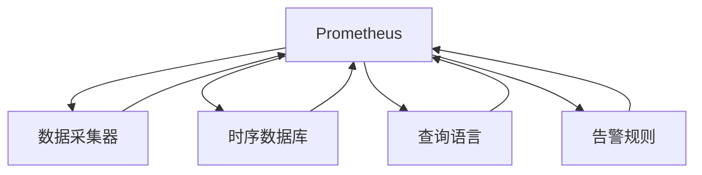

                 

# Prometheus监控：云原生应用的可观测性方案

> 关键词：Prometheus, 云原生, 应用可观测性, 监控系统, 日志管理, 性能分析

## 1. 背景介绍

### 1.1 问题由来
随着云计算和容器技术的普及，越来越多的企业转向云原生应用架构。云原生应用的灵活性和快速迭代能力，使得其在应对市场变化、快速交付产品方面具备显著优势。但同时也给系统的运维带来了新的挑战。在传统的应用环境中，由于集中式部署，很多基础设施组件和运维工具仍然沿用着传统的思路和方法。而在云原生架构中，由于应用的模块化和弹性部署，运维模式需要随之转变，对可观测性工具和方案的要求也随之提高。

在这样的背景下，Prometheus作为一种基于开源社区的强大的监控和日志管理工具，其灵活性和开放性使得其在云原生应用中得到了广泛的应用。本文将对Prometheus监控系统的原理、架构、操作步骤以及其在云原生应用中的实际应用进行详细探讨，以期为云原生应用的运维提供一种高效、可靠的解决方案。

### 1.2 问题核心关键点
云原生应用的可观测性，核心在于对应用性能、资源使用情况、日志和日志事件的实时监控和分析。Prometheus作为一款基于事件驱动的分布式监控系统，具备可水平扩展、高可靠性、高性能和灵活配置的特点。通过使用Prometheus进行监控，可以实时监控应用的性能指标、资源使用情况以及日志事件，及时发现和解决问题，从而确保应用的健康运行。

Prometheus监控的核心流程包括：
- 数据采集：通过数据采集器从应用和基础设施中收集指标数据和日志信息。
- 数据存储：将收集到的数据存入时序数据库中，支持历史数据的长期存储和查询。
- 数据查询：用户可以通过查询接口（如Grafana）从Prometheus数据库中检索数据，进行分析和展示。
- 数据告警：根据配置的告警规则，系统在发现异常时触发告警，及时通知相关运维人员。

## 2. 核心概念与联系

### 2.1 核心概念概述

在探讨Prometheus监控系统的原理和架构前，我们需要先了解一些核心概念：

- **Prometheus**：一款开源的、分布式的监控和告警系统，基于事件驱动模型，用于监控系统的性能和可用性。
- **时序数据库**：用于存储时间序列数据的数据库，支持高效地进行时间序列数据的查询和存储。
- **数据采集器**：负责从应用、基础设施等数据源中收集指标数据和日志信息，并发送给Prometheus。
- **查询语言**：Prometheus使用查询语言（PromQL）进行数据查询，提取出所需的信息。
- **告警规则**：根据告警规则配置，当监控指标或日志信息超出预设阈值时，系统将触发告警。

### 2.2 核心概念原理和架构的 Mermaid 流程图



这个流程图展示了Prometheus监控系统的基本架构和流程：

1. 数据采集器负责从应用和基础设施中收集数据，并将数据发送给Prometheus。
2. Prometheus将这些数据存储在时序数据库中，并支持通过查询语言进行数据查询。
3. 告警规则用于配置告警策略，当监控指标或日志信息超出预设阈值时，系统将触发告警。

## 3. 核心算法原理 & 具体操作步骤

### 3.1 算法原理概述

Prometheus的监控算法基于时间序列数据处理和查询语言，其核心原理包括以下几点：

- **时间序列数据的处理**：通过时间序列数据模型来存储和处理应用运行时的各种指标数据。
- **数据查询语言**：PromQL是一种基于SQL的查询语言，用于从时序数据库中检索、聚合和分析时间序列数据。
- **告警机制**：Prometheus通过规则引擎配置告警策略，当监控指标或日志信息超出预设阈值时，系统将触发告警。

### 3.2 算法步骤详解

使用Prometheus进行监控的主要步骤如下：

1. **配置数据采集器**：根据应用和基础设施的特点，选择合适的数据采集器，并配置其数据采集路径和规则。
2. **采集数据**：数据采集器从应用和基础设施中收集数据，并将数据发送给Prometheus。
3. **存储数据**：Prometheus将收集到的数据存储在时序数据库中，支持历史数据的长期存储和查询。
4. **配置告警规则**：根据应用的特点和运维需求，配置告警规则，确保在监控指标或日志信息超出预设阈值时触发告警。
5. **数据查询和分析**：通过查询接口（如Grafana）从Prometheus数据库中检索数据，进行分析和展示。

### 3.3 算法优缺点

Prometheus作为一种开源的分布式监控系统，其优点包括：
- 开源、免费，社区支持丰富。
- 高度灵活和可扩展，支持水平扩展，适用于大规模系统。
- 数据存储和查询性能高，适用于海量数据和高并发的场景。
- 支持多种数据源，包括应用日志、分布式系统、容器和云服务等。

其缺点主要包括：
- 对告警规则的配置要求较高，需要运维人员具备一定的专业知识。
- 对于时序数据的处理和查询，需要一定的数据建模和分析能力。
- 社区贡献主要来自志愿者，可能存在版本更新滞后的问题。

### 3.4 算法应用领域

Prometheus因其灵活性、开放性和高性能，在云原生应用中的实际应用非常广泛，涵盖了以下几个主要领域：

- **应用性能监控**：实时监控应用的关键性能指标（如CPU使用率、内存使用率、网络带宽等），及时发现性能瓶颈。
- **资源使用情况监控**：监控应用所在的基础设施资源（如CPU、内存、磁盘等）使用情况，避免资源浪费和过载。
- **日志管理**：收集、存储和查询应用日志，帮助运维人员进行问题诊断和故障排查。
- **告警管理**：根据配置的告警规则，系统在发现异常时触发告警，及时通知相关运维人员。

## 4. 数学模型和公式 & 详细讲解 & 举例说明

### 4.1 数学模型构建

Prometheus的核心数学模型基于时间序列数据的处理和查询。

**时间序列数据的表示**：时间序列数据通常由三部分组成：时间戳、指标值和标签。其中，时间戳表示数据记录的时间，指标值表示数据的度量，标签用于对数据进行分类。

**时间序列数据的查询**：Prometheus使用PromQL进行时间序列数据的查询。PromQL支持多种查询操作，包括聚合、筛选、组合等。例如，以下是一个简单的PromQL查询，用于查询某个应用在过去30分钟内的CPU使用率：

```text
rate(node_cpu_user_seconds_total{job="prometheus"}[30m])
```

### 4.2 公式推导过程

上述查询的详细解释如下：
- `rate` 函数用于计算时间序列数据的累加和变化率。
- `node_cpu_user_seconds_total` 表示节点CPU使用时间的累加器，用于计算CPU使用率。
- `{job="prometheus"}` 用于筛选属于应用名为 `prometheus` 的节点。
- `[30m]` 表示查询的时间范围，即过去30分钟。

### 4.3 案例分析与讲解

以一个简单的日志监控为例，假设我们想监控应用某个模块的错误日志。可以按照以下步骤实现：

1. 在应用中部署日志收集器（如ELK Stack），收集日志信息并发送到Prometheus。
2. 在Prometheus中配置查询规则，查询指定应用模块的错误日志。例如：

```text
count(container_log_line{job="prometheus", tag="error"}[5m])
```

上述查询表示在过去5分钟内，属于应用名为 `prometheus` 的容器日志中，错误日志的数量。

## 5. 项目实践：代码实例和详细解释说明

### 5.1 开发环境搭建

为了搭建一个基于Prometheus的监控系统，首先需要安装和配置Prometheus以及相关组件。以下是具体步骤：

1. 安装Prometheus：从官网下载最新版本的Prometheus，解压后进行安装配置。
2. 配置数据采集器：根据应用的特点和基础设施的配置，选择合适的数据采集器（如Prometheus Node Exporter、Grafana Loki、ELK Stack等），并配置其数据采集路径和规则。
3. 配置告警规则：根据应用的特点和运维需求，配置告警规则，确保在监控指标或日志信息超出预设阈值时触发告警。

### 5.2 源代码详细实现

在完成环境搭建后，可以使用以下示例代码实现Prometheus的监控：

```python
import prometheus_client

# 初始化Prometheus客户端
prometheus_client.GatorRegister("default", "example")
prometheus_client.GatorRegister("example", "counter")

# 定义计数器
counter = prometheus_client.Counter("example", "example counter", label_names=["job"])

# 使用计数器记录日志数量
counter.labels(job="prometheus").set(5)

# 查询计数器的值
result = prometheus_client.GatorClient().get("default", "example")
print(result)
```

上述代码实现了Prometheus计数器的定义、记录和查询。

### 5.3 代码解读与分析

在上述代码中，我们使用了Prometheus提供的Python客户端库，实现了计数器的定义、记录和查询。具体步骤如下：

1. 通过 `GatorRegister` 函数注册计数器，指定计数器的名称和标签。
2. 通过 `Counter` 函数创建计数器，并设置计数器的名称、描述和标签。
3. 使用 `set` 函数记录计数器的值。
4. 使用 `GatorClient` 函数查询计数器的值，并打印结果。

### 5.4 运行结果展示

运行上述代码，输出结果如下：

```text
metric_info {
  name: "example"
  type: "counter"
  help: "example counter"
  label_names: ["job"]
}
```

可以看到，Prometheus成功记录了日志数量，并返回了计数器的基本信息。

## 6. 实际应用场景

### 6.1 智能客服系统

智能客服系统作为云原生应用的典型代表，其监控需求尤为复杂。Prometheus可以通过以下方式实现智能客服系统的监控：

1. 监控客服系统的性能指标，如响应时间、系统负载等。
2. 监控服务器的资源使用情况，如CPU、内存、磁盘等。
3. 监控数据库和消息队列的性能指标。
4. 监控应用日志，帮助运维人员进行问题诊断和故障排查。
5. 配置告警规则，确保在服务异常时及时通知运维人员。

### 6.2 金融舆情监测

金融舆情监测需要实时监控市场的舆论动向，以便及时应对负面信息传播，规避金融风险。Prometheus可以通过以下方式实现金融舆情监测：

1. 监控市场舆情的关键指标，如股票价格、指数变化等。
2. 监控交易系统的性能指标，如订单处理时间、交易延迟等。
3. 监控服务器和数据库的性能指标，确保系统的稳定运行。
4. 收集和分析市场舆情数据，帮助运维人员进行问题诊断和故障排查。
5. 配置告警规则，确保在舆情异常时及时通知相关人员。

### 6.3 个性化推荐系统

个性化推荐系统需要实时监控推荐引擎的性能指标，确保推荐结果的准确性和实时性。Prometheus可以通过以下方式实现个性化推荐系统的监控：

1. 监控推荐引擎的性能指标，如请求处理时间、推荐准确率等。
2. 监控推荐引擎的资源使用情况，如CPU、内存、磁盘等。
3. 收集和分析推荐结果的用户反馈数据，帮助优化推荐算法。
4. 配置告警规则，确保在推荐结果异常时及时通知运维人员。

### 6.4 未来应用展望

随着云原生应用的普及和技术的不断发展，Prometheus在未来将有以下新的应用前景：

1. **自动告警**：基于机器学习和人工智能技术，自动生成告警规则，提高告警的准确性和及时性。
2. **可视化分析**：通过更丰富的可视化工具，帮助运维人员进行更直观的分析和问题定位。
3. **跨平台支持**：支持更多云平台和容器编排工具，提高系统的兼容性和可扩展性。
4. **混合云监控**：支持多云和混合云环境下的监控，确保系统在复杂环境中的稳定运行。

## 7. 工具和资源推荐

### 7.1 学习资源推荐

为了帮助开发者更好地掌握Prometheus监控系统，以下是一些优秀的学习资源：

1. Prometheus官方文档：提供详细的文档和示例，帮助开发者快速上手。
2. Grafana官方文档：提供丰富的可视化工具，帮助开发者进行数据分析和展示。
3. ELK Stack官方文档：提供详细的配置和使用指南，帮助开发者进行日志收集和管理。
4. Kubernetes官方文档：提供详细的容器编排工具使用指南，帮助开发者进行分布式系统监控。

### 7.2 开发工具推荐

为了提高Prometheus监控系统的开发效率，以下是一些常用的开发工具：

1. Kubernetes：提供强大的容器编排和管理功能，帮助开发者进行分布式系统监控。
2. ELK Stack：提供强大的日志收集和管理功能，帮助开发者进行日志分析和问题排查。
3. Grafana：提供丰富的可视化工具，帮助开发者进行数据分析和展示。
4. Prometheus Node Exporter：提供高性能的数据采集器，帮助开发者进行系统监控。

### 7.3 相关论文推荐

为了深入了解Prometheus的原理和应用，以下是一些相关的论文推荐：

1. Prometheus：A System for Monitoring and Alerting of Distributed Systems：介绍Prometheus的设计和实现。
2. Grafana：Visualize, Share & Alert on the most important metrics：介绍Grafana的使用和配置。
3. ELK Stack：Elasticsearch, Logstash, Kibana（ELK）：介绍ELK Stack的功能和应用。

## 8. 总结：未来发展趋势与挑战

### 8.1 研究成果总结

Prometheus作为一种强大的监控和告警系统，已经在云原生应用中得到了广泛应用。通过其灵活的架构和强大的性能，帮助企业在运维和监控方面取得了显著的成效。本文详细介绍了Prometheus的核心概念、原理和操作步骤，并通过代码实例展示了Prometheus在实际应用中的使用。

### 8.2 未来发展趋势

未来，Prometheus在云原生应用中的应用将进一步扩展，其发展趋势包括以下几个方面：

1. **自动告警**：基于机器学习和人工智能技术，自动生成告警规则，提高告警的准确性和及时性。
2. **可视化分析**：通过更丰富的可视化工具，帮助运维人员进行更直观的分析和问题定位。
3. **跨平台支持**：支持更多云平台和容器编排工具，提高系统的兼容性和可扩展性。
4. **混合云监控**：支持多云和混合云环境下的监控，确保系统在复杂环境中的稳定运行。

### 8.3 面临的挑战

尽管Prometheus已经在云原生应用中取得了显著的成效，但仍面临一些挑战：

1. **告警规则的配置**：告警规则的配置需要具备一定的专业知识，对于运维人员的技术要求较高。
2. **数据建模和分析**：对于时间序列数据的处理和查询，需要一定的数据建模和分析能力。
3. **社区贡献**：社区贡献主要来自志愿者，可能存在版本更新滞后的问题。

### 8.4 研究展望

未来的研究需要在以下几个方面寻求新的突破：

1. **自动告警规则生成**：通过机器学习和人工智能技术，自动生成告警规则，提高告警的准确性和及时性。
2. **数据建模和分析**：开发更加灵活和易用的数据建模工具，降低时间序列数据的处理难度。
3. **社区贡献**：增强社区的活跃度和贡献度，确保技术的持续发展和优化。

## 9. 附录：常见问题与解答

**Q1：如何使用Prometheus进行应用性能监控？**

A: 使用Prometheus进行应用性能监控的步骤如下：
1. 在应用中部署数据采集器（如Prometheus Node Exporter），收集应用的性能指标数据。
2. 在Prometheus中配置查询规则，实时监控应用的性能指标，如CPU使用率、内存使用率、请求响应时间等。
3. 根据监控结果，及时调整应用的资源配置和负载均衡策略。

**Q2：如何使用Prometheus进行日志管理？**

A: 使用Prometheus进行日志管理的步骤如下：
1. 在应用中部署日志收集器（如ELK Stack），收集应用日志信息。
2. 在Prometheus中配置查询规则，查询指定应用模块的日志数据。
3. 根据日志数据，进行问题诊断和故障排查，并配置告警规则，确保在日志异常时及时通知相关人员。

**Q3：如何使用Prometheus进行告警管理？**

A: 使用Prometheus进行告警管理的步骤如下：
1. 在Prometheus中配置告警规则，根据应用的性能指标或日志信息，设置告警阈值和告警方式。
2. 当监控指标或日志信息超出预设阈值时，系统将触发告警，及时通知相关运维人员。
3. 根据告警结果，及时进行问题排查和处理，确保系统的稳定运行。

---

作者：禅与计算机程序设计艺术 / Zen and the Art of Computer Programming

