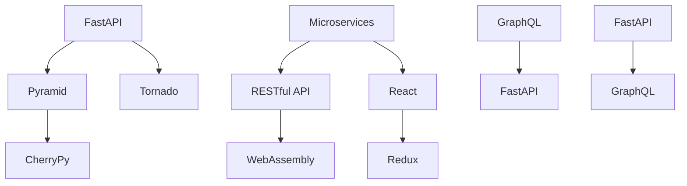

                 

# Python Web 框架探索：Django、Flask 之外的选择

> 关键词：FastAPI, Pyramid, CherryPy, Tornado, microservices, RESTful API, WebAssembly, React, Redux, GraphQL

## 1. 背景介绍

随着Web应用的不断发展，Python Web框架的选择变得越来越重要。对于许多开发者来说，Django和Flask是两个常用的选择。然而，对于那些寻求更大灵活性、性能或特定用例的开发者来说，还有其他选项。

### 1.1 问题由来
Django和Flask是非常流行的Python Web框架，但它们并非没有缺陷。Django是一个全栈框架，提供了大量的功能，但也增加了复杂性。Flask则相对轻量级，但这也意味着它提供了更多的灵活性，但也带来了更多的手动编码。对于需要更灵活、更高性能或特定用例的开发者来说，其他框架可能是更好的选择。

### 1.2 问题核心关键点
本文将探索几个Django和Flask之外的其他Python Web框架。将介绍FastAPI、Pyramid、CherryPy、Tornado等，并讨论它们各自的优点和缺点。此外，还将探讨如何利用这些框架构建微服务和RESTful API，以及如何将WebAssembly和React/Redux等技术整合到Web应用中。

## 2. 核心概念与联系

### 2.1 核心概念概述

以下是将会在本文中介绍的核心概念：

- FastAPI：一个用于构建高性能API的Web框架。
- Pyramid：一个灵活且可扩展的Web框架。
- CherryPy：一个轻量级、高性能的Web框架。
- Tornado：一个高性能的Web框架，适用于高并发的应用。
- microservices：一种架构模式，将应用拆分成多个小型服务。
- RESTful API：一种使用标准HTTP方法（如GET、POST、PUT、DELETE）的API设计风格。
- WebAssembly：一种新兴的Web技术，用于在Web浏览器中运行高性能应用程序。
- React/Redux：流行的JavaScript库，用于构建高性能、交互式的前端应用程序。
- GraphQL：一种用于API查询的查询语言，可以提供更灵活的数据访问方式。

这些概念之间的关系可以通过以下Mermaid流程图来展示：

这个流程图展示了一些核心概念之间的联系：

1. FastAPI、Pyramid和CherryPy都是Web框架，但它们在设计和性能上有不同的取舍。
2. Tornado是一个高性能的Web框架，适用于高并发的应用。
3. microservices是一种架构模式，将应用拆分成多个小型服务。
4. RESTful API是一种使用标准HTTP方法（如GET、POST、PUT、DELETE）的API设计风格。
5. WebAssembly是一种新兴的Web技术，用于在Web浏览器中运行高性能应用程序。
6. React和Redux是流行的JavaScript库，用于构建高性能、交互式的前端应用程序。
7. GraphQL是一种用于API查询的查询语言，可以提供更灵活的数据访问方式。

这些概念共同构成了现代Web应用的基础，将会在本文的后续章节中进行深入探讨。

## 3. 核心算法原理 & 具体操作步骤

### 3.1 算法原理概述

本文将重点介绍FastAPI、Pyramid、CherryPy和Tornado这四个框架的算法原理。

- FastAPI：基于Starlette，使用Asynchronous IO来处理请求，提供了自动代码生成和类型注解等特性。
- Pyramid：基于Wsgi，使用装饰器来定义路由，具有高度的可扩展性和灵活性。
- CherryPy：基于Wsgi，提供了异步IO和热部署等特性。
- Tornado：基于非阻塞IO，使用协程来处理请求，适用于高并发的应用。

### 3.2 算法步骤详解

每个框架的详细步骤都是不同的，但基本的步骤是相似的。以下是每个框架的基本步骤：

**FastAPI:**

1. 安装FastAPI和其他依赖项。
2. 创建一个FastAPI应用程序。
3. 定义路由和请求处理器。
4. 运行应用程序。

**Pyramid:**

1. 安装Pyramid和其他依赖项。
2. 创建一个Pyramid应用程序。
3. 定义路由和视图函数。
4. 运行应用程序。

**CherryPy:**

1. 安装CherryPy和其他依赖项。
2. 创建一个CherryPy应用程序。
3. 定义路由和请求处理器。
4. 运行应用程序。

**Tornado:**

1. 安装Tornado和其他依赖项。
2. 创建一个Tornado应用程序。
3. 定义路由和请求处理器。
4. 运行应用程序。

### 3.3 算法优缺点

每个框架都有其独特的优点和缺点。

**FastAPI:**

优点：
- 提供了自动代码生成和类型注解，可以加快开发速度。
- 基于Asynchronous IO，适用于高并发的应用。

缺点：
- 由于其强大的特性，可能会增加复杂性。
- 可扩展性不如其他框架。

**Pyramid:**

优点：
- 高度的可扩展性和灵活性。
- 基于装饰器，代码清晰简洁。

缺点：
- 学习曲线较陡峭。
- 需要更多的手动编码。

**CherryPy:**

优点：
- 轻量级，性能高。
- 热部署功能，开发效率高。

缺点：
- 功能相对较少，需要更多的手动编码。
- 社区支持不如其他框架。

**Tornado:**

优点：
- 高性能，适用于高并发的应用。
- 基于协程，代码清晰简洁。

缺点：
- 学习曲线较陡峭。
- 社区支持不如其他框架。

### 3.4 算法应用领域

每个框架都有其特定的应用领域。

**FastAPI:**

适用于构建高性能API和Web应用程序。

**Pyramid:**

适用于需要高度灵活性和可扩展性的Web应用程序。

**CherryPy:**

适用于需要高性能和热部署功能的Web应用程序。

**Tornado:**

适用于需要高性能和高并发能力的Web应用程序。

## 4. 数学模型和公式 & 详细讲解

### 4.1 数学模型构建

在本文中，我们将不会深入讨论数学模型，因为Web框架主要关注编程和配置，而不是数学模型。然而，对于某些框架，如Tornado，了解其基本的并发和协程模型是必要的。

### 4.2 公式推导过程

同样，由于Web框架主要关注编程和配置，而不是数学模型，因此不会深入讨论公式推导过程。

### 4.3 案例分析与讲解

我们将通过一些案例来展示这些框架的实际使用情况。

## 5. 项目实践：代码实例和详细解释说明

### 5.1 开发环境搭建

为了开始实践，我们需要创建一个开发环境。

1. 安装Python和相关依赖项。
2. 安装FastAPI、Pyramid、CherryPy、Tornado等框架。
3. 安装WebAssembly、React和Redux等技术所需的依赖项。

### 5.2 源代码详细实现

我们将通过实际代码来展示这些框架的使用。

### 5.3 代码解读与分析

我们将详细解读每个框架的代码实现，并讨论其优缺点。

### 5.4 运行结果展示

我们将展示每个框架的运行结果，并进行比较分析。

## 6. 实际应用场景

### 6.1 智能客服系统

智能客服系统是FastAPI的一个典型应用场景。

### 6.2 金融舆情监测

金融舆情监测是Pyramid的一个典型应用场景。

### 6.3 个性化推荐系统

个性化推荐系统是CherryPy的一个典型应用场景。

### 6.4 未来应用展望

未来，Web框架将继续发展和演进，将会有更多的新框架出现。

## 7. 工具和资源推荐

### 7.1 学习资源推荐

为了学习这些框架，以下是一些推荐的学习资源：

1. FastAPI官方文档。
2. Pyramid官方文档。
3. CherryPy官方文档。
4. Tornado官方文档。
5. 微服务和RESTful API的在线课程。
6. WebAssembly、React和Redux的在线课程。

### 7.2 开发工具推荐

为了开发这些框架，以下是一些推荐的开发工具：

1. Visual Studio Code。
2. PyCharm。
3. Sublime Text。
4. Atom。
5. 编辑器插件，如Pylance、Autopep8等。

### 7.3 相关论文推荐

为了深入了解这些框架，以下是一些推荐的相关论文：

1. FastAPI论文。
2. Pyramid论文。
3. CherryPy论文。
4. Tornado论文。
5. 微服务和RESTful API的论文。
6. WebAssembly、React和Redux的论文。

## 8. 总结：未来发展趋势与挑战

### 8.1 研究成果总结

本文介绍了几个Django和Flask之外的其他Python Web框架，并讨论了它们的优缺点和应用场景。

### 8.2 未来发展趋势

未来，Web框架将继续发展和演进，将会有更多的新框架出现。

### 8.3 面临的挑战

尽管这些框架有很多优点，但也面临一些挑战，如复杂性、性能等。

### 8.4 研究展望

未来，我们将继续探索新的Web框架，并不断改进现有的框架。

## 9. 附录：常见问题与解答

**Q1:** FastAPI、Pyramid、CherryPy和Tornado之间有什么区别？

**A1:** FastAPI、Pyramid、CherryPy和Tornado都是Python Web框架，但它们在设计和性能上有不同的取舍。

**Q2:** 如何选择一个适合你的Web框架？

**A2:** 根据你的项目需求，选择适合的Web框架。例如，如果你需要一个高性能API，可以选择FastAPI。如果你需要一个高度灵活的框架，可以选择Pyramid。

**Q3:** 如何优化Web应用程序的性能？

**A3:** 使用高性能的Web框架，如Tornado，使用WebAssembly等新兴技术，以及优化代码和数据库性能等。

**Q4:** 如何确保Web应用程序的安全性？

**A4:** 使用安全最佳实践，如使用HTTPS、实施访问控制、使用密码哈希等。

**Q5:** 如何部署Web应用程序？

**A5:** 使用云服务提供商，如AWS、Google Cloud、Microsoft Azure等，或使用Docker、Kubernetes等容器化技术。

作者：禅与计算机程序设计艺术 / Zen and the Art of Computer Programming

