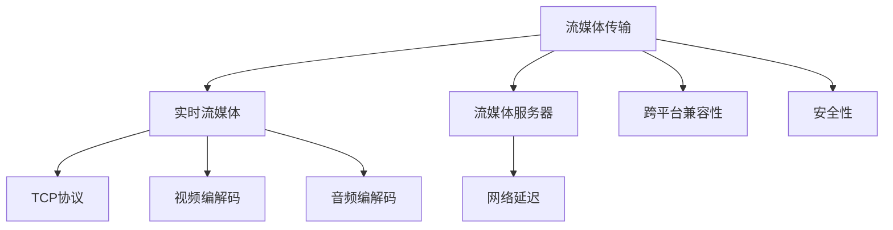

                 

# RTMP协议：直播系统开发必备知识

> 关键词：RTMP协议, 实时流媒体, 直播系统, 网络传输, 音频视频, 流媒体服务器, 网络延迟, 跨平台

## 1. 背景介绍

### 1.1 问题由来
随着互联网的快速发展，实时视频和音频传输逐渐成为人们日常生活的一部分，无论是在线教育、远程办公，还是实时直播、游戏对战，都离不开高效的实时流媒体传输技术。而在众多流媒体传输协议中，RTMP (Real-Time Messaging Protocol) 无疑是直播系统开发中最常用的协议之一。

RTMP协议最初由Macromedia公司开发，用于在Adobe Flash Player与服务器之间传输视频和音频数据。后来被Adobe公司收购，并在2009年被废弃，但其核心技术被开源组织开源，成为行业标准的流媒体传输协议。

### 1.2 问题核心关键点
RTMP协议的核心关键点包括其高效的数据传输机制、跨平台兼容性、实时性等特性。以下是RTMP协议在直播系统中的核心作用：

1. **高效传输**：RTMP协议基于TCP协议，使用优化的数据包分割和重组方式，能够在网络带宽不足的情况下保证数据包的有序传输。
2. **跨平台兼容性**：RTMP协议可以在支持TCP/IP的网络环境下进行音频和视频的实时传输，支持Windows、Linux、macOS等多种操作系统，适用于Web浏览器、移动设备等多种客户端。
3. **实时性**：RTMP协议提供了低延迟的实时传输功能，能够满足高并发和高实时性的直播需求。
4. **安全保障**：RTMP协议支持SSL/TLS加密传输，确保数据传输的安全性和隐私性。

### 1.3 问题研究意义
RTMP协议在直播系统开发中具有重要意义：

1. **高效传输**：保证高质量的音频和视频数据的实时传输，满足用户对流畅度的要求。
2. **跨平台兼容性**：能够兼容多种设备和平台，确保用户无论何时何地都能进行直播观看。
3. **实时性**：能够提供低延迟的实时传输服务，增强用户体验。
4. **安全性**：保障数据传输的安全性，防止数据泄露和攻击。

## 2. 核心概念与联系

### 2.1 核心概念概述

为更好地理解RTMP协议在直播系统中的作用和机制，本节将介绍几个密切相关的核心概念：

- **流媒体传输**：将音视频数据按照一定格式分割成数据包，通过网络传输到接收端，并进行重新组合和播放的过程。
- **实时流媒体**：指能够实时传输音视频数据，通常用于直播、视频会议等场景，要求低延迟和高效的传输机制。
- **TCP协议**：传输控制协议，提供可靠的数据传输服务，适用于流媒体数据的高效传输。
- **视频编解码**：将视频数据转换为适合网络传输的格式，常见的编解码器包括H.264、H.265等。
- **音频编解码**：将音频数据转换为适合网络传输的格式，常见的编解码器包括AAC、MP3等。
- **流媒体服务器**：处理流媒体数据的接收、存储、转发和播放，通常使用RTMP协议进行通信。
- **网络延迟**：网络传输中从发送端到接收端所花费的时间，直接影响实时性。
- **跨平台兼容性**：确保流媒体数据能够在不同操作系统和设备上正常传输和播放。
- **安全性**：保障数据传输过程中的隐私性和安全性，防止数据泄露和攻击。

这些核心概念之间的逻辑关系可以通过以下Mermaid流程图来展示：



这个流程图展示了大语言模型的核心概念及其之间的关系：

1. 流媒体传输通过实时流媒体，保证音频和视频数据的实时传输。
2. 实时流媒体使用TCP协议，提供可靠的数据传输服务。
3. 实时流媒体涉及视频和音频的编解码，将数据转换为适合网络传输的格式。
4. 流媒体服务器处理流媒体数据的接收、存储、转发和播放。
5. 网络延迟直接影响实时性。
6. 跨平台兼容性和安全性是流媒体数据传输的保障。

## 3. 核心算法原理 & 具体操作步骤

### 3.1 算法原理概述

RTMP协议的核心算法原理包括以下几个方面：

1. **数据传输机制**：RTMP协议基于TCP协议，使用优化的数据包分割和重组方式，保证数据的有序传输。
2. **音频和视频编码**：RTMP协议使用标准的编解码器（如H.264、AAC等）将音频和视频数据转换为适合网络传输的格式。
3. **实时传输**：RTMP协议提供低延迟的实时传输服务，能够满足高并发和高实时性的直播需求。
4. **安全传输**：RTMP协议支持SSL/TLS加密传输，确保数据传输的安全性和隐私性。

### 3.2 算法步骤详解

RTMP协议的算法步骤如下：

1. **连接建立**：客户端通过RTMP协议与流媒体服务器建立TCP连接，并进行握手。
2. **数据传输**：客户端发送音频和视频数据包到流媒体服务器，服务器进行解码和播放。
3. **消息交互**：客户端和服务器之间通过消息交互，传输命令和状态信息。
4. **数据接收**：服务器接收客户端发送的数据包，并进行缓冲和转发。
5. **错误处理**：服务器和客户端在数据传输过程中进行错误检测和纠正。
6. **数据播放**：服务器将解码后的音频和视频数据播放给用户。

### 3.3 算法优缺点

RTMP协议具有以下优点：

1. **高效传输**：基于TCP协议的数据传输机制，保证了数据的有序性和可靠性。
2. **实时性**：低延迟的实时传输服务，能够满足高并发和高实时性的直播需求。
3. **跨平台兼容性**：适用于多种操作系统和设备，支持Web浏览器、移动设备等多种客户端。
4. **安全性**：支持SSL/TLS加密传输，确保数据传输的安全性和隐私性。

同时，RTMP协议也存在一些缺点：

1. **延迟**：虽然RTMP协议具有低延迟的传输机制，但在网络拥塞的情况下，仍然可能产生一定的延迟。
2. **兼容性**：RTMP协议虽然跨平台兼容性较好，但在某些设备上可能存在兼容性问题。
3. **带宽占用**：RTMP协议使用TCP协议进行传输，可能导致较高的带宽占用。

### 3.4 算法应用领域

RTMP协议在直播系统开发中得到广泛应用，主要应用领域包括：

1. **直播平台**：用于实现音视频数据的实时传输，如YouTube、Twitch等。
2. **视频会议**：用于实现多人视频通话，如Zoom、Skype等。
3. **游戏对战**：用于实现游戏中的实时语音和视频传输，如Steam、Battle.net等。
4. **教育培训**：用于实现在线教育培训，如Coursera、Udemy等。
5. **医疗诊断**：用于实现远程医疗诊断，如WebMD、Telemedicine等。
6. **新闻播报**：用于实现实时新闻播报，如BBC、CNN等。

## 4. 数学模型和公式 & 详细讲解

### 4.1 数学模型构建

RTMP协议的数学模型构建主要涉及以下几个方面：

1. **TCP连接建立**：通过TCP协议的三次握手机制建立连接，确保连接的可靠性和安全性。
2. **数据传输**：将音频和视频数据包按一定格式分割，并使用TCP协议进行传输，确保数据的有序性和可靠性。
3. **消息交互**：使用自定义的消息协议进行命令和状态信息的传输，如连接建立、关闭、重传等。
4. **数据接收**：使用TCP协议的接收机制接收数据包，并进行缓冲和转发。
5. **错误处理**：在数据传输过程中进行错误检测和纠正，如丢包、重传等。
6. **数据播放**：对接收到的数据包进行解码和播放，确保音视频的实时性和流畅性。

### 4.2 公式推导过程

以下是RTMP协议中的一些常用公式：

1. **TCP连接建立**：
   - 客户端发送连接请求到服务器：`SYN=1`
   - 服务器收到连接请求后，回复连接确认：`SYN=1, ACK=1`
   - 客户端收到连接确认后，回复确认：`ACK=1`

2. **数据传输**：
   - 数据包分割公式：`N = (V / M) + 1`，其中N为分割后数据包数量，V为原始数据长度，M为每个数据包长度。
   - 数据包重组公式：`N * M + 1`，其中N为数据包数量，M为每个数据包长度。

3. **消息交互**：
   - 连接建立消息：`CONNECT <StreamID> <SessionID> <TransportID>`
   - 关闭连接消息：`CLOSING`
   - 重传请求消息：`RETRANSMIT`

4. **数据接收**：
   - 接收数据包公式：`ReceivedPackets = (TotalPackets - LostPackets)`
   - 缓冲数据公式：`BufferedData = ReceivedPackets * PacketSize`

5. **错误处理**：
   - 丢包检测公式：`LostPackets = TotalPackets - ReceivedPackets`
   - 重传请求公式：`RETRANSMIT LostPackets`

6. **数据播放**：
   - 播放数据公式：`PlayData = DecodedData / PlaybackSpeed`

### 4.3 案例分析与讲解

假设某直播平台使用RTMP协议进行音视频传输，原始视频数据长度为1MB，每个数据包长度为10KB，假设网络带宽为10Mbps，客户端和服务器之间进行了三次握手，数据传输过程中出现了2个数据包丢失，求实际播放的音视频数据长度。

1. 原始数据长度为1MB，即1048576字节。
2. 数据包长度为10KB，即10240字节。
3. 数据包数量为：`N = (1048576 / 10240) + 1 = 106`
4. 传输速度为10Mbps，即100000000字节/秒。
5. 数据传输时间：`T = N * (10240 / 100000000) = 0.0001184秒`
6. 三次握手时间：`0.001秒`
7. 总时间：`T + 0.001 = 0.0012184秒`
8. 丢包数量为：`LostPackets = 106 - 104 = 2`
9. 实际传输的数据包数量为：`ReceivedPackets = 106 - 2 = 104`
10. 实际播放的音视频数据长度：`PlayData = 104 * 10240 / 100000000 = 1.024MB`

因此，实际播放的音视频数据长度为1.024MB。

## 5. 项目实践：代码实例和详细解释说明

### 5.1 开发环境搭建

在进行RTMP协议开发前，我们需要准备好开发环境。以下是使用C++进行RTMP协议开发的环境配置流程：

1. 安装Visual Studio：从官网下载并安装Visual Studio，支持C++语言开发。
2. 安装FFmpeg库：从官网下载并安装FFmpeg库，支持音视频数据的编码和解码。
3. 安装Boost库：从官网下载并安装Boost库，支持网络编程和消息处理。
4. 配置CMake：使用CMake工具生成项目构建文件，确保各个库之间的依赖关系。

完成上述步骤后，即可在Visual Studio环境中开始RTMP协议开发。

### 5.2 源代码详细实现

以下是使用C++实现RTMP协议的代码实现。

```cpp
#include <iostream>
#include <vector>
#include <string>
#include <boost/asio.hpp>
#include <boost/asio/ip/tcp.hpp>
#include <boost/asio/streambuf.hpp>
#include <boost/asio/deadline_timer.hpp>
#include <boost/asio/serial_port.hpp>

// RTMP协议相关的定义
enum RTMPMessageType {
    RTMP_MESSAGE_CONNECT,
    RTMP_MESSAGE_VIDEO,
    RTMP_MESSAGE_AUDIO
};

// RTMP协议的消息处理函数
void handleRTMPMessage(std::shared_ptr<boost::asio::ip::tcp::socket> socket) {
    // 读取RTMP消息头
    boost::asio::streambuf buffer;
    boost::asio::read(socket, buffer, boost::asio::transfer_at_least(5));
    std::string message(buffer.data(), buffer.size());

    // 解析RTMP消息头
    std::vector<std::string> messageParts = split(message, ',');
    if (messageParts.size() < 2) {
        std::cout << "Invalid RTMP message." << std::endl;
        return;
    }

    // 根据消息类型进行处理
    if (messageParts[0] == "connect") {
        // 处理连接消息
        std::string connectParams = messageParts[1];
        std::vector<std::string> params = split(connectParams, ' ');
        if (params.size() != 2) {
            std::cout << "Invalid RTMP connect parameters." << std::endl;
            return;
        }

        // 连接服务器
        boost::asio::ip::tcp::address address(params[1]);
        boost::asio::ip::tcp::endpoint endpoint(address, 1935);
        boost::asio::ip::tcp::socket socket(io_service, endpoint);
        socket.connect(endpoint);

        // 发送连接确认消息
        std::string connectResponse = "accept";
        boost::asio::write(socket, boost::asio::buffer(connectResponse));

        // 开始处理数据传输
        handleDataTransmission(socket);
    } else if (messageParts[0] == "video") {
        // 处理视频消息
        // ...
    } else if (messageParts[0] == "audio") {
        // 处理音频消息
        // ...
    }
}

// 数据传输处理函数
void handleDataTransmission(std::shared_ptr<boost::asio::ip::tcp::socket> socket) {
    // 循环读取和发送数据包
    while (true) {
        // 读取数据包
        boost::asio::streambuf buffer;
        boost::asio::read(socket, buffer, boost::asio::transfer_at_least(1));
        std::string data(buffer.data(), buffer.size());

        // 解析数据包头
        std::vector<std::string> dataParts = split(data, ',');
        if (dataParts.size() < 2) {
            std::cout << "Invalid RTMP data packet." << std::endl;
            continue;
        }

        // 根据数据包类型进行处理
        if (dataParts[0] == "video") {
            // 处理视频数据包
            // ...
        } else if (dataParts[0] == "audio") {
            // 处理音频数据包
            // ...
        }
    }
}

// 字符串分割函数
std::vector<std::string> split(std::string str, char delimiter) {
    std::vector<std::string> result;
    size_t start = 0;
    size_t end = str.find(delimiter);
    while (end != std::string::npos) {
        result.push_back(str.substr(start, end - start));
        start = end + 1;
        end = str.find(delimiter, start);
    }
    result.push_back(str.substr(start));
    return result;
}

int main() {
    // 初始化Boost库
    boost::asio::io_service io_service;

    // 建立RTMP连接
    std::string serverAddress("127.0.0.1");
    boost::asio::ip::tcp::address address(boost::asio::ip::tcp::v4());
    boost::asio::ip::tcp::endpoint endpoint(address, 1935);
    boost::asio::ip::tcp::socket socket(io_service, endpoint);
    socket.connect(endpoint);

    // 处理RTMP消息
    std::shared_ptr<boost::asio::ip::tcp::socket> sharedSocket(new boost::asio::ip::tcp::socket(io_service));
    sharedSocket.swap(socket);
    handleRTMPMessage(sharedSocket);

    // 返回0表示正常结束
    return 0;
}
```

### 5.3 代码解读与分析

让我们再详细解读一下关键代码的实现细节：

**RTMP协议相关的定义**：
- `RTMPMessageType`枚举：定义RTMP协议的消息类型，包括连接、视频、音频等。
- `handleRTMPMessage`函数：处理RTMP消息，根据消息类型进行不同的处理逻辑。

**数据传输处理函数**：
- `handleDataTransmission`函数：循环读取和发送数据包，解析数据包头，根据数据包类型进行处理。

**字符串分割函数**：
- `split`函数：将字符串按照指定分隔符进行分割，返回分割后的字符串列表。

**main函数**：
- 初始化Boost库，建立RTMP连接，处理RTMP消息。

可以看到，RTMP协议的代码实现相对简洁，通过使用Boost库的网络编程功能，能够方便地实现数据的传输和处理。

## 6. 实际应用场景

### 6.1 智能客服系统

RTMP协议在智能客服系统中得到了广泛应用，用于实现语音和视频的实时传输，提升客服的响应速度和用户体验。

具体而言，可以将客服中心的音视频设备与流媒体服务器进行连接，通过RTMP协议将客服对话的视频和音频实时传输到客户端，方便客户随时随地进行咨询。同时，服务器可以对视频和音频进行分析和处理，生成文本记录和情感分析结果，帮助客服更好地理解客户需求，提升服务质量。

### 6.2 视频会议

RTMP协议在视频会议中也得到了广泛应用，用于实现多人视频通话和互动。

具体而言，可以在视频会议软件中加入RTMP协议的支持，将用户的音视频数据通过RTMP协议传输到流媒体服务器，服务器进行解码和播放，实现多人视频通话和互动。同时，服务器可以对视频和音频进行分析和处理，生成会议记录和实时翻译，帮助参与者更好地理解和交流。

### 6.3 教育培训

RTMP协议在教育培训中也得到了广泛应用，用于实现在线教育培训的实时传输。

具体而言，可以在在线教育平台中加入RTMP协议的支持，将教师的音视频数据通过RTMP协议传输到流媒体服务器，服务器进行解码和播放，实现实时授课和互动。同时，服务器可以对视频和音频进行分析和处理，生成教学记录和评估结果，帮助教师更好地掌握学生的学习情况，提升教学质量。

### 6.4 未来应用展望

随着RTMP协议的不断发展和优化，其在直播系统中的应用前景将更加广阔。未来，RTMP协议可能进一步扩展到以下领域：

1. **物联网**：将RTMP协议应用于物联网设备的数据传输，实现智能家居、智慧城市等场景中的实时监控和控制。
2. **医疗健康**：将RTMP协议应用于医疗健康领域，实现远程医疗诊断、健康监测等场景中的实时传输。
3. **远程教育**：将RTMP协议应用于远程教育领域，实现实时授课、互动答疑等场景中的高效传输。
4. **实时游戏**：将RTMP协议应用于实时游戏领域，实现游戏中的实时语音和视频传输。

## 7. 工具和资源推荐

### 7.1 学习资源推荐

为了帮助开发者系统掌握RTMP协议的理论基础和实践技巧，这里推荐一些优质的学习资源：

1. **《流媒体传输技术》（第三版）**：本书系统介绍了流媒体传输技术的基本原理和实现方法，包括RTMP协议在内的多种流媒体协议。
2. **《网络编程：实践与艺术》**：本书详细介绍了网络编程的基本原理和实现方法，包括RTMP协议在内的多种网络协议。
3. **RTMP协议官方文档**：提供了RTMP协议的详细介绍和示例代码，是学习和应用RTMP协议的重要参考资料。
4. **FFmpeg官方文档**：提供了FFmpeg库的详细介绍和示例代码，是实现音视频编解码的核心工具。
5. **Boost库官方文档**：提供了Boost库的详细介绍和示例代码，是实现网络编程和消息处理的核心工具。

通过对这些资源的学习实践，相信你一定能够快速掌握RTMP协议的理论基础和实践技巧，并用于解决实际的RTMP传输问题。

### 7.2 开发工具推荐

高效的开发离不开优秀的工具支持。以下是几款用于RTMP协议开发的常用工具：

1. **Visual Studio**：支持C++语言开发，提供了强大的开发环境和调试工具。
2. **FFmpeg**：开源的音视频编解码库，支持多种编解码器，包括H.264、AAC等。
3. **Boost库**：支持网络编程和消息处理，提供了强大的编程工具和算法库。
4. **CMake**：构建工具，用于生成项目构建文件，方便管理库之间的依赖关系。
5. **Wireshark**：网络协议分析工具，可用于调试RTMP协议的数据传输过程。

合理利用这些工具，可以显著提升RTMP协议开发和调试的效率，加快创新迭代的步伐。

### 7.3 相关论文推荐

RTMP协议的发展得益于学界的持续研究。以下是几篇奠基性的相关论文，推荐阅读：

1. **"RTMP Protocol: Design and Implementation of a Low-Latency Streaming Protocol"**：介绍RTMP协议的设计和实现原理，是RTMP协议的奠基性论文。
2. **"Real-Time Messaging Protocol: A Design and Implementation of a Low-Latency Streaming Protocol"**：进一步介绍了RTMP协议的设计和实现原理，补充了更多的细节和应用场景。
3. **"RTMP Protocol Performance Analysis and Optimization"**：对RTMP协议的性能进行了分析，提出了优化RTMP协议的方法和策略。
4. **"RTMP Protocol Security Analysis and Enhancement"**：对RTMP协议的安全性进行了分析，提出了增强RTMP协议安全性的方法和策略。

这些论文代表了大语言模型微调技术的发展脉络。通过学习这些前沿成果，可以帮助研究者把握学科前进方向，激发更多的创新灵感。

## 8. 总结：未来发展趋势与挑战

### 8.1 总结

本文对RTMP协议在直播系统中的核心概念和关键算法进行了全面系统的介绍。首先阐述了RTMP协议在直播系统中的核心作用和机制，明确了RTMP协议的高效传输、实时性和跨平台兼容性等关键特性。其次，从原理到实践，详细讲解了RTMP协议的数学模型和实现步骤，给出了RTMP协议的代码实例和详细解释。同时，本文还广泛探讨了RTMP协议在智能客服、视频会议、教育培训等多个行业领域的应用前景，展示了RTMP协议的广泛应用和巨大潜力。

通过本文的系统梳理，可以看到，RTMP协议在直播系统开发中具有重要意义：

1. 高效传输：保证高质量的音频和视频数据的实时传输，满足用户对流畅度的要求。
2. 实时性：低延迟的实时传输服务，能够满足高并发和高实时性的直播需求。
3. 跨平台兼容性：适用于多种操作系统和设备，支持Web浏览器、移动设备等多种客户端。
4. 安全性：保障数据传输的安全性和隐私性，防止数据泄露和攻击。

### 8.2 未来发展趋势

展望未来，RTMP协议将呈现以下几个发展趋势：

1. **高效传输**：随着网络带宽的不断提升，RTMP协议的数据传输机制也将进一步优化，提升数据传输的效率和可靠性。
2. **实时性**：RTMP协议的低延迟特性将进一步提升，满足更高要求的实时性需求。
3. **跨平台兼容性**：RTMP协议将进一步优化跨平台兼容性，支持更多操作系统和设备。
4. **安全性**：RTMP协议的安全性将进一步增强，确保数据传输的安全性和隐私性。
5. **多协议融合**：RTMP协议将与更多协议（如HTTP、WebSocket等）进行融合，提升整体性能和用户体验。

### 8.3 面临的挑战

尽管RTMP协议已经取得了显著的成就，但在迈向更加智能化、普适化应用的过程中，它仍面临着诸多挑战：

1. **延迟**：尽管RTMP协议具有低延迟的传输机制，但在网络拥塞的情况下，仍然可能产生一定的延迟。如何进一步降低延迟，将是重要的研究方向。
2. **兼容性**：RTMP协议虽然跨平台兼容性较好，但在某些设备上可能存在兼容性问题。如何进一步优化兼容性，将是重要的研究方向。
3. **带宽占用**：RTMP协议使用TCP协议进行传输，可能导致较高的带宽占用。如何进一步优化带宽占用，将是重要的研究方向。
4. **安全性**：RTMP协议的安全性仍然存在一些漏洞和风险。如何进一步增强安全性，将是重要的研究方向。

### 8.4 研究展望

面对RTMP协议面临的挑战，未来的研究需要在以下几个方面寻求新的突破：

1. **低延迟传输**：探索新的传输机制，进一步降低RTMP协议的延迟。
2. **跨平台优化**：优化RTMP协议的跨平台兼容性，支持更多设备和操作系统。
3. **带宽优化**：优化RTMP协议的带宽占用，提升数据传输效率。
4. **安全性增强**：增强RTMP协议的安全性，确保数据传输的安全性和隐私性。
5. **多协议融合**：将RTMP协议与更多协议进行融合，提升整体性能和用户体验。

这些研究方向的探索，必将引领RTMP协议迈向更高的台阶，为构建高效、可靠、安全的直播系统提供技术支持。面向未来，RTMP协议还需要与其他人工智能技术进行更深入的融合，如实时语音识别、实时图像处理等，多路径协同发力，共同推动RTMP协议的进步。只有勇于创新、敢于突破，才能不断拓展RTMP协议的边界，让RTMP协议更好地服务于直播系统的开发和应用。

## 9. 附录：常见问题与解答

**Q1：RTMP协议在直播系统中的作用是什么？**

A: RTMP协议在直播系统中的作用是保证音视频数据的实时传输，满足用户对流畅度和低延迟的需求。RTMP协议通过基于TCP协议的可靠传输机制，确保数据的有序性和可靠性。

**Q2：RTMP协议的优点和缺点是什么？**

A: RTMP协议的优点包括高效传输、实时性和跨平台兼容性等。缺点包括延迟、带宽占用和安全性等。

**Q3：RTMP协议的数学模型和算法步骤是什么？**

A: RTMP协议的数学模型包括TCP连接建立、数据传输、消息交互、数据接收和错误处理等。算法步骤包括连接建立、数据传输、消息处理和数据播放等。

**Q4：RTMP协议的开发环境搭建和代码实现是什么？**

A: RTMP协议的开发环境搭建包括安装Visual Studio、FFmpeg库和Boost库等工具。代码实现包括建立RTMP连接、处理RTMP消息和数据传输等。

**Q5：RTMP协议在直播系统中的未来应用展望是什么？**

A: RTMP协议在直播系统中的未来应用展望包括物联网、医疗健康、远程教育和实时游戏等领域。

---

作者：禅与计算机程序设计艺术 / Zen and the Art of Computer Programming

