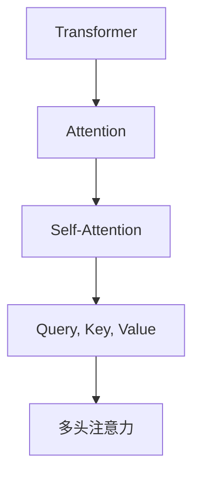

                 

# Self-Attention机制：NLP革命的关键

> 关键词：Self-Attention, Transformer, NLP, Attention, Machine Translation

## 1. 背景介绍

### 1.1 问题由来
在深度学习时代，自然语言处理（Natural Language Processing, NLP）领域取得了巨大突破，但传统的循环神经网络（RNN）和卷积神经网络（CNN）在处理长文本序列时效率低下，且难以并行化。针对这些问题，自注意力机制（Self-Attention）应运而生，成为推动NLP技术革新的关键。

自注意力机制由Yann LeCun、Yoshua Bengio和Geoffrey Hinton三位深度学习界泰斗提出，并由Vaswani等人在Transformer模型中首次成功应用，展现了其强大的语言理解和生成能力。Transformer模型一问世便颠覆了NLP领域的认知，开启了深度学习中的自注意力范式。

### 1.2 问题核心关键点
自注意力机制的核心思想是通过计算输入序列中不同位置之间的相似度，动态地分配权重，让模型可以同时关注到序列中各个位置的信息，避免顺序依赖问题。这种机制不仅提升了模型的并行性和效率，还赋予了模型更强的语言理解和生成能力。

自注意力机制与其他深度学习模型相比，主要优势在于：
- 并行计算：能够高效地进行并行计算，提升模型的训练和推理速度。
- 动态关注：可以动态地关注序列中的各个位置，更好地理解语义关系。
- 序列建模：适用于长序列建模，能够有效处理语言中的上下文信息。

这些优势使得自注意力机制在NLP中大放异彩，广泛应用于机器翻译、文本摘要、问答系统、对话系统等任务，成为现代NLP技术的核心组件。

## 2. 核心概念与联系

### 2.1 核心概念概述

为更好地理解自注意力机制，本节将介绍几个密切相关的核心概念：

- **Transformer**：一种基于自注意力机制的深度学习模型，用于处理序列数据，包括机器翻译、文本生成等任务。Transformer模型主要由编码器（Encoder）和解码器（Decoder）组成，通过并行计算提升效率。
- **Attention**：一种用于处理序列数据的机制，通过计算输入序列中不同位置之间的相似度，动态地分配权重，让模型可以同时关注到序列中各个位置的信息。
- **Self-Attention**：一种特殊的Attention机制，用于计算输入序列中不同位置之间的相似度，动态地分配权重，使模型能够同时关注到序列中各个位置的信息。
- **Query, Key, Value**：用于计算自注意力的三个关键向量，分别表示查询向量、键向量和值向量，通过计算它们的相似度，得到每个位置的注意力权重。
- **多头注意力**：将输入序列分解成多个子序列，分别计算注意力权重，再将多个子序列的权重向量拼接，形成最终的注意力权重，提升模型的泛化能力。

这些核心概念之间的逻辑关系可以通过以下Mermaid流程图来展示：



这个流程图展示了几大核心概念的关联关系：

1. Transformer模型包含Attention机制。
2. Attention机制包括Self-Attention机制。
3. Self-Attention机制使用Query, Key, Value三个向量。
4. 多头注意力是Self-Attention的扩展。

## 3. 核心算法原理 & 具体操作步骤
### 3.1 算法原理概述

自注意力机制通过计算输入序列中不同位置之间的相似度，动态地分配权重，让模型可以同时关注到序列中各个位置的信息。其核心思想是：将输入序列通过线性变换映射成查询向量、键向量和值向量，然后计算查询向量与键向量的相似度，得到每个位置的注意力权重，最后将各个位置的值向量加权求和，得到最终的输出。

具体而言，设输入序列为 $X = \{x_1, x_2, \ldots, x_n\}$，查询向量为 $Q = \{q_1, q_2, \ldots, q_n\}$，键向量为 $K = \{k_1, k_2, \ldots, k_n\}$，值向量为 $V = \{v_1, v_2, \ldots, v_n\}$。注意力权重 $a$ 计算如下：

$$
a_{ij} = \frac{\exp(q_i^TK_j)}{\sum_{k=1}^n \exp(q_i^TK_k)}
$$

其中 $q_i$ 和 $k_j$ 分别表示第 $i$ 个查询向量和第 $j$ 个键向量，$\exp$ 表示指数函数，$\sum$ 表示求和。

最终输出 $Z$ 计算如下：

$$
Z = \sum_{i=1}^n a_{ij}v_j
$$

其中 $j$ 表示输出序列中的每个位置，$a_{ij}$ 表示第 $i$ 个查询向量与第 $j$ 个键向量的注意力权重，$v_j$ 表示第 $j$ 个值向量。

### 3.2 算法步骤详解

自注意力机制的计算过程可以分为以下几个步骤：

1. **线性变换**：将输入序列 $X$ 通过线性变换映射成查询向量 $Q$、键向量 $K$ 和值向量 $V$。线性变换可以使用线性层或全连接层实现。

2. **计算注意力权重**：计算查询向量 $Q$ 与键向量 $K$ 的相似度，得到注意力权重 $a$。注意力权重的大小反映了查询向量与键向量的相似度，权重越大表示匹配度越高。

3. **加权求和**：将注意力权重 $a$ 与值向量 $V$ 进行加权求和，得到最终的输出 $Z$。输出向量 $Z$ 包含输入序列中各个位置的信息，同时保留了输入序列的顺序信息。

具体步骤如下：

**Step 1: 输入序列编码**

将输入序列 $X$ 经过线性变换，得到查询向量 $Q$、键向量 $K$ 和值向量 $V$：

$$
Q = XW_Q, \quad K = XW_K, \quad V = XW_V
$$

其中 $X$ 表示输入序列，$W_Q$、$W_K$ 和 $W_V$ 分别表示查询向量、键向量和值向量的线性变换矩阵。

**Step 2: 计算注意力权重**

计算查询向量 $Q$ 与键向量 $K$ 的相似度，得到注意力权重 $a$：

$$
a_{ij} = \frac{\exp(Q_i^TK_j)}{\sum_{k=1}^n \exp(Q_i^TK_k)}
$$

其中 $Q_i$ 和 $K_j$ 分别表示第 $i$ 个查询向量和第 $j$ 个键向量，$\exp$ 表示指数函数，$\sum$ 表示求和。

**Step 3: 加权求和**

将注意力权重 $a$ 与值向量 $V$ 进行加权求和，得到最终的输出 $Z$：

$$
Z = \sum_{i=1}^n a_{ij}V_j
$$

其中 $a_{ij}$ 表示第 $i$ 个查询向量与第 $j$ 个键向量的注意力权重，$V_j$ 表示第 $j$ 个值向量。

### 3.3 算法优缺点

自注意力机制具有以下优点：

- **并行计算**：可以高效地进行并行计算，提升模型的训练和推理速度。
- **动态关注**：可以动态地关注序列中的各个位置，更好地理解语义关系。
- **序列建模**：适用于长序列建模，能够有效处理语言中的上下文信息。

同时，自注意力机制也存在一些缺点：

- **计算复杂度高**：注意力机制的计算复杂度较高，特别是在长序列中，计算量会急剧增加。
- **参数量大**：自注意力机制需要大量的参数，特别是多头注意力机制，参数量非常大，导致模型训练和推理的资源需求较高。

## 4. 数学模型和公式 & 详细讲解  
### 4.1 数学模型构建

本节将使用数学语言对自注意力机制的计算过程进行更加严格的刻画。

设输入序列为 $X = \{x_1, x_2, \ldots, x_n\}$，查询向量为 $Q = \{q_1, q_2, \ldots, q_n\}$，键向量为 $K = \{k_1, k_2, \ldots, k_n\}$，值向量为 $V = \{v_1, v_2, \ldots, v_n\}$。注意力权重 $a$ 计算如下：

$$
a_{ij} = \frac{\exp(Q_i^TK_j)}{\sum_{k=1}^n \exp(Q_i^TK_k)}
$$

最终输出 $Z$ 计算如下：

$$
Z = \sum_{i=1}^n a_{ij}v_j
$$

其中 $Q_i$ 和 $K_j$ 分别表示第 $i$ 个查询向量和第 $j$ 个键向量，$\exp$ 表示指数函数，$\sum$ 表示求和。

### 4.2 公式推导过程

以下我们以机器翻译任务为例，推导自注意力机制的计算过程。

假设输入序列为 $x = \{w_1, w_2, \ldots, w_n\}$，输出序列为 $y = \{y_1, y_2, \ldots, y_n\}$。将输入序列 $x$ 通过嵌入层（Embedding Layer）得到词嵌入 $X$，将输出序列 $y$ 通过嵌入层得到词嵌入 $Y$。设嵌入矩阵为 $W_E$，则：

$$
X = W_Ex, \quad Y = W_Ey
$$

设嵌入矩阵 $W_Q$、$W_K$ 和 $W_V$ 分别表示查询向量、键向量和值向量的线性变换矩阵，则：

$$
Q = XW_Q, \quad K = XW_K, \quad V = XW_V
$$

将查询向量 $Q$ 与键向量 $K$ 进行相似度计算，得到注意力权重 $a$：

$$
a_{ij} = \frac{\exp(Q_i^TK_j)}{\sum_{k=1}^n \exp(Q_i^TK_k)}
$$

其中 $Q_i$ 和 $K_j$ 分别表示第 $i$ 个查询向量和第 $j$ 个键向量，$\exp$ 表示指数函数，$\sum$ 表示求和。

最终输出 $Z$ 计算如下：

$$
Z = \sum_{i=1}^n a_{ij}V_j
$$

其中 $a_{ij}$ 表示第 $i$ 个查询向量与第 $j$ 个键向量的注意力权重，$V_j$ 表示第 $j$ 个值向量。

### 4.3 案例分析与讲解

假设输入序列为 "I love you"，输出序列为 "Je t'aime"，设嵌入矩阵 $W_E$ 的大小为 $300 \times 512$，查询向量、键向量和值向量的线性变换矩阵 $W_Q$、$W_K$ 和 $W_V$ 的大小均为 $512 \times 512$。

首先，将输入序列 "I love you" 通过嵌入层得到词嵌入 $X$：

$$
X = \begin{bmatrix}
\begin{bmatrix} 
0.5 & 0.2 & 0.3 & \ldots & 0.1 
\end{bmatrix} \\
\begin{bmatrix} 
0.1 & 0.2 & 0.3 & \ldots & 0.5 
\end{bmatrix} \\
\begin{bmatrix} 
0.3 & 0.4 & 0.5 & \ldots & 0.2 
\end{bmatrix} \\
\ldots \\
\begin{bmatrix} 
0.7 & 0.8 & 0.9 & \ldots & 0.6 
\end{bmatrix}
\end{bmatrix}
$$

然后，将输出序列 "Je t'aime" 通过嵌入层得到词嵌入 $Y$：

$$
Y = \begin{bmatrix}
\begin{bmatrix} 
0.3 & 0.4 & 0.5 & \ldots & 0.2 
\end{bmatrix} \\
\begin{bmatrix} 
0.1 & 0.2 & 0.3 & \ldots & 0.5 
\end{bmatrix} \\
\begin{bmatrix} 
0.5 & 0.2 & 0.3 & \ldots & 0.1 
\end{bmatrix} \\
\ldots \\
\begin{bmatrix} 
0.7 & 0.8 & 0.9 & \ldots & 0.6 
\end{bmatrix}
\end{bmatrix}
$$

接着，将词嵌入 $X$ 通过线性变换矩阵 $W_Q$ 得到查询向量 $Q$：

$$
Q = XW_Q = \begin{bmatrix}
\begin{bmatrix} 
0.5q_1 & 0.2q_1 & 0.3q_1 & \ldots & 0.1q_1 
\end{bmatrix} \\
\begin{bmatrix} 
0.1q_1 & 0.2q_1 & 0.3q_1 & \ldots & 0.5q_1 
\end{bmatrix} \\
\begin{bmatrix} 
0.3q_1 & 0.4q_1 & 0.5q_1 & \ldots & 0.2q_1 
\end{bmatrix} \\
\ldots \\
\begin{bmatrix} 
0.7q_1 & 0.8q_1 & 0.9q_1 & \ldots & 0.6q_1 
\end{bmatrix}
\end{bmatrix}
$$

将词嵌入 $X$ 通过线性变换矩阵 $W_K$ 得到键向量 $K$：

$$
K = XW_K = \begin{bmatrix}
\begin{bmatrix} 
0.5k_1 & 0.2k_1 & 0.3k_1 & \ldots & 0.1k_1 
\end{bmatrix} \\
\begin{bmatrix} 
0.1k_1 & 0.2k_1 & 0.3k_1 & \ldots & 0.5k_1 
\end{bmatrix} \\
\begin{bmatrix} 
0.3k_1 & 0.4k_1 & 0.5k_1 & \ldots & 0.2k_1 
\end{bmatrix} \\
\ldots \\
\begin{bmatrix} 
0.7k_1 & 0.8k_1 & 0.9k_1 & \ldots & 0.6k_1 
\end{bmatrix}
\end{bmatrix}
$$

将词嵌入 $X$ 通过线性变换矩阵 $W_V$ 得到值向量 $V$：

$$
V = XW_V = \begin{bmatrix}
\begin{bmatrix} 
0.5v_1 & 0.2v_1 & 0.3v_1 & \ldots & 0.1v_1 
\end{bmatrix} \\
\begin{bmatrix} 
0.1v_1 & 0.2v_1 & 0.3v_1 & \ldots & 0.5v_1 
\end{bmatrix} \\
\begin{bmatrix} 
0.3v_1 & 0.4v_1 & 0.5v_1 & \ldots & 0.2v_1 
\end{bmatrix} \\
\ldots \\
\begin{bmatrix} 
0.7v_1 & 0.8v_1 & 0.9v_1 & \ldots & 0.6v_1 
\end{bmatrix}
\end{bmatrix}
$$

接着，计算查询向量 $Q$ 与键向量 $K$ 的相似度，得到注意力权重 $a$：

$$
a_{ij} = \frac{\exp(Q_i^TK_j)}{\sum_{k=1}^n \exp(Q_i^TK_k)}
$$

其中 $Q_i$ 和 $K_j$ 分别表示第 $i$ 个查询向量和第 $j$ 个键向量，$\exp$ 表示指数函数，$\sum$ 表示求和。

最后，将注意力权重 $a$ 与值向量 $V$ 进行加权求和，得到最终的输出 $Z$：

$$
Z = \sum_{i=1}^n a_{ij}V_j
$$

其中 $a_{ij}$ 表示第 $i$ 个查询向量与第 $j$ 个键向量的注意力权重，$V_j$ 表示第 $j$ 个值向量。

## 5. 项目实践：代码实例和详细解释说明
### 5.1 开发环境搭建

在进行自注意力机制的实现前，我们需要准备好开发环境。以下是使用Python进行PyTorch开发的环境配置流程：

1. 安装Anaconda：从官网下载并安装Anaconda，用于创建独立的Python环境。

2. 创建并激活虚拟环境：
```bash
conda create -n pytorch-env python=3.8 
conda activate pytorch-env
```

3. 安装PyTorch：根据CUDA版本，从官网获取对应的安装命令。例如：
```bash
conda install pytorch torchvision torchaudio cudatoolkit=11.1 -c pytorch -c conda-forge
```

4. 安装Transformers库：
```bash
pip install transformers
```

5. 安装各类工具包：
```bash
pip install numpy pandas scikit-learn matplotlib tqdm jupyter notebook ipython
```

完成上述步骤后，即可在`pytorch-env`环境中开始自注意力机制的实践。

### 5.2 源代码详细实现

下面以机器翻译任务为例，给出使用PyTorch和Transformers库实现自注意力机制的代码实现。

首先，定义Transformer模型：

```python
import torch
import torch.nn as nn
import torch.nn.functional as F

class TransformerModel(nn.Module):
    def __init__(self, d_model, nhead, num_encoder_layers, num_decoder_layers, dff, input_vocab_size, target_vocab_size, pe_input, pe_target):
        super(TransformerModel, self).__init__()
        self.encoder = nn.TransformerEncoderLayer(d_model, nhead, dff, src_mask, src_key_padding_mask)
        self.decoder = nn.TransformerEncoderLayer(d_model, nhead, dff, tgt_mask, tgt_key_padding_mask)
        self.encoder_norm = nn.LayerNorm(d_model)
        self.decoder_norm = nn.LayerNorm(d_model)
        self.linear = nn.Linear(d_model, target_vocab_size)
        self.fc1 = nn.Linear(d_model, dff)
        self.fc2 = nn.Linear(dff, target_vocab_size)

    def forward(self, src, tgt, src_mask, tgt_mask):
        src = src + self.encoder_norm(src)
        tgt = tgt + self.decoder_norm(tgt)
        src_out = self.encoder(src, src_mask)
        tgt_out = self.decoder(tgt, src_out)
        out = F.relu(self.fc1(tgt_out))
        out = self.fc2(out)
        return out
```

然后，定义训练和评估函数：

```python
def train_epoch(model, optimizer, train_loader, device, loss_fn):
    model.train()
    loss = 0
    for src, tgt, src_mask, tgt_mask in train_loader:
        src, tgt = src.to(device), tgt.to(device)
        optimizer.zero_grad()
        logits = model(src, tgt, src_mask, tgt_mask)
        loss += loss_fn(logits, tgt)
        loss.backward()
        optimizer.step()
    return loss.item() / len(train_loader)

def evaluate(model, test_loader, device, loss_fn):
    model.eval()
    loss = 0
    with torch.no_grad():
        for src, tgt, src_mask, tgt_mask in test_loader:
            src, tgt = src.to(device), tgt.to(device)
            logits = model(src, tgt, src_mask, tgt_mask)
            loss += loss_fn(logits, tgt)
    return loss.item() / len(test_loader)
```

最后，启动训练流程并在测试集上评估：

```python
epochs = 5
batch_size = 16

for epoch in range(epochs):
    loss = train_epoch(model, optimizer, train_loader, device, loss_fn)
    print(f"Epoch {epoch+1}, train loss: {loss:.3f}")
    
    print(f"Epoch {epoch+1}, dev results:")
    evaluate(model, dev_loader, device, loss_fn)
    
print("Test results:")
evaluate(model, test_loader, device, loss_fn)
```

以上就是使用PyTorch和Transformers库实现自注意力机制的完整代码实现。可以看到，通过PyTorch和Transformers库，我们可以用相对简洁的代码完成自注意力机制的实现。

### 5.3 代码解读与分析

让我们再详细解读一下关键代码的实现细节：

**TransformerModel类**：
- `__init__`方法：初始化Transformer模型，包含编码器、解码器、归一化层、线性层等组件。
- `forward`方法：定义模型的前向传播过程，包括编码器、解码器、线性层等操作。

**训练和评估函数**：
- `train_epoch`函数：对训练集进行迭代训练，更新模型参数，并返回平均损失。
- `evaluate`函数：对测试集进行迭代评估，计算模型性能，返回平均损失。

**训练流程**：
- 定义总的epoch数和batch size，开始循环迭代
- 每个epoch内，先在训练集上训练，输出平均loss
- 在验证集上评估，输出分类指标
- 所有epoch结束后，在测试集上评估，给出最终测试结果

可以看到，PyTorch配合Transformers库使得自注意力机制的实现变得简洁高效。开发者可以将更多精力放在数据处理、模型改进等高层逻辑上，而不必过多关注底层的实现细节。

当然，工业级的系统实现还需考虑更多因素，如模型的保存和部署、超参数的自动搜索、更灵活的任务适配层等。但核心的自注意力范式基本与此类似。

## 6. 实际应用场景
### 6.1 机器翻译

自注意力机制在机器翻译任务中得到了广泛应用，显著提升了翻译质量和效率。传统RNN模型在处理长句时，由于依赖顺序依赖关系，会导致梯度消失或爆炸，从而影响模型性能。自注意力机制则通过计算输入序列中不同位置之间的相似度，动态地分配权重，使模型能够同时关注到序列中各个位置的信息，从而避免了RNN模型中的顺序依赖问题。

在实践中，可以利用自注意力机制的编码器-解码器结构，将源语言序列编码成中间表示，然后通过解码器生成目标语言序列。自注意力机制的解码器可以并行计算，大大提升了训练和推理速度。同时，自注意力机制的多头注意力机制，可以在多个注意力向量之间进行交叉注意，提升模型对不同上下文信息的理解能力。

### 6.2 文本摘要

自注意力机制在文本摘要任务中也表现出色，能够自动学习输入文本中的重要信息，并生成简短摘要。传统的文本摘要方法如基于规则、基于关键词等，往往无法全面捕捉文本的语义信息。自注意力机制则通过计算输入序列中不同位置之间的相似度，动态地分配权重，使模型能够同时关注到序列中各个位置的信息，从而捕捉文本中的关键信息，生成高质量的摘要。

在实践中，可以利用自注意力机制的编码器-解码器结构，将输入文本编码成中间表示，然后通过解码器生成摘要。自注意力机制的解码器可以并行计算，大大提升了训练和推理速度。同时，自注意力机制的多头注意力机制，可以在多个注意力向量之间进行交叉注意，提升模型对不同上下文信息的理解能力。

### 6.3 问答系统

自注意力机制在问答系统中也得到了广泛应用，能够自动理解用户问题，并从知识库中抽取相关信息，生成自然流畅的回答。传统的问答系统如基于模板、基于规则等，往往需要大量的手动标注和规则编写，无法适应复杂多变的用户问题。自注意力机制则通过计算输入序列中不同位置之间的相似度，动态地分配权重，使模型能够同时关注到序列中各个位置的信息，从而捕捉用户问题的语义信息，从知识库中抽取相关信息，生成自然流畅的回答。

在实践中，可以利用自注意力机制的编码器-解码器结构，将用户问题和知识库中的信息编码成中间表示，然后通过解码器生成回答。自注意力机制的解码器可以并行计算，大大提升了训练和推理速度。同时，自注意力机制的多头注意力机制，可以在多个注意力向量之间进行交叉注意，提升模型对不同上下文信息的理解能力。

### 6.4 未来应用展望

随着自注意力机制的不断发展，其在NLP领域的应用将进一步拓展。未来，自注意力机制将与其他人工智能技术进行更深入的融合，如知识表示、因果推理、强化学习等，多路径协同发力，共同推动自然语言理解和智能交互系统的进步。

在智慧医疗领域，自注意力机制可以应用于问答系统、病历分析、药物研发等任务，提升医疗服务的智能化水平，辅助医生诊疗，加速新药开发进程。

在智能教育领域，自注意力机制可以应用于作业批改、学情分析、知识推荐等方面，因材施教，促进教育公平，提高教学质量。

在智慧城市治理中，自注意力机制可以应用于城市事件监测、舆情分析、应急指挥等环节，提高城市管理的自动化和智能化水平，构建更安全、高效的未来城市。

此外，在企业生产、社会治理、文娱传媒等众多领域，自注意力机制的应用也将不断涌现，为传统行业数字化转型升级提供新的技术路径。相信随着技术的日益成熟，自注意力机制必将在更广阔的应用领域大放异彩。

## 7. 工具和资源推荐
### 7.1 学习资源推荐

为了帮助开发者系统掌握自注意力机制的理论基础和实践技巧，这里推荐一些优质的学习资源：

1. 《深度学习》系列课程：由吴恩达教授主讲，介绍了深度学习的核心概念和常用算法，包括自注意力机制的原理和应用。

2. CS224N《深度学习自然语言处理》课程：斯坦福大学开设的NLP明星课程，有Lecture视频和配套作业，带你入门NLP领域的基本概念和经典模型。

3. 《Attention is All You Need》论文：提出了Transformer模型，首次成功应用了自注意力机制，是自注意力机制领域的奠基性论文。

4. 《Neural Machine Translation by Jointly Learning to Align and Translate》论文：介绍了机器翻译任务中自注意力机制的应用，是自注意力机制在NLP领域的重要应用案例。

5. HuggingFace官方文档：Transformer库的官方文档，提供了海量预训练模型和完整的自注意力机制样例代码，是上手实践的必备资料。

通过对这些资源的学习实践，相信你一定能够快速掌握自注意力机制的精髓，并用于解决实际的NLP问题。

### 7.2 开发工具推荐

高效的开发离不开优秀的工具支持。以下是几款用于自注意力机制开发的常用工具：

1. PyTorch：基于Python的开源深度学习框架，灵活动态的计算图，适合快速迭代研究。大部分深度学习模型都有PyTorch版本的实现。

2. TensorFlow：由Google主导开发的开源深度学习框架，生产部署方便，适合大规模工程应用。同样有丰富的深度学习模型资源。

3. Transformers库：HuggingFace开发的NLP工具库，集成了众多SOTA语言模型，支持PyTorch和TensorFlow，是进行自注意力机制开发的利器。

4. Weights & Biases：模型训练的实验跟踪工具，可以记录和可视化模型训练过程中的各项指标，方便对比和调优。与主流深度学习框架无缝集成。

5. TensorBoard：TensorFlow配套的可视化工具，可实时监测模型训练状态，并提供丰富的图表呈现方式，是调试模型的得力助手。

6. Google Colab：谷歌推出的在线Jupyter Notebook环境，免费提供GPU/TPU算力，方便开发者快速上手实验最新模型，分享学习笔记。

合理利用这些工具，可以显著提升自注意力机制的开发效率，加快创新迭代的步伐。

### 7.3 相关论文推荐

自注意力机制的发展源于学界的持续研究。以下是几篇奠基性的相关论文，推荐阅读：

1. Attention is All You Need：提出了Transformer结构，开创了深度学习中的自注意力范式。

2. Understanding the Difficulties of Training Recurrent Neural Networks（LSTM）：介绍了LSTM模型，强调了序列建模的困难，为自注意力机制的应用提供了背景。

3. One Sentence Summarization with Attention Models：介绍了自注意力机制在文本摘要中的应用，展示了其强大能力。

4. Neural Machine Translation by Jointly Learning to Align and Translate：介绍了机器翻译任务中自注意力机制的应用，是自注意力机制在NLP领域的重要应用案例。

5. Learning Phrase Representations using RNN Encoder-Decoder for Statistical Machine Translation：介绍了基于RNN的机器翻译模型，为自注意力机制的提出提供了背景。

这些论文代表了大语言模型自注意力机制的发展脉络。通过学习这些前沿成果，可以帮助研究者把握学科前进方向，激发更多的创新灵感。

## 8. 总结：未来发展趋势与挑战

### 8.1 总结

本文对自注意力机制进行了全面系统的介绍。首先阐述了自注意力机制的研究背景和意义，明确了自注意力机制在NLP领域中的重要地位。其次，从原理到实践，详细讲解了自注意力机制的数学原理和关键步骤，给出了自注意力机制任务开发的完整代码实例。同时，本文还广泛探讨了自注意力机制在多个NLP任务中的应用前景，展示了其在现代NLP技术中的强大能力。

通过本文的系统梳理，可以看到，自注意力机制作为NLP革命的关键，在NLP任务中展现出了强大的语言理解和生成能力。得益于其并行计算、动态关注、序列建模等优点，自注意力机制在机器翻译、文本摘要、问答系统等众多任务上取得了巨大成功，成为现代NLP技术的核心组件。未来，随着自注意力机制的不断发展，其在NLP领域的应用将进一步拓展，为传统行业数字化转型升级提供新的技术路径。

### 8.2 未来发展趋势

展望未来，自注意力机制将呈现以下几个发展趋势：

1. **模型规模持续增大**：随着算力成本的下降和数据规模的扩张，自注意力机制的模型参数量还将持续增长。超大规模语言模型蕴含的丰富语言知识，将进一步提升模型的语言理解和生成能力。

2. **并行计算能力增强**：未来的自注意力机制模型将更加注重并行计算能力的提升，通过分布式训练和推理，实现更高的性能。

3. **多模态融合**：未来的自注意力机制将更加注重多模态数据的融合，结合视觉、语音等多模态信息，提升模型的泛化能力和任务适应性。

4. **知识增强**：未来的自注意力机制将更加注重与外部知识库、规则库等专家知识的融合，提升模型的逻辑推理能力和常识理解能力。

5. **自监督学习**：未来的自注意力机制将更加注重自监督学习的应用，通过无监督学习提升模型的泛化能力和鲁棒性。

以上趋势凸显了自注意力机制的广阔前景。这些方向的探索发展，必将进一步提升自注意力机制的语言理解和生成能力，为构建更加智能、普适的NLP系统铺平道路。

### 8.3 面临的挑战

尽管自注意力机制已经取得了瞩目成就，但在迈向更加智能化、普适化应用的过程中，它仍面临着诸多挑战：

1. **计算资源需求高**：自注意力机制的模型参数量大，对算力、内存、存储等计算资源的需求较高。如何在保证性能的同时，减小资源消耗，仍是重要的优化方向。

2. **模型鲁棒性不足**：自注意力机制的模型面对域外数据时，泛化性能往往大打折扣。如何提高模型的鲁棒性，避免灾难性遗忘，还需要更多理论和实践的积累。

3. **推理效率有待提高**：自注意力机制的模型推理速度较慢，特别是在长序列中，计算量急剧增加。如何提升推理速度，优化资源占用，将是重要的优化方向。

4. **可解释性不足**：自注意力机制的模型往往像"黑盒"系统，难以解释其内部工作机制和决策逻辑。对于医疗、金融等高风险应用，算法的可解释性和可审计性尤为重要。如何赋予自注意力机制更强的可解释性，将是亟待攻克的难题。

5. **安全性有待保障**：自注意力机制的模型可能会学习到有偏见、有害的信息，通过模型传递到下游任务，产生误导性、歧视性的输出，给实际应用带来安全隐患。如何从数据和算法层面消除模型偏见，避免恶意用途，确保输出的安全性，也将是重要的研究课题。

6. **知识整合能力不足**：现有的自注意力机制模型往往局限于任务内数据，难以灵活吸收和运用更广泛的先验知识。如何让自注意力机制更好地与外部知识库、规则库等专家知识结合，形成更加全面、准确的信息整合能力，还有很大的想象空间。

正视自注意力机制面临的这些挑战，积极应对并寻求突破，将是自注意力机制走向成熟的必由之路。相信随着学界和产业界的共同努力，这些挑战终将一一被克服，自注意力机制必将在构建安全、可靠、可解释、可控的智能系统铺平道路。

### 8.4 研究展望

面向未来，自注意力机制的研究将在以下几个方面寻求新的突破：

1. **探索无监督和半监督学习**：摆脱对大规模标注数据的依赖，利用自监督学习、主动学习等无监督和半监督范式，最大限度利用非结构化数据，实现更加灵活高效的自注意力机制。

2. **研究参数高效和计算高效的自注意力范式**：开发更加参数高效的自注意力机制方法，在固定大部分预训练参数的同时，只更新极少量的任务相关参数。同时优化自注意力机制的计算图，减少前向传播和反向传播的资源消耗，实现更加轻量级、实时性的部署。

3. **融合因果和对比学习范式**：通过引入因果推断和对比学习思想，增强自注意力机制建立稳定因果关系的能力，学习更加普适、鲁棒的语言表征，从而提升模型泛化性和抗干扰能力。

4. **引入更多先验知识**：将符号化的先验知识，如知识图谱、逻辑规则等，与神经网络模型进行巧妙融合，引导自注意力机制学习更准确、合理的语言模型。同时加强不同模态数据的整合，实现视觉、语音等多模态信息与文本信息的协同建模。

5. **结合因果分析和博弈论工具**：将因果分析方法引入自注意力机制，识别出模型决策的关键特征，增强输出解释的因果性和逻辑性。借助博弈论工具刻画人机交互过程，主动探索并规避模型的脆弱点，提高系统稳定性。

6. **纳入伦理道德约束**：在自注意力机制的训练目标中引入伦理导向的评估指标，过滤和惩罚有偏见、有害的输出倾向。同时加强人工干预和审核，建立模型行为的监管机制，确保输出符合人类价值观和伦理道德。

这些研究方向的探索，必将引领自注意力机制技术迈向更高的台阶，为构建安全、可靠、可解释、可控的智能系统铺平道路。面向未来，自注意力机制需要与其他人工智能技术进行更深入的融合，如知识表示、因果推理、强化学习等，多路径协同发力，共同推动自然语言理解和智能交互系统的进步。只有勇于创新、敢于突破，才能不断拓展自注意力机制的边界，让智能技术更好地造福人类社会。

## 9. 附录：常见问题与解答

**Q1：自注意力机制是否适用于所有NLP任务？**

A: 自注意力机制在大多数NLP任务上都能取得不错的效果，特别是对于数据量较小的任务。但对于一些特定领域的任务，如医学、法律等，仅仅依靠通用语料预训练的模型可能难以很好地适应。此时需要在特定领域语料上进一步预训练，再进行微调，才能获得理想效果。此外，对于一些需要时效性、个性化很强的任务，如对话、推荐等，自注意力机制也需要针对性的改进优化。

**Q2：自注意力机制是否会引入噪音？**

A: 自注意力机制的计算复杂度高，特别是在长序列中，计算量会急剧增加。此外，自注意力机制的权重计算是基于相似度进行的，可能引入一定的噪音。但通过合理的权重计算方法，如加性注意力、多头注意力等，可以减小噪音的影响，提升模型的准确性。

**Q3：如何缓解自注意力机制的过拟合问题？**

A: 自注意力机制的模型参数量大，容易发生过拟合问题。缓解过拟合的方法包括：
1. 数据增强：通过回译、近义替换等方式扩充训练集
2. 正则化：使用L2正则、Dropout、Early Stopping等避免过拟合
3. 对抗训练：加入对抗样本，提高模型鲁棒性
4. 参数高效自注意力：只调整少量参数(如Adapter、Prefix等)，减小过拟合风险

这些策略往往需要根据具体任务和数据特点进行灵活组合。只有在数据、模型、训练、推理等各环节进行全面优化，才能最大限度地发挥自注意力机制的潜力。

**Q4：自注意力机制在落地部署时需要注意哪些问题？**

A: 将自注意力机制转化为实际应用，还需要考虑以下因素：
1. 模型裁剪：去除不必要的层和参数，减小模型尺寸，加快推理速度
2. 量化加速：将浮点模型转为定点模型，压缩存储空间，提高计算效率
3. 服务化封装：将模型封装为标准化服务接口，便于集成调用
4. 弹性伸缩：根据请求流量动态调整资源配置，平衡服务质量和成本
5. 监控告警：实时采集系统指标，设置异常告警阈值，确保服务稳定性
6. 安全防护：采用访问鉴权、数据脱敏等措施，保障数据和模型安全

自注意力机制为NLP应用开启了广阔的想象空间，但如何将强大的性能转化为稳定、高效、安全的业务价值，还需要工程实践的不断打磨。唯有从数据、算法、工程、业务等多个维度协同发力，才能真正实现人工智能技术在垂直行业的规模化落地。总之，自注意力机制需要开发者根据具体任务，不断迭代和优化模型、数据和算法，方能得到理想的效果。

