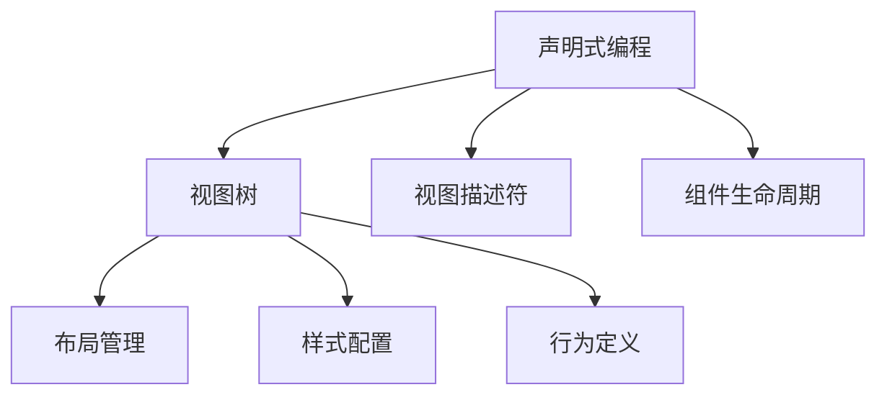

                 

# SwiftUI 框架设计理念：苹果声明式 UI 框架的优点

在当今的移动应用开发中，声明式 UI 框架已成为一种流行且强大的工具。苹果公司推出的 SwiftUI 框架正是这一领域的杰出代表。SwiftUI 提供了一种直观、灵活的方式，让开发者能够以声明式的方式来构建用户界面。本文将深入探讨 SwiftUI 框架的设计理念，以及它相对于传统的命令式框架的优点。

## 1. 背景介绍

### 1.1 问题由来

在 iOS 和 macOS 开发中，传统的命令式框架如 UIKit 和 AppKit 长期以来一直是主流。然而，命令式框架的编程方式较为复杂，并且代码难以维护。随着 Swift 语言的发展，苹果公司推出了 SwiftUI，旨在简化 UI 开发，使其更加直观和易于理解。

### 1.2 问题核心关键点

SwiftUI 框架的核心设计理念是声明式编程。通过声明式编程，开发者只需要定义界面组件的属性和行为，框架会自动生成视图树，并负责管理布局和更新。这种设计不仅简化了开发流程，还提高了代码的可读性和可维护性。

## 2. 核心概念与联系

### 2.1 核心概念概述

为了更好地理解 SwiftUI 的设计理念，我们将介绍几个关键概念：

- **声明式编程**：开发者通过声明方式定义 UI 组件的属性和行为，框架自动生成视图树并负责布局和更新。
- **视图树**：SwiftUI 将 UI 组件以树形结构组织，每个节点对应一个视图，包括布局、样式和行为。
- **视图描述符**：每个视图节点都有一个或多个视图描述符，定义了视图的属性和行为。
- **组件生命周期**：SwiftUI 中的组件会经历创建、布局、更新和销毁等生命周期阶段。

这些概念构成了 SwiftUI 的核心设计基础，帮助开发者以直观、可理解的方式构建用户界面。

### 2.2 核心概念原理和架构的 Mermaid 流程图



该图展示了 SwiftUI 的核心架构和概念。开发者通过声明式编程定义 UI 组件，框架自动生成视图树，并负责布局、样式和行为管理。

## 3. 核心算法原理 & 具体操作步骤

### 3.1 算法原理概述

SwiftUI 的声明式编程是基于视图树的。每个视图节点都有一个或多个视图描述符，定义了视图的属性和行为。框架根据这些描述符自动生成视图树，并负责布局和更新。

### 3.2 算法步骤详解

SwiftUI 的开发流程分为以下几个步骤：

1. **定义视图**：开发者通过声明式方式定义视图组件。
2. **配置视图描述符**：为视图节点配置视图描述符，定义视图的属性和行为。
3. **布局管理**：框架自动生成视图树，并负责布局和更新。
4. **响应变化**：当视图数据发生变化时，框架自动更新视图树，保证界面一致性。

这些步骤展示了 SwiftUI 的核心开发流程，简化了传统的命令式框架的开发复杂度。

### 3.3 算法优缺点

SwiftUI 框架的主要优点包括：

- **简洁直观**：声明式编程使代码更加易于理解和维护。
- **灵活性**：视图树结构使开发者可以灵活地组合和重用 UI 组件。
- **自动更新**：框架自动处理布局和更新，减少了手动操作。

缺点方面，SwiftUI 目前还存在一些挑战：

- **性能问题**：视图树的大规模更新可能导致性能问题，需要进一步优化。
- **学习曲线**：声明式编程对一些开发者来说可能需要适应时间。

### 3.4 算法应用领域

SwiftUI 适用于各种类型的移动应用开发，包括 UI 界面、动态布局、交互动画等。其声明式编程设计理念可以应用于 iOS 和 macOS 开发，以及跨平台开发。

## 4. 数学模型和公式 & 详细讲解 & 举例说明

SwiftUI 的声明式编程并不涉及复杂的数学模型和公式，但为了更好地理解其设计原理，我们可以使用一些简单的示例来演示。

### 4.1 数学模型构建

SwiftUI 的视图描述符可以通过类或协议来实现。以下是一个简单的示例，展示如何使用协议来实现视图描述符：

```swift
protocol View: ViewRepresentable {
    func body(content: Content) -> some View
}

struct ContentView: View {
    var text: String
    
    func body(content: Content) -> some View {
        VStack {
            Text("Hello, \(text)")
        }
    }
}

let content = ContentView(text: "World")
let view: View = ContentView.viewRepresentation(content)
```

### 4.2 公式推导过程

上述代码中，我们定义了一个 `View` 协议，并使用 `ContentView` 结构体实现该协议。在 `body` 方法中，我们返回了一个包含 `Text` 视图的结构体。这个结构体通过 `VStack` 布局容器来组合 `Text` 视图，并使用占位符字符串 `Hello, \(text)` 来动态显示 `text` 变量的值。

### 4.3 案例分析与讲解

通过这个简单的例子，我们可以看到 SwiftUI 的声明式编程如何简化 UI 开发。开发者只需要定义视图组件和视图描述符，框架会自动生成视图树并负责布局和更新。

## 5. 项目实践：代码实例和详细解释说明

### 5.1 开发环境搭建

为了使用 SwiftUI，开发者需要安装 Xcode 13 或更高版本，并创建新的 SwiftUI 项目。以下是在 Xcode 中创建 SwiftUI 项目的基本步骤：

1. 打开 Xcode。
2. 选择 "Create a new Xcode project"。
3. 选择 "App" 模板。
4. 在 "Choose a template for your Xcode project" 中选择 "SwiftUI App"。
5. 输入项目名称和保存路径。

### 5.2 源代码详细实现

下面是一个简单的 SwiftUI 应用程序示例，展示了如何使用 `View` 协议和 `VStack` 布局容器：

```swift
protocol View: ViewRepresentable {
    func body(content: Content) -> some View
}

struct ContentView: View {
    var name: String
    
    func body(content: Content) -> some View {
        VStack {
            Text("Hello, \(name)")
            Text("Welcome to SwiftUI!")
        }
    }
}

let content = ContentView(name: "World")
let view: View = ContentView.viewRepresentation(content)
```

### 5.3 代码解读与分析

在上述代码中，我们定义了一个 `View` 协议，并使用 `ContentView` 结构体实现该协议。在 `body` 方法中，我们返回了一个包含 `Text` 视图的结构体，其中第一个 `Text` 视图动态显示了 `name` 变量的值，第二个 `Text` 视图显示了固定文本。

### 5.4 运行结果展示

运行上述代码，将会在 Xcode 模拟器中看到一个包含欢迎信息和动态名称的窗口。这展示了 SwiftUI 的声明式编程如何轻松地创建动态 UI 界面。

## 6. 实际应用场景

SwiftUI 已经被广泛应用于各种类型的移动应用开发中，以下是几个实际应用场景：

### 6.1 应用程序界面

SwiftUI 可以用于创建复杂的应用程序界面。开发者可以通过声明式编程定义视图组件和视图描述符，轻松地组合和重用 UI 组件。

### 6.2 动态布局

SwiftUI 支持动态布局，可以根据视图数据的更新自动调整布局。这对于创建响应式用户界面非常有用。

### 6.3 交互动画

SwiftUI 可以轻松地创建交互动画，使 UI 元素能够以流畅的方式响应用户交互。这对于提升用户体验非常重要。

### 6.4 未来应用展望

SwiftUI 的未来应用展望包括：

- **跨平台支持**：SwiftUI 可以用于 iOS、macOS、watchOS 和 tvOS 平台开发。
- **深度集成**：SwiftUI 可以与 iOS 和其他 Apple 技术深度集成，如 Apple Watch 和 Apple TV。
- **社区支持**：SwiftUI 拥有一个活跃的社区，不断有新的组件和框架出现，为开发者提供更多选择。

## 7. 工具和资源推荐

### 7.1 学习资源推荐

- **官方文档**：苹果公司提供了详细的 SwiftUI 官方文档，包括语言指南、示例代码和 API 参考。
- **SwiftUI 社区**：SwiftUI 社区非常活跃，开发者可以在社区中分享经验和资源，获取帮助。
- **SwiftUI 书籍**：有许多关于 SwiftUI 的书籍，如《SwiftUI: Hands-On Design Patterns》和《SwiftUI Patterns》。

### 7.2 开发工具推荐

- **Xcode**：苹果公司的开发工具，支持 SwiftUI 开发和调试。
- **Playgrounds**：苹果公司的交互式代码编辑器，可以快速试验 SwiftUI 代码。
- **GraphQL Playground**：用于调试 GraphQL API，可以与 SwiftUI 无缝集成。

### 7.3 相关论文推荐

- **SwiftUI 设计理念**：苹果公司发布了多篇关于 SwiftUI 设计理念的论文，详细介绍了其核心设计思想和优势。
- **SwiftUI 性能优化**：多篇论文探讨了 SwiftUI 的性能优化技术，如视图树重用和数据绑定优化。

## 8. 总结：未来发展趋势与挑战

### 8.1 研究成果总结

SwiftUI 框架的成功得益于其简洁直观的声明式编程设计。通过定义视图组件和视图描述符，开发者可以轻松地构建动态、响应式和互动的 UI 界面。SwiftUI 的自动更新机制确保了界面的实时响应和一致性。

### 8.2 未来发展趋势

SwiftUI 的未来发展趋势包括：

- **性能优化**：随着 SwiftUI 的广泛使用，性能优化将是一个重要研究方向。
- **跨平台支持**：SwiftUI 将进一步扩展到更多平台，提升开发效率和用户体验。
- **社区生态**：SwiftUI 社区将不断成长，为开发者提供更多资源和支持。

### 8.3 面临的挑战

SwiftUI 目前面临的挑战包括：

- **性能问题**：视图树的大规模更新可能导致性能问题，需要进一步优化。
- **学习曲线**：声明式编程对一些开发者来说可能需要适应时间。
- **框架兼容性**：与其他框架的兼容性问题需要进一步解决。

### 8.4 研究展望

未来的研究将集中在以下几个方面：

- **优化视图树重用**：通过改进视图树重用机制，减少不必要的重新渲染。
- **支持更多的视图组件**：增加更多的内置视图组件，提供更多选择。
- **增强跨平台支持**：进一步扩展 SwiftUI 到更多平台，提升开发效率。

## 9. 附录：常见问题与解答

**Q1：SwiftUI 的视图描述符和命令式框架有何不同？**

A: SwiftUI 的视图描述符通过声明式编程方式定义，开发者只需要定义视图的属性和行为，框架自动生成视图树并负责布局和更新。而命令式框架需要手动管理视图树，代码较为复杂。

**Q2：SwiftUI 是否支持复杂布局？**

A: SwiftUI 支持复杂的布局，包括水平和垂直布局、间距、填充和对齐等。通过组合这些布局方式，可以轻松地创建复杂的 UI 界面。

**Q3：SwiftUI 的性能优化有哪些技巧？**

A: SwiftUI 的性能优化技巧包括视图树重用、延迟计算、懒加载和缓存。开发者可以根据具体场景选择适合的优化方法。

**Q4：SwiftUI 是否支持动画？**

A: SwiftUI 支持动画，可以通过 `Animation` 框架来实现。开发者可以使用 `withAnimation` 方法来创建动画效果，提升用户体验。

**Q5：SwiftUI 如何与 GraphQL API 集成？**

A: SwiftUI 可以通过 GraphQL Playground 来调试 GraphQL API，并使用 `API` 视图组件来展示 GraphQL 数据。开发者可以将 GraphQL 数据绑定到 SwiftUI 视图上，实现动态数据驱动的 UI。

---

作者：禅与计算机程序设计艺术 / Zen and the Art of Computer Programming

