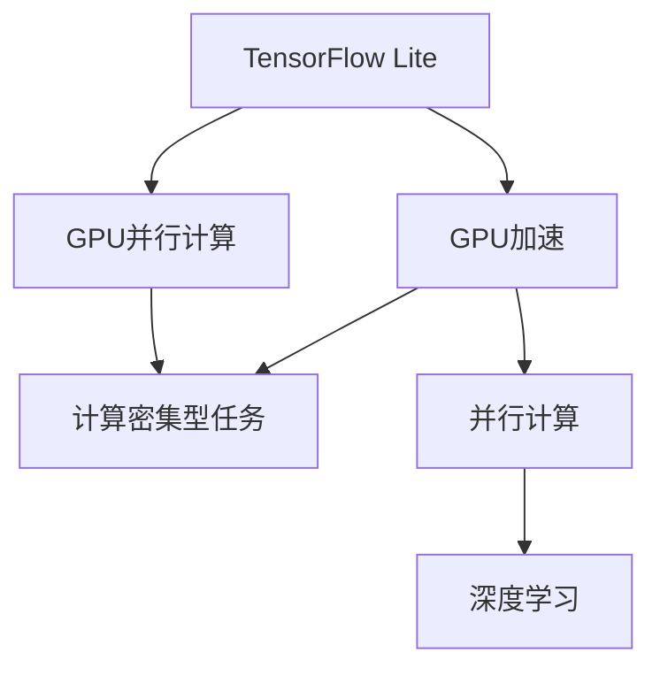

                 

# TensorFlow Lite GPU加速

## 1. 背景介绍

### 1.1 问题由来
在深度学习应用的广泛普及中，模型的计算需求持续增长，对硬件资源提出了更高的要求。特别是在移动端和嵌入式设备上，有限的计算资源和能耗限制使得模型推理面临严峻挑战。为了应对这些挑战，TensorFlow Lite等移动端优化工具应运而生。

TensorFlow Lite作为TensorFlow的轻量级版本，支持在移动设备上高效运行深度学习模型，但受限于硬件性能，推理速度仍然是一个重要瓶颈。为了进一步提升TensorFlow Lite在移动设备上的运行效率，GPU加速成为了不可或缺的解决方案。

### 1.2 问题核心关键点
GPU加速通过将模型计算任务从CPU转移到GPU上，利用GPU的高并行计算能力来加速深度学习模型的推理过程。GPU作为计算密集型设备，能够显著提高模型的推理速度和性能。

GPU加速的核心在于：
1. 硬件并行性：GPU具有比CPU更多的计算单元和高速内存，可以并行处理大量数据。
2. 高速IO：GPU有更高效的内存带宽和IO速度，能够快速加载和传输数据。
3. 数据并行性：GPU通过并行处理数据流，能够快速完成大规模矩阵乘法和卷积操作。

## 2. 核心概念与联系

### 2.1 核心概念概述

为更好地理解GPU加速在TensorFlow Lite中的应用，本节将介绍几个密切相关的核心概念：

- **TensorFlow Lite**：基于TensorFlow的轻量级深度学习模型运行引擎，支持在移动和嵌入式设备上部署和执行深度学习模型。
- **GPU加速**：利用图形处理单元（GPU）的高并行计算能力，加速深度学习模型的推理过程，提高模型的计算效率。
- **图形处理单元（GPU）**：一种专门设计用于并行处理大量数据的高性能硬件设备，广泛应用于计算密集型应用。
- **计算密集型（Computation-intensive）**：指需要大量计算资源才能完成的任务，通常涉及复杂的数据处理和计算操作。
- **并行计算（Parallel Computing）**：指同时处理多个数据流，提高计算效率和性能的计算方式。
- **深度学习（Deep Learning）**：一类基于神经网络的机器学习技术，涉及大规模矩阵运算和卷积操作，计算密集型较高。

这些核心概念之间的逻辑关系可以通过以下Mermaid流程图来展示：



这个流程图展示了大语言模型的核心概念及其之间的关系：

1. TensorFlow Lite作为深度学习模型的轻量级运行引擎。
2. GPU加速通过并行计算来加速TensorFlow Lite的模型推理过程。
3. GPU并行计算支持深度学习模型的高效运行。
4. 深度学习模型涉及大量计算密集型任务，适合GPU加速。
5. 并行计算是GPU加速的重要基础。

## 3. 核心算法原理 & 具体操作步骤
### 3.1 算法原理概述

GPU加速的核心原理是将深度学习模型的计算任务从CPU转移到GPU上，利用GPU的高并行计算能力来加速模型的推理过程。具体而言，GPU加速包括以下几个关键步骤：

1. **数据传输**：将模型的输入数据从CPU传输到GPU上。
2. **模型转换**：将TensorFlow Lite模型转换为GPU支持的格式。
3. **并行计算**：在GPU上并行执行深度学习模型的计算任务。
4. **结果传输**：将GPU上的计算结果传输回CPU，进行后续处理。

这些步骤通过GPU加速优化，可以显著提升模型的推理速度和性能。

### 3.2 算法步骤详解

以下是TensorFlow Lite GPU加速的具体操作步骤：

1. **数据准备**：在TensorFlow Lite中，使用`interpreter`对象对输入数据进行预处理，包括数据转换、归一化等操作。使用`GPUDelegate`将数据传输到GPU上。

2. **模型转换**：将TensorFlow Lite模型转换为GPU支持的格式，可以使用`tf.lite.experimental.TFLiteModelConverter`进行模型转换。在转换时，需要指定`gpu_compatibility`选项，以确保模型兼容GPU。

3. **GPU加速**：在TensorFlow Lite的`interpreter`对象中，通过`experimental_delegate()`方法启用GPU加速，并传递`GPUDelegate`实例。

4. **模型推理**：在GPU上执行模型推理，使用`interpreter`对象的`Invoke`方法进行计算。

5. **结果处理**：将GPU上的计算结果传输回CPU，进行后处理和输出。

### 3.3 算法优缺点

GPU加速在提升TensorFlow Lite模型推理速度和性能方面具有显著优势：
1. **加速性能**：GPU并行计算能力极强，能够显著提高模型的计算效率。
2. **硬件兼容性**：支持多种硬件平台，包括桌面GPU、移动GPU等。
3. **易于使用**：TensorFlow Lite GPU加速的API简单，开发者易于上手。

然而，GPU加速也存在一些局限：
1. **硬件依赖**：GPU加速依赖硬件平台，部分设备可能不支持或性能有限。
2. **内存占用**：GPU加速需要额外的内存资源，可能在内存有限的环境中带来挑战。
3. **编程复杂性**：GPU编程复杂，需要掌握一定的并行计算和优化技巧。

## 4. 数学模型和公式 & 详细讲解
### 4.1 数学模型构建

GPU加速的数学模型主要涉及以下几个关键步骤：

1. **数据传输**：使用GPU的IO接口将数据从CPU传输到GPU上。
2. **模型转换**：将TensorFlow Lite模型转换为GPU支持的格式，包括修改计算图和参数。
3. **并行计算**：在GPU上并行执行计算任务，利用矩阵乘法和卷积等操作。
4. **结果传输**：将计算结果从GPU传输回CPU，进行后处理和输出。

### 4.2 公式推导过程

以下是对GPU加速中主要操作的数学推导：

1. **数据传输**：
   - CPU到GPU的数据传输公式：`Host->Device`，使用GPU的DMA（直接内存访问）技术，将CPU上的数据快速传输到GPU上。
   - GPU到CPU的数据传输公式：`Device->Host`，同样使用GPU的DMA技术，将计算结果传输回CPU。

2. **模型转换**：
   - TensorFlow Lite模型的计算图转换公式：将`TensorFlow`的计算图转换为`TFLite`计算图，使用`tf.lite.experimental.TFLiteModelConverter`进行转换。
   - 参数转换公式：将`TensorFlow`模型的参数转换为`TFLite`模型的参数，使用`tf.lite.experimental.TFLiteConverter`进行参数优化。

3. **并行计算**：
   - GPU上的矩阵乘法公式：`A*B = C`，利用GPU的并行计算能力，加速矩阵乘法运算。
   - GPU上的卷积操作公式：`Conv2D(A,B) = C`，利用GPU的并行计算能力，加速卷积运算。

4. **结果传输**：
   - GPU到CPU的数据传输公式：`Device->Host`，使用GPU的DMA技术，将计算结果传输回CPU。

### 4.3 案例分析与讲解

以下是一个简单的TensorFlow Lite模型进行GPU加速的案例分析：

1. **数据准备**：
   - 使用TensorFlow Lite对输入数据进行预处理，包括数据归一化、转换等操作。
   - 将预处理后的数据传输到GPU上，使用`GPUDelegate`进行数据准备。

2. **模型转换**：
   - 使用`tf.lite.experimental.TFLiteModelConverter`将TensorFlow Lite模型转换为GPU支持的格式。
   - 在转换时，指定`gpu_compatibility`选项，确保模型兼容GPU。

3. **GPU加速**：
   - 在TensorFlow Lite的`interpreter`对象中，通过`experimental_delegate()`方法启用GPU加速，并传递`GPUDelegate`实例。
   - 使用`GPUDelegate`中的`SetInput`和`SetOutput`方法，指定输入和输出数据的存储位置。

4. **模型推理**：
   - 在GPU上执行模型推理，使用`interpreter`对象的`Invoke`方法进行计算。
   - 将计算结果传输回CPU，进行后处理和输出。

5. **结果处理**：
   - 使用Python对计算结果进行后处理，得到最终的推理输出。

## 5. 项目实践：代码实例和详细解释说明
### 5.1 开发环境搭建

在进行TensorFlow Lite GPU加速的实践前，我们需要准备好开发环境。以下是使用Python进行TensorFlow Lite GPU加速的环境配置流程：

1. 安装Anaconda：从官网下载并安装Anaconda，用于创建独立的Python环境。

2. 创建并激活虚拟环境：
```bash
conda create -n tflite-env python=3.8 
conda activate tflite-env
```

3. 安装TensorFlow Lite和GPU加速依赖：
```bash
pip install tensorflow-lite tensorflow-lite-gpu
```

4. 安装GPU加速所需的CUDA和cuDNN库：
```bash
conda install pytorch torchvision torchaudio cudatoolkit=11.1 -c pytorch -c conda-forge
```

完成上述步骤后，即可在`tflite-env`环境中开始TensorFlow Lite GPU加速的实践。

### 5.2 源代码详细实现

以下是一个简单的TensorFlow Lite模型进行GPU加速的Python代码实现：

```python
import tensorflow as tf
import tensorflow_lite as lite

# 加载模型
interpreter = lite.Interpreter(model_path='path/to/model.tflite')
interpreter.allocate_tensors()

# 准备数据
input_data = [input_value_1, input_value_2, ...]  # 预处理后的输入数据
interpreter.resize_tensor_input(index=0, size=input_data.shape)
interpreter.allocate_tensors()

# 数据传输到GPU
delegate = lite.experimental.GPUDelegate()
interpreter.ModifyGraphWithDelegate(delegate)

# 执行模型推理
interpreter.invoke()

# 结果处理
output_data = interpreter.get_tensor(interpreter.get_signature_runner().get_signature_runner().get_output_details()[0]['index'])
```

代码解读：
1. 加载模型：使用`lite.Interpreter`对象加载TensorFlow Lite模型，并调用`allocate_tensors()`方法分配计算资源。
2. 数据准备：将预处理后的输入数据传递给模型，使用`resize_tensor_input()`方法调整输入张量的大小，确保数据格式正确。
3. 数据传输到GPU：创建`GPUDelegate`对象，使用`ModifyGraphWithDelegate()`方法将计算任务转移到GPU上。
4. 模型推理：调用`invoke()`方法执行模型推理，完成计算。
5. 结果处理：使用`get_tensor()`方法获取输出数据，进行后续处理。

### 5.3 代码解读与分析

让我们再详细解读一下关键代码的实现细节：

1. `lite.Interpreter`对象：用于加载和执行TensorFlow Lite模型。
2. `resize_tensor_input()`方法：调整输入张量的尺寸，确保数据格式正确。
3. `GPUDelegate`对象：用于将计算任务转移到GPU上。
4. `ModifyGraphWithDelegate()`方法：使用`GPUDelegate`对象修改计算图，将计算任务转移到GPU上。
5. `invoke()`方法：执行模型推理，完成计算。
6. `get_tensor()`方法：获取输出数据，进行后续处理。

通过以上代码示例，可以看到TensorFlow Lite GPU加速的核心实现步骤：数据传输、模型转换、GPU加速、模型推理和结果处理。在实际应用中，开发者可以根据具体需求进行灵活组合和优化。

## 6. 实际应用场景
### 6.1 智能手机应用

TensorFlow Lite GPU加速在智能手机应用中具有广泛应用前景。智能手机的计算资源有限，但GPU加速能够显著提升模型的推理速度，满足实时应用的需求。

在智能手机应用中，常见的GPU加速应用场景包括：
1. 图像识别：智能手机中的拍照和视频功能，利用GPU加速进行实时图像处理和识别。
2. 语音识别：智能手机的语音助手功能，利用GPU加速进行实时语音转文本和理解。
3. 游戏开发：智能手机游戏中的AI角色和场景渲染，利用GPU加速进行高效计算。

### 6.2 智能安防监控

在智能安防监控领域，GPU加速能够显著提升实时监控视频和图像处理的速度和效率。

常见的GPU加速应用场景包括：
1. 实时视频监控：使用GPU加速进行实时视频流的帧率提升和图像处理。
2. 人脸识别：使用GPU加速进行实时人脸检测和识别，提高安防系统的响应速度和准确性。
3. 行为分析：使用GPU加速进行实时行为分析，自动识别异常行为和事件。

### 6.3 自动驾驶

自动驾驶技术需要实时处理大量的传感器数据和环境信息，GPU加速能够显著提升计算速度和性能。

常见的GPU加速应用场景包括：
1. 实时视频处理：使用GPU加速进行实时视频流的帧率提升和图像处理。
2. 目标检测：使用GPU加速进行实时目标检测和跟踪，提高自动驾驶系统的响应速度和准确性。
3. 环境感知：使用GPU加速进行实时环境感知和分析，提高自动驾驶系统的决策效率。

### 6.4 未来应用展望

随着GPU技术的持续进步，TensorFlow Lite GPU加速的应用场景将进一步扩展，未来可能在更多领域发挥重要作用。

在医疗、金融、智能家居等众多领域，GPU加速的应用将带来新的创新和突破，为智能社会的建设注入新的动力。

## 7. 工具和资源推荐
### 7.1 学习资源推荐

为了帮助开发者系统掌握TensorFlow Lite GPU加速的理论基础和实践技巧，这里推荐一些优质的学习资源：

1. TensorFlow Lite官方文档：提供了TensorFlow Lite的完整文档和API参考，是学习TensorFlow Lite GPU加速的最佳入口。

2. TensorFlow Lite Tutorials：由TensorFlow官方提供的教程，涵盖TensorFlow Lite的各类应用场景和技术细节。

3. TensorFlow Lite GitHub仓库：包含丰富的TensorFlow Lite项目和示例代码，是学习TensorFlow Lite GPU加速的实用资源。

4. TensorFlow Lite模型转换工具：用于将TensorFlow模型转换为TensorFlow Lite模型，并支持GPU加速，提供了丰富的模型转换工具和教程。

5. TensorFlow Lite开发论坛：提供了TensorFlow Lite的开发者社区和支持平台，是交流学习和解决问题的最佳场所。

通过对这些资源的学习实践，相信你一定能够快速掌握TensorFlow Lite GPU加速的精髓，并用于解决实际的TensorFlow Lite模型推理问题。

### 7.2 开发工具推荐

高效的开发离不开优秀的工具支持。以下是几款用于TensorFlow Lite GPU加速开发的常用工具：

1. TensorFlow Lite：基于TensorFlow的轻量级深度学习模型运行引擎，支持在移动和嵌入式设备上部署和执行深度学习模型。

2. GPU加速库：支持多种GPU平台，包括桌面GPU和移动GPU，提供高效的GPU计算支持。

3. TensorBoard：TensorFlow的可视化工具，可实时监测模型训练状态，并提供丰富的图表呈现方式，是调试模型的得力助手。

4. Weights & Biases：模型训练的实验跟踪工具，可以记录和可视化模型训练过程中的各项指标，方便对比和调优。

5. Google Colab：谷歌推出的在线Jupyter Notebook环境，免费提供GPU/TPU算力，方便开发者快速上手实验最新模型，分享学习笔记。

合理利用这些工具，可以显著提升TensorFlow Lite GPU加速的开发效率，加快创新迭代的步伐。

### 7.3 相关论文推荐

TensorFlow Lite GPU加速的研究源于学界的持续探索。以下是几篇奠基性的相关论文，推荐阅读：

1. TensorFlow Lite: A Flexible TensorFlow Lite for Efficient Mobile and Edge AI Inference（TensorFlow Lite论文）：介绍了TensorFlow Lite的核心设计理念和技术细节，是学习TensorFlow Lite GPU加速的基础。

2. Performance Evaluation of TFLite on Multi-Core CPUs and GPUs（TensorFlow Lite GPU加速论文）：评估了TensorFlow Lite在多核CPU和GPU上的性能表现，为GPU加速提供了理论支持和实验数据。

3. GPU-Accelerated Deep Neural Networks for Mobile Devices: A Survey（GPU加速综述论文）：综述了GPU加速在移动设备上的应用和研究成果，为TensorFlow Lite GPU加速提供了全面视角。

4. Performance Tuning of Deep Neural Network Inference on GPU for Mobile and Embedded Devices（GPU加速调优论文）：研究了在移动和嵌入式设备上优化深度学习推理性能的策略，为TensorFlow Lite GPU加速提供了实用的调优方法。

这些论文代表了大语言模型微调技术的发展脉络。通过学习这些前沿成果，可以帮助研究者把握学科前进方向，激发更多的创新灵感。

## 8. 总结：未来发展趋势与挑战
### 8.1 研究成果总结

TensorFlow Lite GPU加速技术在提升深度学习模型推理性能方面取得了显著成效，为移动和嵌入式设备上的深度学习应用提供了重要支持。通过GPU加速，TensorFlow Lite模型在计算速度和效率上得到了大幅提升，满足了实际应用的需求。

### 8.2 未来发展趋势

展望未来，TensorFlow Lite GPU加速技术的发展趋势包括：

1. **硬件性能提升**：随着GPU技术的持续进步，GPU加速的性能将进一步提升，推动TensorFlow Lite模型在更多应用场景中的高效运行。

2. **软件优化改进**：通过优化TensorFlow Lite的计算图和推理流程，提升GPU加速的效率和稳定性。

3. **跨平台支持**：支持更多硬件平台，包括桌面GPU和移动GPU，拓展TensorFlow Lite GPU加速的应用范围。

4. **模型压缩和优化**：通过模型压缩和优化技术，减少GPU加速的内存和计算资源消耗，提高模型推理的效率。

5. **新算法和架构**：探索新的GPU加速算法和架构，提升TensorFlow Lite模型在复杂场景下的计算能力。

### 8.3 面临的挑战

尽管TensorFlow Lite GPU加速技术已经取得了瞩目成就，但在迈向更加智能化、普适化应用的过程中，它仍面临着诸多挑战：

1. **硬件兼容问题**：部分设备可能不支持或性能有限，需要开发针对不同硬件平台的优化策略。

2. **内存资源限制**：GPU加速需要额外的内存资源，可能在内存有限的环境中带来挑战。

3. **编程复杂性**：GPU编程复杂，需要掌握一定的并行计算和优化技巧。

4. **实时性能瓶颈**：GPU加速在处理复杂场景时可能存在性能瓶颈，需要进一步优化。

5. **能耗问题**：GPU加速的高能耗可能对设备的续航能力带来影响，需要平衡性能和能耗。

### 8.4 研究展望

面对TensorFlow Lite GPU加速所面临的挑战，未来的研究需要在以下几个方面寻求新的突破：

1. **硬件平台适配**：开发针对不同硬件平台的优化策略，提高TensorFlow Lite GPU加速的兼容性和性能。

2. **内存资源优化**：探索高效内存管理技术，减少GPU加速的内存消耗，提高模型推理的效率。

3. **算法和架构优化**：研究新的GPU加速算法和架构，提升TensorFlow Lite模型在复杂场景下的计算能力。

4. **实时性能提升**：进一步优化TensorFlow Lite的计算图和推理流程，提升GPU加速的实时性能。

5. **能耗管理**：研究高效能耗管理技术，平衡性能和能耗，提高设备的续航能力。

这些研究方向的探索，必将引领TensorFlow Lite GPU加速技术迈向更高的台阶，为构建高效、可靠、智能的深度学习应用提供坚实的技术基础。

## 9. 附录：常见问题与解答

**Q1：TensorFlow Lite GPU加速是否适用于所有深度学习模型？**

A: TensorFlow Lite GPU加速适用于绝大多数深度学习模型，特别是计算密集型较高的模型。但对于某些特殊模型，如递归模型、动态图模型等，可能存在兼容性问题，需要进行适配。

**Q2：如何选择合适的GPU加速模式？**

A: 选择合适的GPU加速模式需要考虑以下几个因素：
1. 硬件平台：选择支持该平台的GPU加速库和工具。
2. 计算需求：根据模型的计算需求选择适合的加速模式。
3. 数据传输方式：选择适合的GPU数据传输方式，如DMA、CUDA等。

**Q3：GPU加速是否会增加模型推理时间？**

A: 适当的GPU加速可以显著减少模型推理时间，但过度的加速可能导致计算资源不足和性能下降。因此，需要根据具体场景进行优化。

**Q4：如何优化GPU加速的计算性能？**

A: 优化GPU加速的计算性能需要考虑以下几个方面：
1. 并行计算：利用GPU的并行计算能力，加速计算密集型任务。
2. 数据传输：优化数据传输方式，减少IO瓶颈。
3. 模型压缩：通过模型压缩技术，减少GPU内存消耗。

**Q5：TensorFlow Lite GPU加速是否会影响模型的精度？**

A: 适当的GPU加速可以提升模型的推理速度，但过度的加速可能导致模型精度下降。因此，需要根据具体场景进行优化，平衡性能和精度。

---

作者：禅与计算机程序设计艺术 / Zen and the Art of Computer Programming

