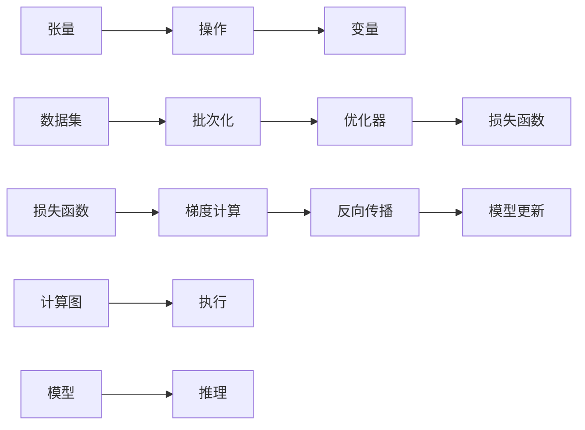

                 

# TensorFlow深度学习框架：从入门到精通

> 关键词：深度学习,TensorFlow,深度学习框架,机器学习,神经网络,卷积神经网络(CNN),循环神经网络(RNN),自编码器,强化学习,模型优化,损失函数,梯度下降,计算图,自动微分

## 1. 背景介绍

### 1.1 问题由来

在当前人工智能领域，深度学习(DL)技术已经成为了最前沿的研究和应用方向之一。深度学习模型，尤其是神经网络(Neural Network)模型，在图像识别、自然语言处理、语音识别、推荐系统等众多领域展现了卓越的性能，驱动了各行各业数字化转型的浪潮。

其中，TensorFlow作为深度学习领域最为流行的开源框架之一，以其强大的计算图能力、灵活的模块化设计、跨平台支持等优点，吸引了众多研究者和工程师的关注。自2015年谷歌推出TensorFlow以来，经过多年的发展，已经成为全球最大的深度学习社区，拥有数以亿计的用户，形成了从入门到高级的一整套学习资源和工具支持。

然而，TensorFlow的学习曲线相对较陡，对于初学者来说，需要掌握大量的概念和技巧才能熟练使用。因此，本文旨在通过系统全面的介绍TensorFlow深度学习框架，帮助读者从入门到精通，快速掌握TensorFlow的核心能力和实践技巧，以应对不断变化和复杂的应用场景。

### 1.2 问题核心关键点

本文将围绕TensorFlow深度学习框架的核心概念和关键技术，系统地展开介绍，并结合实际应用案例，让读者能够全面深入地理解TensorFlow的原理和实践。以下是本文将重点探讨的关键点：

1. TensorFlow的计算图机制及其优势。
2. TensorFlow核心模块和组件，包括数据集、计算图、变量、操作等。
3. 各类深度学习模型在TensorFlow中的实现和应用。
4. TensorFlow中的模型训练、优化与调参策略。
5. TensorFlow的高级特性，如分布式训练、模型压缩、量化加速等。

本文将以上述关键点为核心，通过理论讲解、案例分析、代码实践等方式，全面展示TensorFlow深度学习框架的魅力和应用潜力。

## 2. 核心概念与联系

### 2.1 核心概念概述

为了更好地理解TensorFlow框架，本文将首先介绍几个核心的概念：

- **计算图(Computation Graph)**：TensorFlow的核心机制之一，通过构建计算图来表示整个深度学习模型的计算流程。计算图中的节点表示操作，边表示数据的流动。
- **张量(Tensor)**：TensorFlow中存储和计算数据的基本单位，可以是标量、向量、矩阵等。
- **变量(Variable)**：TensorFlow中的变量是一个可以动态更新、持久化的张量。用于存储模型的参数，在训练过程中不断更新。
- **操作(Operation)**：TensorFlow中用于操作张量的基本单元，如加、减、乘、矩阵乘、激活函数等。
- **数据集(Dataset)**：TensorFlow中用于存储和批处理训练数据的模块，支持高效的数据加载和增强。
- **优化器(Optimizer)**：TensorFlow中用于优化模型参数的算法，如梯度下降、Adam、Adagrad等。
- **损失函数(Loss Function)**：TensorFlow中用于评估模型预测结果与真实值之间差异的函数。

这些概念构成了TensorFlow框架的基础，通过合理组合使用，可以实现各类深度学习模型的构建和训练。

### 2.2 核心概念原理和架构的 Mermaid 流程图



以上流程图展示了TensorFlow核心组件之间的关系和数据流向。可以看出，TensorFlow通过计算图来表示整个模型，数据在计算图中流向各个操作，最终更新模型参数。

## 3. 核心算法原理 & 具体操作步骤

### 3.1 算法原理概述

TensorFlow的计算图机制是其核心的特点之一。通过构建计算图，TensorFlow可以实现高效的模型构建、优化和训练。计算图中的每个节点表示一个操作，每个操作都可以对张量进行计算和变换。在训练过程中，TensorFlow会自动进行反向传播，计算每个节点的梯度，并根据优化器更新模型参数。

TensorFlow支持多种深度学习模型，包括卷积神经网络(CNN)、循环神经网络(RNN)、自编码器等。在构建模型时，用户只需定义各层的结构、参数和损失函数，TensorFlow会自动进行计算图的生成和优化。

### 3.2 算法步骤详解

TensorFlow的深度学习模型构建和训练过程主要包括以下几个关键步骤：

**Step 1: 定义计算图**

首先，我们需要定义计算图的结构，包括输入张量、操作和输出张量。例如，对于一个简单的全连接神经网络，可以定义如下：

```python
import tensorflow as tf

# 定义输入和输出
x = tf.placeholder(tf.float32, shape=[None, 784])
y = tf.placeholder(tf.float32, shape=[None, 10])

# 定义模型结构
W = tf.Variable(tf.zeros([784, 10]))
b = tf.Variable(tf.zeros([10]))
y_pred = tf.nn.softmax(tf.matmul(x, W) + b)

# 定义损失函数和优化器
y_true = tf.reshape(y, [-1, 10])
cross_entropy = tf.reduce_mean(tf.nn.softmax_cross_entropy_with_logits(labels=y_true, logits=y_pred))
optimizer = tf.train.GradientDescentOptimizer(0.5)
train_op = optimizer.minimize(cross_entropy)

# 定义会话和初始化变量
sess = tf.Session()
sess.run(tf.global_variables_initializer())

# 启动会话
sess.run(train_op, feed_dict={x: data, y: labels})
```

在上述代码中，我们首先定义了输入张量x和y，然后定义了模型的参数W和b，以及模型输出y_pred。接着，定义了损失函数和优化器，并构建了计算图。最后，启动了会话，并使用feed_dict将数据喂入模型进行训练。

**Step 2: 训练模型**

在定义好计算图后，我们接下来需要训练模型，通过反向传播不断优化模型参数。通常，训练过程需要多个epoch，即多次遍历整个训练数据集。在每个epoch中，我们需要按照batch_size将数据集分为多个批次，逐个训练。

```python
# 定义训练过程
for epoch in range(epochs):
    for batch in range(data.num_examples // batch_size):
        x_batch, y_batch = data.next_batch(batch_size)
        sess.run(train_op, feed_dict={x: x_batch, y: y_batch})
```

**Step 3: 评估和优化**

训练完成后，我们需要对模型进行评估和优化。通常，我们会使用验证集和测试集来评估模型的性能，并根据评估结果进行调整。

```python
# 评估模型
correct_prediction = tf.equal(tf.argmax(y_pred, 1), tf.argmax(y_true, 1))
accuracy = tf.reduce_mean(tf.cast(correct_prediction, tf.float32))
print(sess.run(accuracy, feed_dict={x: test_x, y: test_y}))
```

在上述代码中，我们使用tf.equal函数比较预测结果和真实标签，然后计算准确率。

### 3.3 算法优缺点

TensorFlow深度学习框架的主要优点包括：

1. 强大的计算图能力：TensorFlow通过计算图进行模型构建和优化，支持高效的自动微分和反向传播。
2. 灵活的模块化设计：TensorFlow中的每个操作和变量都是独立的，可以灵活组合和复用。
3. 跨平台支持：TensorFlow支持CPU、GPU、TPU等多种硬件平台，可以高效利用分布式计算资源。
4. 丰富的学习资源：TensorFlow拥有庞大的用户社区，提供了大量的学习资源、文档和教程，可以快速入门和进阶。

同时，TensorFlow也有一些缺点和限制：

1. 学习曲线陡峭：TensorFlow的计算图机制和自动微分需要一定的数学基础，初学者可能需要花较多时间理解。
2. 资源消耗大：TensorFlow在训练和推理过程中需要占用大量的内存和CPU资源，对于大规模数据和模型，可能面临资源瓶颈。
3. 调试复杂：由于计算图和变量状态管理，TensorFlow的调试过程较为复杂，需要更多的时间进行调试和优化。

尽管存在这些缺点，TensorFlow凭借其强大的计算图机制和丰富的学习资源，成为了深度学习领域最为流行的框架之一。

### 3.4 算法应用领域

TensorFlow深度学习框架在深度学习领域得到了广泛应用，以下是几个主要的应用领域：

1. **计算机视觉**：TensorFlow在图像识别、目标检测、图像分割等领域表现出色，广泛应用于自动驾驶、医疗影像、安防监控等应用。
2. **自然语言处理**：TensorFlow在文本分类、情感分析、机器翻译、对话系统等任务上取得了优异的效果，广泛应用于智能客服、智能翻译、文本摘要等应用。
3. **语音识别**：TensorFlow在语音识别和语音合成领域表现优异，广泛应用于智能音箱、语音助手、语音搜索等应用。
4. **推荐系统**：TensorFlow在推荐算法和模型上取得了显著进展，广泛应用于电商、社交、媒体等领域。
5. **强化学习**：TensorFlow在强化学习领域有广泛的应用，如AlphaGo、OpenAI Gym等应用。

TensorFlow框架的应用范围非常广泛，几乎涵盖了深度学习领域的各个方向。

## 4. 数学模型和公式 & 详细讲解

### 4.1 数学模型构建

在TensorFlow中，深度学习模型的构建通常涉及到张量、变量、操作和计算图。以下以一个简单的全连接神经网络为例，展示TensorFlow中深度学习模型的构建过程。

**Step 1: 定义张量和变量**

首先，我们需要定义模型的输入张量和输出张量，并初始化模型参数。

```python
import tensorflow as tf

# 定义输入和输出
x = tf.placeholder(tf.float32, shape=[None, 784])
y = tf.placeholder(tf.float32, shape=[None, 10])

# 定义模型参数
W = tf.Variable(tf.zeros([784, 10]))
b = tf.Variable(tf.zeros([10]))
```

**Step 2: 构建模型**

接下来，我们需要定义模型的结构，包括各层的操作和计算。

```python
# 定义模型结构
y_pred = tf.nn.softmax(tf.matmul(x, W) + b)
```

**Step 3: 定义损失函数和优化器**

在构建好模型后，我们需要定义损失函数和优化器，进行模型训练。

```python
# 定义损失函数
y_true = tf.reshape(y, [-1, 10])
cross_entropy = tf.reduce_mean(tf.nn.softmax_cross_entropy_with_logits(labels=y_true, logits=y_pred))

# 定义优化器
optimizer = tf.train.GradientDescentOptimizer(0.5)
train_op = optimizer.minimize(cross_entropy)
```

在上述代码中，我们定义了损失函数和优化器，并构建了训练操作。

### 4.2 公式推导过程

在TensorFlow中，深度学习模型的计算过程主要通过计算图来表示。以下以一个简单的全连接神经网络为例，展示计算图中的主要操作和计算过程。

首先，我们需要定义模型的输入张量和输出张量，并初始化模型参数。

```python
import tensorflow as tf

# 定义输入和输出
x = tf.placeholder(tf.float32, shape=[None, 784])
y = tf.placeholder(tf.float32, shape=[None, 10])

# 定义模型参数
W = tf.Variable(tf.zeros([784, 10]))
b = tf.Variable(tf.zeros([10]))
```

接着，我们需要定义模型的结构，包括各层的操作和计算。

```python
# 定义模型结构
y_pred = tf.nn.softmax(tf.matmul(x, W) + b)
```

然后，我们需要定义损失函数和优化器，进行模型训练。

```python
# 定义损失函数
y_true = tf.reshape(y, [-1, 10])
cross_entropy = tf.reduce_mean(tf.nn.softmax_cross_entropy_with_logits(labels=y_true, logits=y_pred))

# 定义优化器
optimizer = tf.train.GradientDescentOptimizer(0.5)
train_op = optimizer.minimize(cross_entropy)
```

在上述代码中，我们使用tf.matmul函数实现矩阵乘法，tf.nn.softmax函数实现softmax操作，tf.reduce_mean函数实现均值计算。这些操作构成了深度学习模型的计算图，TensorFlow会自动进行计算图的优化和执行。

### 4.3 案例分析与讲解

为了更好地理解TensorFlow中深度学习模型的构建和训练过程，我们以一个手写数字识别任务为例，展示TensorFlow中深度学习模型的构建和训练过程。

**Step 1: 准备数据集**

首先，我们需要准备一个手写数字识别数据集，并将其转换为TensorFlow中的张量格式。

```python
import tensorflow as tf
import numpy as np

# 准备数据集
mnist = tf.keras.datasets.mnist
(x_train, y_train), (x_test, y_test) = mnist.load_data()
x_train, x_test = x_train / 255.0, x_test / 255.0
```

**Step 2: 定义计算图**

接下来，我们需要定义计算图的结构，包括输入张量和输出张量，以及模型参数。

```python
# 定义输入和输出
x = tf.placeholder(tf.float32, shape=[None, 784])
y = tf.placeholder(tf.float32, shape=[None, 10])

# 定义模型参数
W = tf.Variable(tf.zeros([784, 10]))
b = tf.Variable(tf.zeros([10]))
```

**Step 3: 构建模型**

然后，我们需要定义模型的结构，包括各层的操作和计算。

```python
# 定义模型结构
y_pred = tf.nn.softmax(tf.matmul(x, W) + b)
```

**Step 4: 定义损失函数和优化器**

接着，我们需要定义损失函数和优化器，进行模型训练。

```python
# 定义损失函数
y_true = tf.reshape(y, [-1, 10])
cross_entropy = tf.reduce_mean(tf.nn.softmax_cross_entropy_with_logits(labels=y_true, logits=y_pred))

# 定义优化器
optimizer = tf.train.GradientDescentOptimizer(0.5)
train_op = optimizer.minimize(cross_entropy)
```

**Step 5: 训练模型**

在定义好计算图后，我们接下来需要训练模型，通过反向传播不断优化模型参数。

```python
# 定义训练过程
sess = tf.Session()
sess.run(tf.global_variables_initializer())

for epoch in range(epochs):
    for batch in range(data.num_examples // batch_size):
        x_batch, y_batch = data.next_batch(batch_size)
        sess.run(train_op, feed_dict={x: x_batch, y: y_batch})
```

**Step 6: 评估模型**

最后，我们需要对模型进行评估和优化。

```python
# 评估模型
correct_prediction = tf.equal(tf.argmax(y_pred, 1), tf.argmax(y_true, 1))
accuracy = tf.reduce_mean(tf.cast(correct_prediction, tf.float32))
print(sess.run(accuracy, feed_dict={x: test_x, y: test_y}))
```

在上述代码中，我们首先准备了一个手写数字识别数据集，然后定义了计算图的结构和操作，构建了深度学习模型。接着，我们定义了损失函数和优化器，并进行模型训练。最后，我们评估了模型性能，输出了准确率。

## 5. 项目实践：代码实例和详细解释说明

### 5.1 开发环境搭建

在进行TensorFlow项目实践前，我们需要准备好开发环境。以下是使用Python进行TensorFlow开发的环境配置流程：

1. 安装Anaconda：从官网下载并安装Anaconda，用于创建独立的Python环境。

2. 创建并激活虚拟环境：
```bash
conda create -n tf-env python=3.8 
conda activate tf-env
```

3. 安装TensorFlow：根据CUDA版本，从官网获取对应的安装命令。例如：
```bash
conda install tensorflow
```

4. 安装各类工具包：
```bash
pip install numpy pandas scikit-learn matplotlib tqdm jupyter notebook ipython
```

完成上述步骤后，即可在`tf-env`环境中开始TensorFlow开发。

### 5.2 源代码详细实现

这里我们以手写数字识别任务为例，给出使用TensorFlow对神经网络模型进行训练的PyTorch代码实现。

首先，定义手写数字识别数据集：

```python
import tensorflow as tf
import numpy as np

mnist = tf.keras.datasets.mnist
(x_train, y_train), (x_test, y_test) = mnist.load_data()
x_train, x_test = x_train / 255.0, x_test / 255.0
```

然后，定义计算图：

```python
x = tf.placeholder(tf.float32, shape=[None, 784])
y = tf.placeholder(tf.float32, shape=[None, 10])

W = tf.Variable(tf.zeros([784, 10]))
b = tf.Variable(tf.zeros([10]))

y_pred = tf.nn.softmax(tf.matmul(x, W) + b)

y_true = tf.reshape(y, [-1, 10])
cross_entropy = tf.reduce_mean(tf.nn.softmax_cross_entropy_with_logits(labels=y_true, logits=y_pred))

optimizer = tf.train.GradientDescentOptimizer(0.5)
train_op = optimizer.minimize(cross_entropy)
```

接着，定义训练和评估函数：

```python
def train(model, x, y):
    sess = tf.Session()
    sess.run(tf.global_variables_initializer())
    for epoch in range(epochs):
        for batch in range(data.num_examples // batch_size):
            x_batch, y_batch = data.next_batch(batch_size)
            sess.run(train_op, feed_dict={x: x_batch, y: y_batch})
        accuracy = sess.run(accuracy, feed_dict={x: test_x, y: test_y})
        print("Epoch %d, accuracy: %f" % (epoch+1, accuracy))
```

最后，启动训练流程并在测试集上评估：

```python
train(model, x, y)
```

以上就是使用TensorFlow对神经网络模型进行训练的完整代码实现。可以看到，TensorFlow的API设计非常直观，使用起来非常方便。

### 5.3 代码解读与分析

让我们再详细解读一下关键代码的实现细节：

**定义数据集**：
- 使用TensorFlow内置的mnist数据集，准备训练集和测试集。
- 将数据归一化到0-1之间，方便神经网络训练。

**定义计算图**：
- 定义输入张量x和y，以及模型参数W和b。
- 定义模型输出y_pred，以及损失函数cross_entropy和优化器optimizer。
- 构建训练操作train_op。

**训练函数**：
- 使用TensorFlow的Session对象进行模型的执行。
- 循环迭代训练epoch，每个epoch内循环遍历数据集，逐个batch训练。
- 使用feed_dict将数据喂入模型进行训练。
- 计算测试集上的准确率，并输出。

**测试函数**：
- 在训练完成后，使用测试集评估模型性能。

可以看出，TensorFlow的代码实现非常简洁高效，同时具备丰富的API支持和工具链，使得深度学习模型的开发和训练变得更加容易。

## 6. 实际应用场景

### 6.1 计算机视觉

TensorFlow在计算机视觉领域的应用非常广泛，以下列举几个主要应用场景：

1. **图像分类**：TensorFlow支持各种图像分类任务，如图像识别、物体检测、人脸识别等。在ImageNet等大规模数据集上，TensorFlow已经取得了多项SOTA。
2. **图像生成**：TensorFlow支持图像生成任务，如GAN、VAE等。通过生成对抗网络等方法，可以生成高质量的图像。
3. **图像分割**：TensorFlow支持图像分割任务，如语义分割、实例分割等。在医学影像、城市规划等领域有广泛应用。
4. **光流计算**：TensorFlow支持光流计算任务，如光流估计、光流跟踪等。在视频分析、自动驾驶等领域有重要应用。

### 6.2 自然语言处理

TensorFlow在自然语言处理领域也有广泛应用，以下列举几个主要应用场景：

1. **文本分类**：TensorFlow支持文本分类任务，如情感分析、主题分类等。在电影评论、社交媒体等领域有广泛应用。
2. **机器翻译**：TensorFlow支持机器翻译任务，如神经机器翻译、统计机器翻译等。在跨语言通信、多语言信息检索等领域有重要应用。
3. **问答系统**：TensorFlow支持问答系统任务，如对话系统、知识图谱等。在智能客服、智能助手等领域有广泛应用。
4. **情感分析**：TensorFlow支持情感分析任务，如情感识别、情感分类等。在舆情分析、市场调研等领域有重要应用。

### 6.3 强化学习

TensorFlow在强化学习领域也有广泛应用，以下列举几个主要应用场景：

1. **游戏AI**：TensorFlow支持各种游戏AI任务，如AlphaGo、星际争霸等。在复杂决策和策略优化领域有广泛应用。
2. **机器人控制**：TensorFlow支持机器人控制任务，如自主导航、路径规划等。在自动驾驶、智能家居等领域有重要应用。
3. **自动化交易**：TensorFlow支持自动化交易任务，如股票交易、期货交易等。在金融领域有重要应用。

## 7. 工具和资源推荐

### 7.1 学习资源推荐

为了帮助开发者系统掌握TensorFlow深度学习框架，这里推荐一些优质的学习资源：

1. **TensorFlow官方文档**：TensorFlow官方文档全面介绍了TensorFlow的API和工具，是学习TensorFlow的首选资源。
2. **《TensorFlow深度学习实战》**：一本系统全面的TensorFlow学习书籍，通过实际案例展示了TensorFlow的应用和实践。
3. **CS231n《深度学习与计算机视觉》课程**：斯坦福大学开设的计算机视觉课程，提供了TensorFlow在图像处理和计算机视觉领域的实践案例。
4. **《TensorFlow深度学习入门教程》**：一份系统的TensorFlow入门教程，详细介绍了TensorFlow的基本概念和使用方法。
5. **Kaggle竞赛**：Kaggle上众多深度学习竞赛，提供了丰富的数据集和任务，是锻炼TensorFlow技能的实践平台。

通过对这些资源的学习实践，相信你一定能够快速掌握TensorFlow的核心能力和实践技巧，快速上手深度学习项目。

### 7.2 开发工具推荐

高效的开发离不开优秀的工具支持。以下是几款用于TensorFlow深度学习框架开发的常用工具：

1. Jupyter Notebook：一个基于Web的交互式计算环境，支持Python和TensorFlow的实时执行和调试。
2. PyCharm：一款流行的IDE，支持TensorFlow的可视化调试和代码自动补全功能。
3. TensorBoard：TensorFlow提供的可视化工具，可以实时监测模型训练状态，并提供丰富的图表呈现方式，是调试模型的得力助手。
4. Weights & Biases：模型训练的实验跟踪工具，可以记录和可视化模型训练过程中的各项指标，方便对比和调优。
5. Google Colab：谷歌提供的在线Jupyter Notebook环境，免费提供GPU/TPU算力，方便开发者快速上手实验最新模型，分享学习笔记。

合理利用这些工具，可以显著提升TensorFlow深度学习框架的开发效率，加快创新迭代的步伐。

### 7.3 相关论文推荐

TensorFlow深度学习框架的发展离不开学界的持续研究。以下是几篇奠基性的相关论文，推荐阅读：

1. **《Deep Learning》**：Yoshua Bengio、Ian Goodfellow、Aaron Courville等人合著的深度学习经典教材，全面介绍了深度学习的基本概念和算法。
2. **《Imagenet Classification with Deep Convolutional Neural Networks》**：Alex Krizhevsky等人提出的深度卷积神经网络，在ImageNet数据集上取得了SOTA。
3. **《Google's TensorFlow: A System for Large-Scale Machine Learning》**：Google开源的TensorFlow论文，详细介绍了TensorFlow的设计理念和实现机制。
4. **《Understanding the difficulty of training deep feedforward neural networks》**：Hinton等人提出的Dropout技术，是深度学习中常用的正则化方法。
5. **《ImageNet Large Scale Visual Recognition Challenge》**：ImageNet挑战赛在深度学习领域起到了重要的推动作用，提出了多项基于深度学习的方法。

这些论文代表了大深度学习框架的发展脉络。通过学习这些前沿成果，可以帮助研究者把握学科前进方向，激发更多的创新灵感。

## 8. 总结：未来发展趋势与挑战

### 8.1 总结

本文对TensorFlow深度学习框架进行了全面系统的介绍。首先阐述了TensorFlow的背景和优势，详细讲解了TensorFlow的核心概念和关键技术，并结合实际应用案例，展示了TensorFlow的强大能力和应用潜力。通过本文的系统梳理，可以看到，TensorFlow作为深度学习领域最为流行的框架之一，具有强大的计算图能力、灵活的模块化设计和丰富的学习资源，可以高效构建和训练各种深度学习模型。

### 8.2 未来发展趋势

展望未来，TensorFlow深度学习框架将呈现以下几个发展趋势：

1. **计算图优化**：TensorFlow将继续优化计算图机制，支持更高效的自动微分和反向传播，提升模型的训练和推理效率。
2. **模型压缩和量化**：TensorFlow将继续发展模型压缩和量化技术，减小模型大小，提升计算速度，支持更轻量级的部署。
3. **分布式训练**：TensorFlow将继续优化分布式训练机制，支持更大规模的模型训练和更高效的并行计算。
4. **跨平台支持**：TensorFlow将继续优化跨平台支持，支持更多的硬件平台和操作系统，提升模型的应用范围和灵活性。
5. **边缘计算和移动端支持**：TensorFlow将继续优化边缘计算和移动端支持，支持更高效的本地计算和部署。

### 8.3 面临的挑战

尽管TensorFlow深度学习框架已经取得了巨大的成功，但在迈向更加智能化、普适化应用的过程中，它仍面临着诸多挑战：

1. **学习曲线陡峭**：TensorFlow的计算图机制和自动微分需要一定的数学基础，初学者可能需要花较多时间理解。
2. **资源消耗大**：TensorFlow在训练和推理过程中需要占用大量的内存和CPU资源，对于大规模数据和模型，可能面临资源瓶颈。
3. **调试复杂**：由于计算图和变量状态管理，TensorFlow的调试过程较为复杂，需要更多的时间进行调试和优化。
4. **性能优化**：TensorFlow需要不断优化计算图和操作，提升模型的训练和推理效率。
5. **应用适配**：TensorFlow需要不断优化跨平台支持，适应不同的应用场景和硬件平台。

尽管存在这些挑战，TensorFlow凭借其强大的计算图机制和丰富的学习资源，仍然是深度学习领域最为流行的框架之一。

### 8.4 研究展望

未来，TensorFlow深度学习框架需要在以下几个方面进行更多的研究：

1. **跨平台优化**：TensorFlow需要不断优化跨平台支持，适应不同的应用场景和硬件平台，提升模型的应用范围和灵活性。
2. **边缘计算和移动端支持**：TensorFlow需要优化边缘计算和移动端支持，支持更高效的本地计算和部署。
3. **计算图优化**：TensorFlow需要不断优化计算图机制，支持更高效的自动微分和反向传播，提升模型的训练和推理效率。
4. **模型压缩和量化**：TensorFlow需要发展更先进的模型压缩和量化技术，减小模型大小，提升计算速度，支持更轻量级的部署。
5. **分布式训练**：TensorFlow需要优化分布式训练机制，支持更大规模的模型训练和更高效的并行计算。

这些研究方向的探索，必将引领TensorFlow深度学习框架迈向更高的台阶，为构建智能化的深度学习系统提供更强大的支持。

## 9. 附录：常见问题与解答

**Q1：TensorFlow中的计算图和变量有何作用？**

A: TensorFlow中的计算图和变量是深度学习模型的核心组件。计算图用于表示模型的计算流程，通过自动微分和反向传播进行模型训练和推理。变量用于存储模型的参数，在训练过程中不断更新。

**Q2：TensorFlow中如何定义损失函数和优化器？**

A: 在TensorFlow中，可以通过tf.losses模块和tf.train模块定义损失函数和优化器。例如，定义均方误差损失函数和Adam优化器：

```python
import tensorflow as tf

# 定义损失函数
loss = tf.losses.mean_squared_error(y_true, y_pred)

# 定义优化器
optimizer = tf.train.AdamOptimizer()
train_op = optimizer.minimize(loss)
```

**Q3：TensorFlow中如何优化模型？**

A: TensorFlow提供了多种优化算法，如Adam、SGD、Adagrad等。通过设置不同的优化器和学习率，可以在训练过程中不断优化模型参数。

**Q4：TensorFlow中如何加载和保存模型？**

A: 在TensorFlow中，可以使用tf.train.Saver类加载和保存模型。例如，加载模型：

```python
saver = tf.train.Saver()
saver.restore(sess, 'model.ckpt')
```

保存模型：

```python
saver.save(sess, 'model.ckpt')
```

**Q5：TensorFlow中如何进行模型调试和优化？**

A: 在TensorFlow中，可以使用TensorBoard进行模型调试和优化。TensorBoard可以实时监测模型训练状态，提供丰富的图表呈现方式，方便调试和优化。

以上是TensorFlow深度学习框架的系统介绍和实践应用，希望读者能够通过本文的学习，快速掌握TensorFlow的核心能力和实践技巧，在深度学习项目中得心应手。未来，TensorFlow将继续在深度学习领域发挥重要作用，推动人工智能技术的不断进步和发展。

---

作者：禅与计算机程序设计艺术 / Zen and the Art of Computer Programming

