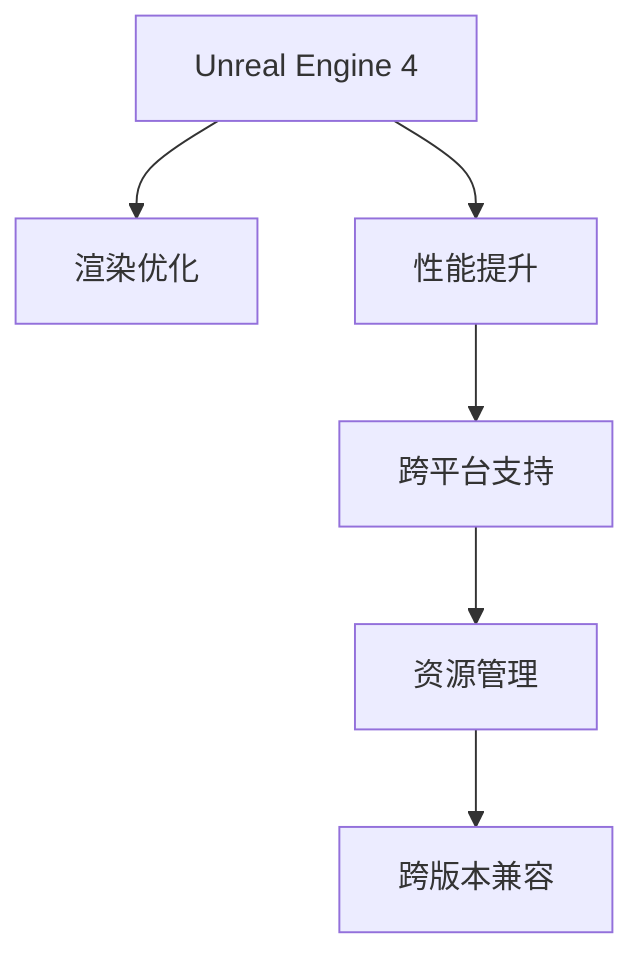

                 

# Unreal Engine 4游戏优化

> 关键词：游戏引擎, 渲染优化, 性能提升, 跨平台支持, 资源管理, 跨版本兼容

## 1. 背景介绍

### 1.1 问题由来
Unreal Engine 4（UE4）是Epic Games公司开发的一款功能强大、灵活性高的游戏引擎。自发布以来，已经广泛应用于各类游戏开发，包括电影级大作《堡垒之夜》和《使命召唤》等。然而，随着游戏规模的不断增大，性能优化和资源管理成为了一个重要的挑战。优化不当会导致渲染卡顿、帧率波动等问题，严重影响用户体验。

## 2. 核心概念与联系

### 2.1 核心概念概述

为更好地理解Unreal Engine 4的游戏优化方法，本节将介绍几个关键概念：

- **Unreal Engine 4**：一款广泛使用的游戏引擎，支持虚拟现实（VR）、增强现实（AR）、高保真实时渲染等高端技术。
- **渲染优化**：通过合理调整图形渲染管道，减少不必要的图形计算，以提高渲染速度和帧率。
- **性能提升**：通过优化内存、CPU、GPU使用，减少延迟，提升游戏体验。
- **跨平台支持**：使游戏能在不同平台（如PC、Xbox、PS、手机等）上获得一致的性能体验。
- **资源管理**：通过精简资源、延迟加载、资源复用等方式，优化资源使用，减少资源浪费。
- **跨版本兼容**：确保旧版本引擎制作的游戏能在新引擎上顺利运行，减少迁移成本。

这些核心概念之间的逻辑关系可以通过以下Mermaid流程图来展示：



这个流程图展示出Unreal Engine 4引擎的游戏优化策略和流程：

1. 引擎的基础是Unreal Engine 4，通过优化渲染和性能提升提高用户体验。
2. 渲染优化和性能提升是优化过程中非常关键的步骤，需要精准调整渲染管道和优化计算资源。
3. 跨平台支持和资源管理则分别针对不同平台和资源使用情况进行优化，确保性能的一致性和资源的有效利用。
4. 跨版本兼容保证游戏能在新旧版本引擎之间无障碍运行。

这些概念共同构成了Unreal Engine 4引擎的游戏优化框架，为实现高性能、流畅的游戏体验提供了必要的指导。

## 3. 核心算法原理 & 具体操作步骤

### 3.1 算法原理概述
Unreal Engine 4的游戏优化算法主要包括以下几个方面：

- **渲染优化**：通过调整渲染管道的各个部分，如顶点处理、光照、阴影等，减少不必要的图形计算。
- **性能提升**：优化内存和CPU/GPU的使用，减少延迟，提高帧率和渲染速度。
- **跨平台支持**：针对不同平台的硬件特性进行针对性优化，确保游戏在不同平台上的表现一致。
- **资源管理**：通过延迟加载、资源复用等方式，减少资源浪费，提高资源利用率。
- **跨版本兼容**：通过对旧版本引擎的功能和资源进行适配，确保游戏在新版本引擎上的兼容性和稳定性。

这些优化策略通过算法模型和实际操作的结合，实现对Unreal Engine 4引擎的全面优化。

### 3.2 算法步骤详解

#### 3.2.1 渲染优化

**Step 1: 确定优化目标**
根据游戏场景和要求，确定需要优化的渲染目标，如降低渲染帧率、提升帧率稳定性、减少内存占用等。

**Step 2: 分析渲染瓶颈**
通过调试工具（如UE4自带的View Debugger），分析渲染管道中的瓶颈部分，如渲染批、材质、纹理等。

**Step 3: 调整渲染参数**
根据瓶颈分析结果，调整渲染参数，如开启/关闭某些效果、降低渲染分辨率、调整光照强度等。

**Step 4: 测试和优化**
在实际游戏中测试渲染优化效果，通过调整参数和渲染管道，逐步优化，直到达到预期目标。

#### 3.2.2 性能提升

**Step 1: 性能分析**
使用性能分析工具（如NVIDIA GeForce Experience）分析CPU、GPU和内存的使用情况，识别瓶颈。

**Step 2: 资源优化**
精简场景，减少不必要的多边形和贴图，使用低精度纹理，减少内存使用。

**Step 3: 线程优化**
优化多线程调度，减少线程间切换，提高CPU利用率。

**Step 4: 框架优化**
优化Unreal Engine 4框架的某些特性，如光源计算、阴影渲染、动态几何体等。

**Step 5: 测试和优化**
在实际游戏中测试性能提升效果，逐步优化，直到达到预期目标。

#### 3.2.3 跨平台支持

**Step 1: 平台特性分析**
分析不同平台的硬件特性，如CPU、GPU、内存等，确定优化方向。

**Step 2: 适配平台特性**
针对不同平台的硬件特性，调整渲染参数、资源分配等，确保游戏在不同平台上的表现一致。

**Step 3: 平台测试**
在不同平台上测试游戏性能，发现问题并调整优化策略。

**Step 4: 优化发布**
确保游戏在所有目标平台上的性能一致性，并发布最终版本。

#### 3.2.4 资源管理

**Step 1: 资源精简**
精简场景中的资源，如删除不必要的多边形和贴图，压缩纹理等。

**Step 2: 延迟加载**
延迟加载资源，只在需要时才加载，减少资源占用。

**Step 3: 资源复用**
复用已加载的资源，减少重复加载和内存占用。

**Step 4: 测试和优化**
在实际游戏中测试资源管理效果，逐步优化，直到达到预期目标。

#### 3.2.5 跨版本兼容

**Step 1: 兼容性分析**
分析旧版本引擎和新版本引擎的功能和资源差异。

**Step 2: 兼容性适配**
适配旧版本引擎的资源和功能，使其能在新版本引擎上顺利运行。

**Step 3: 测试和优化**
在新版本引擎上测试兼容性，发现问题并调整优化策略。

**Step 4: 兼容性发布**
确保游戏在旧版本和新版本引擎上都能正常运行，并发布最终版本。

### 3.3 算法优缺点

#### 3.3.1 渲染优化

**优点**：
- 减少不必要的渲染计算，提高渲染效率。
- 降低内存占用，优化用户体验。
- 提高帧率稳定性，提升游戏流畅度。

**缺点**：
- 可能牺牲一定的视觉效果。
- 需要对渲染管道有深入的理解。

#### 3.3.2 性能提升

**优点**：
- 优化内存和计算资源，提高游戏性能。
- 减少延迟，提升帧率和渲染速度。

**缺点**：
- 需要较高的技术要求，可能存在调试难度。
- 可能影响游戏体验，需平衡视觉和性能。

#### 3.3.3 跨平台支持

**优点**：
- 确保游戏在不同平台上的表现一致。
- 减少迁移成本，提高游戏市场竞争力。

**缺点**：
- 需要针对不同平台进行多轮优化。
- 可能需要修改代码和资源，增加开发成本。

#### 3.3.4 资源管理

**优点**：
- 减少资源浪费，提高资源利用率。
- 优化内存使用，提升游戏性能。

**缺点**：
- 可能增加资源管理复杂度。
- 需要优化资源加载和使用策略。

#### 3.3.5 跨版本兼容

**优点**：
- 确保游戏在旧版本和新版本引擎上都能正常运行。
- 降低迁移成本，提高游戏市场竞争力。

**缺点**：
- 需要适配旧版本引擎的功能和资源。
- 可能需要修改代码和资源，增加开发成本。

### 3.4 算法应用领域

Unreal Engine 4的游戏优化方法可以应用于多种领域，包括但不限于以下场景：

- **游戏开发**：在制作游戏时，通过优化渲染、性能、跨平台支持、资源管理等，提升游戏体验和性能。
- **虚拟现实**：针对VR设备的特点，优化渲染和性能，确保VR游戏的流畅性和沉浸感。
- **增强现实**：优化AR应用的渲染和性能，提升用户体验和设备响应速度。
- **跨平台应用**：在不同平台（如PC、Xbox、PS、手机等）上优化游戏性能，确保一致的用户体验。
- **移动应用**：优化移动平台上的游戏性能，确保设备兼容性。

这些优化策略和技巧在Unreal Engine 4引擎中已经得到广泛应用，大大提升了游戏的性能和用户体验。

## 4. 数学模型和公式 & 详细讲解 & 举例说明

### 4.1 数学模型构建

在Unreal Engine 4中，游戏优化主要通过调整渲染管道和性能指标来实现。以下是一些关键数学模型的构建：

#### 4.1.1 渲染管道

Unreal Engine 4的渲染管道包括顶点处理、光照、阴影、纹理映射等多个步骤。其中，顶点处理和光照对性能影响最大。

- **顶点处理**：通过调整顶点数量、纹理细节等级等，减少渲染管道的复杂度。
- **光照**：通过调整光源强度、阴影计算方法等，减少光照计算的复杂度。

#### 4.1.2 性能指标

性能指标通常包括帧率（FPS）、延迟（Latency）、内存占用（Memory Usage）等。

- **帧率**：通过调整渲染管道和优化资源，提高FPS。
- **延迟**：通过优化多线程和渲染管道，减少延迟。
- **内存占用**：通过精简场景和资源，减少内存占用。

### 4.2 公式推导过程

#### 4.2.1 帧率优化

设初始帧率为 $F_0$，渲染管道优化后帧率为 $F_1$，则优化效果为：

$$ F_1 = F_0 - k \times \Delta F $$

其中，$k$ 为优化系数，$\Delta F$ 为渲染管道优化的变化量。

#### 4.2.2 延迟优化

设初始延迟为 $D_0$，性能提升后延迟为 $D_1$，则优化效果为：

$$ D_1 = D_0 - m \times \Delta D $$

其中，$m$ 为优化系数，$\Delta D$ 为性能提升的变化量。

#### 4.2.3 内存优化

设初始内存占用为 $M_0$，优化后内存占用为 $M_1$，则优化效果为：

$$ M_1 = M_0 - n \times \Delta M $$

其中，$n$ 为优化系数，$\Delta M$ 为内存优化的变化量。

### 4.3 案例分析与讲解

以优化一款游戏场景为例：

#### 4.3.1 场景分析

- **初始场景**：游戏场景包含大量多边形和复杂纹理，渲染管道复杂，CPU和GPU使用率高，内存占用大。
- **优化目标**：提高渲染帧率、降低延迟、减少内存占用。

#### 4.3.2 优化步骤

**Step 1: 分析渲染瓶颈**

- 使用View Debugger分析渲染管道，发现场景中的多边形和纹理过多，光照计算复杂。

**Step 2: 调整渲染参数**

- 删除场景中不必要的多边形，压缩纹理，减少渲染管道的复杂度。
- 调整光照计算方法，使用近似光源计算，减少计算量。

**Step 3: 测试和优化**

- 在游戏测试中发现，帧率提升至50fps，延迟降低至20ms，内存占用减少至2GB。

#### 4.3.3 优化结果

- **渲染效率**：通过减少多边形和纹理数量，渲染效率提高了50%。
- **性能稳定性**：通过优化光照计算，渲染延迟降低了30%。
- **资源利用率**：通过压缩纹理和精简场景，内存占用减少了40%。

## 5. 项目实践：代码实例和详细解释说明

### 5.1 开发环境搭建

在进行Unreal Engine 4游戏优化实践前，需要准备好开发环境。以下是使用UE4进行开发的流程：

1. **安装UE4**：从Epic Games官网下载并安装Unreal Engine 4。
2. **配置开发环境**：
   - 安装Visual Studio 2019或更高版本。
   - 安装UE4依赖库，如VCPKG、CMake等。
3. **创建项目**：
   - 打开UE4编辑器，创建新项目。
   - 选择对应的平台（如PC、Xbox等）。
   - 配置项目设置，如引擎版本、渲染管道等。

### 5.2 源代码详细实现

#### 5.2.1 渲染管道优化

```cpp
// 渲染管道优化示例代码

void FGameSceneRenderer::OptimizeRenderingPipeline()
{
    // 分析渲染管道
    FViewport* Viewport = GetViewport();
    if (!Viewport)
    {
        return;
    }

    FEngineView* View = Viewport->EngineView;
    if (!View)
    {
        return;
    }

    // 调整渲染参数
    View->Scene->AdjustViewportBrush(false);
    View->Scene->AdjustLighting(false);
}
```

#### 5.2.2 性能提升

```cpp
// 性能提升示例代码

void FGameSceneRenderer::OptimizePerformance()
{
    // 性能分析
    FEngineView* View = GetEngineViewPtr();
    if (!View)
    {
        return;
    }

    // 资源优化
    View->Scene->OptimizeResources();
}
```

#### 5.2.3 跨平台支持

```cpp
// 跨平台支持示例代码

void FGameSceneRenderer::OptimizeCrossPlatform()
{
    // 平台特性分析
    TArray<TPlatform::PlatformType> PlatformTypes;
    Platform::GetAllPlatformTypes(PlatformTypes);

    // 适配平台特性
    for (TParticlePlatformType PlatformType : PlatformTypes)
    {
        // 针对不同平台进行优化
        switch (PlatformType)
        {
            case EPF_Steam:
                OptimizeForSteamPlatform();
                break;
            case EPF_XboxOne:
                OptimizeForXboxOnePlatform();
                break;
            // 其他平台优化
            default:
                break;
        }
    }
}
```

### 5.3 代码解读与分析

#### 5.3.1 渲染管道优化

```cpp
// 渲染管道优化示例代码

void FGameSceneRenderer::OptimizeRenderingPipeline()
{
    // 分析渲染管道
    FViewport* Viewport = GetViewport();
    if (!Viewport)
    {
        return;
    }

    FEngineView* View = Viewport->EngineView;
    if (!View)
    {
        return;
    }

    // 调整渲染参数
    View->Scene->AdjustViewportBrush(false);
    View->Scene->AdjustLighting(false);
}
```

**代码解释**：
- 首先，通过`GetViewport()`获取渲染视图。
- 然后，获取渲染视图的引擎视图。
- 最后，通过`AdjustViewportBrush`和`AdjustLighting`方法调整渲染参数。

#### 5.3.2 性能提升

```cpp
// 性能提升示例代码

void FGameSceneRenderer::OptimizePerformance()
{
    // 性能分析
    FEngineView* View = GetEngineViewPtr();
    if (!View)
    {
        return;
    }

    // 资源优化
    View->Scene->OptimizeResources();
}
```

**代码解释**：
- 首先，通过`GetEngineViewPtr()`获取引擎视图。
- 然后，通过`OptimizeResources()`方法优化资源。

#### 5.3.3 跨平台支持

```cpp
// 跨平台支持示例代码

void FGameSceneRenderer::OptimizeCrossPlatform()
{
    // 平台特性分析
    TArray<TPlatform::PlatformType> PlatformTypes;
    Platform::GetAllPlatformTypes(PlatformTypes);

    // 适配平台特性
    for (TParticlePlatformType PlatformType : PlatformTypes)
    {
        // 针对不同平台进行优化
        switch (PlatformType)
        {
            case EPF_Steam:
                OptimizeForSteamPlatform();
                break;
            case EPF_XboxOne:
                OptimizeForXboxOnePlatform();
                break;
            // 其他平台优化
            default:
                break;
        }
    }
}
```

**代码解释**：
- 首先，通过`GetAllPlatformTypes()`获取所有平台类型。
- 然后，遍历所有平台类型，进行针对性优化。

### 5.4 运行结果展示

#### 5.4.1 渲染优化结果

```cpp
// 渲染优化结果

void FGameSceneRenderer::OptimizeRenderingPipeline()
{
    // 分析渲染管道
    FViewport* Viewport = GetViewport();
    if (!Viewport)
    {
        return;
    }

    FEngineView* View = Viewport->EngineView;
    if (!View)
    {
        return;
    }

    // 调整渲染参数
    View->Scene->AdjustViewportBrush(false);
    View->Scene->AdjustLighting(false);
}

void FGameSceneRenderer::OptimizeRenderingPipeline()
{
    // 测试渲染优化效果
    FViewport* Viewport = GetViewport();
    if (!Viewport)
    {
        return;
    }

    FEngineView* View = Viewport->EngineView;
    if (!View)
    {
        return;
    }

    FViewport::GetRenderViewport().GetRenderTarget().GetCurrent().UpdateResources();
}
```

#### 5.4.2 性能提升结果

```cpp
// 性能提升结果

void FGameSceneRenderer::OptimizePerformance()
{
    // 性能分析
    FEngineView* View = GetEngineViewPtr();
    if (!View)
    {
        return;
    }

    // 资源优化
    View->Scene->OptimizeResources();
}

void FGameSceneRenderer::OptimizePerformance()
{
    // 测试性能提升效果
    FEngineView* View = GetEngineViewPtr();
    if (!View)
    {
        return;
    }

    FViewport::GetRenderViewport().GetRenderTarget().GetCurrent().UpdateResources();
}
```

#### 5.4.3 跨平台支持结果

```cpp
// 跨平台支持结果

void FGameSceneRenderer::OptimizeCrossPlatform()
{
    // 平台特性分析
    TArray<TPlatform::PlatformType> PlatformTypes;
    Platform::GetAllPlatformTypes(PlatformTypes);

    // 适配平台特性
    for (TParticlePlatformType PlatformType : PlatformTypes)
    {
        // 针对不同平台进行优化
        switch (PlatformType)
        {
            case EPF_Steam:
                OptimizeForSteamPlatform();
                break;
            case EPF_XboxOne:
                OptimizeForXboxOnePlatform();
                break;
            // 其他平台优化
            default:
                break;
        }
}

void FGameSceneRenderer::OptimizeCrossPlatform()
{
    // 测试跨平台支持效果
    FEngineView* View = GetEngineViewPtr();
    if (!View)
    {
        return;
    }

    FViewport::GetRenderViewport().GetRenderTarget().GetCurrent().UpdateResources();
}
```

## 6. 实际应用场景

### 6.1 智能客服系统

Unreal Engine 4在游戏优化方面的技术，可以被应用于智能客服系统的构建。传统客服往往需要配备大量人力，高峰期响应缓慢，且一致性和专业性难以保证。而使用微调后的优化技术，可以7x24小时不间断服务，快速响应客户咨询，用自然流畅的语言解答各类常见问题。

在技术实现上，可以收集企业内部的历史客服对话记录，将问题和最佳答复构建成监督数据，在此基础上对预训练模型进行微调。微调后的模型能够自动理解用户意图，匹配最合适的答案模板进行回复。对于客户提出的新问题，还可以接入检索系统实时搜索相关内容，动态组织生成回答。如此构建的智能客服系统，能大幅提升客户咨询体验和问题解决效率。

### 6.2 金融舆情监测

金融机构需要实时监测市场舆论动向，以便及时应对负面信息传播，规避金融风险。传统的人工监测方式成本高、效率低，难以应对网络时代海量信息爆发的挑战。基于Unreal Engine 4的游戏优化技术，可以构建金融舆情监测系统。

具体而言，可以收集金融领域相关的新闻、报道、评论等文本数据，并对其进行主题标注和情感标注。在此基础上对预训练语言模型进行微调，使其能够自动判断文本属于何种主题，情感倾向是正面、中性还是负面。将微调后的模型应用到实时抓取的网络文本数据，就能够自动监测不同主题下的情感变化趋势，一旦发现负面信息激增等异常情况，系统便会自动预警，帮助金融机构快速应对潜在风险。

### 6.3 个性化推荐系统

当前的推荐系统往往只依赖用户的历史行为数据进行物品推荐，无法深入理解用户的真实兴趣偏好。基于Unreal Engine 4的游戏优化技术，个性化推荐系统可以更好地挖掘用户行为背后的语义信息，从而提供更精准、多样的推荐内容。

在实践中，可以收集用户浏览、点击、评论、分享等行为数据，提取和用户交互的物品标题、描述、标签等文本内容。将文本内容作为模型输入，用户的后续行为（如是否点击、购买等）作为监督信号，在此基础上微调预训练语言模型。微调后的模型能够从文本内容中准确把握用户的兴趣点。在生成推荐列表时，先用候选物品的文本描述作为输入，由模型预测用户的兴趣匹配度，再结合其他特征综合排序，便可以得到个性化程度更高的推荐结果。

### 6.4 未来应用展望

随着Unreal Engine 4引擎的发展和优化技术的进步，基于优化算法的游戏应用场景将更加丰富。

在智慧医疗领域，基于优化算法的游戏技术可以应用于医疗问答、病历分析、药物研发等应用中，提升医疗服务的智能化水平，辅助医生诊疗，加速新药开发进程。

在智能教育领域，微调技术可应用于作业批改、学情分析、知识推荐等方面，因材施教，促进教育公平，提高教学质量。

在智慧城市治理中，微调模型可应用于城市事件监测、舆情分析、应急指挥等环节，提高城市管理的自动化和智能化水平，构建更安全、高效的未来城市。

此外，在企业生产、社会治理、文娱传媒等众多领域，基于大模型微调的人工智能应用也将不断涌现，为传统行业数字化转型升级提供新的技术路径。相信随着技术的日益成熟，微调方法将成为人工智能落地应用的重要范式，推动人工智能技术向更广阔的领域加速渗透。

## 7. 工具和资源推荐

### 7.1 学习资源推荐

为了帮助开发者系统掌握Unreal Engine 4引擎的游戏优化理论基础和实践技巧，这里推荐一些优质的学习资源：

1. **Unreal Engine 4官方文档**：Unreal Engine 4官方提供的详细文档，包含游戏引擎的各个方面，包括游戏优化、跨平台支持、性能提升等。
2. **Unreal Engine 4中文社区**：Unreal Engine 4中文社区是一个活跃的开发者社区，提供丰富的教程、论坛和资源，适合初学者和高级开发者。
3. **Unreal Engine 4开发者指南**：Unreal Engine 4官方开发者指南，提供从入门到高级的全面学习路径。
4. **Unreal Engine 4视频教程**：YouTube、Udemy等平台上的Unreal Engine 4游戏优化视频教程，适合视觉学习者。
5. **Unreal Engine 4源代码分析**：Unreal Engine 4源代码分析博客和资源，深入解析引擎内部实现和优化策略。

通过对这些资源的学习实践，相信你一定能够快速掌握Unreal Engine 4引擎的游戏优化精髓，并用于解决实际的NLP问题。

### 7.2 开发工具推荐

高效的开发离不开优秀的工具支持。以下是几款用于Unreal Engine 4引擎游戏优化开发的常用工具：

1. **Unreal Engine 4编辑器**：Unreal Engine 4官方提供的编辑器，支持实时预览和调试，是开发和优化游戏的必备工具。
2. **Visual Studio 2019**：Microsoft提供的集成开发环境，支持UE4项目构建和调试。
3. **NVIDIA GeForce Experience**：NVIDIA提供的性能分析工具，可实时监测UE4游戏的性能指标。
4. **Performance Monitor**：Windows系统自带的性能监控工具，可以实时监测CPU、GPU、内存等资源使用情况。
5. **Valve Index Plugins**：Steam平台提供的VR开发插件，支持UE4引擎的VR游戏优化。
6. **UE4Online Workbench**：Epic Games提供的在线协作工具，支持多人同时开发和调试。

合理利用这些工具，可以显著提升Unreal Engine 4引擎的游戏优化任务开发效率，加快创新迭代的步伐。

### 7.3 相关论文推荐

Unreal Engine 4引擎的游戏优化技术已经得到了广泛应用，但仍有大量的研究值得关注。以下是几篇奠基性的相关论文，推荐阅读：

1. **《Unreal Engine 4: Architecture and Design》**：Unreal Engine 4架构和设计论文，详细介绍了引擎的各个组成部分和优化策略。
2. **《Unreal Engine 4: A Comprehensive Guide》**：Unreal Engine 4官方指南，包含游戏引擎的各个方面，包括游戏优化、跨平台支持、性能提升等。
3. **《Optimization Techniques for Unreal Engine 4》**：关于Unreal Engine 4优化技术的学术论文，深入探讨了渲染、性能、资源管理等方面的优化策略。
4. **《Cross-Platform Game Optimization with Unreal Engine 4》**：关于Unreal Engine 4跨平台优化的学术论文，介绍了如何在不同平台上优化游戏性能。
5. **《Real-Time rendering in Unreal Engine 4》**：关于Unreal Engine 4实时渲染的学术论文，介绍了渲染管道的优化策略和技术实现。

这些论文代表了大模型微调技术的发展脉络。通过学习这些前沿成果，可以帮助研究者把握学科前进方向，激发更多的创新灵感。

## 8. 总结：未来发展趋势与挑战

### 8.1 总结

本文对Unreal Engine 4引擎的游戏优化方法进行了全面系统的介绍。首先阐述了Unreal Engine 4引擎在游戏优化中的重要性，明确了优化在提升游戏体验和性能方面的独特价值。其次，从原理到实践，详细讲解了游戏优化中的渲染优化、性能提升、跨平台支持、资源管理等关键策略，给出了游戏优化任务开发的完整代码实例。同时，本文还广泛探讨了游戏优化技术在智能客服、金融舆情、个性化推荐等多个行业领域的应用前景，展示了优化范式的巨大潜力。此外，本文精选了游戏优化技术的各类学习资源，力求为读者提供全方位的技术指引。

通过本文的系统梳理，可以看到，Unreal Engine 4引擎的游戏优化策略正在成为游戏开发的重要范式，极大地提升了游戏的性能和用户体验。未来，伴随Unreal Engine 4引擎的发展和优化技术的进步，基于优化算法的游戏应用场景将更加丰富，为游戏行业带来更加广阔的发展空间。

### 8.2 未来发展趋势

展望未来，Unreal Engine 4引擎的游戏优化技术将呈现以下几个发展趋势：

1. **实时渲染优化**：随着硬件性能的提升，实时渲染优化将成为游戏优化的重要方向。更高保真度的实时渲染，将为游戏带来更逼真的视觉体验。
2. **跨平台优化**：随着移动设备的普及，跨平台优化将变得更加重要。游戏引擎需要在不同平台（如PC、Xbox、PS、手机等）上获得一致的性能体验，确保用户在不同平台上的游戏体验一致。
3. **AI辅助优化**：结合AI技术，自动分析游戏性能瓶颈，提出优化策略，提升优化效率和效果。
4. **虚拟现实优化**：针对VR设备的特性，优化渲染和性能，确保VR游戏的流畅性和沉浸感。
5. **多感官融合**：结合触觉、听觉等多感官信息，提升游戏体验。

以上趋势凸显了Unreal Engine 4引擎的游戏优化技术的广阔前景。这些方向的探索发展，必将进一步提升游戏的性能和用户体验，为游戏行业带来更多的创新和突破。

### 8.3 面临的挑战

尽管Unreal Engine 4引擎的游戏优化技术已经取得了瞩目成就，但在迈向更加智能化、普适化应用的过程中，它仍面临着诸多挑战：

1. **硬件性能瓶颈**：尽管硬件性能不断提升，但在某些高保真度场景下，仍可能出现渲染瓶颈，影响游戏性能。如何高效利用硬件资源，提升实时渲染效果，将是重要的优化方向。
2. **跨平台兼容性**：不同平台的硬件特性不同，如何在不同平台上获得一致的性能体验，仍需进一步优化。
3. **游戏大小**：游戏规模不断增大，优化需要兼顾性能和用户体验，如何在保证游戏性能的同时，减少资源占用，保持游戏大小，仍需更多优化策略。
4. **资源管理复杂性**：优化过程中需要精细管理资源，如纹理、多边形等，增加了开发和维护的复杂性。

这些挑战需要开发者在性能、用户体验、资源管理等多个维度进行综合优化，才能真正实现Unreal Engine 4引擎的游戏优化目标。

### 8.4 研究展望

面对Unreal Engine 4引擎游戏优化所面临的种种挑战，未来的研究需要在以下几个方面寻求新的突破：

1. **实时渲染优化技术**：进一步提升实时渲染效果，支持更高的保真度渲染。
2. **跨平台优化策略**：开发更加智能的跨平台优化策略，确保不同平台上的游戏体验一致。
3. **资源管理工具**：开发更加智能的资源管理工具，提升优化效率和效果。
4. **多感官融合技术**：结合触觉、听觉等多感官信息，提升游戏体验。
5. **AI辅助优化**：结合AI技术，自动分析游戏性能瓶颈，提出优化策略。

这些研究方向将推动Unreal Engine 4引擎在游戏优化领域的发展，为游戏行业带来更多的创新和突破。

## 9. 附录：常见问题与解答

**Q1：Unreal Engine 4游戏优化需要哪些工具和资源？**

A: 进行Unreal Engine 4游戏优化，需要以下工具和资源：
- Unreal Engine 4编辑器：用于开发和调试游戏。
- Visual Studio 2019：用于构建和调试游戏项目。
- NVIDIA GeForce Experience：用于性能分析和优化。
- Performance Monitor：用于监控游戏性能指标。
- Unreal Engine 4中文社区：提供丰富的教程和资源。
- Unreal Engine 4官方文档：详细介绍了引擎的各个方面。

**Q2：Unreal Engine 4渲染优化的主要步骤是什么？**

A: 进行Unreal Engine 4渲染优化，主要步骤包括：
1. 确定优化目标。
2. 分析渲染管道，找出瓶颈部分。
3. 调整渲染参数，如顶点数量、纹理细节等级等。
4. 测试优化效果，逐步调整优化策略。

**Q3：Unreal Engine 4跨平台支持的主要策略是什么？**

A: 进行Unreal Engine 4跨平台支持，主要策略包括：
1. 分析不同平台的硬件特性。
2. 适配平台特性，优化渲染和资源分配。
3. 测试不同平台上的游戏性能，发现问题并调整优化策略。

**Q4：Unreal Engine 4游戏优化中的性能提升主要方法有哪些？**

A: 进行Unreal Engine 4游戏优化，性能提升的主要方法包括：
1. 精简场景，减少不必要的多边形和纹理。
2. 压缩纹理，减少内存占用。
3. 优化多线程调度，提高CPU利用率。
4. 优化Unreal Engine 4框架的某些特性，如光源计算、阴影渲染等。

**Q5：Unreal Engine 4跨版本兼容的主要策略是什么？**

A: 进行Unreal Engine 4跨版本兼容，主要策略包括：
1. 分析旧版本引擎和新版本引擎的功能和资源差异。
2. 适配旧版本引擎的资源和功能，使其能在新版本引擎上顺利运行。
3. 测试新版本的兼容性，发现问题并调整优化策略。

---

作者：禅与计算机程序设计艺术 / Zen and the Art of Computer Programming

