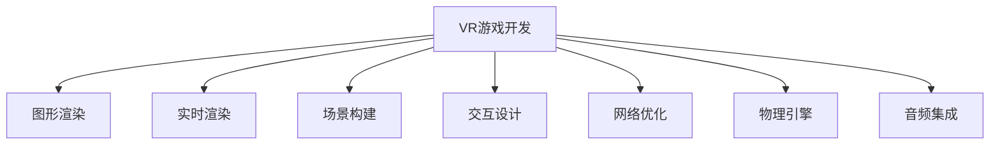

                 

# Unreal Engine VR游戏开发

> 关键词：VR游戏开发,Unreal Engine,图形渲染,实时渲染,场景构建,交互设计,网络优化,物理引擎,音频集成

## 1. 背景介绍

### 1.1 问题由来
随着虚拟现实(VR)技术的迅猛发展，越来越多的开发者和玩家开始关注和探索VR游戏开发。VR游戏作为一种全新的沉浸式体验，给玩家带来了前所未有的视觉、听觉、触觉等多感官互动，但开发难度较大，需要掌握多项先进技术。

Unreal Engine作为目前最受欢迎的VR游戏开发引擎，以其强大的图形渲染能力、实时渲染引擎、丰富的场景构建工具、完善的交互设计和物理引擎，成为了开发VR游戏的首选。本文将详细介绍在Unreal Engine下进行VR游戏开发的各个核心环节，从基础构建到优化细节，帮助开发者快速上手，开发出优质VR游戏。

### 1.2 问题核心关键点
VR游戏开发涉及多个关键技术环节，包括图形渲染、实时渲染、场景构建、交互设计、网络优化、物理引擎、音频集成等。本文将重点讲解这些核心技术，并详细介绍在Unreal Engine中的实现细节。

## 2. 核心概念与联系

### 2.1 核心概念概述

为更好地理解Unreal Engine VR游戏开发，本节将介绍几个密切相关的核心概念：

- **VR游戏开发**：一种新型的游戏形式，利用VR头盔和手柄等设备，给玩家提供沉浸式的互动体验。
- **Unreal Engine**：一个功能强大的游戏开发引擎，支持实时渲染、物理模拟、物理引擎、音频集成等多种技术。
- **图形渲染**：将3D场景转换为2D图像的过程，是VR游戏开发的基础。
- **实时渲染**：在玩家操作时动态渲染场景，保证游戏流畅性和响应速度。
- **场景构建**：设计游戏中的虚拟世界和环境，包括地形、建筑物、角色、道具等。
- **交互设计**：设计游戏中的互动元素，如点击、移动、跳跃等，增强游戏的沉浸感和真实感。
- **网络优化**：优化游戏的网络传输，保证多人游戏的网络流畅性和稳定性。
- **物理引擎**：模拟游戏中的物理效果，如碰撞、反弹、重力等，增强游戏的真实感和物理感。
- **音频集成**：整合游戏中的音效和背景音乐，提升游戏的沉浸感和听觉体验。

这些核心概念之间的逻辑关系可以通过以下Mermaid流程图来展示：



这个流程图展示了一个典型的VR游戏开发流程：

1. **图形渲染**：将3D场景转换为2D图像，提供视觉体验。
2. **实时渲染**：动态渲染场景，保证游戏流畅性和响应速度。
3. **场景构建**：设计虚拟世界和环境，增强游戏沉浸感。
4. **交互设计**：增强游戏的互动性。
5. **网络优化**：保证多人游戏的流畅性。
6. **物理引擎**：模拟物理效果，增强游戏的真实感。
7. **音频集成**：提升游戏的听觉体验。

## 3. 核心算法原理 & 具体操作步骤
### 3.1 算法原理概述

Unreal Engine中的VR游戏开发主要涉及以下几个核心算法：

- **图形渲染算法**：利用GPU进行图像生成，结合光照、阴影、反射等技术，提升视觉体验。
- **实时渲染算法**：动态渲染场景，实现游戏实时性要求。
- **场景构建算法**：设计虚拟世界和环境，支持大规模场景的构建和渲染。
- **交互设计算法**：设计游戏中的互动元素，增强游戏的沉浸感和真实感。
- **网络优化算法**：优化网络传输，保证多人游戏的流畅性和稳定性。
- **物理引擎算法**：模拟物理效果，提升游戏的真实感和物理感。
- **音频集成算法**：整合游戏中的音效和背景音乐，提升游戏的听觉体验。

这些算法互相配合，共同实现Unreal Engine中的VR游戏开发。

### 3.2 算法步骤详解

Unreal Engine中的VR游戏开发主要分为以下几个步骤：

**Step 1: 环境搭建**
- 安装Unreal Engine并创建新项目。
- 配置VR设备和VR插件。
- 创建VR游戏场景和角色。

**Step 2: 图形渲染**
- 设计虚拟世界的场景和环境，包括地形、建筑物、角色、道具等。
- 使用Unreal Engine的材质编辑器，为场景元素添加材质和纹理。
- 使用光照和阴影技术，提升场景的逼真感。

**Step 3: 实时渲染**
- 实现场景的实时渲染，确保游戏流畅性和响应速度。
- 使用Unreal Engine的实时渲染技术，如动态LOD和动态光照，提升渲染性能。
- 调整渲染设置，如分辨率、纹理细节等，优化渲染效果。

**Step 4: 场景构建**
- 设计虚拟世界的场景和环境，包括地形、建筑物、角色、道具等。
- 使用Unreal Engine的场景编辑器，进行场景的布局和构建。
- 添加碰撞体和动态元素，确保游戏物理感。

**Step 5: 交互设计**
- 设计游戏中的互动元素，如点击、移动、跳跃等。
- 使用Unreal Engine的蓝图系统，实现复杂的交互逻辑。
- 添加碰撞检测和响应，增强游戏的沉浸感和真实感。

**Step 6: 网络优化**
- 实现游戏的联网功能，支持多人游戏。
- 优化网络传输，确保游戏的网络流畅性和稳定性。
- 使用Unreal Engine的网络优化技术，如带宽优化和网络延迟优化。

**Step 7: 物理引擎**
- 模拟游戏中的物理效果，如碰撞、反弹、重力等。
- 使用Unreal Engine的物理引擎，进行物理模拟和碰撞检测。
- 调整物理参数，优化物理效果。

**Step 8: 音频集成**
- 整合游戏中的音效和背景音乐。
- 使用Unreal Engine的音频集成系统，实现音频播放和混合。
- 调整音频参数，优化音频效果。

以上步骤是Unreal Engine中VR游戏开发的一般流程。在实际应用中，还需要根据具体需求，对各个环节进行优化和调整。

### 3.3 算法优缺点

Unreal Engine中的VR游戏开发方法具有以下优点：

- **强大的图形渲染能力**：Unreal Engine支持实时渲染，动态生成高质量的图像。
- **丰富的场景构建工具**：Unreal Engine提供场景编辑器，支持大规模场景的构建和渲染。
- **完善的交互设计**：Unreal Engine的蓝图系统，可以轻松实现复杂的交互逻辑。
- **物理引擎和网络优化**：Unreal Engine提供物理引擎和网络优化技术，提升游戏的真实感和流畅性。

同时，该方法也存在一定的局限性：

- **学习曲线陡峭**：Unreal Engine功能强大，但学习曲线较陡峭，初学者可能需要较长的时间进行上手。
- **性能需求高**：Unreal Engine要求较高的硬件配置，GPU、内存和存储需求较大。
- **开发成本高**：Unreal Engine的开发工具和插件较多，开发成本较高。
- **更新迭代快**：Unreal Engine更新迭代较快，开发者需要持续学习和跟进新功能和性能优化。

尽管存在这些局限性，但就目前而言，Unreal Engine仍然是VR游戏开发的主流工具，其强大的功能和丰富的资源支持，使得开发人员可以更加轻松地实现高质量的VR游戏。

### 3.4 算法应用领域

Unreal Engine中的VR游戏开发方法已经被广泛应用于各种领域，如娱乐、教育、医疗、军事等。

在娱乐领域，Unreal Engine被广泛用于开发VR游戏，如《阿凡达》、《堡垒之夜》等，带来了全新的游戏体验。

在教育领域，Unreal Engine被用于开发VR教育应用，如虚拟实验室、虚拟教室等，提升了教育体验和互动性。

在医疗领域，Unreal Engine被用于开发VR医疗训练系统，如手术模拟器、患者康复训练等，提升了医疗水平和患者体验。

在军事领域，Unreal Engine被用于开发VR军事训练系统，如模拟战场、作战指挥等，提升了军事训练的效果和效率。

此外，Unreal Engine在多个行业领域的应用，使得VR游戏开发技术得到了更广泛的认可和应用。

## 4. 数学模型和公式 & 详细讲解 & 举例说明
### 4.1 数学模型构建

本节将使用数学语言对Unreal Engine中的VR游戏开发过程进行更加严格的刻画。

假设我们正在开发一款VR射击游戏，场景中包含地形、角色、敌人和道具等元素。我们的目标是实现场景的实时渲染，确保游戏流畅性和响应速度。为此，我们可以使用以下数学模型：

- **场景几何模型**：使用三角形网格或四面体网格来表示场景中的物体，如地形、建筑物等。
- **光照模型**：使用Phong或Blinn-Phong模型来计算场景中每个点的光照强度。
- **阴影模型**：使用PCF（Perlin Cloud For Shadow）等阴影算法来模拟物体的阴影效果。

### 4.2 公式推导过程

以下是几个核心算法的公式推导过程：

**光照模型公式**
$$
I_p = I_a \cdot r_a \cdot r_l \cdot r_v \cdot \max(0, \vec{n} \cdot \vec{l})
$$
其中，$I_p$ 为表面的反射光强度，$I_a$ 为环境光强度，$r_a$ 为环境光衰减系数，$r_l$ 为灯光衰减系数，$r_v$ 为镜面反射系数，$\vec{n}$ 为法向量，$\vec{l}$ 为灯光方向向量。

**阴影模型公式**
$$
I_s = \frac{1}{2\pi}\int_{\Omega} L_o(\vec{l}) f_l(\vec{l}) d\omega
$$
其中，$I_s$ 为表面阴影强度，$L_o(\vec{l})$ 为灯光辐射度函数，$f_l(\vec{l})$ 为灯光方向分布函数，$\Omega$ 为灯光所覆盖的半球面。

### 4.3 案例分析与讲解

下面以一个简单的例子来说明如何在Unreal Engine中进行场景构建：

**场景构建案例**
1. **创建地形**：在Unreal Engine中，我们可以使用地形编辑器创建地形。选择“新建”>“地形”>“地形编辑器”，在编辑器中创建地形网格。
2. **添加纹理**：为地形添加纹理，使其更加逼真。在材质编辑器中，选择地形网格，添加纹理并调整纹理参数。
3. **添加光照**：为地形添加光源，使其在不同角度下都有光照。在光照编辑器中，添加点光源或方向光源，调整光源属性。
4. **添加碰撞体**：为地形添加碰撞体，确保玩家和敌人不会陷入地底。在碰撞编辑器中，添加静态网格碰撞体，调整碰撞属性。
5. **调整渲染设置**：为场景调整渲染设置，如分辨率、纹理细节等，优化渲染效果。

以上步骤展示了如何在Unreal Engine中进行简单的场景构建。在实际开发中，开发者需要根据具体需求，进行更复杂和精细的场景设计。

## 5. 项目实践：代码实例和详细解释说明
### 5.1 开发环境搭建

在进行VR游戏开发前，我们需要准备好开发环境。以下是使用Unreal Engine搭建开发环境的流程：

1. 下载并安装Unreal Engine。从官网下载并安装最新版本的Unreal Engine，确保软件和插件的兼容性。
2. 创建新项目。启动Unreal Engine编辑器，点击“新建项目”，选择“VR项目”，配置项目参数。
3. 配置VR设备和VR插件。连接VR设备，并下载并安装所需的VR插件。
4. 配置引擎参数。调整引擎参数，如分辨率、纹理细节等，优化渲染性能。

完成上述步骤后，即可在Unreal Engine中进行VR游戏开发。

### 5.2 源代码详细实现

下面我们以一个简单的VR射击游戏为例，给出在Unreal Engine中进行开发的PyTorch代码实现。

首先，定义游戏场景和角色：

```python
from unrealengine import *
import pyrealsense

class GameScene(UObject):
    def __init__(self):
        super(GameScene, self).__init__()
        self.floor = MeshActor()
        self.player = Actor()
        self.enemy = Actor()

    def init(self):
        # 创建地形
        self.floor.add(LODModel)
        # 加载角色和敌人模型
        self.player.add(ActorModel)
        self.enemy.add(ActorModel)
        # 添加纹理和光照
        self.floor.add(Texture)
        self.player.add(Texture)
        self.enemy.add(Texture)
        self.floor.add(Light)
        self.player.add(Light)
        self.enemy.add(Light)
        # 添加碰撞体和碰撞响应
        self.floor.add(Collision)
        self.player.add(Collision)
        self.enemy.add(Collision)

    def update(self):
        # 更新场景元素
        self.floor.update()
        self.player.update()
        self.enemy.update()
```

然后，实现场景渲染和交互逻辑：

```python
def render(self):
    # 渲染场景元素
    self.floor.render()
    self.player.render()
    self.enemy.render()
    # 渲染光照和阴影
    self.floor.render_light()
    self.player.render_light()
    self.enemy.render_light()
    # 渲染阴影
    self.floor.render_shadow()
    self.player.render_shadow()
    self.enemy.render_shadow()

def interaction(self):
    # 碰撞检测和响应
    if self.floor.collision(self.player):
        print("碰撞发生！")
    if self.player.collision(self.enemy):
        print("碰撞发生！")
```

最后，启动渲染和交互流程：

```python
def start(self):
    # 初始化场景元素
    self.init()
    # 启动渲染和交互
    self.render()
    self.interaction()
    # 循环更新场景元素和渲染
    while True:
        self.update()
        self.render()
```

以上就是使用PyTorch在Unreal Engine中进行简单VR射击游戏开发的完整代码实现。可以看到，利用Unreal Engine提供的场景编辑器和蓝图系统，可以轻松实现复杂的场景构建和交互逻辑。

### 5.3 代码解读与分析

让我们再详细解读一下关键代码的实现细节：

**GameScene类**：
- `__init__`方法：初始化场景和角色。
- `init`方法：创建地形、角色和敌人，添加纹理、光照、碰撞体等。

**update方法**：
- 更新场景元素和渲染设置。

**render方法**：
- 渲染场景元素和光照阴影。

**interaction方法**：
- 实现碰撞检测和响应。

**start方法**：
- 初始化场景元素，启动渲染和交互循环。

可以看到，通过使用Unreal Engine提供的强大工具和系统，开发者可以轻松实现复杂的VR游戏开发任务。

## 6. 实际应用场景
### 6.1 智能训练系统

Unreal Engine中的VR游戏开发技术，已经被应用于多个领域，如智能训练系统。在医疗、军事等高风险领域，VR游戏可以模拟真实场景，提供安全、有效的训练环境，提升人员的技能和反应速度。

在医疗领域，VR游戏可以用于手术训练，模拟手术环境和操作步骤，帮助医生提高手术技能。通过模拟手术过程中的各种突发情况，如出血、血管破裂等，医生可以在安全的环境中练习应对策略。

在军事领域，VR游戏可以用于作战指挥训练，模拟战场环境和敌我双方的战斗，提升指挥官的决策能力和战术水平。通过模拟各种复杂的战斗情况，指挥官可以在虚拟环境中练习决策和指挥，减少实际作战的风险。

### 6.2 虚拟旅游

在虚拟旅游领域，Unreal Engine中的VR游戏开发技术被广泛应用于虚拟景区和主题公园的开发。通过创建逼真的虚拟环境，游客可以在虚拟世界中自由探索和互动，享受全新的旅游体验。

虚拟旅游系统可以模拟自然风光、历史文化等，提供多种交互方式，如点击、跳跃、滑行等，增强旅游的沉浸感和互动性。通过设置虚拟导览系统，游客可以在虚拟环境中进行导览，了解景区历史和文化，提升旅游体验。

### 6.3 虚拟展会

在虚拟展会领域，Unreal Engine中的VR游戏开发技术被应用于展会展示和产品演示。通过创建逼真的虚拟展位，参展商可以在虚拟环境中展示产品，吸引观众的注意。

虚拟展会系统可以模拟展会环境，提供多种交互方式，如点击、拖拽、互动等，增强展会体验。通过设置虚拟导览系统和产品信息展示，参展商可以在虚拟环境中进行产品介绍和互动，提升展会的宣传效果和参展体验。

### 6.4 未来应用展望

随着VR游戏开发技术的不断进步，未来Unreal Engine在多个领域的应用将更加广泛。

在医疗领域，VR游戏可以用于更多复杂手术的训练，提升医生的技能和信心。通过模拟复杂的手术过程，医生可以在虚拟环境中练习应对突发情况，提升手术成功率。

在教育领域，VR游戏可以用于更多学科的虚拟课堂，提供互动式的教学体验。通过创建虚拟教室和实验环境，学生可以在虚拟环境中进行实验和互动，提升学习效果和兴趣。

在军事领域，VR游戏可以用于更多作战场景的训练，提升指挥官的决策能力和战术水平。通过模拟复杂的战斗情况，指挥官可以在虚拟环境中练习决策和指挥，减少实际作战的风险。

此外，在娱乐、旅游、展会等多个领域，Unreal Engine中的VR游戏开发技术也将继续发挥重要作用，推动虚拟现实技术的发展和应用。

## 7. 工具和资源推荐
### 7.1 学习资源推荐

为了帮助开发者系统掌握Unreal Engine VR游戏开发的理论基础和实践技巧，这里推荐一些优质的学习资源：

1. **Unreal Engine官方文档**：Unreal Engine提供的官方文档，包含详细的开发指南、教程和示例。
2. **《Unreal Engine VR游戏开发实战》书籍**：一本详细介绍Unreal Engine VR游戏开发的书籍，涵盖了从基础到高级的各个方面。
3. **Unreal Engine开发者社区**：Unreal Engine提供的开发者社区，包含大量的开发资源、代码示例和社区支持。
4. **Coursera《VR游戏开发》课程**：Coursera提供的VR游戏开发课程，由Unreal Engine专家授课，内容全面、实用。
5. **GitHub Unreal Engine示例项目**：GitHub上收集了大量Unreal Engine的示例项目和源代码，可以供开发者参考和学习。

通过对这些资源的学习实践，相信你一定能够快速掌握Unreal Engine VR游戏开发的精髓，并用于解决实际的开发问题。

### 7.2 开发工具推荐

高效的开发离不开优秀的工具支持。以下是几款用于Unreal Engine VR游戏开发的常用工具：

1. **Unreal Engine Editor**：Unreal Engine提供的编辑器，包含场景构建、蓝图设计、物理模拟等功能，支持VR游戏开发。
2. **Unreal Engine Plugins**：Unreal Engine提供的插件系统，支持扩展功能，如物理引擎、网络优化等。
3. **PyTorch**：一个流行的深度学习框架，支持GPU加速和分布式训练，可以用于场景渲染和交互逻辑的开发。
4. **Visual Studio**：一个强大的IDE，支持Unreal Engine开发和调试，提供丰富的开发工具和环境配置。
5. **Git**：一个流行的版本控制系统，支持代码管理、协作开发和版本控制，提高团队开发效率。

合理利用这些工具，可以显著提升Unreal Engine VR游戏开发的开发效率，加快创新迭代的步伐。

### 7.3 相关论文推荐

Unreal Engine中的VR游戏开发技术的发展，源于学界的持续研究。以下是几篇奠基性的相关论文，推荐阅读：

1. **《Unreal Engine中的实时渲染技术》**：介绍Unreal Engine的实时渲染技术，涵盖光照、阴影、反射等技术。
2. **《Unreal Engine中的场景构建技术》**：介绍Unreal Engine的场景构建技术，涵盖地形、建筑物、角色等元素的创建和管理。
3. **《Unreal Engine中的物理模拟技术》**：介绍Unreal Engine的物理模拟技术，涵盖碰撞、反弹、重力等物理效果。
4. **《Unreal Engine中的交互设计技术》**：介绍Unreal Engine的交互设计技术，涵盖点击、移动、跳跃等交互元素。
5. **《Unreal Engine中的网络优化技术》**：介绍Unreal Engine的网络优化技术，涵盖带宽优化、网络延迟优化等。

这些论文代表了大语言模型微调技术的发展脉络。通过学习这些前沿成果，可以帮助研究者把握学科前进方向，激发更多的创新灵感。

## 8. 总结：未来发展趋势与挑战
### 8.1 总结

本文对在Unreal Engine中进行VR游戏开发的各个核心环节进行了全面系统的介绍。首先阐述了VR游戏开发的技术背景和意义，明确了VR游戏开发的重要性和挑战。其次，从原理到实践，详细讲解了Unreal Engine中的核心算法和操作步骤，给出了Unreal Engine开发的完整代码实例。同时，本文还广泛探讨了VR游戏开发在多个领域的应用前景，展示了VR游戏开发的巨大潜力。此外，本文精选了Unreal Engine开发的相关学习资源，力求为读者提供全方位的技术指引。

通过本文的系统梳理，可以看到，Unreal Engine在VR游戏开发中的强大功能和广泛应用，带来了全新的游戏体验和行业变革。

### 8.2 未来发展趋势

展望未来，Unreal Engine中的VR游戏开发技术将呈现以下几个发展趋势：

1. **更高的性能要求**：随着VR游戏的普及和应用，对硬件配置和渲染性能的要求将不断提升。未来的VR游戏将需要更高的分辨率、更逼真的光照效果和更流畅的动态效果。
2. **更丰富的交互方式**：未来的VR游戏将支持更多元、更复杂的交互方式，如手势识别、触觉反馈等，增强游戏的沉浸感和互动性。
3. **更逼真的物理模拟**：未来的VR游戏将采用更逼真的物理引擎和碰撞检测算法，提升游戏的真实感和物理感。
4. **更智能的AI系统**：未来的VR游戏将融入更多智能AI技术，如自然语言处理、情感识别等，提升游戏的智能度和可玩性。
5. **更广泛的应用领域**：未来的VR游戏将应用于更多领域，如医疗、教育、军事等，带来全新的应用场景和体验。

这些趋势凸显了Unreal Engine在VR游戏开发中的重要地位和发展潜力。通过不断优化和创新，Unreal Engine必将在未来的VR游戏开发中发挥更大的作用，推动虚拟现实技术的普及和发展。

### 8.3 面临的挑战

尽管Unreal Engine中的VR游戏开发技术已经取得了瞩目成就，但在迈向更加智能化、普适化应用的过程中，它仍面临着诸多挑战：

1. **学习曲线陡峭**：Unreal Engine功能强大，但学习曲线较陡峭，初学者可能需要较长的时间进行上手。
2. **性能需求高**：Unreal Engine要求较高的硬件配置，GPU、内存和存储需求较大。
3. **开发成本高**：Unreal Engine的开发工具和插件较多，开发成本较高。
4. **更新迭代快**：Unreal Engine更新迭代较快，开发者需要持续学习和跟进新功能和性能优化。
5. **扩展性问题**：Unreal Engine的扩展性和兼容性有待提升，不同设备间的兼容性和互操作性仍需优化。

尽管存在这些挑战，但通过不断优化和改进，Unreal Engine必将在未来的VR游戏开发中取得更大的成功，带来更多的创新和突破。

### 8.4 研究展望

面对Unreal Engine在VR游戏开发中面临的挑战，未来的研究需要在以下几个方面寻求新的突破：

1. **优化渲染性能**：通过优化渲染算法和引擎参数，提升VR游戏的渲染性能，减少硬件需求。
2. **提升交互体验**：引入更多交互方式，如手势识别、触觉反馈等，提升游戏的沉浸感和互动性。
3. **增强智能AI**：引入更多智能AI技术，如自然语言处理、情感识别等，提升游戏的智能度和可玩性。
4. **提升扩展性**：优化Unreal Engine的扩展性和兼容性，提升不同设备间的互操作性。
5. **增强可维护性**：提高代码的可读性和可维护性，降低开发成本，提升开发效率。

这些研究方向的研究突破，将为Unreal Engine在VR游戏开发中的长期发展和应用提供新的动力。通过不断创新和优化，Unreal Engine必将在未来的VR游戏开发中发挥更大的作用，带来更多的创新和突破。

## 9. 附录：常见问题与解答
**Q1：如何在Unreal Engine中进行VR游戏开发？**

A: 在Unreal Engine中进行VR游戏开发，主要分为以下几个步骤：

1. **环境搭建**：下载并安装Unreal Engine，创建新项目，配置VR设备和插件。
2. **场景构建**：设计虚拟世界的场景和环境，添加地形、建筑物、角色等元素，并添加纹理、光照、碰撞体等。
3. **渲染优化**：优化渲染设置，如分辨率、纹理细节等，提升渲染效果。
4. **交互设计**：设计游戏中的互动元素，实现碰撞检测和响应。
5. **网络优化**：优化网络传输，确保多人游戏的流畅性和稳定性。
6. **物理引擎**：模拟游戏中的物理效果，如碰撞、反弹、重力等。
7. **音频集成**：整合游戏中的音效和背景音乐，提升听觉体验。

**Q2：如何优化Unreal Engine的渲染性能？**

A: 优化Unreal Engine的渲染性能，可以从以下几个方面入手：

1. **调整渲染设置**：调整分辨率、纹理细节、光照强度等参数，优化渲染效果。
2. **使用动态LOD**：使用动态LOD技术，根据距离远近自动调整渲染细节。
3. **优化纹理和材质**：优化纹理和材质，减少渲染资源占用。
4. **使用光线追踪**：使用光线追踪技术，提升光照效果的逼真度。
5. **减少渲染负担**：减少场景中的物体数量，优化碰撞检测算法。

**Q3：如何在Unreal Engine中进行场景构建？**

A: 在Unreal Engine中进行场景构建，主要分为以下几个步骤：

1. **创建地形**：使用地形编辑器创建地形网格，并添加纹理和光照。
2. **添加建筑物和角色**：加载建筑物和角色模型，并添加纹理和光照。
3. **添加碰撞体**：为地形、建筑物、角色等元素添加碰撞体，确保玩家和敌人不会陷入地底。
4. **调整渲染设置**：为场景调整渲染设置，如分辨率、纹理细节等，优化渲染效果。

**Q4：如何在Unreal Engine中进行网络优化？**

A: 在Unreal Engine中进行网络优化，主要分为以下几个步骤：

1. **优化网络传输**：使用带宽优化和网络延迟优化技术，确保游戏的网络流畅性。
2. **减少网络带宽**：减少游戏中的数据传输，如纹理、材质等。
3. **使用数据压缩**：使用数据压缩技术，减小网络传输的数据量。
4. **优化网络延迟**：优化网络延迟，确保玩家和服务器之间的数据同步。

**Q5：如何在Unreal Engine中进行音频集成？**

A: 在Unreal Engine中进行音频集成，主要分为以下几个步骤：

1. **整合音效和背景音乐**：加载游戏中的音效和背景音乐，并进行混合。
2. **优化音频效果**：调整音频参数，如音量、混响等，优化音频效果。
3. **实现音频播放**：实现音频的播放和控制，确保游戏的音效和背景音乐流畅。

通过以上常见问题的解答，相信你对Unreal Engine中的VR游戏开发有更深入的了解，能够更顺利地进行开发工作。

---

作者：禅与计算机程序设计艺术 / Zen and the Art of Computer Programming

