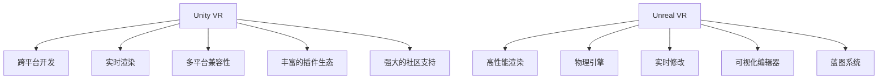

                 

# VR 内容开发框架选择：Unity VR 和 Unreal VR 的比较

## 1. 背景介绍

在当今的虚拟现实（Virtual Reality, VR）和增强现实（Augmented Reality, AR）领域，选择适合的开发框架对于成功构建高质量的内容至关重要。Unity VR 和 Unreal VR 是目前市场上最受欢迎的 VR 开发工具，它们各自具备独特的优势和适用场景。本文将详细比较这两个框架，以便开发者选择最适合自己需求的 VR 内容开发平台。

### 1.1 问题由来

随着VR技术的不断发展和普及，越来越多的开发者和企业希望通过VR技术为用户带来沉浸式的体验。然而，VR内容开发的技术门槛较高，需要考虑内容的表现、交互、性能和兼容性等多方面的因素。Unity VR 和 Unreal VR 作为两大主流平台，各有其特点和优势，需要开发者根据具体需求做出选择。

### 1.2 问题核心关键点

选择Unity VR 还是Unreal VR 作为开发平台，需要考虑以下关键点：

- **平台兼容性**：不同平台对VR内容的兼容性和性能要求不同。
- **开发效率**：开发效率是衡量平台易用性的重要指标。
- **生态系统**：丰富的第三方插件和工具能够加快开发进程。
- **性能表现**：VR内容需要稳定的帧率和低延迟以确保流畅体验。
- **社区支持**：强大的社区支持能够提供持续的技术支持和教程资源。

## 2. 核心概念与联系

### 2.1 核心概念概述

- **Unity VR**：由Unity Technologies开发，是一个支持跨平台的多媒体开发工具，适用于游戏、虚拟现实、增强现实等多个领域。
- **Unreal VR**：由Epic Games开发，是一个高性能的游戏引擎，特别适合构建高品质的3D图形和动态模拟。
- **VR内容开发**：指使用VR开发工具创建具有沉浸感和交互性的虚拟现实体验的过程。

### 2.2 核心概念原理和架构的 Mermaid 流程图



该流程图展示了Unity VR和Unreal VR的核心概念及其架构关系。Unity VR具备跨平台开发、实时渲染、多平台兼容性和丰富的插件生态；Unreal VR则强调高性能渲染、物理引擎、实时修改、可视化编辑器和蓝图系统。

## 3. 核心算法原理 & 具体操作步骤

### 3.1 算法原理概述

Unity VR和Unreal VR在核心算法原理上存在一些差异，这些差异直接影响两个框架的特性和适用场景。

- **Unity VR**：使用自己的图形渲染器，能够实现快速开发和跨平台兼容。核心算法包括物理引擎、动画系统、碰撞检测和物理模拟等。
- **Unreal VR**：使用Epic的Unreal Engine，强调实时渲染和高效的物理模拟。其核心算法包括动态光照、全局光照、高精度物理引擎等。

### 3.2 算法步骤详解

#### 3.2.1 构建项目

- **Unity VR**：
  1. 创建新的Unity项目，选择VR模板。
  2. 配置VR设备，如Oculus Rift或HTC Vive。
  3. 添加VR插件和组件。

- **Unreal VR**：
  1. 下载并安装Unreal Engine。
  2. 创建新的VR项目，选择VR模板。
  3. 配置VR设备，如Oculus Rift或HTC Vive。
  4. 添加VR插件和组件。

#### 3.2.2 场景设置

- **Unity VR**：
  1. 创建并配置VR场景，设置光源和环境。
  2. 添加虚拟对象，如角色、场景等。
  3. 设置物理交互和碰撞检测。

- **Unreal VR**：
  1. 创建并配置VR场景，设置光源和环境。
  2. 添加虚拟对象，如角色、场景等。
  3. 设置物理交互和碰撞检测。
  4. 使用蓝图系统或C++代码实现交互逻辑。

#### 3.2.3 渲染和优化

- **Unity VR**：
  1. 使用内置渲染器进行实时渲染。
  2. 优化渲染设置，如纹理分辨率、LOD（Level of Detail）。
  3. 使用ProBuilder进行场景优化。

- **Unreal VR**：
  1. 使用内置渲染器进行实时渲染。
  2. 优化渲染设置，如纹理分辨率、LOD（Level of Detail）。
  3. 使用Level of Detail（LOD）系统和细节层次（LodSystem）进行场景优化。

#### 3.2.4 输入交互

- **Unity VR**：
  1. 配置VR输入，如手柄、键盘和鼠标。
  2. 实现手势识别和触摸反馈。
  3. 使用XR Interaction ToolKit进行输入交互。

- **Unreal VR**：
  1. 配置VR输入，如手柄、键盘和鼠标。
  2. 实现手势识别和触摸反馈。
  3. 使用VRInputController和Virtual Hand进行输入交互。

#### 3.2.5 导出和部署

- **Unity VR**：
  1. 导出VR内容到目标平台，如PC、移动设备等。
  2. 进行性能测试，确保流畅体验。
  3. 发布到VR平台上，如Steam、Oculus Store等。

- **Unreal VR**：
  1. 导出VR内容到目标平台，如PC、移动设备等。
  2. 进行性能测试，确保流畅体验。
  3. 发布到VR平台上，如Steam、Oculus Store等。

### 3.3 算法优缺点

#### 3.3.1 Unity VR

- **优点**：
  1. 易于学习和使用，拥有庞大的社区和丰富的教程资源。
  2. 跨平台开发，支持iOS、Android、PC等多种平台。
  3. 实时渲染性能优秀，适合中小规模的VR项目。
  4. 插件生态丰富，可以快速实现各种功能。

- **缺点**：
  1. 渲染效果和细节表现不如Unreal VR。
  2. 物理引擎相对简单，不支持高级物理模拟。
  3. 优化难度较大，特别是在高分辨率和复杂场景下。

#### 3.3.2 Unreal VR

- **优点**：
  1. 高性能渲染，支持高分辨率和复杂场景。
  2. 强大的物理引擎，可以实现高级物理模拟。
  3. 支持蓝图系统，降低了C++编程的门槛。
  4. 可视化编辑器强大，便于调试和优化。

- **缺点**：
  1. 学习曲线较陡峭，需要一定的编程基础。
  2. 资源消耗较大，不适合资源有限的设备。
  3. 社区资源相对较少，教程和插件不如Unity丰富。

### 3.4 算法应用领域

Unity VR和Unreal VR在多个应用领域都有广泛的应用：

- **游戏开发**：游戏是VR内容开发的重要领域，Unity VR和Unreal VR都在游戏行业有大量应用。
- **虚拟培训**：VR培训内容需要高互动性和沉浸感，Unity VR和Unreal VR都能提供出色的支持。
- **虚拟旅游**：VR旅游需要高质量的图形和场景，Unreal VR更适合实现这一需求。
- **教育培训**：VR教育内容需要交互性和沉浸感，Unity VR和Unreal VR都能提供较好的支持。
- **医疗仿真**：VR医疗仿真需要高精度和低延迟，Unreal VR的物理引擎是其优势。

## 4. 数学模型和公式 & 详细讲解 & 举例说明

### 4.1 数学模型构建

Unity VR和Unreal VR的数学模型主要涉及图形渲染、物理模拟和输入交互等方面。以下对这两个框架在数学模型构建上的主要差异进行说明。

#### 4.1.1 图形渲染

- **Unity VR**：
  1. 使用内置的渲染器进行实时渲染。
  2. 支持多种光照模型，如Blinn-Phong、Gouraud等。
  3. 支持粒子系统和粒子系统着色器。

- **Unreal VR**：
  1. 使用内置的渲染器进行实时渲染。
  2. 支持动态光照和全局光照，提高了场景的真实感。
  3. 支持高级着色器和效果，如Post-Processing、Bloom等。

#### 4.1.2 物理模拟

- **Unity VR**：
  1. 使用Unity内置的物理引擎进行碰撞检测和模拟。
  2. 支持刚体物理、碰撞器、关节等。
  3. 支持物理材质和刚体间的互动。

- **Unreal VR**：
  1. 使用Epic的物理引擎进行碰撞检测和模拟。
  2. 支持高级物理特性，如布料模拟、流体模拟、碰撞响应等。
  3. 支持物理材质和物理相互作用，提高了物理真实性。

#### 4.1.3 输入交互

- **Unity VR**：
  1. 支持手柄、键盘和鼠标等常见输入设备。
  2. 支持基于事件的处理逻辑。
  3. 支持手势识别和触摸反馈。

- **Unreal VR**：
  1. 支持手柄、键盘和鼠标等常见输入设备。
  2. 支持基于蓝图和C++的事件处理逻辑。
  3. 支持高级手势识别和触摸反馈。

### 4.2 公式推导过程

#### 4.2.1 图形渲染公式

- **Unity VR**：
  1. 着色器计算公式：$C = Kd * I + Ks * L + Kg * E$
  2. 光照模型计算公式：$I = max(0, N \cdot L)$

- **Unreal VR**：
  1. 着色器计算公式：$C = Kd * I + Ks * L + Kg * E$
  2. 光照模型计算公式：$I = max(0, N \cdot L)$

### 4.3 案例分析与讲解

#### 4.3.1 游戏开发案例

假设我们正在开发一款基于Unity VR的游戏，游戏中需要实现逼真的物理效果和流畅的手势交互。

- **Unity VR**：
  1. 使用内置物理引擎，实现角色和场景的物理互动。
  2. 通过XR Interaction ToolKit，实现手柄和手势识别。
  3. 使用ProBuilder进行场景优化，提高渲染性能。

#### 4.3.2 虚拟培训案例

假设我们正在开发一款基于Unreal VR的虚拟培训应用，需要实现高精度和高互动性的培训场景。

- **Unreal VR**：
  1. 使用内置物理引擎，实现复杂物理互动。
  2. 通过蓝图系统，简化C++编程。
  3. 使用高级着色器和动态光照，提升场景真实感。

## 5. 项目实践：代码实例和详细解释说明

### 5.1 开发环境搭建

#### 5.1.1 Unity VR

1. 安装Unity Hub，下载并配置Unity VR SDK。
2. 创建新的Unity项目，选择VR模板。
3. 配置VR设备，如Oculus Rift或HTC Vive。

#### 5.1.2 Unreal VR

1. 下载并安装Unreal Engine。
2. 创建新的VR项目，选择VR模板。
3. 配置VR设备，如Oculus Rift或HTC Vive。

### 5.2 源代码详细实现

#### 5.2.1 Unity VR

```csharp
using UnityEngine;
using UnityEngine.XR.Interaction.Toolkit;

public class VRController : MonoBehaviour
{
    public XRController controller;

    void Update()
    {
        if (controller.inputDevice.IsActive)
        {
            // 处理手柄输入
            // ...
        }
    }
}
```

#### 5.2.2 Unreal VR

```cpp
// 在Unreal VR中，使用C++编写控制器逻辑
void HandleVRInput()
{
    // 处理手柄输入
    // ...
}
```

### 5.3 代码解读与分析

#### 5.3.1 Unity VR

在Unity VR中，控制器逻辑通过C#脚本实现。需要调用XRInteractionToolkit提供的方法，获取手柄的输入信息。

#### 5.3.2 Unreal VR

在Unreal VR中，控制器逻辑通过C++编写。需要使用VRInputController类，获取手柄的输入信息。

### 5.4 运行结果展示

#### 5.4.1 Unity VR

Unity VR的运行结果展示可以通过VR编辑器中的VR模式运行。在编辑器中设置VR场景，添加虚拟对象，调试控制器逻辑，最终导出到目标平台进行测试。

#### 5.4.2 Unreal VR

Unreal VR的运行结果展示可以通过Unreal Engine的VR模式运行。在编辑器中设置VR场景，添加虚拟对象，调试控制器逻辑，最终导出到目标平台进行测试。

## 6. 实际应用场景

### 6.1 智能医疗

在智能医疗领域，Unity VR和Unreal VR都能提供高质量的培训和模拟环境。Unity VR适合中小规模的培训应用，而Unreal VR则适合高精度和高互动性的模拟环境。

### 6.2 娱乐体验

在娱乐领域，Unity VR和Unreal VR都能提供流畅和沉浸式的体验。Unity VR适合中小型游戏和互动体验，而Unreal VR则适合大型游戏和复杂的虚拟世界。

### 6.3 教育培训

在教育培训领域，Unity VR和Unreal VR都能提供互动性和沉浸感强的培训内容。Unity VR适合模块化培训和游戏化学习，而Unreal VR则适合复杂和高精度培训内容。

## 7. 工具和资源推荐

### 7.1 学习资源推荐

1. Unity VR官方文档：提供了全面的开发指南和教程，适合Unity VR的入门学习。
2. Unreal VR官方文档：提供了详细的开发文档和示例，适合Unreal VR的深入学习。
3. Udemy和Coursera等在线课程：提供了丰富的VR开发课程，涵盖Unity VR和Unreal VR。

### 7.2 开发工具推荐

1. Unity Hub：用于Unity VR项目的创建和管理。
2. Unreal Engine：用于Unreal VR项目的创建和管理。
3. XR Interaction ToolKit：用于Unity VR的手势识别和触摸反馈。

### 7.3 相关论文推荐

1. "Unity VR vs. Unreal VR：Comparative Study"：比较了Unity VR和Unreal VR在多个方面的优缺点。
2. "VR Content Development with Unity VR and Unreal VR"：介绍了Unity VR和Unreal VR在内容开发上的异同。

## 8. 总结：未来发展趋势与挑战

### 8.1 研究成果总结

本文详细介绍了Unity VR和Unreal VR的核心概念、核心算法原理和具体操作步骤。通过比较这两个框架，帮助开发者更好地选择适合的开发平台。

### 8.2 未来发展趋势

Unity VR和Unreal VR在VR内容开发领域的应用将持续扩大。未来，两个框架在跨平台开发、实时渲染、物理模拟和手势识别等方面的能力将进一步提升。

### 8.3 面临的挑战

- **技术挑战**：需要不断优化和提升图形渲染和物理模拟的性能。
- **市场挑战**：需要应对日益激烈的市场竞争和用户需求的变化。
- **生态挑战**：需要建立和维护强大的社区和生态系统。

### 8.4 研究展望

未来，Unity VR和Unreal VR将继续在VR内容开发领域发挥重要作用。研究者需要在优化性能、提升用户体验和拓展生态系统等方面进行深入探索。

## 9. 附录：常见问题与解答

**Q1：Unity VR和Unreal VR在渲染性能上有何不同？**

A: Unity VR的内置渲染器虽然可以提供流畅的实时渲染，但在渲染效果和细节表现上可能不如Unreal VR。Unreal VR支持高分辨率和复杂场景，能够实现更逼真的渲染效果。

**Q2：Unity VR和Unreal VR在物理模拟上有何不同？**

A: Unity VR的物理引擎相对简单，主要支持基本碰撞和物理互动。而Unreal VR的物理引擎支持高级特性，如布料模拟、流体模拟和复杂的碰撞响应。

**Q3：如何选择Unity VR和Unreal VR？**

A: 如果项目规模较小，适合开发中小型应用，选择Unity VR；如果项目需要高精度和复杂的物理模拟，选择Unreal VR。同时，考虑团队技术栈和项目需求，选择最适合的开发平台。

**Q4：如何优化Unity VR和Unreal VR的性能？**

A: 优化Unity VR和Unreal VR的性能需要从多个方面入手，如渲染设置、物理引擎参数、场景优化和输入交互等。同时，可以采用资源压缩、帧同步等技术，提高系统的稳定性和流畅性。

**Q5：Unity VR和Unreal VR在VR培训中的应用有何不同？**

A: Unity VR适合中小规模的VR培训应用，支持快速开发和跨平台部署。而Unreal VR适合高精度和高互动性的培训内容，提供更好的物理模拟和真实感。

