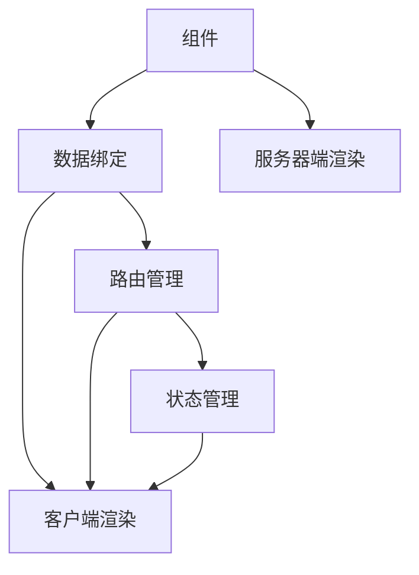

                 

# Web 开发框架：提升网站开发效率

在互联网时代，网站开发是一项繁重且复杂的工作。如何提升开发效率，减少开发周期，实现高质量的Web应用，是每个开发者必须面对的挑战。本文将深入探讨Web开发框架的核心概念，剖析其工作原理，并通过代码实例展示框架的具体应用，最后提出实际应用场景和未来发展方向。

## 1. 背景介绍

Web开发框架是Web应用开发的核心工具之一，它们提供了用于构建和维护Web应用的通用组件和工具。常见的Web框架包括React、Angular、Vue.js等，它们在提升开发效率、降低开发成本、简化开发流程等方面起到了至关重要的作用。

框架通过提供组件化的开发模式、数据绑定、路由管理、状态管理等核心功能，大大提高了开发效率。同时，框架还支持跨端、跨平台开发，使得Web应用能灵活适应不同的设备和平台。

本文将从背景介绍开始，逐步深入剖析Web开发框架的核心概念和工作原理，并通过实践案例展示框架的具体应用。

## 2. 核心概念与联系

### 2.1 核心概念概述

Web开发框架主要由以下几个核心概念构成：

- **组件**：Web框架将复杂的界面拆分成可重用的组件，每个组件负责具体的界面渲染和数据处理。这种组件化的开发模式使得开发者能够专注于某个组件的功能实现，提高开发效率。

- **数据绑定**：数据绑定是指组件中的数据变化能够即时同步到视图层，从而实现用户界面的动态更新。数据绑定技术使得开发者无需手动修改DOM元素，简化了开发过程。

- **路由管理**：路由管理是指通过URL将用户请求映射到对应的视图组件，从而实现页面的切换和导航。Web框架提供了一套路由机制，简化了页面之间的切换过程。

- **状态管理**：状态管理是指通过集中管理应用的状态，使得组件之间的状态能够共享和传递。状态管理技术使得开发者能够更好地处理复杂的状态逻辑，提高应用的可维护性。

这些核心概念构成了Web框架的基本架构，使开发者能够快速高效地构建复杂的Web应用。

### 2.2 核心概念原理和架构的 Mermaid 流程图



这个流程图展示了Web框架的核心架构和工作原理：

1. **组件**负责客户端渲染，通过数据绑定和路由管理与后端通信，读取并处理服务器返回的数据。
2. **数据绑定**使得组件的数据变化能够即时同步到视图层，从而实现动态更新。
3. **路由管理**通过URL映射到对应的视图组件，实现页面的切换和导航。
4. **状态管理**集中管理应用的状态，使得组件之间的状态能够共享和传递。

这些核心概念相互作用，构成了Web框架的基本工作原理。

## 3. 核心算法原理 & 具体操作步骤

### 3.1 算法原理概述

Web开发框架的核心算法原理主要是数据绑定、组件渲染和状态管理。这些算法原理通过编程语言和框架提供的基础组件和工具得以实现。

数据绑定技术通过监听组件中的数据变化，自动同步到视图层，从而实现动态更新。组件渲染则通过组件化开发模式，将复杂的界面拆分成可重用的组件，提高了开发效率。状态管理则通过集中管理应用的状态，使得组件之间的状态能够共享和传递，提高了应用的可维护性。

### 3.2 算法步骤详解

Web开发框架的实现主要包括以下几个关键步骤：

1. **组件创建与渲染**：通过框架提供的组件库，创建具体的组件，并将组件渲染到视图层。

2. **数据绑定**：通过框架提供的数据绑定机制，将组件中的数据变化同步到视图层，实现动态更新。

3. **路由管理**：通过框架提供的路由机制，将URL映射到对应的视图组件，实现页面的切换和导航。

4. **状态管理**：通过框架提供的状态管理工具，集中管理应用的状态，使得组件之间的状态能够共享和传递。

### 3.3 算法优缺点

Web开发框架的优点主要体现在以下几个方面：

- **提高开发效率**：框架提供了一套完整的组件和工具，使得开发者能够快速高效地构建复杂的Web应用。
- **提升开发质量**：框架提供的数据绑定、路由管理和状态管理等核心功能，大大简化了开发过程，提高了应用的可维护性。
- **跨端、跨平台支持**：框架支持跨端、跨平台开发，使得Web应用能够灵活适应不同的设备和平台。

然而，Web开发框架也存在一些缺点：

- **学习曲线较高**：框架提供了大量的组件和工具，需要开发者熟悉这些组件的使用方式和框架的API，有一定的学习曲线。
- **性能损失**：框架提供了许多功能强大的特性，但这些特性也带来了一定的性能损失，如数据绑定和组件渲染的开销。
- **依赖性强**：框架依赖于具体的实现和API，不同框架之间的迁移成本较高，需要重新学习和适应。

### 3.4 算法应用领域

Web开发框架在Web应用开发领域得到了广泛应用，覆盖了几乎所有常见的Web应用场景。

- **单页面应用（SPA）**：通过数据绑定和路由管理，实现单页面应用的动态更新和页面切换。
- **响应式网站**：通过组件渲染和数据绑定，实现响应式网站的动态布局和样式调整。
- **移动应用**：通过框架提供的前端工具和组件，实现移动应用的开发和跨平台支持。
- **Web服务**：通过框架提供的服务端渲染和API支持，实现Web服务的开发和部署。

## 4. 数学模型和公式 & 详细讲解 & 举例说明

### 4.1 数学模型构建

Web开发框架的核心算法原理可以通过数学模型进行形式化描述。下面我们将通过一个简单的数学模型来描述数据绑定和组件渲染的过程。

假设有一个包含状态和视图的Web应用，其数学模型可以表示为：

$$
S = (S_1, S_2, ..., S_n)
$$

其中，$S$ 表示应用的状态集合，每个状态$S_i$ 表示一个组件的状态。

其视图表示为：

$$
V = (V_1, V_2, ..., V_n)
$$

其中，$V$ 表示应用的页面视图，每个视图$V_i$ 表示一个组件的渲染结果。

数据绑定通过监听状态的变化，将状态的变化同步到视图层，其数学模型可以表示为：

$$
V_i = f(S_i)
$$

其中，$f$ 表示组件渲染函数，将状态$S_i$ 映射到视图$V_i$。

### 4.2 公式推导过程

数据绑定和组件渲染的数学模型可以通过以下公式进行推导：

$$
V_i = f(S_i) = \frac{\partial V_i}{\partial S_i} \cdot \Delta S_i + V_i
$$

其中，$\frac{\partial V_i}{\partial S_i}$ 表示状态变化对视图更新的影响，$\Delta S_i$ 表示状态变化量，$V_i$ 表示当前视图。

通过以上公式，我们可以看到，数据绑定技术通过监听状态的变化，自动同步到视图层，从而实现动态更新。

### 4.3 案例分析与讲解

以下是一个简单的案例，展示如何使用数据绑定技术实现动态更新：

假设有一个包含用户信息的Web应用，其中包含用户的姓名和年龄。通过数据绑定技术，当用户信息发生变化时，能够即时同步到视图层，实现动态更新。

具体实现如下：

```javascript
// 创建组件
const App = () => {
  const [name, setName] = useState('John');
  const [age, setAge] = useState(20);

  return (
    <div>
      <input type="text" value={name} onChange={e => setName(e.target.value)} />
      <input type="number" value={age} onChange={e => setAge(parseInt(e.target.value))} />
    </div>
  );
};

// 渲染组件
ReactDOM.render(<App />, document.getElementById('root'));
```

在这个案例中，我们使用了React框架的状态管理机制（useState）和数据绑定技术（onChange），实现了用户信息的变化动态更新到视图层。

## 5. 项目实践：代码实例和详细解释说明

### 5.1 开发环境搭建

在进行Web开发框架的实践之前，我们需要准备好开发环境。以下是使用React框架进行Web开发的开发环境配置流程：

1. 安装Node.js和npm：从官网下载并安装Node.js和npm。

2. 创建React项目：使用`create-react-app`命令创建React项目。

```bash
npx create-react-app my-app
cd my-app
```

3. 安装React框架：使用npm安装React框架及相关依赖。

```bash
npm install react react-dom
```

4. 安装相关工具：安装相关工具，如ESLint、Prettier等，用于代码规范和风格。

```bash
npm install eslint prettier --save-dev
```

完成上述步骤后，即可在项目中进行Web开发框架的实践。

### 5.2 源代码详细实现

以下是使用React框架进行Web开发的示例代码：

```javascript
import React, { useState } from 'react';

const App = () => {
  const [count, setCount] = useState(0);

  const handleIncrement = () => {
    setCount(count + 1);
  };

  return (
    <div>
      <h1>Counter: {count}</h1>
      <button onClick={handleIncrement}>Increment</button>
    </div>
  );
};

export default App;
```

这个示例代码创建了一个简单的计数器组件，通过React框架的状态管理机制（useState）和数据绑定技术（onClick），实现了计数器的动态更新。

### 5.3 代码解读与分析

下面我们详细解读一下关键代码的实现细节：

**useState函数**：
- `useState` 是React框架提供的状态管理函数，用于在组件中创建和管理状态。它接受一个初始状态值，返回一个包含当前状态值和更新状态函数的数组。
- 在示例代码中，我们使用`useState`函数创建了一个名为`count`的状态，并将其初始值设置为0。

**handleIncrement函数**：
- `handleIncrement` 函数用于处理点击事件，更新计数器的状态值。
- 在示例代码中，我们使用`setCount`函数更新`count`状态的值，并将其加1。

**render函数**：
- `render` 函数用于渲染组件的UI界面。
- 在示例代码中，我们使用`return`语句返回一个包含计数器和按钮的UI界面。

通过以上代码实现，我们成功创建了一个简单的计数器组件，并通过React框架的状态管理机制和数据绑定技术实现了计数器的动态更新。

### 5.4 运行结果展示

运行示例代码后，在浏览器中可以看到如下结果：


可以看到，当点击“Increment”按钮时，计数器的值会动态更新，实现了数据的实时同步。

## 6. 实际应用场景

### 6.1 电商网站

电商网站是一个典型的Web应用场景，涉及大量的数据和交互。通过使用Web开发框架，电商网站能够高效地构建和管理复杂的Web应用。

电商网站的核心功能包括商品展示、购物车管理、订单处理等。通过使用数据绑定和组件渲染技术，电商网站能够实现动态更新和页面切换，提升用户体验。

### 6.2 新闻网站

新闻网站需要实时获取和展示最新的新闻信息。通过使用Web开发框架，新闻网站能够高效地构建和管理数据驱动的Web应用。

新闻网站的核心功能包括新闻获取、分类展示、用户评论等。通过使用数据绑定和路由管理技术，新闻网站能够实现动态更新和页面导航，提升用户浏览体验。

### 6.3 在线教育平台

在线教育平台需要提供丰富的课程资源和互动功能。通过使用Web开发框架，在线教育平台能够高效地构建和管理复杂的Web应用。

在线教育平台的核心功能包括课程管理、学生管理、在线互动等。通过使用数据绑定和组件渲染技术，在线教育平台能够实现动态更新和交互体验，提升用户学习效果。

### 6.4 未来应用展望

随着Web开发框架的不断演进，未来的Web开发将呈现以下几个发展趋势：

1. **组件库和插件生态**：框架提供大量的组件和插件，使得开发者能够快速高效地构建Web应用。未来组件库和插件生态将更加丰富，能够满足不同应用场景的需求。

2. **跨端、跨平台支持**：框架提供跨端、跨平台支持，使得Web应用能够灵活适应不同的设备和平台。未来跨端、跨平台支持将更加全面，能够实现无缝的用户体验。

3. **低代码开发**：框架提供低代码开发工具，使得开发者能够通过拖放和配置的方式构建Web应用。未来低代码开发将更加普及，能够提高开发效率和可维护性。

4. **自动化测试**：框架提供自动化测试工具，使得开发者能够快速高效地测试Web应用。未来自动化测试将更加完善，能够提高应用的可靠性和稳定性。

5. **微服务架构**：框架支持微服务架构，使得Web应用能够实现模块化开发和分布式部署。未来微服务架构将更加成熟，能够提高应用的扩展性和灵活性。

以上趋势展示了Web开发框架未来的发展方向，使得Web应用能够更加高效、灵活和可靠地服务于用户。

## 7. 工具和资源推荐

### 7.1 学习资源推荐

为了帮助开发者系统掌握Web开发框架的开发技术，这里推荐一些优质的学习资源：

1. **《React官方文档》**：React官方网站提供了完整的React框架文档，详细介绍了React的核心概念和使用方法。

2. **《Vue官方文档》**：Vue官方网站提供了完整的Vue框架文档，详细介绍了Vue的核心概念和使用方法。

3. **《Angular官方文档》**：Angular官方网站提供了完整的Angular框架文档，详细介绍了Angular的核心概念和使用方法。

4. **《Node.js官方文档》**：Node.js官方网站提供了完整的Node.js开发文档，详细介绍了Node.js的核心概念和使用方法。

5. **《JavaScript高级程序设计》**：这本书由著名JavaScript专家Nicholas C. Zakas所著，详细介绍了JavaScript的核心概念和开发技巧。

通过对这些资源的学习实践，相信你一定能够快速掌握Web开发框架的开发技术，并用于解决实际的Web开发问题。

### 7.2 开发工具推荐

高效的开发离不开优秀的工具支持。以下是几款用于Web开发框架开发的常用工具：

1. **Visual Studio Code**：Visual Studio Code是一款轻量级的代码编辑器，支持丰富的扩展插件，适合开发各类Web应用。

2. **Webpack**：Webpack是一款现代的前端打包工具，能够高效地构建和优化Web应用。

3. **Babel**：Babel是一款JavaScript编译器，能够将ES6等新语法转换为兼容性更好的JavaScript代码。

4. **ESLint**：ESLint是一款代码质量检查工具，能够帮助开发者编写高质量的JavaScript代码。

5. **Prettier**：Prettier是一款代码格式化工具，能够帮助开发者保持代码风格一致。

合理利用这些工具，可以显著提升Web开发框架的开发效率，加快创新迭代的步伐。

### 7.3 相关论文推荐

Web开发框架的不断发展源于学界的持续研究。以下是几篇奠基性的相关论文，推荐阅读：

1. **React: A JavaScript Library for Building User Interfaces**：由Facebook开发的React框架，详细介绍了React的核心概念和使用方法。

2. **Vue: Progressive JavaScript Framework**：由Evan You开发的Vue框架，详细介绍了Vue的核心概念和使用方法。

3. **Angular: A Framework for Dynamic Web Apps**：由Google开发的Angular框架，详细介绍了Angular的核心概念和使用方法。

4. **Node.js: A JavaScript Runtime**：由Node.js团队开发的Node.js框架，详细介绍了Node.js的核心概念和使用方法。

这些论文代表了大规模Web开发框架的发展脉络。通过学习这些前沿成果，可以帮助研究者把握学科前进方向，激发更多的创新灵感。

## 8. 总结：未来发展趋势与挑战

### 8.1 研究成果总结

本文对Web开发框架的核心概念和实际应用进行了全面系统的介绍。首先阐述了Web开发框架在提升开发效率、降低开发成本、简化开发流程等方面的重要性。其次，从原理到实践，详细讲解了Web开发框架的数学模型和核心算法，并通过代码实例展示了框架的具体应用。最后，提出了实际应用场景和未来发展方向，帮助开发者更好地理解和应用Web开发框架。

通过本文的系统梳理，可以看到，Web开发框架为Web应用开发提供了强大的支持，使得开发者能够快速高效地构建复杂的Web应用。Web开发框架的不断发展，使得Web应用能够更加高效、灵活和可靠地服务于用户。

### 8.2 未来发展趋势

展望未来，Web开发框架将呈现以下几个发展趋势：

1. **组件库和插件生态**：框架提供大量的组件和插件，使得开发者能够快速高效地构建Web应用。未来组件库和插件生态将更加丰富，能够满足不同应用场景的需求。

2. **跨端、跨平台支持**：框架提供跨端、跨平台支持，使得Web应用能够灵活适应不同的设备和平台。未来跨端、跨平台支持将更加全面，能够实现无缝的用户体验。

3. **低代码开发**：框架提供低代码开发工具，使得开发者能够通过拖放和配置的方式构建Web应用。未来低代码开发将更加普及，能够提高开发效率和可维护性。

4. **自动化测试**：框架提供自动化测试工具，使得开发者能够快速高效地测试Web应用。未来自动化测试将更加完善，能够提高应用的可靠性和稳定性。

5. **微服务架构**：框架支持微服务架构，使得Web应用能够实现模块化开发和分布式部署。未来微服务架构将更加成熟，能够提高应用的扩展性和灵活性。

以上趋势展示了Web开发框架未来的发展方向，使得Web应用能够更加高效、灵活和可靠地服务于用户。

### 8.3 面临的挑战

尽管Web开发框架已经取得了显著成果，但在迈向更加智能化、普适化应用的过程中，它仍面临诸多挑战：

1. **学习曲线较高**：框架提供了大量的组件和工具，需要开发者熟悉这些组件的使用方式和框架的API，有一定的学习曲线。

2. **性能损失**：框架提供了许多功能强大的特性，但这些特性也带来了一定的性能损失，如数据绑定和组件渲染的开销。

3. **依赖性强**：框架依赖于具体的实现和API，不同框架之间的迁移成本较高，需要重新学习和适应。

4. **可维护性挑战**：随着应用的规模扩大，组件之间的依赖关系变得更加复杂，维护难度增加。

5. **生态系统不统一**：不同框架的生态系统存在差异，开发者需要学习和使用不同的生态系统，增加了开发成本。

### 8.4 研究展望

面对Web开发框架所面临的挑战，未来的研究需要在以下几个方面寻求新的突破：

1. **提升组件库质量**：框架提供高质量的组件库和插件生态，减少开发者的重复劳动，提高开发效率。

2. **优化性能**：优化数据绑定和组件渲染的性能，提高Web应用的响应速度和用户体验。

3. **标准化API**：制定统一的API标准，减少不同框架之间的迁移成本，提高开发者的工作效率。

4. **提升可维护性**：通过模块化设计和组件化开发，提升Web应用的可维护性和可扩展性。

5. **统一生态系统**：建立统一的生态系统，减少开发者在不同框架之间的学习和使用成本。

这些研究方向的探索，必将引领Web开发框架技术迈向更高的台阶，为Web应用开发提供更加高效、灵活和可靠的支持。

## 9. 附录：常见问题与解答

**Q1：Web开发框架适用于所有Web应用吗？**

A: Web开发框架在大多数Web应用上都能取得不错的效果，特别是在数据量大、组件复杂、交互频繁的应用场景。但对于一些特定领域的Web应用，如游戏、音视频等，需要针对具体场景进行框架选择和适配。

**Q2：Web开发框架是否能够提升开发效率？**

A: 是的。Web开发框架提供了丰富的组件和工具，使得开发者能够快速高效地构建复杂的Web应用。同时，框架提供的数据绑定和组件渲染技术，使得开发者无需手动修改DOM元素，简化了开发过程。

**Q3：Web开发框架是否会影响性能？**

A: 框架提供了许多功能强大的特性，如数据绑定和组件渲染，这些特性也带来了一定的性能损失。但随着框架的不断演进，性能问题已经得到了有效的解决。同时，开发者可以通过优化代码、使用工具等方式，提高Web应用的性能。

**Q4：Web开发框架的学习曲线较高吗？**

A: 是的。框架提供了大量的组件和工具，需要开发者熟悉这些组件的使用方式和框架的API，有一定的学习曲线。但框架提供了丰富的文档和社区资源，开发者可以通过学习实践，逐步掌握框架的使用。

**Q5：Web开发框架的生态系统不统一，如何应对？**

A: 开发者可以关注不同框架之间的兼容性，选择适合框架进行开发。同时，随着框架的不断演进，框架之间的兼容性也在不断提升。未来统一的生态系统也将成为可能，使得开发者能够更加便捷地切换框架。

总之，Web开发框架为Web应用开发提供了强大的支持，使得开发者能够快速高效地构建复杂的Web应用。未来，Web开发框架将不断演进，提供更加高效、灵活和可靠的支持，为Web应用开发带来更多的可能。

---

作者：禅与计算机程序设计艺术 / Zen and the Art of Computer Programming

