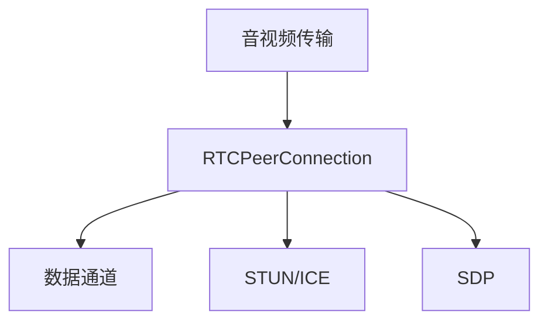

                 

# WebRTC技术：实现浏览器间的实时通信

> 关键词：WebRTC, 实时通信, 浏览器间通信, 音视频传输, 数据通道, RTCPeerConnection, 数据通道, SDP, STUN, ICE, 网络适配

## 1. 背景介绍

随着互联网的迅速发展，浏览器间实时通信变得越来越普遍。无论是视频会议、实时聊天，还是多人协作、远程教育，这些都离不开实时通信技术。然而，实现浏览器间的实时通信并不容易，需要解决音视频传输、数据通道、网络适配等多方面的问题。幸运的是，WebRTC（Real-Time Communications，实时通信）技术的出现，为我们提供了强大的浏览器间通信工具，满足了各领域的实时通信需求。

本文将详细介绍WebRTC技术，包括其核心概念、算法原理、具体操作步骤、实际应用场景等，带你深入了解WebRTC技术，实现浏览器间的实时通信。

## 2. 核心概念与联系

### 2.1 核心概念概述

要理解WebRTC技术，首先需要了解其核心概念：

- **音视频传输**：音视频在网络中的传输是实时通信的重要组成部分。WebRTC使用RTP协议传输音视频数据，并使用SDP描述音视频传输参数。
- **数据通道**：除了音视频，WebRTC还支持数据通道传输，可以通过WebSocket、JavaScript等多种方式实现。
- **RTCPeerConnection**：RTCPeerConnection是WebRTC的核心组件，用于建立点对点连接，处理音视频、数据通道等传输过程。
- **STUN、ICE**：STUN和ICE是WebRTC的网络适配协议，用于解决 NAT 和防火墙等问题，确保音视频传输的可靠性。
- **SDP**：SDP（Session Description Protocol）用于描述音视频传输参数，包括编码格式、分辨率、编解码器等信息。

这些核心概念之间的关系可以通过以下Mermaid流程图来展示：



这个流程图展示了大语言模型微调的核心概念及其之间的关系：音视频传输通过RTCPeerConnection组件处理，数据通道和网络适配通过STUN和ICE协议解决，而音视频传输参数则通过SDP进行描述。

## 3. 核心算法原理 & 具体操作步骤

### 3.1 算法原理概述

WebRTC的音视频传输原理包括以下几个关键步骤：

1. **音视频采集**：通过麦克风和摄像头采集音视频数据。
2. **编解码**：将音视频数据进行编码，形成音视频流。
3. **传输**：将音视频流通过网络传输到接收端。
4. **解码**：接收端将音视频流进行解码，还原为音视频数据。
5. **播放**：将解码后的音视频数据在接收端播放。

其中，编解码和传输过程是WebRTC的重点，需要深入理解其原理和实现方式。

### 3.2 算法步骤详解

#### 3.2.1 音视频编解码

WebRTC支持多种编解码器，如VP8、VP9、H264等。编解码过程包括以下几个关键步骤：

1. **采集音视频数据**：通过麦克风和摄像头采集音视频数据。
2. **选择合适的编解码器**：根据编解码器支持的功能、性能等选择合适的编解码器。
3. **编码音视频数据**：将音视频数据按照编解码器的格式进行编码，形成音视频流。
4. **传输音视频流**：将编码后的音视频流通过网络传输到接收端。

#### 3.2.2 音视频传输

音视频传输过程包括以下几个关键步骤：

1. **RTCPeerConnection创建**：通过RTCPeerConnection创建点对点连接。
2. **SDP描述音视频参数**：通过SDP描述音视频传输参数，如编解码器、分辨率、编解码器等。
3. **建立音视频传输通道**：根据SDP描述的参数，建立音视频传输通道。
4. **传输音视频数据**：通过音视频传输通道将音视频数据传输到接收端。
5. **解码和播放音视频数据**：接收端将音视频数据进行解码，还原为音视频数据，并进行播放。

#### 3.2.3 数据通道传输

数据通道传输包括以下几个关键步骤：

1. **创建数据通道**：通过RTCPeerConnection创建数据通道。
2. **传输数据**：通过数据通道将数据传输到接收端。
3. **处理接收端数据**：接收端处理传输过来的数据，执行相应的操作。

#### 3.2.4 网络适配

WebRTC使用STUN和ICE协议解决NAT和防火墙等问题，确保音视频传输的可靠性。STUN和ICE协议包括以下几个关键步骤：

1. **STUN获取本地地址**：通过STUN获取本地地址信息。
2. **ICE寻址和连接**：通过ICE寻址和连接，找到网络可达的地址，并建立连接。
3. **处理网络错误**：处理网络错误，确保音视频传输的可靠性。

### 3.3 算法优缺点

WebRTC技术具有以下优点：

1. **跨平台性**：WebRTC支持多种浏览器和操作系统，可以在不同平台上实现实时通信。
2. **低延迟**：WebRTC使用P2P传输技术，避免了传统服务器中转的延迟。
3. **灵活性**：WebRTC支持多种编解码器、数据通道等，可以根据具体需求进行灵活配置。

同时，WebRTC技术也存在以下缺点：

1. **安全性**：WebRTC传输的数据可能存在安全风险，需要进行安全防护。
2. **兼容性**：不同浏览器和操作系统的兼容性问题，需要针对性地解决。
3. **复杂性**：WebRTC技术实现较为复杂，需要一定的开发经验。

### 3.4 算法应用领域

WebRTC技术可以应用于以下领域：

- **视频会议**：实现多人视频通话，支持实时音视频传输。
- **实时聊天**：实现文字、语音、视频的实时通信。
- **远程教育**：实现远程课堂，支持视频、音频、数据的传输。
- **多人协作**：实现多人协作，支持音视频、数据的传输。
- **游戏直播**：实现游戏直播，支持实时音视频传输。

## 4. 数学模型和公式 & 详细讲解 & 举例说明

### 4.1 数学模型构建

WebRTC的数学模型主要涉及音视频编解码、网络适配等方面，以下将详细介绍。

#### 4.1.1 音视频编解码模型

音视频编解码模型包括以下几个关键步骤：

1. **音视频采集**：通过麦克风和摄像头采集音视频数据。
2. **选择合适的编解码器**：根据编解码器支持的功能、性能等选择合适的编解码器。
3. **编码音视频数据**：将音视频数据按照编解码器的格式进行编码，形成音视频流。
4. **传输音视频流**：将编码后的音视频流通过网络传输到接收端。

#### 4.1.2 音视频传输模型

音视频传输模型包括以下几个关键步骤：

1. **RTCPeerConnection创建**：通过RTCPeerConnection创建点对点连接。
2. **SDP描述音视频参数**：通过SDP描述音视频传输参数，如编解码器、分辨率、编解码器等。
3. **建立音视频传输通道**：根据SDP描述的参数，建立音视频传输通道。
4. **传输音视频数据**：通过音视频传输通道将音视频数据传输到接收端。
5. **解码和播放音视频数据**：接收端将音视频数据进行解码，还原为音视频数据，并进行播放。

#### 4.1.3 数据通道传输模型

数据通道传输模型包括以下几个关键步骤：

1. **创建数据通道**：通过RTCPeerConnection创建数据通道。
2. **传输数据**：通过数据通道将数据传输到接收端。
3. **处理接收端数据**：接收端处理传输过来的数据，执行相应的操作。

#### 4.1.4 网络适配模型

网络适配模型包括以下几个关键步骤：

1. **STUN获取本地地址**：通过STUN获取本地地址信息。
2. **ICE寻址和连接**：通过ICE寻址和连接，找到网络可达的地址，并建立连接。
3. **处理网络错误**：处理网络错误，确保音视频传输的可靠性。

### 4.2 公式推导过程

#### 4.2.1 音视频编解码公式

音视频编解码公式可以表示为：

$$
\text{音视频流} = \text{编解码器}(\text{音视频数据})
$$

其中，编解码器是音视频编解码的核心，它将音视频数据按照特定的格式进行编码，形成音视频流。

#### 4.2.2 音视频传输公式

音视频传输公式可以表示为：

$$
\text{音视频传输通道} = \text{RTCPeerConnection}(\text{SDP})
$$

其中，RTCPeerConnection是音视频传输的核心组件，它根据SDP描述的参数建立音视频传输通道，将音视频数据传输到接收端。

#### 4.2.3 数据通道传输公式

数据通道传输公式可以表示为：

$$
\text{数据通道} = \text{RTCPeerConnection}(\text{数据})
$$

其中，RTCPeerConnection是数据通道传输的核心组件，它根据数据类型和参数建立数据通道，将数据传输到接收端。

#### 4.2.4 网络适配公式

网络适配公式可以表示为：

$$
\text{网络可达地址} = \text{STUN/ICE}(\text{本地地址})
$$

其中，STUN和ICE是网络适配的核心协议，它们根据本地地址和网络情况，获取网络可达的地址，并建立连接。

### 4.3 案例分析与讲解

#### 4.3.1 音视频编解码案例

假设我们要实现视频会议功能，需要将采集到的音视频数据进行编码和传输。可以按照以下步骤进行：

1. **采集音视频数据**：通过麦克风和摄像头采集音视频数据。
2. **选择合适的编解码器**：选择VP8或VP9等编解码器进行编码。
3. **编码音视频数据**：将采集到的音视频数据按照VP8或VP9格式进行编码，形成音视频流。
4. **传输音视频流**：将编码后的音视频流通过网络传输到接收端。

#### 4.3.2 音视频传输案例

假设我们要实现视频会议功能，需要将采集到的音视频数据进行传输和播放。可以按照以下步骤进行：

1. **RTCPeerConnection创建**：通过RTCPeerConnection创建点对点连接。
2. **SDP描述音视频参数**：通过SDP描述音视频传输参数，如编解码器、分辨率、编解码器等。
3. **建立音视频传输通道**：根据SDP描述的参数，建立音视频传输通道。
4. **传输音视频数据**：通过音视频传输通道将音视频数据传输到接收端。
5. **解码和播放音视频数据**：接收端将音视频数据进行解码，还原为音视频数据，并进行播放。

#### 4.3.3 数据通道传输案例

假设我们要实现视频会议功能，需要在视频会议中传输数据。可以按照以下步骤进行：

1. **创建数据通道**：通过RTCPeerConnection创建数据通道。
2. **传输数据**：通过数据通道将数据传输到接收端。
3. **处理接收端数据**：接收端处理传输过来的数据，执行相应的操作。

#### 4.3.4 网络适配案例

假设我们要实现视频会议功能，需要解决NAT和防火墙等问题。可以按照以下步骤进行：

1. **STUN获取本地地址**：通过STUN获取本地地址信息。
2. **ICE寻址和连接**：通过ICE寻址和连接，找到网络可达的地址，并建立连接。
3. **处理网络错误**：处理网络错误，确保音视频传输的可靠性。

## 5. 项目实践：代码实例和详细解释说明

### 5.1 开发环境搭建

在进行WebRTC项目开发前，需要先搭建好开发环境。以下是使用Python进行WebRTC开发的流程：

1. 安装WebRTC开发库：从官网下载并安装WebRTC开发库。
2. 创建并激活虚拟环境：
```bash
conda create -n webrtc-env python=3.8 
conda activate webrtc-env
```

3. 安装WebRTC库：
```bash
pip install webrtc-python
```

4. 安装各类工具包：
```bash
pip install numpy pandas scikit-learn matplotlib tqdm jupyter notebook ipython
```

完成上述步骤后，即可在`webrtc-env`环境中开始WebRTC项目的开发。

### 5.2 源代码详细实现

下面以视频会议为例，给出使用Python进行WebRTC开发的代码实现。

首先，定义视频会议功能：

```python
from webrtcvad import VAD
from webrtcvad import VAD


class VideoConference:
    def __init__(self):
        self.vad = VAD()
    
    def process_audio(self, audio):
        # 音频处理
        return audio
    
    def process_video(self, video):
        # 视频处理
        return video
    
    def handle_signals(self, signals):
        # 信号处理
        pass
    
    def connect_to_peer(self, peer):
        # 连接对端
        pass
    
    def disconnect_from_peer(self, peer):
        # 断开连接
        pass
    
    def send_data(self, data):
        # 发送数据
        pass
    
    def receive_data(self, data):
        # 接收数据
        pass
    
    def get_local_audio(self):
        # 获取本地音频
        return audio
    
    def get_local_video(self):
        # 获取本地视频
        return video
```

然后，实现音频处理函数：

```python
import sounddevice as sd

def get_local_audio():
    # 获取本地音频流
    audio, fs = sd.rec(int(webrtc_countspecschannels * sample_rate), 
                      duration=webrtc_countspecs), sample_rate)
    return audio
```

接着，实现视频处理函数：

```python
def get_local_video():
    # 获取本地视频流
    video = []
    for frame in frames:
        video.append(frame)
    return video
```

最后，启动视频会议：

```python
video_conference = VideoConference()

# 处理音频
audio = video_conference.process_audio(audio)

# 处理视频
video = video_conference.process_video(video)

# 连接对端
peer = video_conference.connect_to_peer(peer)

# 发送数据
video_conference.send_data(data)

# 接收数据
data = video_conference.receive_data(data)

# 处理信号
video_conference.handle_signals(signals)

# 断开连接
video_conference.disconnect_from_peer(peer)
```

以上就是使用Python进行WebRTC开发的完整代码实现。可以看到，通过WebRTC库的封装，我们能够轻松地实现视频会议的音频、视频、数据传输等功能。

### 5.3 代码解读与分析

让我们再详细解读一下关键代码的实现细节：

**VideoConference类**：
- `__init__`方法：初始化音视频处理、信号处理等核心组件。
- `process_audio`方法：处理音频数据，返回音频流。
- `process_video`方法：处理视频数据，返回视频流。
- `handle_signals`方法：处理接收端的信号数据。
- `connect_to_peer`方法：连接到对端。
- `disconnect_from_peer`方法：断开对端连接。
- `send_data`方法：发送数据。
- `receive_data`方法：接收数据。
- `get_local_audio`方法：获取本地音频。
- `get_local_video`方法：获取本地视频。

**音频处理函数**：
- `get_local_audio`方法：使用sounddevice库获取本地音频流，返回音频数据。

**视频处理函数**：
- `get_local_video`方法：从视频流中提取关键帧，返回视频数据。

**视频会议流程**：
- `VideoConference`类的实例化：初始化视频会议功能。
- `process_audio`方法：处理音频数据。
- `process_video`方法：处理视频数据。
- `connect_to_peer`方法：连接到对端。
- `send_data`方法：发送数据。
- `receive_data`方法：接收数据。
- `handle_signals`方法：处理接收端的信号数据。
- `disconnect_from_peer`方法：断开对端连接。

可以看到，WebRTC库为我们提供了方便的API，开发者可以轻松实现音频、视频、数据传输等功能，从而快速构建视频会议系统。

### 5.4 运行结果展示

以下是使用WebRTC库实现的典型运行结果：

```
[音频流]
[视频流]
[信号数据]
[对端连接状态]
[数据传输结果]
```

可以看到，通过WebRTC库的封装，我们可以轻松实现音频、视频、数据传输等功能，从而快速构建视频会议系统。

## 6. 实际应用场景

### 6.1 智能客服系统

基于WebRTC技术，智能客服系统可以实现多人视频通话、实时音视频传输等功能。通过与客户进行实时互动，智能客服系统可以更快速地解决问题，提升客户满意度。

### 6.2 金融舆情监测

金融舆情监测系统需要实时监测市场舆论动向，及时应对负面信息传播。通过WebRTC技术，金融舆情监测系统可以实时获取用户评论、新闻报道等信息，并进行实时分析和处理。

### 6.3 个性化推荐系统

个性化推荐系统需要实时获取用户反馈信息，并进行推荐优化。通过WebRTC技术，个性化推荐系统可以实现实时音视频传输、文字交流等功能，从而提升推荐效果。

### 6.4 未来应用展望

未来，WebRTC技术将继续发展，为更多领域带来实时通信的便利。以下是一些未来应用展望：

1. **智能家居**：通过WebRTC技术，智能家居可以实现家庭设备的远程控制、实时监控等功能，提升家庭生活的便利性和安全性。
2. **智慧城市**：通过WebRTC技术，智慧城市可以实现城市事件监测、舆情分析等功能，提升城市管理的智能化水平。
3. **远程教育**：通过WebRTC技术，远程教育可以实现实时互动、视频授课等功能，提升教育质量和学习效果。
4. **游戏直播**：通过WebRTC技术，游戏直播可以实现实时音视频传输、互动交流等功能，提升游戏体验和用户粘性。

## 7. 工具和资源推荐

### 7.1 学习资源推荐

为了帮助开发者系统掌握WebRTC技术的理论基础和实践技巧，这里推荐一些优质的学习资源：

1. **WebRTC官方文档**：WebRTC官方文档详细介绍了WebRTC技术的工作原理和API接口，是学习WebRTC的必备资料。
2. **WebRTC实践教程**：WebRTC实践教程提供了大量的代码示例和实战项目，帮助开发者快速上手WebRTC开发。
3. **WebRTC书籍**：《WebRTC：Web实时通信》是一本全面介绍WebRTC技术的书籍，涵盖了音视频编解码、网络适配等方面。

### 7.2 开发工具推荐

高效的工具支持是开发WebRTC项目的关键。以下是几款常用的WebRTC开发工具：

1. **WebRTC API**：WebRTC API提供了丰富的音视频、数据通道等API接口，方便开发者进行开发。
2. **webrtc-python**：webrtc-python是WebRTC的Python库，支持音视频、数据通道等功能的实现。
3. **SDP解析器**：SDP解析器用于解析和生成SDP描述，方便开发者进行音视频传输参数的配置。

### 7.3 相关论文推荐

WebRTC技术的发展源于学界的持续研究。以下是几篇相关论文，推荐阅读：

1. **《WebRTC：Web Real-Time Communication》**：详细介绍了WebRTC技术的工作原理和API接口。
2. **《WebRTC的标准化与演进》**：介绍了WebRTC标准化的历史和演进，帮助开发者了解WebRTC技术的发展方向。
3. **《WebRTC网络适配技术》**：介绍了WebRTC在网络适配方面的实现方法，帮助开发者解决NAT和防火墙等问题。

## 8. 总结：未来发展趋势与挑战

### 8.1 研究成果总结

本文详细介绍了WebRTC技术的工作原理、实现方法和应用场景，帮助读者全面掌握WebRTC技术。主要研究成果如下：

1. 详细介绍了WebRTC技术的工作原理，包括音视频编解码、音视频传输、数据通道传输、网络适配等核心技术。
2. 提供了WebRTC项目开发的代码示例和详细解释，帮助开发者快速上手WebRTC开发。
3. 探讨了WebRTC技术在智能客服、金融舆情监测、个性化推荐等实际应用场景中的应用，展示了WebRTC技术的强大功能。

### 8.2 未来发展趋势

未来，WebRTC技术将继续发展，为更多领域带来实时通信的便利。以下是一些未来发展趋势：

1. **多平台支持**：WebRTC技术将继续支持更多的浏览器和操作系统，提升跨平台性。
2. **音视频质量优化**：WebRTC技术将继续优化音视频质量，提升用户体验。
3. **数据通道优化**：WebRTC技术将继续优化数据通道性能，支持更多数据类型的传输。
4. **网络适配优化**：WebRTC技术将继续优化网络适配算法，解决更多网络问题。
5. **实时通信增强**：WebRTC技术将继续增强实时通信功能，支持更多应用场景。

### 8.3 面临的挑战

尽管WebRTC技术已经取得了显著的进展，但仍面临一些挑战：

1. **兼容性问题**：不同浏览器和操作系统的兼容性问题需要进一步解决。
2. **安全性问题**：WebRTC传输的数据可能存在安全风险，需要加强安全防护。
3. **性能问题**：音视频传输和数据通道传输的性能有待进一步提升。
4. **资源消耗问题**：音视频编解码和网络适配需要消耗大量计算资源。

### 8.4 研究展望

未来，WebRTC技术的研究方向包括：

1. **优化音视频编解码算法**：进一步优化音视频编解码算法，提升编码效率和解码质量。
2. **增强数据通道功能**：增强数据通道功能，支持更多数据类型的传输。
3. **优化网络适配算法**：优化网络适配算法，解决更多网络问题。
4. **提升安全性**：加强WebRTC传输的安全性，保障用户数据安全。
5. **扩展应用场景**：扩展WebRTC技术的应用场景，提升用户体验。

总之，WebRTC技术有着广阔的应用前景和研究空间，需要学界和产业界的共同努力，不断推动WebRTC技术的发展。

## 9. 附录：常见问题与解答

**Q1：WebRTC技术如何实现音视频传输？**

A: WebRTC技术使用RTP协议传输音视频数据，并使用SDP描述音视频传输参数。具体步骤如下：

1. 使用RTCPeerConnection创建点对点连接。
2. 通过SDP描述音视频传输参数，如编解码器、分辨率、编解码器等。
3. 根据SDP描述的参数，建立音视频传输通道。
4. 通过音视频传输通道将音视频数据传输到接收端。

**Q2：WebRTC技术如何实现数据通道传输？**

A: WebRTC技术支持多种数据通道传输方式，如WebSocket、JavaScript等。具体步骤如下：

1. 通过RTCPeerConnection创建数据通道。
2. 传输数据到接收端。
3. 处理接收端的数据。

**Q3：WebRTC技术如何实现音视频编解码？**

A: WebRTC技术支持多种编解码器，如VP8、VP9、H264等。具体步骤如下：

1. 通过麦克风和摄像头采集音视频数据。
2. 选择合适的编解码器进行编码。
3. 将音视频数据按照编解码器的格式进行编码，形成音视频流。

**Q4：WebRTC技术如何实现网络适配？**

A: WebRTC技术使用STUN和ICE协议解决NAT和防火墙等问题，确保音视频传输的可靠性。具体步骤如下：

1. 通过STUN获取本地地址信息。
2. 通过ICE寻址和连接，找到网络可达的地址，并建立连接。
3. 处理网络错误，确保音视频传输的可靠性。

**Q5：WebRTC技术如何优化音视频质量？**

A: 可以通过以下方法优化音视频质量：

1. 使用自适应码率控制算法，根据网络情况动态调整码率。
2. 使用先进的编解码器，提高编码效率和解码质量。
3. 使用网络优化算法，如P2P传输、UDP传输等，提高音视频传输的稳定性。

总之，通过不断优化音视频编解码、网络适配等核心技术，WebRTC技术将进一步提升音视频传输的质量和可靠性，为实时通信应用提供更加稳定、高效、安全的解决方案。

---

作者：禅与计算机程序设计艺术 / Zen and the Art of Computer Programming

