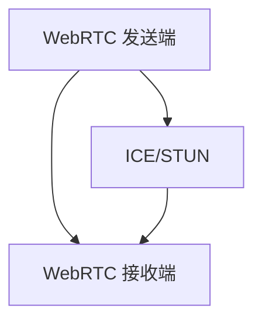
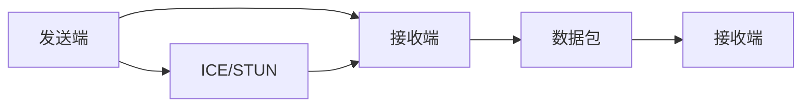

                 

# WebRTC技术：构建实时通信应用

> 关键词：WebRTC, 实时通信, STUN/TURN, 音视频流, 数据通道, ICE, SDP

## 1. 背景介绍

### 1.1 问题由来

在当今数字化时代，实时通信应用（Real-Time Communications, RTC）已成为人们日常生活和工作中不可或缺的一部分。视频会议、在线教育、远程协作等应用场景，对实时通信的需求日益增长。如何构建稳定、高效、安全的RTC系统，成为技术开发的重要课题。

传统的RTC解决方案往往依赖专用的软硬件，如Skype、Zoom、WebEx等，开发和维护成本高昂，且难以跨平台互通。WebRTC（Web Real-Time Communications）作为HTML5标准之一，以其开源、跨平台、低延迟、高效传输等特点，成为构建RTC应用的理想选择。

### 1.2 问题核心关键点

WebRTC是一种基于浏览器的网络通信协议，允许Web应用实现点对点音视频通信。其核心在于：

- 传输网络：利用TCP/UDP协议，实现音视频流的低延迟传输。
- 编解码器：通过OpenSSL等安全协议，提供基于WebRTC的加密传输。
- 数据通道：支持文本和数据通道，实现聊天和文件传输功能。
- ICE/STUN：发现和管理端到端连接的网络路径，实现可靠通信。

WebRTC架构如图1所示：



### 1.3 问题研究意义

掌握WebRTC技术，对于构建实时通信应用具有重要意义：

1. 降低开发成本。WebRTC基于浏览器实现，无需开发专用的软硬件，极大降低了开发和维护成本。
2. 提升用户体验。WebRTC的低延迟、高质量传输，带来流畅、自然的音视频体验。
3. 支持多平台。WebRTC兼容iOS、Android、Windows、Mac等主流平台，可跨平台互通。
4. 安全可靠。WebRTC使用SSL/TLS加密传输，确保通信安全。
5. 可扩展性强。WebRTC支持文本和数据通道，可灵活拓展功能，满足不同应用需求。

## 2. 核心概念与联系

### 2.1 核心概念概述

为更好地理解WebRTC技术，本节将介绍几个关键概念及其联系：

- WebRTC：基于HTML5标准的实时通信协议，支持音视频流、文本和数据通道的传输。
- ICE：Interactive Connectivity Establishment，用于发现和管理网络路径，实现可靠通信。
- STUN：Session Traversal Utilities for NAT，用于穿越NAT网络，实现设备之间的直接连接。
- TURN：Traversal Using Relay NAT，用于穿越多个NAT网络，实现跨网络通信。
- SDP：Session Description Protocol，用于描述音频、视频、文本和数据通道的传输参数。
- DTLS-SRTP：Datagram Transport Layer Security with Secure Real-Time Transport Protocol，提供端到端加密传输，确保通信安全。

这些核心概念共同构成了WebRTC技术的完整框架，使得开发者能够轻松构建稳定、高效、安全的实时通信应用。

## 3. 核心算法原理 & 具体操作步骤
### 3.1 算法原理概述

WebRTC的核心在于利用ICE/STUN/TURN协议，发现和管理网络路径，确保音视频流的可靠传输。其核心原理如下：

1. 发现网络路径：发送端通过STUN协议，获取本地网络信息。通过ICE协议，将STUN获取的信息与其他端进行交换，找到两端之间的最佳网络路径。
2. 建立传输通道：发送端使用TURN协议，将音视频流封装成数据包，通过最佳网络路径发送至接收端。接收端使用DTLS-SRTP协议，对数据包进行解密和处理，保证音视频流的安全传输。
3. 数据通道传输：WebRTC还支持文本和数据通道的传输，使用文本通道进行聊天，使用数据通道进行文件传输。

WebRTC的传输过程如图2所示：



### 3.2 算法步骤详解

WebRTC的传输过程涉及多个关键步骤，本节将详细介绍：

**Step 1: 建立连接**

1. 发送端和接收端交换各自的公网IP地址和端口号。
2. 发送端使用STUN协议获取本地IP地址和端口号。
3. 发送端和接收端通过ICE协议交换各自的网络信息，使用I2RTCP或I2RUDP协议获取最佳网络路径。

**Step 2: 数据包传输**

1. 发送端使用TURN协议将音视频流封装成数据包。
2. 发送端将数据包发送至接收端。
3. 接收端使用DTLS-SRTP协议对数据包进行解密和处理。

**Step 3: 数据通道传输**

1. 发送端和接收端使用文本通道进行聊天。
2. 发送端和接收端使用数据通道进行文件传输。

### 3.3 算法优缺点

WebRTC技术具有以下优点：

1. 开源免费：WebRTC基于HTML5标准，开发和维护成本低，广泛兼容各种平台。
2. 跨平台互通：WebRTC兼容iOS、Android、Windows、Mac等主流平台，可跨平台互通。
3. 低延迟高效传输：WebRTC使用UDP协议，保证音视频流的低延迟高效传输。
4. 安全性高：WebRTC使用SSL/TLS加密传输，确保通信安全。
5. 可扩展性强：WebRTC支持文本和数据通道，可灵活拓展功能。

同时，WebRTC技术也存在一些局限性：

1. 复杂度较高：WebRTC实现过程涉及STUN、ICE、TURN等多个协议，配置复杂。
2. 依赖浏览器支持：WebRTC依赖浏览器的实现，不同浏览器的支持程度不同，可能导致兼容性问题。
3. 延迟敏感：WebRTC对网络环境要求高，不稳定网络可能导致音视频传输中断。
4. 兼容性差：WebRTC在网络拓扑复杂的情况下，难以保证连接的稳定性。
5. 性能瓶颈：WebRTC对音视频编解码器和硬件要求高，可能导致性能瓶颈。

### 3.4 算法应用领域

WebRTC技术已广泛应用于各种实时通信场景，例如：

- 视频会议：如Zoom、Skype、Google Meet等。
- 在线教育：如Coursera、edX、腾讯课堂等。
- 远程协作：如Slack、Trello、Asana等。
- 实时游戏：如Steam、PUBG、王者荣耀等。
- 网络直播：如B站、抖音、YouTube等。
- 聊天应用：如微信、QQ、WhatsApp等。

## 4. 数学模型和公式 & 详细讲解 & 举例说明

### 4.1 数学模型构建

WebRTC的传输过程涉及多个网络协议，因此其数学模型较为复杂。这里以音视频流传输为例，介绍WebRTC的数学模型构建。

假设发送端和接收端之间的网络路径由多跳组成，发送端i的IP地址为$A_i$，接收端j的IP地址为$B_j$。网络路径包括n个中继节点，分别为$R_1, R_2, ..., R_n$。发送端发送音视频流，接收端接收音视频流，传输过程中使用UDP协议。

1. 发送端i的音视频流传输速率$R_i$：
   $$
   R_i = b \times \frac{T_{tot} - T_{prop}}{T_{trans} + T_{delay} + T_{prop}}
   $$
   其中$b$为带宽，$T_{tot}$为总传输时间，$T_{trans}$为传输时间，$T_{delay}$为延迟，$T_{prop}$为传播时间。

2. 接收端j的音视频流接收速率$R_j$：
   $$
   R_j = b \times \frac{T_{tot} - T_{prop}}{T_{trans} + T_{delay} + T_{prop}}
   $$

3. 中继节点$R_k$的音视频流传输速率$R_{R_k}$：
   $$
   R_{R_k} = b \times \frac{T_{tot} - T_{prop}}{T_{trans} + T_{delay} + T_{prop}}
   $$

### 4.2 公式推导过程

以上公式中，总传输时间$T_{tot}$包括数据包的传输时间和传播时间。传输时间$T_{trans}$包括发送端缓冲时间和接收端缓冲时间。延迟$T_{delay}$包括网络延迟和处理延迟。传播时间$T_{prop}$包括数据包从发送端到中继节点和从中继节点到接收端的传播时间。

### 4.3 案例分析与讲解

假设发送端i和接收端j之间存在两跳中继节点$R_1$和$R_2$。发送端i的带宽为$b=2Mbps$，网络延迟为$T_{delay}=0.1ms$，处理延迟为$T_{prop}=0.5ms$，传输时间为$T_{trans}=0.2ms$。中继节点$R_1$和$R_2$的带宽和延迟分别为$b_{R_1}=3Mbps, T_{delay_{R_1}}=0.3ms$和$b_{R_2}=2Mbps, T_{delay_{R_2}}=0.2ms$。

计算发送端i的音视频流传输速率$R_i$和接收端j的音视频流接收速率$R_j$：

1. 发送端i的音视频流传输速率$R_i$：
   $$
   R_i = 2 \times \frac{T_{tot} - T_{prop}}{0.2 + 0.1 + 0.5} = 2 \times \frac{T_{tot} - 0.5}{0.8} = 2.5Mbps
   $$

2. 接收端j的音视频流接收速率$R_j$：
   $$
   R_j = 2 \times \frac{T_{tot} - 0.5}{0.8} = 2.5Mbps
   $$

由此可见，发送端i和接收端j之间的音视频流传输速率相同。

## 5. 项目实践：代码实例和详细解释说明
### 5.1 开发环境搭建

在进行WebRTC开发前，我们需要准备好开发环境。以下是使用Python进行WebRTC开发的环境配置流程：

1. 安装Python：从官网下载并安装Python，创建虚拟环境。
2. 安装WebRTC库：使用pip安装WebRTC库，如webrtcvad、webrtc-jsep、webrtc-io等。
3. 安装音视频编解码器：安装FFmpeg、Opus等音视频编解码器。
4. 安装Nginx：安装Nginx服务器，用于进行音频流推送。
5. 安装OpenSSL：安装OpenSSL库，用于加密传输。

完成上述步骤后，即可在虚拟环境中开始WebRTC开发。

### 5.2 源代码详细实现

下面我们以视频会议应用为例，给出使用WebRTC进行音视频流传输的Python代码实现。

首先，定义音视频流传输类：

```python
from webrtcvad import Vad
from webrtcio import *

class WebRTC:
    def __init__(self, video_stream, audio_stream):
        self.video_stream = video_stream
        self.audio_stream = audio_stream
        self.vad = Vad()
        self.sdp = None
        self.ice_candidate = None
        self.socket = None
    
    def send_video(self, video_data):
        self.video_stream.write(video_data)
    
    def send_audio(self, audio_data):
        self.audio_stream.write(audio_data)
    
    def receive_video(self, video_data):
        self.video_stream.write(video_data)
    
    def receive_audio(self, audio_data):
        self.audio_stream.write(audio_data)
    
    def create_sdp(self):
        self.sdp = SDP()
        self.sdp.set_sdp("v=0", "o=104321 0 0 IN IP4 192.168.1.1", "s=123456")
    
    def create_ice_candidate(self, candidate):
        self.ice_candidate = candidate
        self.socket.send(ice_candidate)
    
    def process_socket(self):
        while True:
            data = self.socket.recv()
            if data.startswith("offer"):
                self.create_sdp()
                self.socket.send(self.sdp.get_sdp())
            elif data.startswith("answer"):
                self.create_sdp()
                self.socket.send(self.sdp.get_sdp())
            elif data.startswith("pranswer"):
                self.create_sdp()
                self.socket.send(self.sdp.get_sdp())
            elif data.startswith("ice"):
                self.create_ice_candidate(data)
```

然后，定义音视频流生成类：

```python
from threading import Thread

class AudioThread(Thread):
    def __init__(self, audio_stream):
        super().__init__()
        self.audio_stream = audio_stream
    
    def run(self):
        audio_data = self.audio_stream.read(1024)
        while audio_data:
            self.send_audio(audio_data)

class VideoThread(Thread):
    def __init__(self, video_stream):
        super().__init__()
        self.video_stream = video_stream
    
    def run(self):
        video_data = self.video_stream.read(1024)
        while video_data:
            self.send_video(video_data)
```

最后，启动音视频流生成和传输：

```python
audio_stream = AudioStream()
video_stream = VideoStream()

audio_thread = AudioThread(audio_stream)
video_thread = VideoThread(video_stream)

audio_thread.start()
video_thread.start()

web_rtc = WebRTC(video_stream, audio_stream)
web_rtc.send_video(video_stream.read(1024))
web_rtc.send_audio(audio_stream.read(1024))
```

以上就是使用Python进行WebRTC音视频流传输的完整代码实现。可以看到，WebRTC的代码实现相对简洁，主要依赖于第三方库和音视频编解码器。

### 5.3 代码解读与分析

让我们再详细解读一下关键代码的实现细节：

**WebRTC类**：
- `__init__`方法：初始化音视频流、VAD（语音活动检测）器、SDP、ICE候选人、socket等关键组件。
- `send_video`方法：向接收端发送音视频流。
- `send_audio`方法：向接收端发送音视频流。
- `receive_video`方法：接收音视频流。
- `receive_audio`方法：接收音视频流。
- `create_sdp`方法：根据音频流和视频流的参数，创建SDP描述。
- `create_ice_candidate`方法：根据ICE协议生成的网络候选人，进行网络路径管理。
- `process_socket`方法：处理接收到的socket数据，实现SDP和ICE协议的交互。

**AudioThread和VideoThread类**：
- `__init__`方法：继承Thread类，定义音视频流。
- `run`方法：从音视频流中读取数据，并通过WebRTC类的`send_audio`和`send_video`方法进行发送。

**启动音视频流生成和传输**：
- 创建AudioThread和VideoThread实例，并启动。
- 创建WebRTC实例，并发送音视频流数据。

由此可见，WebRTC的代码实现相对简单，但功能强大，能够满足实时音视频通信的需求。开发者可根据实际需求进行灵活拓展，进一步提升WebRTC应用的性能和可靠性。

## 6. 实际应用场景
### 6.1 视频会议

WebRTC在视频会议领域有着广泛的应用，其低延迟、高质量传输的特点，使得实时音视频通信成为可能。企业级的视频会议系统，如Skype、Zoom、Microsoft Teams等，都基于WebRTC构建，支持高清视频、全双工音频、文字聊天等功能。

在技术实现上，可以通过WebRTC的ICE协议，发现和管理网络路径，通过STUN协议获取本地网络信息。在传输过程中，使用UDP协议保证音视频流的低延迟高效传输，使用DTLS-SRTP协议进行加密传输，确保通信安全。

### 6.2 远程医疗

远程医疗领域对实时音视频通信的需求日益增长。通过WebRTC构建的远程医疗系统，医生可以通过高清视频、全双工音频，实时与患者进行沟通，提高诊断和治疗的效率。

在技术实现上，可以收集患者的视频、音频、文本数据，并根据不同用户的需求，进行音视频流的混合传输。同时，通过WebRTC的数据通道传输功能，医生可以与患者实时分享医疗资料，提升远程诊疗的互动性和效果。

### 6.3 在线教育

在线教育平台需要高效、稳定的音视频通信系统，支持大规模同时在线学习。通过WebRTC构建的在线教育平台，教师可以实时授课、与学生互动，提升教学效果。

在技术实现上，可以通过WebRTC的多人视频会议功能，支持教师和学生进行实时互动。同时，通过WebRTC的文本通道和数据通道，教师可以实时发送学习资料，学生可以实时提交作业，提升学习效率。

### 6.4 未来应用展望

随着WebRTC技术的不断演进，未来其在实时通信领域的应用前景广阔：

1. 更加稳定可靠：WebRTC未来的发展方向之一是增强其稳定性，减少音视频传输中断，提升用户体验。
2. 更加高效传输：WebRTC未来的发展方向之一是提高音视频流的传输效率，降低延迟，提升实时性。
3. 更加安全可靠：WebRTC未来的发展方向之一是增强其安全性，防止数据泄露，确保通信安全。
4. 更加灵活多样：WebRTC未来的发展方向之一是支持更多应用场景，如在线游戏、直播、虚拟现实等。
5. 更加跨平台：WebRTC未来的发展方向之一是支持更多平台，如iOS、Android、Windows、Mac等，实现跨平台互通。

WebRTC技术将继续发挥其开源、跨平台、低延迟、高效传输的优势，为实时通信应用提供强有力的支持。相信在未来，WebRTC技术将在更多领域得到广泛应用，推动各行各业向数字化、智能化转型。

## 7. 工具和资源推荐
### 7.1 学习资源推荐

为了帮助开发者系统掌握WebRTC技术，这里推荐一些优质的学习资源：

1. WebRTC官方文档：详细介绍了WebRTC的各个组件和协议，提供了丰富的样例代码。
2. WebRTC技术教程：Bilibili、YouTube等平台上有大量WebRTC教学视频，适合入门学习。
3. WebRTC开发指南：书籍《WebRTC开发指南》介绍了WebRTC的各个组件和协议，适合系统学习。
4. WebRTC源码分析：GitHub上有WebRTC的源码，可以详细了解其实现细节。
5. WebRTC开发者社区：JoinRTC、CSDN等社区提供WebRTC技术交流平台，可以快速获取最新动态和解决方案。

通过对这些资源的学习实践，相信你一定能够快速掌握WebRTC技术，并用于解决实际的RTC问题。

### 7.2 开发工具推荐

高效的开发离不开优秀的工具支持。以下是几款用于WebRTC开发的常用工具：

1. Visual Studio Code：轻量级代码编辑器，支持JavaScript、Python等语言，扩展丰富，适用于WebRTC开发。
2. WebRTC Editor：实时编辑音视频流传输的过程，适合调试和测试WebRTC应用。
3. WebRTC Studio：实时监控音视频流传输的状态，适合分析和优化WebRTC应用。
4. Chrome浏览器：支持WebRTC扩展，可以测试和调试WebRTC应用。
5. Firefox浏览器：支持WebRTC扩展，可以测试和调试WebRTC应用。

合理利用这些工具，可以显著提升WebRTC开发的效率，加快创新迭代的步伐。

### 7.3 相关论文推荐

WebRTC技术的发展源于学界的持续研究。以下是几篇奠基性的相关论文，推荐阅读：

1. WebRTC 1.0: https://www.w3.org/TR/webrtc/
2. WebRTC 2.0: https://www.w3.org/TR/webrtc2/
3. WebRTC Ice Protocol: https://tools.ietf.org/html/rfc5348/
4. WebRTC STUN Protocol: https://tools.ietf.org/html/rfc5389/
5. WebRTC SDP Protocol: https://tools.ietf.org/html/rfc4566/
6. WebRTC DTLS-SRTP Protocol: https://tools.ietf.org/html/rfc5764/

这些论文代表了大语言模型微调技术的发展脉络。通过学习这些前沿成果，可以帮助研究者把握学科前进方向，激发更多的创新灵感。

## 8. 总结：未来发展趋势与挑战
### 8.1 总结

本文对WebRTC技术进行了全面系统的介绍。首先阐述了WebRTC技术的背景和意义，明确了其在实时通信领域的重要性。其次，从原理到实践，详细讲解了WebRTC的核心算法和操作步骤，给出了WebRTC应用开发的完整代码实例。同时，本文还广泛探讨了WebRTC技术在视频会议、远程医疗、在线教育等多个行业领域的应用前景，展示了WebRTC技术的广泛潜力。此外，本文精选了WebRTC技术的各类学习资源，力求为读者提供全方位的技术指引。

通过本文的系统梳理，可以看到，WebRTC技术正在成为实时通信领域的重要范式，极大地拓展了实时通信应用的边界，催生了更多的落地场景。受益于WebRTC技术的发展，实时通信应用将更加稳定、高效、安全，为数字化转型提供了强有力的技术支撑。未来，伴随WebRTC技术的不断演进，相信其在实时通信领域的应用前景更加广阔，将进一步推动各行各业的数字化升级。

### 8.2 未来发展趋势

展望未来，WebRTC技术将呈现以下几个发展趋势：

1. 更加稳定可靠：WebRTC未来的发展方向之一是增强其稳定性，减少音视频传输中断，提升用户体验。
2. 更加高效传输：WebRTC未来的发展方向之一是提高音视频流的传输效率，降低延迟，提升实时性。
3. 更加安全可靠：WebRTC未来的发展方向之一是增强其安全性，防止数据泄露，确保通信安全。
4. 更加灵活多样：WebRTC未来的发展方向之一是支持更多应用场景，如在线游戏、直播、虚拟现实等。
5. 更加跨平台：WebRTC未来的发展方向之一是支持更多平台，如iOS、Android、Windows、Mac等，实现跨平台互通。

以上趋势凸显了WebRTC技术的广阔前景。这些方向的探索发展，必将进一步提升WebRTC应用的性能和可靠性，为实时通信领域带来革命性影响。

### 8.3 面临的挑战

尽管WebRTC技术已经取得了瞩目成就，但在迈向更加智能化、普适化应用的过程中，它仍面临诸多挑战：

1. 复杂度较高：WebRTC实现过程涉及STUN、ICE、TURN等多个协议，配置复杂。
2. 依赖浏览器支持：WebRTC依赖浏览器的实现，不同浏览器的支持程度不同，可能导致兼容性问题。
3. 延迟敏感：WebRTC对网络环境要求高，不稳定网络可能导致音视频传输中断。
4. 兼容性差：WebRTC在网络拓扑复杂的情况下，难以保证连接的稳定性。
5. 性能瓶颈：WebRTC对音视频编解码器和硬件要求高，可能导致性能瓶颈。

### 8.4 未来突破

面对WebRTC面临的种种挑战，未来的研究需要在以下几个方面寻求新的突破：

1. 简化协议实现：开发更加简洁易用的协议实现，提高开发效率和可维护性。
2. 增强跨平台支持：开发更多跨平台的WebRTC应用，支持iOS、Android、Windows、Mac等主流平台。
3. 优化音视频编解码：优化音视频编解码器的性能，降低延迟，提升实时性。
4. 提高网络可靠性：开发更加健壮的网络协议，减少网络传输中断，提升通信稳定性。
5. 扩展应用场景：开发更多WebRTC应用，支持在线游戏、直播、虚拟现实等场景。

这些研究方向的探索，必将引领WebRTC技术迈向更高的台阶，为实时通信领域带来更加稳定、高效、安全、多样化的应用体验。

## 9. 附录：常见问题与解答

**Q1: WebRTC的音视频编解码器有哪些？**

A: WebRTC支持多种音视频编解码器，包括VP8、VP9、H264、Opus等。开发者可根据应用需求选择合适的编解码器。

**Q2: WebRTC的音视频流传输速率如何计算？**

A: WebRTC的音视频流传输速率可以通过公式计算，具体计算过程见4.2小节。

**Q3: WebRTC的音视频流传输过程中，如何处理网络中断？**

A: WebRTC使用ICE协议进行网络路径发现和管理，可以在网络中断时自动切换路径，确保音视频流传输的稳定性和可靠性。

**Q4: WebRTC在音视频流传输过程中，如何进行数据加密？**

A: WebRTC使用DTLS-SRTP协议进行数据加密传输，确保音视频流的安全性。

**Q5: WebRTC在音视频流传输过程中，如何保证音视频同步？**

A: WebRTC使用NTP（Network Time Protocol）协议进行时间同步，确保音视频流的同步性。同时，使用RTCP（Real-Time Control Protocol）协议进行实时传输控制，调整音视频流的大小和传输速率，保证音视频流的实时性和流畅性。

**Q6: WebRTC在音视频流传输过程中，如何进行用户管理？**

A: WebRTC使用SDP协议进行会话描述，可以记录和管理参与音视频流传输的用户信息，支持多用户、多房间的实时通信。

**Q7: WebRTC在音视频流传输过程中，如何实现音视频流的混合传输？**

A: WebRTC使用ICE协议进行网络路径发现和管理，使用SDP协议进行会话描述，使用RTP（Real-Time Transport Protocol）协议进行音视频流的传输，可以灵活实现音视频流的混合传输。

通过这些常见问题的解答，相信你能够更深入地理解WebRTC技术，并应用于实际开发中。

