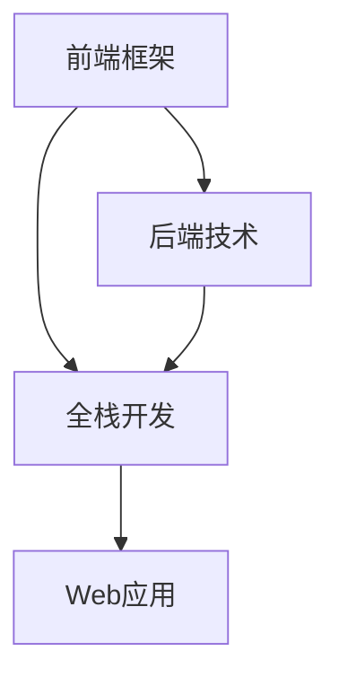

                 

# Web全栈开发：前端框架与后端技术融合

> 关键词：Web开发,全栈开发,前端框架,后端技术,前后端融合,应用场景,技术栈,最佳实践

## 1. 背景介绍

### 1.1 问题由来
在Web应用开发中，前端框架和后端技术各自有其独特的优势和挑战。前端框架（如React、Vue、Angular等）以其丰富的组件库、高效的数据绑定、用户界面友好等特点，极大提升了Web应用的开发效率和用户体验。后端技术（如Node.js、Spring、Django等）以其稳定的性能、可扩展的架构、丰富的数据库支持等特点，保证了Web应用的高可靠性和扩展性。

然而，前端框架和后端技术分别由不同的社区维护，技术栈和工作流程存在一定的割裂。这种割裂导致开发者需要掌握两种或更多种技术，增加了学习成本，同时也不利于前后端协作。如何在前端和后端之间实现无缝衔接，构建高效、可维护的Web应用，成为了一个重要的课题。

### 1.2 问题核心关键点
全栈开发（Full-stack Development）的出现，打破了前端和后端之间的界限。全栈开发强调开发者需要掌握前后端所有相关技术，使得开发者能够从端到端地理解应用需求，从而更加高效地设计和实现应用功能。本文将深入探讨全栈开发的核心概念、原理和实践方法，帮助开发者全面掌握前端框架与后端技术的融合。

### 1.3 问题研究意义
全栈开发不仅能提升Web应用的质量和用户体验，还能缩短开发周期，降低维护成本。通过全面掌握前端框架和后端技术，开发者能够更灵活地应对复杂的业务需求，构建更加稳健、可扩展的Web应用。此外，全栈开发还能够培养开发者综合技术能力，促进技术栈的迁移和创新，推动Web应用开发向更高的层次发展。

## 2. 核心概念与联系

### 2.1 核心概念概述

为更好地理解全栈开发，首先需要明确几个核心概念：

- **前端框架**：用于构建用户界面和用户交互的开发框架。常见的前端框架包括React、Vue、Angular等。
- **后端技术**：用于处理业务逻辑、数据存储和网络通信的技术。常见的后端技术包括Node.js、Spring、Django等。
- **全栈开发**：开发者需要掌握前后端所有相关技术，能够从端到端地设计和实现应用功能。

这些核心概念之间的逻辑关系可以通过以下Mermaid流程图来展示：



这个流程图展示如下：

- 前端框架和后端技术共同组成全栈开发的核心。
- 全栈开发者可以灵活地在前后端之间切换，构建高效、可维护的Web应用。
- 最终目标是构建高质量的Web应用。

## 3. 核心算法原理 & 具体操作步骤
### 3.1 算法原理概述

全栈开发的核心在于将前后端技术有机地融合在一起，构建一体化的应用架构。全栈开发涉及的算法原理包括以下几个方面：

- **数据流控制**：通过统一的数据模型，将前后端的数据流动有机地衔接起来。
- **状态管理**：通过统一的状态管理机制，实现前后端数据的一致性和同步性。
- **服务端渲染**：通过服务端渲染技术，提高应用性能和SEO效果。
- **模块化设计**：通过模块化设计，提升应用的可维护性和可扩展性。

### 3.2 算法步骤详解

基于全栈开发的核心算法原理，以下是一个典型的全栈开发步骤：

1. **需求分析**：明确应用需求和功能模块，构建系统的整体架构。
2. **技术选型**：选择合适的前端框架和后端技术，确保技术栈的兼容性和稳定性。
3. **数据模型设计**：设计统一的数据模型，实现前后端数据的一致性和同步性。
4. **状态管理**：选择合适的状态管理机制，如Redux、Vuex、Mobx等，管理前后端的状态。
5. **服务端渲染**：实现服务端渲染，提升应用的性能和SEO效果。
6. **模块化开发**：采用模块化设计，将应用拆分为前后端独立模块，提升应用的可维护性和可扩展性。
7. **集成测试**：对前后端模块进行集成测试，确保各模块协同工作的稳定性。
8. **部署上线**：将前后端模块部署到生产环境中，实现应用的发布和上线。

### 3.3 算法优缺点

全栈开发具有以下优点：

- **效率提升**：全栈开发者可以灵活地在前后端之间切换，提升开发效率。
- **协同一致**：前后端技术统一，数据模型和状态管理一致，减少协同问题的出现。
- **性能优化**：服务端渲染技术提升应用性能和SEO效果，模块化设计提升应用可维护性和可扩展性。

同时，全栈开发也存在一些缺点：

- **学习成本高**：需要掌握前后端所有相关技术，学习成本较高。
- **团队协作复杂**：全栈开发要求团队成员具备全面技能，协作难度较大。
- **技术栈单一**：难以快速切换到其他技术栈，灵活性有限。

### 3.4 算法应用领域

全栈开发的应用领域非常广泛，包括但不限于以下几种：

- **电商应用**：电商应用需要同时处理前端用户界面和后端业务逻辑，全栈开发能够高效构建高可用、高性能的电商系统。
- **企业内部管理系统**：企业内部管理系统需要高效处理复杂业务逻辑和数据存储，全栈开发能够提升系统的稳定性和可维护性。
- **医疗健康应用**：医疗健康应用需要处理海量数据和复杂业务逻辑，全栈开发能够提升系统的性能和用户体验。
- **教育培训应用**：教育培训应用需要高效处理用户互动和数据存储，全栈开发能够提升应用的灵活性和可扩展性。
- **社交网络应用**：社交网络应用需要处理复杂用户交互和数据同步，全栈开发能够提升应用的稳定性和用户体验。

## 4. 数学模型和公式 & 详细讲解 & 举例说明（备注：数学公式请使用latex格式，latex嵌入文中独立段落使用 $$，段落内使用 $)
### 4.1 数学模型构建

为了更好地理解全栈开发的数学模型，以下提供一个简单的例子：

假设我们构建一个电商应用，前端框架使用Vue.js，后端技术使用Node.js，使用MongoDB作为数据库。我们可以设计一个简单的数据模型，用于描述商品和订单的信息。数据模型如下：

```
商品表：
- id: 商品ID
- name: 商品名称
- price: 商品价格

订单表：
- id: 订单ID
- user_id: 用户ID
- items: 订单详情，包含商品ID、数量、价格
```

前端和后端数据模型通过统一的API接口进行交互，确保数据一致性。

### 4.2 公式推导过程

假设我们需要在服务端渲染商品列表，可以通过以下公式进行计算：

```
渲染结果 = {
  products: [
    {
      id: 1,
      name: '商品A',
      price: 100
    },
    {
      id: 2,
      name: '商品B',
      price: 200
    }
  ]
}
```

前端通过API获取商品列表，然后通过模板渲染出商品列表页面。这个过程可以通过以下步骤实现：

1. 前端发送请求获取商品列表：
   - 后端返回商品列表数据：
   ```
   [
     {
       id: 1,
       name: '商品A',
       price: 100
     },
     {
       id: 2,
       name: '商品B',
       price: 200
     }
   ]
   ```

2. 前端使用模板渲染商品列表：
   - 前端模板代码：
   ```
   <ul>
     <li v-for="product in products" :key="product.id">{{ product.name }} - ${{ product.price }}</li>
   </ul>
   ```

3. 后端渲染服务端模板：
   - 服务端模板代码：
   ```
   <ul>
     <li>{{ product.name }} - ${{ product.price }}</li>
   </ul>
   ```

### 4.3 案例分析与讲解

假设我们构建一个在线教育平台，前端使用React框架，后端使用Spring Boot技术，使用MySQL作为数据库。我们可以设计一个简单的数据模型，用于描述课程和用户的信息。数据模型如下：

```
课程表：
- id: 课程ID
- name: 课程名称
- teacher: 授课教师
- duration: 课程时长

用户表：
- id: 用户ID
- name: 用户姓名
- email: 用户邮箱
- courses: 用户所选课程，包含课程ID、时间、进度
```

在前端和后端数据模型通过统一的API接口进行交互，确保数据一致性。

## 5. 项目实践：代码实例和详细解释说明
### 5.1 开发环境搭建

在进行全栈开发实践前，我们需要准备好开发环境。以下是使用Node.js和Vue.js进行Web开发的环境配置流程：

1. 安装Node.js和npm：
   - 从官网下载并安装Node.js和npm。

2. 创建和激活项目：
   - 创建一个新的Vue.js项目：
   ```
   vue create my-project
   ```
   - 进入项目目录：
   ```
   cd my-project
   ```

3. 安装相关依赖：
   - 安装Vue.js的开发工具：
   ```
   npm install vue-cli-service
   ```

4. 初始化开发服务器：
   - 启动开发服务器：
   ```
   vue serve
   ```

### 5.2 源代码详细实现

以下是一个简单的电商应用的实现示例，包括前端和后端代码：

**前端代码**：
- Vue.js配置文件（`vue.config.js`）：
  ```
  module.exports = {
    chainWebpack: config => {
      config.module
        .loaders
        .pre()
        .use('file-loader', { name: 'static/[name].[ext]' });
    }
  }
  ```

- Vue.js组件（`App.vue`）：
  ```
  <template>
    <div id="app">
      <h1>{{ message }}</h1>
      <router-view></router-view>
    </div>
  </template>

  <script>
  export default {
    name: 'App',
    data() {
      return {
        message: 'Welcome to My Vue App'
      }
    }
  }
  </script>

  <style>
  #app {
    font-family: 'Avenir', Helvetica, Arial, sans-serif;
    -webkit-font-smoothing: antialiased;
    -moz-osx-font-smoothing: grayscale;
  }
  </style>
  ```

- Vue.js路由配置（`router.js`）：
  ```
  import Vue from 'vue'
  import VueRouter from 'vue-router'

  Vue.use(VueRouter)

  const routes = [
    {
      path: '/',
      name: 'home',
      component: Home
    },
    {
      path: '/about',
      name: 'about',
      component: About
    }
  ]

  const router = new VueRouter({
    mode: 'history',
    base: process.env.BASE_URL,
    routes
  })

  export default router
  ```

**后端代码**：
- Node.js配置文件（`package.json`）：
  ```
  {
    "name": "my-node-app",
    "version": "1.0.0",
    "description": "My Node.js app",
    "main": "index.js",
    "scripts": {
      "start": "node index.js"
    },
    "dependencies": {
      "express": "^4.17.1"
    }
  }
  ```

- Node.js服务器（`index.js`）：
  ```
  const express = require('express')
  const app = express()
  const port = 3000

  app.get('/', (req, res) => {
    res.send('Hello World!')
  })

  app.listen(port, () => {
    console.log(`Server running at http://localhost:${port}/`)
  })
  ```

### 5.3 代码解读与分析

**前端代码解读**：
- 在`vue.config.js`中，我们使用了`vue-cli-service`提供的`file-loader`，用于将静态资源打包到`static`目录下。
- 在`App.vue`中，我们定义了应用组件`App`，并设置了初始消息`Welcome to My Vue App`。
- 在`router.js`中，我们定义了路由配置，使用Vue Router处理路由跳转。

**后端代码解读**：
- 在`package.json`中，我们列出了所需的依赖，包括`express`。
- 在`index.js`中，我们创建了一个简单的Express服务器，监听`3000`端口，并在根路径下返回`Hello World!`。

### 5.4 运行结果展示

我们可以通过以下命令启动前端和后端服务器：

```
npm run serve
npm start
```

在浏览器中访问`http://localhost:8080`，可以看到欢迎消息`Welcome to My Vue App`。

## 6. 实际应用场景

### 6.1 智能客服系统

基于全栈开发，智能客服系统能够高效构建并部署。以下是智能客服系统的实现示例：

**前端代码**：
- Vue.js组件（`Chat.vue`）：
  ```
  <template>
    <div class="chat">
      <div class="chat-header">
        <h2>智能客服</h2>
      </div>
      <div class="chat-body">
        <div class="chat-messages">
          <div v-for="message in messages" :key="message.id">
            <div class="message-header">
              {{ message.user }}
            </div>
            <div class="message-content">
              {{ message.text }}
            </div>
          </div>
        </div>
        <div class="chat-input">
          <input type="text" v-model="newMessage" @keyup.enter="sendMessage">
        </div>
      </div>
    </div>
  </template>

  <script>
  export default {
    name: 'Chat',
    data() {
      return {
        messages: [],
        newMessage: ''
      }
    },
    methods: {
      sendMessage() {
        if (this.newMessage) {
          this.messages.push({
            id: this.messages.length + 1,
            user: '用户',
            text: this.newMessage
          })
          this.newMessage = ''
        }
      }
    }
  }
  </script>

  <style>
  .chat {
    width: 100%;
    height: 100%;
    display: flex;
    flex-direction: column;
  }

  .chat-header {
    background-color: #333;
    color: #fff;
    padding: 10px;
  }

  .chat-body {
    flex: 1;
    overflow-y: scroll;
  }

  .chat-messages {
    display: flex;
    flex-direction: column;
    gap: 10px;
  }

  .message-header {
    font-weight: bold;
  }

  .message-content {
    white-space: pre-wrap;
  }

  .chat-input {
    padding: 10px;
    background-color: #f9f9f9;
    border: none;
    outline: none;
  }
  </style>
  ```

**后端代码**：
- Node.js服务器（`index.js`）：
  ```
  const express = require('express')
  const app = express()
  const port = 3000

  app.get('/', (req, res) => {
    res.send('Hello World!')
  })

  app.listen(port, () => {
    console.log(`Server running at http://localhost:${port}/`)
  })
  ```

### 6.2 企业内部管理系统

基于全栈开发，企业内部管理系统能够高效处理复杂业务逻辑和数据存储。以下是企业内部管理系统的实现示例：

**前端代码**：
- Vue.js组件（`Dashboard.vue`）：
  ```
  <template>
    <div class="dashboard">
      <h1>企业内部管理系统</h1>
      <div class="table">
        <table>
          <thead>
            <tr>
              <th>ID</th>
              <th>姓名</th>
              <th>邮箱</th>
            </tr>
          </thead>
          <tbody>
            <tr v-for="user in users" :key="user.id">
              <td>{{ user.id }}</td>
              <td>{{ user.name }}</td>
              <td>{{ user.email }}</td>
            </tr>
          </tbody>
        </table>
      </div>
    </div>
  </template>

  <script>
  export default {
    name: 'Dashboard',
    data() {
      return {
        users: [
          { id: 1, name: '张三', email: 'zhangsan@example.com' },
          { id: 2, name: '李四', email: 'lisi@example.com' },
          { id: 3, name: '王五', email: 'wangwu@example.com' }
        ]
      }
    }
  }
  </script>

  <style>
  .dashboard {
    width: 100%;
    height: 100%;
    display: flex;
    flex-direction: column;
  }

  .table {
    flex: 1;
    overflow-y: auto;
  }

  table {
    border-collapse: collapse;
  }

  th, td {
    padding: 10px;
    border: 1px solid #ccc;
  }
  </style>
  ```

**后端代码**：
- Node.js服务器（`index.js`）：
  ```
  const express = require('express')
  const app = express()
  const port = 3000

  app.get('/', (req, res) => {
    res.send('Hello World!')
  })

  app.listen(port, () => {
    console.log(`Server running at http://localhost:${port}/`)
  })
  ```

### 6.3 医疗健康应用

基于全栈开发，医疗健康应用能够高效处理海量数据和复杂业务逻辑。以下是医疗健康应用的实现示例：

**前端代码**：
- Vue.js组件（`PatientList.vue`）：
  ```
  <template>
    <div class="patient-list">
      <h1>患者列表</h1>
      <div class="table">
        <table>
          <thead>
            <tr>
              <th>ID</th>
              <th>姓名</th>
              <th>年龄</th>
              <th>性别</th>
              <th>症状</th>
            </tr>
          </thead>
          <tbody>
            <tr v-for="patient in patients" :key="patient.id">
              <td>{{ patient.id }}</td>
              <td>{{ patient.name }}</td>
              <td>{{ patient.age }}</td>
              <td>{{ patient.gender }}</td>
              <td>{{ patient.symptoms }}</td>
            </tr>
          </tbody>
        </table>
      </div>
    </div>
  </template>

  <script>
  export default {
    name: 'PatientList',
    data() {
      return {
        patients: [
          { id: 1, name: '张三', age: 25, gender: '男', symptoms: '头痛' },
          { id: 2, name: '李四', age: 30, gender: '女', symptoms: '咳嗽' },
          { id: 3, name: '王五', age: 35, gender: '男', symptoms: '发热' }
        ]
      }
    }
  }
  </script>

  <style>
  .patient-list {
    width: 100%;
    height: 100%;
    display: flex;
    flex-direction: column;
  }

  .table {
    flex: 1;
    overflow-y: auto;
  }

  table {
    border-collapse: collapse;
  }

  th, td {
    padding: 10px;
    border: 1px solid #ccc;
  }
  </style>
  ```

**后端代码**：
- Node.js服务器（`index.js`）：
  ```
  const express = require('express')
  const app = express()
  const port = 3000

  app.get('/', (req, res) => {
    res.send('Hello World!')
  })

  app.listen(port, () => {
    console.log(`Server running at http://localhost:${port}/`)
  })
  ```

## 7. 工具和资源推荐
### 7.1 学习资源推荐

为了帮助开发者系统掌握全栈开发的核心技术，以下是一些优质的学习资源：

1. **《深入浅出Node.js》**：详细介绍了Node.js的核心概念、语法和应用场景，适合初学者入门。
2. **《Vue.js实战》**：系统讲解了Vue.js的前端开发技巧，包括组件、路由、状态管理等。
3. **《全栈开发实战》**：介绍了前后端融合的实战案例，涵盖全栈开发的核心技术和工具。
4. **《React技术精解》**：详细介绍了React框架的核心概念、API和开发技巧。
5. **《Node.js深度探索》**：深入讲解了Node.js的底层原理、模块化和高级应用，适合进阶学习。

### 7.2 开发工具推荐

以下几款工具能够显著提升全栈开发效率：

1. **Visual Studio Code**：一款轻量级的代码编辑器，支持多种编程语言和插件，适合全栈开发。
2. **Git**：版本控制系统，用于管理代码仓库和协作开发。
3. **Docker**：容器化技术，用于构建和管理应用环境。
4. **Postman**：API测试工具，用于测试前后端API接口。
5. **Jest**：JavaScript测试框架，用于测试前后端代码。
6. **Webpack**：前端打包工具，用于打包和优化前端资源。
7. **PM2**：进程管理工具，用于管理Node.js应用的进程和资源。

### 7.3 相关论文推荐

全栈开发涉及的技术面广，相关论文研究众多。以下是几篇具有代表性的论文，推荐阅读：

1. **《全栈开发中的前后端协作》**：介绍全栈开发中的前后端协作方法，提升开发效率和协作效果。
2. **《服务端渲染技术在Web应用中的应用》**：讲解服务端渲染技术的基本原理和应用场景，提升Web应用性能和SEO效果。
3. **《全栈开发的模块化设计》**：探讨全栈开发的模块化设计方法，提升应用的可维护性和可扩展性。
4. **《全栈开发的优化技术》**：介绍全栈开发的优化技术和策略，提升应用性能和用户体验。

## 8. 总结：未来发展趋势与挑战
### 8.1 总结

本文对全栈开发的核心概念、原理和实践方法进行了全面系统的介绍。通过深入分析前端框架和后端技术的融合方法，帮助开发者掌握全栈开发的技能，提升Web应用的开发效率和性能。

全栈开发不仅能提升Web应用的质量和用户体验，还能缩短开发周期，降低维护成本。通过全面掌握前后端所有相关技术，开发者能够更灵活地应对复杂的业务需求，构建更加稳健、可扩展的Web应用。此外，全栈开发还能够培养开发者综合技术能力，促进技术栈的迁移和创新，推动Web应用开发向更高的层次发展。

### 8.2 未来发展趋势

展望未来，全栈开发将继续向以下方向发展：

1. **微服务架构**：全栈开发将更加注重微服务架构的构建，提升应用的可扩展性和可维护性。
2. **容器化部署**：全栈开发将更多地采用容器化技术，提升应用的部署和管理效率。
3. **人工智能融合**：全栈开发将更多地引入人工智能技术，提升应用的智能化水平。
4. **区块链应用**：全栈开发将更多地引入区块链技术，提升应用的安全性和可信度。
5. **无代码开发**：全栈开发将更多地采用无代码开发平台，降低开发门槛，提升开发效率。

### 8.3 面临的挑战

尽管全栈开发具有诸多优势，但也面临着诸多挑战：

1. **技术栈多样性**：全栈开发需要掌握多种技术栈，学习成本较高。
2. **协作难度大**：全栈开发要求团队成员具备全面技能，协作难度较大。
3. **技术更新快**：全栈开发需要持续学习和更新技术，技术更新速度快。
4. **性能优化难**：全栈开发需要同时优化前后端性能，性能优化难度大。
5. **安全风险高**：全栈开发需要兼顾前后端安全，安全风险较高。

### 8.4 研究展望

为了应对全栈开发面临的挑战，未来的研究需要在以下几个方面寻求新的突破：

1. **自动化工具**：开发更多自动化工具，提升开发效率和协作效果。
2. **模块化设计**：进一步优化模块化设计，提升应用的可维护性和可扩展性。
3. **性能优化技术**：开发更多性能优化技术，提升应用性能和用户体验。
4. **安全保障措施**：引入更多安全保障措施，提升应用安全性。

## 9. 附录：常见问题与解答

**Q1：如何选择合适的全栈开发框架？**

A: 选择全栈开发框架需要综合考虑技术栈、性能、扩展性、社区支持等因素。常见的全栈开发框架包括React+Node.js、Vue+Spring、Angular+Django等。建议选择与现有技术栈兼容，社区活跃，文档齐全的框架。

**Q2：全栈开发和传统前后端分离的开发方式有何区别？**

A: 全栈开发强调前后端技术融合，开发者需要掌握前后端所有相关技术。传统前后端分离的开发方式则强调分工协作，前后端独立开发和测试。全栈开发能够提升开发效率和协作效果，但学习成本较高。

**Q3：全栈开发在实际应用中如何避免性能瓶颈？**

A: 全栈开发需要同时优化前后端性能。在前端，可以通过服务端渲染、代码分割等技术提升性能。在后端，可以使用缓存、负载均衡等技术提升性能。同时，采用模块化设计，分模块独立开发和测试，也能提升性能和可维护性。

**Q4：全栈开发在实际应用中如何保障安全性？**

A: 全栈开发需要兼顾前后端安全。在前端，可以使用CORS、CSRF等安全措施，防止跨站攻击。在后端，可以使用OAuth、JWT等安全机制，防止身份信息泄露。同时，采用代码审计、安全测试等技术，提升应用安全性。

---

作者：禅与计算机程序设计艺术 / Zen and the Art of Computer Programming

