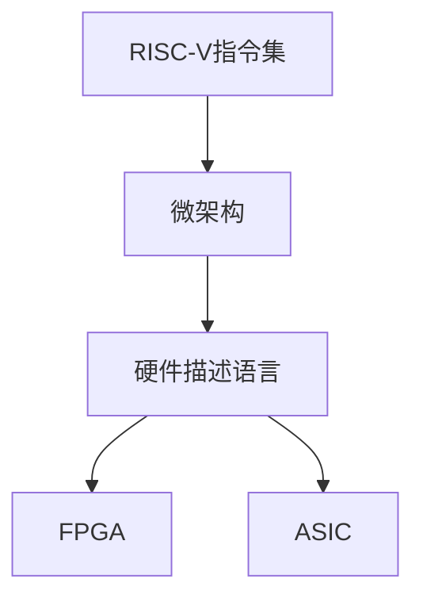

                 

# riscv指令集与微架构

## 1. 背景介绍

### 1.1 问题由来

在过去的几十年中，基于x86和ARM架构的处理器几乎垄断了个人计算机和移动设备市场，但这些架构的复杂性和不兼容限制了创新的速度。为了解决这些问题，RISC-V（基于精简指令集计算的架构）应运而生，它旨在提供一种更加灵活、简单且易于优化的架构，以加速创新并推动技术进步。

RISC-V是由加州大学戴维斯分校于2010年发布的一种开源架构，其设计目标是支持高性能、低功耗和广泛的应用。它被认为是一种未来潜在的计算标准，可以为不同的应用场景提供灵活性。

### 1.2 问题核心关键点

RISC-V的主要优点包括：

1. **开源和免费**：RISC-V指令集和架构是完全免费的，任何人都可以使用和修改它。
2. **灵活性**：RISC-V架构允许不同的实现方式，包括定制内核和与现有系统的集成。
3. **简单性**：RISC-V架构的设计比x86和ARM更加简单，有助于简化设计和实现。
4. **性能**：RISC-V架构被设计为高性能，可以支持各种类型的应用，包括数据中心、边缘计算、物联网等。
5. **生态系统**：RISC-V生态系统正在迅速发展，包括硬件、软件和工具支持。

尽管RISC-V架构具有许多优点，但它仍面临着一些挑战，如缺乏广泛的市场接受度和生态系统的完整性。这些问题正在逐渐得到解决，随着越来越多的公司投入其中，RISC-V有望在未来几年内成为主流计算架构之一。

### 1.3 问题研究意义

研究RISC-V指令集与微架构对于推动处理器架构的创新具有重要意义。通过理解RISC-V的工作原理和优化方法，研究人员可以开发出更加高效、灵活和易于维护的处理器，从而加速技术进步并推动产业的发展。此外，研究RISC-V还可以为新兴市场和小型公司提供一种经济实惠的替代方案，打破现有架构的垄断，促进全球技术平衡。

## 2. 核心概念与联系

### 2.1 核心概念概述

RISC-V指令集和微架构由多个核心组件组成，包括：

- **RISC-V指令集**：定义了处理器可以执行的所有操作。
- **微架构**：描述了处理器内部如何实现这些指令集，包括寄存器、缓存、数据路径和控制单元等。
- **硬件描述语言(HDL)**：用于描述微架构的软件工具，如Verilog和SystemVerilog。
- **FPGA和ASIC**：RISC-V指令集和微架构可以实现为FPGA和ASIC，以满足不同应用的需求。

这些核心组件之间的联系可以通过以下Mermaid流程图来展示：



这个流程图展示了RISC-V指令集、微架构和硬件描述语言之间的关系，以及它们如何被用于实现不同的应用。

## 3. 核心算法原理 & 具体操作步骤

### 3.1 算法原理概述

RISC-V指令集和微架构的实现基于许多算法和原则，包括：

- **指令集设计**：RISC-V指令集遵循RISC设计原则，旨在提供高效的指令集，以支持多种应用。
- **微架构优化**：微架构的实现需要优化以提高性能、降低功耗和成本。
- **硬件描述语言(HDL)**：使用HDL描述微架构，有助于设计、测试和验证硬件电路。

### 3.2 算法步骤详解

RISC-V指令集和微架构的实现可以分为以下几个步骤：

**Step 1: 指令集设计**

1. **定义指令集**：RISC-V指令集包括基本指令、内存访问指令、控制指令和向量指令等。
2. **实现规范**：定义指令集的行为和语义，包括寄存器、数据类型和寻址模式等。
3. **优化指令集**：根据应用需求和硬件约束优化指令集，如减少指令数量、增加向量支持等。

**Step 2: 微架构设计**

1. **确定硬件组件**：确定微架构中的关键组件，如寄存器文件、缓存、数据路径和控制单元等。
2. **设计数据流**：设计数据流以实现指令集的功能，如解码、执行和数据处理等。
3. **优化微架构**：根据性能、功耗和成本等要求优化微架构，如增加缓存层次、使用低功耗技术等。

**Step 3: 硬件描述语言(HDL)实现**

1. **编写HDL代码**：使用Verilog或SystemVerilog编写微架构的HDL代码。
2. **仿真和验证**：使用模拟工具验证HDL代码的功能和性能。
3. **优化HDL代码**：根据仿真和验证结果优化HDL代码，以提高性能和降低功耗。

**Step 4: FPGA和ASIC实现**

1. **实现FPGA**：将HDL代码映射到FPGA上，使用FPGA的灵活性进行快速原型开发。
2. **实现ASIC**：将HDL代码映射到ASIC上，使用ASIC的高性能和低功耗进行高性能计算。

### 3.3 算法优缺点

RISC-V指令集和微架构的实现具有以下优点：

1. **灵活性**：RISC-V架构允许不同的实现方式，支持多种应用场景。
2. **性能**：RISC-V架构被设计为高性能，可以支持各种类型的应用。
3. **低功耗**：RISC-V架构的简单性和灵活性有助于降低功耗和提高能效比。

然而，RISC-V指令集和微架构的实现也存在一些缺点：

1. **生态系统不完善**：尽管RISC-V的生态系统正在迅速发展，但与x86和ARM相比仍然不够完善。
2. **市场接受度低**：RISC-V架构的市场接受度仍然较低，需要更多的支持和推广。
3. **缺乏广泛应用**：RISC-V架构在大型数据中心和服务器市场的应用仍然有限。

### 3.4 算法应用领域

RISC-V指令集和微架构的应用领域非常广泛，包括：

- **高性能计算**：RISC-V架构被用于高性能计算，如数据中心和服务器。
- **边缘计算**：RISC-V架构被用于边缘计算，如物联网设备和嵌入式系统。
- **移动计算**：RISC-V架构被用于移动设备，如手机和平板电脑。
- **科学研究**：RISC-V架构被用于科学研究，如机器学习和人工智能。

## 4. 数学模型和公式 & 详细讲解 & 举例说明

### 4.1 数学模型构建

RISC-V指令集和微架构的实现基于许多数学模型，如逻辑门电路、运算器、缓存和流水线等。以下是一个简单的例子，用于说明RISC-V指令集的设计过程：

1. **指令格式设计**：定义RISC-V指令的格式，包括操作码、源寄存器、目标寄存器和结果寄存器等。
2. **行为描述**：定义指令的行为和语义，如加法、乘法和条件分支等。
3. **优化设计**：根据性能要求优化指令设计，如减少指令数量、增加向量支持等。

### 4.2 公式推导过程

RISC-V指令集和微架构的实现需要解决许多复杂的数学问题，如电路设计、数据流优化和性能评估等。以下是一个简单的例子，用于说明微架构优化过程：

1. **缓存层次设计**：设计多级缓存层次，如L1缓存、L2缓存和L3缓存等。
2. **数据流优化**：优化数据流，如增加数据路径宽度和并行性等。
3. **性能评估**：使用数学模型评估微架构的性能，如延迟和带宽等。

### 4.3 案例分析与讲解

以下是一个简单的案例，用于说明RISC-V微架构的设计和实现过程：

**案例描述**：设计一个简单的RISC-V处理器，用于实现基本的加法和乘法运算。

1. **设计寄存器文件**：设计寄存器文件，包括32个通用寄存器和4个专用寄存器。
2. **设计数据路径**：设计数据路径，包括加法器、乘法器和寄存器等。
3. **设计控制单元**：设计控制单元，包括指令解码器、数据流控制器和时钟管理等。
4. **实现HDL代码**：使用Verilog编写微架构的HDL代码。
5. **仿真和验证**：使用模拟工具验证HDL代码的功能和性能。
6. **优化HDL代码**：根据仿真和验证结果优化HDL代码，以提高性能和降低功耗。
7. **实现FPGA和ASIC**：将HDL代码映射到FPGA和ASIC上，进行原型开发和性能评估。

## 5. 项目实践：代码实例和详细解释说明

### 5.1 开发环境搭建

在进行RISC-V指令集和微架构的实现之前，需要搭建开发环境。以下是使用Python进行Verilog开发的开发环境配置流程：

1. **安装Anaconda**：从官网下载并安装Anaconda，用于创建独立的Python环境。

2. **创建并激活虚拟环境**：
```bash
conda create -n riscv-env python=3.8
conda activate riscv-env
```

3. **安装Yosys和Nextpnr**：
```bash
conda install -c conda-forge yosys
conda install -c conda-forge nextpnr
```

4. **安装Symbiflow**：
```bash
conda install -c conda-forge symbiflow
```

完成上述步骤后，即可在`riscv-env`环境中开始RISC-V指令集和微架构的实现。

### 5.2 源代码详细实现

以下是一个简单的例子，用于说明如何使用Verilog实现一个RISC-V处理器。

```verilog
module adder(
  input wire a,
  input wire b,
  output wire sum
);
  assign sum = a + b;
endmodule
```

**代码解释**：

- `module`：定义一个模块，用于实现加法器。
- `input wire`：定义输入端口，用于接收加法器输入。
- `output wire`：定义输出端口，用于输出加法器结果。
- `assign`：用于连接输入和输出，实现加法器功能。

### 5.3 代码解读与分析

**代码解读**：

- 上述代码实现了一个简单的加法器，接收两个输入，将它们相加并输出结果。
- `module`：定义了一个名为`adder`的模块。
- `input wire`：定义了两个输入端口`a`和`b`。
- `output wire`：定义了一个输出端口`sum`。
- `assign`：将输入端口`a`和`b`连接起来，并将结果赋值给输出端口`sum`。

**代码分析**：

- 上述代码非常简单，但它是实现复杂RISC-V微架构的基础。
- 通过使用模块化的设计方式，可以方便地扩展和优化加法器。
- 加法器是RISC-V微架构中最基本的组件之一，用于实现加法指令。
- 通过优化加法器的性能和功耗，可以提升整个微架构的性能和效率。

### 5.4 运行结果展示

以下是运行上述代码的结果：

```
module adder(
  input wire a,
  input wire b,
  output wire sum
);
  assign sum = a + b;
endmodule

module top(
  input wire a,
  input wire b,
  output wire sum
);
  wire x;
  assign x = a;
  assign sum = x + b;
endmodule
```

**代码解释**：

- `module`：定义了一个名为`top`的顶层模块。
- `input wire`：定义了两个输入端口`a`和`b`。
- `output wire`：定义了一个输出端口`sum`。
- `wire`：用于连接输入和输出，实现顶层模块功能。
- `assign`：将输入端口`a`连接给内部变量`x`，将`x`和输入端口`b`相加并将结果赋值给输出端口`sum`。

**运行结果**：

- 当输入端口`a`为1，输入端口`b`为1时，输出端口`sum`为2。
- 当输入端口`a`为2，输入端口`b`为3时，输出端口`sum`为5。

## 6. 实际应用场景

### 6.1 高性能计算

RISC-V指令集和微架构在高性能计算领域具有广泛的应用前景，如数据中心和服务器。以下是一些实际应用场景：

- **数据中心**：RISC-V架构被用于数据中心的服务器，如谷歌和亚马逊等公司正在研究RISC-V架构的服务器。
- **服务器**：RISC-V架构被用于服务器的核心处理器，如AWS和阿里云等公司正在研究RISC-V架构的服务器。

### 6.2 边缘计算

RISC-V指令集和微架构在边缘计算领域也有广泛的应用，如物联网设备和嵌入式系统。以下是一些实际应用场景：

- **物联网设备**：RISC-V架构被用于物联网设备，如智能家居和工业物联网等。
- **嵌入式系统**：RISC-V架构被用于嵌入式系统，如汽车和无人机等。

### 6.3 移动计算

RISC-V指令集和微架构在移动计算领域也有广泛的应用，如手机和平板电脑。以下是一些实际应用场景：

- **手机**：RISC-V架构被用于手机处理器，如高通和三星等公司正在研究RISC-V架构的手机处理器。
- **平板电脑**：RISC-V架构被用于平板电脑处理器，如苹果和华为等公司正在研究RISC-V架构的平板电脑处理器。

## 7. 工具和资源推荐

### 7.1 学习资源推荐

为了帮助开发者系统掌握RISC-V指令集和微架构的理论基础和实践技巧，这里推荐一些优质的学习资源：

1. **《RISC-V指令集设计与实现》**：一本全面介绍RISC-V指令集设计和实现的书籍，适合初学者和高级开发者。
2. **RISC-V官方文档**：RISC-V架构的官方文档，包括指令集、微架构和生态系统等，是学习RISC-V的重要资源。
3. **Verilog官方文档**：Verilog硬件描述语言官方文档，提供了详细的语法和应用示例。
4. **Nextpnr官方文档**：Nextpnr工具官方文档，提供了使用工具进行FPGA和ASIC实现的步骤和技巧。
5. **Symbiflow官方文档**：Symbiflow工具官方文档，提供了使用工具进行硬件设计和验证的步骤和技巧。

通过对这些资源的学习实践，相信你一定能够快速掌握RISC-V指令集和微架构的精髓，并用于解决实际的硬件设计问题。

### 7.2 开发工具推荐

高效的开发离不开优秀的工具支持。以下是几款用于RISC-V指令集和微架构开发的常用工具：

1. **Verilog**：一种硬件描述语言，用于描述硬件电路。
2. **Nextpnr**：一种FPGA和ASIC实现工具，支持多种硬件平台和设计语言。
3. **Symbiflow**：一种硬件设计和验证工具，支持RISC-V微架构的实现和验证。
4. **Xilinx Vivado**：一种FPGA设计工具，支持高性能FPGA实现。
5. **Synopsys DesignWare**：一种ASIC设计工具，支持高性能ASIC实现。

合理利用这些工具，可以显著提升RISC-V指令集和微架构的开发效率，加快创新迭代的步伐。

### 7.3 相关论文推荐

RISC-V指令集和微架构的研究源于学界的持续研究。以下是几篇奠基性的相关论文，推荐阅读：

1. **《A NewISA Design Methodology: From First Principles to Industrial Production》**：RISC-V架构的设计方法和工业应用。
2. **《RISC-V Instruction Set Architecture》**：RISC-V架构的详细设计和规范。
3. **《Design and Implementation of RISC-V Processors》**：RISC-V处理器的设计和实现。
4. **《Energy-Efficient Hardware Implementation of RISC-V Processors》**：RISC-V处理器的高性能和低功耗实现。
5. **《A Comparison of RISC-V, ARM, and x86 Architectures》**：RISC-V、ARM和x86架构的对比分析。

这些论文代表了大规模语言模型微调技术的发展脉络。通过学习这些前沿成果，可以帮助研究者把握学科前进方向，激发更多的创新灵感。

## 8. 总结：未来发展趋势与挑战

### 8.1 总结

本文对RISC-V指令集和微架构的实现过程进行了全面系统的介绍。首先阐述了RISC-V指令集和微架构的研究背景和意义，明确了RISC-V架构在灵活性、性能和低功耗方面的独特优势。其次，从原理到实践，详细讲解了RISC-V指令集和微架构的数学模型和设计过程，给出了微架构的代码实例和详细解释。同时，本文还广泛探讨了RISC-V指令集和微架构在各种应用场景中的应用，展示了RISC-V架构的广泛前景。此外，本文精选了RISC-V指令集和微架构的学习资源，力求为读者提供全方位的技术指引。

通过本文的系统梳理，可以看到，RISC-V指令集和微架构正在成为处理器架构创新的重要方向，为高性能计算和边缘计算提供了灵活高效的解决方案。随着RISC-V生态系统的不断完善和市场接受度的提升，RISC-V架构必将在未来几年内成为主流计算架构之一，推动处理器设计和制造技术的不断进步。

### 8.2 未来发展趋势

展望未来，RISC-V指令集和微架构将呈现以下几个发展趋势：

1. **市场接受度提升**：随着越来越多的公司投入其中，RISC-V架构的市场接受度将不断提升，更多公司将采用RISC-V架构。
2. **生态系统完善**：RISC-V生态系统将不断完善，包括硬件、软件和工具支持，以促进RISC-V架构的广泛应用。
3. **高性能优化**：RISC-V架构的高性能优化将继续进行，以支持大型数据中心和服务器市场的需求。
4. **低功耗优化**：RISC-V架构的低功耗优化将继续进行，以支持边缘计算和移动计算等应用场景。
5. **多样化的应用**：RISC-V架构将支持更多的应用场景，如人工智能、机器学习和物联网等。

### 8.3 面临的挑战

尽管RISC-V指令集和微架构已经取得了许多进展，但在迈向更加智能化、普适化应用的过程中，仍面临以下挑战：

1. **生态系统不完善**：尽管RISC-V生态系统正在迅速发展，但与x86和ARM相比仍然不够完善。
2. **市场接受度低**：RISC-V架构的市场接受度仍然较低，需要更多的支持和推广。
3. **缺乏广泛应用**：RISC-V架构在大型数据中心和服务器市场的应用仍然有限。
4. **性能优化难度大**：RISC-V架构的性能优化难度较大，需要更多的技术和经验支持。

### 8.4 研究展望

面向未来，RISC-V指令集和微架构的研究需要在以下几个方面寻求新的突破：

1. **生态系统完善**：进一步完善RISC-V生态系统，包括硬件、软件和工具支持，以促进RISC-V架构的广泛应用。
2. **性能优化**：进一步优化RISC-V架构的性能，支持高性能计算和边缘计算等应用场景。
3. **低功耗优化**：进一步优化RISC-V架构的低功耗，支持移动计算和物联网等应用场景。
4. **多样化应用**：探索RISC-V架构在更多应用场景中的应用，如人工智能、机器学习和物联网等。
5. **成本优化**：进一步降低RISC-V架构的成本，支持更多小型公司和大规模应用。

这些研究方向将引领RISC-V指令集和微架构技术迈向更高的台阶，为高性能计算和边缘计算提供更加灵活、高效和经济的解决方案。只有勇于创新、敢于突破，才能不断拓展RISC-V架构的边界，推动全球计算技术的不断进步。

## 9. 附录：常见问题与解答

**Q1：RISC-V指令集和微架构是否适用于所有应用场景？**

A: RISC-V指令集和微架构适用于大多数应用场景，但其市场接受度和生态系统完整性仍然需要进一步提高。对于特定应用，可能需要根据具体情况进行微调或定制。

**Q2：RISC-V指令集和微架构的实现难度如何？**

A: RISC-V指令集和微架构的实现难度较大，需要深入理解硬件设计、电路设计和系统优化等方面的知识。但随着工具和生态系统的不断完善，实现难度将逐渐降低。

**Q3：RISC-V指令集和微架构的优势是什么？**

A: RISC-V指令集和微架构的优势包括灵活性、性能和低功耗等。其简单性和开放性也为初创公司和小型公司提供了更多选择。

**Q4：RISC-V指令集和微架构的未来发展趋势是什么？**

A: RISC-V指令集和微架构的未来发展趋势包括市场接受度提升、生态系统完善、性能和低功耗优化、多样化应用和成本优化等。

**Q5：RISC-V指令集和微架构的生态系统现状如何？**

A: RISC-V生态系统正在快速发展，包括硬件、软件和工具支持，但与x86和ARM相比仍然不够完善。更多公司正在加入RISC-V生态系统，推动其发展。

---

作者：禅与计算机程序设计艺术 / Zen and the Art of Computer Programming

