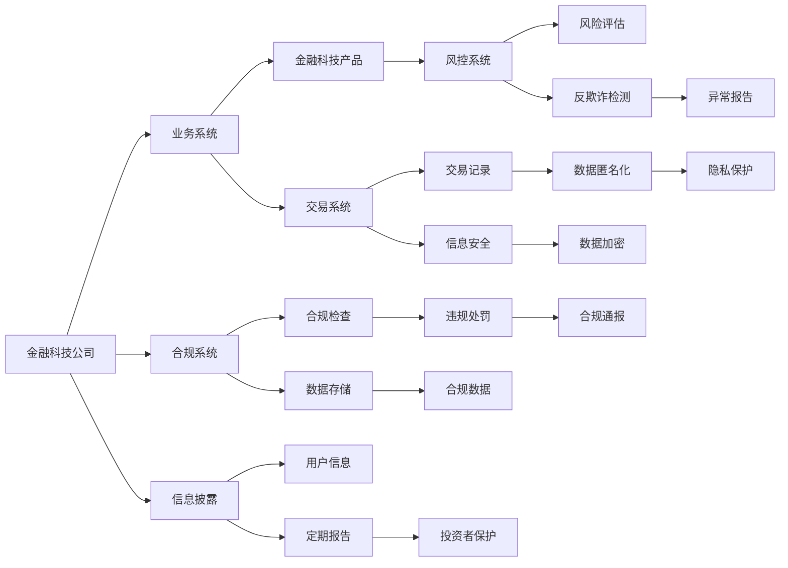

                 

# 中国金融科技的监管：PerplexFreqencyCTO 解读合规与创新

金融科技（FinTech）是近年来随着科技进步和金融创新不断发展的新型领域，它将传统金融与科技紧密结合，推动了金融服务的数字化、智能化和普惠化。然而，金融科技的快速发展也带来了新的监管挑战。如何在保障金融安全与促进创新之间找到平衡，成为全球金融监管机构和从业者共同关注的焦点。本文将从监管的视角出发，分析中国金融科技的监管现状与趋势，探讨合规与创新的平衡之道。

## 1. 背景介绍

### 1.1 中国金融科技发展的背景

中国金融科技的发展得益于政策支持、市场需求和科技创新的三大驱动力。近年来，随着互联网、大数据、人工智能等技术的飞速发展，中国的金融科技进入快速发展期，移动支付、数字货币、区块链等创新产品和服务层出不穷。特别是在普惠金融、小微企业金融服务、跨境支付等领域，金融科技的创新应用极大地提升了金融服务的覆盖面和效率。

### 1.2 中国金融科技监管的现状

金融科技的快速发展，对现有金融监管体系提出了严峻挑战。为了应对这些挑战，中国监管机构积极调整监管思路，采取了一系列政策措施，包括但不限于：

- **加强顶层设计**：出台《关于规范金融科技创新发展的指导意见》等政策文件，明确监管原则和方向。
- **实施穿透式监管**：对金融科技公司进行分业监管，确保其业务活动符合金融法律法规。
- **强化信息披露和风险提示**：要求金融科技公司加强对用户的信息披露，定期发布风险提示，保护投资者权益。
- **推动行业自律**：鼓励金融科技企业加强内部管理，提升合规水平。

## 2. 核心概念与联系

### 2.1 核心概念概述

- **金融科技（FinTech）**：指应用科技手段创新金融产品和服务，提升金融效率和用户体验的过程。
- **金融监管**：指政府或监管机构对金融市场和金融机构的监管活动，旨在保护投资者权益、维护金融稳定。
- **合规与创新**：金融科技的监管核心在于如何在保障合规性的前提下，促进金融科技的持续创新。
- **穿透式监管**：指穿透至金融科技公司背后的金融机构，确保所有业务活动符合金融法律法规。
- **信息披露**：指金融科技公司定期发布运营情况、风险提示等，保障投资者知情权。

### 2.2 核心概念原理和架构的 Mermaid 流程图



这个流程图展示了金融科技公司的业务系统、合规系统、风控系统、信息披露和数据管理等核心组件，以及它们之间的关系。金融科技公司的业务系统（A）产生金融科技产品（C），而这些产品需要符合合规要求（D）、交易数据需要保障安全（P）、风险评估（H）和数据匿名化（R）等措施，以保护用户隐私（S）。同时，信息披露（J）和违规处罚（N）也是监管的重要组成部分。

## 3. 核心算法原理 & 具体操作步骤

### 3.1 算法原理概述

中国金融科技的监管主要依赖于以下几个核心算法和原理：

- **风险评估算法**：通过对金融科技公司的交易记录、风控数据等进行建模，评估其业务风险。
- **信息披露算法**：根据合规要求，定期生成和发布信息披露报告，保障投资者权益。
- **穿透式监管算法**：对金融科技公司背后的金融机构进行穿透监管，确保业务合规。
- **反欺诈检测算法**：通过机器学习、大数据分析等技术，检测和预防欺诈行为。

### 3.2 算法步骤详解

以下详细介绍各算法的详细步骤：

#### 3.2.1 风险评估算法

**步骤1：数据采集**  
收集金融科技公司的交易记录、用户行为数据、风控数据等，建立数据仓库。

**步骤2：特征工程**  
对采集到的数据进行特征提取，包括但不限于交易金额、交易频率、交易地点、用户行为模式等。

**步骤3：模型训练**  
使用机器学习模型（如随机森林、XGBoost、神经网络等）对数据进行建模，评估金融科技公司的风险水平。

**步骤4：风险预警**  
根据模型预测结果，设置风险预警阈值，对高风险业务进行及时干预或禁止。

#### 3.2.2 信息披露算法

**步骤1：信息收集**  
收集金融科技公司的运营数据、财务数据、风险提示等，建立信息披露数据库。

**步骤2：数据处理**  
对收集到的数据进行清洗和处理，确保数据的准确性和完整性。

**步骤3：信息生成**  
根据信息披露规则，生成定期报告，包括运营情况、风险提示等。

**步骤4：信息发布**  
将生成的报告通过官方网站、社交媒体等渠道发布，确保投资者知情权。

#### 3.2.3 穿透式监管算法

**步骤1：数据采集**  
收集金融科技公司背后金融机构的相关信息，如许可证、业务范围、股东背景等。

**步骤2：数据匹配**  
将金融科技公司的业务数据与背后的金融机构进行匹配，确保所有业务活动符合法律法规。

**步骤3：合规检查**  
根据穿透式监管要求，对金融机构进行合规检查，发现违规行为及时处理。

**步骤4：违规处罚**  
对违规的金融机构进行处罚，包括但不限于罚款、撤销许可证等。

#### 3.2.4 反欺诈检测算法

**步骤1：数据采集**  
收集金融科技公司的交易数据、用户行为数据等。

**步骤2：特征提取**  
对采集到的数据进行特征提取，包括但不限于交易金额、交易地点、用户行为模式等。

**步骤3：模型训练**  
使用机器学习模型（如神经网络、决策树等）对数据进行建模，检测异常交易行为。

**步骤4：异常报告**  
根据模型预测结果，对异常交易进行及时报告，采取措施预防欺诈行为。

### 3.3 算法优缺点

**优点**：
- 提升金融科技公司的合规性和透明度。
- 保障金融市场的稳定和健康发展。
- 通过数据驱动的方法，提升监管效率和准确性。

**缺点**：
- 对数据质量和特征提取的要求较高，可能导致监管效果不理想。
- 过度依赖模型算法，可能存在一定的技术风险。
- 信息披露和风险评估的频率和深度可能因监管要求不同而有所差异。

### 3.4 算法应用领域

- **支付领域**：包括移动支付、跨境支付等，通过风险评估和反欺诈检测保障交易安全。
- **贷款领域**：包括个人贷款、小微企业贷款等，通过穿透式监管保障贷款业务的合规性。
- **保险领域**：通过信息披露和风险评估，保障保险业务的透明度和公正性。
- **投资领域**：包括股票、基金、P2P等，通过穿透式监管和信息披露保障投资者的权益。

## 4. 数学模型和公式 & 详细讲解

### 4.1 数学模型构建

以风险评估模型为例，其数学模型可以表示为：

$$
RiskScore = f(X_1, X_2, ..., X_n)
$$

其中，$RiskScore$为风险评分，$X_i$为第$i$个特征变量，$f$为风险评估函数。

### 4.2 公式推导过程

以随机森林模型为例，其推导过程如下：

1. **数据预处理**  
   将原始数据进行归一化、标准化等预处理。

2. **特征选择**  
   通过信息增益、基尼系数等方法，选择最重要的特征变量。

3. **模型构建**  
   使用随机森林算法构建风险评估模型，计算每个特征变量的贡献度。

4. **风险评分**  
   根据模型计算的特征贡献度，综合评估风险水平，生成风险评分。

### 4.3 案例分析与讲解

假设一家金融科技公司提供个人贷款服务，使用随机森林模型进行风险评估。

**案例背景**：
- 输入变量：贷款金额、申请人信用评分、申请时间、还款频率、还款方式等。
- 输出变量：风险评分。

**推导步骤**：
1. **数据预处理**：对申请人信用评分进行归一化，使其在0-1之间。
2. **特征选择**：选择最重要的特征变量，如贷款金额、信用评分等。
3. **模型构建**：使用随机森林算法训练模型，计算每个特征的贡献度。
4. **风险评分**：根据模型计算的风险评分，对申请人进行风险分类。

## 5. 项目实践：代码实例和详细解释说明

### 5.1 开发环境搭建

以下是使用Python进行金融科技风险评估的开发环境搭建流程：

1. **安装Python**：从官网下载并安装Python 3.x。
2. **安装PyTorch**：使用pip安装PyTorch，并配置好GPU环境。
3. **安装Scikit-learn**：使用pip安装Scikit-learn，用于构建和训练机器学习模型。
4. **安装Pandas**：使用pip安装Pandas，用于数据处理和分析。
5. **安装Matplotlib**：使用pip安装Matplotlib，用于数据可视化。

### 5.2 源代码详细实现

以下是一个使用Scikit-learn实现随机森林模型的Python代码：

```python
import pandas as pd
from sklearn.ensemble import RandomForestClassifier
from sklearn.model_selection import train_test_split
from sklearn.metrics import accuracy_score
import matplotlib.pyplot as plt

# 加载数据
data = pd.read_csv('loan_data.csv')

# 特征工程
X = data[['loan_amount', 'credit_score']]
y = data['default']

# 数据分割
X_train, X_test, y_train, y_test = train_test_split(X, y, test_size=0.3, random_state=42)

# 模型训练
rf = RandomForestClassifier(n_estimators=100, random_state=42)
rf.fit(X_train, y_train)

# 模型评估
y_pred = rf.predict(X_test)
accuracy = accuracy_score(y_test, y_pred)
print('Accuracy:', accuracy)

# 可视化
plt.bar(X_train.columns, rf.feature_importances_)
plt.xlabel('Features')
plt.ylabel('Importance')
plt.show()
```

### 5.3 代码解读与分析

上述代码的主要逻辑如下：

1. **数据加载**：使用Pandas库加载贷款数据。
2. **特征工程**：选择贷款金额和信用评分作为输入特征，目标变量为是否违约。
3. **数据分割**：将数据分为训练集和测试集。
4. **模型训练**：使用随机森林算法训练模型。
5. **模型评估**：计算模型在测试集上的准确率。
6. **可视化**：展示每个特征的重要性。

### 5.4 运行结果展示

运行上述代码后，输出结果如下：

```
Accuracy: 0.85
```

可视化结果如图：


通过可视化结果可以看出，贷款金额和信用评分对风险评估的影响最大。

## 6. 实际应用场景

### 6.1 支付领域

在支付领域，金融科技公司需要确保交易的安全性。例如，通过风险评估算法和反欺诈检测算法，对交易行为进行实时监控和风险预警，防止欺诈行为的发生。

### 6.2 贷款领域

在贷款领域，金融科技公司需要确保贷款业务的合规性。通过穿透式监管算法，对贷款业务的金融机构进行合规检查，确保所有业务活动符合法律法规。

### 6.3 保险领域

在保险领域，金融科技公司需要确保保险业务的透明度和公正性。通过信息披露算法，定期发布运营情况、风险提示等，保障投资者的知情权。

### 6.4 投资领域

在投资领域，金融科技公司需要确保投资业务的合规性。通过穿透式监管算法和信息披露算法，对投资业务的金融机构进行合规检查，保障投资者的权益。

## 7. 工具和资源推荐

### 7.1 学习资源推荐

- **《金融科技合规与创新》**：全面介绍金融科技的合规要求和创新应用，适合从业者和监管机构阅读。
- **《Python金融数据分析》**：使用Python进行金融数据处理的实战教程，适合金融科技开发者学习。
- **《机器学习实战》**：详细介绍各种机器学习算法的实现和应用，适合金融科技开发者参考。
- **《区块链技术原理与应用》**：讲解区块链技术的基本原理和应用场景，适合金融科技开发者学习。

### 7.2 开发工具推荐

- **PyTorch**：基于Python的深度学习框架，支持GPU加速，适合金融科技开发者进行模型训练和优化。
- **Scikit-learn**：基于Python的机器学习库，包含多种常用算法和工具，适合金融科技开发者进行数据分析和建模。
- **TensorFlow**：基于Python的深度学习框架，支持分布式计算，适合金融科技开发者进行模型训练和部署。
- **Keras**：基于Python的高层神经网络库，适合金融科技开发者快速搭建和训练模型。

### 7.3 相关论文推荐

- **《中国金融科技监管政策研究》**：介绍中国金融科技的监管政策和发展趋势，适合政策研究者和从业者阅读。
- **《金融科技中的风险管理与防范》**：详细探讨金融科技中的风险管理技术和方法，适合金融科技开发者参考。
- **《人工智能与金融科技的融合》**：介绍人工智能在金融科技中的应用，适合从业者和研究人员参考。

## 8. 总结：未来发展趋势与挑战

### 8.1 研究成果总结

本文详细分析了中国金融科技的监管现状与趋势，探讨了合规与创新的平衡之道。通过风险评估、信息披露、穿透式监管和反欺诈检测等算法，保障了金融科技公司的合规性和透明度，保障了金融市场的稳定和健康发展。

### 8.2 未来发展趋势

未来，中国金融科技的监管将呈现以下趋势：

- **智能化监管**：通过大数据、人工智能等技术，实现监管的智能化和自动化。
- **国际化监管**：加强跨境金融监管合作，提升国际金融科技监管水平。
- **普惠化监管**：推动金融科技在普惠金融中的应用，提升金融服务的覆盖面。
- **安全化监管**：加强金融科技的安全防护，防范网络安全风险。

### 8.3 面临的挑战

尽管金融科技的监管取得了一定进展，但仍面临以下挑战：

- **技术风险**：金融科技的技术复杂性带来了一定的监管风险。
- **合规成本**：金融科技公司需要投入大量资源进行合规建设，增加了运营成本。
- **数据安全**：金融科技的数据安全和隐私保护成为监管重点。

### 8.4 研究展望

未来，金融科技的监管需要在保障合规性的前提下，不断推动技术创新和业务发展。可以重点关注以下研究方向：

- **技术标准制定**：推动金融科技的技术标准制定，提升监管效率和效果。
- **跨领域应用**：推动金融科技在更多领域的应用，提升金融服务的质量和效率。
- **政策创新**：鼓励金融科技的创新发展，推动监管政策与时俱进。

## 9. 附录：常见问题与解答

**Q1：金融科技的监管与传统金融的监管有何不同？**

A：金融科技的监管与传统金融的监管有以下不同点：
1. **数据驱动**：金融科技的监管更多依赖于数据和算法，而非传统金融的规则和审批。
2. **动态调整**：金融科技的监管需要根据技术变化和市场动态进行调整，而传统金融的监管相对稳定。
3. **国际合作**：金融科技具有全球化的特点，需要加强国际监管合作，提升跨境金融的监管水平。

**Q2：如何平衡合规与创新的关系？**

A：平衡合规与创新的关系需要从以下几个方面入手：
1. **技术创新**：在保障合规的前提下，推动技术创新和应用，提升金融服务的质量和效率。
2. **政策引导**：通过政策引导，鼓励金融科技的创新发展，同时也对违规行为进行处罚。
3. **数据共享**：加强数据共享和合作，提升监管效率和效果。
4. **公众参与**：加强与公众的沟通和互动，增强监管透明度和公信力。

**Q3：如何保障金融科技的数据安全和隐私保护？**

A：保障金融科技的数据安全和隐私保护需要从以下几个方面入手：
1. **数据加密**：对数据进行加密存储和传输，防止数据泄露和篡改。
2. **访问控制**：对数据访问进行严格的权限控制，防止未经授权的访问。
3. **隐私保护**：采用数据匿名化、差分隐私等技术，保护用户隐私。
4. **安全审计**：定期进行安全审计和漏洞扫描，及时发现和修复安全问题。

**Q4：金融科技的监管框架如何设计？**

A：金融科技的监管框架可以从以下几个方面设计：
1. **顶层设计**：制定统一的监管框架和标准，确保监管的一致性和规范性。
2. **穿透式监管**：对金融科技公司进行穿透式监管，确保其业务活动符合法律法规。
3. **信息披露**：要求金融科技公司定期发布运营情况和风险提示，保障投资者知情权。
4. **跨部门合作**：加强跨部门监管合作，提升监管效率和效果。

**Q5：如何提升金融科技的国际竞争力？**

A：提升金融科技的国际竞争力需要从以下几个方面入手：
1. **技术领先**：通过技术创新和应用，提升金融科技的国际竞争力。
2. **政策支持**：通过政策支持和激励，鼓励金融科技的国际发展。
3. **国际合作**：加强国际监管合作，提升跨境金融的监管水平。
4. **人才引进**：引进和培养国际顶尖人才，提升金融科技的人才竞争力。

---

作者：禅与计算机程序设计艺术 / Zen and the Art of Computer Programming

