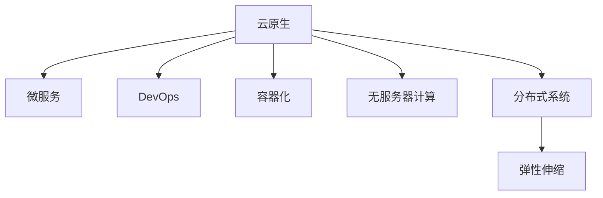

                 

# 云原生开发：从单体应用到微服务架构

> 关键词：云原生、微服务、DevOps、容器化、无服务器计算、CI/CD、Kubernetes、分布式系统、容器编排

## 1. 背景介绍

### 1.1 问题由来
随着互联网应用的快速发展和用户需求的不断变化，单体架构的应用已经无法满足高并发、高可用、高扩展性的需求。特别是对于大规模的互联网服务，如何实现服务的平滑扩展、快速迭代、弹性伸缩，成为了开发者面临的重要挑战。同时，互联网应用的日益复杂，也使得系统的运维和故障处理变得困难重重。

为了解决这些问题，云原生应用架构应运而生。云原生架构强调在云环境下实现应用的持续部署、快速迭代、高效扩展和持续监控，通过容器化、微服务、无服务器计算等技术手段，构建一个弹性、健壮、可观测的系统。

### 1.2 问题核心关键点
云原生开发的核心在于以下几个关键点：

- **容器化**：通过容器技术（如Docker）封装应用代码和依赖，实现应用的快速打包和分发。
- **微服务**：将大应用拆分成多个小的、独立的服务单元，实现服务的解耦和独立部署。
- **DevOps**：通过自动化持续集成/持续部署(CI/CD)，实现代码的快速迭代和发布。
- **无服务器计算**：通过FaaS（函数即服务）等无服务器架构，实现按需计算资源的使用，降低运维成本。
- **分布式系统**：通过Kubernetes等容器编排工具，实现应用的自动化部署、扩展和监控。
- **弹性伸缩**：根据系统负载动态调整资源，实现应用的自动扩缩容。

云原生架构的这些特点，使得应用能够快速响应市场变化，提升运维效率，增强系统的弹性和可靠性，成为现代企业IT架构的重要选择。

### 1.3 问题研究意义
研究云原生开发的方法和工具，对于提升应用的开发和运维效率，构建高效、可扩展的云原生架构，具有重要意义：

- **提升开发效率**：通过自动化持续集成和持续部署，实现代码的快速迭代和发布。
- **降低运维成本**：通过无服务器计算和容器编排，降低运维人员的工作量，提升系统可靠性。
- **增强系统弹性**：通过微服务和弹性伸缩，实现系统的快速扩展和故障自愈。
- **改善用户体验**：通过持续监控和自动化运维，提升应用的可用性和性能。
- **推动技术创新**：云原生技术的发展，催生了诸多新技术和新应用场景，推动了云计算和应用架构的发展。

## 2. 核心概念与联系

### 2.1 核心概念概述

为更好地理解云原生开发的核心概念，本节将介绍几个密切相关的核心概念：

- **云原生**：指在云环境中构建、部署和运维应用的技术体系，包括容器化、微服务、无服务器计算、DevOps等技术。
- **微服务**：指将一个大应用拆分成多个小的、独立的服务单元，通过API进行通信，实现服务的解耦和独立部署。
- **DevOps**：指将开发、测试、运维等环节进行紧密协作，实现应用的自动化部署和持续迭代。
- **容器化**：指通过容器技术（如Docker）封装应用代码和依赖，实现应用的快速打包和分发。
- **无服务器计算**：指通过函数即服务（FaaS）等无服务器架构，实现按需计算资源的使用，降低运维成本。
- **分布式系统**：指通过容器编排工具（如Kubernetes），实现应用的自动化部署、扩展和监控。
- **弹性伸缩**：指根据系统负载动态调整资源，实现应用的自动扩缩容。

这些核心概念之间的逻辑关系可以通过以下Mermaid流程图来展示：



这个流程图展示出云原生架构的核心组件及其之间的关系：

1. 云原生架构基于微服务设计，通过容器化实现应用的快速打包和分发。
2. DevOps机制实现了应用的自动化部署和持续迭代，提升开发效率。
3. 无服务器计算降低了运维成本，提高了系统的弹性。
4. 分布式系统通过容器编排工具，实现了应用的自动化部署、扩展和监控。
5. 弹性伸缩根据系统负载动态调整资源，实现应用的自动扩缩容。

## 3. 核心算法原理 & 具体操作步骤

### 3.1 算法原理概述

云原生开发的实现，通常基于以下核心算法和操作步骤：

**Step 1: 应用拆分与容器化**
- 将应用拆分成多个小的、独立的服务单元，每个服务负责独立的业务逻辑。
- 使用容器技术（如Docker）对每个服务进行封装，生成可移植的容器镜像。
- 容器镜像可以方便地分发和部署到不同的环境（如开发、测试、生产）。

**Step 2: 服务编排与微服务管理**
- 使用容器编排工具（如Kubernetes）对微服务进行编排和管理，实现服务的自动部署、扩展和监控。
- Kubernetes通过Deployment、Service等资源，管理微服务的生命周期，提供负载均衡、自动扩缩容等功能。

**Step 3: 持续集成与持续部署**
- 使用CI/CD工具（如Jenkins、GitLab CI等）实现代码的自动化持续集成和持续部署。
- 通过Git等版本控制系统，实现代码的版本控制和分支管理。
- 使用CI/CD工具自动化地构建、测试和部署应用，提升开发效率和系统可靠性。

**Step 4: 自动化监控与告警**
- 使用监控工具（如Prometheus、Grafana等）实时监控系统的运行状态。
- 设置告警规则，自动检测和处理系统异常，保障系统的稳定运行。
- 通过日志收集和分析，及时发现和解决系统问题。

**Step 5: 无服务器计算与按需伸缩**
- 使用无服务器计算平台（如AWS Lambda、Azure Functions等），实现按需计算资源的使用。
- 无服务器计算平台根据实际请求量动态分配计算资源，降低运维成本。
- 无服务器计算平台支持多种编程语言和框架，方便开发和部署。

**Step 6: 自动化运维与故障处理**
- 使用自动化运维工具（如Ansible、SaltStack等）实现应用的自动化运维。
- 通过脚本和配置文件，自动化地执行系统部署、配置和升级等任务。
- 使用故障检测和恢复工具，实现系统故障的自动检测和处理。

### 3.2 算法步骤详解

**Step 1: 应用拆分与容器化**
- 使用Dockerfile定义每个服务的构建过程，包括依赖、环境配置、运行脚本等。
- 使用Docker Build命令构建容器镜像，生成可移植的镜像文件。
- 使用Docker Push命令将容器镜像推送到Docker Hub等容器镜像仓库，方便分发和部署。

**Step 2: 服务编排与微服务管理**
- 使用Kubernetes定义服务的编排和部署过程，包括Pod、Deployment、Service等资源。
- 使用Kubernetes Deployment资源管理微服务的生命周期，实现服务的自动扩缩容。
- 使用Kubernetes Service资源实现服务的负载均衡和网络通信。

**Step 3: 持续集成与持续部署**
- 使用Git存储代码库，管理代码的版本和分支。
- 使用Jenkins、GitLab CI等CI/CD工具配置持续集成和持续部署流程。
- 在CI/CD流程中，自动化地构建、测试和部署应用，提升开发效率和系统可靠性。

**Step 4: 自动化监控与告警**
- 使用Prometheus实时监控系统的运行状态，收集各种指标数据。
- 使用Grafana对监控数据进行可视化展示，方便分析和诊断。
- 设置告警规则，自动检测和处理系统异常，保障系统的稳定运行。

**Step 5: 无服务器计算与按需伸缩**
- 使用AWS Lambda、Azure Functions等无服务器计算平台，实现按需计算资源的使用。
- 在无服务器计算平台中，编写函数代码，实现特定的业务逻辑。
- 根据实际请求量动态分配计算资源，降低运维成本。

**Step 6: 自动化运维与故障处理**
- 使用Ansible、SaltStack等自动化运维工具，编写脚本和配置文件，实现应用的自动化运维。
- 在脚本和配置文件中，定义自动化任务，实现系统部署、配置和升级等任务。
- 使用故障检测和恢复工具，实现系统故障的自动检测和处理。

### 3.3 算法优缺点

云原生开发具有以下优点：

1. **快速迭代**：通过自动化持续集成和持续部署，实现代码的快速迭代和发布。
2. **弹性伸缩**：通过微服务和弹性伸缩，实现系统的快速扩展和故障自愈。
3. **降低运维成本**：通过容器化和无服务器计算，降低运维人员的工作量，提升系统可靠性。
4. **提高开发效率**：通过DevOps机制，实现应用的自动化部署和持续迭代。
5. **增强系统稳定性**：通过自动化监控和故障处理，提升应用的可用性和性能。

同时，云原生开发也存在以下缺点：

1. **学习曲线陡峭**：需要掌握多种技术栈和工具，有一定学习成本。
2. **系统复杂性高**：微服务的拆分和组合，增加了系统的复杂性，增加了系统设计和维护的难度。
3. **网络通信开销大**：微服务的相互调用增加了网络通信开销，可能会影响系统性能。
4. **资源消耗高**：容器化和大规模微服务部署，增加了系统的资源消耗。
5. **安全风险增加**：微服务的拆分和组合，增加了系统的安全风险，需要加强安全防护措施。

### 3.4 算法应用领域

云原生架构的应用领域非常广泛，几乎涵盖了所有现代互联网应用场景，包括：

- **电商**：实现订单处理、库存管理、推荐系统等。
- **金融**：实现交易系统、风控系统、反欺诈系统等。
- **医疗**：实现电子病历、医疗影像、健康管理等。
- **教育**：实现在线教育平台、智能推荐、知识图谱等。
- **游戏**：实现游戏逻辑、AI对战、用户数据管理等。
- **社交**：实现社交网络、实时通信、用户数据管理等。

## 4. 数学模型和公式 & 详细讲解 & 举例说明

### 4.1 数学模型构建

云原生架构的核心是服务的编排和部署，可以通过以下数学模型来描述服务编排过程：

- **微服务部署模型**：定义每个微服务的部署策略，包括应用的容器镜像、环境配置、资源需求等。
- **负载均衡模型**：定义服务的负载均衡策略，包括路由规则、负载均衡算法等。
- **弹性伸缩模型**：定义服务的自动扩缩容策略，包括扩容和缩容的触发条件和策略。

**微服务部署模型**：
- 假设有一个服务A，使用Docker容器进行封装，生成的容器镜像为`image: myservice:latest`。
- 在Kubernetes中定义Deployment资源，配置服务A的容器镜像、资源需求、副本数等。
- Deployment资源代码如下：

```yaml
apiVersion: apps/v1
kind: Deployment
metadata:
  name: myservice
spec:
  replicas: 3
  selector:
    matchLabels:
      app: myservice
  template:
    metadata:
      labels:
        app: myservice
    spec:
      containers:
      - name: myservice
        image: myservice:latest
        resources:
          limits:
            cpu: 1
            memory: 512Mi
          requests:
            cpu: 0.5
            memory: 256Mi
```

**负载均衡模型**：
- 使用Kubernetes Service资源定义服务A的负载均衡策略。
- Service资源代码如下：

```yaml
apiVersion: v1
kind: Service
metadata:
  name: myservice
spec:
  selector:
    app: myservice
  ports:
    - protocol: TCP
      port: 80
      targetPort: 8080
  type: LoadBalancer
```

**弹性伸缩模型**：
- 使用Horizontal Pod Autoscaler（HPA）定义服务A的自动扩缩容策略。
- HPA资源代码如下：

```yaml
apiVersion: autoscaling/v1
kind: HorizontalPodAutoscaler
metadata:
  name: myservice-hpa
spec:
  scaleTargetRef:
    apiVersion: apps/v1
    kind: Deployment
    name: myservice
  minReplicas: 1
  maxReplicas: 10
  targetCPUUtilization: 0.7
```

### 4.2 公式推导过程

**微服务部署模型**：
- 假设服务A的容器镜像为`image: myservice:latest`，在Kubernetes中定义Deployment资源。
- 根据Deployment资源配置的副本数`replicas`，计算需要的容器数量`N`。
- 公式推导过程如下：
  - 设服务A的CPU需求为`cpu`，内存需求为`memory`。
  - 根据CPU和内存需求，计算单个容器的资源需求`cpu_demand`和`memory_demand`。
  - 根据副本数`replicas`，计算总资源需求`total_cpu`和`total_memory`。
  - 计算所需的容器数量`N`，使得`total_cpu/N >= cpu`且`total_memory/N >= memory`。

**负载均衡模型**：
- 使用Kubernetes Service资源定义服务A的负载均衡策略。
- Service资源代码如下：
- 假设Service的端口为80，目标端口为8080。
- 根据目标端口的流量，计算服务A的负载均衡规则。
- 公式推导过程如下：
  - 设服务A的流量为`traffic`，目标端口的流量为`target_traffic`。
  - 根据目标端口的流量，计算负载均衡规则`rules`。
  - 根据负载均衡规则，计算负载均衡策略`strategy`。

**弹性伸缩模型**：
- 使用Horizontal Pod Autoscaler（HPA）定义服务A的自动扩缩容策略。
- HPA资源代码如下：
- 根据目标CPU利用率`target_cpu_utilization`，计算服务A的CPU利用率`cpu_utilization`。
- 根据CPU利用率和目标CPU利用率，计算服务A的CPU扩缩容策略。
- 公式推导过程如下：
  - 设服务A的CPU利用率为`cpu_utilization`，目标CPU利用率为`target_cpu_utilization`。
  - 根据CPU利用率和目标CPU利用率，计算CPU扩缩容策略`strategy`。

### 4.3 案例分析与讲解

**案例：电商订单系统微服务架构**

- **应用拆分**：将电商订单系统拆分成多个微服务，包括订单管理、库存管理、支付系统等。
- **容器化**：使用Docker封装每个微服务的代码和依赖，生成容器镜像。
- **服务编排**：使用Kubernetes编排每个微服务的容器，实现服务的自动部署和扩展。
- **持续集成与持续部署**：使用Jenkins配置CI/CD流程，实现代码的自动化构建、测试和部署。
- **自动化监控与告警**：使用Prometheus和Grafana监控订单系统的运行状态，设置告警规则。
- **无服务器计算与按需伸缩**：使用AWS Lambda实现订单系统的按需计算资源，降低运维成本。
- **自动化运维与故障处理**：使用Ansible编写脚本和配置文件，实现订单系统的自动化运维。

通过微服务架构和云原生技术的结合，电商订单系统实现了快速迭代、弹性伸缩、降低运维成本等目标，提升了系统的可用性和性能。

## 5. 项目实践：代码实例和详细解释说明

### 5.1 开发环境搭建

在进行云原生开发实践前，我们需要准备好开发环境。以下是使用Python进行Docker和Kubernetes开发的环境配置流程：

1. 安装Docker：从官网下载并安装Docker，用于构建和部署容器镜像。
2. 安装Kubernetes：从官网下载并安装Kubernetes，用于编排和管理容器化应用。
3. 安装Minikube：从官网下载并安装Minikube，用于在本地搭建Kubernetes集群。
4. 安装Ansible：从官网下载并安装Ansible，用于编写自动化运维脚本。
5. 安装Jenkins：从官网下载并安装Jenkins，用于配置CI/CD流程。

完成上述步骤后，即可在Minikube上搭建Kubernetes集群，并开始云原生开发实践。

### 5.2 源代码详细实现

下面我们以电商订单系统微服务架构为例，给出使用Docker和Kubernetes进行云原生开发的全流程代码实现。

**Step 1: 应用拆分与容器化**

1. **订单管理服务**：
   - 定义Dockerfile文件，定义应用的构建过程。
   - 使用Docker Build命令构建容器镜像。
   - 使用Docker Push命令将容器镜像推送到Docker Hub等容器镜像仓库。
2. **库存管理服务**：
   - 定义Dockerfile文件，定义应用的构建过程。
   - 使用Docker Build命令构建容器镜像。
   - 使用Docker Push命令将容器镜像推送到Docker Hub等容器镜像仓库。
3. **支付系统服务**：
   - 定义Dockerfile文件，定义应用的构建过程。
   - 使用Docker Build命令构建容器镜像。
   - 使用Docker Push命令将容器镜像推送到Docker Hub等容器镜像仓库。

**Step 2: 服务编排与微服务管理**

1. **订单管理服务**：
   - 定义Kubernetes Deployment资源，配置服务A的容器镜像、资源需求、副本数等。
2. **库存管理服务**：
   - 定义Kubernetes Deployment资源，配置服务A的容器镜像、资源需求、副本数等。
3. **支付系统服务**：
   - 定义Kubernetes Deployment资源，配置服务A的容器镜像、资源需求、副本数等。
4. **订单系统服务**：
   - 定义Kubernetes Service资源，定义服务A的负载均衡策略。
5. **库存系统服务**：
   - 定义Kubernetes Service资源，定义服务A的负载均衡策略。
6. **支付系统服务**：
   - 定义Kubernetes Service资源，定义服务A的负载均衡策略。

**Step 3: 持续集成与持续部署**

1. **订单管理服务**：
   - 使用Jenkins配置CI/CD流程，自动化地构建、测试和部署应用。
   - 在CI/CD流程中，使用Docker Build和Docker Push命令构建和部署容器镜像。
2. **库存管理服务**：
   - 使用Jenkins配置CI/CD流程，自动化地构建、测试和部署应用。
   - 在CI/CD流程中，使用Docker Build和Docker Push命令构建和部署容器镜像。
3. **支付系统服务**：
   - 使用Jenkins配置CI/CD流程，自动化地构建、测试和部署应用。
   - 在CI/CD流程中，使用Docker Build和Docker Push命令构建和部署容器镜像。

**Step 4: 自动化监控与告警**

1. **订单管理服务**：
   - 使用Prometheus实时监控服务的运行状态，收集各种指标数据。
   - 使用Grafana对监控数据进行可视化展示，方便分析和诊断。
2. **库存管理服务**：
   - 使用Prometheus实时监控服务的运行状态，收集各种指标数据。
   - 使用Grafana对监控数据进行可视化展示，方便分析和诊断。
3. **支付系统服务**：
   - 使用Prometheus实时监控服务的运行状态，收集各种指标数据。
   - 使用Grafana对监控数据进行可视化展示，方便分析和诊断。

**Step 5: 无服务器计算与按需伸缩**

1. **订单管理服务**：
   - 使用AWS Lambda实现按需计算资源的使用，降低运维成本。
   - 在Lambda函数中编写代码，实现订单管理的逻辑。
2. **库存管理服务**：
   - 使用AWS Lambda实现按需计算资源的使用，降低运维成本。
   - 在Lambda函数中编写代码，实现库存管理的逻辑。
3. **支付系统服务**：
   - 使用AWS Lambda实现按需计算资源的使用，降低运维成本。
   - 在Lambda函数中编写代码，实现支付系统的逻辑。

**Step 6: 自动化运维与故障处理**

1. **订单管理服务**：
   - 使用Ansible编写脚本和配置文件，实现应用的自动化运维。
   - 在脚本和配置文件中，定义自动化任务，实现系统部署、配置和升级等任务。
2. **库存管理服务**：
   - 使用Ansible编写脚本和配置文件，实现应用的自动化运维。
   - 在脚本和配置文件中，定义自动化任务，实现系统部署、配置和升级等任务。
3. **支付系统服务**：
   - 使用Ansible编写脚本和配置文件，实现应用的自动化运维。
   - 在脚本和配置文件中，定义自动化任务，实现系统部署、配置和升级等任务。

### 5.3 代码解读与分析

让我们再详细解读一下关键代码的实现细节：

**订单管理服务**：
- 定义Dockerfile文件：
```Dockerfile
FROM python:3.7-slim
WORKDIR /app
COPY requirements.txt requirements.txt
RUN pip install -r requirements.txt
COPY . .
EXPOSE 8080
CMD ["python", "app.py"]
```

- 使用Docker Build命令构建容器镜像：
```bash
docker build -t myservice:latest .
```

- 使用Docker Push命令将容器镜像推送到Docker Hub等容器镜像仓库：
```bash
docker push myservice:latest
```

**Kubernetes Deployment资源**：
```yaml
apiVersion: apps/v1
kind: Deployment
metadata:
  name: myservice
spec:
  replicas: 3
  selector:
    matchLabels:
      app: myservice
  template:
    metadata:
      labels:
        app: myservice
    spec:
      containers:
      - name: myservice
        image: myservice:latest
        resources:
          limits:
            cpu: 1
            memory: 512Mi
          requests:
            cpu: 0.5
            memory: 256Mi
```

**订单系统Service资源**：
```yaml
apiVersion: v1
kind: Service
metadata:
  name: myservice
spec:
  selector:
    app: myservice
  ports:
    - protocol: TCP
      port: 80
      targetPort: 8080
  type: LoadBalancer
```

**Prometheus监控**：
- 使用Prometheus实时监控服务的运行状态，收集各种指标数据：
```yaml
apiVersion: monitoring.coreos.com/v1
kind: ServiceMonitor
metadata:
  name: myservice-metrics
  labels:
    hello: world
spec:
  selector:
    hello: world
```

**Grafana可视化**：
- 使用Grafana对监控数据进行可视化展示，方便分析和诊断：
```yaml
apiVersion: v1
kind: Dashboard
metadata:
  name: myservice-dashboard
spec:
  panels:
    - type: prometheus
      title: CPU Usage
      data_source: myservice-metrics
      query: sum by (source) (rate(mygpu_seconds_total[5m])) by (source)
```

**Ansible自动化运维**：
- 使用Ansible编写脚本和配置文件，实现应用的自动化运维：
```yaml
---
- name: MyService
  hosts: myservice
  become: yes
  tasks:
    - name: install dependencies
      apt:
        name: python3-pip
        state: present
      become: yes

    - name: install myservice
      apt:
        name: myservice
        state: present
      become: yes

    - name: restart myservice
      systemd:
        name: myservice
        state: restarted
      become: yes
```

通过这些代码实现，可以完整地构建一个电商订单系统的微服务架构，并实现自动化持续集成和持续部署、自动化监控与告警、无服务器计算与按需伸缩、自动化运维与故障处理等云原生开发的核心功能。

## 6. 实际应用场景

### 6.1 智能客服系统

智能客服系统可以通过云原生开发架构，实现快速迭代、弹性伸缩和自动化运维，提升客服系统的响应速度和用户体验。

1. **应用拆分与容器化**：将智能客服系统拆分成多个微服务，包括自然语言处理、对话管理、知识库查询等。
2. **服务编排与微服务管理**：使用Kubernetes编排微服务，实现服务的自动部署和扩展。
3. **持续集成与持续部署**：使用Jenkins配置CI/CD流程，实现代码的自动化构建、测试和部署。
4. **自动化监控与告警**：使用Prometheus和Grafana监控客服系统的运行状态，设置告警规则。
5. **无服务器计算与按需伸缩**：使用AWS Lambda实现按需计算资源的使用，降低运维成本。
6. **自动化运维与故障处理**：使用Ansible编写脚本和配置文件，实现应用的自动化运维。

通过云原生开发架构，智能客服系统可以灵活应对不断变化的市场需求，快速响应客户咨询，提升客户满意度。

### 6.2 金融交易系统

金融交易系统可以通过云原生开发架构，实现高可用、高扩展和高安全性的交易平台，保障金融数据的可靠性和安全性。

1. **应用拆分与容器化**：将金融交易系统拆分成多个微服务，包括交易服务、风控服务、反欺诈服务等。
2. **服务编排与微服务管理**：使用Kubernetes编排微服务，实现服务的自动部署和扩展。
3. **持续集成与持续部署**：使用Jenkins配置CI/CD流程，实现代码的自动化构建、测试和部署。
4. **自动化监控与告警**：使用Prometheus和Grafana监控交易系统的运行状态，设置告警规则。
5. **无服务器计算与按需伸缩**：使用AWS Lambda实现按需计算资源的使用，降低运维成本。
6. **自动化运维与故障处理**：使用Ansible编写脚本和配置文件，实现应用的自动化运维。

通过云原生开发架构，金融交易系统可以实现快速迭代、弹性伸缩和自动化运维，提升交易系统的可靠性和安全性。

### 6.3 医疗电子病历系统

医疗电子病历系统可以通过云原生开发架构，实现数据共享、协同诊断和实时监控，提升医疗服务水平和患者体验。

1. **应用拆分与容器化**：将医疗电子病历系统拆分成多个微服务，包括病历管理、诊断服务、实时监控等。
2. **服务编排与微服务管理**：使用Kubernetes编排微服务，实现服务的自动部署和扩展。
3. **持续集成与持续部署**：使用Jenkins配置CI/CD流程，实现代码的自动化构建、测试和部署。
4. **自动化监控与告警**：使用Prometheus和Grafana监控电子病历系统的运行状态，设置告警规则。
5. **无服务器计算与按需伸缩**：使用AWS Lambda实现按需计算资源的使用，降低运维成本。
6. **自动化运维与故障处理**：使用Ansible编写脚本和配置文件，实现应用的自动化运维。

通过云原生开发架构，医疗电子病历系统可以实现数据共享、协同诊断和实时监控，提升医疗服务水平和患者体验。

### 6.4 未来应用展望

随着云原生技术的不断发展和成熟，基于云原生架构的开发和运维将更加高效、便捷和灵活。未来，云原生架构将广泛应用于各个领域，带来更多创新和变革：

- **云原生PaaS平台**：将云原生架构与PaaS平台结合，提供更高级别的自动化运维和管理。
- **云原生容器云**：将云原生架构与容器云结合，提供更强大的弹性扩展和自动部署功能。
- **云原生云平台**：将云原生架构与云平台结合，提供更全面的云服务支持和管理。
- **云原生微服务框架**：提供更高级别的微服务开发和治理工具，提升微服务开发的效率和质量。
- **云原生DevOps工具**：提供更高效的持续集成和持续部署工具，提升代码开发和发布的速度和可靠性。

## 7. 工具和资源推荐

### 7.1 学习资源推荐

为了帮助开发者系统掌握云原生开发的核心概念和实践方法，这里推荐一些优质的学习资源：

1. **《Kubernetes权威指南》**：由Kubernetes官方编写的经典指南，全面介绍了Kubernetes的基础知识和最佳实践。
2. **《Docker实战》**：由Docker官方编写的实战指南，全面介绍了Docker的基础知识和最佳实践。
3. **《云原生系统设计与实现》**：由云原生社区编写的系统设计指南，全面介绍了云原生架构的设计原则和实现方法。
4. **《云原生DevOps实践》**：由DevOps社区编写的实践指南，全面介绍了云原生应用的持续集成和持续部署方法。
5. **《云原生应用开发实战》**：由云原生社区编写的实战指南，全面介绍了云原生应用的开发和运维方法。

通过对这些资源的学习实践，相信你一定能够全面掌握云原生开发的核心概念和实践方法，提升开发和运维效率，构建高效、可扩展的云原生应用。

### 7.2 开发工具推荐

高效的云原生开发离不开优秀的工具支持。以下是几款用于云原生开发常用的工具：

1. **Docker**：开源容器化工具，支持快速打包和分发应用。
2. **Kubernetes**：开源容器编排工具，支持自动部署、扩展和监控微服务。
3. **Prometheus**：开源监控工具，支持实时监控应用运行状态。
4. **Grafana**：开源数据可视化工具，支持对监控数据进行可视化展示。
5. **Jenkins**：开源持续集成工具，支持自动化构建、测试和部署应用。
6. **Ansible**：开源自动化运维工具，支持编写自动化脚本和配置文件。
7. **AWS Lambda**：云原生无服务器计算平台，支持按需计算资源的使用。

合理利用这些工具，可以显著提升云原生开发的效率和质量，构建高效、可扩展的云原生应用。

### 7.3 相关论文推荐

云原生架构的不断发展，得益于学界和工业界的持续研究和创新。以下是几篇奠基性的相关论文，推荐阅读：

1. **《Kubernetes: Large-scale micro-containers orchestrated》**：由Google发布的Kubernetes官方论文，介绍了Kubernetes的基本架构和设计思想。
2. **《Docker: The Docker Object Model》**：由Docker发布的Docker官方论文，介绍了Docker的基本架构和设计思想。
3. **《DevOps: The Culture, Technology and Tooling for Agile Software Development》**：由Patrick Debois等发布的DevOps经典论文，介绍了DevOps的基本概念和实践方法。
4. **《Cloud-Native Computing Foundation White Paper: Cloud-Native Migration》**：由Cloud-Native Computing Foundation发布的云原生迁移指南，介绍了云原生架构的迁移方法和最佳实践。
5. **《Microservices Patterns: Generic Structuring of Software Systems》**：由Martin Fowler发布的微服务设计指南，介绍了微服务的基本概念和设计原则。

这些论文代表了大规模云原生应用的理论和实践进展，对理解云原生架构的核心概念和实践方法具有重要参考价值。

## 8. 总结：未来发展趋势与挑战

### 8.1 研究成果总结

云原生架构已经成为现代IT架构的重要组成部分，广泛应用于各种场景。通过云原生开发，可以实现快速迭代、弹性伸缩、自动化运维等目标，提升应用开发和运维的效率和质量。

### 8.2 未来发展趋势

云原生架构的未来发展趋势，包括以下几个方向：

1. **云原生PaaS平台**：将云原生架构与PaaS平台结合，提供更高级别的自动化运维和管理。
2. **云原生容器云**：将云原生架构与容器云结合，提供更强大的弹性扩展和自动部署功能。
3. **云原生云平台**：将云原生架构与云平台结合，提供更全面的云服务支持和管理。
4. **云原生微服务框架**：提供更高级别的微服务开发和治理工具，提升微服务开发的效率和质量。
5. **云原生DevOps工具**：提供更高效的持续集成和持续部署工具，提升代码开发和发布的速度和可靠性。

### 8.3 面临的挑战

尽管云原生架构已经取得了显著的成果，但在实现过程中，仍面临以下挑战：

1. **复杂度增加**：微服务的拆分和组合增加了系统的复杂性，增加了系统设计和维护的难度。
2. **网络通信开销大**：微服务的相互调用增加了网络通信开销，可能会影响系统性能。
3. **资源消耗高**：容器化和微服务部署，增加了系统的资源消耗。
4. **安全风险增加**：微服务的拆分和组合，增加了系统的安全风险，需要加强安全防护措施。
5. **知识储备不足**：云原生技术相对较新，许多开发人员和运维人员对相关知识储备不足，需要加强培训和学习。

### 8.4 研究展望

未来的研究需要在以下几个方面寻求新的突破：

1. **微服务治理**：通过微服务治理工具，提升微服务系统的可观测性、可维护性和可扩展性。
2. **自动化运维**：通过自动化运维工具，提升应用的自动化部署、配置和升级效率，降低运维成本。
3. **弹性伸缩优化**：通过优化弹性伸缩策略，提升系统的响应速度和可用性。
4. **微服务安全**：通过微服务安全机制，保障微服务系统的安全性。
5. **微服务优化**：通过微服务优化技术，提升微服务系统的性能和资源利用率。

## 9. 附录：常见问题与解答

**Q1：云原生架构与传统架构有什么区别？**

A: 云原生架构与传统架构的区别主要在于以下几个方面：

1. **容器化**：云原生架构使用容器技术（如Docker）封装应用代码和依赖，实现应用的快速打包和分发。而传统架构通常使用虚拟机进行部署。
2. **微服务**：云原生架构将大应用拆分成多个小的、独立的服务单元，通过API进行通信，实现服务的解耦和独立部署。而传统架构通常是一个整体的应用。
3. **DevOps**：云原生架构通过自动化持续集成和持续部署（CI/CD），实现代码的快速迭代和发布。而传统架构通常采用手工发布和部署。
4. **无服务器计算**：云原生架构使用无服务器计算平台（如AWS Lambda），实现按需计算资源的使用，降低运维成本。而传统架构通常需要手动管理和调度资源。

**Q2：云原生架构是否适合所有的应用场景？**

A: 云原生架构适合大多数现代应用场景，但并不适用于所有应用。

对于需要高性能、低延迟、高可靠性的实时应用，云原生架构的优势明显。而对于一些计算资源需求较低、数据处理要求简单的应用，云原生架构的优点可能不如传统架构。

**Q3：云原生架构的复杂度是否会降低开发效率？**

A: 云原生架构的复杂度可能会增加，但通过自动化持续集成和持续部署（CI/CD）等工具，可以大大提升开发效率。

云原生架构的复杂度主要体现在微服务的拆分和组合上，但通过自动化工具和DevOps实践，可以简化开发和部署流程，提升开发效率。

**Q4：云原生架构是否适用于企业内部应用？**

A: 云原生架构不仅适用于互联网应用，也适用于企业内部应用。

企业内部应用通常也面临性能、可用性、可扩展性等需求，云原生架构可以提供这些保障。同时，云原生架构的灵活性和可扩展性，也适合企业内部的应用迁移和升级。

**Q5：云原生架构是否需要高度的基础设施支持？**

A: 云原生架构需要一定的基础设施支持，但相比传统架构，云原生架构更加灵活和可扩展。

云原生架构可以通过容器云、Kubernetes等基础设施实现自动化部署、扩展和监控，同时可以灵活使用云原生工具和平台，提升开发和运维效率。

通过本文的系统梳理，可以看到，云原生架构已经成为现代IT架构的重要组成部分，极大地提升了应用的开发和运维效率。未来，云原生架构将继续演进，为构建高效、可扩展的云原生应用提供更多支持。

