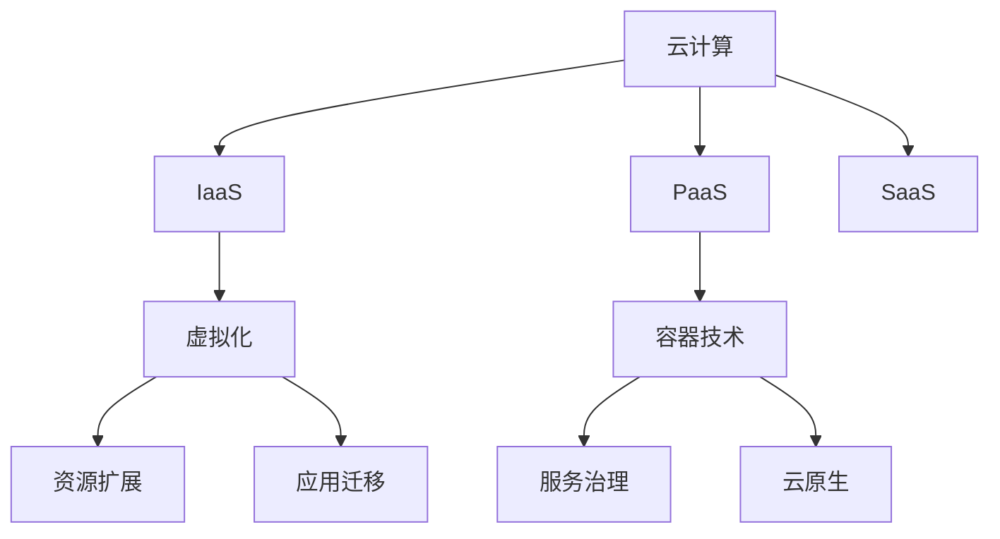

                 

# 云计算和虚拟化：扩展和迁移

> 关键词：云计算,虚拟化,资源扩展,迁移,容器技术,服务治理,云原生

## 1. 背景介绍

随着云计算的普及，企业对于计算资源的灵活性和扩展性提出了更高的要求。传统的数据中心建设和管理方式已经无法满足现代企业对IT资源的需求。因此，虚拟化和容器技术应运而生，为企业提供了更为灵活的计算资源管理和应用部署方式。

本博客将深入探讨云计算和虚拟化技术，详细阐述如何在云环境中进行资源扩展和应用迁移。通过丰富的实践案例和实际应用场景，帮助读者更好地理解和应用这些先进技术。

## 2. 核心概念与联系

### 2.1 核心概念概述

- **云计算(Cloud Computing)**：利用互联网提供按需扩展的计算资源，包括CPU、存储、网络等。云计算可以分为三种服务模型：基础设施即服务(IaaS)、平台即服务(PaaS)、软件即服务(SaaS)。

- **虚拟化(Virtualization)**：通过抽象底层物理资源，为多个虚拟机(Virtual Machine, VM)提供独立运行环境。虚拟化可以提升资源的利用率，降低部署和管理成本。

- **容器技术(Container Technology)**：容器是一种轻量级的进程隔离技术，可以更加灵活地管理应用的生命周期。与虚拟化相比，容器具有更小的内存占用和更快的启动速度。

- **资源扩展(Scaling)**：指在云环境中快速扩展或缩小计算资源，以满足应用负载的变化。资源扩展可以是自动化的，根据应用负载自动调整资源。

- **应用迁移(Migration)**：将应用从一种计算环境迁移到另一种计算环境，包括虚拟机迁移、容器迁移等。应用迁移可以提升应用的可用性和可移植性。

- **服务治理(Service Governance)**：指管理和优化云服务的策略、流程和技术，以确保云环境的稳定性和可管理性。服务治理通常包括性能监控、安全审计、合规管理等。

- **云原生(Cloud-Native)**：指基于云环境的思想和模式构建应用和服务。云原生应用和服务通常具有更高的可扩展性、弹性和自管理能力。

### 2.2 核心概念原理和架构的 Mermaid 流程图



这个流程图展示了云计算、虚拟化、容器技术、资源扩展、应用迁移、服务治理和云原生之间的联系。云计算是基础，通过虚拟化技术将物理资源抽象为虚拟机，并通过容器技术进一步提升应用的灵活性和可管理性。资源扩展和应用迁移技术支持云环境的自动化和弹性管理，而服务治理和云原生则是确保云环境稳定和高效运行的关键。

## 3. 核心算法原理 & 具体操作步骤

### 3.1 算法原理概述

在云环境中，资源扩展和应用迁移是两个核心任务。资源扩展通过自动化的方式，根据应用负载的变化，动态调整计算资源以满足需求。应用迁移则通过特定的技术手段，将应用从一个计算环境迁移到另一个计算环境，以提高应用的可用性和可移植性。

资源扩展的算法原理主要基于负载均衡和弹性伸缩。通过负载均衡算法将计算任务分散到多个计算节点上，避免单点故障和资源瓶颈。弹性伸缩算法则根据应用的负载情况，自动调整计算资源的分配，以提高系统性能和资源利用率。

应用迁移的算法原理主要基于虚拟机和容器的迁移技术。虚拟机迁移通过活迁或复迁的方式，将虚拟机从一个物理服务器迁移到另一个物理服务器。容器迁移则通过复制容器的快照，将容器从一个主机迁移到另一个主机。这些迁移技术通常需要考虑数据的同步和一致性问题，以确保迁移过程的平滑进行。

### 3.2 算法步骤详解

#### 3.2.1 资源扩展

1. **监控负载**：使用负载监控工具对应用的负载情况进行实时监控，如CPU、内存、网络等。
2. **弹性伸缩**：根据负载监控的结果，自动调整计算资源的分配。可以设置不同负载阈值对应的伸缩策略，如自动增加或减少计算资源。
3. **资源分配**：根据伸缩策略，将计算任务分配到可用的计算节点上，以确保应用负载均衡。
4. **性能优化**：根据负载情况，优化计算资源的配置，如调整CPU、内存、网络等参数。

#### 3.2.2 应用迁移

1. **迁移准备**：对需要迁移的应用进行准备，包括备份数据、配置环境等。
2. **迁移执行**：根据迁移类型，执行相应的迁移操作。如虚拟机迁移需要考虑数据的同步和一致性问题，容器迁移则可以使用容器复制技术。
3. **迁移验证**：迁移完成后，对迁移后的应用进行验证，确保其正常运行。
4. **资源回收**：将原始资源的配置和数据恢复到迁移前的状态，释放资源。

### 3.3 算法优缺点

#### 3.3.1 资源扩展

**优点**：
- 提升系统性能和资源利用率。
- 支持自动化的资源管理，降低运维成本。
- 根据负载自动调整资源，提高应用的可用性。

**缺点**：
- 对负载监控的准确性有较高的要求，监控不准确可能导致资源分配不合理。
- 动态调整资源可能会导致系统不稳定性增加。
- 需要处理不同负载情况下的伸缩策略，增加配置复杂度。

#### 3.3.2 应用迁移

**优点**：
- 提升应用的可用性和可移植性。
- 迁移过程中应用不中断，降低服务中断的风险。
- 可以通过不同的迁移策略满足不同的迁移需求。

**缺点**：
- 迁移过程复杂，需要考虑数据的同步和一致性问题。
- 迁移过程中应用性能可能会受到影响。
- 需要处理不同类型应用的迁移，增加迁移的复杂性。

### 3.4 算法应用领域

资源扩展和应用迁移技术可以广泛应用于多个领域，包括：

- **金融行业**：金融行业对计算资源的需求大且不稳定，资源扩展和应用迁移技术可以帮助金融企业快速应对市场波动，提高服务稳定性和可靠性。
- **电商行业**：电商行业需要处理海量交易数据，资源扩展和应用迁移技术可以帮助电商企业快速扩展计算资源，提高交易处理能力。
- **教育行业**：教育行业对计算资源的需求相对稳定，但需要支持大规模在线教育，资源扩展和应用迁移技术可以帮助教育企业快速扩展计算资源，支持在线教育的顺利进行。
- **医疗行业**：医疗行业对计算资源的需求不稳定，资源扩展和应用迁移技术可以帮助医疗企业快速应对突发事件，提高医疗服务水平。
- **政府行业**：政府行业需要处理大量的政务数据，资源扩展和应用迁移技术可以帮助政府部门快速扩展计算资源，支持政务数据的处理和分析。

## 4. 数学模型和公式 & 详细讲解

### 4.1 数学模型构建

在云环境中，资源扩展和应用迁移的数学模型通常基于负载监控和资源分配的决策算法。这里以一个简单的线性弹性伸缩模型为例，进行说明。

设系统当前的计算资源为 $R_0$，最大计算资源为 $R_{max}$，最小计算资源为 $R_{min}$，负载监控结果为 $L$。

**资源扩展模型**：
$$
R(t+1) = 
\begin{cases} 
R_0 + \Delta R, & L > T_{max} \\
R_0, & L < T_{min} \\
R_0 + \frac{L - T_{min}}{T_{max} - T_{min}} \cdot (R_{max} - R_0), & T_{min} \leq L \leq T_{max}
\end{cases}
$$

其中 $T_{max}$ 和 $T_{min}$ 分别表示负载的上下限阈值，$\Delta R$ 表示每次资源扩展的增量，可以通过实验确定。

**应用迁移模型**：
$$
R'(t+1) = 
\begin{cases} 
R_0, & L < T_{min} \\
R'(t) - \Delta R, & L > T_{max} \\
R'(t) - \frac{L - T_{min}}{T_{max} - T_{min}} \cdot \Delta R, & T_{min} \leq L \leq T_{max}
\end{cases}
$$

其中 $R'$ 表示迁移后的计算资源。

### 4.2 公式推导过程

**资源扩展模型的推导**：
设初始计算资源为 $R_0$，最大计算资源为 $R_{max}$，最小计算资源为 $R_{min}$，负载监控结果为 $L$，负载阈值为 $T_{max}$ 和 $T_{min}$，每次资源扩展的增量为 $\Delta R$。

当负载 $L$ 小于 $T_{min}$ 时，资源保持不变，即 $R(t+1) = R_0$。

当负载 $L$ 大于 $T_{max}$ 时，资源扩展，即 $R(t+1) = R_0 + \Delta R$。

当负载 $L$ 在 $[T_{min}, T_{max}]$ 范围内时，根据负载比例进行资源分配，即：
$$
R(t+1) = R_0 + \frac{L - T_{min}}{T_{max} - T_{min}} \cdot (R_{max} - R_0)
$$

**应用迁移模型的推导**：
设初始计算资源为 $R_0$，迁移后的计算资源为 $R'$，负载监控结果为 $L$，负载阈值为 $T_{max}$ 和 $T_{min}$，每次迁移的增量为 $\Delta R$。

当负载 $L$ 小于 $T_{min}$ 时，资源保持不变，即 $R'(t+1) = R_0$。

当负载 $L$ 大于 $T_{max}$ 时，资源减少，即 $R'(t+1) = R'(t) - \Delta R$。

当负载 $L$ 在 $[T_{min}, T_{max}]$ 范围内时，根据负载比例进行资源分配，即：
$$
R'(t+1) = R'(t) - \frac{L - T_{min}}{T_{max} - T_{min}} \cdot \Delta R
$$

### 4.3 案例分析与讲解

#### 4.3.1 案例背景

某电商企业需要处理大规模订单交易数据，高峰期订单量巨大，系统负载波动较大。为了确保系统的稳定性和可用性，企业决定使用资源扩展和应用迁移技术。

#### 4.3.2 资源扩展的实施

1. **负载监控**：使用负载监控工具对订单系统进行实时监控，收集 CPU、内存、网络等负载数据。
2. **弹性伸缩**：根据负载监控结果，设定负载阈值 $T_{min}$ 和 $T_{max}$，并设定每次资源扩展的增量 $\Delta R$。设置伸缩策略为：当负载 $L$ 大于 $T_{max}$ 时，自动增加计算资源；当负载 $L$ 小于 $T_{min}$ 时，自动减少计算资源。
3. **资源分配**：将订单系统的负载均衡到多个计算节点上，确保每个节点负载均衡。
4. **性能优化**：根据负载情况，优化计算资源的配置，如调整 CPU、内存、网络等参数。

#### 4.3.3 应用迁移的实施

1. **迁移准备**：对订单系统进行迁移准备，备份数据，配置环境。
2. **迁移执行**：使用容器技术，将订单系统从一个主机迁移到另一个主机。使用容器复制技术，确保容器数据的一致性。
3. **迁移验证**：迁移完成后，对订单系统进行验证，确保其正常运行。
4. **资源回收**：将原始资源的配置和数据恢复到迁移前的状态，释放资源。

## 5. 项目实践：代码实例和详细解释说明

### 5.1 开发环境搭建

在进行云计算和虚拟化实践前，我们需要准备好开发环境。以下是使用Python进行Kubernetes和Docker开发的环境配置流程：

1. 安装Anaconda：从官网下载并安装Anaconda，用于创建独立的Python环境。

2. 创建并激活虚拟环境：
```bash
conda create -n k8s-env python=3.8 
conda activate k8s-env
```

3. 安装Kubernetes和Docker：
```bash
sudo apt-get update
sudo apt-get install -y kubelet kubeadm kubectl
sudo apt-get install -y docker.io
```

4. 初始化Kubernetes集群：
```bash
sudo kubeadm init --api-server-cert-sans=k8s.example.com
```

5. 安装Docker：
```bash
sudo apt-get update
sudo apt-get install -y docker-ce docker-compose
```

完成上述步骤后，即可在`k8s-env`环境中开始云计算和虚拟化的实践。

### 5.2 源代码详细实现

这里我们以一个简单的 Web 应用为例，展示如何在 Kubernetes 中进行容器化和资源扩展的实践。

首先，创建 Docker 镜像：

```bash
docker build -t myapp .
```

然后，创建 Kubernetes 配置文件 `myapp-deployment.yaml`：

```yaml
apiVersion: apps/v1
kind: Deployment
metadata:
  name: myapp-deployment
spec:
  replicas: 3
  selector:
    matchLabels:
      app: myapp
  template:
    metadata:
      labels:
        app: myapp
    spec:
      containers:
      - name: myapp
        image: myapp:latest
        ports:
        - containerPort: 8080
```

接着，创建 Kubernetes 服务文件 `myapp-service.yaml`：

```yaml
apiVersion: v1
kind: Service
metadata:
  name: myapp-service
spec:
  selector:
    app: myapp
  ports:
    - protocol: TCP
      port: 80
      targetPort: 8080
  type: LoadBalancer
```

最后，通过 Kubernetes 命令行工具 `kubectl` 创建部署和服务中心：

```bash
kubectl create -f myapp-deployment.yaml
kubectl create -f myapp-service.yaml
```

### 5.3 代码解读与分析

#### 5.3.1 Docker 镜像创建

Docker 镜像创建过程需要安装 Docker 工具并编写一个 Dockerfile，定义应用的环境、依赖和启动命令。在这个示例中，我们将 Web 应用打包为一个 Docker 镜像，并命名为 `myapp`。

#### 5.3.2 Kubernetes 配置文件

Kubernetes 配置文件包括 Deployment 和 Service 两种类型。Deployment 用于定义应用的容器和副本数量，Service 用于定义服务的端口和负载均衡方式。在这个示例中，我们创建了一个包含 3 个副本的 Deployment，并创建了一个类型为 LoadBalancer 的服务。

#### 5.3.3 Kubernetes 部署和服务中心的创建

通过 Kubernetes 命令行工具 `kubectl`，我们创建了一个 Deployment 和 Service，实现了应用的容器化和资源扩展。Deployment 会自动将应用容器实例扩展到指定数量，并根据负载情况自动调整实例数量。Service 会将多个容器实例负载均衡到同一个外部 IP 地址上，方便外部访问。

### 5.4 运行结果展示

通过以上步骤，我们已经成功创建了一个 Web 应用的 Docker 镜像，并部署到 Kubernetes 集群中。可以通过以下命令访问应用：

```bash
kubectl get pods
kubectl get services
kubectl get deployments
```

输出结果展示了应用的状态、服务的地址和 Deployment 的副本数量。可以通过浏览器访问 `http://<IP>:80` 访问应用。

## 6. 实际应用场景

### 6.1 金融行业

金融行业对计算资源的需求大且不稳定。资源扩展和应用迁移技术可以帮助金融企业快速应对市场波动，提高服务稳定性和可靠性。例如，某金融企业可以在高峰期自动扩展计算资源，降低交易延时，提升用户体验。在应用迁移方面，金融企业可以通过容器技术快速迁移应用，提升应用的可移植性和可管理性。

### 6.2 电商行业

电商行业需要处理海量交易数据，资源扩展和应用迁移技术可以帮助电商企业快速扩展计算资源，提高交易处理能力。例如，某电商企业可以在订单高峰期自动扩展计算资源，降低交易延时，提升用户体验。在应用迁移方面，电商企业可以通过容器技术快速迁移应用，降低应用迁移的风险和成本。

### 6.3 教育行业

教育行业对计算资源的需求相对稳定，但需要支持大规模在线教育。资源扩展和应用迁移技术可以帮助教育企业快速扩展计算资源，支持在线教育的顺利进行。例如，某在线教育平台可以在高峰期自动扩展计算资源，提高在线教育系统的稳定性。在应用迁移方面，教育企业可以通过容器技术快速迁移应用，提升应用的可移植性和可管理性。

### 6.4 医疗行业

医疗行业对计算资源的需求不稳定，资源扩展和应用迁移技术可以帮助医疗企业快速应对突发事件，提高医疗服务水平。例如，某医院可以在急诊高峰期自动扩展计算资源，提升急诊处理能力。在应用迁移方面，医疗企业可以通过容器技术快速迁移应用，提升应用的可移植性和可管理性。

### 6.5 政府行业

政府行业需要处理大量的政务数据，资源扩展和应用迁移技术可以帮助政府部门快速扩展计算资源，支持政务数据的处理和分析。例如，某政府部门可以在高峰期自动扩展计算资源，提升政务服务的响应速度。在应用迁移方面，政府企业可以通过容器技术快速迁移应用，提升应用的可移植性和可管理性。

## 7. 工具和资源推荐

### 7.1 学习资源推荐

为了帮助开发者系统掌握云计算和虚拟化技术的理论基础和实践技巧，这里推荐一些优质的学习资源：

1. Kubernetes官方文档：Kubernetes官方文档是学习Kubernetes最权威的资料，涵盖从基础到高级的全部内容。

2. Docker官方文档：Docker官方文档是学习Docker最权威的资料，涵盖从基础到高级的全部内容。

3. Google Kubernetes Engine（GKE）官方文档：Google Kubernetes Engine官方文档是学习Kubernetes集群管理的详细资料，涵盖从安装到运维的全部内容。

4. Docker和Kubernetes实战指南：这是一本实战性很强的书籍，涵盖了Docker和Kubernetes的最新实践。

5. Kubernetes权威指南：这是一本权威性的Kubernetes入门书籍，适合初学者和中级开发者。

6. 《Docker实战》：这是一本实战性很强的书籍，涵盖从安装到运维的全部内容。

7. 《Kubernetes实战》：这是一本实战性很强的书籍，涵盖从安装到运维的全部内容。

8. 《Kubernetes权威指南》：这是一本权威性的Kubernetes入门书籍，适合初学者和中级开发者。

### 7.2 开发工具推荐

云计算和虚拟化开发过程中，需要借助一些工具来提高开发效率。以下是几款常用的工具：

1. Docker：Docker是一个开源的应用容器引擎，用于自动化打包、部署和运行应用。

2. Kubernetes：Kubernetes是一个开源的容器编排平台，用于自动化管理、扩展和维护容器的生命周期。

3. Helm：Helm是一个包管理工具，用于简化Kubernetes应用程序的部署和管理。

4. Ansible：Ansible是一个自动化编排工具，用于自动化配置和部署应用。

5. Terraform：Terraform是一个云资源管理工具，用于自动化管理云资源的部署和配置。

6. Jenkins：Jenkins是一个开源的持续集成工具，用于自动化构建、测试和部署应用。

7. GitLab：GitLab是一个开源的Git仓库托管平台，提供代码管理、持续集成和持续部署等功能。

8. GitLab CI/CD：GitLab CI/CD是一个开源的持续集成/持续部署平台，支持各种CI/CD工具和插件。

### 7.3 相关论文推荐

云计算和虚拟化技术的研究源于学界的持续研究。以下是几篇奠基性的相关论文，推荐阅读：

1. Auto-Scaling for EC2 Compute Clusters in AWS（亚马逊 EC2 自动扩展）：提出基于负载自动扩展的算法，提升云环境的弹性。

2. Kubernetes: Container Orchestration for Generalized Resource Management（Kubernetes：通用的资源管理容器编排）：提出Kubernetes容器编排平台，用于自动化管理容器的生命周期。

3. Fast Forward: Towards Instantaneous Elasticity in Cloud Computing（快速前进：云计算的即时弹性）：提出基于性能的云资源扩展算法，提升云环境的弹性。

4. Virtual Machine Migration with Application Support for Unified Storage and File Access（统一存储和文件访问支持的应用迁移虚拟机）：提出虚拟机迁移算法，支持统一存储和文件访问。

5. Consistent Container Replication: Consistency is More Than Just Storage（一致性容器复制：一致性不仅仅是存储）：提出容器复制技术，确保容器的数据一致性。

6. Kubernetes: A Case Study in Software-Defined Infrastructure（Kubernetes：软件定义基础设施案例研究）：提出Kubernetes容器编排平台，用于自动化管理容器的生命周期。

这些论文代表了大规模云计算和虚拟化技术的发展脉络，是深入了解该领域的必读书籍。

## 8. 总结：未来发展趋势与挑战

### 8.1 研究成果总结

云计算和虚拟化技术在过去几年中得到了迅速发展，企业对云资源的灵活性和扩展性提出了更高的要求。虚拟化和容器技术为云环境提供了更加灵活的计算资源管理和应用部署方式。资源扩展和应用迁移技术支持云环境的自动化和弹性管理，提升应用的可用性和可移植性。

### 8.2 未来发展趋势

展望未来，云计算和虚拟化技术将呈现以下几个发展趋势：

1. 超大规模云基础设施：云计算和虚拟化技术将继续向大规模云基础设施演进，支持更庞大的计算资源需求。

2. 多云管理：随着企业对云环境的多样化需求增加，多云管理技术将得到更广泛的应用，提升云环境的灵活性和安全性。

3. 边缘计算：边缘计算将进一步扩展云环境的边界，支持更为分散和灵活的计算资源部署。

4. 云原生架构：云原生架构将得到更广泛的应用，支持更高效的云环境管理和应用开发。

5. 自动化运维：自动化运维技术将得到更广泛的应用，支持更高效和可靠的云环境管理。

6. 安全与合规：云环境的安全和合规管理将得到更广泛的关注，确保云环境的安全性和合规性。

### 8.3 面临的挑战

尽管云计算和虚拟化技术已经取得了显著进展，但在迈向更加智能化、普适化应用的过程中，仍面临诸多挑战：

1. 负载监控和调度：如何高效准确地监控和调度云资源，确保云环境的稳定性和可管理性。

2. 数据一致性和备份：如何保证数据的一致性和备份，确保数据安全和可靠性。

3. 应用迁移和兼容：如何高效地迁移应用，确保应用兼容性和可用性。

4. 云资源优化：如何优化云资源的利用率，提高云环境的资源利用效率。

5. 多云协同管理：如何实现多云环境的协同管理，提升云环境的灵活性和安全性。

6. 自动化运维：如何实现自动化运维，提升云环境的管理效率。

7. 安全和合规：如何确保云环境的安全和合规性，避免数据泄露和安全漏洞。

### 8.4 研究展望

面对云计算和虚拟化面临的挑战，未来的研究需要在以下几个方面寻求新的突破：

1. 提升负载监控和调度的准确性：通过引入机器学习算法，提升负载监控和调度的准确性，提高云环境的稳定性和可管理性。

2. 增强数据一致性和备份技术：引入分布式数据库和容灾技术，增强数据一致性和备份，确保数据安全和可靠性。

3. 优化应用迁移和兼容技术：引入容器化技术，实现更高效的应用迁移和兼容，提高应用的可移植性和可用性。

4. 优化云资源利用率：引入资源池化和调度算法，优化云资源的利用率，提高云环境的资源利用效率。

5. 实现多云协同管理：引入多云管理平台，实现多云环境的协同管理，提升云环境的灵活性和安全性。

6. 提升自动化运维能力：引入自动化运维平台，提升云环境的管理效率，减少运维成本。

7. 加强安全和合规管理：引入安全合规技术，确保云环境的安全和合规性，避免数据泄露和安全漏洞。

这些研究方向将引领云计算和虚拟化技术迈向更高的台阶，为构建安全、可靠、高效、灵活的云环境铺平道路。相信随着技术的不断进步，云计算和虚拟化技术将成为未来数字化转型的重要基石，推动各行各业向智能化、普适化方向发展。

