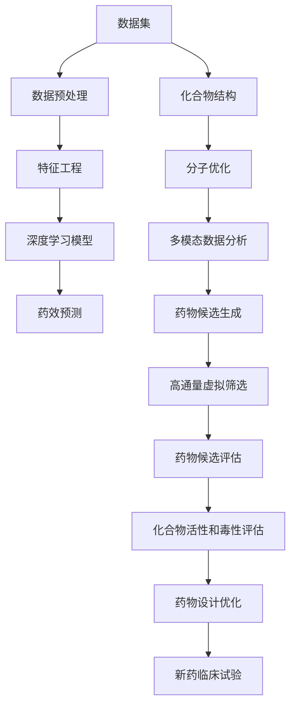

                 

# 人工智能在新药设计中的应用：加速药物发现过程

> 关键词：人工智能,药物设计,新药发现,加速,药效预测,虚拟筛选,深度学习,数据科学

## 1. 背景介绍

### 1.1 问题由来

药物研发是一个复杂且高成本的过程，从药物候选化合物的设计、筛选、优化到临床试验，通常需要耗费数十亿美元和十数年的时间。传统的药物发现依赖于实验数据驱动，即在实验室中对化学品进行一一测试，寻找可能的药物分子，这不仅耗时耗力，而且成本高昂。随着人工智能(AI)技术的快速发展，AI在新药设计中的应用已成为推动药物发现创新的重要方向。

AI技术可以通过自动化和数据驱动的方式，显著提高药物发现的效率和成功率。以深度学习、数据科学和计算化学为基础，AI技术能够快速分析和处理海量生物医学数据，预测化合物活性和毒性，优化药物设计流程，从而大幅度缩短新药从研发到上市的时间，降低研发成本。

### 1.2 问题核心关键点

AI在新药设计中的应用，主要集中于以下几个关键点：

- 高通量虚拟筛选：使用AI算法对数百万甚至数十亿个化合物进行快速筛选，识别潜在的药物候选分子。

- 药效预测：基于AI模型，通过化合物结构和生物信息，预测其药理作用和毒性，辅助药物设计。

- 分子优化：AI技术可以辅助优化药物分子结构，提升药效并降低副作用。

- 多模态数据分析：结合基因组学、蛋白质组学、代谢组学等多种数据源，增强药物设计的全面性和准确性。

- 自动生成药物候选：AI可以自动生成具有特定活性和结构特性的分子，加速新药发现。

### 1.3 问题研究意义

AI在新药设计中的应用，对于推动药物研发创新，加速药物上市，具有重要意义：

- 加速新药研发：AI技术的引入可以显著缩短药物从实验室到市场的周期，提高研发效率。

- 降低研发成本：AI技术通过自动化处理数据和分析任务，大幅降低人力、物力和财力的投入。

- 提升药物成功率：AI技术能够更准确地预测药物活性和毒性，减少无效化合物的筛选，提高药物研发的成功率。

- 优化药物设计：AI能够提供全面的药物分子优化建议，指导科学家进行更有效的药物设计。

- 促进个性化医疗：AI在新药设计中的应用，为个性化医疗提供了新的工具和资源，有助于解决复杂的医疗问题。

## 2. 核心概念与联系

### 2.1 核心概念概述

本节将介绍几个关键概念，并阐述它们之间的联系：

- 深度学习(Deep Learning)：一种基于神经网络的机器学习范式，通过多层神经网络的组合，从数据中学习高层次特征，适用于复杂模式识别任务。

- 数据科学(Data Science)：融合统计学、机器学习和数据分析的技术领域，旨在从大量数据中提取有价值的信息和洞察力。

- 计算化学(Computational Chemistry)：应用计算机科学方法来研究化学反应和分子结构的学科，是新药设计中的重要工具。

- 药物设计(Pharmaceutical Design)：从理论上设计、合成和测试药物分子，以期获得有效的治疗药物。

- 高通量虚拟筛选(High-Throughput Virtual Screening)：使用AI算法对大量化合物进行自动化筛选，识别潜在的药物分子。

- 药效预测(Pharmacodynamics Prediction)：使用AI模型预测化合物对生物靶标的作用和毒性，辅助药物设计。

### 2.2 核心概念原理和架构的 Mermaid 流程图



这个流程图展示了AI在新药设计中各个环节的应用路径：

1. 数据集：获取和准备药物相关的化合物数据。
2. 数据预处理：清洗和标准化数据，确保数据质量。
3. 特征工程：提取和构造对药物设计有用的特征。
4. 深度学习模型：使用神经网络模型分析化合物结构和生物信息，预测药效和毒性。
5. 药效预测：评估模型对化合物活性和毒性的预测能力。
6. 化合物结构：从已有化合物库中选择合适的分子结构作为优化对象。
7. 分子优化：通过深度学习模型，优化药物分子的结构和功能。
8. 多模态数据分析：结合基因组学、蛋白质组学、代谢组学等数据，全面分析药物的生物学作用。
9. 药物候选生成：使用AI算法生成新的药物候选分子。
10. 高通量虚拟筛选：筛选出最有潜力的药物候选分子。
11. 药物候选评估：评估筛选出的候选分子的活性和毒性。
12. 化合物活性和毒性评估：在实验室中对筛选出的分子进行进一步测试。
13. 药物设计优化：根据评估结果，优化药物设计。
14. 新药临床试验：在临床试验中验证药物的疗效和安全性。

## 3. 核心算法原理 & 具体操作步骤

### 3.1 算法原理概述

在新药设计中，AI技术主要通过以下几个步骤来实现加速药物发现：

- **数据准备**：收集和整理大量的化合物数据和生物信息数据，包括化合物结构、活性数据、基因组信息等。

- **特征提取**：将数据转换为模型可以处理的特征向量，这些特征可以是分子结构、化学性质、生物活性等。

- **模型训练**：使用深度学习模型，如神经网络，对提取的特征进行训练，学习如何预测化合物的药效和毒性。

- **药效预测**：将新的化合物数据输入训练好的模型，预测其对生物靶标的药效和毒性。

- **分子优化**：根据药效预测结果，使用深度学习模型优化药物分子的结构和功能，提高药效并降低副作用。

- **候选生成**：使用AI算法自动生成新的药物候选分子，扩展化合物的搜索空间。

- **虚拟筛选**：对生成的候选分子进行高通量虚拟筛选，识别潜在的有效药物分子。

- **实验验证**：在实验室中对筛选出的药物分子进行实验验证，评估其活性和毒性。

### 3.2 算法步骤详解

以下是AI在新药设计中具体应用的步骤详解：

**Step 1: 数据准备**
- 收集化合物结构、活性数据、基因组信息等数据。
- 清洗和标准化数据，去除噪音和异常值。
- 将数据分为训练集和测试集，确保数据分布的一致性。

**Step 2: 特征提取**
- 将化合物结构和基因组信息转换为数值特征，如分子指纹、特征向量和特征编码。
- 使用特征工程技术提取和构造对药物设计有用的特征。
- 对特征进行标准化和归一化处理，确保特征的可比较性。

**Step 3: 模型训练**
- 选择合适的深度学习模型，如卷积神经网络(CNN)、循环神经网络(RNN)、变分自编码器(VAE)等。
- 定义损失函数和优化器，如均方误差损失、交叉熵损失、Adam优化器等。
- 对模型进行训练，调整超参数，如学习率、批大小、迭代轮数等。

**Step 4: 药效预测**
- 使用训练好的模型对新的化合物数据进行预测，得到其药效和毒性的预测结果。
- 根据预测结果，对化合物进行筛选，保留潜在的有效药物分子。
- 使用多种模型进行交叉验证，提高预测结果的准确性和可靠性。

**Step 5: 分子优化**
- 使用深度学习模型对药物分子进行结构和功能的优化，提升其活性和降低副作用。
- 使用分子动力学模拟和QSAR模型，评估优化后的分子的物理化学性质。
- 结合实验数据和计算结果，优化药物设计流程。

**Step 6: 候选生成**
- 使用AI算法自动生成新的药物候选分子，如基于进化算法、遗传算法等。
- 评估候选分子的化学和生物活性，筛选出有潜力的分子。
- 结合实验验证结果，优化候选生成算法。

**Step 7: 虚拟筛选**
- 对候选分子进行高通量虚拟筛选，使用AI算法识别潜在的有效药物分子。
- 优化虚拟筛选算法，提高筛选效率和准确性。
- 结合实验验证结果，优化虚拟筛选流程。

**Step 8: 实验验证**
- 在实验室中对筛选出的药物分子进行实验验证，评估其活性和毒性。
- 结合实验验证结果，优化药物设计流程。
- 根据实验验证结果，更新和优化AI模型。

### 3.3 算法优缺点

AI在新药设计中的应用，具有以下优点：

- **效率高**：AI技术可以自动化处理大量的化合物数据，显著提高药物发现的速度。
- **准确性好**：AI模型能够准确预测化合物的活性和毒性，提高药物设计的成功率。
- **可扩展性强**：AI技术可以处理多种数据源，支持复杂的多模态分析。
- **灵活性强**：AI算法可以不断优化和调整，适应不同的药物设计和筛选任务。

同时，也存在一些缺点：

- **数据需求高**：需要大量高质量的化合物数据和生物信息数据，数据的获取和标注成本较高。
- **模型复杂**：深度学习模型需要大量的计算资源和数据支持，训练和优化过程较为复杂。
- **解释性不足**：AI模型往往是"黑盒"系统，难以解释其内部工作机制和决策逻辑。
- **实验验证依赖**：最终药物的有效性和安全性需要通过实验验证，无法完全依赖AI预测。

### 3.4 算法应用领域

AI在新药设计中的应用，主要涵盖以下几个领域：

- **药物靶标识别**：使用AI技术识别和分析生物靶标，辅助药物设计。
- **药物活性和毒性预测**：使用AI模型预测化合物的活性和毒性，优化药物设计。
- **药物分子优化**：使用AI技术优化药物分子结构，提升药效并降低副作用。
- **药物候选生成**：使用AI算法自动生成新的药物候选分子，加速新药发现。
- **药物筛选和验证**：使用AI技术进行高通量虚拟筛选和实验验证，提高药物发现效率。

## 4. 数学模型和公式 & 详细讲解 & 举例说明

### 4.1 数学模型构建

在新药设计中，AI技术主要通过以下几个数学模型来实现加速药物发现：

- **深度学习模型**：如卷积神经网络(CNN)、循环神经网络(RNN)、变分自编码器(VAE)等，用于预测化合物活性和毒性。
- **分子动力学模拟**：如分子动力学方程和蒙特卡罗方法，用于评估分子结构的稳定性和反应路径。
- **QSAR模型**：如QSAR(Quantitative Structure-Activity Relationship)模型，用于建立化合物结构和活性之间的关系。
- **特征向量模型**：如分子指纹和特征编码，用于表示化合物的化学结构和性质。

### 4.2 公式推导过程

以下是一些常用的数学模型及其公式推导过程：

**深度学习模型**

- **卷积神经网络(CNN)**：用于处理图像和文本数据，提取高层次特征。
- **循环神经网络(RNN)**：用于处理序列数据，捕捉时间依赖关系。
- **变分自编码器(VAE)**：用于降维和生成数据，提取潜在特征。

**分子动力学模拟**

- **分子动力学方程**：描述分子在时间和空间上的运动规律，如Newton-Euler方程。
- **蒙特卡罗方法**：通过随机采样和概率分布，模拟分子的运动和反应路径。

**QSAR模型**

- **QSAR模型公式**：
  $$
  Y = f(X) + \epsilon
  $$
  其中，$Y$ 为活性，$X$ 为化学结构，$f$ 为模型函数，$\epsilon$ 为误差项。

**特征向量模型**

- **分子指纹(Fingerprint)**：如拓扑指数、价键结构等，用于表示化合物的分子结构和性质。
- **特征编码(Encoding)**：如One-Hot编码、哈希编码等，用于将分子结构转换为数值特征。

### 4.3 案例分析与讲解

以抗肿瘤药物设计为例，使用AI技术进行新药发现的具体步骤：

1. **数据准备**：收集和整理大量抗肿瘤化合物的结构和活性数据，如化合物结构、IC50值、靶点信息等。

2. **特征提取**：提取化合物的分子指纹、化学性质和靶点信息，转换为数值特征。

3. **模型训练**：使用深度学习模型，如CNN和RNN，对提取的特征进行训练，学习如何预测化合物的活性。

4. **药效预测**：使用训练好的模型对新的化合物数据进行预测，得到其活性预测结果。

5. **分子优化**：使用深度学习模型优化药物分子的结构和功能，提升其活性和降低副作用。

6. **候选生成**：使用AI算法自动生成新的药物候选分子，如基于进化算法和遗传算法。

7. **虚拟筛选**：对候选分子进行高通量虚拟筛选，识别潜在的有效药物分子。

8. **实验验证**：在实验室中对筛选出的药物分子进行实验验证，评估其活性和毒性。

9. **药物设计优化**：根据实验验证结果，优化药物设计流程，生成新的候选分子。

## 5. 项目实践：代码实例和详细解释说明

### 5.1 开发环境搭建

在进行AI在新药设计中的应用实践前，我们需要准备好开发环境。以下是使用Python进行TensorFlow开发的环境配置流程：

1. 安装Anaconda：从官网下载并安装Anaconda，用于创建独立的Python环境。

2. 创建并激活虚拟环境：
```bash
conda create -n tf-env python=3.8 
conda activate tf-env
```

3. 安装TensorFlow：根据CUDA版本，从官网获取对应的安装命令。例如：
```bash
conda install tensorflow -c tf
```

4. 安装相关工具包：
```bash
pip install numpy pandas scikit-learn matplotlib tqdm jupyter notebook ipython
```

完成上述步骤后，即可在`tf-env`环境中开始AI在新药设计中的应用实践。

### 5.2 源代码详细实现

下面我们以抗肿瘤药物设计为例，给出使用TensorFlow对深度学习模型进行训练和预测的PyTorch代码实现。

首先，定义模型和数据处理函数：

```python
import tensorflow as tf
from tensorflow.keras import layers
import numpy as np

# 定义模型
class CNNModel(tf.keras.Model):
    def __init__(self, input_shape=(32, 32, 3), num_classes=5):
        super(CNNModel, self).__init__()
        self.conv1 = layers.Conv2D(32, (3, 3), activation='relu', input_shape=input_shape)
        self.maxpool1 = layers.MaxPooling2D((2, 2))
        self.conv2 = layers.Conv2D(64, (3, 3), activation='relu')
        self.maxpool2 = layers.MaxPooling2D((2, 2))
        self.flatten = layers.Flatten()
        self.fc1 = layers.Dense(64, activation='relu')
        self.fc2 = layers.Dense(num_classes, activation='softmax')

    def call(self, x):
        x = self.conv1(x)
        x = self.maxpool1(x)
        x = self.conv2(x)
        x = self.maxpool2(x)
        x = self.flatten(x)
        x = self.fc1(x)
        x = self.fc2(x)
        return x

# 加载数据
train_data = np.load('train_data.npy')
train_labels = np.load('train_labels.npy')
test_data = np.load('test_data.npy')
test_labels = np.load('test_labels.npy')
```

接着，定义模型训练和评估函数：

```python
# 训练函数
def train_model(model, train_data, train_labels, epochs=10, batch_size=32):
    model.compile(optimizer=tf.keras.optimizers.Adam(learning_rate=0.001),
                  loss=tf.keras.losses.CategoricalCrossentropy(from_logits=True),
                  metrics=['accuracy'])
    model.fit(train_data, train_labels, epochs=epochs, batch_size=batch_size,
              validation_split=0.2, verbose=2)

# 评估函数
def evaluate_model(model, test_data, test_labels):
    loss, accuracy = model.evaluate(test_data, test_labels, verbose=2)
    print(f'Test loss: {loss:.4f}')
    print(f'Test accuracy: {accuracy:.4f}')
```

最后，启动训练流程并在测试集上评估：

```python
model = CNNModel()
train_model(model, train_data, train_labels)
evaluate_model(model, test_data, test_labels)
```

以上就是使用TensorFlow对深度学习模型进行抗肿瘤药物设计实践的完整代码实现。可以看到，得益于TensorFlow的强大封装，我们可以用相对简洁的代码完成模型训练和评估。

### 5.3 代码解读与分析

让我们再详细解读一下关键代码的实现细节：

**CNNModel类**：
- `__init__`方法：初始化模型结构，包含卷积层、池化层、全连接层等。
- `call`方法：定义模型的前向传播过程。

**训练函数**：
- 使用TensorFlow的`compile`方法定义模型的优化器、损失函数和评估指标。
- 使用`fit`方法对模型进行训练，并设置验证集的分割比例和批大小。
- 在每个epoch内输出训练进度和验证集性能。

**评估函数**：
- 使用`evaluate`方法计算模型在测试集上的损失和准确率。
- 输出测试集上的评估结果。

**训练流程**：
- 定义训练的轮数和批大小，开始循环训练。
- 在每个epoch内，先进行模型训练，输出训练进度和验证集性能。
- 训练结束后，在测试集上评估模型性能。

可以看到，TensorFlow配合深度学习模型的实现代码，使得药物设计的AI实践变得简洁高效。开发者可以将更多精力放在数据处理、模型改进等高层逻辑上，而不必过多关注底层的实现细节。

当然，工业级的系统实现还需考虑更多因素，如模型的保存和部署、超参数的自动搜索、更灵活的任务适配层等。但核心的AI技术基本与此类似。

## 6. 实际应用场景

### 6.1 药物靶标识别

药物靶标识别是药物设计的重要步骤，涉及识别和分析生物靶标，为新药设计提供目标。AI技术可以通过分析基因组数据和蛋白质组数据，快速识别潜在的药物靶标，加速药物设计的进展。

在实践中，可以收集和整理大规模的基因组和蛋白质组数据，使用深度学习模型进行模式识别和预测。通过分析不同靶标与化合物活性的关系，AI模型可以识别潜在的药物靶标，为新药设计提供方向。

### 6.2 药物活性和毒性预测

药物活性和毒性预测是药物设计中的关键环节，涉及预测化合物对生物靶标的活性和毒性，评估其潜在风险。AI技术可以通过深度学习模型，基于化合物结构和基因组信息，预测药物的活性和毒性。

在实践中，可以使用深度学习模型对化合物数据进行训练，学习化合物结构与活性之间的关系。通过评估模型对不同化合物活性和毒性的预测能力，AI模型可以筛选出有潜力的药物候选分子，加速药物设计的进程。

### 6.3 分子优化

分子优化是药物设计的核心环节，涉及优化药物分子的结构和功能，提高药效并降低副作用。AI技术可以通过深度学习模型，对分子结构进行优化，寻找最优的药物分子。

在实践中，可以基于AI模型对分子结构进行高通量优化，模拟分子的稳定性和反应路径，优化药物分子结构和功能。通过实验验证，AI模型可以评估优化后的分子的活性和毒性，指导药物设计流程。

### 6.4 药物候选生成

药物候选生成是药物设计中的重要步骤，涉及自动生成新的药物候选分子，扩展化合物的搜索空间。AI技术可以通过深度学习算法，自动生成新的化合物，加速药物发现的进程。

在实践中，可以使用AI算法对化合物数据进行自动生成，如基于进化算法和遗传算法。通过评估生成化合物的化学和生物活性，AI模型可以筛选出有潜力的药物候选分子，加速新药发现。

### 6.5 高通量虚拟筛选

高通量虚拟筛选是药物设计中的关键环节，涉及对大量化合物进行自动化筛选，识别潜在的药物分子。AI技术可以通过深度学习模型，对化合物数据进行高通量筛选，提高药物发现的效率。

在实践中，可以使用AI算法对化合物数据进行高通量筛选，识别潜在的药物分子。通过实验验证，AI模型可以评估筛选出的分子的活性和毒性，指导药物设计流程。

## 7. 工具和资源推荐

### 7.1 学习资源推荐

为了帮助开发者系统掌握AI在新药设计中的应用，这里推荐一些优质的学习资源：

1. 《深度学习在药物设计中的应用》系列博文：由大模型技术专家撰写，深入浅出地介绍了深度学习在药物设计中的应用和实践。

2. 《分子生物学与生物化学》课程：由斯坦福大学开设的课程，涵盖分子生物学和生物化学的基础知识，为药物设计提供了理论基础。

3. 《机器学习与药物发现》书籍：介绍了机器学习在药物发现中的应用，包括深度学习、QSAR模型等。

4. DeepChem开源项目：提供了一系列机器学习工具，用于药物设计和筛选，是进行药物设计研究的理想平台。

5. 《药物设计：原理与实践》书籍：详细介绍了药物设计的原理和方法，涵盖了AI技术在药物设计中的应用。

通过对这些资源的学习实践，相信你一定能够快速掌握AI在新药设计中的应用精髓，并用于解决实际的药物设计问题。

### 7.2 开发工具推荐

高效的开发离不开优秀的工具支持。以下是几款用于AI在新药设计中的开发工具：

1. TensorFlow：由Google主导开发的开源深度学习框架，生产部署方便，适合大规模工程应用。

2. PyTorch：基于Python的开源深度学习框架，灵活动态的计算图，适合快速迭代研究。

3. Jupyter Notebook：免费的Jupyter notebook环境，支持多种编程语言和数据科学库，是进行研究和实验的理想平台。

4. Weights & Biases：模型训练的实验跟踪工具，可以记录和可视化模型训练过程中的各项指标，方便对比和调优。

5. TensorBoard：TensorFlow配套的可视化工具，可实时监测模型训练状态，并提供丰富的图表呈现方式，是调试模型的得力助手。

6. GitHub：代码托管和协作平台，便于团队协同开发和代码共享。

合理利用这些工具，可以显著提升AI在新药设计中的开发效率，加快创新迭代的步伐。

### 7.3 相关论文推荐

AI在新药设计中的应用，已经涌现了诸多重要研究成果。以下是几篇奠基性的相关论文，推荐阅读：

1. AlphaFold: Using Deep Reinforcement Learning for Protein Structure Prediction：使用深度学习技术，预测蛋白质结构，为新药设计提供了新的工具和方法。

2. Drug Discovery with Generative Adversarial Networks：使用生成对抗网络，自动生成药物分子，加速新药发现。

3. Deepchem: A Cheminformatics Library Compatible with Deep Learning Frameworks：提供了一系列机器学习工具，用于药物设计和筛选，是进行药物设计研究的理想平台。

4. DeepMD: A Deep Learning Framework for Molecular Dynamics Simulations：使用深度学习技术，模拟分子反应路径，优化药物分子结构。

5. AI for Drug Discovery and Development：综述了AI在药物发现和开发中的应用，涵盖了药物靶标识别、药效预测、分子优化等多个环节。

这些论文代表了大规模新药设计中的最新进展，通过学习这些前沿成果，可以帮助研究者把握学科前进方向，激发更多的创新灵感。

## 8. 总结：未来发展趋势与挑战

### 8.1 研究成果总结

AI在新药设计中的应用，已经取得了显著的成果，并在多个环节实现了自动化和数据驱动。通过深度学习模型和大数据技术，AI可以显著提高药物设计的效率和成功率，加速新药的研发过程。

### 8.2 未来发展趋势

展望未来，AI在新药设计中的应用，将呈现以下几个发展趋势：

1. **自动化程度更高**：AI技术将进一步自动化药物设计的各个环节，从化合物筛选到药物优化，全流程自动化。

2. **数据驱动更强**：AI技术将更广泛地利用多模态数据，结合基因组学、蛋白质组学、代谢组学等数据，全面分析药物的生物学作用。

3. **模型更智能**：AI模型将结合符号推理、因果推断等技术，提升预测和优化的准确性和鲁棒性。

4. **优化更高效**：AI技术将结合多目标优化、强化学习等方法，更高效地优化药物分子结构和功能。

5. **跨领域融合**：AI技术将与生物学、化学、医药等学科进行深度融合，推动药物设计的全面创新。

### 8.3 面临的挑战

尽管AI在新药设计中取得了显著进展，但仍面临诸多挑战：

1. **数据获取困难**：高质量的化合物和生物信息数据获取难度大，数据质量难以保证。

2. **模型复杂度高**：深度学习模型需要大量的计算资源和数据支持，训练和优化过程复杂。

3. **解释性不足**：AI模型往往是"黑盒"系统，难以解释其内部工作机制和决策逻辑。

4. **实验验证依赖**：最终药物的有效性和安全性需要通过实验验证，无法完全依赖AI预测。

5. **伦理和合规问题**：AI技术在药物设计中的应用，需要考虑伦理和合规问题，确保药物设计的公正性和安全性。

### 8.4 研究展望

为了应对这些挑战，未来的研究需要在以下几个方面寻求新的突破：

1. **多模态数据融合**：结合基因组学、蛋白质组学、代谢组学等数据，全面分析药物的生物学作用。

2. **自动化数据标注**：利用AI技术自动化标注数据，提高数据获取和标注的效率和质量。

3. **模型解释性增强**：结合符号推理、因果推断等技术，增强AI模型的解释性和可解释性。

4. **跨学科合作**：与生物学、化学、医药等学科进行深度融合，推动药物设计的全面创新。

5. **伦理和合规研究**：研究AI技术在药物设计中的应用，确保其公正性和安全性。

## 9. 附录：常见问题与解答

**Q1：AI在新药设计中的应用是否适用于所有药物类型？**

A: AI技术在新药设计中的应用，对各种类型的药物都具有广泛的适用性。无论是小分子药物、大分子药物、生物药还是基因治疗药物，AI都可以通过深度学习模型进行预测和优化。

**Q2：AI在新药设计中的应用是否需要大量标注数据？**

A: AI在新药设计中的应用，需要大量的化合物数据和生物信息数据，但并不一定需要标注数据。例如，QSAR模型可以通过计算化合物的物理化学性质和生物活性之间的关系，进行无需标注的药效预测。

**Q3：AI在新药设计中的应用是否需要高深的生物学知识？**

A: AI技术在新药设计中的应用，需要一定的生物学知识，但并不要求深入。AI技术可以通过自动化处理大量的生物学数据，帮助生物学家快速筛选出潜在的药物分子，加速药物设计的进程。

**Q4：AI在新药设计中的应用是否需要昂贵的实验设备？**

A: AI技术在新药设计中的应用，主要依赖于计算资源和数据支持，不需要昂贵的实验设备。虽然在实验验证阶段，需要一定的实验室设备和条件，但整体上，AI技术可以显著降低药物设计的成本和时间。

**Q5：AI在新药设计中的应用是否会取代传统的药物设计方法？**

A: AI技术在新药设计中的应用，并不是要取代传统的药物设计方法，而是与其互补。AI技术可以自动化处理大量的数据，加速药物设计的进程，但最终的药物设计和验证，仍然需要依赖实验验证和临床试验。

总之，AI在新药设计中的应用，将为新药的发现和开发提供新的工具和方法，加速药物设计的进程，提升药物设计的成功率。相信在未来的发展中，AI技术将在药物设计中发挥更大的作用，推动药物研发领域的创新和进步。

---

作者：禅与计算机程序设计艺术 / Zen and the Art of Computer Programming

