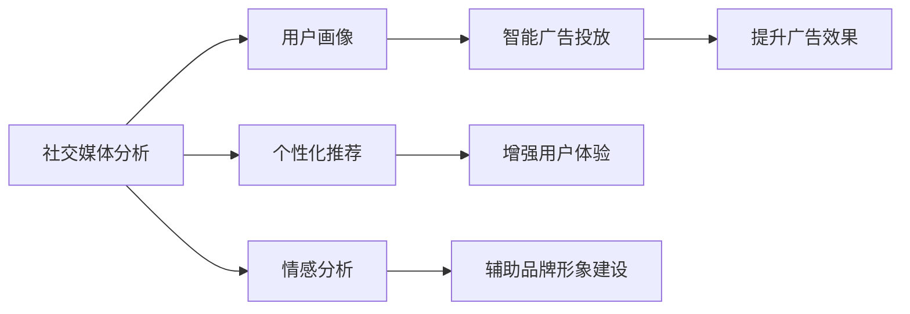

                 

# 人工智能在社交媒体和营销中的应用

## 1. 背景介绍

随着互联网和社交媒体的迅猛发展，人工智能技术在社交媒体和营销领域的应用逐渐成为焦点。社交媒体不仅是一个信息传播的平台，也成为了品牌与消费者互动、影响消费者决策的重要场所。人工智能技术，尤其是自然语言处理、图像识别、推荐系统等，为品牌和商家提供了分析用户行为、个性化推荐产品、提升广告效果等全新的可能性。本文将系统地探讨人工智能技术在社交媒体和营销中的应用，帮助读者了解其原理、操作方法和未来发展趋势。

## 2. 核心概念与联系

### 2.1 核心概念概述

人工智能在社交媒体和营销中的核心概念包括：

- **社交媒体分析**：通过分析用户在社交媒体上的行为数据，如点赞、评论、分享等，了解用户的兴趣和偏好，预测用户行为，从而制定更有效的营销策略。
- **情感分析**：利用自然语言处理技术，分析用户对品牌、产品、事件的情感倾向，辅助品牌形象建设。
- **用户画像**：根据用户在社交媒体上的行为数据、历史记录和互动数据，构建详细的用户画像，帮助品牌更精准地进行市场细分和目标用户定位。
- **智能广告投放**：利用机器学习算法，优化广告投放策略，实现更高的广告点击率和转化率。
- **个性化推荐**：基于用户的历史行为数据和社交网络信息，提供个性化推荐内容，提升用户体验和满意度。

这些概念通过以下Mermaid流程图连接起来：



### 2.2 核心概念原理和架构

#### 2.2.1 社交媒体分析原理

社交媒体分析的核心是数据挖掘和用户行为建模。品牌和商家通过爬虫技术获取用户在社交媒体上的行为数据，使用自然语言处理技术进行文本分析，使用图像识别技术进行视觉分析。然后，利用机器学习算法对数据进行建模，预测用户行为，优化营销策略。

#### 2.2.2 情感分析原理

情感分析通过自然语言处理技术，自动识别和提取文本中的情感信息，并计算情感极性（正面、负面或中性）。一般采用词袋模型、TF-IDF、LSTM等技术实现。

#### 2.2.3 用户画像构建原理

用户画像的构建需要收集和整合用户在社交媒体上的行为数据、社交网络数据、购买记录等。然后，使用聚类算法、分类算法等，将数据分组或分类，构建出详细的用户画像。

#### 2.2.4 智能广告投放原理

智能广告投放通过机器学习算法对用户行为进行预测，如点击率预测、转化率预测等。然后，基于预测结果，优化广告投放策略，如广告的展示位置、展示时间、广告内容等。

#### 2.2.5 个性化推荐原理

个性化推荐系统通过协同过滤、基于内容的推荐、矩阵分解等算法，对用户行为数据进行建模，预测用户对某一物品的兴趣程度，从而提供个性化的推荐内容。

### 2.3 核心概念联系

上述概念通过以下联系紧密相连：

- 社交媒体分析提供用户行为数据，是情感分析、用户画像构建、智能广告投放、个性化推荐的基础。
- 情感分析有助于了解用户对品牌和产品的情感倾向，辅助品牌形象建设。
- 用户画像构建是细分市场、精准定位目标用户的前提。
- 智能广告投放和个性化推荐是提升广告效果和用户体验的重要手段。
- 通过社交媒体分析、情感分析、用户画像构建、智能广告投放和个性化推荐，可以实现从用户数据收集、分析、预测到营销策略制定、广告投放、用户推荐的全流程自动化。

## 3. 核心算法原理 & 具体操作步骤

### 3.1 算法原理概述

人工智能在社交媒体和营销中的应用，涉及多种算法和模型，如自然语言处理、图像识别、机器学习等。以下重点介绍几种核心算法及其原理：

#### 3.1.1 自然语言处理（NLP）

自然语言处理（NLP）是人工智能在社交媒体和营销中应用最广泛的领域。NLP技术包括文本分类、情感分析、命名实体识别、关键词提取等，利用深度学习模型（如RNN、LSTM、Transformer等）进行实现。

#### 3.1.2 图像识别

图像识别技术用于分析用户在社交媒体上发布的图片内容，提取特征信息，进行分类和识别。常用的算法包括卷积神经网络（CNN）、深度残差网络（ResNet）等。

#### 3.1.3 推荐系统

推荐系统通过协同过滤、基于内容的推荐、矩阵分解等算法，对用户行为数据进行建模，预测用户对某一物品的兴趣程度。常用的算法包括Apache Mahout、TensorFlow、PyTorch等。

#### 3.1.4 机器学习

机器学习算法用于预测用户行为、优化广告投放策略、构建用户画像等。常用的算法包括决策树、随机森林、支持向量机、梯度提升树等。

### 3.2 算法步骤详解

#### 3.2.1 数据收集

数据收集是人工智能在社交媒体和营销应用的基础。品牌和商家通过爬虫技术获取用户在社交媒体上的行为数据，如点赞、评论、分享等。对于文本数据，可以使用Python的Scrapy框架；对于图片数据，可以使用OpenCV库。

#### 3.2.2 数据预处理

数据预处理包括数据清洗、特征提取、特征选择等。对于文本数据，可以使用TF-IDF、词袋模型等进行特征提取；对于图片数据，可以使用卷积神经网络进行特征提取。

#### 3.2.3 模型训练

模型训练是人工智能在社交媒体和营销应用的核心步骤。利用训练数据集，选择适当的算法进行模型训练。对于自然语言处理任务，可以使用PyTorch、TensorFlow等深度学习框架；对于图像识别任务，可以使用Keras、TensorFlow等框架。

#### 3.2.4 模型评估

模型评估用于评估训练模型的性能。常用的评估指标包括准确率、召回率、F1值等。通过模型评估，可以调整模型参数，提高模型性能。

#### 3.2.5 模型应用

模型应用是将训练好的模型应用于实际问题中。在社交媒体和营销中，模型可以用于社交媒体分析、情感分析、用户画像构建、智能广告投放、个性化推荐等。

### 3.3 算法优缺点

#### 3.3.1 自然语言处理（NLP）

- **优点**：
  - 可以处理大规模文本数据。
  - 可以自动识别文本中的情感、实体等信息。
  - 可以应用于情感分析、文本分类、命名实体识别等任务。
  
- **缺点**：
  - 对文本数据的质量和量要求较高。
  - 对模型参数调整和超参数选择较为敏感。
  - 处理速度较慢，对高性能计算资源有较高要求。

#### 3.3.2 图像识别

- **优点**：
  - 可以处理大规模图片数据。
  - 对图像数据的采集和标注要求较低。
  - 可以应用于图像分类、物体识别等任务。
  
- **缺点**：
  - 对图像数据的质量要求较高。
  - 需要大量标注数据进行训练。
  - 处理速度较慢，对高性能计算资源有较高要求。

#### 3.3.3 推荐系统

- **优点**：
  - 可以个性化推荐商品、内容等。
  - 可以减少用户选择的时间，提高用户体验。
  - 可以应用于电商、社交网络、视频平台等场景。
  
- **缺点**：
  - 需要大量的用户行为数据。
  - 推荐算法较为复杂，需要大量的计算资源。
  - 容易陷入推荐算法中的冷启动问题。

#### 3.3.4 机器学习

- **优点**：
  - 可以处理各种类型的数据。
  - 可以应用于分类、回归、聚类等任务。
  - 可以应用于广告投放、用户画像构建等任务。
  
- **缺点**：
  - 对数据的质量和量要求较高。
  - 需要大量的计算资源。
  - 需要大量的标注数据进行训练。

### 3.4 算法应用领域

人工智能在社交媒体和营销中的应用，主要包括以下几个领域：

- **社交媒体分析**：用于品牌监测、市场趋势分析、消费者行为预测等。
- **情感分析**：用于品牌形象建设、产品评价分析等。
- **用户画像构建**：用于市场细分、目标用户定位、个性化推荐等。
- **智能广告投放**：用于提升广告效果、优化广告投放策略等。
- **个性化推荐**：用于电商、社交网络、视频平台等场景的推荐系统。

## 4. 数学模型和公式 & 详细讲解 & 举例说明

### 4.1 数学模型构建

#### 4.1.1 社交媒体分析

社交媒体分析的核心是用户行为建模。品牌和商家通过爬虫技术获取用户在社交媒体上的行为数据，如点赞、评论、分享等。然后使用TF-IDF、词袋模型等技术，将文本数据转化为特征向量，最后利用机器学习算法进行建模。

#### 4.1.2 情感分析

情感分析通过自然语言处理技术，自动识别和提取文本中的情感信息，并计算情感极性。一般采用词袋模型、TF-IDF、LSTM等技术实现。公式如下：

$$
S = \sum_{i=1}^{n} w_i \cdot f_i
$$

其中，$S$表示文本的情感得分，$w_i$表示第$i$个词的权重，$f_i$表示第$i$个词的情感极性。

#### 4.1.3 用户画像构建

用户画像的构建需要收集和整合用户在社交媒体上的行为数据、社交网络数据、购买记录等。然后，使用聚类算法、分类算法等，将数据分组或分类，构建出详细的用户画像。公式如下：

$$
U = \{u_1, u_2, \cdots, u_k\}
$$

其中，$U$表示用户画像集合，$u_i$表示第$i$个用户画像。

#### 4.1.4 智能广告投放

智能广告投放通过机器学习算法对用户行为进行预测，如点击率预测、转化率预测等。然后，基于预测结果，优化广告投放策略，如广告的展示位置、展示时间、广告内容等。公式如下：

$$
C = \sum_{i=1}^{n} w_i \cdot y_i
$$

其中，$C$表示广告点击率，$w_i$表示第$i$个特征的权重，$y_i$表示第$i$个特征的预测值。

#### 4.1.5 个性化推荐

个性化推荐系统通过协同过滤、基于内容的推荐、矩阵分解等算法，对用户行为数据进行建模，预测用户对某一物品的兴趣程度。公式如下：

$$
R = \sum_{i=1}^{n} w_i \cdot r_i
$$

其中，$R$表示推荐评分，$w_i$表示第$i$个特征的权重，$r_i$表示第$i$个特征的预测值。

### 4.2 公式推导过程

#### 4.2.1 社交媒体分析

社交媒体分析的数学模型推导如下：

1. 数据收集：通过爬虫技术获取用户在社交媒体上的行为数据，如点赞、评论、分享等。
2. 数据预处理：使用TF-IDF、词袋模型等技术，将文本数据转化为特征向量。
3. 模型训练：选择适当的机器学习算法进行训练。
4. 模型评估：通过交叉验证等方法，评估模型性能。
5. 模型应用：将训练好的模型应用于实际问题中。

#### 4.2.2 情感分析

情感分析的数学模型推导如下：

1. 数据收集：通过爬虫技术获取用户在社交媒体上的评论数据。
2. 数据预处理：使用TF-IDF、词袋模型等技术，将文本数据转化为特征向量。
3. 模型训练：选择适当的深度学习模型进行训练。
4. 模型评估：通过准确率、召回率等指标，评估模型性能。
5. 模型应用：将训练好的模型应用于实际问题中，识别情感极性。

#### 4.2.3 用户画像构建

用户画像构建的数学模型推导如下：

1. 数据收集：通过爬虫技术获取用户在社交媒体上的行为数据、社交网络数据、购买记录等。
2. 数据预处理：使用聚类算法、分类算法等，将数据分组或分类。
3. 模型训练：选择适当的机器学习算法进行训练。
4. 模型评估：通过准确率、召回率等指标，评估模型性能。
5. 模型应用：将训练好的模型应用于实际问题中，构建用户画像。

#### 4.2.4 智能广告投放

智能广告投放的数学模型推导如下：

1. 数据收集：通过爬虫技术获取用户在社交媒体上的行为数据。
2. 数据预处理：使用特征工程等技术，提取特征向量。
3. 模型训练：选择适当的机器学习算法进行训练。
4. 模型评估：通过准确率、召回率等指标，评估模型性能。
5. 模型应用：将训练好的模型应用于实际问题中，优化广告投放策略。

#### 4.2.5 个性化推荐

个性化推荐的数学模型推导如下：

1. 数据收集：通过爬虫技术获取用户在社交媒体上的行为数据。
2. 数据预处理：使用特征工程等技术，提取特征向量。
3. 模型训练：选择适当的推荐算法进行训练。
4. 模型评估：通过准确率、召回率等指标，评估模型性能。
5. 模型应用：将训练好的模型应用于实际问题中，提供个性化推荐。

### 4.3 案例分析与讲解

#### 4.3.1 社交媒体分析案例

某电商品牌通过社交媒体分析技术，对用户的点赞、评论、分享等行为数据进行分析，预测用户的购买行为。具体步骤如下：

1. 数据收集：通过爬虫技术，收集用户在社交媒体上的点赞、评论、分享等行为数据。
2. 数据预处理：使用TF-IDF、词袋模型等技术，将文本数据转化为特征向量。
3. 模型训练：选择适当的机器学习算法进行训练，如随机森林、决策树等。
4. 模型评估：通过交叉验证等方法，评估模型性能。
5. 模型应用：将训练好的模型应用于实际问题中，预测用户的购买行为。

#### 4.3.2 情感分析案例

某品牌通过情感分析技术，分析用户在社交媒体上对品牌的评价，辅助品牌形象建设。具体步骤如下：

1. 数据收集：通过爬虫技术，收集用户在社交媒体上的评论数据。
2. 数据预处理：使用TF-IDF、词袋模型等技术，将文本数据转化为特征向量。
3. 模型训练：选择适当的深度学习模型进行训练，如LSTM、BERT等。
4. 模型评估：通过准确率、召回率等指标，评估模型性能。
5. 模型应用：将训练好的模型应用于实际问题中，识别情感极性，辅助品牌形象建设。

#### 4.3.3 用户画像构建案例

某电商平台通过用户画像构建技术，对用户的购物行为、社交网络数据进行分析，进行市场细分和目标用户定位。具体步骤如下：

1. 数据收集：通过爬虫技术，收集用户在社交媒体上的购物行为、社交网络数据等。
2. 数据预处理：使用聚类算法、分类算法等，将数据分组或分类。
3. 模型训练：选择适当的机器学习算法进行训练，如K-means、DBSCAN等。
4. 模型评估：通过准确率、召回率等指标，评估模型性能。
5. 模型应用：将训练好的模型应用于实际问题中，构建用户画像，进行市场细分和目标用户定位。

#### 4.3.4 智能广告投放案例

某广告主通过智能广告投放技术，对用户的点击率、转化率等行为数据进行分析，优化广告投放策略。具体步骤如下：

1. 数据收集：通过爬虫技术，收集用户在社交媒体上的点击率、转化率等行为数据。
2. 数据预处理：使用特征工程等技术，提取特征向量。
3. 模型训练：选择适当的机器学习算法进行训练，如随机森林、梯度提升树等。
4. 模型评估：通过准确率、召回率等指标，评估模型性能。
5. 模型应用：将训练好的模型应用于实际问题中，优化广告投放策略。

#### 4.3.5 个性化推荐案例

某视频平台通过个性化推荐技术，对用户的观看行为进行分析，推荐用户可能感兴趣的视频内容。具体步骤如下：

1. 数据收集：通过爬虫技术，收集用户在社交媒体上的观看行为数据。
2. 数据预处理：使用特征工程等技术，提取特征向量。
3. 模型训练：选择适当的推荐算法进行训练，如协同过滤、矩阵分解等。
4. 模型评估：通过准确率、召回率等指标，评估模型性能。
5. 模型应用：将训练好的模型应用于实际问题中，提供个性化推荐。

## 5. 项目实践：代码实例和详细解释说明

### 5.1 开发环境搭建

在进行人工智能在社交媒体和营销应用的项目实践前，我们需要准备好开发环境。以下是使用Python进行PyTorch开发的环境配置流程：

1. 安装Anaconda：从官网下载并安装Anaconda，用于创建独立的Python环境。

2. 创建并激活虚拟环境：
```bash
conda create -n pytorch-env python=3.8 
conda activate pytorch-env
```

3. 安装PyTorch：根据CUDA版本，从官网获取对应的安装命令。例如：
```bash
conda install pytorch torchvision torchaudio cudatoolkit=11.1 -c pytorch -c conda-forge
```

4. 安装Transformer库：
```bash
pip install transformers
```

5. 安装各类工具包：
```bash
pip install numpy pandas scikit-learn matplotlib tqdm jupyter notebook ipython
```

完成上述步骤后，即可在`pytorch-env`环境中开始项目实践。

### 5.2 源代码详细实现

以下是一个使用Python的代码实例，展示了如何对社交媒体上的用户行为数据进行分析和建模。

```python
import numpy as np
import pandas as pd
from sklearn.feature_extraction.text import TfidfVectorizer
from sklearn.ensemble import RandomForestClassifier

# 读取数据
data = pd.read_csv('social_media_data.csv')

# 数据预处理
X = data['behavior_data'].values
y = data['purchase_status'].values

# 特征提取
vectorizer = TfidfVectorizer(stop_words='english')
X = vectorizer.fit_transform(X)

# 模型训练
clf = RandomForestClassifier(n_estimators=100)
clf.fit(X, y)

# 模型评估
X_test = vectorizer.transform('test_data')
y_pred = clf.predict(X_test)
print('Accuracy:', np.mean(y_pred == y_test))

# 模型应用
new_data = vectorizer.transform('new_data')
new_pred = clf.predict(new_data)
print('Predicted purchase status:', new_pred)
```

这个代码实例展示了如何对社交媒体上的用户行为数据进行文本特征提取，使用随机森林模型进行建模，并在测试集上评估模型性能，最后对新的用户数据进行预测。

### 5.3 代码解读与分析

让我们再详细解读一下关键代码的实现细节：

**读取数据**：
```python
data = pd.read_csv('social_media_data.csv')
```
- 使用pandas库的read_csv方法，读取社交媒体数据集。

**数据预处理**：
```python
X = data['behavior_data'].values
y = data['purchase_status'].values
```
- 将行为数据和购买状态分别提取出来，用于建模和预测。

**特征提取**：
```python
vectorizer = TfidfVectorizer(stop_words='english')
X = vectorizer.fit_transform(X)
```
- 使用TF-IDF向量化器对行为数据进行特征提取，去除停用词，转化为数值型特征。

**模型训练**：
```python
clf = RandomForestClassifier(n_estimators=100)
clf.fit(X, y)
```
- 使用随机森林模型进行训练，n_estimators参数表示决策树的数量。

**模型评估**：
```python
X_test = vectorizer.transform('test_data')
y_pred = clf.predict(X_test)
print('Accuracy:', np.mean(y_pred == y_test))
```
- 使用测试集对模型进行评估，计算预测准确率。

**模型应用**：
```python
new_data = vectorizer.transform('new_data')
new_pred = clf.predict(new_data)
print('Predicted purchase status:', new_pred)
```
- 对新的用户数据进行预测，返回购买状态。

## 6. 实际应用场景

### 6.1 社交媒体分析

社交媒体分析在品牌监测、市场趋势分析、消费者行为预测等方面有广泛应用。例如，某电商品牌通过社交媒体分析技术，对用户的点赞、评论、分享等行为数据进行分析，预测用户的购买行为。通过社交媒体分析，品牌能够更精准地了解用户的兴趣和需求，制定更加有效的营销策略，提升用户体验。

### 6.2 情感分析

情感分析在品牌形象建设、产品评价分析等方面有重要应用。例如，某品牌通过情感分析技术，分析用户在社交媒体上对品牌的评价，识别情感极性。通过情感分析，品牌能够更准确地了解用户的情感倾向，及时调整产品和服务，提升品牌形象。

### 6.3 用户画像构建

用户画像构建在市场细分、目标用户定位、个性化推荐等方面有广泛应用。例如，某电商平台通过用户画像构建技术，对用户的购物行为、社交网络数据进行分析，进行市场细分和目标用户定位。通过用户画像构建，电商平台能够更精准地了解用户特征，制定更加有效的营销策略，提升用户体验。

### 6.4 智能广告投放

智能广告投放在提升广告效果、优化广告投放策略等方面有重要应用。例如，某广告主通过智能广告投放技术，对用户的点击率、转化率等行为数据进行分析，优化广告投放策略。通过智能广告投放，广告主能够更精准地了解用户行为，提高广告点击率和转化率，提升广告效果。

### 6.5 个性化推荐

个性化推荐在电商、社交网络、视频平台等场景有广泛应用。例如，某视频平台通过个性化推荐技术，对用户的观看行为进行分析，推荐用户可能感兴趣的视频内容。通过个性化推荐，视频平台能够提高用户留存率和观看时长，提升用户体验。

### 6.6 未来应用展望

随着人工智能技术的不断发展，基于社交媒体和营销的应用前景广阔。未来，人工智能将在社交媒体和营销领域发挥更大的作用，具体应用场景包括：

- **智能客服**：利用自然语言处理技术，构建智能客服系统，提升用户服务体验。
- **智能广告投放**：通过机器学习算法，优化广告投放策略，提高广告效果。
- **个性化推荐**：利用推荐系统，提供个性化推荐内容，提升用户体验。
- **市场细分**：通过用户画像构建，进行市场细分和目标用户定位，制定更加有效的营销策略。
- **情感分析**：利用情感分析技术，提升品牌形象建设，增强用户粘性。
- **实时监测**：利用大数据和机器学习技术，实时监测市场动态，及时调整营销策略。

## 7. 工具和资源推荐

### 7.1 学习资源推荐

为了帮助开发者系统掌握人工智能在社交媒体和营销应用的技术基础和实践技巧，这里推荐一些优质的学习资源：

1. 《深度学习》系列课程：由斯坦福大学Andrew Ng教授讲授，涵盖深度学习基本概念和经典模型。

2. 《机器学习实战》书籍：通过实际案例，讲解机器学习算法的应用和实现。

3. 《自然语言处理综论》书籍：介绍自然语言处理的基本原理和经典算法。

4. 《Python数据科学手册》书籍：介绍Python在数据科学和机器学习中的应用。

5. 《TensorFlow官方文档》：TensorFlow的官方文档，包含详细的教程和示例代码。

6. Kaggle：数据科学和机器学习竞赛平台，提供丰富的数据集和实战项目。

通过对这些资源的学习实践，相信你一定能够快速掌握人工智能在社交媒体和营销应用的技术，并用于解决实际的业务问题。

### 7.2 开发工具推荐

高效的开发离不开优秀的工具支持。以下是几款用于人工智能在社交媒体和营销应用开发的常用工具：

1. Python：Python是数据科学和机器学习领域的主流语言，具有丰富的科学计算库和机器学习库。

2. PyTorch：基于Python的开源深度学习框架，灵活高效，适合快速迭代研究。

3. TensorFlow：由Google主导开发的开源深度学习框架，生产部署方便，适合大规模工程应用。

4. Scrapy：Python爬虫框架，用于从社交媒体获取数据。

5. OpenCV：计算机视觉库，用于处理图像数据。

6. Scikit-learn：Python机器学习库，包含多种经典的机器学习算法。

7. Keras：高层神经网络API，方便构建深度学习模型。

合理利用这些工具，可以显著提升人工智能在社交媒体和营销应用开发的效率，加快创新迭代的步伐。

### 7.3 相关论文推荐

人工智能在社交媒体和营销应用的研究源于学界的持续研究。以下是几篇奠基性的相关论文，推荐阅读：

1. "A Survey on Social Media Mining and Statistical Learning"：总结了社交媒体分析的技术和应用，介绍了机器学习在社交媒体分析中的应用。

2. "Sentiment Analysis with Deep Learning: A Survey"：介绍了情感分析技术的基本原理和应用。

3. "User Profiling in Recommendation Systems"：介绍了用户画像构建的技术和应用。

4. "Adaptive Advertising Bidding Algorithms Based on Predictive Modeling"：介绍了智能广告投放的技术和应用。

5. "Personalized Recommendation Algorithms: A Survey"：总结了个性化推荐算法的基本原理和应用。

这些论文代表了大语言模型微调技术的发展脉络。通过学习这些前沿成果，可以帮助研究者把握学科前进方向，激发更多的创新灵感。

## 8. 总结：未来发展趋势与挑战

### 8.1 研究成果总结

人工智能在社交媒体和营销领域的应用已经取得了显著的成果，涵盖社交媒体分析、情感分析、用户画像构建、智能广告投放、个性化推荐等多个方面。通过机器学习、深度学习等技术，品牌和商家能够更精准地了解用户需求，制定更加有效的营销策略，提升用户体验和营销效果。

### 8.2 未来发展趋势

未来，人工智能在社交媒体和营销领域将呈现以下几个发展趋势：

1. **深度学习和大数据技术**：深度学习和大数据技术将进一步发展，提供更加精准的预测和分析能力。

2. **实时化和大规模化**：人工智能应用将进一步实时化和规模化，提升用户体验和营销效果。

3. **多模态融合**：人工智能将进一步融合多模态数据，提升分析能力。

4. **个性化推荐**：个性化推荐将进一步优化，提升用户满意度和留存率。

5. **自动化和智能化**：人工智能将进一步自动化和智能化，减少人工干预，提高效率。

### 8.3 面临的挑战

尽管人工智能在社交媒体和营销领域的应用取得了显著成果，但仍面临诸多挑战：

1. **数据隐私和安全**：数据隐私和安全问题需要解决，保护用户数据不被滥用。

2. **数据质量和多样性**：数据质量和多样性问题需要解决，提高数据训练的准确性。

3. **计算资源**：计算资源问题需要解决，提高训练和推理的效率。

4. **模型解释性**：模型解释性问题需要解决，提高模型的可解释性和可理解性。

### 8.4 研究展望

未来，人工智能在社交媒体和营销领域的研究方向包括：

1. **数据隐私保护**：开发数据隐私保护技术，保护用户数据安全。

2. **多模态融合**：开发多模态融合技术，提升数据分析能力。

3. **模型解释性**：开发模型解释性技术，提高模型的可解释性和可理解性。

4. **自动化和智能化**：开发自动化和智能化技术，提高效率和效果。

## 9. 附录：常见问题与解答

**Q1：如何选择合适的社交媒体平台？**

A: 选择合适的社交媒体平台需要综合考虑品牌定位、目标用户、内容形式等因素。例如，对于年轻人群体，可以选择Instagram、TikTok等平台；对于商务人士，可以选择LinkedIn等平台。

**Q2：如何处理数据隐私和安全问题？**

A: 处理数据隐私和安全问题需要采取多种措施，如数据脱敏、加密、匿名化等。同时，需要建立严格的数据访问控制机制，确保数据不被滥用。

**Q3：如何选择适合的机器学习算法？**

A: 选择适合的机器学习算法需要综合考虑数据量、数据类型、问题类型等因素。例如，对于大规模数据，可以选择随机森林、梯度提升树等算法；对于高维数据，可以选择降维算法。

**Q4：如何优化模型性能？**

A: 优化模型性能需要采取多种措施，如超参数调优、特征工程、模型集成等。同时，需要不断迭代和优化模型，提升模型效果。

**Q5：如何处理冷启动问题？**

A: 处理冷启动问题需要采取多种措施，如利用先验知识、引入多维特征、使用迁移学习等。同时，需要不断积累和丰富数据，提高模型的泛化能力。

通过本文的系统梳理，可以看到，人工智能在社交媒体和营销领域的应用前景广阔，技术不断进步，为品牌和商家提供了更多的可能性和机会。相信随着技术的进一步发展，人工智能在社交媒体和营销领域的应用将更加广泛和深入，带来更多的创新和变革。

