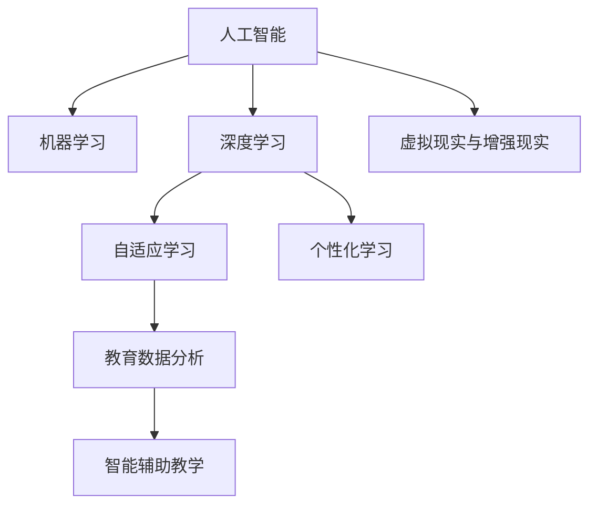

                 

# 人工智能时代的教育变革

在人工智能迅速发展的今天，教育领域正经历着深刻的变革。从传统的知识传授到个性化学习，从在线教育到智能教室，AI技术正在以多种方式重塑教育生态。本文将从多个角度深入探讨人工智能在教育中的应用，以及其对教育行业可能带来的变革。

## 1. 背景介绍

### 1.1 问题由来

随着互联网和智能技术的普及，教育资源和信息获取方式发生了巨大变化。在线教育平台和智能教学工具的兴起，使得学习变得更加个性化和灵活。然而，传统教育模式的僵化与局限性也日益显现。人工智能技术的引入，为教育带来了新的机遇和挑战。

### 1.2 问题核心关键点

1. **个性化学习**：AI能够根据学生的学习情况、兴趣和需求，提供定制化的学习方案，实现因材施教。
2. **自适应学习**：AI系统能够实时监测学生的学习进度和理解情况，调整教学内容和难度。
3. **智能辅助教学**：AI辅助教师进行教学管理和作业批改，提高教学效率。
4. **教育数据分析**：通过分析学习数据，AI可以提供关于学生学习行为的深入洞察，优化教学策略。
5. **虚拟现实与增强现实**：AR/VR技术可以创建沉浸式的学习环境，提高学习兴趣和效果。

### 1.3 问题研究意义

1. **提升教学质量**：AI技术能够提供更高效、更个性化的教学体验，提高学生的学习效果。
2. **实现教育公平**：AI能够跨越地域和资源限制，为更多学生提供优质教育资源。
3. **促进教师成长**：AI辅助教学和评估，减轻教师负担，促进其专业发展。
4. **推动教育创新**：AI技术推动教育模式和技术创新，促进教育行业的持续进步。

## 2. 核心概念与联系

### 2.1 核心概念概述

为更好地理解人工智能在教育中的应用，本节将介绍几个关键概念：

- **人工智能(AI)**：使用机器学习、深度学习等技术，使计算机系统具备模拟人类智能行为的能力。
- **机器学习(Machine Learning, ML)**：通过数据训练模型，使其能够从数据中学习规律并进行预测或分类。
- **深度学习(Deep Learning, DL)**：一种机器学习技术，通过多层次神经网络进行特征学习和复杂模式识别。
- **个性化学习**：根据学生的特点和需求，提供量身定制的学习方案和资源。
- **自适应学习**：根据学生的学习进度和理解能力，动态调整教学内容和难度。
- **教育数据分析**：收集、分析和应用学习数据，以优化教学过程和提高学习效果。

这些核心概念之间存在紧密的联系，共同构成了人工智能在教育应用中的基础框架。通过深入理解这些概念，我们可以更好地把握AI技术在教育中的作用和潜力。

### 2.2 核心概念原理和架构的 Mermaid 流程图



这个流程图展示了AI技术在教育中的应用路径，从基础的机器学习，到更复杂的深度学习，再到具体的教育应用场景，展示了技术从理论到实践的转化过程。

## 3. 核心算法原理 & 具体操作步骤

### 3.1 算法原理概述

人工智能在教育中的核心算法原理主要基于机器学习和深度学习的框架，通过数据驱动的方式，优化教学过程和提升学习效果。

1. **数据准备**：收集学生的学习数据、行为数据、历史表现等，作为模型训练的基础。
2. **模型训练**：使用机器学习算法或深度神经网络，对收集的数据进行训练，构建学习模型。
3. **模型评估**：通过测试集对模型进行评估，验证模型的预测准确性和泛化能力。
4. **模型部署**：将训练好的模型应用到实际教学场景中，进行个性化学习和自适应教学。
5. **持续优化**：根据反馈数据，不断调整和优化模型，提升教学效果。

### 3.2 算法步骤详解

#### 步骤1：数据收集与预处理

- **学生数据**：收集学生的姓名、年龄、性别、兴趣爱好等信息。
- **学习数据**：记录学生的学习进度、测试成绩、作业完成情况等。
- **行为数据**：通过传感器等设备，收集学生的操作行为、表情反应等数据。
- **数据清洗**：去除缺失值、异常值，进行数据标准化处理。

#### 步骤2：模型选择与训练

- **模型选择**：根据任务需求选择合适的机器学习模型或深度神经网络。
- **数据划分**：将数据集划分为训练集、验证集和测试集。
- **参数调优**：选择合适的网络结构、激活函数、损失函数等，优化模型参数。
- **训练过程**：使用训练集数据对模型进行训练，通过反向传播算法更新模型权重。
- **验证与调整**：在验证集上评估模型性能，根据评估结果调整模型参数。

#### 步骤3：模型应用与评估

- **个性化学习**：根据学生的学习数据，调整教学内容和学习路径，实现个性化推荐。
- **自适应学习**：根据学生的实时反馈，动态调整教学难度和内容，实现自适应调整。
- **智能辅助教学**：使用AI系统进行作业批改、学习跟踪等辅助教学工作，提高教学效率。
- **教育数据分析**：通过分析学习数据，了解学生的学习行为和效果，优化教学策略。

### 3.3 算法优缺点

#### 优点：

1. **高效个性化**：AI能够根据学生的特点提供个性化学习方案，提高学习效果。
2. **实时自适应**：AI系统能够实时调整教学内容和难度，适应学生的学习进度。
3. **提高教学效率**：AI辅助教学和管理，减轻教师负担，提高教学效率。
4. **深入数据分析**：通过数据驱动，提供对学习行为的深入洞察，优化教学策略。

#### 缺点：

1. **数据隐私问题**：收集和处理大量学生数据，可能涉及隐私和安全问题。
2. **技术门槛高**：需要具备一定的技术背景和资源，才能有效应用AI技术。
3. **公平性问题**：算法可能存在偏见，影响不同学生群体之间的公平性。
4. **模型解释性差**：AI模型的决策过程缺乏透明性和可解释性，难以理解其内部机制。

### 3.4 算法应用领域

1. **在线教育平台**：如Coursera、edX等，使用AI技术提供个性化课程推荐和智能辅导。
2. **智能教材**：在教材中加入AI技术，实现互动式学习、智能评测等功能。
3. **虚拟教室**：通过AR/VR技术创建沉浸式学习环境，提高学习兴趣和效果。
4. **智能作业批改**：使用AI系统进行作业批改，提供详细反馈和评分建议。
5. **学习数据分析**：通过分析学习数据，优化教学策略和提升学习效果。
6. **智能评估系统**：使用AI技术进行考试评分和评估，提高评估效率和准确性。

## 4. 数学模型和公式 & 详细讲解

### 4.1 数学模型构建

在教育应用中，常见的数学模型包括：

- **线性回归模型**：用于预测学生的学习成绩，公式如下：
$$
\hat{y} = \beta_0 + \beta_1 x_1 + \beta_2 x_2 + \cdots + \beta_n x_n + \epsilon
$$
其中，$\hat{y}$表示预测的学习成绩，$x_i$表示输入特征，$\beta_i$表示特征系数，$\epsilon$表示误差。

- **决策树模型**：用于分类学生的学习状态，公式如下：
$$
\text{Decision Tree} = \text{Root Node} -> \text{Split} -> \text{Leaf Node}
$$
其中，根节点表示整个模型，分裂节点表示特征的划分，叶节点表示最终分类结果。

- **神经网络模型**：用于预测学生的学习行为和效果，公式如下：
$$
\hat{y} = \sigma(\sum_{i=1}^n w_i x_i + b)
$$
其中，$\hat{y}$表示预测结果，$x_i$表示输入特征，$w_i$表示权重，$b$表示偏置，$\sigma$表示激活函数。

### 4.2 公式推导过程

以线性回归模型为例，推导预测学习效果的公式：

1. **数据准备**：假设收集了$N$个学生的数据，每个学生有$m$个特征，公式如下：
$$
\begin{bmatrix} x_{1,1} & x_{1,2} & \cdots & x_{1,m} \\ x_{2,1} & x_{2,2} & \cdots & x_{2,m} \\ \vdots & \vdots & \ddots & \vdots \\ x_{N,1} & x_{N,2} & \cdots & x_{N,m} \end{bmatrix}, \begin{bmatrix} y_{1} \\ y_{2} \\ \vdots \\ y_{N} \end{bmatrix}
$$

2. **特征系数求解**：通过最小二乘法求解$\beta_0, \beta_1, \cdots, \beta_n$，公式如下：
$$
\begin{bmatrix} \sum_{i=1}^n x_{i,j} \\ \sum_{i=1}^n x_{i,j}x_{i,k} \end{bmatrix} = \begin{bmatrix} \sum_{i=1}^n x_{i,j} \\ \sum_{i=1}^n x_{i,j}x_{i,k} \end{bmatrix}, \begin{bmatrix} \sum_{i=1}^n y_i \\ \sum_{i=1}^n x_{i,j}y_i \end{bmatrix}
$$

3. **预测效果计算**：将新学生的特征代入模型，计算预测学习效果，公式如下：
$$
\hat{y} = \beta_0 + \sum_{i=1}^n \beta_i x_{i,j}
$$

### 4.3 案例分析与讲解

以智能作业批改系统为例，解释机器学习模型的应用：

1. **数据准备**：收集学生完成的作业数据，包括题目、答案、时间等。
2. **特征提取**：提取学生的答题速度、正确率、答题思路等特征。
3. **模型训练**：使用监督学习算法训练预测学生答题质量的模型，公式如下：
$$
\hat{y} = \sigma(\sum_{i=1}^n w_i x_i + b)
$$
其中，$x_i$表示输入特征，$w_i$表示权重，$b$表示偏置，$\sigma$表示激活函数。
4. **结果输出**：将新学生的作业输入模型，输出预测的答题质量，并进行详细反馈。

## 5. 项目实践：代码实例和详细解释说明

### 5.1 开发环境搭建

在项目实践前，需要进行环境搭建。以下是使用Python进行开发的环境配置流程：

1. **安装Anaconda**：从官网下载并安装Anaconda，用于创建独立的Python环境。
```bash
conda create -n pyenv python=3.8 
conda activate pyenv
```

2. **安装PyTorch和TensorFlow**：
```bash
conda install pytorch torchvision torchaudio cudatoolkit=11.1 -c pytorch -c conda-forge
conda install tensorflow tensorflow-hub tensorflow-addons
```

3. **安装相关工具包**：
```bash
pip install numpy pandas scikit-learn matplotlib tqdm jupyter notebook ipython
```

完成上述步骤后，即可在`pyenv`环境中开始项目实践。

### 5.2 源代码详细实现

以下是使用PyTorch实现一个简单的个性化学习推荐系统的代码实现。

```python
import torch
import torch.nn as nn
import torch.optim as optim
from torch.utils.data import DataLoader
from sklearn.model_selection import train_test_split

# 定义数据集
class StudentData(torch.utils.data.Dataset):
    def __init__(self, data, labels):
        self.data = data
        self.labels = labels

    def __len__(self):
        return len(self.data)

    def __getitem__(self, idx):
        return self.data[idx], self.labels[idx]

# 定义模型
class LinearRegressionModel(nn.Module):
    def __init__(self, input_size, output_size):
        super(LinearRegressionModel, self).__init__()
        self.linear = nn.Linear(input_size, output_size)

    def forward(self, x):
        return self.linear(x)

# 定义训练函数
def train(model, train_loader, optimizer, num_epochs):
    for epoch in range(num_epochs):
        for batch_idx, (data, target) in enumerate(train_loader):
            optimizer.zero_grad()
            output = model(data)
            loss = nn.MSELoss()(output, target)
            loss.backward()
            optimizer.step()
            if (epoch + 1) % 10 == 0:
                print('Train Epoch: {} [{}/{} ({:.0f}%)]\tLoss: {:.6f}'.format(
                    epoch, batch_idx * len(data), len(train_loader.dataset),
                    100. * batch_idx / len(train_loader), loss.item()))

# 定义测试函数
def test(model, test_loader):
    correct = 0
    total = 0
    with torch.no_grad():
        for data, target in test_loader:
            output = model(data)
            _, predicted = torch.max(output.data, 1)
            total += target.size(0)
            correct += (predicted == target).sum().item()

    print('Accuracy of the network on the test images: {} %'.format(100 * correct / total))

# 加载数据
data = ...
labels = ...
train_data, test_data, train_labels, test_labels = train_test_split(data, labels, test_size=0.5)

# 构建模型
model = LinearRegressionModel(len(train_data[0]), 1)
optimizer = optim.SGD(model.parameters(), lr=0.01)

# 训练模型
train_loader = DataLoader(train_data, batch_size=64, shuffle=True)
test_loader = DataLoader(test_data, batch_size=64, shuffle=False)

train(model, train_loader, optimizer, 100)
test(model, test_loader)
```

### 5.3 代码解读与分析

在代码中，我们首先定义了一个简单的数据集类`StudentData`，用于存储学生的特征和标签。然后，定义了一个线性回归模型`LinearRegressionModel`，用于预测学生的学习效果。使用均方误差损失函数和随机梯度下降优化器进行训练。最后，通过训练和测试函数，评估模型的性能。

## 6. 实际应用场景

### 6.1 智能教材

智能教材通过引入AI技术，提供互动式学习和智能评估，提高教学效果和学生参与度。例如，教材中内置了AI系统，可以实时监测学生的学习进度和理解情况，根据学生的反馈调整教学内容和难度。

### 6.2 在线教育平台

在线教育平台使用AI技术提供个性化课程推荐和智能辅导，帮助学生找到适合自己的课程。平台可以通过分析学生的学习数据，推荐相关的学习资源，并提供智能答疑和辅导。

### 6.3 虚拟教室

虚拟教室使用AR/VR技术创建沉浸式学习环境，提高学生的学习兴趣和效果。例如，通过虚拟现实技术，学生可以进入虚拟实验室，进行实验操作和探索。

### 6.4 未来应用展望

1. **全场景学习**：AI技术将在更多场景中应用，如家庭、社区、企业等，提供全方位、全天候的学习支持。
2. **智能评估体系**：通过AI技术构建智能评估体系，提供更公正、准确的评估结果，减轻教师负担。
3. **教育数据分析**：利用AI技术进行深度数据分析，优化教学策略，提升教育质量。
4. **个性化教育**：AI技术将实现真正的个性化教育，每个学生都有适合自己的学习路径和方案。
5. **跨领域融合**：AI技术与更多领域技术的融合，如物联网、大数据、区块链等，将为教育带来更多创新和变革。

## 7. 工具和资源推荐

### 7.1 学习资源推荐

为了帮助开发者系统掌握AI在教育中的应用，推荐以下学习资源：

1. **《深度学习》课程**：斯坦福大学提供的在线课程，详细讲解了深度学习的基本概念和应用。
2. **《教育数据分析》课程**：Coursera提供的课程，介绍了教育数据分析的基本方法和应用。
3. **《人工智能在教育中的应用》书籍**：介绍了AI技术在教育中的应用案例和实践方法。
4. **HuggingFace官方文档**：提供了丰富的预训练模型和工具，方便进行AI教育应用开发。

### 7.2 开发工具推荐

为了提高AI在教育应用的开发效率，推荐以下开发工具：

1. **PyTorch**：基于Python的开源深度学习框架，支持灵活的动态计算图，适合快速迭代研究。
2. **TensorFlow**：由Google主导开发的深度学习框架，生产部署方便，适合大规模工程应用。
3. **Jupyter Notebook**：提供了交互式的开发环境，方便进行数据处理、模型训练和结果展示。
4. **GitHub**：全球最大的开源社区，提供了丰富的教育AI项目和资源。

### 7.3 相关论文推荐

以下是几篇具有代表性的AI教育应用论文，推荐阅读：

1. **《教育数据挖掘的挑战与未来》**：讨论了教育数据挖掘面临的挑战和未来的发展方向。
2. **《深度学习在个性化学习中的应用》**：介绍了深度学习在个性化学习中的方法和案例。
3. **《基于AI的教育智能平台设计与实现》**：介绍了基于AI的教育智能平台的架构和功能。
4. **《在线教育平台的智能推荐系统》**：介绍了在线教育平台的个性化推荐系统实现方法。

## 8. 总结：未来发展趋势与挑战

### 8.1 研究成果总结

本文对AI在教育中的应用进行了全面系统的探讨，从理论到实践，展示了AI技术在教育中的广泛应用和巨大潜力。通过介绍数据收集、模型训练、模型应用等关键环节，揭示了AI在教育变革中的重要作用。

### 8.2 未来发展趋势

1. **AI教育的普及**：随着AI技术的不断进步，AI教育将在更多学校和企业中得到广泛应用。
2. **个性化教育的实现**：AI技术将实现真正的个性化教育，每个学生都有适合自己的学习路径和方案。
3. **跨领域融合**：AI技术与更多领域技术的融合，将为教育带来更多创新和变革。
4. **智能评估体系的建立**：通过AI技术构建智能评估体系，提供更公正、准确的评估结果。
5. **虚拟现实和增强现实的应用**：AR/VR技术将在更多教育场景中应用，提高学生的学习兴趣和效果。

### 8.3 面临的挑战

1. **数据隐私和安全**：收集和处理学生数据，可能涉及隐私和安全问题。
2. **技术门槛高**：需要具备一定的技术背景和资源，才能有效应用AI技术。
3. **公平性问题**：算法可能存在偏见，影响不同学生群体之间的公平性。
4. **模型解释性差**：AI模型的决策过程缺乏透明性和可解释性，难以理解其内部机制。

### 8.4 研究展望

1. **隐私保护技术**：开发隐私保护技术，确保学生数据的隐私和安全。
2. **公平性算法**：研究和应用公平性算法，减少算法偏见，提升不同学生群体之间的公平性。
3. **可解释性增强**：增强AI模型的可解释性，提高模型的透明度和可信度。
4. **跨领域融合**：将AI技术与更多领域技术结合，实现更全面的教育应用。

## 9. 附录：常见问题与解答

**Q1：AI在教育中的应用主要有哪些？**

A: AI在教育中的应用主要包括以下几个方面：
1. 个性化学习：根据学生的学习数据，提供量身定制的学习方案。
2. 自适应学习：根据学生的学习进度和理解能力，动态调整教学内容和难度。
3. 智能辅助教学：使用AI系统进行作业批改、学习跟踪等辅助教学工作。
4. 教育数据分析：通过分析学习数据，优化教学策略和提升学习效果。

**Q2：AI在教育中存在哪些挑战？**

A: AI在教育中面临的挑战主要包括：
1. 数据隐私问题：收集和处理大量学生数据，可能涉及隐私和安全问题。
2. 技术门槛高：需要具备一定的技术背景和资源，才能有效应用AI技术。
3. 公平性问题：算法可能存在偏见，影响不同学生群体之间的公平性。
4. 模型解释性差：AI模型的决策过程缺乏透明性和可解释性，难以理解其内部机制。

**Q3：AI在教育中的应用前景如何？**

A: AI在教育中的应用前景非常广阔，主要体现在以下几个方面：
1. 提升教学质量：AI技术能够提供更高效、更个性化的教学体验，提高学生的学习效果。
2. 实现教育公平：AI技术能够跨越地域和资源限制，为更多学生提供优质教育资源。
3. 提高教学效率：AI辅助教学和管理，减轻教师负担，提高教学效率。
4. 推动教育创新：AI技术推动教育模式和技术创新，促进教育行业的持续进步。

---

作者：禅与计算机程序设计艺术 / Zen and the Art of Computer Programming

