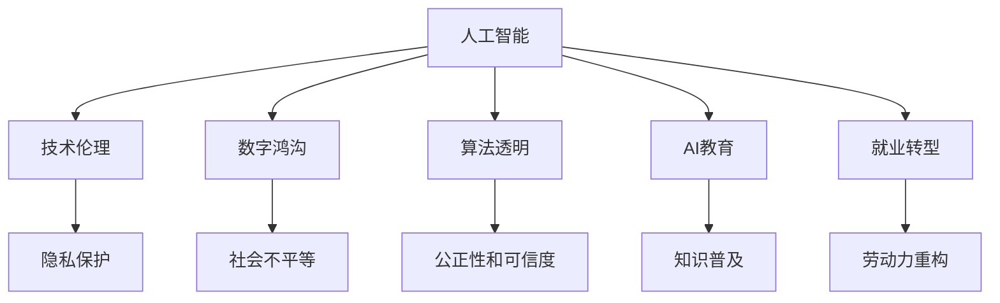

                 

# 人工智能：社会影响与思考

> 关键词：人工智能,社会影响,技术伦理,数字鸿沟,算法透明,人工智能教育,就业转型

## 1. 背景介绍

### 1.1 问题由来
人工智能(AI)技术的飞速发展正在深刻改变全球社会的方方面面。从智能家居到智慧城市，从自动驾驶到个性化推荐，AI在各个领域展现出巨大的潜力，但同时也带来了一系列复杂的社会影响和伦理问题。本文将深入探讨AI技术如何塑造我们的未来，并提出应对策略，确保技术的健康发展。

### 1.2 问题核心关键点
AI技术在提升生产效率、优化决策过程、改善生活质量的同时，也引发了隐私保护、就业影响、技术透明等诸多社会关注点。如何在享受技术红利的同时，妥善应对其带来的挑战，已成为全社会亟待解决的问题。

### 1.3 问题研究意义
理解和解决AI技术引发的社会影响问题，对于推动技术的良性发展，保障公民权益，实现可持续发展具有重要意义。通过深入研究，我们可以制定更加科学合理的技术应用政策，构建公平包容的数字社会。

## 2. 核心概念与联系

### 2.1 核心概念概述

为更好地理解AI技术及其社会影响，本节将介绍几个密切相关的核心概念：

- **人工智能(Artificial Intelligence, AI)**：利用算法和计算能力，模拟人类智能，解决复杂问题的技术体系。包括机器学习、深度学习、自然语言处理等子领域。

- **技术伦理(Ethics of Technology)**：探讨AI技术在应用中涉及的伦理道德问题，如隐私保护、公平性、安全性等。确保技术发展与社会伦理相协调。

- **数字鸿沟(Digital Divide)**：指不同群体间因技术、教育、经济等因素造成的数字资源获取和使用的不均衡现象，加剧了社会不平等。

- **算法透明(Algorithm Transparency)**：指AI模型决策过程的可解释性和可追溯性，保证模型的公正性和可信度。

- **AI教育(AI Education)**：通过教育手段普及AI知识，培养AI人才，提高公众对AI技术的理解和接受度。

- **就业转型(Employment Transition)**：随着AI技术的广泛应用，部分岗位将面临自动化和重构，社会需通过教育和再培训，帮助劳动者顺利转型。

这些核心概念之间的逻辑关系可以通过以下Mermaid流程图来展示：



这个流程图展示了大语言模型的核心概念及其之间的关系：

1. 人工智能通过技术手段模拟人类智能，覆盖了机器学习、深度学习、自然语言处理等众多领域。
2. 技术伦理关注AI应用中的伦理道德问题，确保技术发展与社会价值相一致。
3. 数字鸿沟指不同群体间因技术获取和使用的不均衡现象，反映了社会的不平等。
4. 算法透明涉及AI模型决策过程的可解释性和可追溯性，保证模型的公正性和可信度。
5. AI教育旨在普及AI知识，培养AI人才，提升公众对AI技术的理解和接受度。
6. 就业转型关注AI技术对劳动力市场的影响，需要通过教育和再培训帮助劳动者顺利转型。

这些概念共同构成了AI技术的社会影响框架，帮助我们全面理解AI技术在社会发展中的角色和挑战。

## 3. 核心算法原理 & 具体操作步骤
### 3.1 算法原理概述

AI技术通过算法和计算能力，实现对数据的分析、处理和决策。其核心原理包括但不限于：

- **数据驱动的决策过程**：AI模型通过学习大量数据，提炼出数据中的模式和规律，进行决策。
- **深度学习的神经网络结构**：利用多层神经网络，模拟人脑的神经元处理信息。
- **强化学习的反馈机制**：通过不断试错，优化模型的决策策略。
- **自然语言处理(NLP)**：使机器能够理解和处理人类语言，实现文本分析、情感识别等功能。

### 3.2 算法步骤详解

AI算法的一般步骤包括：

1. **数据收集与预处理**：从各类数据源收集数据，进行清洗、归一化等预处理，确保数据质量。
2. **模型选择与训练**：选择适当的模型架构，如神经网络、支持向量机等，使用训练数据集进行模型训练，优化模型参数。
3. **模型评估与调优**：通过验证数据集评估模型性能，根据评估结果进行模型调优。
4. **模型部署与应用**：将训练好的模型部署到实际应用中，进行推理和决策。

### 3.3 算法优缺点

AI算法具有以下优点：

1. **高效自动化**：AI算法可以高效处理大量数据，实现自动化的决策过程。
2. **精确预测**：通过学习大量数据，AI模型能够实现高精度的预测和决策。
3. **广泛应用**：AI技术已经广泛应用于各个领域，包括医疗、金融、交通等。

但同时，AI算法也存在以下局限：

1. **数据依赖**：AI算法依赖于高质量的数据，数据偏差可能导致模型偏见。
2. **透明性不足**：复杂模型如深度学习模型，其决策过程难以解释，缺乏透明度。
3. **伦理风险**：AI技术可能带来隐私侵犯、歧视等问题，需重视伦理约束。
4. **就业影响**：AI技术的广泛应用可能导致部分岗位自动化，带来就业转型压力。

### 3.4 算法应用领域

AI技术在多个领域展现出广泛的应用前景，具体包括：

- **医疗健康**：AI辅助诊断、个性化治疗、药物研发等，提升医疗服务质量和效率。
- **金融服务**：风险评估、欺诈检测、智能投顾等，优化金融决策过程。
- **智能制造**：质量控制、工艺优化、设备维护等，提升生产效率和质量。
- **智慧交通**：交通流量预测、自动驾驶、智能调度等，提升交通管理水平。
- **教育培训**：智能辅导、作业批改、知识推荐等，个性化教学提升学习效果。
- **公共安全**：人脸识别、异常检测、犯罪预测等，提升公共安全水平。

## 4. 数学模型和公式 & 详细讲解 & 举例说明

### 4.1 数学模型构建

AI算法的数学模型构建通常包括以下几个关键步骤：

1. **特征工程**：从原始数据中提取有用的特征，提升模型的预测能力。
2. **模型训练**：使用训练数据集，优化模型参数，最小化预测误差。
3. **模型评估**：使用验证数据集评估模型性能，避免过拟合。
4. **模型调优**：根据评估结果，调整模型超参数，提升模型效果。

### 4.2 公式推导过程

以线性回归模型为例，推导其最小二乘法的公式推导过程：

假设线性回归模型的目标是拟合一组数据点 $(x_i,y_i)$，其中 $x_i \in \mathbb{R}^d$ 为输入特征，$y_i \in \mathbb{R}$ 为目标变量。模型假设形式为 $y_i = \theta^T x_i + b$，其中 $\theta$ 为模型参数，$b$ 为截距。最小二乘法优化目标函数为：

$$
\min_{\theta} \sum_{i=1}^N (y_i - \theta^T x_i - b)^2
$$

对该目标函数求导，并令导数为0，解得：

$$
\theta = (\sum_{i=1}^N x_i x_i^T)^{-1} \sum_{i=1}^N x_i y_i
$$

$$
b = y_i - \theta^T x_i
$$

该公式展示了线性回归模型的参数求解过程，通过最小化预测误差，得到最优的模型参数。

### 4.3 案例分析与讲解

以下以图像分类为例，展示AI模型的构建和应用：

**问题描述**：给定一组图像数据，通过AI模型自动识别图像中的物体类别。

**解决方案**：使用卷积神经网络(CNN)进行图像分类。具体步骤如下：

1. **数据准备**：收集并标注一组图像数据集，作为训练和验证数据集。
2. **模型构建**：设计一个包含若干卷积层、池化层和全连接层的CNN模型。
3. **模型训练**：将图像数据输入模型，通过反向传播算法优化模型参数。
4. **模型评估**：使用验证数据集评估模型性能，计算准确率、召回率等指标。
5. **模型调优**：根据评估结果，调整模型超参数，提升模型效果。

通过以上步骤，CNN模型能够学习图像中的特征，自动进行分类。在实际应用中，可以通过API接口将模型部署到云端或本地服务器，进行实时图像分类任务。

## 5. 项目实践：代码实例和详细解释说明
### 5.1 开发环境搭建

在进行AI项目开发前，需要搭建开发环境。以下是使用Python进行TensorFlow开发的环境配置流程：

1. 安装Anaconda：从官网下载并安装Anaconda，用于创建独立的Python环境。

2. 创建并激活虚拟环境：
```bash
conda create -n tf-env python=3.8 
conda activate tf-env
```

3. 安装TensorFlow：根据CUDA版本，从官网获取对应的安装命令。例如：
```bash
conda install tensorflow==2.6 -c pytorch -c conda-forge
```

4. 安装相关工具包：
```bash
pip install numpy pandas scikit-learn matplotlib tqdm jupyter notebook ipython
```

完成上述步骤后，即可在`tf-env`环境中开始AI项目开发。

### 5.2 源代码详细实现

下面以图像分类为例，给出使用TensorFlow构建和训练CNN模型的PyTorch代码实现。

```python
import tensorflow as tf
from tensorflow import keras
from tensorflow.keras import layers

# 构建CNN模型
model = keras.Sequential([
    layers.Conv2D(32, 3, activation='relu', input_shape=(28, 28, 1)),
    layers.MaxPooling2D(pool_size=(2, 2)),
    layers.Conv2D(64, 3, activation='relu'),
    layers.MaxPooling2D(pool_size=(2, 2)),
    layers.Flatten(),
    layers.Dense(64, activation='relu'),
    layers.Dense(10, activation='softmax')
])

# 编译模型
model.compile(optimizer='adam', loss='sparse_categorical_crossentropy', metrics=['accuracy'])

# 加载数据集
mnist = keras.datasets.mnist
(train_images, train_labels), (test_images, test_labels) = mnist.load_data()
train_images = train_images.reshape(train_images.shape[0], 28, 28, 1)
train_images, test_images = train_images / 255.0, test_images / 255.0

# 训练模型
model.fit(train_images, train_labels, epochs=10, validation_data=(test_images, test_labels))
```

### 5.3 代码解读与分析

让我们再详细解读一下关键代码的实现细节：

**构建CNN模型**：
- `Sequential`：顺序模型，通过添加多个层来构建模型。
- `Conv2D`：卷积层，用于提取图像特征。
- `MaxPooling2D`：池化层，用于减小特征图大小。
- `Flatten`：扁平化层，将多维特征图转为一维向量。
- `Dense`：全连接层，用于分类输出。

**编译模型**：
- `optimizer`：指定优化器，如Adam优化器。
- `loss`：指定损失函数，如交叉熵损失。
- `metrics`：指定评估指标，如准确率。

**加载数据集**：
- `mnist`：手写数字数据集。
- `load_data`：加载数据集。
- `reshape`：调整数据形状。
- `scale`：将像素值归一化到[0,1]区间。

**训练模型**：
- `fit`：训练模型，指定训练集、验证集和训练轮数。

可以看到，TensorFlow提供了简单易用的API接口，使得模型构建和训练变得非常便捷。开发者可以快速上手，进行图像分类的实验。

## 6. 实际应用场景
### 6.1 智能制造

AI技术在智能制造领域展现出巨大的应用潜力，通过自动化和智能化生产，提升制造业的效率和质量。具体应用包括：

- **质量控制**：利用图像识别和深度学习技术，自动检测产品质量缺陷。
- **工艺优化**：通过数据分析和机器学习，优化生产工艺，减少资源浪费。
- **设备维护**：利用传感器数据和机器学习，预测设备故障，进行预防性维护。

**案例分析**：某汽车制造企业通过AI技术进行质量控制。使用工业相机拍摄车辆外观，通过CNN模型自动识别车辆表面的划痕、油漆脱落等缺陷。模型经过训练后，能够在生产线上实时检测产品质量，减少人工检查的复杂度和错误率，提升生产效率。

### 6.2 智慧交通

智慧交通是AI技术的重要应用场景之一，通过AI技术优化交通管理和调度，提升交通系统的效率和安全性。具体应用包括：

- **交通流量预测**：利用时间序列数据和深度学习模型，预测交通流量变化。
- **自动驾驶**：通过感知、决策和控制技术，实现自动驾驶。
- **智能调度**：利用优化算法和机器学习，优化交通信号灯的控制策略。

**案例分析**：某城市交通管理部门通过AI技术进行交通流量预测。使用GPS数据和气象数据，训练RNN模型预测未来30分钟内各路段的交通流量。系统根据预测结果，动态调整交通信号灯的控制策略，减少拥堵，提高通行效率。

### 6.3 智慧医疗

AI技术在医疗领域展现出广泛的应用前景，通过智能诊断、个性化治疗和药物研发，提升医疗服务质量和效率。具体应用包括：

- **智能诊断**：利用图像识别和深度学习技术，自动检测医学影像中的疾病。
- **个性化治疗**：通过分析患者基因数据和医疗记录，提供个性化治疗方案。
- **药物研发**：利用机器学习和数据挖掘，加速药物筛选和设计。

**案例分析**：某医院利用AI技术进行智能诊断。使用CT扫描数据，训练CNN模型自动识别肺癌病灶。模型经过训练后，能够在临床医生的辅助下，快速识别肺结节，辅助医生进行诊断。

## 7. 工具和资源推荐
### 7.1 学习资源推荐

为了帮助开发者系统掌握AI技术的理论基础和实践技巧，这里推荐一些优质的学习资源：

1. 《深度学习》书籍：由Ian Goodfellow等编著，全面介绍深度学习的基本概念和算法。
2. Coursera《机器学习》课程：斯坦福大学开设的机器学习课程，提供理论基础和实践技巧。
3. TensorFlow官方文档：详细介绍TensorFlow框架的API接口和使用技巧，是AI开发的重要参考资料。
4. Kaggle竞赛平台：提供海量数据集和比赛，助力开发者进行实战练习和经验积累。
5. PyTorch官方文档：提供PyTorch框架的API接口和使用技巧，是深度学习开发的重要工具。

通过对这些资源的学习实践，相信你一定能够快速掌握AI技术的精髓，并用于解决实际的工程问题。

### 7.2 开发工具推荐

高效的开发离不开优秀的工具支持。以下是几款用于AI开发常用的工具：

1. TensorFlow：基于Python的开源深度学习框架，提供强大的计算图功能和分布式训练能力，适用于大规模模型训练。
2. PyTorch：基于Python的开源深度学习框架，灵活动态的计算图，适合快速迭代研究。
3. Jupyter Notebook：交互式的代码编辑器，支持多语言代码编写和可视化展示，是数据科学家的常用工具。
4. Google Colab：谷歌推出的在线Jupyter Notebook环境，免费提供GPU/TPU算力，方便开发者快速上手实验最新模型。
5. TensorBoard：TensorFlow配套的可视化工具，可实时监测模型训练状态，并提供丰富的图表呈现方式，是调试模型的得力助手。

合理利用这些工具，可以显著提升AI项目的开发效率，加快创新迭代的步伐。

### 7.3 相关论文推荐

AI技术的发展源于学界的持续研究。以下是几篇奠基性的相关论文，推荐阅读：

1. 《深度学习》书籍：由Ian Goodfellow等编著，全面介绍深度学习的基本概念和算法。
2. 《自然语言处理综论》书籍：由Christopher Manning等编著，介绍自然语言处理的基本概念和算法。
3. 《机器学习》书籍：由Tom Mitchell编著，介绍机器学习的基本概念和算法。

这些论文代表了大语言模型微调技术的发展脉络。通过学习这些前沿成果，可以帮助研究者把握学科前进方向，激发更多的创新灵感。

## 8. 总结：未来发展趋势与挑战
### 8.1 总结

本文对AI技术及其社会影响进行了全面系统的介绍。首先阐述了AI技术在各领域的广泛应用，明确了其在提升生产效率、优化决策过程、改善生活质量等方面的独特价值。其次，从原理到实践，详细讲解了AI算法的核心步骤，给出了AI项目开发的完整代码实例。同时，本文还广泛探讨了AI技术在医疗、金融、教育等诸多领域的应用前景，展示了AI技术在社会各领域的广泛影响力。

通过本文的系统梳理，可以看到，AI技术正在成为各行业的核心竞争力，但其带来的社会影响和伦理问题也值得高度关注。只有从技术、社会、伦理等多个维度协同发力，才能真正实现AI技术的健康发展。

### 8.2 未来发展趋势

展望未来，AI技术将呈现以下几个发展趋势：

1. **多模态融合**：AI技术将逐步从单一模态转向多模态融合，通过视觉、听觉、文本等多模态数据的整合，提升系统的综合表现。
2. **自监督学习**：利用无标注数据进行自监督学习，提升模型的泛化能力和鲁棒性。
3. **可解释AI**：发展可解释AI技术，增强模型的透明性和可信度，提高公众对AI技术的接受度。
4. **伦理与公平**：重视AI技术的伦理约束，确保技术应用的公平性和公正性，避免数据偏见和算法歧视。
5. **人机协作**：发展人机协作AI技术，将AI技术与人类智能相结合，实现更高效、更可靠的系统。

以上趋势凸显了AI技术的未来发展方向，必将进一步推动AI技术在社会各领域的深入应用。

### 8.3 面临的挑战

尽管AI技术已经取得了瞩目成就，但在迈向更加智能化、普适化应用的过程中，它仍面临诸多挑战：

1. **数据隐私和安全**：AI模型需要大量数据进行训练，如何保护用户隐私和数据安全，是一个重要问题。
2. **模型鲁棒性和泛化性**：面对真实世界的复杂性，AI模型的鲁棒性和泛化能力仍需进一步提升。
3. **就业转型和经济影响**：AI技术的广泛应用可能导致部分岗位自动化，需通过教育和再培训，帮助劳动者顺利转型。
4. **伦理和社会责任**：AI技术的应用需考虑伦理和社会责任，避免偏见和歧视，确保技术应用的公平性和公正性。

这些挑战需要全社会共同努力，才能确保AI技术的健康发展。

### 8.4 研究展望

面对AI技术面临的挑战，未来的研究需要在以下几个方面寻求新的突破：

1. **隐私保护技术**：发展隐私保护技术，确保数据使用的安全性，保护用户隐私。
2. **鲁棒性和泛化性**：研究鲁棒性和泛化性技术，提升模型的鲁棒性和泛化能力。
3. **公平性算法**：研究公平性算法，确保AI技术的公平性和公正性，避免算法歧视。
4. **人机协作技术**：发展人机协作技术，将AI技术与人类智能相结合，实现更高效、更可靠的系统。

这些研究方向将进一步推动AI技术的健康发展，确保其造福全人类。

## 9. 附录：常见问题与解答

**Q1：AI技术如何提升生产效率？**

A: AI技术通过自动化和智能化生产，优化生产流程，减少人工干预，提升生产效率。例如，在智能制造中，使用机器视觉技术自动检测产品质量，提高检测速度和准确率；利用机器学习算法优化生产工艺，减少资源浪费，提高生产效率。

**Q2：AI技术在医疗领域的应用有哪些？**

A: AI技术在医疗领域广泛应用于智能诊断、个性化治疗和药物研发。例如，利用图像识别技术自动检测医学影像中的疾病，如肺结节、乳腺癌等；通过分析患者基因数据和医疗记录，提供个性化治疗方案；利用机器学习和数据挖掘，加速药物筛选和设计。

**Q3：如何提高AI模型的透明性和可信度？**

A: 提高AI模型的透明性和可信度，需要从模型设计和训练两个方面入手。在设计模型时，应尽量使用简单的结构，降低模型的复杂性，提高可解释性。在训练模型时，应记录模型的训练过程和超参数设置，便于后期分析和调试。此外，还可以引入可解释性技术，如LIME、SHAP等，辅助解释模型的决策过程。

**Q4：AI技术如何应用于智慧交通？**

A: AI技术在智慧交通领域主要用于交通流量预测、自动驾驶和智能调度。例如，利用深度学习模型预测未来交通流量，动态调整交通信号灯的控制策略，减少拥堵；利用感知、决策和控制技术，实现自动驾驶；利用优化算法和机器学习，优化交通信号灯的控制策略，提高通行效率。

**Q5：如何应对AI技术带来的就业转型问题？**

A: 应对AI技术带来的就业转型问题，需通过教育和再培训，帮助劳动者顺利转型。具体措施包括：
1. 制定教育和培训计划，提高劳动者的技术技能，使其适应新的岗位需求。
2. 提供职业转换支持，帮助劳动者了解AI技术的应用场景，选择合适的职业方向。
3. 建立终身学习体系，鼓励劳动者持续学习，提高自身竞争力。

通过以上措施，可以有效应对AI技术带来的就业转型问题，实现社会的平稳过渡。

---

作者：禅与计算机程序设计艺术 / Zen and the Art of Computer Programming

