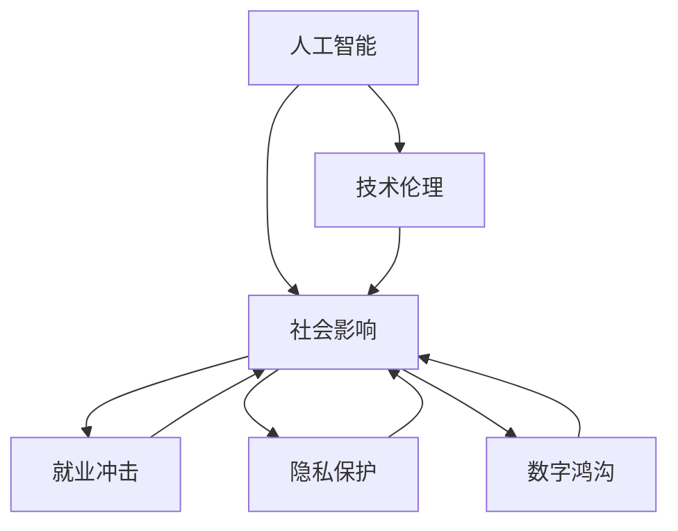

                 

# 人工智能：社会影响与思考

> 关键词：人工智能(AI), 社会影响, 技术伦理, 就业冲击, 创新驱动, 隐私保护, 数字鸿沟

## 1. 背景介绍

### 1.1 问题由来
随着人工智能(AI)技术的快速发展，其在社会各个领域的渗透应用日益广泛，从智能客服到医疗诊断，从自动驾驶到金融风控，AI正在深刻影响和改变人类社会的方方面面。然而，伴随AI技术的快速普及，其引发的社会影响也日益显著，从技术伦理到就业结构，从隐私保护到数字鸿沟，AI技术的应用呈现出多元而复杂的局面。本文旨在全面探讨AI技术的社会影响，从多个维度揭示其对社会的深远影响，并提出相应的应对策略和思考建议。

## 2. 核心概念与联系

### 2.1 核心概念概述

为更好地理解AI技术的社会影响，本节将介绍几个关键概念：

- 人工智能(AI)：以机器学习和深度学习为代表的技术体系，赋予机器模仿和超越人类智能的能力，涵盖了从感知、理解到推理、生成等全面的人工智能系统。

- 社会影响：AI技术在商业、医疗、教育、法律等多个领域的广泛应用，带来了正面的经济效益和社会效益，但也伴随着诸如就业冲击、隐私泄露等负面影响。

- 技术伦理：涉及AI技术开发、应用过程中的伦理问题，包括数据隐私、算法透明、公平性等议题，是确保AI技术健康发展的重要保障。

- 就业冲击：AI技术自动化替代了部分传统工作岗位，引起就业结构的重大变化，对劳动市场产生深远影响。

- 隐私保护：AI技术在数据收集和处理过程中，需严格遵守隐私保护法律法规，防止数据滥用和泄露，保障个人隐私安全。

- 数字鸿沟：AI技术的高门槛和高成本，导致不同群体间数字能力的差距进一步扩大，加剧了社会不平等现象。

这些核心概念之间的逻辑关系可以通过以下Mermaid流程图来展示：



这个流程图展示了AI技术的核心概念及其与社会影响的联系：

1. AI技术在各个领域的应用，带来了正面的经济效益和社会效益，也带来了就业冲击、隐私保护和数字鸿沟等负面影响。
2. 技术伦理作为AI技术的指南针，指导其在开发和应用过程中遵循伦理原则，避免负面影响。
3. 就业冲击、隐私保护和数字鸿沟等问题，需要通过多方面的政策和技术手段加以缓解和解决。

## 3. 核心算法原理 & 具体操作步骤

### 3.1 算法原理概述

AI技术对社会的广泛影响，可以从其核心算法原理和具体操作步骤两个方面进行深入分析。

### 3.2 算法步骤详解

**Step 1: 收集数据并预处理**
- 基于不同领域的任务需求，收集数据集，并进行数据清洗、标注等预处理操作，确保数据质量和多样性。
- 使用多种数据增强技术，如数据合成、数据扩充等，增加数据集的规模和多样性。

**Step 2: 模型选择与训练**
- 根据任务需求，选择合适的AI模型，如CNN、RNN、Transformer等。
- 使用优化算法(如SGD、Adam等)和损失函数(如交叉熵、均方误差等)训练模型，调整超参数，优化模型性能。

**Step 3: 评估与优化**
- 在验证集上进行模型评估，使用精确率、召回率、F1-score等指标评估模型性能。
- 根据评估结果，调整模型结构或参数，进行模型优化，提高模型精度和泛化能力。

**Step 4: 部署与应用**
- 将训练好的模型部署到实际应用环境中，如服务器、移动端等。
- 监控模型性能，定期更新模型参数，保持模型的高效性和准确性。

### 3.3 算法优缺点

AI技术的社会影响，具有以下优缺点：

**优点：**

1. 提高效率和生产力：AI技术可以自动完成大量重复性、高精度的工作，提升生产效率，降低成本。
2. 创新驱动：AI技术不断推动技术进步，催生新的商业机会和产业变革。
3. 增强决策支持：AI技术可提供数据驱动的决策支持，帮助企业制定更科学的战略决策。

**缺点：**

1. 就业冲击：AI技术自动化替代了部分传统岗位，导致失业问题。
2. 数据隐私：AI技术在数据处理过程中可能泄露个人隐私，引发隐私保护问题。
3. 数字鸿沟：AI技术的高门槛和高成本，加剧了不同群体间的数字不平等。
4. 技术伦理：AI技术在决策过程中可能存在算法偏见，导致不公正和歧视问题。

### 3.4 算法应用领域

AI技术在多个领域得到了广泛应用，具体包括：

- 智能制造：通过自动化和智能化技术提升生产效率和产品质量。
- 医疗健康：利用AI技术进行疾病诊断、个性化治疗和健康管理。
- 金融服务：使用AI技术进行风险评估、欺诈检测和智能投顾。
- 教育培训：AI技术推动个性化学习、智能辅导和智能评估。
- 智能客服：通过自然语言处理技术实现智能对话和问题解答。

## 4. 数学模型和公式 & 详细讲解 & 举例说明

### 4.1 数学模型构建

在AI技术的社会影响研究中，数学模型构建尤为重要。

**模型构建过程：**
1. **数据采集与预处理**：收集不同领域的数据集，并进行数据清洗和预处理。
2. **模型选择与训练**：选择合适的模型，并使用优化算法进行模型训练。
3. **模型评估与优化**：使用评估指标对模型进行评估，并进行优化。

**模型应用过程：**
1. **模型部署与应用**：将训练好的模型部署到实际应用环境中。
2. **模型监控与维护**：监控模型性能，定期更新模型参数，保持模型的高效性和准确性。

### 4.2 公式推导过程

**数据采集与预处理：**
$$
D = \{(x_i, y_i)\}_{i=1}^N, x_i \in X, y_i \in Y
$$

**模型选择与训练：**
$$
\theta^* = \mathop{\arg\min}_{\theta} \mathcal{L}(\theta, D)
$$

**模型评估与优化：**
$$
\text{Precision} = \frac{TP}{TP+FP}, \quad \text{Recall} = \frac{TP}{TP+FN}, \quad \text{F1-score} = 2\frac{\text{Precision} \times \text{Recall}}{\text{Precision} + \text{Recall}}
$$

**模型部署与应用：**
$$
\text{Model} = \text{DeployModel}(D)
$$

**模型监控与维护：**
$$
\text{ModelUpdate}(\text{Model}, D)
$$

## 5. 项目实践：代码实例和详细解释说明

### 5.1 开发环境搭建

在进行AI技术社会影响研究时，需要搭建相应的开发环境。以下是Python开发环境搭建的流程：

1. **安装Anaconda**：从官网下载并安装Anaconda，用于创建独立的Python环境。
2. **创建虚拟环境**：
```bash
conda create -n aistudy python=3.8 
conda activate aistudy
```
3. **安装依赖库**：
```bash
conda install numpy pandas matplotlib scikit-learn
```

### 5.2 源代码详细实现

以下是使用Python进行AI技术社会影响研究的具体代码实现。

```python
import numpy as np
import pandas as pd
from sklearn.model_selection import train_test_split
from sklearn.metrics import precision_score, recall_score, f1_score

# 数据集采集与预处理
data = pd.read_csv('data.csv')
data['label'] = data['label'].map({'positive': 1, 'negative': 0})
X = data[['feature1', 'feature2']]
y = data['label']
X_train, X_test, y_train, y_test = train_test_split(X, y, test_size=0.2, random_state=42)

# 模型训练与评估
from sklearn.linear_model import LogisticRegression
model = LogisticRegression()
model.fit(X_train, y_train)
y_pred = model.predict(X_test)
precision = precision_score(y_test, y_pred)
recall = recall_score(y_test, y_pred)
f1 = f1_score(y_test, y_pred)
print(f'Precision: {precision:.2f}, Recall: {recall:.2f}, F1-score: {f1:.2f}')
```

### 5.3 代码解读与分析

**数据集采集与预处理：**
- 使用Pandas库读取数据集，并进行数据清洗和标注处理。
- 使用Scikit-learn的train_test_split函数，将数据集分为训练集和测试集。

**模型训练与评估：**
- 使用Scikit-learn的LogisticRegression模型进行训练，计算精确率、召回率和F1-score。
- 输出模型评估结果，评估模型性能。

## 6. 实际应用场景

### 6.1 智能制造

AI技术在智能制造中的应用，显著提升了生产效率和产品质量。通过自动化生产线、智能设备和大数据分析，AI技术可以实现设备状态监测、故障预测和预防性维护，显著降低生产成本和停机时间。

### 6.2 医疗健康

AI技术在医疗健康领域的应用，推动了医疗服务的智能化和个性化。利用AI技术进行疾病诊断、图像识别和智能推荐，AI技术提高了医疗诊断的准确性和效率，为患者提供了更好的医疗体验。

### 6.3 金融服务

AI技术在金融服务中的应用，带来了智能投顾、风险评估和欺诈检测等新功能。通过大数据分析和机器学习算法，AI技术帮助金融机构提升了风险控制能力，降低了欺诈风险。

### 6.4 教育培训

AI技术在教育培训中的应用，推动了个性化学习和智能辅导的发展。通过智能推荐系统和智能评估工具，AI技术帮助教师和学生更高效地进行教学和学习，提升了教育质量和学习效果。

### 6.5 智能客服

AI技术在智能客服中的应用，实现了自动化客户服务和问题解答。通过自然语言处理和机器学习技术，AI技术能够理解客户需求，提供精准的解决方案，提高了客户满意度和企业服务效率。

## 7. 工具和资源推荐

### 7.1 学习资源推荐

为了帮助开发者系统掌握AI技术的社会影响，以下推荐一些优质的学习资源：

1. **《人工智能：一种现代方法》**：该书系统介绍了AI技术的基本概念和应用场景，适合初学者入门。
2. **Coursera《机器学习》课程**：由斯坦福大学开设的机器学习课程，包含多个AI应用案例，适合进阶学习。
3. **DeepLearning.AI的《深度学习专项课程》**：由Andrew Ng主讲的深度学习课程，涵盖了从基础到高级的AI技术，适合深入学习。
4. **IEEE《人工智能伦理与社会影响》期刊**：该期刊专注于AI技术的伦理和社会影响研究，提供了最新的研究成果和案例分析。
5. **Kaggle平台**：该平台提供了大量的AI技术竞赛和数据集，帮助开发者实践和提升AI技术能力。

通过这些学习资源的学习实践，相信你一定能够全面掌握AI技术的社会影响，并应用于实际应用场景中。

### 7.2 开发工具推荐

高效的开发离不开优秀的工具支持。以下是几款用于AI技术社会影响研究的常用工具：

1. **Python**：Python是目前最流行的AI开发语言，具有丰富的科学计算和机器学习库。
2. **Scikit-learn**：Scikit-learn是一个开源的机器学习库，提供了多种算法和工具，适合数据处理和模型训练。
3. **TensorFlow**：由Google主导开发的深度学习框架，支持大规模模型的训练和部署。
4. **PyTorch**：Facebook开发的深度学习框架，支持动态计算图，适合快速迭代研究。
5. **Jupyter Notebook**：一个交互式的编程环境，适合数据探索和模型评估。

合理利用这些工具，可以显著提升AI技术社会影响研究的开发效率，加快创新迭代的步伐。

### 7.3 相关论文推荐

AI技术对社会的广泛影响，引发了众多学者的研究兴趣。以下是几篇奠基性的相关论文，推荐阅读：

1. **《人工智能的未来》**：由AI领域的知名专家撰写，深入探讨了AI技术的未来趋势和社会影响。
2. **《机器学习：算法+应用》**：该书系统介绍了机器学习的基本算法和应用场景，适合初学者入门。
3. **《AI伦理与法律》**：该书探讨了AI技术的伦理和社会影响，提出了相应的法律和政策建议。
4. **《AI伦理与社会挑战》**：该论文讨论了AI技术在就业、隐私保护等方面面临的伦理和社会挑战。
5. **《机器学习与数据隐私》**：该论文探讨了机器学习在数据隐私保护方面的应用和挑战。

这些论文代表了大AI技术社会影响研究的最新进展。通过学习这些前沿成果，可以帮助研究者把握学科前进方向，激发更多的创新灵感。

## 8. 总结：未来发展趋势与挑战

### 8.1 总结

本文对AI技术的社会影响进行了全面系统的介绍。首先阐述了AI技术的广泛应用及其带来的正负面影响，揭示了技术伦理、就业冲击、隐私保护和数字鸿沟等多个领域的挑战。其次，从原理到实践，详细讲解了AI技术的应用流程，并给出了具体的代码实现示例。同时，本文还探讨了AI技术在不同领域的应用场景，展示了其巨大的应用潜力。最后，本文精选了AI技术的各类学习资源和开发工具，力求为读者提供全方位的技术指引。

通过本文的系统梳理，可以看到，AI技术在社会各个领域的广泛应用，既带来了巨大的经济效益和社会效益，也伴随着诸多挑战和伦理问题。未来，AI技术需要进一步探索和优化，以实现更公平、透明和可持续的发展。

### 8.2 未来发展趋势

展望未来，AI技术的社会影响将呈现以下几个发展趋势：

1. **AI技术普及化**：AI技术将进一步普及到各个领域，推动社会全面智能化。
2. **伦理与社会治理**：AI技术的伦理和社会治理问题将逐渐引起重视，相关法律法规将逐步完善。
3. **跨学科融合**：AI技术与各个学科的深度融合，将推动更多跨学科研究和创新。
4. **智能与人类协同**：AI技术与人类协同工作的模式将逐步成熟，提升工作效率和生活质量。
5. **全球化合作**：各国在AI技术领域的合作将更加紧密，共同应对全球性挑战。

以上趋势凸显了AI技术的广泛影响及其未来的发展方向。这些方向的探索发展，必将进一步推动AI技术的进步，为人类社会带来更多福祉。

### 8.3 面临的挑战

尽管AI技术在社会各个领域的应用日益广泛，但在迈向更加智能化、普适化应用的过程中，仍面临诸多挑战：

1. **伦理与社会问题**：AI技术的伦理和社会问题尚未完全解决，如数据隐私、算法偏见等，仍需进一步研究和规范。
2. **技术与教育差距**：AI技术的高门槛和高成本，加剧了技术与教育的不平等，导致数字鸿沟扩大。
3. **安全性与可靠性**：AI技术的决策过程缺乏透明性和可解释性，存在安全隐患和可靠性问题。
4. **法律与政策监管**：AI技术的快速普及，需要配套的法律和政策监管机制，保障技术应用的安全和公平。
5. **技术与产业协同**：AI技术与各个产业的深度融合，需要跨产业的协同合作，提升整体创新能力。

这些挑战凸显了AI技术在社会各个领域的复杂性和复杂性。需要在技术、伦理、法律和政策等多个层面协同发力，才能实现AI技术的健康发展。

### 8.4 研究展望

未来，AI技术的社会影响研究需要在以下几个方面寻求新的突破：

1. **伦理与社会影响研究**：加强AI技术的伦理与社会影响研究，提出更多有针对性的政策和规范。
2. **技术与教育融合**：推动AI技术与教育的深度融合，缩小数字鸿沟，提升全民AI素养。
3. **安全性与可靠性研究**：增强AI技术的安全性和可靠性，提升系统的透明性和可解释性。
4. **跨学科与全球合作**：加强AI技术与各个学科的深度融合，推动全球化合作，共同应对全球性挑战。
5. **技术与产业协同**：推动AI技术与各个产业的深度融合，提升整体创新能力，实现可持续发展。

这些研究方向的探索，必将引领AI技术社会影响研究的进一步发展，为构建更加公平、透明、可持续的AI技术应用奠定基础。面向未来，AI技术需要进一步探索和优化，以实现更公平、透明和可持续的发展。

## 9. 附录：常见问题与解答

**Q1：AI技术对社会的影响有哪些？**

A: AI技术对社会的影响是多方面的，主要包括以下几个方面：

1. **提高效率和生产力**：AI技术可以自动完成大量重复性、高精度的工作，提升生产效率，降低成本。
2. **创新驱动**：AI技术不断推动技术进步，催生新的商业机会和产业变革。
3. **增强决策支持**：AI技术可提供数据驱动的决策支持，帮助企业制定更科学的战略决策。
4. **就业冲击**：AI技术自动化替代了部分传统岗位，导致失业问题。
5. **数据隐私**：AI技术在数据处理过程中可能泄露个人隐私，引发隐私保护问题。
6. **数字鸿沟**：AI技术的高门槛和高成本，加剧了不同群体间的数字不平等。
7. **技术伦理**：AI技术在决策过程中可能存在算法偏见，导致不公正和歧视问题。

**Q2：如何缓解AI技术带来的就业冲击？**

A: 缓解AI技术带来的就业冲击，可以采取以下措施：

1. **技能培训**：为失业人群提供技能培训，提升其再就业能力。
2. **政策支持**：政府出台相关政策，帮助失业人群重新就业。
3. **跨界就业**：推动跨界就业，引导失业人群转向其他领域。
4. **自动化替代**：采用自动化技术替代部分简单、重复性工作，提高工作效率。
5. **职业转型**：通过职业转型，将失业人群转向更有前景的领域。

**Q3：如何保护AI技术中的数据隐私？**

A: 保护AI技术中的数据隐私，可以采取以下措施：

1. **数据加密**：采用数据加密技术，保护数据在传输和存储过程中的安全性。
2. **隐私保护算法**：使用隐私保护算法，如差分隐私、同态加密等，保护用户隐私。
3. **数据匿名化**：对数据进行匿名化处理，保护用户隐私。
4. **法律监管**：制定相关法律法规，规范AI技术中数据的使用和管理。
5. **透明度和可解释性**：增强AI技术的透明度和可解释性，让用户了解数据的使用和保护情况。

**Q4：如何缩小AI技术带来的数字鸿沟？**

A: 缩小AI技术带来的数字鸿沟，可以采取以下措施：

1. **普及基础教育**：普及基础教育，提升全民数字素养。
2. **提供免费资源**：提供免费的AI学习资源，降低学习门槛。
3. **政府补贴**：政府提供补贴，支持低收入人群购买AI设备和学习工具。
4. **社区支持**：建立社区支持网络，帮助低收入人群学习和使用AI技术。
5. **跨界合作**：推动跨界合作，共同推动AI技术的普及和应用。

**Q5：如何增强AI技术的伦理与社会责任？**

A: 增强AI技术的伦理与社会责任，可以采取以下措施：

1. **伦理审查**：建立AI技术的伦理审查机制，确保技术应用符合伦理规范。
2. **透明性和可解释性**：增强AI技术的透明性和可解释性，让用户了解技术决策过程。
3. **社会责任**：推动AI技术承担社会责任，为社会提供更多福祉。
4. **法律与政策监管**：制定相关法律法规，规范AI技术的应用和管理。
5. **伦理教育**：加强AI技术的伦理教育，提升从业人员的伦理意识。

---

作者：禅与计算机程序设计艺术 / Zen and the Art of Computer Programming

