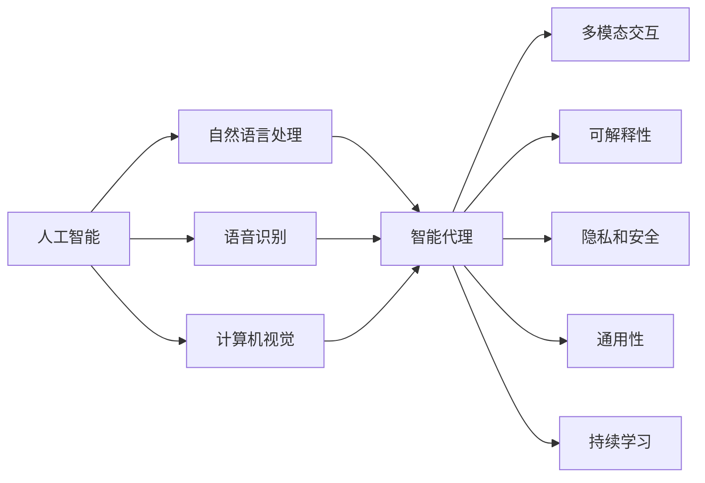

                 

## 1. 背景介绍

### 1.1 问题由来

人机交互（Human-Computer Interaction, HCI）作为计算机科学和工程的重要分支，始终致力于研究如何让计算机系统更自然、更智能地响应人类的行为和需求。随着人工智能（AI）技术的发展，智能代理、聊天机器人、虚拟现实（VR）和增强现实（AR）等应用成为人机交互的热点。未来，随着AI技术的深入应用，人机交互将面临许多新的机遇和挑战。

### 1.2 问题核心关键点

1. **人工智能与人机交互的深度融合**：如何利用AI技术优化人机交互体验，提供更自然、更高效的交互方式。
2. **多模态交互**：结合语音、图像、触觉等多种交互方式，提升人机交互的自然度和智能性。
3. **可解释性和透明度**：AI系统的决策过程是否透明，用户能否理解和信任其行为。
4. **数据隐私和安全**：在人机交互中，如何保护用户的隐私数据，确保系统的安全性。
5. **通用性**：AI系统能否适应不同文化和个体差异，提供普适的交互体验。
6. **持续学习和进化**：AI系统是否具备学习新知识、适应新环境的能力。

### 1.3 问题研究意义

深入理解人机交互的未来趋势和展望，有助于推动AI技术在实际应用中的落地和普及，提升用户体验和生活质量。以下是几个方面的意义：

1. **提升用户体验**：通过融合AI技术，人机交互可以变得更加自然、智能，提高用户满意度和使用效率。
2. **驱动技术创新**：新的交互方式和设备将推动硬件和软件技术的创新，加速AI技术的迭代升级。
3. **促进社会进步**：通过改善人机交互方式，可以为残障人士、老年人等特殊群体提供更多便利，促进社会的包容性发展。
4. **推动经济增长**：智能人机交互技术将带动相关产业的发展，如虚拟现实、增强现实、可穿戴设备等，创造新的经济增长点。

## 2. 核心概念与联系

### 2.1 核心概念概述

- **人工智能（AI）**：一种模拟人类智能的技术，包括机器学习、深度学习、自然语言处理等。
- **人机交互（HCI）**：研究如何让计算机系统响应人类的行为和需求，包括输入、输出和反馈等过程。
- **智能代理（Agent）**：具有一定智能的计算机程序，能够在虚拟或真实环境中与用户交互。
- **自然语言处理（NLP）**：让计算机理解、处理和生成自然语言的技术。
- **语音识别和合成**：将语音信号转换为文本或将文本转换为语音的技术。
- **计算机视觉（CV）**：使计算机能够“看”和“理解”图像和视频的技术。
- **多模态交互**：结合多种交互方式，如语音、图像、触觉等，提升交互的自然度和智能性。
- **可解释性**：使AI系统的决策过程透明，用户能够理解和信任其行为。
- **隐私和安全**：在人机交互中保护用户的隐私数据，确保系统的安全性。
- **通用性**：适应不同文化和个体差异，提供普适的交互体验。
- **持续学习**：具备学习新知识、适应新环境的能力。

### 2.2 核心概念原理和架构的 Mermaid 流程图



该流程图展示了人工智能与多模态交互、可解释性、隐私安全、通用性、持续学习等核心概念之间的联系，以及如何通过自然语言处理、语音识别和计算机视觉技术实现这些概念。

## 3. 核心算法原理 & 具体操作步骤

### 3.1 算法原理概述

人机交互的未来趋势主要依赖于人工智能技术的发展，其中机器学习和深度学习是其核心。机器学习通过从大量数据中学习模式和规律，优化人机交互体验。深度学习，尤其是基于神经网络的模型，能够处理复杂的非线性关系，提升人机交互的自然度和智能性。

### 3.2 算法步骤详解

1. **数据收集与预处理**：
   - 收集用户行为数据，包括点击、输入、语音交互等。
   - 对数据进行清洗、标注和标准化处理，确保数据质量。

2. **模型选择与训练**：
   - 选择合适的AI模型，如深度神经网络、卷积神经网络（CNN）、循环神经网络（RNN）等。
   - 使用数据集对模型进行训练，优化模型参数。

3. **系统集成与优化**：
   - 将训练好的模型集成到交互系统中，包括前端和后端。
   - 对系统进行优化，提升交互的响应速度和稳定性。

4. **用户体验评估与改进**：
   - 收集用户反馈，评估系统性能。
   - 根据反馈不断改进和优化系统。

5. **持续学习和进化**：
   - 收集新数据，持续训练模型，使其适应新环境。
   - 定期更新模型和系统，保持其高效性和可靠性。

### 3.3 算法优缺点

#### 优点

1. **提升用户体验**：通过深度学习模型，系统能够理解和预测用户需求，提供更自然、智能的交互方式。
2. **处理复杂任务**：深度学习模型能够处理复杂的非线性关系，提升人机交互的自然度和智能性。
3. **多模态交互**：结合语音、图像、触觉等多种交互方式，提升交互的自然度和智能性。
4. **可解释性和透明度**：通过可解释性技术，使用户能够理解和信任AI系统的决策过程。
5. **通用性**：AI系统能够适应不同文化和个体差异，提供普适的交互体验。
6. **持续学习**：AI系统具备学习新知识、适应新环境的能力，提高系统效能。

#### 缺点

1. **数据依赖**：AI系统需要大量的高质量数据进行训练，数据获取和标注成本较高。
2. **计算资源需求**：深度学习模型需要大量的计算资源进行训练和推理，硬件成本较高。
3. **模型复杂性**：深度学习模型复杂，难以理解和调试，增加了系统的维护难度。
4. **可解释性不足**：深度学习模型通常被视为“黑盒”，难以解释其内部工作机制。
5. **数据隐私和安全问题**：AI系统需要处理大量个人数据，存在数据隐私和安全风险。

### 3.4 算法应用领域

1. **智能客服**：通过自然语言处理技术，智能客服能够理解和回答用户问题，提升客户满意度。
2. **虚拟助手**：结合语音识别和自然语言处理技术，虚拟助手能够执行多种任务，如提醒日程、查询信息等。
3. **游戏交互**：通过计算机视觉和深度学习技术，游戏AI能够与玩家进行智能交互，提升游戏体验。
4. **医疗诊断**：通过自然语言处理和深度学习技术，AI系统能够分析医疗影像和病历，辅助医生进行诊断。
5. **教育辅助**：结合自然语言处理和计算机视觉技术，AI系统能够个性化推荐学习内容和互动方式，提升教育效果。
6. **智能交通**：通过计算机视觉和自然语言处理技术，智能交通系统能够理解和预测交通状况，优化交通管理。
7. **人机协作**：在制造业、服务业等领域，AI系统能够辅助人类进行决策和执行任务，提升工作效率。

## 4. 数学模型和公式 & 详细讲解 & 举例说明

### 4.1 数学模型构建

人机交互的数学模型通常包括以下几个组成部分：

1. **输入**：用户的输入，如语音、文本、图像等。
2. **特征提取**：通过自然语言处理、语音识别、计算机视觉等技术，将输入转化为模型可处理的特征。
3. **模型训练**：使用深度学习模型，如卷积神经网络（CNN）、循环神经网络（RNN）、变压器（Transformer）等，进行训练。
4. **输出**：模型的预测结果，如文本回复、图像识别、语音合成等。
5. **反馈**：系统对输出结果的反馈，用于优化模型。

### 4.2 公式推导过程

以自然语言处理为例，使用卷积神经网络（CNN）作为特征提取和处理模型：

$$
\text{CNN}(\text{input}) = \text{Convolution}(\text{input}, \text{filters}) + \text{Pooling}(\text{Convolution}) + \text{ActivationFunction}
$$

其中，输入为自然语言文本，卷积核（filters）和池化层（Pooling）用于特征提取，激活函数（ActivationFunction）用于非线性映射。

### 4.3 案例分析与讲解

假设有一个智能客服系统，使用卷积神经网络进行特征提取和处理。系统收集到用户输入的语音信息后，进行语音转文本处理，然后通过CNN模型提取特征，最后使用全连接层进行分类预测。具体步骤如下：

1. **语音转文本**：使用语音识别技术将语音转换为文本。
2. **特征提取**：将文本输入到CNN模型中进行特征提取。
3. **分类预测**：使用全连接层对提取的特征进行分类预测，得出用户意图和问题类型。
4. **回复生成**：根据预测结果，生成相应的回复文本。

## 5. 项目实践：代码实例和详细解释说明

### 5.1 开发环境搭建

1. **安装Python和相关库**：
   ```bash
   sudo apt-get update
   sudo apt-get install python3-pip
   pip3 install torch torchvision transformers
   ```

2. **配置模型和数据**：
   ```python
   import torch
   import torch.nn as nn
   import torchvision.transforms as transforms
   from transformers import BertTokenizer, BertForSequenceClassification
   ```

3. **加载模型和数据**：
   ```python
   tokenizer = BertTokenizer.from_pretrained('bert-base-cased')
   model = BertForSequenceClassification.from_pretrained('bert-base-cased', num_labels=2)
   ```

### 5.2 源代码详细实现

1. **数据预处理**：
   ```python
   text = "I want to book a flight to New York."
   tokens = tokenizer(text, return_tensors='pt')
   ```

2. **模型推理**：
   ```python
   outputs = model(**tokens)
   ```

3. **结果处理**：
   ```python
   logits = outputs.logits
   predicted_label = torch.argmax(logits, dim=1)
   ```

### 5.3 代码解读与分析

在上述代码中，首先使用BertTokenizer将文本转换为token ids，然后将其输入到BertForSequenceClassification模型中进行推理，最后输出预测结果。

## 6. 实际应用场景

### 6.1 智能客服系统

智能客服系统通过自然语言处理技术，理解用户意图并生成相应的回复。结合语音识别和图像处理技术，可以提升用户体验，减少人工客服的负担。

### 6.2 虚拟助手

虚拟助手结合语音识别、自然语言处理和计算机视觉技术，能够执行多种任务，如提醒日程、查询信息、控制设备等。

### 6.3 游戏交互

游戏AI通过计算机视觉和自然语言处理技术，与玩家进行智能交互，提升游戏体验和趣味性。

### 6.4 医疗诊断

AI系统结合自然语言处理和深度学习技术，分析医疗影像和病历，辅助医生进行诊断和治疗决策。

### 6.5 教育辅助

AI系统通过自然语言处理和计算机视觉技术，个性化推荐学习内容和互动方式，提升教育效果。

### 6.6 智能交通

智能交通系统通过计算机视觉和自然语言处理技术，理解和预测交通状况，优化交通管理，提升交通安全和效率。

### 6.7 人机协作

在制造业、服务业等领域，AI系统能够辅助人类进行决策和执行任务，提升工作效率和质量。

## 7. 工具和资源推荐

### 7.1 学习资源推荐

1. **《人机交互设计与实现》**：详细介绍了人机交互的基本概念和设计原则。
2. **《人工智能基础》**：介绍了人工智能的基本原理和应用。
3. **《自然语言处理综论》**：全面介绍了自然语言处理的基本技术和应用。
4. **《深度学习与计算机视觉》**：介绍了深度学习和计算机视觉的基本技术和应用。
5. **《多模态交互技术》**：介绍了多模态交互的基本技术和应用。

### 7.2 开发工具推荐

1. **Python**：开发人机交互系统的常用语言，提供了丰富的库和工具。
2. **PyTorch**：深度学习框架，提供了强大的计算能力和丰富的API。
3. **TensorFlow**：另一个流行的深度学习框架，提供了丰富的模型和工具。
4. **Keras**：一个高级神经网络API，提供了简洁的接口和丰富的模型。
5. **OpenCV**：计算机视觉库，提供了丰富的图像处理和分析功能。
6. **TensorBoard**：可视化工具，用于监控和调试模型训练过程。

### 7.3 相关论文推荐

1. **《深度学习与计算机视觉：一种新范式》**：介绍了深度学习在计算机视觉中的应用。
2. **《自然语言处理技术综述》**：全面综述了自然语言处理的基本技术和应用。
3. **《多模态交互技术》**：介绍了多模态交互的基本技术和应用。
4. **《可解释人工智能技术综述》**：综述了可解释人工智能的基本技术和应用。

## 8. 总结：未来发展趋势与挑战

### 8.1 总结

人机交互的未来发展主要依赖于人工智能技术的发展，通过融合自然语言处理、语音识别、计算机视觉等多模态技术，提升交互的自然度和智能性。未来，人机交互将更加智能化、通用化和普适化。

### 8.2 未来发展趋势

1. **多模态交互**：结合语音、图像、触觉等多种交互方式，提升交互的自然度和智能性。
2. **智能代理**：具备更高智能水平的AI代理将更加普及，能够处理复杂的任务和情境。
3. **可解释性**：AI系统的决策过程将更加透明，用户能够理解和信任其行为。
4. **隐私和安全**：在保护用户隐私的同时，提升系统的安全性。
5. **通用性**：适应不同文化和个体差异，提供普适的交互体验。
6. **持续学习**：AI系统具备学习新知识、适应新环境的能力，提升系统效能。

### 8.3 面临的挑战

1. **数据依赖**：AI系统需要大量的高质量数据进行训练，数据获取和标注成本较高。
2. **计算资源需求**：深度学习模型需要大量的计算资源进行训练和推理，硬件成本较高。
3. **模型复杂性**：深度学习模型复杂，难以理解和调试，增加了系统的维护难度。
4. **可解释性不足**：深度学习模型通常被视为“黑盒”，难以解释其内部工作机制。
5. **数据隐私和安全问题**：AI系统需要处理大量个人数据，存在数据隐私和安全风险。

### 8.4 研究展望

未来，人机交互技术将继续融合人工智能技术，推动多模态交互、智能代理、可解释性和隐私安全等方向的深入研究。同时，随着技术的不断进步，人机交互将变得更加智能化、通用化和普适化，为用户带来更好的体验和服务。

## 9. 附录：常见问题与解答

**Q1：人机交互的未来趋势有哪些？**

A: 人机交互的未来趋势主要依赖于人工智能技术的发展，结合自然语言处理、语音识别、计算机视觉等多模态技术，提升交互的自然度和智能性。未来，人机交互将更加智能化、通用化和普适化。

**Q2：深度学习在多模态交互中的作用是什么？**

A: 深度学习在多模态交互中用于特征提取和处理，能够处理复杂的非线性关系，提升交互的自然度和智能性。

**Q3：人机交互中的可解释性如何实现？**

A: 可解释性技术如可解释深度学习模型、模型蒸馏、模型可视化等，可以使AI系统的决策过程透明，用户能够理解和信任其行为。

**Q4：如何保护人机交互中的数据隐私和安全？**

A: 使用数据加密、访问控制、匿名化处理等技术，保护用户的隐私数据，确保系统的安全性。

**Q5：人工智能在哪些领域有应用前景？**

A: 人工智能在智能客服、虚拟助手、游戏交互、医疗诊断、教育辅助、智能交通、人机协作等领域有广泛应用前景。

---

作者：禅与计算机程序设计艺术 / Zen and the Art of Computer Programming

