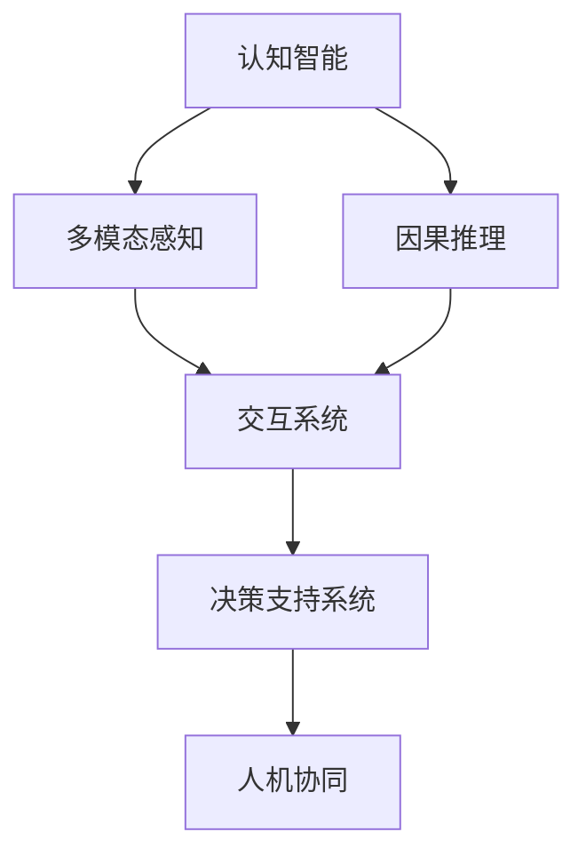

                 

# 人机协作：迈向更智能的未来

## 1. 背景介绍

### 1.1 问题由来

随着人工智能(AI)技术的迅猛发展，人机协作正逐渐从科幻变为现实。特别是在自然语言处理(NLP)和计算机视觉(CV)等领域的突破，使得AI系统能够与人类进行复杂的交互和合作。

过去，机器仅能执行简单的任务，如语音识别、图像分类等，而如今，智能助手、虚拟客服、自动驾驶等应用已具备了初步的智能推理和决策能力。但这还远远不够，AI系统在任务理解和执行的准确性和智能性上，仍需大幅提升，以实现与人类之间的深度协作。

本文聚焦于如何通过人机协作，提升AI系统的智能水平，使其具备更强的自主性和理解能力，从而更好地服务于人类社会。

### 1.2 问题核心关键点

人机协作的核心关键点在于如何让AI系统能够理解人类的指令，并根据指令输出最优解决方案。这需要AI系统具备以下几个能力：

1. **理解能力**：能够正确解析和理解人类输入的语言、图像、视频等多模态信息，获取任务目标和关键信息。
2. **推理能力**：具备逻辑推理和因果推断能力，能够从已有的信息中推导出合理的结论。
3. **交互能力**：能够与人类进行自然流畅的对话，处理复杂的互动和反馈。
4. **执行能力**：具备行动执行的能力，能够根据任务需求，自动生成计划、执行任务并反馈结果。
5. **自我学习能力**：能够通过经验反馈，不断学习改进，提高决策质量。

目前，AI系统在这些方面还存在不少局限性，需要通过人机协作的方式，不断提升其智能水平。

## 2. 核心概念与联系

### 2.1 核心概念概述

为了更好地理解人机协作，我们先介绍几个关键概念及其联系：

1. **AI与认知智能**：AI系统通过算法和数据进行训练，具备一定的自主决策能力，但与人类智能相比，仍有所差距。认知智能强调AI系统的理解、推理、记忆等能力，与人类的心智模式相融合，是未来AI发展的方向。
2. **多模态感知**：AI系统能够同时处理文本、图像、语音等多种形式的信息，提高任务的全面性和准确性。
3. **因果推理**：通过理解事件之间的因果关系，AI系统能够更加准确地预测和决策。
4. **交互系统**：包括智能对话系统、虚拟助手、智能客服等，实现与用户的自然交流和互动。
5. **决策支持系统**：通过集成知识库、规则库等专家知识，为AI系统提供决策支持。
6. **人机协同**：通过合理设计AI系统和人类的协作机制，发挥各自的优势，共同完成复杂任务。

这些核心概念之间存在紧密的联系，共同构成了人机协作的基础框架，如以下Mermaid流程图所示：



## 3. 核心算法原理 & 具体操作步骤
### 3.1 算法原理概述

人机协作的本质是一种多模态、分布式、自适应的智能交互系统。其核心算法原理包括以下几个方面：

1. **多模态数据融合**：将来自不同模态的信息，如文本、图像、语音等，进行综合处理，形成统一的表示形式，供AI系统理解和使用。
2. **因果推理模型**：通过建立因果关系图，模拟人类认知过程，使AI系统具备更加合理的决策能力。
3. **交互协议设计**：设计人类与AI系统之间的交互协议，确保信息传递的准确性和实时性。
4. **协同优化算法**：优化AI系统与人类之间的协同机制，提升系统的综合性能。

### 3.2 算法步骤详解

人机协作的算法步骤可以分为以下几个环节：

**Step 1: 数据获取与预处理**

1. **多模态数据采集**：从各种渠道收集文本、图像、语音等多模态数据，并进行清洗和标注。
2. **数据融合与归一化**：将不同模态的数据进行融合，转换成统一的表示形式，并进行归一化处理，以提高数据的一致性。

**Step 2: 认知智能构建**

1. **预训练模型选择**：选择适当的预训练模型，如BERT、GPT等，作为认知智能的基础。
2. **多模态感知模块构建**：设计多模态感知模块，能够处理文本、图像、语音等多种形式的信息。
3. **因果推理模块构建**：引入因果推理模块，建立因果关系图，进行事件预测和决策。
4. **交互系统设计**：开发智能对话系统和虚拟助手，实现与用户的自然交流和互动。

**Step 3: 协同优化与学习**

1. **协同优化算法设计**：设计协同优化算法，如分布式优化、协同过滤等，优化AI系统与人类之间的协同机制。
2. **交互协议设计**：定义交互协议，确保信息传递的准确性和实时性。
3. **学习机制设计**：引入强化学习、主动学习等机制，使AI系统能够根据用户反馈不断改进和提升。

**Step 4: 系统集成与测试**

1. **系统集成**：将多模态感知、因果推理、交互系统、决策支持等模块集成到统一的框架中。
2. **测试与验证**：在系统开发过程中，进行单元测试、集成测试、系统测试等，验证系统的正确性和性能。
3. **部署与上线**：将系统部署到实际应用环境中，进行业务验证，收集反馈并持续优化。

### 3.3 算法优缺点

人机协作的算法有以下优点：

1. **综合性能提升**：通过多模态感知和因果推理，AI系统能够获取更加全面和准确的信息，从而提高决策的准确性和合理性。
2. **实时交互**：通过交互系统，AI系统能够与人类进行实时互动，快速响应用户需求，提升用户体验。
3. **自我学习**：通过强化学习等机制，AI系统能够根据反馈不断改进，提升智能水平。

同时，人机协作算法也存在一些缺点：

1. **数据获取难度大**：多模态数据的采集和标注需要大量人力和资源，数据质量也难以保证。
2. **模型复杂度高**：多模态感知和因果推理等模块设计复杂，模型训练和优化难度大。
3. **交互机制设计难**：设计自然流畅的交互协议，需要考虑到多种场景和语境，复杂度高。

尽管存在这些缺点，但人机协作仍然是当前AI技术发展的重要方向。未来，通过进一步优化算法和数据获取方法，这些缺点有望得到有效缓解。

### 3.4 算法应用领域

人机协作的算法已经在诸多领域得到应用，具体如下：

1. **智能客服**：通过智能对话系统，实现24小时不间断的客户服务，提升客户满意度。
2. **虚拟助手**：通过虚拟助手，实现语音助手、智能家居、车载导航等功能，提升生活质量。
3. **医疗诊断**：通过多模态感知和因果推理，辅助医生进行诊断和治疗决策，提高医疗服务水平。
4. **金融分析**：通过智能分析系统，实时监控市场动态，提供风险预警和决策支持。
5. **智慧城市**：通过智能监控和决策支持系统，提升城市管理效率，实现智慧城市的目标。

这些应用展示了人机协作的广泛前景，未来将有更多的领域受益于人机协作技术。

## 4. 数学模型和公式 & 详细讲解 & 举例说明
### 4.1 数学模型构建

本节将使用数学语言对人机协作的算法原理进行严格刻画。

假设输入数据集为 $\mathcal{D}=\{(x_i, y_i)\}_{i=1}^N$，其中 $x_i$ 为多模态输入，$y_i$ 为任务目标。定义AI系统的输出为 $\hat{y}=M_{\theta}(x)$，其中 $M_{\theta}$ 为多模态感知和因果推理模型，$\theta$ 为模型参数。

定义损失函数 $\mathcal{L}(\theta, \mathcal{D})$，用于衡量模型的预测输出与真实目标之间的差异，例如均方误差、交叉熵等。

通过优化算法（如梯度下降、Adam等），不断更新模型参数 $\theta$，使得损失函数最小化，即：

$$
\theta^* = \mathop{\arg\min}_{\theta} \mathcal{L}(\theta, \mathcal{D})
$$

### 4.2 公式推导过程

以二分类任务为例，推导多模态感知和因果推理模型的损失函数和梯度计算公式。

假设模型 $M_{\theta}$ 在输入 $x$ 上的输出为 $\hat{y}=M_{\theta}(x) \in [0,1]$，表示样本属于正类的概率。真实标签 $y \in \{0,1\}$。则二分类交叉熵损失函数定义为：

$$
\ell(M_{\theta}(x),y) = -[y\log \hat{y} + (1-y)\log (1-\hat{y})]
$$

将其代入经验风险公式，得：

$$
\mathcal{L}(\theta) = -\frac{1}{N}\sum_{i=1}^N [y_i\log M_{\theta}(x_i)+(1-y_i)\log(1-M_{\theta}(x_i))]
$$

根据链式法则，损失函数对参数 $\theta_k$ 的梯度为：

$$
\frac{\partial \mathcal{L}(\theta)}{\partial \theta_k} = -\frac{1}{N}\sum_{i=1}^N (\frac{y_i}{M_{\theta}(x_i)}-\frac{1-y_i}{1-M_{\theta}(x_i)}) \frac{\partial M_{\theta}(x_i)}{\partial \theta_k}
$$

其中 $\frac{\partial M_{\theta}(x_i)}{\partial \theta_k}$ 可进一步递归展开，利用自动微分技术完成计算。

## 5. 项目实践：代码实例和详细解释说明
### 5.1 开发环境搭建

在进行人机协作的算法实践前，我们需要准备好开发环境。以下是使用Python进行PyTorch开发的环境配置流程：

1. 安装Anaconda：从官网下载并安装Anaconda，用于创建独立的Python环境。

2. 创建并激活虚拟环境：
```bash
conda create -n pytorch-env python=3.8 
conda activate pytorch-env
```

3. 安装PyTorch：根据CUDA版本，从官网获取对应的安装命令。例如：
```bash
conda install pytorch torchvision torchaudio cudatoolkit=11.1 -c pytorch -c conda-forge
```

4. 安装Transformers库：
```bash
pip install transformers
```

5. 安装各类工具包：
```bash
pip install numpy pandas scikit-learn matplotlib tqdm jupyter notebook ipython
```

完成上述步骤后，即可在`pytorch-env`环境中开始人机协作的算法实践。

### 5.2 源代码详细实现

这里我们以智能客服系统为例，给出使用Transformers库进行人机协作系统构建的PyTorch代码实现。

首先，定义智能客服系统的输入输出格式：

```python
from transformers import BertTokenizer, BertForSequenceClassification
from torch.utils.data import Dataset, DataLoader
import torch

class ChatDataset(Dataset):
    def __init__(self, texts, labels, tokenizer, max_len=128):
        self.texts = texts
        self.labels = labels
        self.tokenizer = tokenizer
        self.max_len = max_len
        
    def __len__(self):
        return len(self.texts)
    
    def __getitem__(self, item):
        text = self.texts[item]
        label = self.labels[item]
        
        encoding = self.tokenizer(text, return_tensors='pt', max_length=self.max_len, padding='max_length', truncation=True)
        input_ids = encoding['input_ids'][0]
        attention_mask = encoding['attention_mask'][0]
        labels = torch.tensor(label, dtype=torch.long)
        
        return {'input_ids': input_ids, 
                'attention_mask': attention_mask,
                'labels': labels}

# 标签与id的映射
label2id = {'greeting': 0, 'information': 1, 'complaint': 2, 'farewell': 3}
id2label = {v: k for k, v in label2id.items()}

# 创建dataset
tokenizer = BertTokenizer.from_pretrained('bert-base-cased')
train_dataset = ChatDataset(train_texts, train_labels, tokenizer)
dev_dataset = ChatDataset(dev_texts, dev_labels, tokenizer)
test_dataset = ChatDataset(test_texts, test_labels, tokenizer)
```

然后，定义模型和优化器：

```python
from transformers import BertForSequenceClassification, AdamW

model = BertForSequenceClassification.from_pretrained('bert-base-cased', num_labels=len(label2id))

optimizer = AdamW(model.parameters(), lr=2e-5)
```

接着，定义训练和评估函数：

```python
from sklearn.metrics import accuracy_score, precision_recall_fscore_support

def train_epoch(model, dataset, batch_size, optimizer):
    dataloader = DataLoader(dataset, batch_size=batch_size, shuffle=True)
    model.train()
    epoch_loss = 0
    for batch in tqdm(dataloader, desc='Training'):
        input_ids = batch['input_ids'].to(device)
        attention_mask = batch['attention_mask'].to(device)
        labels = batch['labels'].to(device)
        model.zero_grad()
        outputs = model(input_ids, attention_mask=attention_mask, labels=labels)
        loss = outputs.loss
        epoch_loss += loss.item()
        loss.backward()
        optimizer.step()
    return epoch_loss / len(dataloader)

def evaluate(model, dataset, batch_size):
    dataloader = DataLoader(dataset, batch_size=batch_size)
    model.eval()
    preds, labels = [], []
    with torch.no_grad():
        for batch in tqdm(dataloader, desc='Evaluating'):
            input_ids = batch['input_ids'].to(device)
            attention_mask = batch['attention_mask'].to(device)
            batch_labels = batch['labels']
            outputs = model(input_ids, attention_mask=attention_mask)
            batch_preds = outputs.logits.argmax(dim=2).to('cpu').tolist()
            batch_labels = batch_labels.to('cpu').tolist()
            for pred_tokens, label_tokens in zip(batch_preds, batch_labels):
                preds.append(pred_tokens)
                labels.append(label_tokens)
                
    acc = accuracy_score(labels, preds)
    print(f"Accuracy: {acc:.3f}")
```

最后，启动训练流程并在测试集上评估：

```python
epochs = 5
batch_size = 16

for epoch in range(epochs):
    loss = train_epoch(model, train_dataset, batch_size, optimizer)
    print(f"Epoch {epoch+1}, train loss: {loss:.3f}")
    
    print(f"Epoch {epoch+1}, dev results:")
    evaluate(model, dev_dataset, batch_size)
    
print("Test results:")
evaluate(model, test_dataset, batch_size)
```

以上就是使用PyTorch对智能客服系统进行构建的完整代码实现。可以看到，Transformers库提供了丰富的预训练模型和工具，使得构建人机协作系统变得简便高效。

### 5.3 代码解读与分析

让我们再详细解读一下关键代码的实现细节：

**ChatDataset类**：
- `__init__`方法：初始化文本、标签、分词器等关键组件。
- `__len__`方法：返回数据集的样本数量。
- `__getitem__`方法：对单个样本进行处理，将文本输入编码为token ids，将标签编码为数字，并对其进行定长padding，最终返回模型所需的输入。

**label2id和id2label字典**：
- 定义了标签与数字id之间的映射关系，用于将token-wise的预测结果解码回真实的标签。

**训练和评估函数**：
- 使用PyTorch的DataLoader对数据集进行批次化加载，供模型训练和推理使用。
- 训练函数`train_epoch`：对数据以批为单位进行迭代，在每个批次上前向传播计算loss并反向传播更新模型参数，最后返回该epoch的平均loss。
- 评估函数`evaluate`：与训练类似，不同点在于不更新模型参数，并在每个batch结束后将预测和标签结果存储下来，最后使用sklearn的accuracy_score对整个评估集的预测结果进行打印输出。

**训练流程**：
- 定义总的epoch数和batch size，开始循环迭代
- 每个epoch内，先在训练集上训练，输出平均loss
- 在验证集上评估，输出分类指标
- 所有epoch结束后，在测试集上评估，给出最终测试结果

可以看到，PyTorch配合Transformers库使得智能客服系统的构建代码实现变得简洁高效。开发者可以将更多精力放在数据处理、模型改进等高层逻辑上，而不必过多关注底层的实现细节。

当然，工业级的系统实现还需考虑更多因素，如模型的保存和部署、超参数的自动搜索、更灵活的任务适配层等。但核心的协作范式基本与此类似。

## 6. 实际应用场景
### 6.1 智能客服系统

智能客服系统通过多模态感知模块，能够理解用户的语音、文字、表情等多模态输入，并通过因果推理模块，分析用户需求，生成最合适的回复。

在技术实现上，可以收集企业的客服对话记录，将问题和最佳答复构建成监督数据，在此基础上对预训练模型进行微调。微调后的模型能够自动理解用户意图，匹配最合适的答复模板，生成自然流畅的回复。对于客户提出的新问题，还可以接入检索系统实时搜索相关内容，动态组织生成回答。如此构建的智能客服系统，能大幅提升客户咨询体验和问题解决效率。

### 6.2 金融舆情监测

金融机构需要实时监测市场舆论动向，以便及时应对负面信息传播，规避金融风险。传统的人工监测方式成本高、效率低，难以应对网络时代海量信息爆发的挑战。基于多模态感知和因果推理的舆情监测系统，能够自动分析和处理各种金融新闻、评论、报告等数据，识别关键事件和情感倾向，提供实时预警和决策支持。

在具体实现中，可以收集金融领域相关的新闻、报道、评论等文本数据，并对其进行主题标注和情感标注。在此基础上对预训练语言模型进行微调，使其能够自动判断文本属于何种主题，情感倾向是正面、中性还是负面。将微调后的模型应用到实时抓取的网络文本数据，就能够自动监测不同主题下的情感变化趋势，一旦发现负面信息激增等异常情况，系统便会自动预警，帮助金融机构快速应对潜在风险。

### 6.3 个性化推荐系统

当前的推荐系统往往只依赖用户的历史行为数据进行物品推荐，无法深入理解用户的真实兴趣偏好。基于多模态感知和因果推理的个性化推荐系统，能够更好地挖掘用户行为背后的语义信息，从而提供更精准、多样的推荐内容。

在具体实现中，可以收集用户浏览、点击、评论、分享等行为数据，提取和用户交互的物品标题、描述、标签等文本内容。将文本内容作为模型输入，用户的后续行为（如是否点击、购买等）作为监督信号，在此基础上微调预训练语言模型。微调后的模型能够从文本内容中准确把握用户的兴趣点。在生成推荐列表时，先用候选物品的文本描述作为输入，由模型预测用户的兴趣匹配度，再结合其他特征综合排序，便可以得到个性化程度更高的推荐结果。

### 6.4 未来应用展望

随着多模态感知和因果推理等技术的发展，人机协作的应用场景将更加丰富，潜力也将更大。

在智慧医疗领域，基于多模态感知和因果推理的医疗诊断系统，能够综合分析病人的影像、实验室数据、病历等，提供更加精准的诊断和治疗建议。在教育领域，智能辅导系统能够理解学生的学习需求，提供个性化的学习资源和建议。在智慧城市治理中，智能监控和决策支持系统能够提升城市管理效率，实现智慧城市的目标。

未来，随着技术的不断进步，人机协作将在更多领域得到应用，为传统行业数字化转型升级提供新的技术路径。

## 7. 工具和资源推荐
### 7.1 学习资源推荐

为了帮助开发者系统掌握人机协作的理论基础和实践技巧，这里推荐一些优质的学习资源：

1. 《多模态学习》系列博文：由多模态学习专家撰写，深入浅出地介绍了多模态学习的基本概念和关键技术。

2. 《人工智能：一种现代方法》书籍：全面介绍人工智能的理论和实践，包括多模态感知、因果推理等内容。

3. 《人机协同》系列论文：综述人机协同领域的最新研究成果，涵盖多模态感知、交互系统、协同优化等内容。

4. 《机器学习实战》书籍：通过实例演示，讲解多模态感知、因果推理等关键技术的实现方法和应用场景。

5. 《Transformer从原理到实践》系列博文：由大模型技术专家撰写，介绍Transformer模型的原理和应用，包括多模态感知和因果推理。

通过对这些资源的学习实践，相信你一定能够快速掌握人机协作的精髓，并用于解决实际的AI问题。
###  7.2 开发工具推荐

高效的开发离不开优秀的工具支持。以下是几款用于人机协作开发的常用工具：

1. PyTorch：基于Python的开源深度学习框架，灵活动态的计算图，适合快速迭代研究。大部分预训练语言模型都有PyTorch版本的实现。

2. TensorFlow：由Google主导开发的开源深度学习框架，生产部署方便，适合大规模工程应用。同样有丰富的预训练语言模型资源。

3. Transformers库：HuggingFace开发的NLP工具库，集成了众多SOTA语言模型，支持PyTorch和TensorFlow，是进行多模态感知和因果推理开发的利器。

4. Weights & Biases：模型训练的实验跟踪工具，可以记录和可视化模型训练过程中的各项指标，方便对比和调优。与主流深度学习框架无缝集成。

5. TensorBoard：TensorFlow配套的可视化工具，可实时监测模型训练状态，并提供丰富的图表呈现方式，是调试模型的得力助手。

6. Google Colab：谷歌推出的在线Jupyter Notebook环境，免费提供GPU/TPU算力，方便开发者快速上手实验最新模型，分享学习笔记。

合理利用这些工具，可以显著提升人机协作任务的开发效率，加快创新迭代的步伐。

### 7.3 相关论文推荐

人机协作的发展离不开学界的持续研究。以下是几篇奠基性的相关论文，推荐阅读：

1. Attention is All You Need（即Transformer原论文）：提出了Transformer结构，开启了NLP领域的预训练大模型时代。

2. Multimodal Learning for Human-Robot Interaction：综述多模态学习在机器人与人交互中的应用，涵盖感知、推理、协同等内容。

3. Causal Reasoning with Data Distributions：提出因果推理的数据分布方法，用于增强AI系统的因果推断能力。

4. Conversational Agents for Open-Domain QA：综述对话系统在开放领域问答中的应用，涵盖对话理解、回复生成等内容。

5. Transfer Learning with Multi-task Deep Neural Networks：提出多任务学习框架，用于提升AI系统的迁移学习能力。

这些论文代表了大模型协同技术的发展脉络。通过学习这些前沿成果，可以帮助研究者把握学科前进方向，激发更多的创新灵感。

## 8. 总结：未来发展趋势与挑战
### 8.1 总结

本文对基于人机协作的AI技术进行了全面系统的介绍。首先阐述了人机协作的重要性，明确了人机协作在提升AI系统智能水平、增强交互能力等方面的关键作用。其次，从原理到实践，详细讲解了人机协作的数学模型和算法步骤，给出了多模态感知、因果推理等关键技术的实现代码实例。同时，本文还探讨了人机协作在智能客服、金融舆情、个性化推荐等多个行业领域的应用前景，展示了其广阔的应用空间。此外，本文精选了人机协作技术的各类学习资源，力求为开发者提供全方位的技术指引。

通过本文的系统梳理，可以看到，基于多模态感知和因果推理的人机协作技术，正在成为AI技术发展的重要方向。这些技术的综合应用，使得AI系统能够更好地理解人类需求，提供更加智能、自然的交互体验，从而在智慧医疗、金融分析、智能客服等多个领域发挥重要作用。未来，随着技术的不断进步，人机协作必将进一步深入人心，为人类社会带来更深远的影响。

### 8.2 未来发展趋势

展望未来，人机协作技术将呈现以下几个发展趋势：

1. **多模态技术的突破**：随着多模态数据采集和处理技术的进步，人机协作系统将能够更好地融合文本、图像、语音等多种信息，提升任务的全面性和准确性。

2. **因果推理的深入**：通过引入因果推断和对比学习思想，人机协作系统将具备更加合理的决策能力，学习更加普适、鲁棒的因果关系。

3. **交互系统的进化**：设计自然流畅的交互协议，开发更加智能的对话系统和虚拟助手，实现与用户的深度互动和协作。

4. **协同优化的优化**：优化协同优化算法，提高人机协作系统的综合性能，提升系统的鲁棒性和泛化能力。

5. **自我学习机制的完善**：引入强化学习、主动学习等机制，使AI系统能够根据反馈不断改进，提升智能水平。

6. **跨领域应用的拓展**：人机协作技术将在更多领域得到应用，如医疗、教育、金融等，推动各行业的数字化转型。

以上趋势凸显了人机协作技术的广阔前景。这些方向的探索发展，必将进一步提升AI系统的综合性能和应用效果，为人机协作的普及和落地创造更多可能性。

### 8.3 面临的挑战

尽管人机协作技术已经取得了瞩目成就，但在迈向更加智能化、普适化应用的过程中，它仍面临诸多挑战：

1. **数据获取瓶颈**：多模态数据的采集和标注需要大量人力和资源，数据质量也难以保证。如何高效获取高质量数据，仍是人机协作系统的一大挑战。

2. **模型复杂度高**：多模态感知和因果推理等模块设计复杂，模型训练和优化难度大。如何简化模型结构，提高训练效率，仍需进一步优化。

3. **交互机制设计难**：设计自然流畅的交互协议，需要考虑到多种场景和语境，复杂度高。如何设计更加智能、自然的交互界面，仍需深入研究。

4. **协同优化困难**：优化协同优化算法，提升人机协作系统的综合性能，仍需进一步研究。

5. **模型泛化能力不足**：人机协作系统在面对新任务和新数据时，泛化能力仍需提高。如何在不同场景下保证系统的稳定性和鲁棒性，仍需深入研究。

6. **可解释性问题**：如何赋予人机协作系统更强的可解释性，使其决策过程更加透明和可理解，仍需进一步探索。

正视这些挑战，积极应对并寻求突破，将是人机协作技术向成熟化发展的关键。相信随着学界和产业界的共同努力，这些挑战终将一一被克服，人机协作技术必将在构建智能社会的道路上迈出更坚实的一步。

### 8.4 研究展望

面对人机协作技术所面临的挑战，未来的研究需要在以下几个方面寻求新的突破：

1. **无监督和多模态数据的利用**：探索无监督学习和多模态数据的处理方法，利用更多非结构化数据，提高系统的泛化能力和自适应能力。

2. **跨领域迁移学习**：研究跨领域迁移学习方法，使AI系统能够更好地适应新任务和新数据。

3. **强化学习与多模态感知结合**：将强化学习与多模态感知结合，提高AI系统的自主性和决策能力。

4. **知识表示与因果推理融合**：将知识表示方法与因果推理结合，提升AI系统的推理能力和泛化能力。

5. **交互界面与智能代理**：研究自然流畅的交互界面设计，开发更加智能的对话系统和虚拟助手，提升人机协作系统的用户体验。

6. **可解释性与透明度提升**：引入可解释性技术，提升AI系统的透明度和可信度，满足用户对AI决策过程的期望。

7. **人机协同机制优化**：优化人机协同机制，提高系统的综合性能，提升系统的稳定性和鲁棒性。

这些研究方向将推动人机协作技术的不断进步，为人机协同系统的广泛应用提供更强大的技术支撑。通过多路径协同发力，相信未来人机协作技术将能够更好地服务于人类，为构建智能社会贡献更多智慧和力量。

## 9. 附录：常见问题与解答

**Q1：人机协作的AI系统需要满足哪些关键特性？**

A: 人机协作的AI系统需要具备以下几个关键特性：
1. **理解能力**：能够正确解析和理解人类输入的语言、图像、视频等多模态信息，获取任务目标和关键信息。
2. **推理能力**：具备逻辑推理和因果推断能力，能够从已有的信息中推导出合理的结论。
3. **交互能力**：能够与人类进行自然流畅的对话，处理复杂的互动和反馈。
4. **执行能力**：具备行动执行的能力，能够根据任务需求，自动生成计划、执行任务并反馈结果。
5. **自我学习能力**：能够通过经验反馈，不断学习改进，提高决策质量。

**Q2：人机协作的AI系统面临哪些技术挑战？**

A: 人机协作的AI系统面临以下技术挑战：
1. **数据获取难度大**：多模态数据的采集和标注需要大量人力和资源，数据质量也难以保证。
2. **模型复杂度高**：多模态感知和因果推理等模块设计复杂，模型训练和优化难度大。
3. **交互机制设计难**：设计自然流畅的交互协议，需要考虑到多种场景和语境，复杂度高。
4. **协同优化困难**：优化协同优化算法，提升人机协作系统的综合性能，仍需进一步研究。
5. **模型泛化能力不足**：人机协作系统在面对新任务和新数据时，泛化能力仍需提高。
6. **可解释性问题**：如何赋予人机协作系统更强的可解释性，使其决策过程更加透明和可理解，仍需进一步探索。

**Q3：人机协作的AI系统有哪些应用场景？**

A: 人机协作的AI系统已经在诸多领域得到应用，具体如下：
1. **智能客服**：通过智能对话系统，实现24小时不间断的客户服务，提升客户满意度。
2. **虚拟助手**：通过虚拟助手，实现语音助手、智能家居、车载导航等功能，提升生活质量。
3. **医疗诊断**：通过多模态感知和因果推理，辅助医生进行诊断和治疗决策，提高医疗服务水平。
4. **金融分析**：通过智能分析系统，实时监控市场动态，提供风险预警和决策支持。
5. **智慧城市**：通过智能监控和决策支持系统，提升城市管理效率，实现智慧城市的目标。
6. **个性化推荐**：通过多模态感知和因果推理，提供更精准、多样的推荐内容。
7. **智慧医疗**：通过多模态感知和因果推理，综合分析病人的影像、实验室数据、病历等，提供更加精准的诊断和治疗建议。

这些应用展示了人机协作的广泛前景，未来将有更多的领域受益于人机协作技术。

**Q4：人机协作的AI系统如何进行协同优化？**

A: 人机协作的AI系统进行协同优化的主要步骤包括：
1. **设计交互协议**：定义人机交互的规则和流程，确保信息传递的准确性和实时性。
2. **引入协同优化算法**：如分布式优化、协同过滤等，优化人机协作机制，提高系统的综合性能。
3. **数据同步与共享**：通过数据同步和共享，实现人机协作系统中的信息互通，提高系统的协同能力。
4. **反馈机制设计**：设计反馈机制，通过用户的实时反馈，调整AI系统的行为，提升系统的适应性和智能性。
5. **参数共享与迁移**：通过参数共享和迁移，在不同任务和场景下，提升系统的泛化能力和可迁移性。

通过以上步骤，可以有效提升人机协作系统的协同能力和综合性能，使其能够更好地服务于人类。

---

作者：禅与计算机程序设计艺术 / Zen and the Art of Computer Programming

