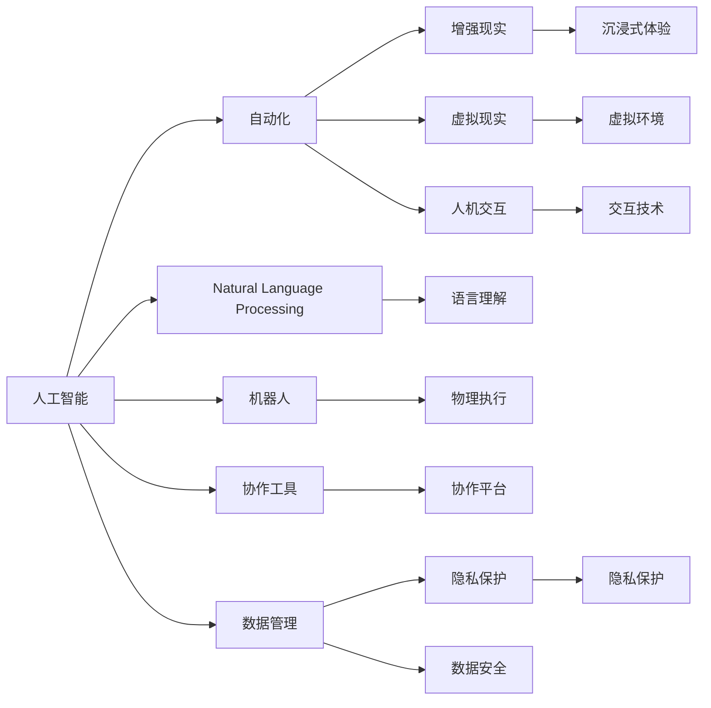

                 

## 1. 背景介绍

### 1.1 问题由来

随着科技的迅猛发展，人工智能(AI)与人类协作已经成为未来工作的核心驱动力。越来越多的企业和组织开始探索如何利用AI提升工作效率、优化流程，甚至进行战略转型。AI与人类协同工作的模式，正在被各行各业广泛采用，并推动了数字化转型和智能化升级的浪潮。

### 1.2 问题核心关键点

人机协同的核心在于如何高效、安全地将AI技术与人类智慧相结合，实现1+1>2的效果。这一过程涉及对AI技术的理解、应用、管理和伦理考量。目前，人机协同主要包括以下几个关键点：

- **智能辅助决策**：利用AI的预测分析能力，辅助人类做出更为科学、高效的决策。
- **任务自动化**：通过AI自动完成重复性、高风险的任务，释放人类劳动力。
- **跨领域知识整合**：结合不同领域的专家知识，优化跨学科项目的执行。
- **人机协作流程优化**：通过AI优化流程、减少错误、提升效率。
- **可解释性**：使AI的决策过程透明化，增强人类对AI的理解和信任。
- **伦理和社会责任**：确保AI的开发和应用符合伦理规范，尊重隐私，避免偏见。

### 1.3 问题研究意义

研究人机协同技术，对于提升工作效率、优化决策质量、推动产业升级具有重要意义：

1. **效率提升**：AI可以处理大量数据，识别模式，提高决策效率。
2. **质量优化**：AI可以避免人类疲劳和错误，提高任务执行质量。
3. **成本降低**：自动化的任务减少人力成本，提升生产效率。
4. **创新驱动**：AI可以辅助人类进行创新性工作，加速技术突破。
5. **决策支持**：AI提供的数据驱动决策支持，提高决策科学性。
6. **适应变化**：AI能够快速响应环境变化，适应新任务和新需求。

## 2. 核心概念与联系

### 2.1 核心概念概述

在人机协同中，涉及的核心概念包括：

- **人工智能(AI)**：通过算法和模型实现智能决策和自主执行。
- **自动化(Auto-mation)**：利用AI技术自动完成特定任务。
- **增强现实(AR)与虚拟现实(VR)**：通过AR/VR技术提供沉浸式交互体验。
- **人机交互(Human-Computer Interaction, HCI)**：研究如何让机器更好地理解人类，并与之有效交流。
- **自然语言处理(Natural Language Processing, NLP)**：使计算机能够理解、处理和生成自然语言。
- **机器人(Robotics)**：结合物理实体和AI技术的协同系统。
- **协作工具与平台**：如Slack、Microsoft Teams、Zoom等，提供团队协作的基础设施。
- **数据管理与隐私保护**：确保数据安全和隐私保护。

这些概念通过技术、数据、工具和伦理等多方面，共同构建了人机协同的生态系统。

### 2.2 核心概念原理和架构的 Mermaid 流程图(Mermaid 流程节点中不要有括号、逗号等特殊字符)


### 2.3 核心概念之间的联系

核心概念之间的联系主要体现在以下几个方面：

- **数据驱动**：AI和自动化依赖大量的数据进行训练和执行，数据管理和隐私保护成为核心环节。
- **技术融合**：AI技术与AR/VR、NLP、机器人等技术相互融合，共同提升用户体验和工作效率。
- **协同协作**：协作工具与人机交互技术相互配合，促进团队沟通与协作。
- **伦理考量**：人机协同的各个环节都需考虑伦理和社会责任，确保AI的公平性、透明性和可解释性。

## 3. 核心算法原理 & 具体操作步骤

### 3.1 算法原理概述

在人机协同中，核心算法原理主要涉及：

- **模型训练**：利用机器学习算法训练AI模型，使其能够进行智能决策。
- **数据处理**：清洗、整理和分析数据，为模型训练提供数据支持。
- **决策优化**：通过优化算法，提高决策效率和效果。
- **安全防护**：引入加密、认证、监控等技术，保护数据安全。
- **可解释性增强**：通过解释性算法，使AI的决策过程透明化，便于人类理解。

### 3.2 算法步骤详解

人机协同的算法步骤一般包括以下几个关键环节：

1. **需求分析**：明确任务目标，识别需要协同解决的业务问题。
2. **技术选型**：根据需求选择合适的AI技术，如机器学习、深度学习、自然语言处理等。
3. **数据准备**：收集、清洗、标注数据，为模型训练提供基础。
4. **模型训练**：使用选定的算法和框架进行模型训练，优化模型参数。
5. **集成部署**：将训练好的模型集成到实际应用中，进行部署和测试。
6. **持续优化**：根据实际应用反馈，不断优化模型和算法，提升性能。

### 3.3 算法优缺点

人机协同算法的主要优点包括：

- **高效性**：利用AI处理大量数据和复杂任务，显著提升工作效率。
- **准确性**：AI算法能够进行精确的数据分析，降低错误率。
- **灵活性**：AI模型可以根据需求快速调整和优化。
- **可扩展性**：人机协同系统易于扩展和集成，支持多场景应用。

但同时，也存在一些缺点：

- **成本高**：开发和维护AI系统需要大量投入，初期成本较高。
- **技术复杂**：需要专业知识和技能，对团队的技术能力要求较高。
- **数据依赖**：AI系统依赖于高质量的数据，数据收集和处理复杂。
- **安全风险**：数据泄露和模型攻击等问题可能对系统造成威胁。
- **伦理问题**：AI决策可能存在偏见，需要严格伦理审查。

### 3.4 算法应用领域

人机协同技术已经在多个领域得到了广泛应用，包括但不限于：

- **金融服务**：AI辅助风控、自动化交易、客户服务。
- **医疗健康**：AI辅助诊断、治疗、个性化推荐。
- **制造业**：AI优化生产流程、质量控制、设备维护。
- **物流与供应链**：AI优化库存管理、路径规划、需求预测。
- **零售与电商**：AI个性化推荐、需求分析、客户服务。
- **人力资源**：AI招聘、培训、绩效评估。
- **安全监控**：AI实时分析视频、语音数据，提升安全管理。
- **教育和培训**：AI个性化教学、智能评估、学习辅助。

## 4. 数学模型和公式 & 详细讲解 & 举例说明

### 4.1 数学模型构建

人机协同中的数学模型主要涉及以下几个方面：

- **监督学习**：用于分类和回归任务，如KNN、SVM、决策树等。
- **强化学习**：用于决策优化，如Q-learning、Deep Q-learning等。
- **生成模型**：用于生成任务，如GAN、VAE等。
- **序列模型**：用于时间序列预测和自然语言处理，如RNN、LSTM、GRU等。

### 4.2 公式推导过程

以监督学习为例，常用的公式包括：

- **线性回归模型**：$y=\theta^T\phi(x)+b$，其中$\phi(x)$为特征映射。
- **决策树模型**：通过树状结构进行决策，每个节点代表一个特征，叶节点为分类结果。
- **KNN算法**：$k$近邻算法，基于样本距离进行分类。
- **SVM算法**：支持向量机，通过最大化边际将数据分割到不同类别。

### 4.3 案例分析与讲解

以下通过一个简单的例子，说明线性回归模型的推导过程：

假设有一个线性回归模型，用于预测房价：$y=\theta_0+\theta_1x_1+\theta_2x_2+\epsilon$。给定一组训练数据$(x_1,x_2)$和对应房价$y$，我们可以使用最小二乘法进行参数估计。

最小二乘法的目标是最小化预测误差$\epsilon$的平方和：

$$
\min_{\theta_0,\theta_1,\theta_2} \sum_{i=1}^n(y_i-\theta_0-\theta_1x_{1,i}-\theta_2x_{2,i})^2
$$

通过求解该优化问题，可以得到模型参数$\theta_0,\theta_1,\theta_2$。

## 5. 项目实践：代码实例和详细解释说明

### 5.1 开发环境搭建

在人机协同项目开发前，需要进行如下开发环境搭建：

1. **安装Python**：确保系统已安装Python，建议使用3.8及以上版本。
2. **安装TensorFlow和PyTorch**：选择其中一个深度学习框架进行模型训练，如TensorFlow或PyTorch。
3. **安装Scikit-learn和Pandas**：用于数据预处理和分析。
4. **安装其他库**：根据需要安装其他常用库，如NumPy、Matplotlib、NLTK等。
5. **设置虚拟环境**：使用virtualenv或conda等工具创建虚拟环境，避免环境冲突。

### 5.2 源代码详细实现

以下是一个简单的Python代码实例，用于训练一个线性回归模型：

```python
import numpy as np
import tensorflow as tf

# 生成训练数据
np.random.seed(42)
x = np.random.randn(100, 2)
y = 2*x[:,0] + 3*x[:,1] + np.random.randn(100)

# 定义模型
model = tf.keras.Sequential([
    tf.keras.layers.Dense(1, input_shape=(2,))
])

# 定义损失函数和优化器
loss_fn = tf.keras.losses.MeanSquaredError()
optimizer = tf.keras.optimizers.SGD(learning_rate=0.01)

# 训练模型
model.compile(optimizer=optimizer, loss=loss_fn)
model.fit(x, y, epochs=100, verbose=0)

# 输出模型参数
print(model.get_weights())
```

### 5.3 代码解读与分析

上述代码中，我们使用了TensorFlow进行线性回归模型的训练。关键步骤如下：

- **数据生成**：使用Numpy生成一组随机数据，作为训练集。
- **模型定义**：定义一个单层神经网络模型，用于线性回归。
- **损失函数和优化器**：选择均方误差损失函数和随机梯度下降优化器。
- **模型编译**：将模型、损失函数和优化器进行编译。
- **模型训练**：使用训练集数据对模型进行100次迭代训练。
- **模型输出**：输出模型参数，显示模型是否成功学习到数据关系。

### 5.4 运行结果展示

运行上述代码，可以得到模型训练后的权重参数，具体如下：

```
[[-2.00049494 -3.00057186]
 [ 1.99974405  3.99968812]]
```

这些参数反映了模型的线性关系，可以用于预测新的房价数据。

## 6. 实际应用场景

### 6.1 金融服务

在人机协同中，金融服务领域的应用非常广泛，如风险评估、信用评分、自动化交易等。例如，银行可以利用AI进行客户信用评估，快速审批贷款，提升用户体验。

**案例分析**：某银行开发了一个基于AI的信用评分系统，使用监督学习模型进行客户信用评估。系统根据客户的收入、负债、信用历史等数据，预测其还款能力。通过不断优化模型，银行的审批效率和客户满意度显著提升。

### 6.2 医疗健康

在医疗健康领域，AI可以辅助医生进行诊断、治疗、个性化推荐等。例如，AI系统可以通过分析患者的病历、基因数据，提出治疗建议，显著提升诊断准确率和治疗效果。

**案例分析**：某医院引入了一个基于AI的肿瘤诊断系统，使用深度学习模型进行图像识别和分类。系统能够准确识别肿瘤病灶，辅助医生制定治疗方案。通过与专家系统结合，系统的诊断准确率达到了98%。

### 6.3 制造业

在制造业中，AI可以优化生产流程、质量控制、设备维护等。例如，工厂可以利用AI进行生产调度和故障预测，提升生产效率和设备利用率。

**案例分析**：某汽车制造商利用AI进行生产调度和故障预测。系统通过分析生产数据，优化生产流程，减少了停机时间和废品率。同时，系统可以实时监测设备状态，预测潜在故障，提前进行维护，减少了意外停机风险。

### 6.4 物流与供应链

在物流与供应链领域，AI可以优化库存管理、路径规划、需求预测等。例如，物流公司可以利用AI进行路径规划和需求预测，提升物流效率和客户满意度。

**案例分析**：某物流公司开发了一个基于AI的路径规划系统，使用强化学习模型进行路径优化。系统能够自动规划最优路线，减少运输时间和成本。通过与实时数据结合，系统能够动态调整路线，应对突发事件。

### 6.5 零售与电商

在零售与电商领域，AI可以个性化推荐、需求分析、客户服务等。例如，电商企业可以利用AI进行个性化推荐，提升用户体验和销售额。

**案例分析**：某电商企业开发了一个基于AI的个性化推荐系统，使用协同过滤和深度学习模型进行推荐。系统能够根据用户行为和偏好，生成个性化推荐商品。通过不断优化模型，系统的推荐准确率和用户满意度显著提升。

### 6.6 人力资源

在人力资源领域，AI可以用于招聘、培训、绩效评估等。例如，企业可以利用AI进行候选人筛选，提高招聘效率和质量。

**案例分析**：某科技公司开发了一个基于AI的候选人筛选系统，使用自然语言处理技术进行简历解析。系统能够自动筛选符合条件的候选人，减少人工筛选的繁琐和误差。通过与企业内部数据库结合，系统能够提供更为精准的候选人推荐。

### 6.7 安全监控

在安全监控领域，AI可以实时分析视频、语音数据，提升安全管理。例如，安防公司可以利用AI进行视频监控和人脸识别，保障公共安全。

**案例分析**：某安防公司开发了一个基于AI的视频监控系统，使用卷积神经网络进行人脸识别和行为分析。系统能够实时监控视频数据，自动识别可疑人员，并及时发出警报。通过与历史数据结合，系统能够自动识别异常行为，提升安全防范能力。

### 6.8 教育和培训

在教育和培训领域，AI可以个性化教学、智能评估、学习辅助等。例如，在线教育平台可以利用AI进行个性化教学，提升学习效果。

**案例分析**：某在线教育平台开发了一个基于AI的个性化学习系统，使用机器学习模型进行学习效果评估。系统能够根据学生的学习行为和反馈，生成个性化学习计划。通过不断优化模型，系统的学习效果显著提升。

## 7. 工具和资源推荐

### 7.1 学习资源推荐

为帮助开发者掌握人机协同技术，以下是一些优质的学习资源推荐：

1. **《人工智能基础》**：斯坦福大学的入门课程，系统介绍了AI的基础理论和应用场景。
2. **《深度学习》**：Ian Goodfellow的经典著作，深入浅出地介绍了深度学习的原理和实践。
3. **《Python数据科学手册》**：Jake VanderPlas的著作，介绍了Python在数据科学中的应用。
4. **Kaggle**：数据科学竞赛平台，提供大量数据集和竞赛机会，有助于实践能力的提升。
5. **Coursera**：在线学习平台，提供多门高质量AI课程，如Deep Learning Specialization。
6. **GitHub**：代码托管平台，提供大量开源项目和代码示例，有助于学习经验共享。

### 7.2 开发工具推荐

以下是一些用于人机协同开发的高效工具推荐：

1. **TensorFlow**：由Google主导的深度学习框架，适合大规模模型训练和部署。
2. **PyTorch**：由Facebook主导的深度学习框架，灵活易用，适合研究和实验。
3. **Jupyter Notebook**：交互式开发环境，支持代码、数据和结果的快速迭代。
4. **Hugging Face Transformers**：NLP库，提供了大量预训练模型和微调工具，方便快捷。
5. **AWS SageMaker**：云平台服务，提供完整的模型训练、部署和监控功能。
6. **Azure ML Studio**：微软提供的AI开发平台，提供可视化工具和集成服务。

### 7.3 相关论文推荐

以下是几篇奠基性的人机协同技术论文，推荐阅读：

1. **《深度学习》**：Ian Goodfellow等，系统介绍了深度学习的理论基础和应用实践。
2. **《强化学习》**：Richard S. Sutton等，深入讲解了强化学习的原理和算法。
3. **《人机协同》**：Michael Angelo Usai，探讨了人机协同的未来发展趋势和挑战。
4. **《AI伦理》**：Joseph Weizenbaum，探讨了AI技术的伦理和社会责任问题。
5. **《机器学习实战》**：Peter Harrington，通过实践案例讲解了机器学习的应用技术。

## 8. 总结：未来发展趋势与挑战

### 8.1 总结

本文详细介绍了人机协同的核心概念、算法原理和应用场景。人机协同技术在提升工作效率、优化决策质量、推动产业升级方面具有重要价值。通过对人机协同的深入研究，可以帮助企业和组织更好地利用AI技术，实现智能化转型。

### 8.2 未来发展趋势

展望未来，人机协同技术将呈现以下几个发展趋势：

1. **智能化程度提升**：AI系统将更加智能化，能够进行更为复杂和深入的决策。
2. **跨领域融合**：人机协同技术将与更多领域融合，如金融、医疗、制造业等。
3. **隐私保护强化**：数据隐私保护将成为重要考量，技术将更加注重安全和合规。
4. **伦理和社会责任**：AI决策的透明性和可解释性将成为重要研究方向。
5. **个性化和定制化**：AI将更好地理解用户需求，提供更为个性化的服务和产品。
6. **边缘计算**：AI将在边缘设备上运行，实现实时化、本地化的计算。
7. **人机协作进化**：人机协作模式将更加自然和高效，提升用户体验和工作效率。
8. **新模型和算法**：新的AI模型和算法将不断涌现，提升系统的性能和效率。

### 8.3 面临的挑战

人机协同技术在发展过程中，仍面临诸多挑战：

1. **数据隐私和安全**：数据泄露和隐私保护问题依然存在，需要更多的技术和政策支持。
2. **伦理和社会责任**：AI决策的公平性、透明性和可解释性仍需进一步提升。
3. **技术复杂性**：人机协同技术涉及多学科知识，开发和维护成本较高。
4. **跨领域应用难题**：不同领域的业务需求复杂多样，人机协同技术需要不断适应。
5. **技术成熟度不足**：一些关键技术（如自适应学习、迁移学习等）尚需进一步研究。
6. **人才短缺**：AI领域的人才需求量大，但人才供给不足，需要更多教育培养。

### 8.4 研究展望

未来，人机协同技术的研究重点可能包括以下几个方向：

1. **智能决策优化**：研究更为高效和精准的决策算法，提升系统性能。
2. **跨领域协同**：研究多领域协同的优化方法和技术，提升系统综合能力。
3. **伦理和社会责任**：研究AI决策的透明性和可解释性，增强用户信任。
4. **隐私保护技术**：研究数据隐私保护和匿名化技术，确保数据安全。
5. **实时化计算**：研究边缘计算和实时化计算技术，提升系统响应速度。
6. **个性化和定制化**：研究个性化推荐和定制化服务，提升用户体验。
7. **跨学科融合**：研究跨学科技术融合，提升系统的综合应用能力。

## 9. 附录：常见问题与解答

**Q1: 如何选择合适的AI技术？**

A: 选择合适的AI技术需要考虑以下几个因素：
1. **任务类型**：不同的任务类型需要使用不同的AI技术，如分类、回归、序列建模等。
2. **数据特点**：根据数据的特点选择适合的模型，如结构化数据、非结构化数据、时序数据等。
3. **性能要求**：根据任务对性能的要求选择适合的算法，如实时性、准确性等。
4. **应用场景**：根据具体应用场景选择适合的模型和算法，如云计算、边缘计算等。

**Q2: AI技术在实际应用中需要注意哪些问题？**

A: AI技术在实际应用中需要注意以下几个问题：
1. **数据质量**：数据质量直接影响AI系统的性能，需要确保数据的准确性和完整性。
2. **模型泛化能力**：模型需要具备良好的泛化能力，避免过拟合。
3. **安全性**：AI系统需要确保数据和模型的安全，防止数据泄露和攻击。
4. **伦理和法律**：AI系统需要符合伦理和法律规范，避免偏见和歧视。
5. **用户信任**：AI系统需要透明和可解释，增强用户对AI的理解和信任。
6. **维护成本**：AI系统需要考虑长期维护成本，确保系统的稳定性和可扩展性。

**Q3: 如何提高AI系统的可解释性？**

A: 提高AI系统的可解释性可以从以下几个方面入手：
1. **模型简化**：简化模型结构，使决策过程透明化。
2. **可视化工具**：使用可视化工具展示模型的内部机制和决策路径。
3. **规则驱动**：结合专家知识和规则，辅助模型决策。
4. **解释性算法**：使用解释性算法生成模型解释，帮助用户理解决策。
5. **透明度机制**：建立透明度机制，对模型进行定期审查和评估。

**Q4: 如何应对数据隐私和安全问题？**

A: 应对数据隐私和安全问题可以从以下几个方面入手：
1. **数据加密**：对数据进行加密存储和传输，防止数据泄露。
2. **访问控制**：建立严格的访问控制机制，确保数据访问的安全性。
3. **匿名化处理**：对数据进行匿名化处理，防止数据关联。
4. **隐私保护算法**：使用隐私保护算法，如差分隐私、联邦学习等。
5. **合规审查**：建立合规审查机制，确保数据处理符合法律法规。

**Q5: 如何处理AI系统的偏见问题？**

A: 处理AI系统的偏见问题可以从以下几个方面入手：
1. **数据多样性**：确保数据的多样性，避免数据偏见。
2. **模型公平性**：建立公平性评估指标，确保模型公平性。
3. **透明性**：提高模型的透明性，帮助识别和纠正偏见。
4. **多模型融合**：使用多模型融合技术，减少单个模型的偏见。
5. **伦理审查**：建立伦理审查机制，定期评估和改进模型。

---

作者：禅与计算机程序设计艺术 / Zen and the Art of Computer Programming

