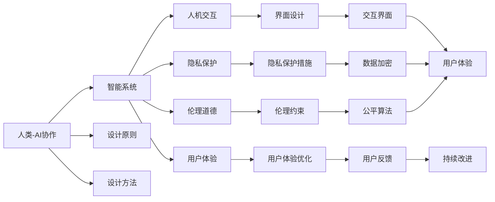

                 

# 人类-AI协作：为人类服务的设计

> 关键词：
人类-AI协作, 人工智能, 技术设计, 人机交互, 智能系统, 服务设计, 用户需求, 用户体验, 隐私保护, 伦理道德, 设计原则, 设计方法

## 1. 背景介绍

### 1.1 问题由来

随着人工智能(AI)技术的快速发展和普及，AI在医疗、金融、教育、交通等多个领域的应用，给人类生活带来了深刻变化。从辅助医疗诊断、自动化财务审计，到智能客服、无人驾驶，AI技术正在日益深入到各个行业，提供更为高效、精准的服务。然而，伴随这些变化的是，人与AI的协作关系也面临前所未有的挑战。如何更好地设计AI系统，使它们能够真正为人服务，同时确保技术的安全性、伦理性、透明性和可控性，是当前AI领域的重要课题。

### 1.2 问题核心关键点

AI技术的设计和应用，涉及到人机交互、用户体验、隐私保护、伦理道德等多个方面。如何在这几者之间取得平衡，确保AI技术既高效、智能，又符合人类价值和需求，是设计人类-AI协作系统的关键。具体问题包括：

- **人机交互设计**：如何设计直观、易用的交互界面，让人类能够自然、高效地与AI系统进行交互。
- **用户体验优化**：如何提升用户的满意度和使用体验，避免用户产生抵触情绪或疲劳。
- **隐私保护措施**：如何保障用户数据的安全和隐私，防止数据泄露和滥用。
- **伦理道德约束**：如何确保AI系统的决策透明、公正，避免对特定群体造成歧视或偏见。
- **技术稳定性和鲁棒性**：如何提高AI系统的鲁棒性和稳定性，确保其在各种复杂环境中正常运行。

这些问题的解决，需要综合考虑技术、伦理、法律等多方面因素，确保AI系统不仅具有强大技术实力，更能够真正为人类服务。

### 1.3 问题研究意义

设计高质量的人类-AI协作系统，对于推动人工智能技术的产业化进程，提升社会整体效率，具有重要意义：

1. **提升效率和生产力**：AI系统可以在大量重复性、高强度的任务中自动执行，减轻人类工作负担，提升工作效率。
2. **优化用户体验**：通过设计直观、易用的界面和交互方式，让AI技术更贴近用户需求，提供更为便捷、高效的服务。
3. **保障数据隐私和安全**：设计出隐私保护机制和数据安全措施，确保用户数据不被滥用和泄露。
4. **促进伦理和道德**：通过设计透明、公正的算法和决策过程，确保AI系统的使用符合伦理道德，不侵害用户权益。
5. **推动社会公平**：设计包容性强的AI系统，避免对特定群体造成歧视或不公平待遇，促进社会公正。

## 2. 核心概念与联系

### 2.1 核心概念概述

为更好地理解人类-AI协作的设计原则和方法，本节将介绍几个密切相关的核心概念：

- **人类-AI协作(Human-AI Collaboration)**：指通过AI技术和人类智慧的协同工作，提高工作效率、优化用户体验、实现复杂决策的智能系统。
- **智能系统(Intelligent Systems)**：以AI技术为核心的应用系统，能够自主学习和推理，完成特定任务或决策。
- **人机交互(Human-Computer Interaction, HCI)**：研究人和计算机之间交互的方法和技术，提升系统的可用性和用户满意度。
- **用户体验(User Experience, UX)**：衡量用户对产品或服务的满意度和使用体验，关注用户需求和情感。
- **隐私保护(Privacy Protection)**：确保用户数据和隐私不被滥用，防止数据泄露和滥用。
- **伦理道德(Ethics and Morality)**：指设计AI系统时考虑的伦理原则和道德规范，确保系统行为符合社会价值和用户期望。

这些核心概念之间通过特定的设计和算法框架，形成紧密联系。

### 2.2 核心概念原理和架构的 Mermaid 流程图



此流程图展示了人类-AI协作系统的主要设计元素及其相互作用：

1. **智能系统**：作为协作的核心，接收人类输入和需求，通过AI技术进行推理和决策，输出结果。
2. **人机交互**：通过界面设计，实现人类与智能系统之间的有效沟通。
3. **用户体验**：关注用户对系统的满意度和使用感受，通过优化设计提升用户体验。
4. **隐私保护**：通过数据加密和隐私保护措施，确保用户数据的安全。
5. **伦理道德**：通过公平算法和伦理约束，确保系统行为符合社会价值和用户期望。

这些设计元素相互作用，形成一个完整、高效的人类-AI协作系统。

## 3. 核心算法原理 & 具体操作步骤

### 3.1 算法原理概述

人类-AI协作系统的设计，通常分为两个主要阶段：预训练和微调。预训练阶段通过大规模数据训练模型，学习通用的知识表示；微调阶段则针对特定任务，对模型进行有监督的优化，提升模型在特定任务上的性能。

### 3.2 算法步骤详解

#### 3.2.1 预训练阶段

1. **数据准备**：收集大量的结构化或非结构化数据，进行数据清洗和标注。
2. **模型选择**：选择合适的深度学习模型，如卷积神经网络(CNN)、循环神经网络(RNN)、Transformer等。
3. **训练**：使用预训练数据，对模型进行训练。预训练过程通常使用自监督任务，如图像分类、文本生成等。
4. **评估**：对训练好的模型进行评估，检查其性能是否达到预期。

#### 3.2.2 微调阶段

1. **任务定义**：明确微调任务，如文本分类、机器翻译、图像识别等。
2. **模型适配**：在预训练模型的基础上，添加或修改任务特定的输出层和损失函数。
3. **数据集准备**：收集目标任务的标注数据集，划分为训练集、验证集和测试集。
4. **微调**：使用标注数据集，对模型进行有监督的微调。通常使用梯度下降等优化算法，以较小的学习率更新模型参数。
5. **评估和部署**：在测试集上评估模型性能，如果性能达到要求，则部署到实际应用中。

### 3.3 算法优缺点

#### 3.3.1 优点

1. **高效性**：通过预训练和微调结合，可以在相对较短的时间内构建高性能AI系统。
2. **泛化能力**：经过大规模数据训练，模型具备较强的泛化能力，可以在不同任务和场景中表现良好。
3. **可扩展性**：微调过程只需少量标注数据，可以方便地应用于多种新任务。
4. **灵活性**：通过灵活的任务适配和接口设计，可适配多种应用场景和用户需求。

#### 3.3.2 缺点

1. **数据依赖**：微调效果很大程度上依赖于标注数据的质量和数量，获取高质量标注数据成本较高。
2. **过拟合风险**：微调过程中可能出现过拟合，导致模型在新数据上表现不佳。
3. **模型复杂性**：预训练模型通常较大，微调过程中需考虑资源和计算限制。
4. **伦理和隐私问题**：微调过程中可能涉及用户数据的处理和隐私保护，需严格遵守相关法律法规。

### 3.4 算法应用领域

人类-AI协作系统的设计，已在多个领域得到应用：

- **医疗诊断**：AI辅助医生进行疾病诊断和治疗方案推荐。
- **金融分析**：AI辅助财务人员进行数据分析和风险评估。
- **教育辅导**：AI辅助教师进行个性化教学和学习效果评估。
- **智能客服**：AI辅助客服人员进行客户咨询和问题解决。
- **智能驾驶**：AI辅助驾驶员进行驾驶决策和环境感知。

## 4. 数学模型和公式 & 详细讲解 & 举例说明

### 4.1 数学模型构建

在人类-AI协作系统中，数学模型主要用于描述系统的输入、输出和中间状态，并指导系统的优化过程。

以文本分类任务为例，设输入文本为 $x$，模型输出的概率分布为 $p(y|x)$，其中 $y$ 为文本所属的类别。则目标函数为：

$$
L = -\frac{1}{N}\sum_{i=1}^N \log p(y_i|x_i)
$$

其中 $N$ 为样本数量。最小化目标函数 $L$ 即为模型的训练过程。

### 4.2 公式推导过程

对于上述目标函数 $L$，通过梯度下降算法进行优化。设模型参数为 $\theta$，则损失函数的梯度为：

$$
\frac{\partial L}{\partial \theta} = -\frac{1}{N}\sum_{i=1}^N \frac{p(y_i|x_i)}{p(y_i)} \frac{\partial p(y_i|x_i)}{\partial \theta}
$$

其中 $\frac{p(y_i|x_i)}{p(y_i)}$ 为条件概率的对数似然比，$\frac{\partial p(y_i|x_i)}{\partial \theta}$ 为模型对 $x_i$ 的条件概率对参数 $\theta$ 的梯度。通过反向传播算法，计算损失函数的梯度，并使用梯度下降等优化算法更新模型参数，最小化目标函数 $L$。

### 4.3 案例分析与讲解

以BERT模型为例，设输入文本为 $x$，模型输出为 $h(x)$，则分类任务的目标函数为：

$$
L = -\frac{1}{N}\sum_{i=1}^N \log p(y_i|h(x_i))
$$

其中 $p(y_i|h(x_i))$ 为模型在输入 $x_i$ 上对 $y_i$ 的预测概率。通过反向传播算法，计算梯度并更新参数。

## 5. 项目实践：代码实例和详细解释说明

### 5.1 开发环境搭建

以下是使用Python进行TensorFlow开发的环境配置流程：

1. 安装Anaconda：从官网下载并安装Anaconda，用于创建独立的Python环境。

2. 创建并激活虚拟环境：
```bash
conda create -n tf-env python=3.8 
conda activate tf-env
```

3. 安装TensorFlow：根据CUDA版本，从官网获取对应的安装命令。例如：
```bash
conda install tensorflow
```

4. 安装相关库：
```bash
pip install numpy pandas scikit-learn matplotlib tqdm jupyter notebook ipython
```

完成上述步骤后，即可在`tf-env`环境中开始项目实践。

### 5.2 源代码详细实现

下面我们以文本分类任务为例，给出使用TensorFlow进行BERT模型微调的代码实现。

首先，定义文本分类任务的数据处理函数：

```python
from transformers import BertTokenizer
from tensorflow.keras.datasets import imdb
from tensorflow.keras.utils import to_categorical

def load_data(num_samples=5000):
    (x_train, y_train), (x_test, y_test) = imdb.load_data(num_words=num_samples)
    tokenizer = BertTokenizer.from_pretrained('bert-base-uncased')
    x_train = tokenizer.batch_encode_plus(x_train, padding='max_length', max_length=256, truncation=True)
    x_test = tokenizer.batch_encode_plus(x_test, padding='max_length', max_length=256, truncation=True)
    y_train = to_categorical(y_train, num_classes=2)
    y_test = to_categorical(y_test, num_classes=2)
    return x_train, y_train, x_test, y_test
```

然后，定义模型和损失函数：

```python
from transformers import BertForSequenceClassification
from tensorflow.keras.layers import Dense, Dropout, Flatten
from tensorflow.keras.models import Model
from tensorflow.keras.optimizers import Adam

model = BertForSequenceClassification.from_pretrained('bert-base-uncased', num_labels=2)

input_ids = Input(shape=(256,), dtype=tf.int32, name='input_ids')
attention_mask = Input(shape=(256,), dtype=tf.int32, name='attention_mask')
classifier = Dense(2, activation='softmax', name='classifier')
outputs = classifier(model(input_ids, attention_mask=attention_mask))

model = Model(inputs=[input_ids, attention_mask], outputs=outputs)
model.compile(optimizer=Adam(learning_rate=2e-5), loss='categorical_crossentropy', metrics=['accuracy'])
```

接着，定义训练和评估函数：

```python
def train_epoch(model, x_train, y_train, x_test, y_test):
    model.fit(x_train, y_train, batch_size=32, epochs=5, validation_data=(x_test, y_test))
    test_loss, test_accuracy = model.evaluate(x_test, y_test, verbose=0)
    return test_loss, test_accuracy
```

最后，启动训练流程并在测试集上评估：

```python
x_train, y_train, x_test, y_test = load_data()
train_loss, train_accuracy = train_epoch(model, x_train, y_train, x_test, y_test)
print(f'Train loss: {train_loss:.4f}, train accuracy: {train_accuracy:.4f}')
```

以上就是使用TensorFlow对BERT模型进行文本分类任务微调的完整代码实现。可以看到，TensorFlow和Transformers库使得BERT微调的代码实现变得简洁高效。

### 5.3 代码解读与分析

让我们再详细解读一下关键代码的实现细节：

**load_data函数**：
- 定义文本数据加载函数，使用IMDB数据集。
- 使用BertTokenizer将文本数据转换为token ids，并进行padding和truncation，以适应模型输入。
- 将标签转换为one-hot编码，方便模型训练。

**定义模型和损失函数**：
- 使用BertForSequenceClassification作为分类器的输入层。
- 定义输入层，用于输入token ids和attention mask。
- 定义输出层，使用Dense层进行分类预测，并使用softmax激活函数。
- 定义模型，将输入层和输出层连接，并编译模型。

**train_epoch函数**：
- 使用fit方法进行模型训练，同时记录测试集上的性能指标。
- 返回测试集上的损失和准确率。

**启动训练流程**：
- 加载数据集，并进行训练。
- 输出训练结果。

可以看出，TensorFlow和Transformers库的结合，大大简化了模型微调的过程。开发者可以将更多精力放在数据处理、模型优化等高层逻辑上，而不必过多关注底层的实现细节。

## 6. 实际应用场景

### 6.1 智能客服系统

基于人类-AI协作的智能客服系统，可以大幅提升客服工作效率和客户满意度。传统的客服系统依赖于人工操作，响应时间长、质量不稳定。而通过预训练和微调的AI客服系统，可以7x24小时不间断服务，快速响应客户咨询，用自然流畅的语言解答各类常见问题。

在技术实现上，可以收集企业内部的历史客服对话记录，将问题和最佳答复构建成监督数据，在此基础上对预训练客服模型进行微调。微调后的模型能够自动理解用户意图，匹配最合适的答复模板进行回复。对于客户提出的新问题，还可以接入检索系统实时搜索相关内容，动态组织生成回答。

### 6.2 金融舆情监测

金融机构需要实时监测市场舆论动向，以便及时应对负面信息传播，规避金融风险。传统的人工监测方式成本高、效率低，难以应对网络时代海量信息爆发的挑战。基于人类-AI协作的金融舆情监测系统，利用自然语言处理和文本分类技术，可以自动判断文本属于何种主题，情感倾向是正面、中性还是负面。将系统应用于实时抓取的网络文本数据，就能够自动监测不同主题下的情感变化趋势，一旦发现负面信息激增等异常情况，系统便会自动预警，帮助金融机构快速应对潜在风险。

### 6.3 个性化推荐系统

当前的推荐系统往往只依赖用户的历史行为数据进行物品推荐，无法深入理解用户的真实兴趣偏好。基于人类-AI协作的个性化推荐系统，通过预训练和微调的NLP模型，可以更好地挖掘用户行为背后的语义信息，从而提供更精准、多样的推荐内容。

在实践中，可以收集用户浏览、点击、评论、分享等行为数据，提取和用户交互的物品标题、描述、标签等文本内容。将文本内容作为模型输入，用户的后续行为（如是否点击、购买等）作为监督信号，在此基础上微调预训练语言模型。微调后的模型能够从文本内容中准确把握用户的兴趣点。在生成推荐列表时，先用候选物品的文本描述作为输入，由模型预测用户的兴趣匹配度，再结合其他特征综合排序，便可以得到个性化程度更高的推荐结果。

## 7. 工具和资源推荐

### 7.1 学习资源推荐

为了帮助开发者系统掌握人类-AI协作的设计方法和实现技术，这里推荐一些优质的学习资源：

1. 《深度学习入门》系列博文：由大模型技术专家撰写，深入浅出地介绍了深度学习的基本概念和实现方法，包括TensorFlow和Transformers库的使用。
2. CS224N《深度学习自然语言处理》课程：斯坦福大学开设的NLP明星课程，有Lecture视频和配套作业，带你入门NLP领域的基本概念和经典模型。
3. 《自然语言处理综论》书籍：Russell和Norvig著作，系统介绍了NLP的基本原理和应用，包括人机交互、情感分析、机器翻译等。
4. 《TensorFlow官方文档》：TensorFlow的官方文档，提供了丰富的API文档和教程，是TensorFlow开发的必备资料。
5. 《Transformers官方文档》：Transformers库的官方文档，提供了海量预训练模型和完整的微调样例代码，是微调任务开发的必备资料。

通过对这些资源的学习实践，相信你一定能够快速掌握人类-AI协作的设计方法和实现技术，并用于解决实际的NLP问题。

### 7.2 开发工具推荐

高效的开发离不开优秀的工具支持。以下是几款用于人类-AI协作系统开发的常用工具：

1. TensorFlow：由Google主导开发的开源深度学习框架，生产部署方便，适合大规模工程应用。
2. PyTorch：基于Python的开源深度学习框架，灵活动态的计算图，适合快速迭代研究。
3. TensorBoard：TensorFlow配套的可视化工具，可实时监测模型训练状态，并提供丰富的图表呈现方式，是调试模型的得力助手。
4. Weights & Biases：模型训练的实验跟踪工具，可以记录和可视化模型训练过程中的各项指标，方便对比和调优。
5. Transformers库：HuggingFace开发的NLP工具库，集成了众多SOTA语言模型，支持TensorFlow和PyTorch，是微调任务开发的利器。

合理利用这些工具，可以显著提升人类-AI协作系统的开发效率，加快创新迭代的步伐。

### 7.3 相关论文推荐

人类-AI协作技术的发展源于学界的持续研究。以下是几篇奠基性的相关论文，推荐阅读：

1. Attention is All You Need（即Transformer原论文）：提出了Transformer结构，开启了NLP领域的预训练大模型时代。
2. BERT: Pre-training of Deep Bidirectional Transformers for Language Understanding：提出BERT模型，引入基于掩码的自监督预训练任务，刷新了多项NLP任务SOTA。
3. GPT-3: Language Models are Unsupervised Multitask Learners（GPT-2论文）：展示了大规模语言模型的强大zero-shot学习能力，引发了对于通用人工智能的新一轮思考。
4. Adversarial Examples in Natural Language Processing：研究自然语言处理中的对抗样本问题，提出对抗训练等改进方法，提高模型的鲁棒性。
5. Fairness and Sexism in AI：探讨AI系统中的公平性问题，提出公平算法等改进方法，确保模型决策的透明和公正。

这些论文代表了大模型微调技术的发展脉络。通过学习这些前沿成果，可以帮助研究者把握学科前进方向，激发更多的创新灵感。

## 8. 总结：未来发展趋势与挑战

### 8.1 总结

本文对人类-AI协作的设计方法和实现技术进行了全面系统的介绍。首先阐述了人类-AI协作在提升效率、优化体验、保障隐私和伦理等方面的重要意义，明确了系统设计的关键要素。其次，从原理到实践，详细讲解了系统设计的基本步骤和关键算法，给出了系统开发的完整代码实例。同时，本文还探讨了系统在智能客服、金融舆情、个性化推荐等多个领域的应用前景，展示了系统设计的巨大潜力。

通过本文的系统梳理，可以看到，人类-AI协作系统正在成为AI技术应用的重要范式，极大地拓展了AI系统的应用边界，催生了更多的落地场景。受益于大模型和微调方法的不断演进，人类-AI协作系统必将在更多领域得到应用，为人类生活带来深刻变革。

### 8.2 未来发展趋势

展望未来，人类-AI协作系统将呈现以下几个发展趋势：

1. **智能化水平提升**：随着大模型和微调技术的不断发展，未来的人机协作系统将更加智能、高效，能够处理更为复杂和多样化的任务。
2. **用户交互自然化**：通过自然语言处理和语音识别技术，人机交互将更加自然、流畅，增强用户体验。
3. **隐私保护强化**：随着用户隐私意识的提高，未来的系统将更加注重数据安全和隐私保护，防止数据泄露和滥用。
4. **伦理和道德约束**：未来的系统将更加透明、公正，避免对特定群体造成歧视或不公平待遇，确保系统行为符合社会价值和用户期望。
5. **跨模态融合**：将符号化的先验知识，如知识图谱、逻辑规则等，与神经网络模型进行融合，提高系统决策的准确性和可信度。

这些趋势将推动人类-AI协作系统向更高的智能化水平迈进，为各行各业提供更为强大、可靠的智能服务。

### 8.3 面临的挑战

尽管人类-AI协作系统已经取得了显著进展，但在迈向更加智能化、普适化应用的过程中，它仍面临诸多挑战：

1. **数据质量和隐私保护**：获取高质量标注数据和保障用户隐私是系统设计的核心问题，需采取有效措施确保数据安全和隐私保护。
2. **模型复杂性和计算资源**：大模型和复杂系统的部署需要大量计算资源，如何优化模型结构和资源配置，仍是重要研究方向。
3. **公平性和偏见问题**：AI系统可能存在算法偏见和歧视，如何构建公平、公正的决策机制，确保系统行为的透明和公正。
4. **鲁棒性和稳定性**：AI系统在复杂环境中可能出现鲁棒性不足、稳定性差等问题，如何提高系统的鲁棒性和稳定性，仍需深入研究。
5. **可解释性和可控性**：AI系统往往具有"黑盒"特性，难以解释其内部工作机制，如何提升系统的可解释性和可控性，增强用户信任。

这些挑战需要我们从技术、伦理、法律等多方面进行协同攻关，才能真正实现人类-AI协作系统的成熟应用。

### 8.4 研究展望

面对人类-AI协作系统面临的挑战，未来的研究需要在以下几个方面寻求新的突破：

1. **数据增强和生成技术**：通过数据增强和生成技术，提高系统对新数据和新任务的学习能力。
2. **参数高效和计算高效技术**：开发更加参数高效和计算高效的微调方法，在保证性能的同时，降低对计算资源的需求。
3. **公平算法和透明机制**：研究公平算法和透明机制，构建公平、公正的AI系统，确保系统行为符合伦理道德。
4. **跨模态融合技术**：将视觉、语音、文本等多种模态信息融合，提升系统对现实世界的理解和建模能力。
5. **隐私保护技术**：研究隐私保护技术，保障用户数据安全和隐私保护，防止数据泄露和滥用。

这些研究方向将推动人类-AI协作系统向更高的智能化水平迈进，为构建安全、可靠、可解释、可控的智能系统铺平道路。面向未来，人类-AI协作系统还需要与其他人工智能技术进行更深入的融合，如知识表示、因果推理、强化学习等，多路径协同发力，共同推动自然语言理解和智能交互系统的进步。

## 9. 附录：常见问题与解答

**Q1：如何设计直观、易用的交互界面？**

A: 设计直观、易用的交互界面，需要考虑以下几个关键点：
1. 用户需求分析：通过调研和用户反馈，了解用户的使用习惯和需求。
2. 界面设计原则：遵循简洁、一致、可访问性等原则，确保界面的友好性和易用性。
3. 交互设计技术：使用可视化设计工具，如Sketch、Figma等，进行界面原型设计和可视化呈现。
4. 用户测试和迭代：通过用户测试和反馈，不断优化界面设计，提升用户体验。

**Q2：如何提升用户满意度和使用体验？**

A: 提升用户满意度和使用体验，需要从以下几个方面进行优化：
1. 快速响应：确保系统响应时间短、无卡顿，提升用户使用体验。
2. 准确性和一致性：提高系统预测和推荐的准确性，确保输出一致性。
3. 易用性和可操作性：简化用户操作流程，提供明确的指引和帮助。
4. 个性化和定制化：根据用户偏好和行为数据，提供个性化的推荐和服务。
5. 持续优化：通过用户反馈和数据分析，不断改进系统功能和服务。

**Q3：如何保障用户数据的安全和隐私？**

A: 保障用户数据的安全和隐私，需要采取以下措施：
1. 数据加密和传输安全：使用加密技术保护数据传输和存储安全。
2. 访问控制和权限管理：严格控制数据访问权限，防止未授权访问。
3. 数据匿名化和去标识化：对数据进行匿名化和去标识化处理，保护用户隐私。
4. 隐私政策和用户知情权：制定透明的隐私政策，保障用户知情权和选择权。
5. 定期审计和合规检查：定期进行安全审计和合规检查，确保数据保护措施的有效性。

**Q4：如何确保AI系统的公平和透明？**

A: 确保AI系统的公平和透明，需要采取以下措施：
1. 公平算法设计：构建公平、公正的算法，避免算法偏见和歧视。
2. 透明决策过程：通过可解释的模型和解释技术，确保系统决策透明、可解释。
3. 用户反馈和监督：建立用户反馈和监督机制，及时发现和纠正不公平行为。
4. 伦理审查和评估：进行伦理审查和评估，确保系统行为符合社会价值和用户期望。
5. 模型可解释性和可控性：提升模型的可解释性和可控性，增强用户信任。

**Q5：如何提升AI系统的鲁棒性和稳定性？**

A: 提升AI系统的鲁棒性和稳定性，需要采取以下措施：
1. 数据增强和对抗训练：通过数据增强和对抗训练，提高系统对噪声和干扰的鲁棒性。
2. 模型优化和验证：通过模型优化和验证，提高模型的泛化能力和鲁棒性。
3. 异常检测和处理：构建异常检测机制，及时发现和处理异常情况。
4. 多模型融合和集成：通过多模型融合和集成，提高系统的稳定性和鲁棒性。
5. 持续监控和维护：通过持续监控和维护，及时发现和修复系统问题，确保系统稳定运行。

**Q6：如何提升AI系统的可解释性和可控性？**

A: 提升AI系统的可解释性和可控性，需要采取以下措施：
1. 可解释模型设计：使用可解释性较强的模型，如决策树、规则模型等。
2. 解释技术应用：通过解释技术，如特征重要性分析、模型可视化等，增强系统可解释性。
3. 透明决策过程：构建透明的决策过程，确保用户对系统行为的理解和信任。
4. 用户教育与引导：通过用户教育和引导，提升用户对系统决策的理解和接受。
5. 反馈和改进机制：建立用户反馈和改进机制，不断优化系统性能和决策过程。

**Q7：如何构建人类-AI协作系统？**

A: 构建人类-AI协作系统，需要从以下几个方面进行设计：
1. 系统目标定义：明确系统设计目标和用户需求，制定系统设计方案。
2. 技术架构设计：选择合适的技术架构，设计系统的输入、输出和中间状态。
3. 用户界面设计：设计直观、易用的用户界面，提高系统的可操作性和用户体验。
4. 数据处理和存储：设计数据处理和存储方案，确保数据安全和隐私保护。
5. 模型训练和微调：选择合适的方法进行模型训练和微调，提升系统的性能和鲁棒性。
6. 系统集成和部署：将各个组件集成到系统中，并进行测试和部署，确保系统稳定运行。
7. 用户反馈和优化：通过用户反馈和数据分析，不断改进系统功能和服务，提升用户满意度。

通过系统梳理和具体实践，相信你一定能够掌握人类-AI协作系统的设计方法和实现技术，并用于解决实际的AI问题。

---

作者：禅与计算机程序设计艺术 / Zen and the Art of Computer Programming

