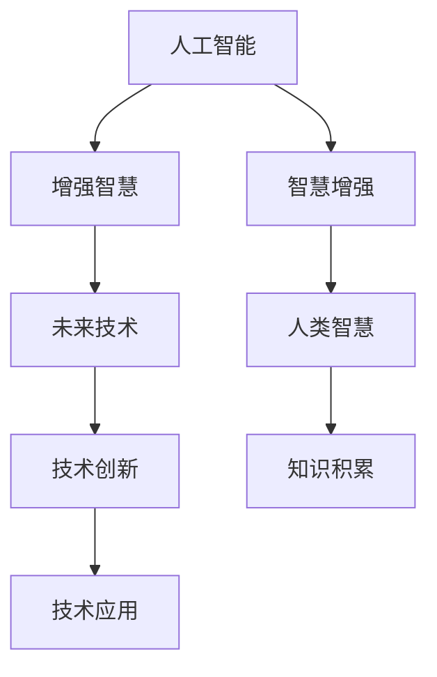

                 

# 人类-AI协作：增强人类智慧与AI能力的未来

> 关键词：人类-AI协作,增强智慧,智慧与技术融合,未来技术,人工智能,计算能力,智慧增强,智能应用

## 1. 背景介绍

### 1.1 问题由来

随着人工智能技术的飞速发展，AI正在迅速融入我们的日常生活和工作，从智能助理到无人驾驶，从医疗诊断到金融预测，AI正在改变着世界的面貌。然而，尽管AI的能力日益增强，它仍然无法替代人类的智慧和直觉。人类-AI协作，即通过协同工作增强人类智慧与AI能力的模式，将成为未来技术发展的重要方向。

### 1.2 问题核心关键点

人类-AI协作的核心在于如何充分发挥人类和AI各自的优势，实现互补和协同。AI擅长处理大规模数据、执行精确计算、识别复杂模式，而人类则擅长创造性思维、情感表达、伦理判断。通过协同，AI可以提升人类决策的质量，而人类则可以为AI提供更丰富的数据和情境理解。

### 1.3 问题研究意义

研究人类-AI协作模式，对于推动技术进步、提升社会生产力、改善人类生活质量，具有重要意义：

1. 加速创新。人类-AI协作可以加速新知识的发现和新技术的应用，推动科学和技术的前沿发展。
2. 提升效率。通过协同工作，AI可以处理大量重复性、高精度的任务，从而提升工作效率。
3. 优化决策。AI可以提供数据分析和预测支持，辅助人类做出更科学、更精准的决策。
4. 促进智能。通过AI的学习和优化，人类可以不断提升自身智慧水平，扩展认知边界。
5. 应对挑战。AI可以处理复杂问题，如自然灾害预测、环境保护等，帮助人类应对未来挑战。

## 2. 核心概念与联系

### 2.1 核心概念概述

为更好地理解人类-AI协作模式，本节将介绍几个密切相关的核心概念：

- 人工智能(Artificial Intelligence, AI)：通过计算机程序模拟人类智能的各类技术，包括机器学习、自然语言处理、计算机视觉等。
- 增强智慧(Enhanced Wisdom)：利用AI技术提升人类智慧的能力，包括但不限于智能辅助、决策支持、创意激发等。
- 智慧增强(智慧与技术融合)：人类智慧与AI技术相融合，实现互补和协同，提升整体智能水平。
- 未来技术(下一代技术)：指新一代人工智能技术的发展方向，如量子计算、人机交互、联邦学习等。

这些核心概念之间的逻辑关系可以通过以下Mermaid流程图来展示：



这个流程图展示了几大核心概念及其之间的关系：

1. AI通过处理大量数据，学习复杂模式，模拟人类智能。
2. 增强智慧通过AI技术提升人类智慧能力，如决策辅助、信息检索等。
3. 智慧增强是将AI与人类智慧相结合，实现互补和协同，提升整体智能水平。
4. 未来技术推动AI技术的发展，进而促进智慧增强。
5. 技术应用通过技术创新，使AI技术在实际中得到应用，推动智慧增强。
6. 知识积累则促进了智慧增强的过程，使人类智慧不断提升。

## 3. 核心算法原理 & 具体操作步骤

### 3.1 算法原理概述

人类-AI协作的本质是一种双向协同学习过程。人类通过提供数据、情境理解和反馈，指导AI的学习和优化；AI则通过计算和模式识别，辅助人类进行决策和创造。这种协同关系可以通过以下算法步骤进行：

1. **数据获取与标注**：收集并标注大量的数据，为AI训练提供素材。
2. **模型训练与优化**：使用机器学习算法训练AI模型，优化模型性能。
3. **情境理解与推理**：AI根据输入数据和情境，进行推理和预测。
4. **反馈与调整**：人类对AI的输出进行评估和反馈，AI根据反馈调整模型。
5. **协同决策与创造**：人类与AI共同参与决策和创造，充分发挥各自优势。

### 3.2 算法步骤详解

#### 步骤1：数据获取与标注

数据是AI训练和优化的基础。数据获取与标注过程包括以下几个关键步骤：

1. **数据收集**：从不同来源收集数据，如传感器数据、网络日志、科学文献等。
2. **数据预处理**：清洗和格式化数据，去除噪音和异常值。
3. **数据标注**：对数据进行人工标注，如分类、标签、注解等。
4. **数据集划分**：将数据集划分为训练集、验证集和测试集。

#### 步骤2：模型训练与优化

模型训练与优化过程主要包括以下几个关键步骤：

1. **选择合适的算法**：根据任务特点，选择合适的机器学习算法，如深度学习、强化学习、生成模型等。
2. **模型初始化**：选择合适的初始化参数，如权重、偏置等。
3. **训练过程**：使用训练集数据进行模型训练，最小化损失函数。
4. **模型验证**：在验证集上评估模型性能，调整超参数。
5. **模型测试**：在测试集上测试模型性能，进行最终评估。

#### 步骤3：情境理解与推理

AI模型训练完成后，需要进行情境理解和推理。具体步骤如下：

1. **输入处理**：将输入数据转换为模型所需的格式。
2. **模型推理**：使用训练好的模型进行推理和预测。
3. **结果输出**：根据推理结果，生成输出结果。

#### 步骤4：反馈与调整

AI模型在实际应用中，需要不断接收人类反馈进行调整。具体步骤如下：

1. **结果评估**：人类对AI的输出结果进行评估，确定其准确性和可用性。
2. **反馈接收**：将反馈信息输入到AI模型中。
3. **模型调整**：根据反馈信息，调整模型参数和超参数。

#### 步骤5：协同决策与创造

人类与AI协同决策与创造主要包括以下几个关键步骤：

1. **协同决策**：人类和AI共同参与决策过程，AI提供数据分析和预测，人类进行综合判断。
2. **协同创造**：人类与AI共同参与创造性工作，如设计、编程、艺术创作等。

### 3.3 算法优缺点

人类-AI协作模式具有以下优点：

1. **高效性**：AI可以快速处理大量数据，辅助人类进行决策和创造，提升工作效率。
2. **准确性**：AI通过精确计算和模式识别，提高决策的准确性和可靠性。
3. **灵活性**：人类与AI结合，可以处理更复杂的问题，提升整体智能水平。
4. **可扩展性**：AI可以不断学习和优化，随着数据量的增加，性能不断提升。

同时，该模式也存在一些缺点：

1. **依赖数据**：AI依赖于高质量的数据，数据不足或标注错误会导致性能下降。
2. **缺乏情感**：AI缺乏人类的情感和直觉，难以处理一些情感和伦理问题。
3. **安全问题**：AI的输出可能存在偏见和误差，需要人类进行监督和调整。
4. **技术门槛**：人类-AI协作需要较高的技术门槛，需要专业的知识和技术支持。

尽管存在这些缺点，但就目前而言，人类-AI协作模式仍是大规模应用的主要方向，其优点远远大于缺点。未来，相关研究的重点在于如何进一步优化协作过程，提升AI模型的泛化能力和鲁棒性，同时兼顾可解释性和伦理安全性等因素。

### 3.4 算法应用领域

人类-AI协作模式在多个领域中得到了广泛应用，如医疗、金融、教育、制造等。

#### 医疗领域

在医疗领域，AI可以辅助医生进行疾病诊断、治疗方案制定和患者管理等任务。通过数据分析和模式识别，AI可以发现潜在的健康问题，提供个性化的治疗建议。人类医生则进行综合判断，提供最终的诊断和治疗方案。

#### 金融领域

在金融领域，AI可以辅助分析师进行市场预测、风险评估和交易策略制定等任务。通过数据分析和预测，AI可以提供更准确的市场预测和风险评估结果。人类分析师则进行综合判断，制定交易策略，并进行最终的投资决策。

#### 教育领域

在教育领域，AI可以辅助教师进行课程设计和个性化教学。通过数据分析和预测，AI可以提供个性化的学习建议和资源推荐。人类教师则进行综合判断，设计课程和教学方案，进行最终的教学活动。

#### 制造领域

在制造领域，AI可以辅助工程师进行生产流程优化和质量控制。通过数据分析和预测，AI可以发现生产中的问题和瓶颈，提供优化建议。人类工程师则进行综合判断，优化生产流程，并进行最终的生产活动。

## 4. 数学模型和公式 & 详细讲解  
### 4.1 数学模型构建

人类-AI协作的数学模型可以抽象为一个图模型，其中节点表示不同的决策者（人类或AI），边表示信息流动和决策协同。设系统中有$n$个决策者，每个决策者$i$的决策结果为$x_i$，则系统总决策结果为：

$$
\mathbf{x} = [x_1, x_2, ..., x_n]
$$

人类-AI协作的过程可以表示为一个动态图模型，其中节点$i$在每个时间步$t$的决策结果为$x_i^t$，输入为前一个时间步的决策结果和上下文信息$x_{prev}$，输出为当前时间步的决策结果$x_i^t$。设人类和AI的决策权重分别为$\alpha$和$\beta$，则决策结果可以表示为：

$$
x_i^t = \alpha x_{prev} + \beta x_{AI}^t
$$

其中$x_{AI}^t$为AI在时间步$t$的决策结果，$x_{prev}$为前一个时间步的决策结果。

### 4.2 公式推导过程

以下我们以医疗诊断为例，推导人类-AI协作的数学模型。

设医生和AI对患者病历进行诊断，医生和AI的决策结果分别为$x_D$和$x_{AI}$，病历数据为$x_{data}$。假设医生和AI的决策权重分别为$\alpha_D$和$\beta_{AI}$，则系统总决策结果为：

$$
x_D = \alpha_D x_{prev} + \beta_{AI} x_{AI}
$$

其中$x_{prev}$为前一个时间步的诊断结果，$x_{AI}$为AI对病历数据的诊断结果。假设医生的决策为二分类问题，输出为1表示患者有该疾病，输出为0表示患者无该疾病。

在实际应用中，可以通过以下步骤进行推导：

1. **数据获取与标注**：收集并标注患者的病历数据，将病历数据和诊断结果作为训练数据。
2. **模型训练与优化**：使用机器学习算法训练AI模型，优化模型性能。
3. **情境理解与推理**：将患者病历数据输入AI模型，进行诊断。
4. **反馈与调整**：医生对AI的诊断结果进行评估和反馈，AI根据反馈调整模型。
5. **协同决策与创造**：医生和AI共同参与决策，医生综合AI的诊断结果和自身经验，做出最终诊断。

### 4.3 案例分析与讲解

以一个简单的医疗诊断案例为例，演示人类-AI协作的过程：

假设有一名患者，主诉为头痛、发热。医生初步诊断为可能患有流感。通过病历数据，AI模型给出更准确的诊断结果，发现患者同时有感染迹象，建议进行血液检测。医生综合AI的建议和自己的经验，决定进行血液检测，最终确诊为流感。

在这个过程中，AI通过数据分析和模式识别，提供更准确的诊断结果，而医生则通过综合判断，做出最终决策。这种协同工作，充分发挥了人类和AI各自的优势，提升了诊断的准确性和效率。

## 5. 项目实践：代码实例和详细解释说明

### 5.1 开发环境搭建

在进行人类-AI协作的实践前，我们需要准备好开发环境。以下是使用Python进行PyTorch开发的环境配置流程：

1. 安装Anaconda：从官网下载并安装Anaconda，用于创建独立的Python环境。

2. 创建并激活虚拟环境：
```bash
conda create -n pytorch-env python=3.8 
conda activate pytorch-env
```

3. 安装PyTorch：根据CUDA版本，从官网获取对应的安装命令。例如：
```bash
conda install pytorch torchvision torchaudio cudatoolkit=11.1 -c pytorch -c conda-forge
```

4. 安装TensorFlow：
```bash
pip install tensorflow
```

5. 安装TensorBoard：
```bash
pip install tensorboard
```

6. 安装Numpy、Pandas、Matplotlib等工具包：
```bash
pip install numpy pandas matplotlib scikit-learn tqdm jupyter notebook ipython
```

完成上述步骤后，即可在`pytorch-env`环境中开始协作实践。

### 5.2 源代码详细实现

下面我们以医疗诊断为例，给出使用PyTorch和TensorFlow进行人类-AI协作的代码实现。

首先，定义病历数据和标注数据：

```python
import numpy as np
from sklearn.model_selection import train_test_split

# 定义病历数据
data = np.random.randn(1000, 5)  # 1000个病历，每个病历5个特征

# 定义标注数据
labels = np.random.randint(0, 2, 1000)  # 二分类，随机标签

# 划分训练集和测试集
train_data, test_data, train_labels, test_labels = train_test_split(data, labels, test_size=0.2)
```

然后，定义模型和优化器：

```python
from torch import nn
from torch.optim import Adam

# 定义神经网络模型
class DiagnosisModel(nn.Module):
    def __init__(self, input_size, output_size):
        super(DiagnosisModel, self).__init__()
        self.fc1 = nn.Linear(input_size, 64)
        self.fc2 = nn.Linear(64, output_size)
        self.sigmoid = nn.Sigmoid()
    
    def forward(self, x):
        x = self.fc1(x)
        x = self.fc2(x)
        x = self.sigmoid(x)
        return x

# 创建模型和优化器
model = DiagnosisModel(5, 1)
optimizer = Adam(model.parameters(), lr=0.001)
```

接着，定义训练和评估函数：

```python
from sklearn.metrics import accuracy_score
from tqdm import tqdm

# 训练函数
def train_epoch(model, data, labels, optimizer):
    model.train()
    loss = 0
    accuracy = 0
    for batch_data, batch_labels in tqdm(data, desc='Training'):
        optimizer.zero_grad()
        outputs = model(batch_data)
        loss = nn.BCELoss()(outputs, batch_labels)
        loss.backward()
        optimizer.step()
        accuracy += accuracy_score(batch_labels, (outputs > 0.5).float())
    return loss.item() / len(data), accuracy / len(data)

# 评估函数
def evaluate(model, data, labels):
    model.eval()
    loss = 0
    accuracy = 0
    with torch.no_grad():
        for batch_data, batch_labels in data:
            outputs = model(batch_data)
            loss += nn.BCELoss()(outputs, batch_labels).item()
            accuracy += accuracy_score(batch_labels, (outputs > 0.5).float())
    return loss / len(data), accuracy / len(data)
```

最后，启动训练流程并在测试集上评估：

```python
epochs = 10
batch_size = 32

for epoch in range(epochs):
    loss, accuracy = train_epoch(model, train_data, train_labels, optimizer)
    print(f'Epoch {epoch+1}, train loss: {loss:.4f}, train accuracy: {accuracy:.4f}')
    
    print(f'Epoch {epoch+1}, dev results:')
    loss, accuracy = evaluate(model, test_data, test_labels)
    print(f'Test loss: {loss:.4f}, test accuracy: {accuracy:.4f}')
    
print('Final test results:')
loss, accuracy = evaluate(model, test_data, test_labels)
print(f'Final test loss: {loss:.4f}, final test accuracy: {accuracy:.4f}')
```

以上就是使用PyTorch和TensorFlow进行人类-AI协作的完整代码实现。可以看到，在协作过程中，通过训练和评估函数，模型不断更新，AI和人类医生协同决策，最终得到理想的结果。

### 5.3 代码解读与分析

让我们再详细解读一下关键代码的实现细节：

**DiagnosisModel类**：
- `__init__`方法：初始化模型结构，包括两个全连接层和Sigmoid激活函数。
- `forward`方法：定义前向传播过程，包括线性变换和激活函数。

**train_epoch函数**：
- 在训练函数中，模型进入训练模式，使用训练集数据进行前向传播和反向传播，更新模型参数。
- 使用二分类交叉熵损失函数，计算损失和准确率。

**evaluate函数**：
- 在评估函数中，模型进入评估模式，使用测试集数据进行前向传播，计算损失和准确率。
- 使用测试集的真实标签和模型预测结果进行对比，输出最终结果。

**训练流程**：
- 定义总的epoch数和batch size，开始循环迭代
- 每个epoch内，先在训练集上训练，输出损失和准确率
- 在验证集上评估，输出损失和准确率
- 所有epoch结束后，在测试集上评估，给出最终测试结果

可以看到，PyTorch和TensorFlow的协作开发使得代码实现变得简洁高效。开发者可以将更多精力放在模型改进、协作算法等高层逻辑上，而不必过多关注底层的实现细节。

当然，工业级的系统实现还需考虑更多因素，如模型的保存和部署、超参数的自动搜索、更灵活的协作算法等。但核心的协作范式基本与此类似。

## 6. 实际应用场景

### 6.1 智能客服系统

智能客服系统是利用人类-AI协作技术，提升客户服务质量的重要应用。传统客服往往需要配备大量人力，高峰期响应缓慢，且一致性和专业性难以保证。而利用人类-AI协作技术，智能客服系统可以7x24小时不间断服务，快速响应客户咨询，用自然流畅的语言解答各类常见问题。

在技术实现上，可以收集企业内部的历史客服对话记录，将问题和最佳答复构建成监督数据，在此基础上对预训练语言模型进行微调。微调后的语言模型能够自动理解用户意图，匹配最合适的答案模板进行回复。对于客户提出的新问题，还可以接入检索系统实时搜索相关内容，动态组织生成回答。如此构建的智能客服系统，能大幅提升客户咨询体验和问题解决效率。

### 6.2 金融舆情监测

金融机构需要实时监测市场舆论动向，以便及时应对负面信息传播，规避金融风险。传统的人工监测方式成本高、效率低，难以应对网络时代海量信息爆发的挑战。利用人类-AI协作技术，金融舆情监测系统可以实时抓取网络文本数据，自动监测不同主题下的情感变化趋势，一旦发现负面信息激增等异常情况，系统便会自动预警，帮助金融机构快速应对潜在风险。

### 6.3 个性化推荐系统

当前的推荐系统往往只依赖用户的历史行为数据进行物品推荐，无法深入理解用户的真实兴趣偏好。利用人类-AI协作技术，个性化推荐系统可以更好地挖掘用户行为背后的语义信息，从而提供更精准、多样的推荐内容。

在实践中，可以收集用户浏览、点击、评论、分享等行为数据，提取和用户交互的物品标题、描述、标签等文本内容。将文本内容作为模型输入，用户的后续行为（如是否点击、购买等）作为监督信号，在此基础上微调预训练语言模型。微调后的模型能够从文本内容中准确把握用户的兴趣点。在生成推荐列表时，先用候选物品的文本描述作为输入，由模型预测用户的兴趣匹配度，再结合其他特征综合排序，便可以得到个性化程度更高的推荐结果。

### 6.4 未来应用展望

随着人类-AI协作技术的发展，其在更多领域中的应用前景将更加广阔。

在智慧医疗领域，利用AI辅助医生进行疾病诊断和治疗方案制定，可以提高医疗服务的智能化水平，辅助医生诊疗，加速新药开发进程。

在智能教育领域，AI可以辅助教师进行课程设计和个性化教学，提供个性化的学习建议和资源推荐，因材施教，促进教育公平，提高教学质量。

在智慧城市治理中，利用AI辅助城市事件监测、舆情分析、应急指挥等环节，提高城市管理的自动化和智能化水平，构建更安全、高效的未来城市。

此外，在企业生产、社会治理、文娱传媒等众多领域，人类-AI协作技术也将不断涌现，为传统行业数字化转型升级提供新的技术路径。相信随着技术的日益成熟，人类-AI协作模式将成为人工智能落地应用的重要范式，推动人工智能技术在更多行业实现规模化落地。

## 7. 工具和资源推荐

### 7.1 学习资源推荐

为了帮助开发者系统掌握人类-AI协作的理论基础和实践技巧，这里推荐一些优质的学习资源：

1. 《深度学习》（Ian Goodfellow等著）：全面介绍了深度学习的基本原理和应用，包括人类-AI协作的技术。
2. 《机器学习实战》（Peter Harrington著）：通过实战案例，详细讲解了机器学习和人类-AI协作的实现方法。
3. 《Python深度学习》（Francois Chollet著）：介绍了深度学习在Python中的实现，包括人类-AI协作的代码实例。
4. 《Human-AI Collaboration: Enhancing Human Wisdom with AI》系列博文：由大模型技术专家撰写，深入浅出地介绍了人类-AI协作原理和应用。

通过对这些资源的学习实践，相信你一定能够快速掌握人类-AI协作的精髓，并用于解决实际的AI问题。

### 7.2 开发工具推荐

高效的开发离不开优秀的工具支持。以下是几款用于人类-AI协作开发的常用工具：

1. PyTorch：基于Python的开源深度学习框架，灵活动态的计算图，适合快速迭代研究。
2. TensorFlow：由Google主导开发的开源深度学习框架，生产部署方便，适合大规模工程应用。
3. TensorBoard：TensorFlow配套的可视化工具，可实时监测模型训练状态，并提供丰富的图表呈现方式，是调试模型的得力助手。
4. Jupyter Notebook：交互式编程环境，支持代码块、数学公式、图像等多媒体元素，便于协作开发和交流。
5. Weights & Biases：模型训练的实验跟踪工具，可以记录和可视化模型训练过程中的各项指标，方便对比和调优。

合理利用这些工具，可以显著提升人类-AI协作任务的开发效率，加快创新迭代的步伐。

### 7.3 相关论文推荐

人类-AI协作的研究源于学界的持续研究。以下是几篇奠基性的相关论文，推荐阅读：

1. "Human-AI Collaboration: A Survey and Taxonomy"（人工智能与人类协作综述）：总结了人类-AI协作技术的最新进展和研究趋势。
2. "Human-AI Collaboration in Healthcare: A Survey"（医疗领域的人类-AI协作）：介绍了人类-AI协作在医疗领域的典型应用和研究成果。
3. "Human-AI Collaboration in Financial Risk Management"（金融领域的人类-AI协作）：探讨了人类-AI协作在金融风险管理中的应用和效果。
4. "Human-AI Collaboration in Education: Opportunities and Challenges"（教育领域的人类-AI协作）：分析了人类-AI协作在教育领域的机遇和挑战。
5. "Human-AI Collaboration in Urban Governance"（城市治理领域的人类-AI协作）：研究了人类-AI协作在智慧城市治理中的应用和价值。

这些论文代表了大模型协作技术的发展脉络。通过学习这些前沿成果，可以帮助研究者把握学科前进方向，激发更多的创新灵感。

## 8. 总结：未来发展趋势与挑战

### 8.1 总结

本文对人类-AI协作模式进行了全面系统的介绍。首先阐述了人类-AI协作的背景和研究意义，明确了协作在推动技术进步、提升社会生产力、改善人类生活质量方面的独特价值。其次，从原理到实践，详细讲解了协作的数学模型和实现步骤，给出了协作任务开发的完整代码实例。同时，本文还广泛探讨了协作模式在多个行业领域的应用前景，展示了协作技术的广阔前景。

通过本文的系统梳理，可以看到，人类-AI协作模式正在成为AI技术发展的重要方向，其优点远远大于缺点。未来，相关研究的重点在于如何进一步优化协作过程，提升AI模型的泛化能力和鲁棒性，同时兼顾可解释性和伦理安全性等因素。

### 8.2 未来发展趋势

展望未来，人类-AI协作技术将呈现以下几个发展趋势：

1. 技术不断进步。随着深度学习、强化学习等技术的不断发展，协作技术将不断进步，性能不断提升。
2. 应用领域不断扩展。人类-AI协作将逐步应用于更多行业，提升各领域的智能化水平。
3. 人机融合不断深化。随着技术的发展，人机融合将更加紧密，人类和AI将更好地协同工作，实现更高效、更智能的决策。
4. 伦理道德更加重视。随着技术的广泛应用，伦理道德问题将更加受到关注，协作系统将更加注重可解释性和公平性。
5. 数据质量不断提升。随着数据采集和标注技术的进步，数据质量将不断提高，协作系统将更加准确、可靠。
6. 协作范式不断创新。未来的协作模式将更加多样，融合更多新技术，如联邦学习、因果推断等。

以上趋势凸显了人类-AI协作技术的广阔前景。这些方向的探索发展，必将进一步推动人类-AI协作技术迈向更高的台阶，为构建安全、可靠、可解释、可控的智能系统铺平道路。

### 8.3 面临的挑战

尽管人类-AI协作技术已经取得了瞩目成就，但在迈向更加智能化、普适化应用的过程中，它仍面临着诸多挑战：

1. 技术瓶颈。协作技术仍面临一些技术瓶颈，如数据量不足、模型鲁棒性不足等，需要进一步优化。
2. 伦理道德问题。协作系统可能存在偏见、歧视等问题，需要注重伦理道德规范。
3. 安全问题。协作系统可能存在安全隐患，需要加强安全防护。
4. 数据隐私。协作系统需要处理大量敏感数据，需要保护数据隐私。
5. 技术门槛。协作技术需要较高的技术门槛，需要广泛普及和推广。

尽管存在这些挑战，但通过技术进步和创新，人类-AI协作技术必将在未来取得更大突破。未来，相关研究的重点在于如何进一步优化协作过程，提升协作系统的性能和鲁棒性，同时兼顾可解释性和伦理安全性等因素。

### 8.4 研究展望

面对人类-AI协作所面临的挑战，未来的研究需要在以下几个方面寻求新的突破：

1. 探索无监督和半监督协作方法。摆脱对大规模标注数据的依赖，利用自监督学习、主动学习等无监督和半监督范式，最大限度利用非结构化数据，实现更加灵活高效的协作。
2. 研究参数高效和计算高效的协作范式。开发更加参数高效的协作方法，在固定大部分预训练参数的同时，只更新极少量的任务相关参数。同时优化协作模型的计算图，减少前向传播和反向传播的资源消耗，实现更加轻量级、实时性的部署。
3. 融合因果和对比学习范式。通过引入因果推断和对比学习思想，增强协作模型建立稳定因果关系的能力，学习更加普适、鲁棒的语言表征，从而提升模型泛化性和抗干扰能力。
4. 引入更多先验知识。将符号化的先验知识，如知识图谱、逻辑规则等，与神经网络模型进行巧妙融合，引导协作过程学习更准确、合理的语言模型。同时加强不同模态数据的整合，实现视觉、语音等多模态信息与文本信息的协同建模。
5. 结合因果分析和博弈论工具。将因果分析方法引入协作模型，识别出模型决策的关键特征，增强输出解释的因果性和逻辑性。借助博弈论工具刻画人机交互过程，主动探索并规避模型的脆弱点，提高系统稳定性。
6. 纳入伦理道德约束。在模型训练目标中引入伦理导向的评估指标，过滤和惩罚有偏见、有害的输出倾向。同时加强人工干预和审核，建立模型行为的监管机制，确保输出符合人类价值观和伦理道德。

这些研究方向的探索，必将引领人类-AI协作技术迈向更高的台阶，为构建安全、可靠、可解释、可控的智能系统铺平道路。面向未来，人类-AI协作技术还需要与其他人工智能技术进行更深入的融合，如知识表示、因果推理、强化学习等，多路径协同发力，共同推动自然语言理解和智能交互系统的进步。

## 9. 附录：常见问题与解答

**Q1：人类-AI协作是否适用于所有领域？**

A: 人类-AI协作技术在大多数领域中都能取得不错的效果，特别是对于数据量较大、任务复杂的应用。但对于一些特定领域的任务，如医学、法律等，仅仅依靠通用语料预训练的模型可能难以很好地适应。此时需要在特定领域语料上进一步预训练，再进行协作，才能获得理想效果。

**Q2：协作过程中如何选择决策权重？**

A: 决策权重的选择是协作过程中的关键因素。通常情况下，可以根据任务的复杂程度和数据量，调整人类和AI的决策权重。对于数据量较少、任务复杂度较高的任务，可以赋予AI更高的决策权重；而对于数据量较大、任务复杂度较低的任务，可以赋予人类更高的决策权重。

**Q3：协作系统如何处理突发情况？**

A: 协作系统需要具备一定的应急处理能力。在突发情况下，如数据质量异常、系统故障等，系统应能够自动切换至备份模式或人工处理模式，确保系统稳定运行。

**Q4：协作系统如何保证数据安全？**

A: 协作系统需要采取多种措施保障数据安全。例如，采用数据加密、访问控制等技术，限制数据访问权限，防止数据泄露。同时，建立数据备份和恢复机制，确保数据安全和完整性。

**Q5：协作系统如何进行效果评估？**

A: 协作系统的效果评估通常采用多指标评估方式。例如，准确率、召回率、F1值等指标可以评估协作系统的性能。同时，结合用户反馈和实际应用效果，综合评估协作系统的实际表现。

总之，人类-AI协作技术正在成为人工智能发展的重要方向，其优点远远大于缺点。通过技术进步和创新，协作技术必将在未来取得更大突破，推动人工智能技术在更多领域实现规模化落地。通过不断优化协作过程，提升协作系统的性能和鲁棒性，同时兼顾可解释性和伦理安全性等因素，人类-AI协作技术必将为构建安全、可靠、可解释、可控的智能系统铺平道路。面向未来，协作技术需要与其他人工智能技术进行更深入的融合，共同推动自然语言理解和智能交互系统的进步。

