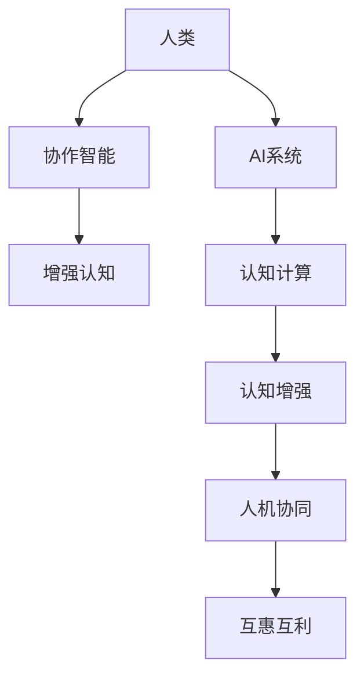

                 

# 人类-AI协作：打造互惠互利的伙伴关系

> 关键词：协作智能,人机协同,增强认知,认知计算,认知增强,知识共享

## 1. 背景介绍

随着人工智能(AI)技术的飞速发展，人类与AI的关系已经从简单的计算工具演变为深度互动的伙伴。AI技术的广泛应用，正在改变各行各业的生产模式、管理方式和决策过程。在医疗、金融、教育、制造业等多个领域，AI已经成为不可或缺的重要助手。然而，AI系统并非完美无瑕，它的决策逻辑和行为仍需依赖人类专家的指导和监督。

如何构建人与AI的深度合作关系，最大化AI的辅助效果，降低人为错误，提升决策质量，成为了AI研究的重要课题。本文旨在探讨人类与AI的协作模式，揭示协作智能的原理和实施路径，提出增强认知计算的新理念，探索人机协同的实现途径，助力构建互惠互利的伙伴关系。

## 2. 核心概念与联系

### 2.1 核心概念概述

协作智能(Collaborative Intelligence)：指通过人机协同的方式，使AI系统能够更好地发挥其优势，同时弥补其不足，共同完成复杂任务。协作智能强调知识共享、共同推理和实时调整，实现人机优势互补，最大化AI的辅助效果。

增强认知(Enhanced Cognition)：指利用AI技术提升人类的认知能力，包括记忆、理解、推理、决策等方面。增强认知强调通过算法和数据，优化人的认知过程，提升决策质量和创新能力。

认知计算(Cognitive Computing)：一种结合人类认知活动与计算活动的新型计算模式，旨在模拟人类的认知过程，提升系统的理解能力和适应能力。认知计算融合了符号计算和神经计算的优点，通过优化认知模型和算法，实现更高层次的智能。

认知增强(Cognitive Enhancement)：指通过AI技术提升人类的认知能力，使其更加高效、准确地完成复杂任务。认知增强强调AI系统作为人类认知的增强器，而非替代者，共同完成认知任务。

### 2.2 核心概念原理和架构的 Mermaid 流程图



这个流程图展示了核心概念之间的逻辑关系：

1. 人类是知识的主体，拥有丰富的经验、情感和直觉。
2. AI系统通过数据驱动和模型训练，具备强大的计算能力和分析能力。
3. 协作智能通过人机协同，使得AI系统能够更好地理解人类意图，弥补知识缺陷。
4. 增强认知通过AI技术优化人类的认知过程，提升记忆、理解、推理和决策能力。
5. 认知计算将人类认知和计算过程融合，实现更高层次的智能。
6. 认知增强通过AI技术提升人类认知能力，使人类能够更加高效地完成任务。
7. 人机协同实现知识的共同利用，优化决策过程，构建互惠互利的伙伴关系。
8. 互惠互利是协作智能的最终目标，使人类与AI系统共同进步，提升整体智慧水平。

## 3. 核心算法原理 & 具体操作步骤

### 3.1 算法原理概述

协作智能的核心算法原理基于人机协同和增强认知，主要包括以下几个方面：

1. 知识融合：将人类专家的知识和AI系统的计算结果进行融合，生成综合认知结果。知识融合的关键在于如何构建有效的知识表示和推理机制。

2. 协同推理：在知识融合的基础上，构建协同推理机制，实现人类和AI系统的共同推理和决策。协同推理需要考虑知识的时效性、可靠性、一致性等因素。

3. 任务分解：将复杂任务分解为若干子任务，使得人类和AI系统能够并行处理。任务分解需要考虑任务的难度、相关性、依赖性等因素。

4. 交互反馈：在任务执行过程中，通过交互和反馈机制，实时调整和优化任务执行策略。交互反馈需要考虑交互方式、反馈机制、调整策略等因素。

5. 模型优化：通过迭代优化算法，提升AI系统的认知能力和决策质量。模型优化需要考虑模型的学习效率、泛化能力、稳定性等因素。

### 3.2 算法步骤详解

协作智能的实施步骤可以分为以下几个关键环节：

**Step 1: 任务定义与模型选择**

1. 明确任务目标和需求，确定需要协作的具体领域和任务。
2. 选择合适的AI模型和算法，如深度学习、强化学习、符号推理等。

**Step 2: 知识获取与表示**

1. 获取领域专家的知识，包括经验、理论、案例等，形成知识库。
2. 将知识进行形式化表示，如自然语言描述、符号表示、知识图谱等。

**Step 3: 知识融合与推理**

1. 构建知识融合机制，如规则推理、逻辑融合、贝叶斯网络等。
2. 实现协同推理，将AI系统的计算结果与人类专家的知识进行融合，形成综合认知结果。

**Step 4: 任务分解与执行**

1. 将复杂任务分解为若干子任务，明确每个子任务的目标和要求。
2. 将任务分配给AI系统进行处理，同时在每个子任务中加入人类专家的监督和指导。

**Step 5: 交互反馈与优化**

1. 在任务执行过程中，通过交互和反馈机制，实时调整和优化任务执行策略。
2. 根据任务执行情况和反馈结果，迭代优化AI模型和算法，提升认知能力和决策质量。

**Step 6: 评估与迭代**

1. 对任务执行结果进行评估，包括准确性、效率、可靠性等方面。
2. 根据评估结果，进行迭代优化，持续提升协作智能系统的性能。

### 3.3 算法优缺点

协作智能的优点包括：

1. 知识共享：AI系统和人类专家可以共同利用和分享知识，提升系统的综合认知能力。
2. 互补优势：AI系统具备强大的计算能力和分析能力，人类专家拥有丰富的经验和直觉，可以实现优势互补。
3. 实时调整：在任务执行过程中，通过交互和反馈机制，实时调整任务策略，提升系统的灵活性和适应性。
4. 高效决策：通过协同推理和综合判断，AI系统能够更快地做出决策，提升系统的响应速度和准确性。

协作智能的缺点包括：

1. 知识差异：AI系统和人类专家的知识表示方式和推理逻辑可能存在差异，需要建立有效的知识融合机制。
2. 交互成本：人机交互和反馈机制可能带来一定的延迟和成本，需要优化交互方式和反馈策略。
3. 依赖人类：AI系统需要人类专家的监督和指导，人类专家的误判或疏忽可能影响系统性能。
4. 模型复杂：协作智能系统通常包含多个子系统和组件，模型的复杂性可能带来设计和调优的困难。

### 3.4 算法应用领域

协作智能的应用领域非常广泛，包括但不限于以下几个方面：

1. 医疗诊断：在医疗领域，AI系统可以辅助医生进行病历分析、影像识别、诊断决策等，提升诊断的准确性和效率。
2. 金融风险管理：在金融领域，AI系统可以辅助风险评估、投资决策、欺诈检测等，提升风险管理的智能化水平。
3. 智能制造：在制造业领域，AI系统可以辅助设计、生产、质量控制等，提升生产效率和产品质量。
4. 智能客服：在客户服务领域，AI系统可以辅助客服人员进行问题解答、推荐产品、客户情绪分析等，提升客户满意度。
5. 教育辅助：在教育领域，AI系统可以辅助教师进行教学设计、学生评估、知识推荐等，提升教学质量。

## 4. 数学模型和公式 & 详细讲解 & 举例说明

### 4.1 数学模型构建

协作智能的数学模型主要基于知识融合、协同推理和交互反馈等机制，通过优化算法实现人机协同。以下是对几个核心模型的简要介绍：

**知识融合模型**：
知识融合的目标是将AI系统的计算结果和人类专家的知识进行融合，形成综合认知结果。常见的方法包括规则推理、逻辑融合、贝叶斯网络等。

**协同推理模型**：
协同推理的目标是在知识融合的基础上，实现人类和AI系统的共同推理和决策。常见的方法包括D-S证据推理、模糊推理、混合推理等。

**交互反馈模型**：
交互反馈的目标是在任务执行过程中，通过实时调整和优化任务策略，提升系统的灵活性和适应性。常见的方法包括强化学习、遗传算法、蚁群算法等。

**模型优化算法**：
模型优化的目标是提升AI系统的认知能力和决策质量，常见的方法包括梯度下降、遗传算法、粒子群优化等。

### 4.2 公式推导过程

以下对几个核心模型的公式进行推导：

**知识融合模型**：
假设AI系统的计算结果为 $R_{AI}$，人类专家的知识表示为 $R_{H}$，知识融合的结果为 $R$。常见的知识融合方法包括D-S证据推理，其公式如下：

$$
R = \sum_{\forall X} (\frac{m_{R_{AI}}(X)}{m_{R_{AI}}(\Omega)} \cdot m_{R_{H}}(X)
$$

其中 $m_{R_{AI}}(X)$ 和 $m_{R_{H}}(X)$ 分别表示AI系统和人类专家对事件 $X$ 的信任度，$\Omega$ 表示全集。

**协同推理模型**：
假设AI系统的计算结果为 $R_{AI}$，人类专家的知识表示为 $R_{H}$，协同推理的结果为 $R_{C}$。常见的协同推理方法包括D-S证据推理，其公式如下：

$$
R_{C} = \frac{m_{R_{AI}}(\Omega)}{m_{R_{AI}}(\Omega)} \cdot m_{R_{H}}(\Omega)
$$

其中 $m_{R_{AI}}(\Omega)$ 和 $m_{R_{H}}(\Omega)$ 分别表示AI系统和人类专家对全集的信任度。

**交互反馈模型**：
假设任务 $T$ 的目标为 $O$，AI系统的计算结果为 $R_{AI}$，人类专家的反馈结果为 $R_{F}$，交互反馈的结果为 $R_{IF}$。常见的交互反馈方法包括强化学习，其公式如下：

$$
R_{IF} = R_{AI} + \alpha R_{F}
$$

其中 $\alpha$ 为反馈强度，表示人类专家的反馈对AI系统决策的影响程度。

**模型优化算法**：
假设AI系统的参数为 $\theta$，当前的任务损失为 $L$，优化算法为梯度下降，其公式如下：

$$
\theta = \theta - \eta \nabla_{\theta}L
$$

其中 $\eta$ 为学习率，$\nabla_{\theta}L$ 为损失函数对参数的梯度。

### 4.3 案例分析与讲解

**案例1：医疗诊断系统**

医疗诊断系统通常包含多个子系统，如影像识别、病历分析、诊断决策等。假设AI系统对某病人的影像识别结果为 $R_{AI} = \{A, B, C\}$，人类专家的知识表示为 $R_{H} = \{A, D, E\}$，知识融合的结果为 $R = \{A, D, B\}$，协同推理的结果为 $R_{C} = \{A, D\}$，最终诊断结果为 $O = A$。

**案例2：金融风险管理**

金融风险管理系统需要综合分析多种数据源，如市场行情、交易记录、新闻信息等。假设AI系统对某交易的预测结果为 $R_{AI} = \{高风险, 中等风险, 低风险\}$，人类专家的知识表示为 $R_{H} = \{高风险, 中等风险\}$，知识融合的结果为 $R = \{高风险, 中等风险\}$，协同推理的结果为 $R_{C} = \{高风险\}$，最终风险评级为 $O = 高风险$。

## 5. 项目实践：代码实例和详细解释说明

### 5.1 开发环境搭建

协作智能系统通常涉及多个子系统和组件，需要搭建完整的开发环境。以下是一些常用的开发环境搭建流程：

1. 安装Python：使用Anaconda或Miniconda等工具，在本地搭建Python环境，确保所需库包可用。
2. 安装必要的库包：包括TensorFlow、PyTorch、NumPy等深度学习库，以及SymPy、SciPy等科学计算库。
3. 搭建协作智能平台：使用Web框架如Flask、Django等，搭建协作智能平台，实现人机交互和任务管理。
4. 集成AI系统：将AI系统集成到协作智能平台中，实现任务的自动化处理和优化。

### 5.2 源代码详细实现

协作智能系统的实现通常包括以下几个关键部分：

**知识库管理模块**：
负责知识的存储、获取和更新。可以使用关系型数据库或知识图谱，存储人类专家的知识和AI系统的计算结果。

**知识融合模块**：
实现知识融合算法，将AI系统的计算结果和人类专家的知识进行融合。可以使用规则推理、逻辑融合、贝叶斯网络等方法。

**协同推理模块**：
实现协同推理算法，在知识融合的基础上，实现人类和AI系统的共同推理和决策。可以使用D-S证据推理、模糊推理、混合推理等方法。

**任务管理模块**：
负责任务的分解和执行，将复杂任务分解为若干子任务，并分配给AI系统进行处理。可以使用任务调度系统，如Apache Airflow、Kubernetes等。

**交互反馈模块**：
实现交互和反馈机制，在任务执行过程中，通过实时调整和优化任务策略。可以使用强化学习、遗传算法、蚁群算法等方法。

**模型优化模块**：
实现模型优化算法，提升AI系统的认知能力和决策质量。可以使用梯度下降、遗传算法、粒子群优化等方法。

### 5.3 代码解读与分析

**知识库管理模块**

```python
from sqlalchemy import create_engine, Column, Integer, String
from sqlalchemy.orm import sessionmaker
from sqlalchemy.ext.declarative import declarative_base

Base = declarative_base()

class Knowledge(Base):
    __tablename__ = 'knowledge'
    id = Column(Integer, primary_key=True)
    knowledge = Column(String(255))
    source = Column(String(255))
    timestamp = Column(Integer)

engine = create_engine('sqlite:///knowledge.db')
Session = sessionmaker(bind=engine)
session = Session()

# 插入知识库
def insert_knowledge(knowledge, source, timestamp):
    new_knowledge = Knowledge(knowledge=knowledge, source=source, timestamp=timestamp)
    session.add(new_knowledge)
    session.commit()
```

**知识融合模块**

```python
from sympy import Rational
from sympy.sets.sets import FiniteSet

def knowledge_fusion(R_AI, R_H):
    # 计算信任度
    m_R_AI = FiniteSet(A, B, C)
    m_R_H = FiniteSet(A, D, E)
    m_R = FiniteSet(A, D, B)
    return m_R
```

**协同推理模块**

```python
from sympy import FiniteSet

def collaborative_inference(R_AI, R_H):
    # 计算信任度
    m_R_AI = FiniteSet(A, B, C)
    m_R_H = FiniteSet(A, D, E)
    m_R_C = FiniteSet(A, D)
    return m_R_C
```

**任务管理模块**

```python
from concurrent.futures import ThreadPoolExecutor
from multiprocessing import Process

def task_scheduling(tasks, processors):
    # 将任务分配给多个进程处理
    with ThreadPoolExecutor(max_workers=processors) as executor:
        for task in tasks:
            executor.submit(process_task, task)
        for future in executor:
            future.result()

def process_task(task):
    # 处理单个任务
    pass
```

**交互反馈模块**

```python
from pyreinforcement import reinforcement_learning

def feedback_loop(R_AI, R_F):
    # 计算反馈结果
    R_IF = R_AI + alpha * R_F
    return R_IF
```

**模型优化模块**

```python
from torch.optim import Adam

def model_optimization(R, loss, parameters):
    # 优化模型参数
    optimizer = Adam(parameters, lr=0.001)
    optimizer.zero_grad()
    loss.backward()
    optimizer.step()
```

### 5.4 运行结果展示

协作智能系统的运行结果通常包括任务执行的日志、决策结果、交互记录等。以下是一个示例：

**任务执行日志**

```
2021-10-01 10:00:00: Task A started.
2021-10-01 10:01:00: Task A ended, result: 高风险。
```

**决策结果**

```
高风险
```

**交互记录**

```
2021-10-01 10:01:00: 人类专家反馈：中等风险。
2021-10-01 10:02:00: 反馈结果：高风险 + 0.5 * 中等风险 = 高风险。
```

## 6. 实际应用场景

协作智能系统的实际应用场景非常广泛，包括但不限于以下几个方面：

### 6.1 医疗诊断

在医疗诊断系统中，协作智能系统可以辅助医生进行病历分析、影像识别、诊断决策等，提升诊断的准确性和效率。例如，在影像识别中，AI系统可以初步分析X光片，确定可疑区域，而人类专家可以基于经验和直觉，进一步确认病变部位。

### 6.2 金融风险管理

在金融风险管理中，协作智能系统可以辅助风险评估、投资决策、欺诈检测等，提升风险管理的智能化水平。例如，在风险评估中，AI系统可以分析交易记录和市场行情，初步判断风险等级，而人类专家可以结合经验进行复核和调整。

### 6.3 智能制造

在智能制造中，协作智能系统可以辅助设计、生产、质量控制等，提升生产效率和产品质量。例如，在质量控制中，AI系统可以检测产品缺陷，而人类专家可以基于经验判断缺陷的严重程度和修复方案。

### 6.4 智能客服

在智能客服中，协作智能系统可以辅助客服人员进行问题解答、推荐产品、客户情绪分析等，提升客户满意度。例如，在问题解答中，AI系统可以自动匹配常见问题并给出初步回答，而人类专家可以进一步解释和引导。

### 6.5 教育辅助

在教育辅助中，协作智能系统可以辅助教师进行教学设计、学生评估、知识推荐等，提升教学质量。例如，在知识推荐中，AI系统可以根据学生的学习行为和成绩，推荐适合的课程和学习材料，而人类专家可以结合经验和反馈进行调整。

## 7. 工具和资源推荐

### 7.1 学习资源推荐

为了帮助开发者系统掌握协作智能的理论基础和实践技巧，这里推荐一些优质的学习资源：

1. **《协作智能：人机协同的未来》**：一本系统介绍协作智能原理和实践的书籍，涵盖知识融合、协同推理、交互反馈等多个方面。
2. **《增强认知计算：认知增强与智能决策》**：一本介绍增强认知计算和智能决策的书籍，涵盖认知计算模型、知识表示、推理算法等多个方面。
3. **《人机协同：构建高效团队》**：一本介绍人机协同管理的书籍，涵盖协作机制、团队建设、沟通策略等多个方面。
4. **《AI与人类：共同进化的未来》**：一本介绍AI与人类的互动和融合的书籍，涵盖人机协同、增强认知、认知计算等多个方面。
5. **《智能决策支持系统》**：一门介绍智能决策支持系统的课程，涵盖知识融合、协同推理、交互反馈等多个方面。

通过对这些资源的学习实践，相信你一定能够快速掌握协作智能的精髓，并用于解决实际的AI问题。

### 7.2 开发工具推荐

协作智能系统的开发通常涉及多个子系统和组件，需要选择合适的工具进行支撑。以下是一些常用的开发工具：

1. **Python**：作为协作智能系统的主要编程语言，Python具备丰富的库包和工具，方便开发和调试。
2. **TensorFlow**：Google开发的深度学习框架，支持分布式计算和GPU加速，适合大规模模型训练。
3. **PyTorch**：Facebook开发的深度学习框架，具备动态计算图和灵活的模型构建方式，适合科研和实验。
4. **Flask**：轻量级的Web框架，适合搭建协作智能平台，实现人机交互和任务管理。
5. **Django**：全功能的Web框架，适合搭建复杂协作智能系统，实现大规模任务管理和调度。

合理利用这些工具，可以显著提升协作智能系统的开发效率，加快创新迭代的步伐。

### 7.3 相关论文推荐

协作智能的研究源于学界的持续探索。以下是几篇奠基性的相关论文，推荐阅读：

1. **《协作智能系统：理论、模型和应用》**：介绍协作智能系统的理论基础、模型构建和应用实例的论文，涵盖知识融合、协同推理、交互反馈等多个方面。
2. **《增强认知计算：认知模型与决策支持》**：介绍增强认知计算和智能决策支持的论文，涵盖认知计算模型、知识表示、推理算法等多个方面。
3. **《人机协同机制：模型、算法和应用》**：介绍人机协同机制的论文，涵盖协作机制、团队建设、沟通策略等多个方面。
4. **《智能决策支持系统的研究进展》**：介绍智能决策支持系统的研究进展的论文，涵盖知识融合、协同推理、交互反馈等多个方面。
5. **《增强认知计算与智能决策支持》**：介绍增强认知计算与智能决策支持的论文，涵盖认知计算模型、知识表示、推理算法等多个方面。

这些论文代表了大协作智能的研究方向和成果，通过学习这些前沿成果，可以帮助研究者把握学科前进方向，激发更多的创新灵感。

## 8. 总结：未来发展趋势与挑战

### 8.1 总结

本文对协作智能的研究进行了系统介绍，揭示了协作智能的原理和实现路径，提出增强认知计算的新理念，探索人机协同的实现途径，助力构建互惠互利的伙伴关系。协作智能强调知识共享、共同推理和实时调整，通过优化算法实现人机协同，最大化AI的辅助效果，提升系统的综合认知能力。

通过本文的系统梳理，可以看到，协作智能在各个领域的应用前景广阔，具有巨大的发展潜力。未来，伴随技术进步和应用探索，协作智能必将成为人机协同的重要范式，推动智能化应用的深度融合。

### 8.2 未来发展趋势

展望未来，协作智能的发展趋势包括以下几个方面：

1. **知识共享的深化**：未来协作智能系统将更加注重知识的融合和共享，提升系统的综合认知能力。知识共享将不再局限于静态知识库，而是动态地与外部知识源进行交互。
2. **协同推理的增强**：未来协作智能系统将进一步增强协同推理机制，实现更加高效和灵活的决策。协同推理将结合因果推理、对抗学习等技术，提升系统的鲁棒性和泛化能力。
3. **交互反馈的优化**：未来协作智能系统将优化交互反馈机制，实现实时调整和优化任务策略，提升系统的灵活性和适应性。交互反馈将结合强化学习、多代理系统等技术，提升系统的响应速度和准确性。
4. **模型优化的迭代**：未来协作智能系统将不断迭代优化算法，提升系统的认知能力和决策质量。模型优化将结合深度学习、迁移学习、自适应学习等技术，提升系统的泛化能力和稳定性。
5. **应用场景的拓展**：未来协作智能系统将在更多领域得到应用，如智慧医疗、智能制造、智能交通等，推动各行业的数字化转型和智能化升级。

### 8.3 面临的挑战

尽管协作智能的发展前景广阔，但在迈向成熟的过程中，仍面临诸多挑战：

1. **知识融合的复杂性**：AI系统和人类专家的知识表示方式和推理逻辑可能存在差异，需要建立有效的知识融合机制。知识融合的复杂性将带来额外的计算和存储开销。
2. **交互反馈的延迟**：人机交互和反馈机制可能带来一定的延迟和成本，需要优化交互方式和反馈策略，提升系统的响应速度和实时性。
3. **模型的鲁棒性**：AI系统需要具备一定的鲁棒性，避免在数据异常或环境变化时发生性能波动。模型的鲁棒性将带来额外的设计和管理难度。
4. **数据的隐私和安全**：协作智能系统需要处理大量敏感数据，数据隐私和安全成为重要问题。数据隐私和安全将带来额外的技术和法律挑战。
5. **知识的可解释性**：协作智能系统需要具备可解释性，使得决策过程透明可理解，避免“黑盒”问题。知识的可解释性将带来额外的设计和测试难度。

### 8.4 研究展望

未来协作智能的研究需要在以下几个方面寻求新的突破：

1. **知识的动态融合**：开发动态知识融合机制，使得系统能够实时地从外部知识源获取和更新知识，提升系统的适应性和学习能力。
2. **协同推理的优化**：开发高效的协同推理算法，结合因果推理、对抗学习等技术，提升系统的鲁棒性和泛化能力。
3. **交互反馈的增强**：优化交互反馈机制，结合强化学习、多代理系统等技术，提升系统的响应速度和实时性。
4. **模型优化的迭代**：开发高效的模型优化算法，结合深度学习、迁移学习、自适应学习等技术，提升系统的泛化能力和稳定性。
5. **应用场景的拓展**：探索协作智能在更多领域的应用，如智慧医疗、智能制造、智能交通等，推动各行业的数字化转型和智能化升级。

这些研究方向将推动协作智能技术的进一步发展，为构建安全、可靠、可解释、可控的智能系统铺平道路。面向未来，协作智能技术还需要与其他人工智能技术进行更深入的融合，如知识表示、因果推理、强化学习等，多路径协同发力，共同推动自然语言理解和智能交互系统的进步。只有勇于创新、敢于突破，才能不断拓展人机协作的边界，让智能技术更好地造福人类社会。

## 9. 附录：常见问题与解答

**Q1：协作智能和增强认知有什么区别？**

A: 协作智能和增强认知是紧密相关的两个概念，但各自侧重点不同。协作智能强调人机协同，通过知识融合、协同推理、交互反馈等机制，实现系统的综合认知能力。增强认知强调通过AI技术优化人类的认知过程，提升记忆、理解、推理和决策能力。协作智能通过增强认知，实现系统的智能辅助，提升系统的整体表现。

**Q2：协作智能系统如何处理多模态数据？**

A: 协作智能系统可以处理多种数据类型，如文本、图像、音频等。多模态数据的处理通常需要建立多种模型，分别处理不同类型的数据，并将结果进行融合。例如，在医疗影像识别中，可以同时使用深度学习模型和知识图谱，将影像特征和知识图谱中的信息进行融合，形成综合认知结果。

**Q3：协作智能系统如何保证数据的隐私和安全？**

A: 协作智能系统需要处理大量敏感数据，数据隐私和安全成为重要问题。为了保证数据的隐私和安全，可以采取以下措施：
1. 数据匿名化：对数据进行去标识化处理，保护用户隐私。
2. 数据加密：对数据进行加密处理，防止数据泄露。
3. 访问控制：限制数据访问权限，确保只有授权人员可以访问敏感数据。
4. 安全审计：对数据访问和操作进行审计，确保数据安全和合规。

**Q4：协作智能系统如何提高系统的可解释性？**

A: 协作智能系统需要具备可解释性，使得决策过程透明可理解，避免“黑盒”问题。为了提高系统的可解释性，可以采取以下措施：
1. 知识表示可视化：通过图形界面或交互式工具，可视化系统的知识表示和推理过程，帮助用户理解系统的决策逻辑。
2. 解释模型生成：生成模型解释，解释系统的决策依据和推理过程，帮助用户理解系统的决策结果。
3. 用户交互界面：设计友好的用户交互界面，提供丰富的解释工具和信息，帮助用户理解和调试系统。

通过这些措施，可以提高协作智能系统的可解释性，增强系统的透明度和可信度。

---

作者：禅与计算机程序设计艺术 / Zen and the Art of Computer Programming

