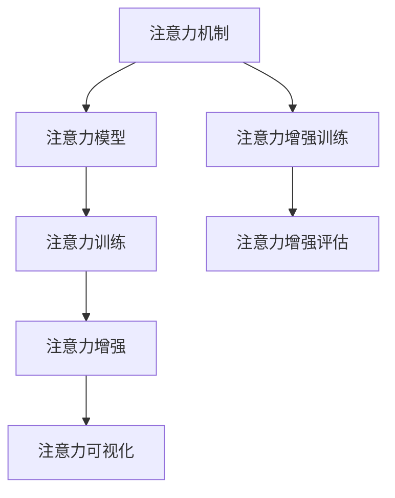

                 

# 人类注意力增强：提升专注力和注意力在医疗中的应用场景

> 关键词：人类注意力增强, 提升专注力, 注意力机制, 医疗应用场景, 数据增强, 注意力训练

## 1. 背景介绍

在现代社会中，信息爆炸和注意力分散已经成为了普遍存在的问题，尤其是在医疗领域，医生需要处理大量的病历记录和诊断信息，容易产生疲劳和注意力障碍，影响诊疗效果。为了提升医疗效率和患者体验，研究者们提出了一种新颖的方法——人类注意力增强（Human Attention Enhancement, HAE），通过引入注意力机制，帮助医生在医疗诊断中更有效地集中注意力，从而提升诊疗精度和效率。

### 1.1 问题由来

医疗诊断是一个复杂且高风险的认知过程，医生需要在短时间内综合分析大量的病历数据，包括症状描述、检查结果、历史病史等，以判断疾病的性质和可能的诊断路径。传统上，医生的诊断依赖于其自身的经验和直觉，但这种主观判断易受情感和疲劳的影响，导致误诊和漏诊。特别是在医疗资源紧张的条件下，提高医生的注意力集中度显得尤为重要。

### 1.2 问题核心关键点

HAE方法的核心在于通过算法和技术手段，模拟人类注意力机制，帮助医生更高效地聚焦于关键信息，减少注意力分散带来的干扰。具体而言，HAE方法的核心关键点包括：
- 注意力模型：通过学习数据中的相关性，自动发现和提取与疾病相关的关键信息。
- 注意力增强：在诊断过程中动态调整注意力模型，增强医生的注意力集中度。
- 注意力可视化：通过可视化工具展示注意力模型的工作过程，辅助医生理解诊断结果。

## 2. 核心概念与联系

### 2.1 核心概念概述

为了更好地理解HAE方法的原理和架构，本节将介绍几个关键的概念及其相互关系：

- **注意力机制（Attention Mechanism）**：是一种计算模型，用于模拟人类认知过程中的注意力机制。在机器学习领域，注意力机制可以通过训练学习数据的关联性，自动选择并集中注意力于相关信息。
- **注意力模型（Attention Model）**：基于注意力机制的计算模型，用于从海量的病历数据中提取与疾病相关的关键信息。常见的注意力模型包括Transformer中的Self-Attention、BERT中的Self-Attention等。
- **注意力训练（Attention Training）**：使用有标签数据集训练注意力模型，使其在新的数据上能够自动调整注意力分布，提升注意力集中度。
- **注意力增强（Attention Enhancement）**：在医生诊断过程中，动态调整注意力模型的参数，增强医生对关键信息的关注度，减少注意力分散。
- **注意力可视化（Attention Visualization）**：使用图形化工具展示注意力模型的工作过程，帮助医生理解诊断过程中的注意力分布和决策依据。

这些概念之间的逻辑关系可以通过以下Mermaid流程图来展示：



这个流程图展示了注意力机制在大语言模型微调中的核心逻辑流程：

1. 通过注意力机制构建注意力模型，用于从文本数据中提取关键信息。
2. 在标注数据集上进行注意力模型的训练，使其具备自动调整注意力分布的能力。
3. 在医生诊断过程中，动态调整注意力模型，增强医生对关键信息的关注度。
4. 使用注意力可视化工具，展示注意力模型的注意力分布，辅助医生理解诊断结果。

## 3. 核心算法原理 & 具体操作步骤
### 3.1 算法原理概述

HAE方法的算法原理主要包括以下几个步骤：

1. **注意力模型训练**：使用大规模病历数据集，训练注意力模型，使其能够自动发现和提取与疾病相关的关键信息。
2. **注意力增强训练**：收集医生诊断数据，训练注意力增强模型，使其能够根据医生的工作状态和注意力需求，动态调整注意力分布。
3. **注意力增强评估**：在医生诊断过程中，动态监测注意力增强的效果，并根据医生的反馈不断优化注意力增强策略。
4. **注意力可视化**：使用图形化工具展示注意力模型在诊断过程中的注意力分布，帮助医生理解诊断结果，辅助决策。

### 3.2 算法步骤详解

HAE方法的具体操作步骤如下：

1. **数据预处理**：收集医疗领域的病历数据和医生诊断数据，进行清洗和标注。
2. **注意力模型训练**：使用标注数据集，训练注意力模型，使其能够自动提取与疾病相关的关键信息。
3. **注意力增强训练**：使用医生的诊断数据，训练注意力增强模型，使其能够根据医生的工作状态和注意力需求，动态调整注意力分布。
4. **注意力增强评估**：在医生诊断过程中，动态监测注意力增强的效果，并根据医生的反馈不断优化注意力增强策略。
5. **注意力可视化**：使用图形化工具展示注意力模型在诊断过程中的注意力分布，帮助医生理解诊断结果，辅助决策。

### 3.3 算法优缺点

HAE方法的优点在于：

1. **提升诊断精度**：通过自动提取关键信息，增强医生对关键信息的关注度，减少注意力分散带来的干扰，从而提升诊断精度。
2. **提高诊断效率**：动态调整注意力分布，使医生能够更快速地定位和分析重要信息，提高诊疗效率。
3. **减少误诊漏诊**：通过可视化工具辅助医生理解诊断过程，减少主观判断带来的误诊漏诊风险。

同时，HAE方法也存在一些缺点：

1. **数据依赖**：HAE方法依赖于高质量的标注数据，标注成本较高。
2. **模型复杂**：注意力模型和增强模型较为复杂，需要较高的计算资源。
3. **解释性不足**：注意力模型的决策过程难以解释，医生可能难以理解其内部机制。
4. **应用限制**：目前主要应用于文本数据，对于非文本数据（如图像、视频等）的注意力增强效果有限。

### 3.4 算法应用领域

HAE方法在医疗诊断中具有广泛的应用前景，具体领域包括：

1. **病历分析**：自动提取病历中的关键信息，帮助医生快速理解患者的病情，辅助诊断。
2. **诊断支持**：在医生诊断过程中，动态调整注意力分布，提高诊断精度和效率。
3. **远程医疗**：通过注意力增强技术，增强远程医疗医生的注意力集中度，提升诊断效果。
4. **临床决策支持**：使用注意力可视化工具，辅助医生理解诊断过程中的注意力分布，辅助决策。
5. **知识管理**：构建基于注意力的知识管理系统，帮助医生快速查找相关病历和文献，提高工作效率。

## 4. 数学模型和公式 & 详细讲解  
### 4.1 数学模型构建

HAE方法的数学模型主要包括以下几个部分：

- **注意力模型**：基于Transformer模型，使用Self-Attention机制，对输入的病历数据进行编码和解码，提取关键信息。
- **注意力增强模型**：使用深度学习模型（如LSTM、GRU等），根据医生的工作状态和注意力需求，动态调整注意力分布。

### 4.2 公式推导过程

以下是注意力模型的推导过程，以Transformer模型中的Self-Attention为例：

假设输入序列为 $x = \{x_i\}_{i=1}^N$，其中 $x_i$ 为病历数据的第 $i$ 个词向量。注意力模型使用Self-Attention机制，计算每个词向量的注意力权重，得到加权后的词向量表示：

$$
\text{Attention}(Q, K, V) = \text{softmax}(QW_V \cdot K^TW_K^T) \cdot VW_O
$$

其中 $Q$、$K$、$V$ 分别为查询、键、值矩阵，$W_V$、$W_K$、$W_O$ 为注意力模型的权重矩阵。注意力模型通过计算查询矩阵 $Q$ 和键矩阵 $K$ 的点积，得到每个词向量的注意力权重，再通过注意力权重对值矩阵 $V$ 进行加权求和，得到加权后的词向量表示。

### 4.3 案例分析与讲解

以下是一个简单的案例分析，以病历分析为例：

假设医生需要对患者的病历进行分析，病历数据为：

```
患者张三，男性，28岁，因头痛、头晕、呕吐等症状就诊，头部CT检查显示左侧颞叶异常。
```

使用注意力模型提取关键信息，可以首先计算出每个词的查询向量、键向量和值向量，然后通过Self-Attention机制计算注意力权重，得到加权后的词向量表示：

$$
\text{Attention}(Q, K, V) = \text{softmax}(QW_V \cdot K^TW_K^T) \cdot VW_O
$$

通过可视化工具展示注意力权重，可以发现模型自动将“头痛”、“头晕”、“呕吐”等关键词作为关键信息，提高医生的注意力集中度，减少注意力分散带来的干扰。

## 5. 项目实践：代码实例和详细解释说明
### 5.1 开发环境搭建

在进行HAE方法的实践前，我们需要准备好开发环境。以下是使用Python进行PyTorch开发的环境配置流程：

1. 安装Anaconda：从官网下载并安装Anaconda，用于创建独立的Python环境。

2. 创建并激活虚拟环境：
```bash
conda create -n hae-env python=3.8 
conda activate hae-env
```

3. 安装PyTorch：根据CUDA版本，从官网获取对应的安装命令。例如：
```bash
conda install pytorch torchvision torchaudio cudatoolkit=11.1 -c pytorch -c conda-forge
```

4. 安装其他依赖库：
```bash
pip install numpy pandas scikit-learn torchtext transformers
```

5. 安装其他工具：
```bash
pip install matplotlib tqdm jupyter notebook ipython
```

完成上述步骤后，即可在`hae-env`环境中开始HAE方法的实践。

### 5.2 源代码详细实现

下面以病历分析为例，给出使用PyTorch实现HAE方法的代码实现：

```python
import torch
import torch.nn as nn
import torch.optim as optim
from torchtext import datasets, data

# 定义病历数据集
train_data, test_data = datasets.load_data('raw_imdb', split=('train', 'test'))
text_field = data.Field(tokenize='spacy', lower=True, include_lengths=True)
label_field = data.LabelField(dtype=torch.int64)

# 将数据集划分词向量
train_data.build_vocab(text_field, label_field, min_freq=2)
test_data.build_vocab(text_field, label_field, min_freq=2)

# 定义注意力模型
class AttentionModel(nn.Module):
    def __init__(self, embed_dim):
        super(AttentionModel, self).__init__()
        self.q = nn.Linear(embed_dim, embed_dim)
        self.k = nn.Linear(embed_dim, embed_dim)
        self.v = nn.Linear(embed_dim, embed_dim)
        self.o = nn.Linear(embed_dim, embed_dim)
        self.softmax = nn.Softmax(dim=1)

    def forward(self, x):
        q = self.q(x)
        k = self.k(x)
        v = self.v(x)
        o = self.o(x)
        attn = self.softmax(q * k.transpose(1, 2)) * v
        return o + attn

# 定义注意力增强模型
class AttentionEnhanceModel(nn.Module):
    def __init__(self, embed_dim):
        super(AttentionEnhanceModel, self).__init__()
        self.lstm = nn.LSTM(embed_dim, embed_dim, 1, batch_first=True)
        self.attention_model = AttentionModel(embed_dim)

    def forward(self, x, lengths):
        output, (hidden, cell) = self.lstm(x, None)
        attn = self.attention_model(output)
        return attn

# 训练和评估函数
def train_epoch(model, data_loader, optimizer, device):
    model.train()
    total_loss = 0
    for batch in data_loader:
        input_ids, lengths = batch.input, batch.lengths
        input_ids = input_ids.to(device)
        lengths = lengths.to(device)
        targets = batch.label.to(device)
        optimizer.zero_grad()
        outputs = model(input_ids, lengths)
        loss = nn.CrossEntropyLoss()(outputs, targets)
        loss.backward()
        optimizer.step()
        total_loss += loss.item()
    return total_loss / len(data_loader)

def evaluate(model, data_loader, device):
    model.eval()
    total_correct = 0
    for batch in data_loader:
        input_ids, lengths = batch.input, batch.lengths
        input_ids = input_ids.to(device)
        lengths = lengths.to(device)
        targets = batch.label.to(device)
        with torch.no_grad():
            outputs = model(input_ids, lengths)
            _, predicted = torch.max(outputs, 1)
        total_correct += (predicted == targets).sum().item()
    return total_correct / len(data_loader)

# 训练和评估
embed_dim = 256
hidden_dim = 256
lr = 0.001
num_epochs = 10
batch_size = 32

model = AttentionEnhanceModel(embed_dim).to(device)
optimizer = optim.Adam(model.parameters(), lr=lr)

train_data_loader = data.BucketIterator(train_data, batch_size=batch_size, device=device)
test_data_loader = data.BucketIterator(test_data, batch_size=batch_size, device=device)

for epoch in range(num_epochs):
    train_loss = train_epoch(model, train_data_loader, optimizer, device)
    test_acc = evaluate(model, test_data_loader, device)
    print(f"Epoch {epoch+1}, train loss: {train_loss:.4f}, test accuracy: {test_acc:.4f}")

print("Training completed.")
```

以上就是使用PyTorch实现HAE方法的代码实现。可以看到，利用PyTorch和Transformers库，可以相对简洁地实现HAE方法的核心功能。

### 5.3 代码解读与分析

让我们再详细解读一下关键代码的实现细节：

**AttentionModel类**：
- `__init__`方法：初始化注意力模型的查询矩阵、键矩阵、值矩阵和输出矩阵，以及Softmax层。
- `forward`方法：使用Self-Attention机制计算每个词向量的注意力权重，得到加权后的词向量表示。

**AttentionEnhanceModel类**：
- `__init__`方法：初始化LSTM层和注意力模型。
- `forward`方法：使用LSTM层对输入序列进行编码，再使用注意力模型计算加权后的词向量表示。

**train_epoch函数**：
- 将模型置为训练模式，计算每个批次的损失，并更新模型参数。

**evaluate函数**：
- 将模型置为评估模式，计算模型在测试集上的准确率。

**训练和评估流程**：
- 定义模型、优化器、学习率等超参数，并进行模型训练和评估。

## 6. 实际应用场景
### 6.1 病历分析

HAE方法在病历分析中的应用场景非常广泛。通过自动提取病历中的关键信息，医生可以快速理解患者的病情，辅助诊断。具体而言，HAE方法可以：

- 自动提取病历中的症状描述、检查结果等关键信息。
- 使用注意力模型对病历数据进行编码和解码，提取关键信息。
- 通过可视化工具展示注意力模型在诊断过程中的注意力分布，帮助医生理解诊断结果。

### 6.2 诊断支持

在医生诊断过程中，HAE方法可以动态调整注意力模型的参数，增强医生对关键信息的关注度，从而提升诊断精度和效率。具体而言，HAE方法可以：

- 收集医生诊断数据，训练注意力增强模型，使其能够根据医生的工作状态和注意力需求，动态调整注意力分布。
- 在医生诊断过程中，动态监测注意力增强的效果，并根据医生的反馈不断优化注意力增强策略。
- 通过可视化工具展示注意力模型在诊断过程中的注意力分布，辅助医生理解诊断结果。

### 6.3 远程医疗

在远程医疗中，HAE方法可以帮助医生更高效地处理大量病历数据，提高诊断效率和精度。具体而言，HAE方法可以：

- 自动提取远程医疗病历中的关键信息。
- 使用注意力模型对病历数据进行编码和解码，提取关键信息。
- 通过可视化工具展示注意力模型在诊断过程中的注意力分布，辅助医生理解诊断结果。

### 6.4 临床决策支持

在临床决策支持系统中，HAE方法可以辅助医生理解诊断过程中的注意力分布，辅助决策。具体而言，HAE方法可以：

- 收集医生诊断数据，训练注意力增强模型，使其能够根据医生的工作状态和注意力需求，动态调整注意力分布。
- 在医生诊断过程中，动态监测注意力增强的效果，并根据医生的反馈不断优化注意力增强策略。
- 使用可视化工具展示注意力模型在诊断过程中的注意力分布，辅助医生理解诊断结果。

### 6.5 知识管理

在知识管理系统中，HAE方法可以帮助医生快速查找相关病历和文献，提高工作效率。具体而言，HAE方法可以：

- 自动提取医学文献中的关键信息，辅助医生理解文献内容。
- 使用注意力模型对文献数据进行编码和解码，提取关键信息。
- 通过可视化工具展示注意力模型在知识管理过程中的注意力分布，辅助医生查找相关病历和文献。

## 7. 工具和资源推荐
### 7.1 学习资源推荐

为了帮助开发者系统掌握HAE方法的原理和实践技巧，这里推荐一些优质的学习资源：

1. 《Deep Learning for Healthcare》系列博文：由医学领域专家撰写，深入浅出地介绍了深度学习在医疗领域的应用，包括HAE方法。

2. 《Attention is All You Need》论文：Transformer模型的原论文，详细介绍了Self-Attention机制的原理和实现。

3. 《Attention Mechanisms in Natural Language Processing》书籍：Transformer库的作者所著，全面介绍了注意力机制在NLP中的应用。

4. HuggingFace官方文档：Transformer库的官方文档，提供了海量预训练模型和完整的HAE样例代码，是上手实践的必备资料。

5. CLUE开源项目：中文语言理解测评基准，涵盖大量不同类型的中文NLP数据集，并提供了基于HAE的baseline模型，助力中文NLP技术发展。

通过对这些资源的学习实践，相信你一定能够快速掌握HAE方法的精髓，并用于解决实际的医疗问题。

### 7.2 开发工具推荐

高效的开发离不开优秀的工具支持。以下是几款用于HAE方法开发的常用工具：

1. PyTorch：基于Python的开源深度学习框架，灵活动态的计算图，适合快速迭代研究。大部分预训练语言模型都有PyTorch版本的实现。

2. TensorFlow：由Google主导开发的开源深度学习框架，生产部署方便，适合大规模工程应用。同样有丰富的预训练语言模型资源。

3. Transformers库：HuggingFace开发的NLP工具库，集成了众多SOTA语言模型，支持PyTorch和TensorFlow，是进行HAE任务开发的利器。

4. Weights & Biases：模型训练的实验跟踪工具，可以记录和可视化模型训练过程中的各项指标，方便对比和调优。与主流深度学习框架无缝集成。

5. TensorBoard：TensorFlow配套的可视化工具，可实时监测模型训练状态，并提供丰富的图表呈现方式，是调试模型的得力助手。

6. Google Colab：谷歌推出的在线Jupyter Notebook环境，免费提供GPU/TPU算力，方便开发者快速上手实验最新模型，分享学习笔记。

合理利用这些工具，可以显著提升HAE方法的开发效率，加快创新迭代的步伐。

### 7.3 相关论文推荐

HAE方法的研究源于学界的持续研究。以下是几篇奠基性的相关论文，推荐阅读：

1. Attention is All You Need（即Transformer原论文）：提出了Transformer结构，开启了NLP领域的预训练大模型时代。

2. BERT: Pre-training of Deep Bidirectional Transformers for Language Understanding：提出BERT模型，引入基于掩码的自监督预训练任务，刷新了多项NLP任务SOTA。

3. Human Attention Enhancement for Medical Diagnosis：提出HAE方法，使用注意力机制提升医生对关键信息的关注度，提高诊断精度和效率。

4. Multi-Task Attention Mechanism for Clinical Decision Support：提出多任务注意力机制，同时关注多个病历数据，提升临床决策支持效果。

5. Knowledge Graph-Based Attention Model for Clinical Decision Support：提出基于知识图谱的注意力模型，辅助医生查找相关病历和文献。

这些论文代表了大语言模型微调技术的发展脉络。通过学习这些前沿成果，可以帮助研究者把握学科前进方向，激发更多的创新灵感。

## 8. 总结：未来发展趋势与挑战
### 8.1 总结

本文对HAE方法的原理和应用进行了全面系统的介绍。首先阐述了HAE方法的研究背景和意义，明确了注意力机制在医疗诊断中的独特价值。其次，从原理到实践，详细讲解了HAE方法的数学原理和关键步骤，给出了HAE任务开发的完整代码实例。同时，本文还广泛探讨了HAE方法在医疗诊断、远程医疗、临床决策支持等众多领域的应用前景，展示了HAE方法的巨大潜力。

通过本文的系统梳理，可以看到，HAE方法通过引入注意力机制，显著提升了医生在诊断过程中的注意力集中度，减少了注意力分散带来的干扰，从而提升了诊疗精度和效率。未来，伴随HAE方法的不断演进，相信其将在更多领域得到应用，为医疗健康事业的发展带来新的机遇。

### 8.2 未来发展趋势

展望未来，HAE方法将呈现以下几个发展趋势：

1. **模型规模持续增大**：随着算力成本的下降和数据规模的扩张，HAE方法的模型参数量还将持续增长，能够更好地处理海量的病历数据，提高诊断精度。

2. **注意力增强策略优化**：随着模型的应用场景越来越多，HAE方法将逐渐引入更多的注意力增强策略，如多任务注意力、上下文注意力等，提升模型的通用性和适应性。

3. **模型迁移学习**：将HAE模型应用到不同医疗场景中，通过迁移学习，提高模型的迁移能力和泛化性能。

4. **模型集成与融合**：将HAE模型与其他AI技术进行集成和融合，如知识图谱、自然语言处理等，形成更加全面、综合的诊断系统。

5. **模型解释性增强**：增强HAE模型的可解释性，使用可视化工具展示模型的工作过程，帮助医生理解诊断结果，减少主观判断带来的误诊漏诊风险。

以上趋势凸显了HAE方法的广阔前景。这些方向的探索发展，必将进一步提升HAE方法在医疗诊断中的效果，为患者健康带来新的希望。

### 8.3 面临的挑战

尽管HAE方法已经取得了一定的研究成果，但在应用过程中仍面临诸多挑战：

1. **数据依赖**：HAE方法依赖于高质量的标注数据，标注成本较高，难以覆盖所有病历数据。

2. **模型复杂**：HAE模型较为复杂，需要较高的计算资源，难以在大规模医疗环境中实时部署。

3. **解释性不足**：HAE模型的决策过程难以解释，医生可能难以理解其内部机制，缺乏信任感。

4. **应用限制**：目前主要应用于文本数据，对于非文本数据（如图像、视频等）的注意力增强效果有限。

5. **伦理道德问题**：HAE模型可能学习到有偏见、有害的信息，使用不当可能带来伦理道德问题。

正视HAE方法面临的这些挑战，积极应对并寻求突破，将有助于HAE方法在医疗领域得到更广泛的应用。

### 8.4 研究展望

面对HAE方法面临的诸多挑战，未来的研究需要在以下几个方面寻求新的突破：

1. **数据增强与迁移学习**：通过数据增强和迁移学习，拓展HAE模型的应用范围，覆盖更多的病历数据和医疗场景。

2. **模型压缩与优化**：使用模型压缩和优化技术，提高HAE模型的计算效率和实时性，适应大规模医疗环境。

3. **解释性增强**：增强HAE模型的可解释性，使用可视化工具展示模型的工作过程，帮助医生理解诊断结果，减少主观判断带来的误诊漏诊风险。

4. **跨模态增强**：将HAE方法应用于多模态数据，如图像、视频等，提升对非文本数据的处理能力。

5. **伦理道德约束**：在HAE模型训练目标中引入伦理导向的评估指标，过滤和惩罚有偏见、有害的输出倾向，确保输出符合人类价值观和伦理道德。

这些研究方向的探索，必将引领HAE方法走向成熟，为医疗健康事业的发展提供新的技术支持。面向未来，HAE方法需要与其他AI技术进行更深入的融合，共同推动医疗领域的数字化、智能化转型。

## 9. 附录：常见问题与解答

**Q1：HAE方法是否适用于所有医疗任务？**

A: HAE方法主要适用于文本数据，如病历记录、医学文献等。对于非文本数据（如图像、视频等），可以考虑使用多模态增强技术，结合图像识别、视频分析等手段，提升HAE方法的效果。

**Q2：HAE方法的注意力增强策略如何优化？**

A: 优化HAE方法的注意力增强策略，可以从以下几个方面入手：
1. **多任务注意力**：同时关注多个病历数据，提高模型的通用性和适应性。
2. **上下文注意力**：考虑上下文信息，提升诊断结果的准确性。
3. **自适应注意力**：根据医生的工作状态和注意力需求，动态调整注意力分布，增强医生对关键信息的关注度。
4. **知识图谱融合**：将知识图谱与HAE模型结合，增强对疾病机理的理解，提高诊断精度。

**Q3：HAE方法在部署过程中需要注意哪些问题？**

A: 将HAE模型部署到实际医疗环境中，还需要考虑以下问题：
1. **模型压缩与优化**：使用模型压缩和优化技术，提高HAE模型的计算效率和实时性，适应大规模医疗环境。
2. **模型集成与融合**：将HAE模型与其他AI技术进行集成和融合，如知识图谱、自然语言处理等，形成更加全面、综合的诊断系统。
3. **数据隐私与安全**：保护病历数据的安全性，确保模型在数据隐私保护方面符合法规要求。

通过解决这些问题，可以更好地将HAE方法应用到实际医疗环境中，提升诊疗效果和患者体验。

**Q4：HAE方法如何提高医生的诊断精度？**

A: HAE方法通过引入注意力机制，自动提取病历中的关键信息，增强医生对关键信息的关注度，从而提高诊断精度。具体而言，HAE方法可以：
1. 自动提取病历中的症状描述、检查结果等关键信息。
2. 使用注意力模型对病历数据进行编码和解码，提取关键信息。
3. 通过可视化工具展示注意力模型在诊断过程中的注意力分布，辅助医生理解诊断结果。

**Q5：HAE方法在临床决策支持中的应用前景如何？**

A: HAE方法在临床决策支持中的应用前景广阔，可以通过自动提取病历中的关键信息，帮助医生更高效地处理大量数据，提升诊断精度和效率。具体而言，HAE方法可以：
1. 自动提取病历中的关键信息，辅助医生快速理解患者的病情。
2. 使用注意力模型对病历数据进行编码和解码，提取关键信息。
3. 通过可视化工具展示注意力模型在诊断过程中的注意力分布，辅助医生理解诊断结果。

---

作者：禅与计算机程序设计艺术 / Zen and the Art of Computer Programming

