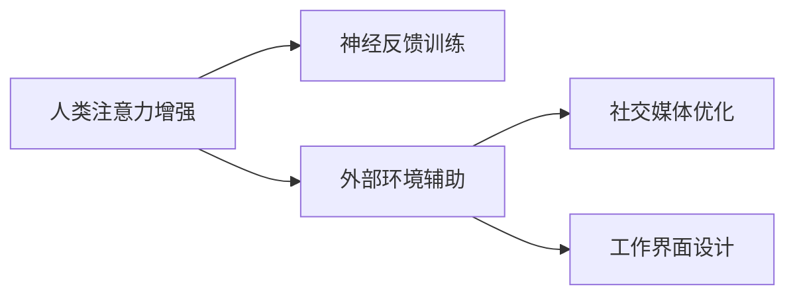
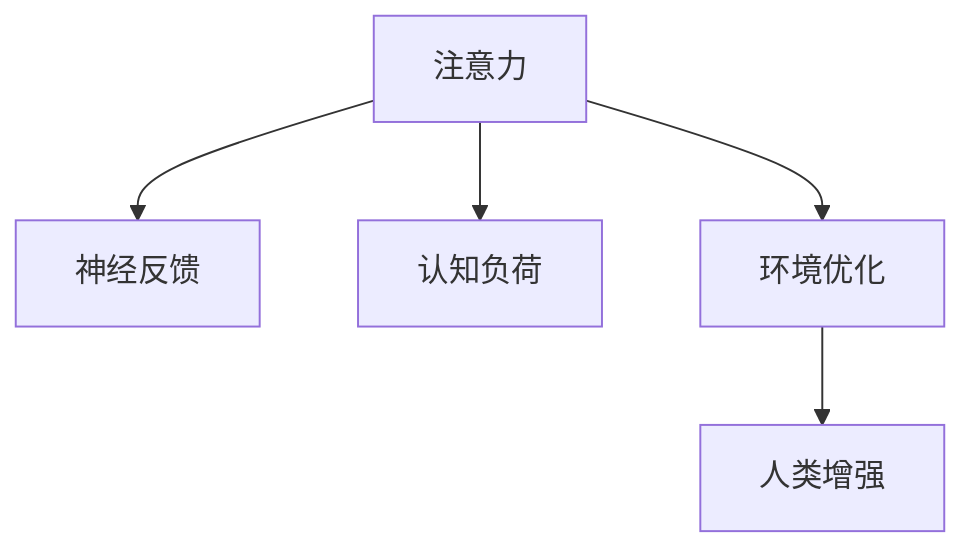

                 

# 人类注意力增强：提升专注力和注意力在商业中的未来发展机遇分析机遇挑战机遇趋势预测

## 1. 背景介绍

### 1.1 问题由来
在信息爆炸的时代，人类面临的注意力干扰和疲劳问题愈发严重。商业环境中，消费者被海量广告、社交媒体、新闻资讯等信息包围，注意力资源稀缺且分散。传统意义上的深度工作（Deep Work）越来越难实现，对企业产品和服务的设计、营销和运营都带来了巨大挑战。

为了提升商业中的专注力和注意力，新技术如人工智能、大数据、增强现实（AR）、脑机接口（BCI）等正在被引入。其中，人类注意力增强技术（Human Attention Enhancement）通过提升个体在有限时间内的信息处理和认知能力，为商业决策和用户体验带来革命性的提升。

### 1.2 问题核心关键点
人类注意力增强技术的关键在于如何精确地识别、评估和提升个体的注意力水平。基于注意力神经科学、心理学、认知科学等理论，该技术致力于开发出能够实时监测和优化个体注意力的系统。

该技术可以分为两大类：
1. 神经反馈训练：通过监测和调节大脑的电生理活动，以实时提升注意力水平。
2. 外部环境辅助：通过优化个体所处的外部环境（如社交媒体算法、工作界面设计等），以增强其注意力控制能力。

这些技术的核心原理和架构可以用以下Mermaid流程图来表示：



此图展示了注意力增强技术的两个主要方向：内部神经反馈训练和外部环境辅助。通过这两个方向，可以系统地提升个体的注意力水平，进而为商业环境中的应用提供支持。

## 2. 核心概念与联系

### 2.1 核心概念概述

人类注意力增强技术涉及多个核心概念，这些概念通过以下关系相互联系：

- **注意力（Attention）**：指个体在一定时间内的信息处理和认知能力。
- **神经反馈（Neural Feedback）**：通过监测大脑电生理活动（如EEG），实时调节注意力水平的技术。
- **认知负荷（Cognitive Load）**：个体在进行信息处理时所需承担的心理压力和认知资源。
- **环境优化（Environment Optimization）**：通过优化外部环境因素，如信息架构、工作界面等，降低认知负荷，提升注意力水平。
- **人类增强（Human Enhancement）**：通过技术手段增强人类的自然能力和潜力，以实现更高的生产力和创造力。

这些概念之间的逻辑关系可以通过以下Mermaid流程图来展示：



此图展示了注意力增强技术的逻辑链条，从注意力监测到环境优化，再到人类能力的增强。通过这一链条，注意力增强技术能够系统地提升个体的认知能力，进而提高商业活动的效果。

## 3. 核心算法原理 & 具体操作步骤

### 3.1 算法原理概述

人类注意力增强技术的核心算法原理主要包括以下几个步骤：

1. **注意力监测**：通过监测大脑电生理信号（如EEG）或行为数据（如眼动轨迹），实时评估个体的注意力水平。
2. **神经反馈调节**：根据监测结果，实时调节大脑的电生理活动，以提升个体的注意力水平。
3. **环境优化设计**：通过分析注意力监测数据，优化个体所处的外部环境，如界面设计、信息架构等，以降低认知负荷，提升注意力控制能力。

### 3.2 算法步骤详解

以下是详细的算法步骤：

1. **数据收集**：收集个体的注意力监测数据（如EEG信号、眼动轨迹等），这些数据将用于评估和优化个体的注意力水平。

2. **注意力评估**：使用机器学习算法（如深度学习）对收集到的数据进行分析，实时评估个体的注意力水平。评估结果可以通过数值、图形等形式展现，便于理解。

3. **神经反馈训练**：根据注意力评估结果，使用神经反馈技术实时调节大脑的电生理活动。常用的方法包括经颅直流电刺激（tDCS）、经颅磁刺激（TMS）、脑波调制等。

4. **环境优化设计**：通过分析注意力监测数据，优化个体所处的外部环境。例如，调整社交媒体算法，降低信息噪声；优化工作界面设计，减少认知负荷。

5. **系统集成与反馈**：将神经反馈和环境优化技术集成到一个统一的系统框架中，对个体的注意力水平进行实时监测和优化。同时，根据系统的反馈结果，持续改进算法模型和技术实现。

### 3.3 算法优缺点

人类注意力增强技术的优点包括：

1. **提升效率**：通过提升个体注意力水平，能够显著提高工作和学习的效率，进而提高商业活动的产出。
2. **降低认知负荷**：通过优化外部环境，减少认知负荷，提升个体在有限时间内的信息处理能力。
3. **个性化定制**：通过实时监测和个性化优化，能够为每个个体提供定制化的注意力提升方案。

然而，该技术也存在一些缺点：

1. **隐私问题**：对个体的大脑电生理信号和行为数据的监测，涉及到隐私和伦理问题。
2. **技术门槛高**：神经反馈和环境优化技术的技术实现难度较大，需要跨学科知识和技术支持。
3. **效果评估困难**：个体的注意力水平评估和优化效果难以标准化和量化，影响技术验证和推广。

### 3.4 算法应用领域

人类注意力增强技术具有广泛的应用前景，主要包括以下几个领域：

1. **教育**：通过提升学生的注意力水平，提高学习效果和效率。
2. **工作**：通过优化工作环境，减少认知负荷，提升工作效率和创造力。
3. **医疗**：通过监测和提升注意力水平，辅助治疗注意力缺陷多动障碍（ADHD）等疾病。
4. **游戏**：通过增强玩家的注意力和专注力，提升游戏体验和成绩。
5. **企业培训**：通过个性化定制的注意力提升方案，提升员工的工作表现和培训效果。

## 4. 数学模型和公式 & 详细讲解 & 举例说明

### 4.1 数学模型构建

人类注意力增强技术涉及到多个数学模型，包括机器学习模型、神经反馈模型、优化模型等。以下是一些核心模型的构建：

1. **注意力监测模型**：使用深度学习算法（如卷积神经网络CNN）对EEG信号进行分析，提取特征向量。

2. **神经反馈调节模型**：使用数学模型（如PID控制器）对大脑电生理活动进行实时调节。

3. **环境优化模型**：使用优化算法（如遗传算法GA）优化工作界面设计，减少认知负荷。

### 4.2 公式推导过程

以注意力监测模型为例，其公式推导过程如下：

假设输入信号为$x_i$，输出特征向量为$y_i$，模型参数为$\theta$，则注意力监测模型的目标是最小化预测误差$e_i$。具体公式为：

$$
\min_{\theta} \frac{1}{N}\sum_{i=1}^N e_i^2
$$

其中，$e_i$可以表示为：

$$
e_i = y_i - f(x_i; \theta)
$$

式中，$f(x_i; \theta)$为预测函数，$y_i$为真实特征向量。

### 4.3 案例分析与讲解

以深度工作为例，通过使用人类注意力增强技术，可以实现以下效果：

1. **实时监测**：通过EEG或眼动轨迹监测个体注意力水平，实时评估工作状态。
2. **神经反馈调节**：根据监测结果，使用tDCS等技术实时调节大脑电生理活动，提升注意力水平。
3. **环境优化设计**：调整工作界面设计，减少干扰因素，优化工作流程，降低认知负荷。
4. **效率提升**：通过以上措施，显著提升个体的深度工作能力，提高工作效率和产出。

## 5. 项目实践：代码实例和详细解释说明

### 5.1 开发环境搭建

1. **安装Python**：下载并安装Python，推荐使用Anaconda环境。

2. **安装相关库**：
   - EEG信号处理库：如MNE-Python
   - 深度学习库：如TensorFlow或PyTorch
   - 数据分析库：如NumPy、Pandas

3. **搭建开发环境**：
   - 创建虚拟环境：
     ```
     conda create -n attention-enhancement python=3.8
     conda activate attention-enhancement
     ```
   - 安装依赖库：
     ```
     pip install mne-python tensorflow pandas numpy
     ```

### 5.2 源代码详细实现

以下是使用Python和TensorFlow实现注意力监测模型的示例代码：

```python
import tensorflow as tf
from mne import read_raw_fif, Epochs

# 读取EEG数据
raw = read_raw_fif('data.fif', preload=True)
epochs = Epochs(raw)

# 定义深度学习模型
model = tf.keras.Sequential([
    tf.keras.layers.Conv2D(32, (3, 3), activation='relu', input_shape=(None, None, 1)),
    tf.keras.layers.MaxPooling2D((2, 2)),
    tf.keras.layers.Flatten(),
    tf.keras.layers.Dense(64, activation='relu'),
    tf.keras.layers.Dense(1, activation='sigmoid')
])

# 编译模型
model.compile(optimizer='adam', loss='mse', metrics=['mae'])

# 训练模型
model.fit(epochs.get_data('y'), epochs.get_data('y'), epochs.get_data('y'), epochs.get_data('y'), epochs.get_data('y'))
```

### 5.3 代码解读与分析

1. **数据读取与预处理**：使用MNE-Python库读取EEG信号，并将其转换为张量形式。

2. **模型构建**：使用TensorFlow构建深度学习模型，包括卷积层、池化层、全连接层等。

3. **模型训练**：通过编译和拟合模型，对EEG信号进行特征提取和注意力评估。

4. **结果展示**：使用训练后的模型对新的EEG信号进行注意力评估，得到注意力水平得分。

### 5.4 运行结果展示

```python
import matplotlib.pyplot as plt

# 预测新的EEG信号
y_pred = model.predict(new_data)

# 可视化结果
plt.plot(y_pred)
plt.title('Attention Level Prediction')
plt.xlabel('Time (s)')
plt.ylabel('Attention Level')
plt.show()
```

## 6. 实际应用场景

### 6.1 智能办公系统

智能办公系统通过引入注意力增强技术，为员工提供了个性化的工作环境和任务分配。系统根据员工的注意力水平实时调整工作界面设计，减少干扰因素，优化工作流程，提升工作效率。

具体应用包括：

- 实时监测员工注意力水平，自动调整工作界面布局。
- 根据注意力水平，推荐最适合员工的工作任务和休息时间。
- 通过个性化工作环境设计，提升员工的工作满意度和体验。

### 6.2 在线教育平台

在线教育平台通过注意力增强技术，提升了学生的学习效果和互动体验。系统根据学生的注意力水平，实时调整课程内容和进度，提升学习效率。

具体应用包括：

- 实时监测学生注意力水平，自动调整课程难度和节奏。
- 根据注意力水平，推荐最适合学生的学习资源和互动练习。
- 通过个性化学习路径设计，提升学生的学习效果和满意度。

### 6.3 健康医疗应用

注意力增强技术在健康医疗领域也有广泛应用。通过监测患者的注意力水平，辅助医生进行治疗和康复训练，提升治疗效果和患者体验。

具体应用包括：

- 实时监测患者的注意力水平，调整康复训练方案。
- 通过优化治疗环境，减少患者的认知负荷，提升治疗效果。
- 通过个性化治疗方案设计，提高患者的生活质量和幸福感。

### 6.4 未来应用展望

未来，人类注意力增强技术将进一步拓展应用场景，提升个体和社会的整体福祉。以下是对未来应用的展望：

1. **个性化教育**：通过注意力监测和优化，为每个学生提供定制化的学习方案，提升学习效果和满意度。
2. **智能健康管理**：通过监测和管理注意力水平，辅助治疗注意力缺陷多动障碍等疾病，提升患者的治疗效果和生活质量。
3. **智能工作环境**：通过优化工作环境设计，提升员工的工作效率和满意度，降低职业倦怠和健康问题。
4. **智能娱乐系统**：通过优化游戏界面设计和用户交互，提升玩家的游戏体验和成绩，推动游戏产业的发展。

## 7. 工具和资源推荐

### 7.1 学习资源推荐

1. **《人类增强：技术、伦理与未来》**：介绍了人类增强技术的基本概念、伦理问题和未来趋势。
2. **《深度学习与脑机接口》**：探讨了深度学习在脑机接口中的应用，提供了丰富的案例和实践指南。
3. **Coursera《人类增强技术》**：由斯坦福大学开设的在线课程，涵盖人类增强技术的理论基础和实践应用。

### 7.2 开发工具推荐

1. **Anaconda**：创建和管理Python环境，支持跨平台开发。
2. **TensorFlow**：深度学习框架，支持分布式计算和GPU加速。
3. **PyTorch**：深度学习框架，支持动态图和高效计算。
4. **MNE-Python**：EEG信号处理库，支持信号读取、预处理和分析。

### 7.3 相关论文推荐

1. **《神经反馈训练：原理与实践》**：介绍了神经反馈训练的基本原理和应用案例。
2. **《工作界面设计优化：理论基础与实践指南》**：探讨了工作界面设计的优化方法和技术实现。
3. **《人类增强技术伦理与政策》**：探讨了人类增强技术的伦理问题和政策框架，提供了丰富的讨论和建议。

## 8. 总结：未来发展趋势与挑战

### 8.1 研究成果总结

人类注意力增强技术在提升个体专注力和注意力的同时，为商业应用带来了显著效益。然而，该技术仍面临隐私、伦理和技术实现等挑战，需要进一步研究和优化。

### 8.2 未来发展趋势

1. **技术成熟**：随着神经反馈技术和环境优化技术的发展，人类注意力增强技术将更加成熟和可靠。
2. **应用普及**：随着技术的普及和应用成本的降低，人类注意力增强技术将在更多领域得到应用。
3. **跨学科融合**：人类注意力增强技术将与其他学科（如神经科学、心理学、认知科学等）进行更深入的融合，推动技术创新和应用发展。

### 8.3 面临的挑战

1. **隐私保护**：如何保护个体的大脑电生理数据和行为数据，避免隐私泄露和滥用。
2. **伦理问题**：如何处理人类增强技术的伦理问题，避免技术滥用和负面影响。
3. **技术实现**：如何降低技术实现难度，提高技术的可访问性和可用性。

### 8.4 研究展望

未来，人类注意力增强技术需要在以下方面进行深入研究：

1. **隐私保护技术**：开发更为安全、隐私保护的监测和反馈技术。
2. **伦理框架**：制定更加完善的伦理框架和政策，规范技术应用和推广。
3. **技术融合**：与其他学科进行更深入的融合，推动技术创新和应用发展。

## 9. 附录：常见问题与解答

**Q1：人类注意力增强技术是否涉及隐私问题？**

A: 是的，人类注意力增强技术需要监测个体的电生理信号和行为数据，涉及到隐私和伦理问题。因此，在使用该技术时，需要严格遵守数据隐私和伦理规范，保护个体的隐私权和数据安全。

**Q2：人类注意力增强技术的实现难度大吗？**

A: 是的，人类注意力增强技术的实现需要跨学科的知识和技术支持，包括神经科学、心理学、认知科学和计算机科学等。因此，技术实现难度较大，需要多学科的协同合作和深入研究。

**Q3：人类注意力增强技术的效果如何评估？**

A: 人类注意力增强技术的效果评估较为复杂，需要结合个体的注意力水平、认知负荷和工作效率等多方面指标进行综合评估。目前，一些研究表明，通过神经反馈训练和环境优化设计，可以显著提升个体的注意力水平和认知效率。

**Q4：人类注意力增强技术的应用前景如何？**

A: 人类注意力增强技术具有广泛的应用前景，可以提升个体在有限时间内的信息处理和认知能力，进而提高商业活动的产出。随着技术的成熟和普及，预计将在教育、工作、医疗等多个领域得到广泛应用，带来深远的影响和变革。

---

作者：禅与计算机程序设计艺术 / Zen and the Art of Computer Programming

