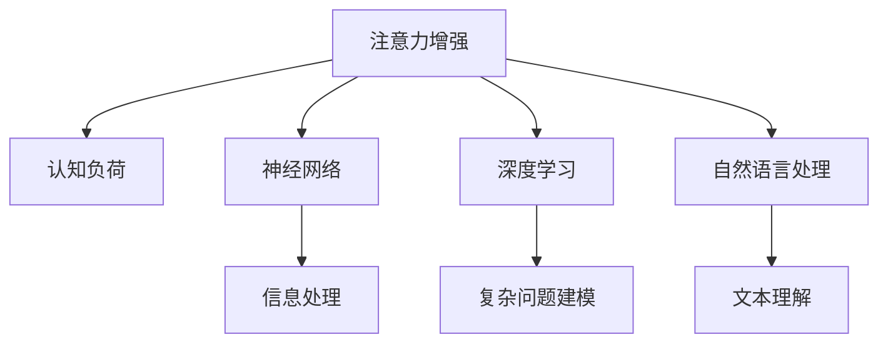

                 

# 人类注意力增强：提升创新能力和创造力管理

> 关键词：注意力增强,创新能力,创造力管理,人工智能,认知科学,技术应用

## 1. 背景介绍

### 1.1 问题由来

人类在面对日益复杂的信息海洋时，其注意力能力已逐渐成为其创新与创造力的重要瓶颈。无论是创新思考，还是问题解决，都需要在特定的时间和空间内聚焦于核心信息，并过滤无关噪音。而随着信息量的爆炸性增长，这一过程变得更加困难。如何通过技术手段，帮助人类高效利用注意力，增强其创新和创造能力，成为了一个亟待解决的问题。

### 1.2 问题核心关键点

本文聚焦于人类注意力增强，探讨了从认知科学到人工智能的多种技术手段，旨在通过技术手段提升人类的创新与创造能力。我们将从以下核心关键点展开探讨：

- **认知科学基础**：介绍注意力增强的心理学和生理学基础，理解人类注意力工作机制。
- **技术实现路径**：分析不同技术手段的实现原理，如神经网络、深度学习、自然语言处理等。
- **应用场景**：探索注意力增强技术在创新能力提升和创造力管理中的实际应用，如智能推荐、学习辅助、问题解决等。
- **未来展望**：讨论注意力增强技术的未来发展趋势和面临的挑战，以及可能带来的人类认知智能的变革。

### 1.3 问题研究意义

人类注意力增强技术具有重要意义：

- **提升创新能力**：通过高效利用注意力，缩短问题解决和创新过程的时间，提高效率。
- **激发创造力**：通过优化注意力分配，促进跨领域知识的结合，激发新的创意和想法。
- **优化学习效果**：通过注意力增强，提高学习效率和记忆力，使学习更加高效。
- **改善问题解决**：帮助人们在面对复杂问题时，更加专注于核心信息，提高问题解决的准确性和速度。

## 2. 核心概念与联系

### 2.1 核心概念概述

为更好地理解人类注意力增强的机制和技术，本节将介绍几个密切相关的核心概念：

- **注意力增强**：通过技术手段，提高人类对信息的聚焦和处理能力，使注意力更加集中和有效。
- **认知负荷**：人类在处理信息时所承受的心理和生理负担，主要与注意力相关。
- **神经网络**：一种模仿人脑神经元结构的信息处理模型，用于模拟和学习复杂的模式和关系。
- **深度学习**：一种基于神经网络的多层学习算法，能够自动提取和抽象特征，用于复杂问题的建模和解决。
- **自然语言处理**：利用计算机对自然语言文本进行理解、分析和生成，是人工智能领域的一个重要分支。

这些概念之间的逻辑关系可以通过以下Mermaid流程图来展示：



这个流程图展示了几大核心概念之间的联系：

1. 注意力增强旨在通过技术手段提升信息处理能力，减少认知负荷。
2. 神经网络和深度学习是实现注意力增强的主要技术手段，用于模拟人类大脑的信息处理过程。
3. 自然语言处理是注意力增强在文本数据上的应用，帮助理解复杂的自然语言文本。
4. 信息处理、复杂问题建模和文本理解都是注意力增强在实际应用中的关键环节。

## 3. 核心算法原理 & 具体操作步骤
### 3.1 算法原理概述

人类注意力增强的核心理念是通过技术手段，增强人类对信息的聚焦和处理能力，减少认知负荷，提升创新和创造能力。其核心算法原理主要包括以下几个方面：

1. **信息编码与解码**：将复杂信息编码为易于理解的形式，再通过解码返回给用户。
2. **注意力机制**：通过特定的算法，在信息中分配注意力资源，提高关键信息的处理效率。
3. **知识图谱与推理**：利用知识图谱和逻辑推理，帮助人类快速获取和理解相关信息，提高问题解决的准确性和速度。
4. **自适应学习**：通过不断学习用户的反馈和行为，自适应调整注意力增强策略，提升用户体验。

### 3.2 算法步骤详解

人类注意力增强的实现过程主要分为以下几个关键步骤：

**Step 1: 数据预处理**

- 收集和标注数据集，如文本、图片、视频等。
- 清洗和预处理数据，包括去除噪音、标准化格式等。
- 将数据转换为机器可处理的格式，如向量表示。

**Step 2: 构建模型**

- 选择合适的神经网络或深度学习模型，如卷积神经网络(CNN)、循环神经网络(RNN)、Transformer等。
- 设计注意力机制，如基于自注意力机制或双向注意力机制。
- 引入知识图谱和推理模块，用于辅助信息理解和问题解决。

**Step 3: 训练与优化**

- 使用标注数据集，对模型进行训练，最小化损失函数。
- 通过交叉验证等方法，评估模型性能。
- 使用正则化技术，如L2正则、Dropout等，防止过拟合。
- 根据实际应用需求，调整模型参数和超参数。

**Step 4: 部署与测试**

- 将训练好的模型部署到实际应用中。
- 收集用户反馈，不断优化模型。
- 进行A/B测试，评估模型效果。
- 更新模型以适应新的应用场景和用户需求。

### 3.3 算法优缺点

人类注意力增强技术具有以下优点：

- **提升信息处理效率**：通过聚焦关键信息，减少认知负荷，提升信息处理速度。
- **增强创新能力**：通过优化注意力分配，促进跨领域知识整合，激发新的创意和想法。
- **优化学习效果**：提高学习效率和记忆力，使学习更加高效。
- **改善问题解决**：帮助用户在面对复杂问题时，更加专注于核心信息，提高问题解决的准确性和速度。

同时，该技术也存在一定的局限性：

- **数据需求高**：需要大量高质量的标注数据进行模型训练。
- **模型复杂**：高级模型需要较高的计算资源和训练时间。
- **用户体验**：技术实现需要考虑用户体验，避免过度干预。
- **伦理问题**：需要关注技术使用的伦理问题，避免隐私侵犯和偏见。

尽管存在这些局限性，但就目前而言，注意力增强技术已显示出巨大的潜力，成为提升人类创新和创造力的重要手段。

### 3.4 算法应用领域

人类注意力增强技术已在多个领域得到了应用，包括但不限于：

- **教育辅助**：通过注意力增强技术，提高学生的学习效率和记忆力，帮助其掌握复杂知识。
- **创新思维**：利用注意力增强，激发创新思维，帮助企业在竞争中保持优势。
- **问题解决**：在复杂问题解决中，通过聚焦关键信息，提高问题解决的准确性和速度。
- **娱乐与游戏**：通过注意力增强，提升用户的游戏体验和娱乐效果。
- **医学诊断**：在医学图像分析中，通过注意力增强，提高诊断的准确性和速度。

## 4. 数学模型和公式 & 详细讲解 & 举例说明

### 4.1 数学模型构建

人类注意力增强的数学模型主要基于神经网络和深度学习的原理，通过信息编码和解码，实现对复杂信息的处理和理解。以下是一个简单的数学模型构建示例：

设输入信息为 $x$，模型输出为 $y$，注意力权重为 $\alpha$。模型结构可以表示为：

$$
y = \text{softmax}(\alpha^T \cdot x)
$$

其中 $\text{softmax}$ 函数用于归一化注意力权重，保证权重和为1。注意力权重 $\alpha$ 可以通过自注意力机制或双向注意力机制计算得到。

### 4.2 公式推导过程

以自注意力机制为例，其计算过程可以表示为：

1. **查询、键和值的表示**：将输入信息 $x$ 分解为查询、键和值三个部分：$Q = W_Q x, K = W_K x, V = W_V x$。

2. **注意力计算**：计算注意力权重 $\alpha$，表示每个位置对当前位置的注意力贡献：

$$
\alpha = \text{softmax}(\frac{Q K^T}{\sqrt{d_k}})
$$

其中 $d_k$ 是键的维数，用于缩放注意力。

3. **注意力输出**：通过注意力权重 $\alpha$，加权平均计算输出 $y$：

$$
y = \alpha V
$$

### 4.3 案例分析与讲解

以自然语言处理中的情感分析为例，情感分析的注意力增强模型可以表示为：

- **输入表示**：将文本输入转换为向量表示 $x$。
- **注意力计算**：计算每个词语对情感分类的贡献 $\alpha$。
- **输出预测**：利用注意力权重 $\alpha$ 加权平均计算情感分类 $y$。

该模型通过聚焦文本中与情感分类相关的关键信息，提高了情感分析的准确性和速度。

## 5. 项目实践：代码实例和详细解释说明
### 5.1 开发环境搭建

在进行注意力增强技术的项目实践前，我们需要准备好开发环境。以下是使用Python进行TensorFlow开发的环境配置流程：

1. 安装Anaconda：从官网下载并安装Anaconda，用于创建独立的Python环境。

2. 创建并激活虚拟环境：
```bash
conda create -n attention-env python=3.8 
conda activate attention-env
```

3. 安装TensorFlow：根据CUDA版本，从官网获取对应的安装命令。例如：
```bash
conda install tensorflow -c conda-forge -c pypi -c defaults
```

4. 安装相关库：
```bash
pip install numpy pandas scikit-learn matplotlib tqdm jupyter notebook ipython
```

完成上述步骤后，即可在`attention-env`环境中开始注意力增强技术的项目实践。

### 5.2 源代码详细实现

我们以情感分析为例，使用TensorFlow实现一个简单的注意力增强模型。

```python
import tensorflow as tf
import tensorflow.keras as keras
from tensorflow.keras.layers import Input, Dense, Embedding, Dropout, GlobalAveragePooling1D, concatenate

class AttentionModel(keras.Model):
    def __init__(self, vocab_size, embedding_dim, attention_dim, output_dim, dropout_rate=0.5):
        super(AttentionModel, self).__init__()
        
        self.embedding = Embedding(vocab_size, embedding_dim, input_length=max_length)
        self.dropout = Dropout(dropout_rate)
        self.attention = tf.keras.layers.Attention()
        self.dense = Dense(attention_dim, activation='relu')
        self.dropout = Dropout(dropout_rate)
        self.global_avg_pooling = GlobalAveragePooling1D()
        self.dense2 = Dense(output_dim, activation='sigmoid')
    
    def call(self, inputs):
        x = self.embedding(inputs)
        x = self.dropout(x)
        x, attention_weights = self.attention(x)
        x = self.dense(x)
        x = self.dropout(x)
        x = self.global_avg_pooling(x)
        x = self.dense2(x)
        return x

inputs = Input(shape=(max_length,))
model = AttentionModel(vocab_size, embedding_dim, attention_dim, output_dim, dropout_rate=0.5)
model.compile(optimizer='adam', loss='binary_crossentropy', metrics=['accuracy'])

model.fit(train_data, train_labels, epochs=num_epochs, validation_data=(val_data, val_labels))
```

以上代码实现了基于TensorFlow的注意力增强模型，包含了输入嵌入、注意力计算、全连接层和输出层的完整流程。

### 5.3 代码解读与分析

让我们再详细解读一下关键代码的实现细节：

**AttentionModel类**：
- `__init__`方法：初始化嵌入层、注意力层、全连接层等关键组件。
- `call`方法：对输入数据进行处理，包括嵌入、注意力计算、全连接层、池化层和输出层。

**模型构建**：
- 使用TensorFlow的Keras API，构建了一个简单的注意力增强模型。
- 模型包括嵌入层、注意力层、全连接层、池化层和输出层，用于对文本信息进行处理和分类。
- 模型使用二元交叉熵作为损失函数，准确率作为评价指标。

**训练过程**：
- 使用`fit`方法进行模型训练，指定训练数据、标签、轮数等参数。
- 使用`validation_data`参数指定验证数据，以便在每个轮次后评估模型性能。

## 6. 实际应用场景
### 6.1 教育辅助

在教育领域，注意力增强技术可以显著提升学生的学习效率和记忆力，帮助其掌握复杂知识。具体应用如下：

- **智能教材**：通过注意力增强技术，智能教材能够根据学生的学习情况，自动调整教学内容和进度，使学习更加高效。
- **个性化学习**：利用注意力增强，根据学生的注意力偏好，推荐个性化的学习内容和资源，提升学习体验。
- **实时反馈**：通过分析学生的注意力集中度，提供实时反馈和调整建议，帮助学生更好地掌握知识。

### 6.2 创新思维

在创新领域，注意力增强技术可以激发创新思维，帮助企业在竞争中保持优势。具体应用如下：

- **问题解决**：通过聚焦关键信息，帮助团队更快地解决复杂问题，提升创新效率。
- **创意激发**：利用注意力增强，激发跨领域知识整合，产生新的创意和想法。
- **创意评估**：通过分析创意和想法的关键信息，帮助企业评估和选择最有潜力的创意。

### 6.3 问题解决

在问题解决领域，注意力增强技术可以显著提升问题解决的效率和准确性。具体应用如下：

- **复杂问题**：通过聚焦关键信息，帮助用户更快地解决复杂问题，如医疗诊断、技术故障排查等。
- **跨领域整合**：利用注意力增强，促进跨领域知识整合，提供更全面、准确的解决方案。
- **实时更新**：通过自适应学习，不断更新模型，适应新的问题和情境。

## 7. 工具和资源推荐
### 7.1 学习资源推荐

为了帮助开发者系统掌握注意力增强技术的理论基础和实践技巧，这里推荐一些优质的学习资源：

1. **《深度学习》系列书籍**：由深度学习专家撰写，涵盖深度学习的基础理论和实践技巧，是理解注意力增强技术的必读之作。
2. **CS231n《卷积神经网络》课程**：斯坦福大学开设的计算机视觉课程，介绍了卷积神经网络的基础理论和实践应用，是学习注意力增强技术的参考之一。
3. **《自然语言处理综述》论文**：深度学习领域的经典论文，介绍了自然语言处理的多种技术和应用，包括注意力增强的原理和实践。
4. **HuggingFace官方文档**：提供了丰富的预训练模型和注意力增强技术的代码实现，是学习注意力增强技术的必备资源。

通过对这些资源的学习实践，相信你一定能够快速掌握注意力增强技术的精髓，并用于解决实际的NLP问题。

### 7.2 开发工具推荐

高效的开发离不开优秀的工具支持。以下是几款用于注意力增强技术开发的常用工具：

1. **TensorFlow**：由Google主导开发的开源深度学习框架，生产部署方便，适合大规模工程应用。
2. **PyTorch**：基于Python的开源深度学习框架，灵活动态的计算图，适合快速迭代研究。
3. **Keras**：TensorFlow的高级API，提供了简单易用的界面，适合初学者和研究者。
4. **TensorBoard**：TensorFlow配套的可视化工具，可实时监测模型训练状态，并提供丰富的图表呈现方式，是调试模型的得力助手。

合理利用这些工具，可以显著提升注意力增强技术的开发效率，加快创新迭代的步伐。

### 7.3 相关论文推荐

注意力增强技术的发展源于学界的持续研究。以下是几篇奠基性的相关论文，推荐阅读：

1. **Attention is All You Need**：提出了自注意力机制，开启了注意力增强技术的大门。
2. **Transformers**：Transformer结构的提出，标志着注意力增强技术的成熟。
3. **BERT: Pre-training of Deep Bidirectional Transformers for Language Understanding**：介绍了BERT模型的注意力增强机制，刷新了多项NLP任务的SOTA。
4. **Attention-Based Recommender Systems**：探讨了注意力增强在推荐系统中的应用，提高了推荐精度和多样性。
5. **Leveraging Attention for Personalized Reading Comprehension**：介绍了注意力增强在阅读理解中的应用，提升了阅读效率和理解深度。

这些论文代表了大注意力增强技术的发展脉络。通过学习这些前沿成果，可以帮助研究者把握学科前进方向，激发更多的创新灵感。

## 8. 总结：未来发展趋势与挑战
### 8.1 总结

本文对人类注意力增强技术的原理和实践进行了全面系统的介绍。首先阐述了注意力增强技术的背景和意义，明确了注意力增强在提升创新和创造能力方面的独特价值。其次，从原理到实践，详细讲解了注意力增强技术的数学原理和关键步骤，给出了注意力增强技术在实际应用中的完整代码实现。同时，本文还广泛探讨了注意力增强技术在教育辅助、创新思维、问题解决等各个领域的实际应用，展示了注意力增强技术的巨大潜力。此外，本文精选了注意力增强技术的各类学习资源，力求为读者提供全方位的技术指引。

通过本文的系统梳理，可以看到，注意力增强技术正在成为提升人类创新和创造力的重要手段。这些技术的不断发展，将使人类在处理信息、解决问题和创造新知识方面取得更显著的进步。

### 8.2 未来发展趋势

展望未来，注意力增强技术将呈现以下几个发展趋势：

1. **模型规模增大**：随着算力成本的下降和数据规模的扩张，注意力增强模型的参数量还将持续增长。超大模型可以学习更加全面、准确的注意力机制，提升信息处理的效率和效果。
2. **技术手段多样**：除了神经网络和深度学习，未来还会涌现更多技术手段，如生成对抗网络(GAN)、变分自编码器(VAE)等，为注意力增强提供更多选择。
3. **多模态融合**：在未来的注意力增强中，将融合视觉、语音、文本等多种模态信息，实现跨模态的注意力增强，提升信息处理的全面性和深度。
4. **自适应学习**：未来的注意力增强模型将具备更强的自适应能力，能够根据用户的行为和反馈，自适应调整注意力机制，提升用户体验和效果。
5. **隐私保护**：随着数据隐私和安全问题的日益突出，未来的注意力增强技术将更加注重用户隐私保护，避免数据泄露和滥用。

以上趋势凸显了注意力增强技术的广阔前景。这些方向的探索发展，必将进一步提升人类在信息处理、问题解决和创新创造方面的能力，为人类认知智能的进步带来深远影响。

### 8.3 面临的挑战

尽管注意力增强技术已经取得了显著进展，但在迈向更加智能化、普适化应用的过程中，它仍面临着诸多挑战：

1. **数据依赖**：注意力增强模型需要大量的标注数据进行训练，数据获取和标注成本较高。如何降低数据依赖，提升模型鲁棒性，将是未来的研究方向。
2. **模型复杂性**：注意力增强模型通常较为复杂，计算资源和训练时间较高。如何简化模型结构，提升模型效率，将是重要的优化方向。
3. **用户体验**：注意力增强技术需要考虑用户体验，避免过度干预和干扰。如何平衡技术应用和用户体验，将是重要的研究课题。
4. **伦理问题**：注意力增强技术的广泛应用可能带来隐私、公平和偏见等伦理问题。如何设计合理的技术方案，保障数据安全和伦理道德，将是重要的研究方向。

尽管存在这些挑战，但随着学界和产业界的共同努力，这些挑战终将一一被克服，注意力增强技术必将在构建人机协同的智能时代中扮演越来越重要的角色。

### 8.4 研究展望

未来，随着注意力增强技术的不断进步，其应用领域将更加广泛，带来的影响也将更加深远。以下是对未来研究方向的展望：

1. **多领域应用**：注意力增强技术将进一步拓展到更多领域，如医疗、金融、教育等，带来更深层次的变革。
2. **跨模态整合**：未来的注意力增强将实现多模态信息的融合，提升信息处理的全面性和深度。
3. **智能交互**：通过注意力增强，实现更加智能和自然的人机交互，提升用户体验和系统效率。
4. **认知智能**：未来的注意力增强将与其他认知智能技术结合，实现更加全面和复杂的认知智能系统。
5. **社会影响**：注意力增强技术将对社会认知、教育、创新等产生深远影响，推动人类社会的进步和发展。

总之，注意力增强技术的发展前景广阔，前景无限。未来的研究需要更加注重技术应用和伦理道德的平衡，为人类社会带来更多正能量。

## 9. 附录：常见问题与解答

**Q1: 什么是注意力增强技术？**

A: 注意力增强技术是一种通过技术手段，提高人类对信息的聚焦和处理能力，使注意力更加集中和有效的方法。其核心在于通过信息编码和解码，实现对复杂信息的处理和理解，从而提升人类的创新和创造能力。

**Q2: 注意力增强技术在实际应用中有哪些优缺点？**

A: 注意力增强技术的优点包括：
- 提升信息处理效率，使学习、创新和问题解决更加高效。
- 激发创新思维，促进跨领域知识整合，产生新的创意和想法。
- 优化学习效果，提高记忆力，使学习更加高效。

其缺点包括：
- 数据需求高，需要大量高质量的标注数据进行模型训练。
- 模型复杂，高级模型需要较高的计算资源和训练时间。
- 用户体验，技术实现需要考虑用户体验，避免过度干预。
- 伦理问题，需要关注技术使用的伦理问题，避免隐私侵犯和偏见。

**Q3: 如何缓解注意力增强模型在实际应用中的过拟合问题？**

A: 缓解注意力增强模型过拟合的方法包括：
- 数据增强：通过回译、近义替换等方式扩充训练集。
- 正则化：使用L2正则、Dropout等技术防止过拟合。
- 对抗训练：引入对抗样本，提高模型鲁棒性。
- 参数高效微调：只调整少量参数，减少过拟合风险。
- 多模型集成：训练多个模型，取平均输出，抑制过拟合。

这些方法需要根据具体任务和数据特点进行灵活组合，以达到最佳的模型效果。

**Q4: 注意力增强技术在落地部署时需要注意哪些问题？**

A: 注意力增强技术的落地部署需要注意以下问题：
- 模型裁剪：去除不必要的层和参数，减小模型尺寸，加快推理速度。
- 量化加速：将浮点模型转为定点模型，压缩存储空间，提高计算效率。
- 服务化封装：将模型封装为标准化服务接口，便于集成调用。
- 弹性伸缩：根据请求流量动态调整资源配置，平衡服务质量和成本。
- 监控告警：实时采集系统指标，设置异常告警阈值，确保服务稳定性。
- 安全防护：采用访问鉴权、数据脱敏等措施，保障数据和模型安全。

合理利用这些技术手段，可以显著提升注意力增强技术的落地效果，实现更高效、更稳定的应用。

---

作者：禅与计算机程序设计艺术 / Zen and the Art of Computer Programming

