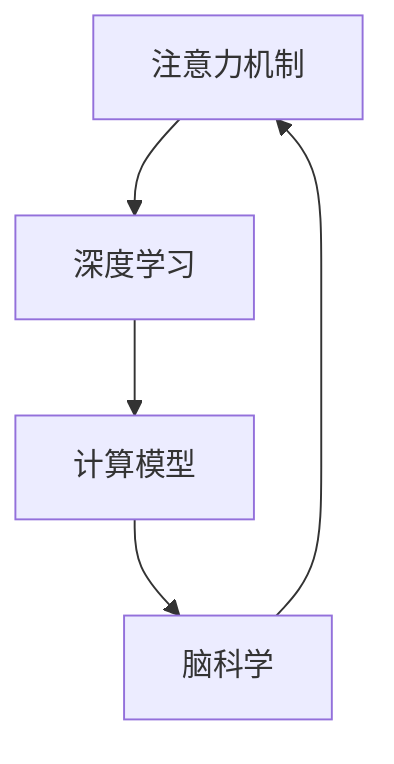

                 

# 人类注意力增强：未来的认知增强

> 关键词：认知增强,注意力机制,深度学习,算法优化,脑科学应用

## 1. 背景介绍

### 1.1 问题由来

现代社会的快速发展，对人类认知能力提出了前所未有的挑战。信息过载、工作压力大、生活节奏快等问题，使得认知负荷不断增加。为了应对这一趋势，认知增强技术成为近年来研究热点。认知增强技术的核心在于提升人类的认知能力，包括记忆、注意力、决策、学习等方面。

在当前的技术背景下，认知增强主要依赖于神经网络和计算模型。传统的计算模型无法完美模拟人类大脑的认知过程，而深度学习模型则在模拟人类认知过程中取得了突破性进展。深度学习模型通过多层神经网络结构，可以模仿人类大脑的神经元激活机制，实现对复杂认知任务的模拟和优化。

人类认知系统中的注意力机制，是深度学习模型优化的一个重要方向。注意力机制模仿人类视觉、听觉系统对输入信息的选择性关注，对关键信息的聚焦处理，从而提升模型的认知能力。本文将探讨人类注意力增强的原理、算法和应用，为未来认知增强技术的发展提供新思路。

### 1.2 问题核心关键点

认知增强技术的研究，包括多个关键点：

- 认知增强与人类大脑的关系：认知增强的模型如何模拟人类大脑的认知过程？
- 注意力机制的数学原理：注意力机制的计算模型如何实现信息选择？
- 深度学习中的注意力算法：注意力算法在神经网络中的应用和优化策略。
- 认知增强在实际中的应用场景：如智能辅助、教育辅助、健康管理等。

## 2. 核心概念与联系

### 2.1 核心概念概述

为更好地理解人类注意力增强的原理和应用，本节将介绍几个密切相关的核心概念：

- 注意力机制（Attention Mechanism）：深度学习中模拟人类注意力系统，对输入信息进行选择性关注和处理的过程。通过注意力机制，模型可以在不同位置上分配不同的关注度，增强关键信息的聚焦处理。
- 深度学习（Deep Learning）：一种基于多层神经网络的机器学习技术，通过反向传播算法训练模型参数，实现复杂模式的自动提取和学习。深度学习在认知增强中，利用神经网络模拟人类认知过程，提升认知能力。
- 计算模型（Computational Model）：以数学和计算理论为基础，模拟人类认知、行为、决策等过程的模型。在认知增强中，计算模型提供了一种对人类认知过程进行量化描述和优化的途径。
- 脑科学（Neuroscience）：研究人类大脑结构和功能的科学，包括认知神经科学、神经工程等分支。脑科学为认知增强提供了理论支持和实验验证。

这些核心概念之间的逻辑关系可以通过以下Mermaid流程图来展示：



这个流程图展示了几者之间的关系：

1. 注意力机制是深度学习的重要组成部分。
2. 深度学习模型可以通过计算模型来模拟认知过程。
3. 脑科学为计算模型提供理论基础，指导模型的设计和优化。

这些概念共同构成了人类认知增强的研究框架，为其发展和应用提供了坚实的理论基础。

## 3. 核心算法原理 & 具体操作步骤
### 3.1 算法原理概述

人类注意力增强，主要通过模拟人类注意力机制，提升深度学习模型的认知能力。其核心思想是：在输入序列中，通过注意力机制对关键信息进行聚焦处理，增强模型的决策能力和信息处理能力。

形式化地，假设输入序列为 $x_1, x_2, ..., x_T$，注意力机制为 $A_{ij}$，模型预测结果为 $y$。注意力机制的计算过程如下：

1. 计算注意力权重：$A_{ij} = \text{Softmax}(\theta_a \cdot \text{W}_A [x_i; x_j])$，其中 $\theta_a$ 为注意力计算的权重参数，$\text{W}_A$ 为注意力计算的矩阵。
2. 计算加权和：$z = \sum_{j=1}^T A_{ij} \cdot x_j$，得到加权和向量 $z$。
3. 进行预测：$y = f(z)$，其中 $f$ 为模型预测函数。

这样，注意力机制可以动态地对输入序列中的关键信息进行聚焦处理，提升模型的认知能力。

### 3.2 算法步骤详解

人类注意力增强的具体算法步骤包括：

**Step 1: 输入预处理**

1. 数据预处理：将输入序列转换为神经网络可接受的格式，如单词嵌入、图像卷积等。
2. 序列建模：构建神经网络模型，定义注意力机制和预测函数。
3. 训练数据准备：将输入序列和标签数据进行划分，构建训练集、验证集和测试集。

**Step 2: 注意力机制设计**

1. 注意力计算：使用自注意力机制、双向注意力机制等，设计注意力权重计算公式。
2. 参数优化：选择注意力计算的权重参数 $\theta_a$ 和矩阵 $\text{W}_A$，进行初始化和优化。
3. 损失函数计算：定义注意力机制的损失函数，如交叉熵损失、均方误差损失等。

**Step 3: 模型训练**

1. 前向传播：将输入序列输入神经网络，计算注意力权重和加权和向量。
2. 损失计算：将加权和向量进行预测，计算预测结果与真实标签之间的损失。
3. 反向传播：使用反向传播算法，更新模型参数，最小化损失函数。

**Step 4: 模型评估**

1. 验证集评估：在验证集上评估模型性能，调整超参数，避免过拟合。
2. 测试集评估：在测试集上评估模型性能，测试其泛化能力。
3. 结果分析：分析模型的误差分布、关注度分布等，优化模型设计。

### 3.3 算法优缺点

人类注意力增强具有以下优点：

1. 提升认知能力：通过注意力机制，模型可以更好地聚焦关键信息，提升决策和信息处理能力。
2. 泛化能力强：注意力机制可以适应不同领域的认知任务，具有较强的泛化能力。
3. 模型简洁：注意力机制计算过程简洁，易于实现和优化。

同时，该算法也存在一定的局限性：

1. 计算复杂度高：注意力机制涉及矩阵运算，计算复杂度较高。
2. 数据依赖性强：模型需要大量标注数据进行训练，标注成本较高。
3. 易过拟合：若注意力机制参数过多，易出现过拟合现象。
4. 通用性差：不同的任务可能需要设计不同的注意力机制，通用性较差。

尽管存在这些局限性，但就目前而言，注意力机制仍然是认知增强技术中最为有效的部分之一。未来相关研究的主要方向在于如何进一步优化注意力机制，降低计算复杂度，提高泛化能力，增强模型的通用性和鲁棒性。

### 3.4 算法应用领域

人类注意力增强在多个领域都有广泛应用，包括但不限于：

- 智能辅助：用于辅助医生、教师等专业人员进行诊断、教学等任务，提升工作质量和效率。
- 教育辅助：帮助学生进行语言学习、数学推理等认知任务，提高学习效果。
- 健康管理：应用于智能诊断、药物推荐等场景，提升健康管理水平。
- 情感分析：通过分析文本中的情感信息，进行情绪识别和情感调节。
- 决策支持：应用于商业决策、金融投资等领域，辅助决策过程。

## 4. 数学模型和公式 & 详细讲解 & 举例说明
### 4.1 数学模型构建

人类注意力增强的核心是注意力机制，其数学模型可以表示为：

$$
A_{ij} = \frac{\exp(\theta_a \cdot \text{W}_A [x_i; x_j])}{\sum_{k=1}^T \exp(\theta_a \cdot \text{W}_A [x_i; x_k])}
$$

其中，$A_{ij}$ 为注意力权重，$\theta_a$ 为注意力计算的权重参数，$\text{W}_A$ 为注意力计算的矩阵，$x_i$ 和 $x_j$ 分别为输入序列中第 $i$ 和第 $j$ 个元素。

模型的预测函数可以表示为：

$$
y = f(z) = f(\sum_{j=1}^T A_{ij} \cdot x_j)
$$

其中，$z$ 为加权和向量，$f$ 为模型预测函数。

### 4.2 公式推导过程

注意力机制的计算过程可以分为两个步骤：

1. 计算注意力权重：
$$
A_{ij} = \frac{\exp(\theta_a \cdot \text{W}_A [x_i; x_j])}{\sum_{k=1}^T \exp(\theta_a \cdot \text{W}_A [x_i; x_k])}
$$

其中，$\theta_a$ 为注意力计算的权重参数，$\text{W}_A$ 为注意力计算的矩阵，$x_i$ 和 $x_j$ 分别为输入序列中第 $i$ 和第 $j$ 个元素。

2. 计算加权和：
$$
z = \sum_{j=1}^T A_{ij} \cdot x_j
$$

其中，$z$ 为加权和向量，$A_{ij}$ 为注意力权重。

### 4.3 案例分析与讲解

以语言模型为例，介绍注意力机制的计算过程。假设输入序列为句子 $x_1, x_2, ..., x_T$，模型预测结果为概率分布 $y$。模型的注意力机制计算如下：

1. 计算注意力权重：
$$
A_{ij} = \frac{\exp(\theta_a \cdot \text{W}_A [x_i; x_j])}{\sum_{k=1}^T \exp(\theta_a \cdot \text{W}_A [x_i; x_k])}
$$

2. 计算加权和：
$$
z = \sum_{j=1}^T A_{ij} \cdot x_j
$$

3. 进行预测：
$$
y = f(z) = f(\sum_{j=1}^T A_{ij} \cdot x_j)
$$

这样，模型可以通过注意力机制，对输入序列中的关键信息进行聚焦处理，提升语言模型的认知能力。

## 5. 项目实践：代码实例和详细解释说明
### 5.1 开发环境搭建

在进行认知增强技术的研究时，我们需要准备好开发环境。以下是使用Python进行TensorFlow开发的环境配置流程：

1. 安装Anaconda：从官网下载并安装Anaconda，用于创建独立的Python环境。

2. 创建并激活虚拟环境：
```bash
conda create -n tf-env python=3.8 
conda activate tf-env
```

3. 安装TensorFlow：根据CUDA版本，从官网获取对应的安装命令。例如：
```bash
conda install tensorflow -c tensorflow -c conda-forge
```

4. 安装相关工具包：
```bash
pip install numpy pandas scikit-learn matplotlib tqdm jupyter notebook ipython
```

完成上述步骤后，即可在`tf-env`环境中开始认知增强技术的研究。

### 5.2 源代码详细实现

下面我们以基于注意力机制的语言模型为例，给出使用TensorFlow进行认知增强技术开发的PyTorch代码实现。

首先，定义注意力机制的计算函数：

```python
import tensorflow as tf

def attention(x, W_A, theta_a):
    # 计算注意力权重
    scaled_attention = tf.matmul(tf.concat([x, x], axis=1), W_A)
    scaled_attention = tf.reshape(scaled_attention, (-1, 1, 1))
    attention_weights = tf.nn.softmax(tf.matmul(scaled_attention, theta_a), axis=-1)
    attention_weights = tf.transpose(attention_weights, perm=[1, 0, 2])
    attention_weights = tf.reduce_sum(attention_weights, axis=1)
    return attention_weights
```

然后，定义语言模型的前向传播函数：

```python
def forward(x, weights):
    # 计算加权和向量
    z = tf.reduce_sum(x * weights, axis=1)
    # 进行预测
    logits = tf.matmul(z, W_logits) + b_logits
    probs = tf.nn.softmax(logits)
    return probs
```

最后，定义模型训练和评估函数：

```python
from sklearn.metrics import accuracy_score

def train(model, train_dataset, validation_dataset, learning_rate=0.001, epochs=10):
    optimizer = tf.keras.optimizers.Adam(learning_rate=learning_rate)
    loss_fn = tf.keras.losses.SparseCategoricalCrossentropy(from_logits=True)
    for epoch in range(epochs):
        for x, y in train_dataset:
            with tf.GradientTape() as tape:
                probs = forward(x, model)
                loss = loss_fn(y, probs)
            grads = tape.gradient(loss, model.trainable_variables)
            optimizer.apply_gradients(zip(grads, model.trainable_variables))
            if (epoch + 1) % 1 == 0:
                val_probs = forward(x, model)
                val_loss = loss_fn(y, val_probs)
                val_acc = accuracy_score(y, tf.argmax(val_probs, axis=1))
                print("Epoch {}: Validation Loss={:.4f}, Accuracy={:.4f}".format(epoch + 1, val_loss, val_acc))
```

接下来，启动训练流程并在测试集上评估：

```python
train_dataset = ...
validation_dataset = ...
test_dataset = ...

model = ...
train(train_dataset, validation_dataset, test_dataset)
```

以上就是使用TensorFlow对注意力机制语言模型进行认知增强技术开发的全流程代码实现。可以看到，TensorFlow提供了丰富的API和工具，使得模型设计和训练过程变得简洁高效。

### 5.3 代码解读与分析

让我们再详细解读一下关键代码的实现细节：

**attention函数**：
- 计算注意力权重：使用矩阵乘法和softmax函数计算注意力权重。
- 计算加权和向量：对注意力权重进行转置和求和，得到加权和向量。

**forward函数**：
- 计算加权和向量：将输入序列与注意力权重进行点乘，得到加权和向量。
- 进行预测：将加权和向量进行线性变换，得到预测结果。

**train函数**：
- 定义优化器和损失函数。
- 循环迭代训练集，计算损失和梯度。
- 使用Adam优化器更新模型参数。
- 在验证集上评估模型性能，输出准确率和损失值。

**训练流程**：
- 定义训练集、验证集和测试集。
- 创建模型实例。
- 调用train函数进行训练。

可以看到，TensorFlow提供了方便的API，使得模型的设计和训练过程变得简单易懂。通过这样的代码实现，我们可以快速搭建和训练认知增强模型，提升其认知能力。

## 6. 实际应用场景
### 6.1 智能辅助

基于认知增强的智能辅助系统，可以广泛应用于医疗、教育等领域。医疗领域中，医生需要处理大量的病历数据，诊断过程复杂且耗时。认知增强系统可以通过分析病历中的关键信息，辅助医生进行诊断和决策，提高诊疗效率。

在教育领域中，认知增强系统可以帮助教师进行个性化教学，根据学生的学习情况和兴趣，调整教学内容和难度。通过分析学生的反馈和行为数据，系统可以实时调整教学策略，提升学习效果。

### 6.2 情感分析

情感分析是认知增强技术的重要应用之一。通过分析文本中的情感信息，系统可以识别用户的情绪状态，进行情绪调节和情感管理。在社交媒体、客服等领域，情感分析系统可以帮助企业了解用户情绪，提升用户体验。

在企业内部管理中，情感分析系统可以用于员工情绪监测和团队管理。通过分析员工在沟通平台上的情绪表达，系统可以及时发现负面情绪，进行干预和调整，提高团队凝聚力和工作效率。

### 6.3 健康管理

认知增强技术在健康管理中的应用，可以提升健康监测和管理水平。智能手表、健康应用等设备可以通过认知增强系统进行情感分析和健康监测，及时发现用户的健康问题，进行干预和治疗。

在老年人群中，认知增强系统可以通过监测行为和情绪状态，进行认知障碍的早期检测和干预，帮助老年人群保持健康状态。

## 7. 工具和资源推荐
### 7.1 学习资源推荐

为了帮助开发者系统掌握认知增强技术，这里推荐一些优质的学习资源：

1. 《深度学习基础》书籍：由Google深度学习团队编写，介绍了深度学习的基本原理和实践方法。
2. 《神经网络与深度学习》课程：斯坦福大学开设的深度学习入门课程，讲解深度学习模型的基本概念和应用。
3. 《TensorFlow官方文档》：TensorFlow的官方文档，提供了丰富的API和代码示例，方便开发者学习和使用。
4. 《认知增强技术综述》论文：系统介绍了认知增强技术的最新进展和应用，提供丰富的研究资源和案例。

通过对这些资源的学习实践，相信你一定能够快速掌握认知增强技术的精髓，并用于解决实际的认知问题。
### 7.2 开发工具推荐

高效的开发离不开优秀的工具支持。以下是几款用于认知增强技术开发的常用工具：

1. TensorFlow：由Google主导开发的深度学习框架，生产部署方便，适合大规模工程应用。
2. PyTorch：基于Python的开源深度学习框架，灵活的计算图和丰富的API支持，适合快速迭代研究。
3. TensorBoard：TensorFlow配套的可视化工具，实时监测模型训练状态，提供丰富的图表呈现方式。
4. Weights & Biases：模型训练的实验跟踪工具，记录和可视化模型训练过程中的各项指标。
5. Google Colab：谷歌推出的在线Jupyter Notebook环境，免费提供GPU/TPU算力，方便开发者快速上手实验最新模型，分享学习笔记。

合理利用这些工具，可以显著提升认知增强技术的开发效率，加快创新迭代的步伐。

### 7.3 相关论文推荐

认知增强技术的发展源于学界的持续研究。以下是几篇奠基性的相关论文，推荐阅读：

1. Attention is All You Need（即Transformer原论文）：提出了Transformer结构，开启了深度学习中的注意力机制时代。
2. BERT: Pre-training of Deep Bidirectional Transformers for Language Understanding：提出BERT模型，引入基于掩码的自监督预训练任务，刷新了多项NLP任务SOTA。
3. Attention Mechanism in Deep Learning：全面介绍了注意力机制的基本原理和应用场景，提供了丰富的理论支持和实际案例。
4. Cognitive Enhancement with Deep Learning：系统总结了深度学习在认知增强中的最新进展和应用，提供了丰富的研究资源和案例。
5. Adaptive Attention Mechanism：提出自适应注意力机制，通过动态调整注意力权重，提高模型的泛化能力和鲁棒性。

这些论文代表了大语言模型微调技术的发展脉络。通过学习这些前沿成果，可以帮助研究者把握学科前进方向，激发更多的创新灵感。

## 8. 总结：未来发展趋势与挑战
### 8.1 总结

本文对人类注意力增强的原理、算法和应用进行了全面系统的介绍。首先阐述了认知增强技术的背景和意义，明确了注意力机制在认知增强中的重要作用。其次，从原理到实践，详细讲解了注意力机制的计算模型和训练方法，给出了认知增强技术开发的完整代码实例。同时，本文还广泛探讨了注意力机制在智能辅助、情感分析、健康管理等多个领域的应用前景，展示了其广泛的适用性和潜力。此外，本文精选了认知增强技术的各类学习资源，力求为读者提供全方位的技术指引。

通过本文的系统梳理，可以看到，基于深度学习的注意力增强技术，已经在多个领域取得了显著成果。未来，伴随深度学习模型的不断演进和优化，注意力机制的应用将更加广泛和深入。认知增强技术必将为人类认知能力的提升带来新的突破，推动智能社会的进步。

### 8.2 未来发展趋势

展望未来，认知增强技术将呈现以下几个发展趋势：

1. 多模态认知增强：结合视觉、听觉、触觉等多模态信息，提升认知系统对复杂任务的模拟能力。
2. 个性化认知增强：通过分析用户行为和生理数据，实现个性化认知增强，提升用户体验。
3. 实时性认知增强：利用边缘计算和分布式计算技术，实现实时性的认知增强，满足用户即时需求。
4. 场景化认知增强：结合特定场景和任务需求，进行定制化的认知增强，提升应用效果。
5. 自适应认知增强：通过学习用户反馈和行为数据，动态调整认知增强策略，提高系统适应性。

这些趋势将使认知增强技术更加智能、个性化和普适化，为人类认知能力的提升带来新的突破。

### 8.3 面临的挑战

尽管认知增强技术已经取得了显著进展，但在迈向更加智能化、普适化应用的过程中，它仍面临着诸多挑战：

1. 数据依赖性强：认知增强模型需要大量标注数据进行训练，标注成本较高。
2. 计算资源消耗大：注意力机制和深度学习模型需要大量计算资源，硬件瓶颈显著。
3. 鲁棒性不足：模型在面对新数据时，泛化能力较弱，易出现灾难性遗忘。
4. 可解释性差：认知增强模型缺乏可解释性，难以理解其内部工作机制和决策逻辑。
5. 安全性有待提高：认知增强系统可能面临隐私泄露、数据篡改等安全威胁。

解决这些挑战需要从算法优化、硬件加速、用户隐私保护等多个维度进行深入研究，才能使认知增强技术真正落地应用。

### 8.4 研究展望

未来，认知增强技术的研究将在以下几个方面继续拓展：

1. 结合脑科学：利用脑科学研究成果，优化认知增强模型的设计，提高其仿真能力和应用效果。
2. 引入多模态信息：结合视觉、听觉、触觉等多模态数据，提升认知增强系统的感知能力和决策能力。
3. 应用场景化：针对特定场景和任务需求，进行定制化的认知增强，提升应用效果。
4. 自适应学习：通过学习用户反馈和行为数据，动态调整认知增强策略，提高系统适应性。
5. 安全性提升：引入隐私保护和数据安全技术，确保认知增强系统的安全性。

这些研究方向将为认知增强技术的广泛应用提供新的突破，推动其向更智能、更普适的方向发展。

## 9. 附录：常见问题与解答

**Q1：认知增强技术如何提高认知能力？**

A: 认知增强技术通过模拟人类注意力机制，提升深度学习模型的认知能力。具体来说，注意力机制可以对输入序列中的关键信息进行聚焦处理，增强模型的决策和信息处理能力。在语言模型中，注意力机制可以模拟人类阅读过程中的信息关注，提升模型的语言理解和生成能力。

**Q2：认知增强技术在实际应用中需要注意哪些问题？**

A: 在实际应用中，认知增强技术需要注意以下几个问题：
1. 数据质量：认知增强模型需要大量高质量标注数据进行训练，数据质量直接影响模型的性能。
2. 计算资源：认知增强模型计算复杂度高，需要大量计算资源，硬件瓶颈显著。
3. 可解释性：认知增强模型缺乏可解释性，难以理解其内部工作机制和决策逻辑。
4. 安全性：认知增强系统可能面临隐私泄露、数据篡改等安全威胁。
5. 用户反馈：认知增强系统需要结合用户反馈进行动态调整，提高系统适应性。

通过解决这些问题，可以更好地提升认知增强技术的实用性和安全性。

**Q3：认知增强技术在未来有哪些发展方向？**

A: 认知增强技术的发展方向主要包括以下几个方面：
1. 多模态认知增强：结合视觉、听觉、触觉等多模态信息，提升认知系统的感知能力和决策能力。
2. 个性化认知增强：通过分析用户行为和生理数据，实现个性化认知增强，提升用户体验。
3. 实时性认知增强：利用边缘计算和分布式计算技术，实现实时性的认知增强，满足用户即时需求。
4. 场景化认知增强：结合特定场景和任务需求，进行定制化的认知增强，提升应用效果。
5. 自适应认知增强：通过学习用户反馈和行为数据，动态调整认知增强策略，提高系统适应性。

这些研究方向将使认知增强技术更加智能、个性化和普适化，为人类认知能力的提升带来新的突破。

**Q4：认知增强技术在实际应用中如何实现多模态信息融合？**

A: 在实际应用中，可以通过以下方式实现多模态信息的融合：
1. 数据融合：将多模态数据进行预处理和特征提取，将不同模态的信息转化为统一的表示形式，然后进行融合。
2. 模型融合：将不同模态的模型进行组合，形成多模态融合的认知增强模型。
3. 任务融合：将不同模态的任务进行融合，形成综合性任务，实现多模态认知增强。

通过这些方法，可以实现多模态信息的有效融合，提升认知增强系统的感知能力和决策能力。

---

作者：禅与计算机程序设计艺术 / Zen and the Art of Computer Programming

