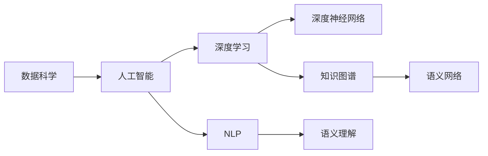

                 

# 人类的知识与权力：知识就是力量

在人类文明的长河中，知识一直是推动社会进步、改变世界面貌的重要力量。从古希腊的哲学思辨，到文艺复兴的科学发现，再到信息时代的科技创新，每一项重大成果的背后，都凝结着人类对知识的渴求和对真理的探求。

## 1. 背景介绍

### 1.1 知识与权力
知识与权力是人类社会的重要组成部分。在古代，知识往往掌握在少数精英手中，成为权力博弈的工具。而到了现代，随着信息技术的发展，知识的获取和传播变得前所未有的容易，知识的普及和应用也进一步推动了社会的进步。

在IT领域，知识的积累和创新更是成为科技公司竞争力的关键。Google、Apple、Microsoft等公司之所以能够在全球科技市场占据主导地位，很大程度上依赖于其在知识管理和技术创新方面的优势。

### 1.2 数据科学与人工智能
数据科学和人工智能作为信息时代的产物，正在重新定义知识与权力的关系。大数据、机器学习、深度学习等技术，使得从海量数据中提取知识、建模分析和生成预测成为可能。

数据科学和人工智能的快速发展，不仅催生了新的应用场景，也赋予了知识更强的力量和广泛的影响力。比如，NLP技术使得机器能够理解并生成自然语言，为人类与机器的交互提供了新的方式；医疗AI可以辅助医生进行诊断和治疗；金融科技利用机器学习进行风险预测和投资决策等。

## 2. 核心概念与联系

### 2.1 核心概念概述
- **数据科学**：通过数据收集、处理、分析和建模等手段，从海量数据中提取知识和规律。
- **人工智能**：以计算机为工具，通过学习数据和算法，使机器具备解决复杂问题的能力。
- **深度学习**：一种基于人工神经网络的学习方法，能够在大量数据上自学习，并提取出复杂的多层次特征。
- **自然语言处理（NLP）**：使机器能够理解、处理和生成人类语言的技术。
- **知识图谱**：用图结构表示的知识体系，用于描述实体之间的关系和属性。
- **语义网络**：用网络结构表示知识，能够捕捉知识之间的语义关联。

### 2.2 核心概念原理和架构的 Mermaid 流程图



在这个流程图中，数据科学是人工智能的基础，深度学习是核心技术，NLP是重要应用，知识图谱和语义网络则是关键工具。各概念之间相互关联，共同构成了人工智能的知识与权力体系。

## 3. 核心算法原理 & 具体操作步骤

### 3.1 算法原理概述

人工智能的核心理论是机器学习，通过让机器自动学习数据特征和规律，实现对复杂问题的建模和预测。其中，深度学习是机器学习的一个重要分支，通过多层神经网络结构，使得机器能够自动学习数据的层次特征。

在NLP领域，深度学习模型如BERT、GPT等被广泛应用于文本分类、情感分析、机器翻译等任务，取得了显著效果。而知识图谱和语义网络则被用于知识表示和推理，使得机器能够理解复杂的语义关系。

### 3.2 算法步骤详解

人工智能的算法步骤大致如下：
1. **数据收集与预处理**：从不同来源收集数据，并进行清洗、标注和预处理。
2. **模型训练与优化**：使用深度学习模型对数据进行训练，通过反向传播算法优化模型参数。
3. **知识提取与表示**：使用NLP技术提取文本中的关键信息，并用知识图谱和语义网络进行表示。
4. **推理与决策**：根据已有知识，使用推理算法进行问题求解和决策。

### 3.3 算法优缺点

人工智能的优点在于其强大的建模能力，能够处理复杂、非结构化的数据，且在许多任务上已经超越了人类水平。但同时，它也存在以下缺点：
- **数据依赖性强**：需要大量的标注数据和计算资源，且数据质量直接影响模型效果。
- **可解释性差**：深度学习模型被视为"黑盒"，难以解释其内部决策逻辑。
- **泛化能力有限**：模型往往依赖于训练数据，难以泛化到新的数据集。
- **伦理与偏见**：模型可能学习到数据中的偏见和有害信息，影响公平性。

### 3.4 算法应用领域

人工智能在多个领域都得到了广泛应用：
- **医疗**：利用深度学习进行疾病诊断、治疗方案推荐等。
- **金融**：使用机器学习进行风险评估、投资决策等。
- **教育**：通过智能辅导系统、个性化推荐等提高教育质量。
- **制造业**：利用机器视觉进行质量检测、工艺优化等。
- **智能交通**：实现自动驾驶、交通流量预测等。
- **娱乐**：生成音乐、电影、游戏等内容。

## 4. 数学模型和公式 & 详细讲解

### 4.1 数学模型构建

以文本分类任务为例，构建深度学习模型的数学模型如下：
- **输入**：文本序列 $x = (x_1, x_2, ..., x_n)$。
- **输出**：分类标签 $y \in \{1, 2, ..., K\}$。
- **模型**：卷积神经网络（CNN）或循环神经网络（RNN）。

### 4.2 公式推导过程

假设模型输入 $x$ 为 $n$ 个词的序列，每个词的向量表示为 $\textbf{v} = [v_1, v_2, ..., v_n]$。输入经过卷积层和池化层提取特征后，再经过全连接层输出分类结果 $y$。

模型结构可以用以下公式表示：

$$
y = \text{softmax}(\text{MLP}(\text{Conv2D}(\text{MaxPool}(\text{Embedding}(x))))
$$

其中，Embedding层将单词转换为向量，Conv2D层和MaxPool层用于提取特征，MLP层进行分类，softmax函数将输出转换为概率分布。

### 4.3 案例分析与讲解

以BERT为例，BERT使用Transformer结构，通过自监督学习进行预训练。其预训练任务包括掩码语言模型和下一句预测，即在输入的文本中随机遮盖一部分词，让模型预测被遮盖的词。

案例分析如下：
- **任务**：文本分类任务。
- **数据**：使用IMDB电影评论数据集。
- **模型**：BERT-Base。
- **训练**：随机抽取部分数据进行微调，调整学习率、迭代次数等参数。
- **评估**：在测试集上评估模型性能，对比微调前后的效果。

## 5. 项目实践：代码实例和详细解释说明

### 5.1 开发环境搭建

开发环境包括：
- Python 3.8
- PyTorch 1.8.1
- BERT-base模型

安装步骤：
1. 安装Anaconda，创建虚拟环境。
2. 安装PyTorch、torchtext、transformers等库。
3. 下载并加载BERT模型。

### 5.2 源代码详细实现

以下是对BERT模型进行文本分类微调的部分代码实现：

```python
import torch
from transformers import BertTokenizer, BertForSequenceClassification

# 加载模型和tokenizer
tokenizer = BertTokenizer.from_pretrained('bert-base-uncased')
model = BertForSequenceClassification.from_pretrained('bert-base-uncased', num_labels=2)

# 定义数据集
class IMDBDataset(Dataset):
    def __init__(self, texts, labels):
        self.texts = texts
        self.labels = labels
        
    def __len__(self):
        return len(self.texts)
    
    def __getitem__(self, idx):
        text = self.texts[idx]
        label = self.labels[idx]
        
        encoding = tokenizer(text, return_tensors='pt', padding='max_length', truncation=True)
        input_ids = encoding['input_ids']
        attention_mask = encoding['attention_mask']
        labels = torch.tensor(label, dtype=torch.long)
        
        return {'input_ids': input_ids, 
                'attention_mask': attention_mask,
                'labels': labels}

# 加载数据集
train_dataset = IMDBDataset(train_texts, train_labels)
test_dataset = IMDBDataset(test_texts, test_labels)

# 训练模型
device = torch.device('cuda' if torch.cuda.is_available() else 'cpu')
model.to(device)

optimizer = AdamW(model.parameters(), lr=2e-5)
epochs = 3
batch_size = 16

for epoch in range(epochs):
    model.train()
    for batch in tqdm(train_dataset, total=len(train_dataset)):
        input_ids = batch['input_ids'].to(device)
        attention_mask = batch['attention_mask'].to(device)
        labels = batch['labels'].to(device)
        
        optimizer.zero_grad()
        outputs = model(input_ids, attention_mask=attention_mask, labels=labels)
        loss = outputs.loss
        loss.backward()
        optimizer.step()
    
    model.eval()
    with torch.no_grad():
        preds, labels = [], []
        for batch in tqdm(test_dataset, total=len(test_dataset)):
            input_ids = batch['input_ids'].to(device)
            attention_mask = batch['attention_mask'].to(device)
            labels = batch['labels'].to(device)
            outputs = model(input_ids, attention_mask=attention_mask)
            preds.append(outputs.logits.argmax(dim=1).tolist())
            labels.append(labels.tolist())
        
        print(classification_report(labels, preds))
```

### 5.3 代码解读与分析

该代码实现使用了PyTorch和Transformers库，对BERT模型进行文本分类任务的微调。代码包括以下几个关键步骤：
1. 加载模型和分词器。
2. 定义数据集，使用IMDB电影评论数据集。
3. 训练模型，设置超参数。
4. 评估模型，输出分类指标。

## 6. 实际应用场景

### 6.1 医疗领域

在医疗领域，人工智能可以辅助医生进行诊断和治疗。比如，利用深度学习对医学影像进行分类，使用NLP技术对电子病历进行信息提取，使用知识图谱进行疾病关联分析等。

### 6.2 金融领域

在金融领域，人工智能可以用于风险评估、信用评分、投资决策等。比如，使用机器学习进行信用评估，利用NLP技术分析金融新闻，使用知识图谱进行市场关系建模等。

### 6.3 教育领域

在教育领域，人工智能可以用于智能辅导、个性化推荐、情感分析等。比如，使用智能辅导系统帮助学生解答疑问，利用NLP技术分析学生情感，使用知识图谱进行知识点推荐等。

### 6.4 未来应用展望

未来，人工智能的应用场景将更加广泛和深入。随着技术的发展，人工智能将能够处理更加复杂、多样化的数据，解决更多现实世界中的问题。

## 7. 工具和资源推荐

### 7.1 学习资源推荐

1. 《深度学习》（Ian Goodfellow）：全面介绍深度学习原理和算法。
2. 《Python深度学习》（Francois Chollet）：使用Keras实现深度学习应用。
3. 《自然语言处理综述》（Yoav Goldberg）：全面介绍NLP的基本概念和应用。
4. 《知识图谱》（Lisa Yuan）：介绍知识图谱的基本概念、表示方法和应用。
5. OpenAI官网：提供大量NLP和深度学习工具和资源。

### 7.2 开发工具推荐

1. PyTorch：灵活的深度学习框架。
2. TensorFlow：强大的深度学习框架。
3. HuggingFace Transformers：NLP领域的前沿库。
4. Weights & Biases：模型实验跟踪工具。
5. TensorBoard：模型训练可视化工具。

### 7.3 相关论文推荐

1. 《Attention is All You Need》（Vaswani et al.）：介绍Transformer模型。
2. 《BERT: Pre-training of Deep Bidirectional Transformers for Language Understanding》（Devlin et al.）：介绍BERT预训练模型。
3. 《AdaLoRA: Adaptive Low-Rank Adaptation for Parameter-Efficient Fine-Tuning》（Zhou et al.）：介绍AdaLoRA微调方法。

## 8. 总结：未来发展趋势与挑战

### 8.1 研究成果总结

人工智能领域的研究已经取得了显著进展，涵盖深度学习、自然语言处理、知识图谱等多个方向。这些技术的不断进步，使得人工智能的应用范围和效果都得到了大幅提升。

### 8.2 未来发展趋势

未来，人工智能将进一步向深度和广度扩展，将在更多领域得到应用。比如，在医疗、金融、教育等领域，人工智能将能够提供更加智能化、个性化的服务。同时，人工智能技术的普及也将进一步提升社会的生产力和效率。

### 8.3 面临的挑战

人工智能面临的挑战主要包括以下几个方面：
1. 数据隐私和安全：人工智能需要大量的数据支持，但数据隐私和安全问题也随之而来。如何保护数据隐私，防止数据滥用，是当前的重要问题。
2. 可解释性和公平性：深度学习模型往往被视为"黑盒"，难以解释其内部决策逻辑。同时，模型可能学习到数据中的偏见和有害信息，影响公平性。
3. 计算资源限制：人工智能技术需要大量的计算资源，而目前计算资源有限。如何提高计算效率，降低计算成本，是未来的重要研究方向。

### 8.4 研究展望

未来的研究需要关注以下几个方向：
1. 知识图谱与深度学习结合：将知识图谱与深度学习技术相结合，提升模型的推理能力和泛化性能。
2. 跨模态学习：将视觉、语音、文本等多种模态数据进行融合，提高模型的理解能力和应用范围。
3. 伦理和社会影响研究：研究人工智能技术的伦理和社会影响，制定相关规范和标准，确保其公平性和安全性。

## 9. 附录：常见问题与解答

**Q1: 人工智能的优势和劣势是什么？**

A: 人工智能的优势在于其强大的建模能力，能够处理复杂、非结构化的数据，且在许多任务上已经超越了人类水平。但同时，它也存在以下劣势：数据依赖性强、可解释性差、泛化能力有限、伦理与偏见问题等。

**Q2: 如何提高人工智能的可解释性？**

A: 提高人工智能的可解释性可以从以下几个方面入手：
1. 使用可解释性更高的模型结构，如决策树、逻辑回归等。
2. 使用可解释性技术，如LIME、SHAP等，分析模型决策过程。
3. 设计可解释性评估指标，衡量模型输出解释的合理性。

**Q3: 人工智能的伦理问题如何解决？**

A: 解决人工智能的伦理问题需要从以下几个方面入手：
1. 制定相关法律法规，规范人工智能应用。
2. 建立伦理审查机制，评估人工智能技术的应用风险。
3. 提升公众对人工智能技术的理解和认知，增强社会监督。

**Q4: 人工智能的未来发展方向是什么？**

A: 人工智能的未来发展方向主要包括：
1. 跨模态学习：将视觉、语音、文本等多种模态数据进行融合，提高模型的理解能力和应用范围。
2. 伦理和社会影响研究：研究人工智能技术的伦理和社会影响，制定相关规范和标准，确保其公平性和安全性。
3. 知识图谱与深度学习结合：将知识图谱与深度学习技术相结合，提升模型的推理能力和泛化性能。

---

作者：禅与计算机程序设计艺术 / Zen and the Art of Computer Programming

