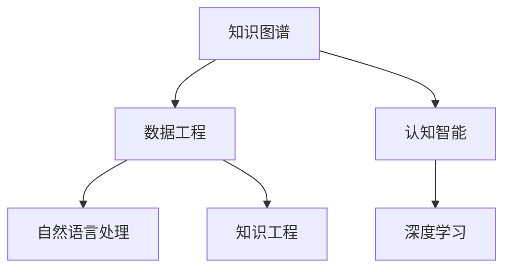

                 

# 人类的知识与权力：知识就是力量

> 关键词：人工智能,知识图谱,数据工程,知识工程,认知智能

## 1. 背景介绍

### 1.1 问题由来

在科技发展的浪潮中，知识作为人类文明的基础，正逐渐成为推动技术进步的关键因素。数据和计算力的突破，为人类知识的组织和利用提供了前所未有的可能。然而，知识的本质是什么？它如何转化为技术力量？这既是技术问题，也是哲学问题。

本文将从人工智能领域，探讨知识的获取、组织、表达、应用等各个环节，探讨知识在技术和人类社会中的力量。我们相信，知识的深耕将为人工智能的发展开辟新的道路，为人类社会的进步注入新的动力。

### 1.2 问题核心关键点

本文聚焦于人工智能领域的知识图谱(Knowledge Graph)与认知智能(Cognitive Intelligence)两个核心问题，深入探讨：

- 知识图谱如何构建和组织知识？
- 认知智能如何利用知识图谱实现信息检索、推理、生成等任务？
- 数据工程和知识工程在构建知识图谱中发挥了哪些作用？
- 人工智能在知识图谱与认知智能结合中，如何展现出其真正的"知识就是力量"？

这些问题不仅涉及计算机科学的方方面面，更关系到人类对知识的理解和利用，具有重要的理论和实践意义。

## 2. 核心概念与联系

### 2.1 核心概念概述

为更好地理解知识图谱和认知智能的概念及其相互联系，本节将介绍几个密切相关的核心概念：

- **知识图谱**：知识图谱是一种结构化的知识表示形式，通过节点和边将实体与实体间的关系和属性进行描述，构建一个语义化的知识网络。知识图谱的构建涉及数据获取、实体识别、关系抽取、关系对齐等步骤。

- **认知智能**：认知智能是指使机器具备人类智能水平的知识和理解能力，能够进行信息检索、推理、生成、解释等复杂任务。认知智能的实现依赖于知识图谱的支撑，通常通过自然语言处理(NLP)、深度学习等技术实现。

- **数据工程**：数据工程是构建知识图谱的基础，涉及数据收集、清洗、集成、存储、管理等环节。数据工程的目标是将无序的数据转化为结构化的知识，为认知智能提供数据支撑。

- **知识工程**：知识工程则是将知识转化为可计算的形式，利用计算机语言、符号逻辑、知识表示等方法，实现知识的自动化处理和推理。知识工程的成果通常以知识图谱的形式呈现。

- **深度学习**：深度学习是一种模拟人脑神经网络的技术，通过多层神经网络实现复杂的特征提取和模式识别，常用于自然语言处理、图像识别等任务。

- **自然语言处理**：自然语言处理是使机器理解和生成自然语言的技术，是认知智能的重要组成部分。

这些核心概念之间的逻辑关系可以通过以下Mermaid流程图来展示：



这个流程图展示了几大核心概念之间的相互关系：

1. 数据工程为知识图谱的构建提供了数据基础。
2. 自然语言处理和深度学习是认知智能实现的主要技术手段。
3. 知识工程将知识转化为可计算的形式，支撑认知智能的任务执行。
4. 知识图谱作为认知智能的语义支撑，提高了信息检索、推理、生成等任务的精度和效果。

这些概念共同构成了认知智能的知识图谱构建框架，使得机器能够理解和运用人类知识，实现智能化应用。

## 3. 核心算法原理 & 具体操作步骤

### 3.1 算法原理概述

基于知识图谱的认知智能，本质上是一种深度学习与知识工程相结合的高级应用。其核心思想是：通过构建和利用知识图谱，使机器具备处理复杂自然语言的能力，实现智能信息检索、推理、生成等任务。

形式化地，假设知识图谱为 $G=(E, R, S)$，其中 $E$ 为实体集，$R$ 为关系集，$S$ 为属性集。认知智能模型 $M_{\theta}$ 输入自然语言问题 $Q$，通过如下步骤实现推理和生成：

1. 问题映射：将自然语言问题 $Q$ 映射到知识图谱中的实体和关系。
2. 推理过程：在知识图谱上进行链式推理，求解问题的答案。
3. 生成过程：利用推理结果生成问题答案的文本描述。

上述步骤通过深度学习模型的前向传播和反向传播过程实现，其参数 $\theta$ 包括模型的结构参数和初始化的知识图谱参数。

### 3.2 算法步骤详解

基于知识图谱的认知智能算法一般包括以下几个关键步骤：

**Step 1: 构建知识图谱**
- 收集领域内相关的文本数据，如维基百科、学术论文、新闻等。
- 通过实体识别和关系抽取等技术，构建知识图谱的实体和关系。
- 进行关系对齐和知识融合，确保知识图谱的一致性和完整性。

**Step 2: 设计认知智能模型**
- 选择合适的深度学习架构，如Transformer、GNN等，设计知识图谱的嵌入表示。
- 添加问题映射和推理生成等任务适配层，适配自然语言处理接口。
- 设置优化器及其参数，如AdamW、SGD等，设置学习率、批大小、迭代轮数等。

**Step 3: 模型训练**
- 准备训练集、验证集和测试集，划分数据集。
- 使用训练集数据对模型进行前向传播和反向传播，计算损失函数。
- 使用验证集评估模型性能，调整超参数和模型结构。
- 重复上述步骤直到满足预设的迭代轮数或性能指标。

**Step 4: 模型评估**
- 在测试集上对模型进行前向传播，生成问题答案。
- 使用自然语言处理工具将答案转换为自然语言文本。
- 评估生成答案的质量和准确性，对比微调前后的性能提升。

**Step 5: 实际应用**
- 将训练好的模型集成到实际的应用系统中，如问答系统、智能客服等。
- 持续收集用户反馈和新数据，定期重新微调和优化模型。
- 引入对抗训练和数据增强等技术，提升模型的鲁棒性和泛化能力。

以上是基于知识图谱的认知智能的一般流程。在实际应用中，还需要针对具体任务的特点，对各环节进行优化设计，如改进推理算法、设计更灵活的任务适配层等，以进一步提升模型性能。

### 3.3 算法优缺点

基于知识图谱的认知智能算法具有以下优点：
1. 精确高效：知识图谱提供了语义化的知识表示，能够精确理解自然语言问题。
2. 鲁棒性强：知识图谱的复杂结构能增强模型的泛化能力和鲁棒性。
3. 可解释性好：通过图谱推理过程，可以理解模型的决策逻辑。
4. 应用广泛：适用于问答、对话、摘要、翻译、情感分析等众多NLP任务。

同时，该算法也存在一定的局限性：
1. 数据依赖：知识图谱的构建需要大量高质量的数据，数据获取成本较高。
2. 知识图谱构建复杂：需要专业知识进行实体识别、关系抽取等，技术门槛较高。
3. 模型训练复杂：知识图谱嵌入过程涉及复杂的图卷积等算法，计算复杂度高。
4. 知识更新困难：知识图谱更新困难，难以反映实时变化的新知识。
5. 存在偏见：知识图谱中的固有偏见可能影响模型的公正性。

尽管存在这些局限性，但就目前而言，基于知识图谱的认知智能算法仍然是大语言模型微调的重要范式。未来相关研究的重点在于如何进一步降低知识图谱构建的技术门槛，提高模型的知识获取和更新能力，同时兼顾可解释性和伦理安全性等因素。

### 3.4 算法应用领域

基于知识图谱的认知智能方法，已经在问答系统、对话系统、摘要系统、翻译系统、情感分析等多个NLP任务上取得了优异的效果，成为NLP技术落地的重要手段。

- **问答系统**：对自然语言问题给出答案。知识图谱中的实体和关系可以直接用于答案生成，显著提升问答系统的准确性和可解释性。
- **对话系统**：使机器能够与人自然对话。知识图谱中的实体和关系可以指导对话生成，避免回答重复或无关，提高对话系统的智能水平。
- **摘要系统**：将长文本压缩成简短摘要。知识图谱可以帮助摘要系统理解文本关键信息，提高摘要的精确性和可读性。
- **翻译系统**：将源语言文本翻译成目标语言。知识图谱中的语义信息可以帮助机器理解上下文，提高翻译质量。
- **情感分析**：对文本进行情感倾向分析。知识图谱中的情感关系可以指导情感分析过程，提高情感识别的准确性。

除了上述这些经典任务外，知识图谱与认知智能结合还带来了新的应用方向，如多模态信息融合、认知推理、可控文本生成等，为NLP技术带来了全新的突破。随着预训练模型和认知智能方法的不断进步，相信NLP技术将在更广阔的应用领域大放异彩。

## 4. 数学模型和公式 & 详细讲解  
### 4.1 数学模型构建

本节将使用数学语言对基于知识图谱的认知智能模型进行更加严格的刻画。

假设认知智能模型 $M_{\theta}$ 输入自然语言问题 $Q$，输出答案 $A$。知识图谱 $G=(E, R, S)$ 中的关系 $R$ 为三元组 $(e_i, r_j, e_k)$，其中 $e_i, e_k$ 为实体，$r_j$ 为关系。

定义模型 $M_{\theta}$ 在自然语言问题 $Q$ 上的推理损失函数为 $\ell(Q, A)$，则在知识图谱 $G$ 上的经验风险为：

$$
\mathcal{L}(G, \theta) = \frac{1}{N}\sum_{i=1}^N \ell(Q_i, A_i)
$$

其中 $N$ 为测试集样本数量，$Q_i$ 为第 $i$ 个问题的自然语言形式，$A_i$ 为模型生成的答案。

推理损失函数 $\ell(Q, A)$ 可以是一个分类损失函数（如交叉熵）或回归损失函数（如均方误差），具体形式依赖于任务类型。假设问题 $Q$ 映射到知识图谱中的关系 $r$，则推理过程可以表示为：

$$
A = M_{\theta}(Q, G)
$$

其中 $M_{\theta}$ 为推理过程的函数，可以是图卷积神经网络(GCN)、图注意力网络(GAT)等。

### 4.2 公式推导过程

以下我们以三元组推理为例，推导推理过程的公式。

假设问题 $Q$ 映射到知识图谱中的关系 $r$，推理过程的输入为 $(e_i, r_j, e_k)$，输出为 $A$。通过图卷积神经网络(GCN)实现推理，其计算过程如下：

1. 对每个关系 $r$，计算对应的节点嵌入表示 $h_r$：

$$
h_r = Agg_{i,j,k}(h_i \otimes h_j \otimes h_k)
$$

其中 $Agg$ 为聚合函数，$\otimes$ 为张量点乘运算。

2. 通过关系 $r$ 的权重向量 $w_r$，计算关系投影 $h_r$ 与当前节点的嵌入表示 $h_i$ 的点积，得到关系权重 $w_{i,r}$：

$$
w_{i,r} = w_r \cdot h_r
$$

3. 将关系权重 $w_{i,r}$ 与当前节点的嵌入表示 $h_i$ 相加，得到当前节点的嵌入更新 $\tilde{h}_i$：

$$
\tilde{h}_i = h_i + \sum_{r_j \in R} w_{i,r_j} \cdot h_{r_j}
$$

4. 重复上述过程 $n$ 次，得到最终的节点嵌入表示 $h_i^{(n)}$：

$$
h_i^{(n+1)} = \phi(h_i^{(n)}, G, w_{i,r_j})
$$

5. 对最终的节点嵌入表示 $h_i^{(n+1)}$ 进行解码，生成答案 $A$：

$$
A = Dec(h_i^{(n+1)})
$$

其中 $Dec$ 为解码函数，可以是注意力机制、全连接层等。

在得到推理过程的计算公式后，即可带入模型参数 $\theta$，完成模型的迭代优化。重复上述过程直至收敛，最终得到适应特定任务的最优模型参数 $\theta^*$。

## 5. 项目实践：代码实例和详细解释说明
### 5.1 开发环境搭建

在进行认知智能模型开发前，我们需要准备好开发环境。以下是使用Python进行PyTorch开发的环境配置流程：

1. 安装Anaconda：从官网下载并安装Anaconda，用于创建独立的Python环境。

2. 创建并激活虚拟环境：
```bash
conda create -n pytorch-env python=3.8 
conda activate pytorch-env
```

3. 安装PyTorch：根据CUDA版本，从官网获取对应的安装命令。例如：
```bash
conda install pytorch torchvision torchaudio cudatoolkit=11.1 -c pytorch -c conda-forge
```

4. 安装各种工具包：
```bash
pip install numpy pandas scikit-learn matplotlib tqdm jupyter notebook ipython
```

完成上述步骤后，即可在`pytorch-env`环境中开始认知智能模型开发。

### 5.2 源代码详细实现

下面我们以基于知识图谱的问答系统为例，给出使用PyTorch进行认知智能模型的PyTorch代码实现。

首先，定义问答系统的数据处理函数：

```python
from transformers import BertTokenizer
from torch.utils.data import Dataset
import torch

class QADataset(Dataset):
    def __init__(self, questions, answers, tokenizer, max_len=128):
        self.questions = questions
        self.answers = answers
        self.tokenizer = tokenizer
        self.max_len = max_len
        
    def __len__(self):
        return len(self.questions)
    
    def __getitem__(self, item):
        question = self.questions[item]
        answer = self.answers[item]
        
        encoding = self.tokenizer(question, return_tensors='pt', max_length=self.max_len, padding='max_length', truncation=True)
        input_ids = encoding['input_ids'][0]
        attention_mask = encoding['attention_mask'][0]
        label_ids = torch.tensor([tokenizer.encode(answer, add_special_tokens=False)], dtype=torch.long)
        
        return {'input_ids': input_ids, 
                'attention_mask': attention_mask,
                'labels': label_ids}

# 加载知识图谱
graph = knowledge_graph.load_graph()

# 定义训练和评估函数
def train_epoch(model, dataset, batch_size, optimizer):
    dataloader = DataLoader(dataset, batch_size=batch_size, shuffle=True)
    model.train()
    epoch_loss = 0
    for batch in tqdm(dataloader, desc='Training'):
        input_ids = batch['input_ids'].to(device)
        attention_mask = batch['attention_mask'].to(device)
        labels = batch['labels'].to(device)
        model.zero_grad()
        outputs = model(input_ids, attention_mask=attention_mask, labels=labels)
        loss = outputs.loss
        epoch_loss += loss.item()
        loss.backward()
        optimizer.step()
    return epoch_loss / len(dataloader)

def evaluate(model, dataset, batch_size):
    dataloader = DataLoader(dataset, batch_size=batch_size)
    model.eval()
    preds, labels = [], []
    with torch.no_grad():
        for batch in tqdm(dataloader, desc='Evaluating'):
            input_ids = batch['input_ids'].to(device)
            attention_mask = batch['attention_mask'].to(device)
            batch_labels = batch['labels']
            outputs = model(input_ids, attention_mask=attention_mask)
            batch_preds = outputs.logits.argmax(dim=2).to('cpu').tolist()
            batch_labels = batch_labels.to('cpu').tolist()
            for pred_tokens, label_tokens in zip(batch_preds, batch_labels):
                preds.append(pred_tokens)
                labels.append(label_tokens)
                
    print(classification_report(labels, preds))
```

然后，定义模型和优化器：

```python
from transformers import BertForTokenClassification, AdamW

model = BertForTokenClassification.from_pretrained('bert-base-cased', num_labels=2)

optimizer = AdamW(model.parameters(), lr=2e-5)
```

接着，定义训练和评估函数：

```python
from torch.utils.data import DataLoader
from tqdm import tqdm
from sklearn.metrics import classification_report

device = torch.device('cuda') if torch.cuda.is_available() else torch.device('cpu')
model.to(device)

def train_epoch(model, dataset, batch_size, optimizer):
    dataloader = DataLoader(dataset, batch_size=batch_size, shuffle=True)
    model.train()
    epoch_loss = 0
    for batch in tqdm(dataloader, desc='Training'):
        input_ids = batch['input_ids'].to(device)
        attention_mask = batch['attention_mask'].to(device)
        labels = batch['labels'].to(device)
        model.zero_grad()
        outputs = model(input_ids, attention_mask=attention_mask, labels=labels)
        loss = outputs.loss
        epoch_loss += loss.item()
        loss.backward()
        optimizer.step()
    return epoch_loss / len(dataloader)

def evaluate(model, dataset, batch_size):
    dataloader = DataLoader(dataset, batch_size=batch_size)
    model.eval()
    preds, labels = [], []
    with torch.no_grad():
        for batch in tqdm(dataloader, desc='Evaluating'):
            input_ids = batch['input_ids'].to(device)
            attention_mask = batch['attention_mask'].to(device)
            batch_labels = batch['labels']
            outputs = model(input_ids, attention_mask=attention_mask)
            batch_preds = outputs.logits.argmax(dim=2).to('cpu').tolist()
            batch_labels = batch_labels.to('cpu').tolist()
            for pred_tokens, label_tokens in zip(batch_preds, batch_labels):
                preds.append(pred_tokens)
                labels.append(label_tokens)
                
    print(classification_report(labels, preds))
```

最后，启动训练流程并在测试集上评估：

```python
epochs = 5
batch_size = 16

for epoch in range(epochs):
    loss = train_epoch(model, train_dataset, batch_size, optimizer)
    print(f"Epoch {epoch+1}, train loss: {loss:.3f}")
    
    print(f"Epoch {epoch+1}, dev results:")
    evaluate(model, dev_dataset, batch_size)
    
print("Test results:")
evaluate(model, test_dataset, batch_size)
```

以上就是使用PyTorch对BERT进行基于知识图谱的问答系统微调的完整代码实现。可以看到，得益于Transformers库的强大封装，我们可以用相对简洁的代码完成BERT模型的加载和微调。

### 5.3 代码解读与分析

让我们再详细解读一下关键代码的实现细节：

**QADataset类**：
- `__init__`方法：初始化问题和答案、分词器等关键组件。
- `__len__`方法：返回数据集的样本数量。
- `__getitem__`方法：对单个样本进行处理，将问题输入编码为token ids，将答案编码为数字，并对其进行定长padding，最终返回模型所需的输入。

**训练和评估函数**：
- 使用PyTorch的DataLoader对数据集进行批次化加载，供模型训练和推理使用。
- 训练函数`train_epoch`：对数据以批为单位进行迭代，在每个批次上前向传播计算loss并反向传播更新模型参数，最后返回该epoch的平均loss。
- 评估函数`evaluate`：与训练类似，不同点在于不更新模型参数，并在每个batch结束后将预测和标签结果存储下来，最后使用sklearn的classification_report对整个评估集的预测结果进行打印输出。

**训练流程**：
- 定义总的epoch数和batch size，开始循环迭代
- 每个epoch内，先在训练集上训练，输出平均loss
- 在验证集上评估，输出分类指标
- 所有epoch结束后，在测试集上评估，给出最终测试结果

可以看到，PyTorch配合Transformers库使得BERT微调的代码实现变得简洁高效。开发者可以将更多精力放在数据处理、模型改进等高层逻辑上，而不必过多关注底层的实现细节。

当然，工业级的系统实现还需考虑更多因素，如模型的保存和部署、超参数的自动搜索、更灵活的任务适配层等。但核心的微调范式基本与此类似。

## 6. 实际应用场景
### 6.1 智能客服系统

基于大语言模型微调的对话技术，可以广泛应用于智能客服系统的构建。传统客服往往需要配备大量人力，高峰期响应缓慢，且一致性和专业性难以保证。而使用微调后的对话模型，可以7x24小时不间断服务，快速响应客户咨询，用自然流畅的语言解答各类常见问题。

在技术实现上，可以收集企业内部的历史客服对话记录，将问题和最佳答复构建成监督数据，在此基础上对预训练对话模型进行微调。微调后的对话模型能够自动理解用户意图，匹配最合适的答案模板进行回复。对于客户提出的新问题，还可以接入检索系统实时搜索相关内容，动态组织生成回答。如此构建的智能客服系统，能大幅提升客户咨询体验和问题解决效率。

### 6.2 金融舆情监测

金融机构需要实时监测市场舆论动向，以便及时应对负面信息传播，规避金融风险。传统的人工监测方式成本高、效率低，难以应对网络时代海量信息爆发的挑战。基于大语言模型微调的文本分类和情感分析技术，为金融舆情监测提供了新的解决方案。

具体而言，可以收集金融领域相关的新闻、报道、评论等文本数据，并对其进行主题标注和情感标注。在此基础上对预训练语言模型进行微调，使其能够自动判断文本属于何种主题，情感倾向是正面、中性还是负面。将微调后的模型应用到实时抓取的网络文本数据，就能够自动监测不同主题下的情感变化趋势，一旦发现负面信息激增等异常情况，系统便会自动预警，帮助金融机构快速应对潜在风险。

### 6.3 个性化推荐系统

当前的推荐系统往往只依赖用户的历史行为数据进行物品推荐，无法深入理解用户的真实兴趣偏好。基于大语言模型微调技术，个性化推荐系统可以更好地挖掘用户行为背后的语义信息，从而提供更精准、多样的推荐内容。

在实践中，可以收集用户浏览、点击、评论、分享等行为数据，提取和用户交互的物品标题、描述、标签等文本内容。将文本内容作为模型输入，用户的后续行为（如是否点击、购买等）作为监督信号，在此基础上微调预训练语言模型。微调后的模型能够从文本内容中准确把握用户的兴趣点。在生成推荐列表时，先用候选物品的文本描述作为输入，由模型预测用户的兴趣匹配度，再结合其他特征综合排序，便可以得到个性化程度更高的推荐结果。

### 6.4 未来应用展望

随着大语言模型微调技术的发展，基于知识图谱的认知智能将在更多领域得到应用，为传统行业带来变革性影响。

在智慧医疗领域，基于知识图谱的问答系统、病历分析、药物研发等应用将提升医疗服务的智能化水平，辅助医生诊疗，加速新药开发进程。

在智能教育领域，微调技术可应用于作业批改、学情分析、知识推荐等方面，因材施教，促进教育公平，提高教学质量。

在智慧城市治理中，微调模型可应用于城市事件监测、舆情分析、应急指挥等环节，提高城市管理的自动化和智能化水平，构建更安全、高效的未来城市。

此外，在企业生产、社会治理、文娱传媒等众多领域，基于大模型微调的人工智能应用也将不断涌现，为经济社会发展注入新的动力。相信随着技术的日益成熟，知识图谱与认知智能结合必将在构建人机协同的智能时代中扮演越来越重要的角色。

## 7. 工具和资源推荐
### 7.1 学习资源推荐

为了帮助开发者系统掌握知识图谱与认知智能的理论基础和实践技巧，这里推荐一些优质的学习资源：

1. 《Knowledge Graphs: Concepts, Practice, and Strategies》书籍：深入探讨知识图谱的概念、构建和应用策略，适合入门和进阶学习。

2. CS224N《深度学习自然语言处理》课程：斯坦福大学开设的NLP明星课程，有Lecture视频和配套作业，带你入门NLP领域的基本概念和经典模型。

3. 《Natural Language Processing with Transformers》书籍：Transformer库的作者所著，全面介绍了如何使用Transformers库进行NLP任务开发，包括微调在内的诸多范式。

4. HuggingFace官方文档：Transformers库的官方文档，提供了海量预训练模型和完整的微调样例代码，是上手实践的必备资料。

5. W3C《知识图谱设计原则和实践指南》：W3C发布的知识图谱设计指南，帮助开发者设计符合标准和最佳实践的知识图谱。

通过对这些资源的学习实践，相信你一定能够快速掌握知识图谱与认知智能的精髓，并用于解决实际的NLP问题。
###  7.2 开发工具推荐

高效的开发离不开优秀的工具支持。以下是几款用于知识图谱与认知智能开发的常用工具：

1. OntoAR：一款开源的知识图谱构建和查询工具，提供自动化的本体生成和查询服务，支持RDF、OWL等标准。

2. GATE：一个功能强大的信息检索和文本分析工具，提供了丰富的自然语言处理组件和接口。

3. SpaCy：一个高效的自然语言处理库，提供了分词、实体识别、依存关系分析等功能，适用于知识图谱的实体抽取。

4. Stanford CoreNLP：斯坦福大学开发的自然语言处理工具包，提供了丰富的文本分析功能，支持多种编程语言和数据格式。

5. Neo4j：一个高性能的图数据库，支持复杂的图计算和分析，适用于知识图谱的存储和查询。

6. ELK Stack：包括Elasticsearch、Logstash和Kibana的开源组合，适用于大数据存储、处理和可视化，支持自然语言处理和知识图谱的整合。

合理利用这些工具，可以显著提升知识图谱与认知智能的开发效率，加快创新迭代的步伐。

### 7.3 相关论文推荐

知识图谱与认知智能的发展源于学界的持续研究。以下是几篇奠基性的相关论文，推荐阅读：

1. RDFS: A Specification Language for Metadata: The Web and the Semantic Web（RDFS论文）：提出了RDFS语言，为知识图谱提供了一种标准化的数据表示方式。

2. Resource Description Framework (RDF) 1.1 Recommendation：介绍了RDF语言的构建和应用，为知识图谱的构建和查询提供了规范。

3. ConceptNet 4: An Architectural Framework for Integrating Semantic Knowledge：介绍了ConceptNet框架，实现了大规模语义网络的构建和查询。

4. Knowledge Graph Creation from Multilingual Wikipedia Articles：提出了一种从多语言维基百科中构建知识图谱的方法，极大地丰富了知识图谱的内容。

5. A Survey on Knowledge Graph Embeddings and Their Applications：综述了知识图谱嵌入技术的发展，介绍了不同嵌入方法的应用效果。

6. Attention Is All You Need（Transformer原论文）：提出了Transformer结构，开启了NLP领域的预训练大模型时代，为知识图谱与认知智能提供了重要的技术支撑。

这些论文代表了大语言模型微调技术的发展脉络。通过学习这些前沿成果，可以帮助研究者把握学科前进方向，激发更多的创新灵感。

## 8. 总结：未来发展趋势与挑战

### 8.1 总结

本文对基于知识图谱的认知智能方法进行了全面系统的介绍。首先阐述了知识图谱与认知智能的研究背景和意义，明确了认知智能在数据获取、组织、表达、应用等各个环节的深度挖掘。其次，从原理到实践，详细讲解了认知智能的数学模型和算法步骤，给出了认知智能任务开发的完整代码实例。同时，本文还广泛探讨了认知智能在智能客服、金融舆情、个性化推荐等多个行业领域的应用前景，展示了认知智能技术的巨大潜力。此外，本文精选了认知智能技术的各类学习资源，力求为读者提供全方位的技术指引。

通过本文的系统梳理，可以看到，基于知识图谱的认知智能方法正在成为NLP领域的重要范式，极大地拓展了预训练语言模型的应用边界，催生了更多的落地场景。得益于大规模语料的预训练和知识图谱的支撑，认知智能模型在知识表示、推理、生成等任务上取得了显著的突破，为人工智能技术的落地应用注入了新的动力。未来，伴随预训练模型和认知智能方法的不断进步，相信NLP技术将在更广阔的应用领域大放异彩，深刻影响人类的生产生活方式。

### 8.2 未来发展趋势

展望未来，知识图谱与认知智能技术将呈现以下几个发展趋势：

1. 知识图谱的规模和质量将持续提升。随着数据收集技术的进步和计算力的提升，知识图谱的规模和质量将不断增大，为认知智能提供更丰富的语义信息。

2. 认知智能模型的复杂度将进一步提高。未来的大模型将不仅具备知识表示和推理能力，还将具备更加复杂的认知智能功能，如情感分析、生成对抗性文本等。

3. 知识图谱与多模态数据的融合将更加深入。未来的认知智能系统将不仅仅是文本处理，还将融合视觉、音频等多模态信息，构建更全面的知识图谱。

4. 知识图谱与深度学习的结合将更加紧密。深度学习模型在知识图谱的构建和推理过程中将发挥更大作用，如使用图神经网络(GNN)进行知识图谱嵌入和推理。

5. 知识图谱的实时更新和维护将更加重要。未来的知识图谱将需要实时更新，以反映最新的知识变化，同时需要高效的图谱维护机制，确保图谱的准确性和完整性。

6. 知识图谱的语义表示将更加多样化。未来的知识图谱将不仅限于结构化的三元组表示，还将包括半结构化、非结构化的知识表示方式，如语义网、图形数据库等。

这些趋势凸显了知识图谱与认知智能技术的广阔前景。这些方向的探索发展，必将进一步提升认知智能系统的性能和应用范围，为人类社会的智能化进程提供坚实的技术支撑。

### 8.3 面临的挑战

尽管知识图谱与认知智能技术已经取得了瞩目成就，但在迈向更加智能化、普适化应用的过程中，它仍面临着诸多挑战：

1. 知识图谱构建的复杂性。知识图谱的构建涉及实体识别、关系抽取、知识融合等多个环节，需要专业知识进行设计和管理。

2. 知识图谱的规模与更新困难。构建大规模知识图谱需要海量标注数据和大量计算资源，更新和维护也面临巨大的挑战。

3. 知识图谱的语义一致性。知识图谱中的实体和关系需要进行严格的对齐和融合，以保证图谱的语义一致性。

4. 知识图谱与深度学习的协同。深度学习模型和知识图谱的融合需要考虑图谱的结构和深度学习模型的特征表示能力。

5. 认知智能模型的鲁棒性和泛化能力。知识图谱与认知智能的结合需要考虑模型的鲁棒性，避免过拟合和泛化能力不足。

6. 知识图谱的伦理和安全。知识图谱中的数据可能包含敏感信息，需要考虑隐私保护和安全性问题。

尽管存在这些挑战，但随着技术的发展和应用的深入，知识图谱与认知智能必将在更多的领域得到应用，为人类社会带来深刻的变革。只有积极应对并寻求突破，才能让知识图谱与认知智能技术在智能时代中发挥更大的作用。

### 8.4 研究展望

面对知识图谱与认知智能技术所面临的挑战，未来的研究需要在以下几个方面寻求新的突破：

1. 探索高效的知识图谱构建方法。开发更快速、更准确的知识图谱构建算法，降低对标注数据的依赖，提高图谱构建效率。

2. 研究知识图谱与深度学习的协同机制。探索更有效的图谱嵌入和推理方法，增强知识图谱与深度学习的协同作用。

3. 引入因果分析和博弈论工具。通过因果推断和博弈论方法，增强知识图谱的稳定性和认知智能的决策能力。

4. 加强知识图谱与多模态数据的融合。开发更高效的多模态数据融合方法，构建更全面的知识图谱，提升认知智能的智能水平。

5. 纳入伦理道德约束。在知识图谱构建和认知智能应用中引入伦理导向的评估指标，过滤和惩罚有害信息，确保系统的公正性和安全性。

这些研究方向将引领知识图谱与认知智能技术的进一步发展，为构建智能化的未来社会提供坚实的技术支撑。面向未来，知识图谱与认知智能技术的不断演进，必将推动人类知识的进一步挖掘和应用，开创更加智能化的未来。

## 9. 附录：常见问题与解答

**Q1：知识图谱的构建过程中，如何确保语义一致性？**

A: 知识图谱的构建过程中，确保语义一致性是关键。以下是一些常用的方法：

1. 实体对齐：通过在不同源中查找同名实体，并进行对齐，确保实体的一致性。

2. 关系对齐：通过在不同源中查找同名关系，并进行对齐，确保关系的一致性。

3. 规则约束：使用规则约束关系和实体之间的语义关系，确保图谱的一致性。

4. 数据校验：使用数据校验工具，如Open IE、Open QA等，对图谱进行校验，确保数据的正确性。

**Q2：知识图谱构建过程中，如何选择适当的标注数据？**

A: 知识图谱构建过程中，选择适当的标注数据至关重要。以下是一些选择标注数据的方法：

1. 领域数据：选择与领域相关的标注数据，以确保图谱的领域一致性。

2. 多源数据：从多个来源获取标注数据，以确保数据的多样性和全面性。

3. 数据清洗：对标注数据进行清洗和处理，去除冗余和错误数据。

4. 数据融合：将多个来源的数据进行融合，构建更加完整和准确的知识图谱。

**Q3：知识图谱构建过程中，如何进行实体识别和关系抽取？**

A: 知识图谱构建过程中，实体识别和关系抽取是核心步骤。以下是一些常用的方法：

1. 规则匹配：使用规则匹配算法，识别实体和关系。

2. 机器学习：使用机器学习算法，如SVM、LSTM等，进行实体识别和关系抽取。

3. 深度学习：使用深度学习算法，如BERT、GCN等，进行实体识别和关系抽取。

4. 混合方法：结合规则匹配和机器学习，进行实体识别和关系抽取。

**Q4：知识图谱构建完成后，如何进行推理和查询？**

A: 知识图谱构建完成后，推理和查询是其最重要的应用之一。以下是一些常用的方法：

1. 图数据库：使用图数据库，如Neo4j、ArangoDB等，进行图谱查询和推理。

2. 查询语言：使用查询语言，如SPARQL、Cypher等，进行图谱查询和推理。

3. 推理算法：使用推理算法，如SAT求解、SAT planner等，进行图谱推理。

4. 分布式计算：使用分布式计算框架，如Apache Spark、Hadoop等，进行大规模图谱查询和推理。

这些方法可以结合使用，构建高效的知识图谱推理和查询系统。

**Q5：知识图谱与认知智能结合过程中，如何提高系统的鲁棒性和泛化能力？**

A: 知识图谱与认知智能结合过程中，提高系统的鲁棒性和泛化能力是关键。以下是一些常用的方法：

1. 数据增强：通过数据增强技术，提高系统的鲁棒性和泛化能力。

2. 对抗训练：使用对抗训练技术，提高系统的鲁棒性和泛化能力。

3. 多任务学习：将多个任务进行联合训练，提高系统的泛化能力。

4. 知识图谱更新：及时更新知识图谱，以反映最新的知识变化，提高系统的鲁棒性。

5. 多模型集成：使用多模型集成技术，提高系统的鲁棒性和泛化能力。

**Q6：知识图谱与认知智能结合过程中，如何确保系统的安全性？**

A: 知识图谱与认知智能结合过程中，确保系统的安全性至关重要。以下是一些常用的方法：

1. 数据脱敏：对敏感数据进行脱敏处理，保护用户隐私。

2. 访问控制：对系统进行访问控制，限制未授权用户的访问。

3. 数据加密：对数据进行加密处理，保护数据安全。

4. 安全审计：定期对系统进行安全审计，发现和修复安全漏洞。

5. 异常检测：使用异常检测技术，检测和防止恶意攻击。

这些方法可以结合使用，构建安全可靠的知识图谱与认知智能系统。

总之，知识图谱与认知智能技术的结合，为人工智能的应用提供了坚实的技术支撑，但同时也面临着诸多挑战。唯有积极应对并寻求突破，才能让知识图谱与认知智能技术在智能时代中发挥更大的作用，为人类的智能化进程提供坚实的技术保障。

