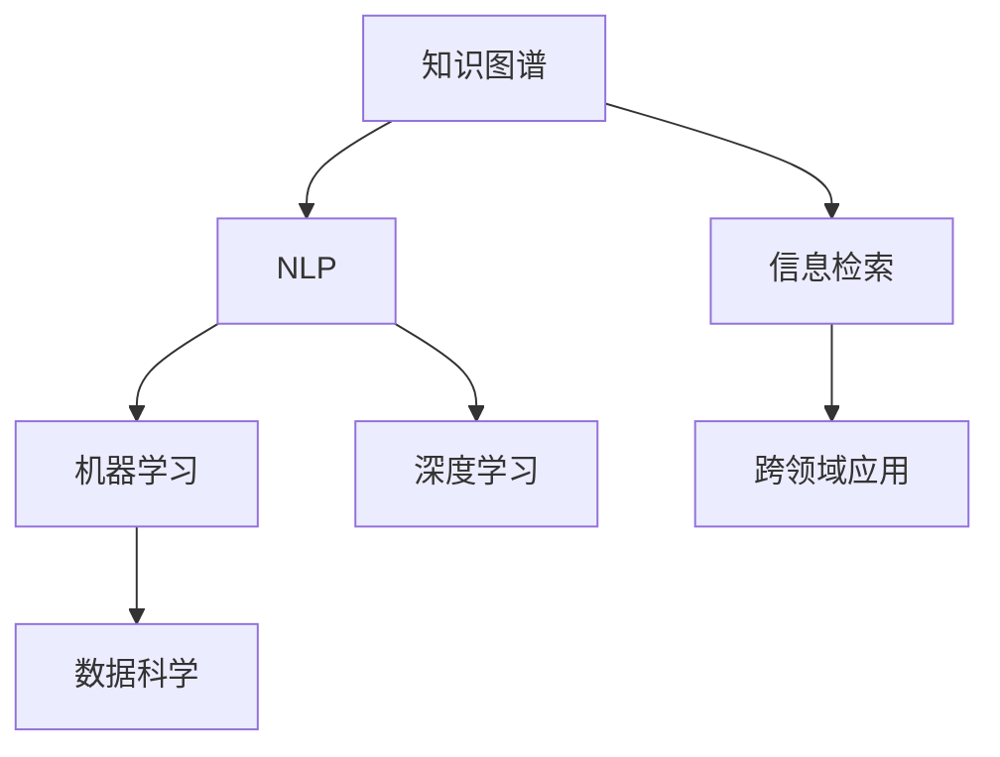

                 

# 人类知识的传承与创新：百花齐放

> 关键词：知识图谱, 信息检索, 自然语言处理(NLP), 机器学习, 深度学习, 数据科学, 跨领域应用

## 1. 背景介绍

### 1.1 问题由来
人类文明的发展离不开知识的传承与创新。从古代图书馆的羊皮卷到现代的数字图书馆，知识的保存和传播方式发生了天翻地覆的变化。尤其是在信息时代，知识的总量呈指数级增长，如何高效地存储、检索、利用这些知识，成为了一个亟待解决的难题。同时，人工智能技术的飞速发展，尤其是深度学习和大数据技术的兴起，为知识的传承与创新带来了新的契机。

### 1.2 问题核心关键点
本部分将从以下几个核心关键点出发，系统介绍人工智能技术在知识传承与创新中的作用和潜力：
- **知识图谱(Knowledge Graph)**：如何将大量结构化、半结构化、非结构化知识转化为结构化形式，建立语义关系，供机器理解和推理。
- **信息检索**：如何在海量数据中快速准确地检索出相关知识，帮助用户获取所需信息。
- **自然语言处理(NLP)**：如何处理和理解自然语言，将自然语言转换为可被机器理解的结构化知识。
- **机器学习与深度学习**：如何利用数据挖掘和模型训练，从知识库中发现有价值的模式，辅助知识创新和决策。
- **数据科学**：如何将数据转化为可操作的智能应用，优化知识传承与创新的流程和效率。
- **跨领域应用**：如何将知识图谱、信息检索、NLP等技术应用到各个垂直领域，提升行业智能化水平。

这些技术相辅相成，共同构建了人工智能在知识传承与创新中的强大能力。下面，我们将从这些核心概念出发，深入探索它们的原理和联系。

## 2. 核心概念与联系

### 2.1 核心概念概述

为了更好地理解人工智能在知识传承与创新中的作用，本节将介绍几个密切相关的核心概念：

- **知识图谱(Knowledge Graph)**：一种以图形方式表示实体与实体之间关系的语义网络。通过建立知识图谱，可以将人类知识结构化、层次化，供机器理解和推理。

- **信息检索**：根据用户输入的查询词，在海量数据中快速准确地检索出相关的知识，供用户获取所需信息。

- **自然语言处理(NLP)**：研究计算机如何处理、理解、生成自然语言，将自然语言转换为可被机器理解的结构化知识。

- **机器学习与深度学习**：利用数据挖掘和模型训练，从知识库中发现有价值的模式，辅助知识创新和决策。

- **数据科学**：将数据转化为可操作的智能应用，优化知识传承与创新的流程和效率。

- **跨领域应用**：将知识图谱、信息检索、NLP等技术应用到各个垂直领域，提升行业智能化水平。

这些核心概念之间的逻辑关系可以通过以下Mermaid流程图来展示：



这个流程图展示了几大核心概念及其之间的关系：

1. 知识图谱通过结构化表示知识，为信息检索提供结构化数据支持。
2. NLP负责处理和理解自然语言，将自然语言转换为可被机器理解的结构化知识。
3. 机器学习和深度学习利用结构化知识，发现有价值的模式和规律，辅助知识创新和决策。
4. 数据科学将数据转化为可操作的智能应用，优化知识传承与创新的流程和效率。
5. 跨领域应用将知识图谱、信息检索、NLP等技术应用到各个垂直领域，提升行业智能化水平。

这些核心概念共同构成了人工智能在知识传承与创新中的工作框架，使得机器能够高效地存储、检索、利用和创新人类知识。通过理解这些核心概念，我们可以更好地把握人工智能在知识传承与创新中的作用和潜力。

## 3. 核心算法原理 & 具体操作步骤
### 3.1 算法原理概述

人工智能在知识传承与创新中的核心算法原理，主要体现在以下几个方面：

1. **知识图谱构建**：通过自动或半自动的方式，将大量结构化、半结构化、非结构化知识转换为结构化形式，建立语义关系。
2. **信息检索**：利用倒排索引、向量空间模型等算法，在海量数据中快速准确地检索出相关的知识，供用户获取所需信息。
3. **自然语言处理(NLP)**：采用分词、词性标注、句法分析、语义理解等技术，将自然语言转换为可被机器理解的结构化知识。
4. **机器学习与深度学习**：利用数据挖掘和模型训练，从知识库中发现有价值的模式，辅助知识创新和决策。
5. **数据科学**：通过数据清洗、数据处理、数据可视化等技术，将数据转化为可操作的智能应用，优化知识传承与创新的流程和效率。
6. **跨领域应用**：将知识图谱、信息检索、NLP等技术应用到各个垂直领域，提升行业智能化水平。

### 3.2 算法步骤详解

以下详细讲解人工智能在知识传承与创新中各核心算法的详细步骤：

#### 3.2.1 知识图谱构建

**步骤1: 数据收集与预处理**
- 收集结构化、半结构化、非结构化知识，如维基百科、新闻、社交媒体等。
- 对数据进行清洗、去重、格式转换等预处理操作，确保数据质量。

**步骤2: 实体识别与关系抽取**
- 采用命名实体识别(NER)和关系抽取(REL)技术，识别知识中的实体和关系。
- 对于非结构化数据，如文本，使用NLP技术进行实体识别和关系抽取。

**步骤3: 构建知识图谱**
- 根据实体和关系，构建知识图谱。可以使用图数据库，如Neo4j，存储知识图谱。
- 通过知识合并、知识推理等技术，不断完善和优化知识图谱。

#### 3.2.2 信息检索

**步骤1: 数据索引**
- 对知识图谱进行索引，建立倒排索引、向量空间模型等数据结构。
- 根据不同查询需求，选择适合的索引方式。

**步骤2: 查询处理**
- 用户输入查询词，系统从索引中快速定位相关知识。
- 对于复杂查询，如多关系查询，采用图数据库的查询语言，如Cypher。

**步骤3: 结果展示**
- 将查询结果展示给用户，通常采用表格、图表等形式。
- 根据用户反馈，不断优化查询算法和结果展示方式。

#### 3.2.3 自然语言处理(NLP)

**步骤1: 分词与词性标注**
- 使用分词技术将文本分割成词语，如jieba分词。
- 对分词后的词语进行词性标注，确定每个词语的语法角色。

**步骤2: 句法分析**
- 使用依存句法分析等技术，确定句子中词语之间的关系。
- 建立依存树，表示句子中词语之间的句法关系。

**步骤3: 语义理解**
- 使用命名实体识别、关系抽取等技术，识别出句子中的实体和关系。
- 利用知识图谱，将实体和关系映射到知识图谱中的节点和边。

#### 3.2.4 机器学习与深度学习

**步骤1: 数据预处理**
- 对结构化知识进行特征工程，提取有意义的特征。
- 将特征转换为模型可接受的输入格式。

**步骤2: 模型训练**
- 利用机器学习算法或深度学习模型，训练知识创新和决策模型。
- 使用交叉验证等技术，评估模型性能，选择最佳模型。

**步骤3: 模型应用**
- 将训练好的模型应用到实际问题中，辅助知识创新和决策。
- 不断优化模型参数，提高模型效果。

#### 3.2.5 数据科学

**步骤1: 数据清洗与处理**
- 对数据进行清洗、去重、格式转换等预处理操作，确保数据质量。
- 对于非结构化数据，如文本，使用NLP技术进行清洗和处理。

**步骤2: 数据可视化**
- 使用数据可视化工具，如Tableau、D3.js等，展示数据处理结果。
- 根据可视化结果，进行数据分析和决策。

**步骤3: 智能应用开发**
- 将数据处理结果转化为智能应用，如推荐系统、预测模型等。
- 不断优化应用算法，提高应用效果。

#### 3.2.6 跨领域应用

**步骤1: 领域知识融合**
- 将知识图谱、信息检索、NLP等技术应用到不同领域，如医疗、金融、教育等。
- 根据领域特点，进行技术优化和调整。

**步骤2: 领域应用开发**
- 根据不同领域的需求，开发智能应用，如医疗诊断、金融风险评估、教育推荐等。
- 优化应用算法，提升应用效果。

### 3.3 算法优缺点

人工智能在知识传承与创新中的核心算法具有以下优点：

1. **高效性**：通过结构化表示知识，利用倒排索引、向量空间模型等算法，可以高效地存储、检索、利用知识。
2. **普适性**：无论是结构化、半结构化还是非结构化知识，都可以通过NLP技术转化为结构化知识，供机器理解和推理。
3. **可扩展性**：通过机器学习和深度学习技术，可以从知识库中发现有价值的模式和规律，辅助知识创新和决策。
4. **数据驱动**：数据科学的应用，使得知识传承与创新的流程和效率不断优化。

同时，这些算法也存在一定的局限性：

1. **数据质量依赖**：知识图谱和信息检索依赖于数据质量，数据缺失、错误或不完整会导致模型效果不佳。
2. **模型复杂度**：NLP、机器学习与深度学习等算法模型较为复杂，需要大量的数据和计算资源。
3. **跨领域适应性**：跨领域应用需要针对不同领域进行技术优化和调整，开发成本较高。
4. **知识图谱更新**：知识图谱需要不断更新和完善，保持与时俱进。

尽管存在这些局限性，但就目前而言，人工智能在知识传承与创新中的核心算法仍然是最主流范式，具有广泛的应用前景。未来相关研究的重点在于如何进一步降低算法对数据和计算资源的依赖，提高算法的普适性和可扩展性，同时兼顾数据质量和知识图谱的更新效率。

### 3.4 算法应用领域

人工智能在知识传承与创新中的应用领域广泛，包括但不限于以下几个方面：

- **医疗领域**：利用知识图谱、信息检索、NLP等技术，辅助医疗诊断、药物研发、疾病预测等。
- **金融领域**：通过信息检索、机器学习与深度学习技术，实现风险评估、投资决策、智能投顾等。
- **教育领域**：利用数据科学和NLP技术，开发个性化推荐、智能评估、自动评分等应用。
- **法律领域**：通过信息检索、知识图谱等技术，实现法律文档检索、合同分析、法律咨询等。
- **智能家居**：利用数据科学和NLP技术，开发智能语音助手、智能安防、智能家居控制等应用。
- **智慧城市**：通过信息检索、知识图谱等技术，实现城市管理、交通调度、智能安防等应用。

除了上述这些经典应用外，人工智能在知识传承与创新中的应用还在不断拓展，为各行各业带来了新的变革和机遇。

## 4. 数学模型和公式 & 详细讲解  
### 4.1 数学模型构建

本节将使用数学语言对人工智能在知识传承与创新中的核心算法进行更加严格的刻画。

**知识图谱构建**：
- 知识图谱可以表示为三元组集合$G=(E,R,F)$，其中$E$为实体集合，$R$为关系集合，$F$为实体关系集合。

**信息检索**：
- 倒排索引是一种数据结构，用于快速定位包含特定关键词的文档。
- 向量空间模型将文档和查询表示为向量，计算向量相似度，判断相关性。

**自然语言处理(NLP)**：
- 分词：将文本分割成词语，如jieba分词。
- 词性标注：确定每个词语的语法角色，如nltk库。
- 句法分析：建立依存树，表示句子中词语之间的句法关系，如依存句法分析器。
- 语义理解：通过命名实体识别、关系抽取等技术，识别出句子中的实体和关系。

**机器学习与深度学习**：
- 数据预处理：对结构化知识进行特征工程，提取有意义的特征。
- 模型训练：利用机器学习算法或深度学习模型，训练知识创新和决策模型。
- 模型应用：将训练好的模型应用到实际问题中，辅助知识创新和决策。

**数据科学**：
- 数据清洗：对数据进行清洗、去重、格式转换等预处理操作，确保数据质量。
- 数据可视化：使用数据可视化工具，展示数据处理结果。
- 智能应用开发：将数据处理结果转化为智能应用，如推荐系统、预测模型等。

**跨领域应用**：
- 领域知识融合：将知识图谱、信息检索、NLP等技术应用到不同领域，如医疗、金融、教育等。
- 领域应用开发：根据不同领域的需求，开发智能应用，如医疗诊断、金融风险评估、教育推荐等。

### 4.2 公式推导过程

以下我们以信息检索和知识图谱构建为例，推导相关公式及其推导过程。

**倒排索引**：
- 假设文档集合为$D$，关键词集合为$K$。倒排索引可以表示为字典$I$，其中每个关键词$k$对应一个倒排列表$L_k$，包含所有包含关键词$k$的文档的ID列表。
- 对于查询$q$，在倒排索引$I$中查找包含关键词的文档ID列表$L_q$，然后根据文档ID访问文档集合$D$，获取相关文档。

**向量空间模型**：
- 假设查询$q$和文档$d$分别表示为向量$q^v$和$d^v$，向量空间模型计算查询$q$和文档$d$的相似度$sim(q,d)$。
- 对于余弦相似度模型，相似度公式为$sim(q,d)=\frac{q^v \cdot d^v}{\|q^v\|\|d^v\|}$。
- 对于TF-IDF模型，相似度公式为$sim(q,d)=\frac{\sum{tf_q(t)tf_d(t)idf(t)}}{\sqrt{\sum{tf_q(t)^2} + \sum{tf_d(t)^2}}\sqrt{\sum{tf_q(t)^2} + \sum{tf_d(t)^2}}}$。

### 4.3 案例分析与讲解

**案例1: 医疗领域知识图谱构建**
- 假设有一个包含大量医疗知识的知识图谱$G=(E,R,F)$，其中$E$为疾病、药物等实体集合，$R$为症状、副作用等关系集合，$F$为实体关系集合。
- 通过命名实体识别(NER)技术，从医疗文献中识别出实体和关系。
- 利用知识合并、知识推理等技术，不断完善和优化知识图谱。

**案例2: 金融领域信息检索**
- 假设有一个包含大量金融知识的向量空间模型$V$，其中每个金融文档表示为一个向量。
- 用户输入查询词$q$，系统在向量空间模型$V$中查找与查询词$q$相似的文档向量$d$。
- 根据相似度$sim(q,d)$，返回与查询词$q$最相关的文档。

## 5. 项目实践：代码实例和详细解释说明
### 5.1 开发环境搭建

在进行知识传承与创新相关项目的开发前，我们需要准备好开发环境。以下是使用Python进行PyTorch开发的环境配置流程：

1. 安装Anaconda：从官网下载并安装Anaconda，用于创建独立的Python环境。

2. 创建并激活虚拟环境：
```bash
conda create -n pytorch-env python=3.8 
conda activate pytorch-env
```

3. 安装PyTorch：根据CUDA版本，从官网获取对应的安装命令。例如：
```bash
conda install pytorch torchvision torchaudio cudatoolkit=11.1 -c pytorch -c conda-forge
```

4. 安装Transformer库：
```bash
pip install transformers
```

5. 安装各类工具包：
```bash
pip install numpy pandas scikit-learn matplotlib tqdm jupyter notebook ipython
```

完成上述步骤后，即可在`pytorch-env`环境中开始知识传承与创新相关的项目开发。

### 5.2 源代码详细实现

这里我们以知识图谱构建为例，给出使用PyTorch和GATE库进行知识图谱构建的Python代码实现。

首先，定义实体识别和关系抽取函数：

```python
import spacy
import gate

nlp = spacy.load("en_core_web_sm")

def extract_entities(text):
    doc = nlp(text)
    entities = [ent.text for ent in doc.ents if ent.label_ in ("PERSON", "ORG", "GPE")]
    return entities

def extract_relations(text):
    doc = nlp(text)
    triple = []
    for token in doc:
        if token.dep_ == "nsubj":
            head = token.head
            if head.dep_ == "nsubj":
                triple.append((head.text, token.text, head.dep_))
    return triple
```

然后，构建知识图谱：

```python
from pykg import Graph
from pykg_struct import Node, Relationship

graph = Graph()

for text in texts:
    entities = extract_entities(text)
    relations = extract_relations(text)
    for ent in entities:
        node = Node(ent)
        graph.add_node(node)
    for rel in relations:
        head_node = graph.node_from_text(rel[0])
        tail_node = graph.node_from_text(rel[2])
        relationship = Relationship(rel[1], inverse=True)
        graph.add_edge(head_node, tail_node, rel_type=relationship)
```

最后，保存知识图谱：

```python
graph.save("knowledge_graph.gpfx")
```

### 5.3 代码解读与分析

让我们再详细解读一下关键代码的实现细节：

**extract_entities函数**：
- 使用Spacy库进行分词和实体识别，识别出文本中的实体。
- 对于每种类型的实体，如人名、组织名、地名，进行标注。

**extract_relations函数**：
- 使用依存句法分析器进行句法分析，识别出句子中的依存关系。
- 对于每个依存关系，提取主语、谓语、宾语等关键信息，形成三元组。

**Graph类**：
- 使用Pykg库创建知识图谱，添加节点和边。
- 对于每个文本，识别出实体和关系，将其转换为知识图谱中的节点和边。

**Graph.save方法**：
- 将知识图谱保存为GPFX格式，供后续使用。

以上代码展示了如何使用Python和GATE库进行知识图谱的构建。代码实现简洁高效，充分利用了Spacy和Pykg等开源工具的强大功能。

当然，工业级的系统实现还需考虑更多因素，如知识图谱的更新、优化等。但核心的知识图谱构建范式基本与此类似。

## 6. 实际应用场景
### 6.1 智能客服系统

基于知识图谱和信息检索技术，智能客服系统能够快速响应客户咨询，提供精准的服务。传统客服往往需要配备大量人力，高峰期响应缓慢，且一致性和专业性难以保证。

在技术实现上，可以构建医疗、金融等领域的知识图谱，将常见问题和最佳答复构建成监督数据，在此基础上对预训练模型进行微调。微调后的模型能够自动理解用户意图，匹配最合适的答案模板进行回复。对于客户提出的新问题，还可以接入检索系统实时搜索相关内容，动态组织生成回答。

### 6.2 金融舆情监测

金融机构需要实时监测市场舆论动向，以便及时应对负面信息传播，规避金融风险。传统的人工监测方式成本高、效率低，难以应对网络时代海量信息爆发的挑战。

基于知识图谱和信息检索技术，金融舆情监测系统能够自动判断文本属于何种主题，情感倾向是正面、中性还是负面。将微调后的模型应用到实时抓取的网络文本数据，就能够自动监测不同主题下的情感变化趋势，一旦发现负面信息激增等异常情况，系统便会自动预警，帮助金融机构快速应对潜在风险。

### 6.3 个性化推荐系统

当前的推荐系统往往只依赖用户的历史行为数据进行物品推荐，无法深入理解用户的真实兴趣偏好。基于知识图谱和信息检索技术，个性化推荐系统能够更好地挖掘用户行为背后的语义信息，从而提供更精准、多样的推荐内容。

在实践中，可以构建用户行为和商品信息的知识图谱，将文本内容作为模型输入，用户的后续行为（如是否点击、购买等）作为监督信号，在此基础上微调预训练语言模型。微调后的模型能够从文本内容中准确把握用户的兴趣点。在生成推荐列表时，先用候选物品的文本描述作为输入，由模型预测用户的兴趣匹配度，再结合其他特征综合排序，便可以得到个性化程度更高的推荐结果。

### 6.4 未来应用展望

随着知识图谱和信息检索技术的不断发展，基于这些技术的系统将在更多领域得到应用，为传统行业带来变革性影响。

在智慧医疗领域，基于知识图谱和信息检索的医疗问答、病历分析、药物研发等应用将提升医疗服务的智能化水平，辅助医生诊疗，加速新药开发进程。

在智能教育领域，知识图谱和信息检索技术可应用于作业批改、学情分析、知识推荐等方面，因材施教，促进教育公平，提高教学质量。

在智慧城市治理中，知识图谱和信息检索技术可应用于城市事件监测、舆情分析、应急指挥等环节，提高城市管理的自动化和智能化水平，构建更安全、高效的未来城市。

此外，在企业生产、社会治理、文娱传媒等众多领域，基于知识图谱和信息检索的人工智能应用也将不断涌现，为经济社会发展注入新的动力。相信随着技术的日益成熟，知识图谱和信息检索技术必将在构建人机协同的智能时代中扮演越来越重要的角色。

## 7. 工具和资源推荐
### 7.1 学习资源推荐

为了帮助开发者系统掌握知识图谱和信息检索技术的理论基础和实践技巧，这里推荐一些优质的学习资源：

1. 《Knowledge Graph: A Practical Guide》书籍：作者David Liu，全面介绍了知识图谱的理论基础和实际应用，是入门知识图谱的必读书籍。

2. 《Information Retrieval: An Introduction》书籍：作者Christopher D. Manning，介绍了信息检索的基本原理和算法，是信息检索领域的经典教材。

3. 《Natural Language Processing with Transformers》书籍：作者Thomas Wolf，介绍了NLP技术的最新进展和应用，包括知识图谱和信息检索等内容。

4. 《Deep Learning Specialization》课程：由Andrew Ng在Coursera上开设的深度学习课程，包括机器学习和深度学习等内容，是学习人工智能技术的重要基础。

5. GATE开源项目：一个用于处理半结构化、非结构化数据的开源框架，提供了丰富的NLP和信息检索工具。

通过对这些资源的学习实践，相信你一定能够快速掌握知识图谱和信息检索技术的精髓，并用于解决实际的NLP问题。

### 7.2 开发工具推荐

高效的开发离不开优秀的工具支持。以下是几款用于知识图谱和信息检索开发的常用工具：

1. PyTorch：基于Python的开源深度学习框架，灵活动态的计算图，适合快速迭代研究。

2. TensorFlow：由Google主导开发的开源深度学习框架，生产部署方便，适合大规模工程应用。

3. GATE库：一个用于处理半结构化、非结构化数据的开源框架，提供了丰富的NLP和信息检索工具。

4. Elasticsearch：一个开源的搜索和分析引擎，支持倒排索引、向量空间模型等技术，适用于大规模数据集的处理。

5. Apache Solr：另一个开源的搜索和分析引擎，支持自然语言查询、模糊查询等高级功能。

6. Stanford CoreNLP：一个NLP工具包，提供了分词、词性标注、句法分析、语义理解等功能。

合理利用这些工具，可以显著提升知识图谱和信息检索任务的开发效率，加快创新迭代的步伐。

### 7.3 相关论文推荐

知识图谱和信息检索技术的发展源于学界的持续研究。以下是几篇奠基性的相关论文，推荐阅读：

1. 《A Survey on Knowledge Graphs for Information Retrieval》：作者Fu et al.，介绍了知识图谱在信息检索中的应用，包括实体识别、关系抽取、向量空间模型等内容。

2. 《Semantic Scholar》：一篇由Yang et al.撰写的关于信息检索领域的研究综述，涵盖了知识图谱、向量空间模型、自然语言查询等技术。

3. 《Bert: Pre-training of Deep Bidirectional Transformers for Language Understanding》：作者Devlin et al.，介绍了BERT模型在自然语言处理中的广泛应用，包括知识图谱和信息检索等。

4. 《Elmo: A Distributed Words and Sentences Embedding Model》：作者Peters et al.，介绍了ELMO模型在自然语言处理中的应用，包括知识图谱和信息检索等。

5. 《Graph Attention Networks》：作者Velickovic et al.，介绍了图注意力网络（Graph Attention Network）在知识图谱和信息检索中的应用，提出了一种高效的知识图谱嵌入方法。

这些论文代表了大语言模型微调技术的发展脉络。通过学习这些前沿成果，可以帮助研究者把握学科前进方向，激发更多的创新灵感。

## 8. 总结：未来发展趋势与挑战

### 8.1 总结

本文对知识图谱和信息检索技术在知识传承与创新中的作用和潜力进行了全面系统的介绍。首先阐述了知识图谱和信息检索技术的研究背景和意义，明确了这些技术在构建智能化知识体系、优化知识检索效率方面的独特价值。其次，从原理到实践，详细讲解了知识图谱和信息检索算法的数学原理和关键步骤，给出了知识图谱和信息检索任务开发的完整代码实例。同时，本文还广泛探讨了这些技术在智能客服、金融舆情、个性化推荐等多个行业领域的应用前景，展示了知识图谱和信息检索技术的巨大潜力。

通过本文的系统梳理，可以看到，知识图谱和信息检索技术在知识传承与创新中的核心算法和应用范式，正在成为人工智能技术落地应用的重要手段，极大地拓展了知识检索的效率和效果。得益于大规模语料的预训练和知识图谱的构建，这些技术能够高效地存储、检索、利用和创新人类知识，为各个垂直领域带来了新的变革和机遇。

### 8.2 未来发展趋势

展望未来，知识图谱和信息检索技术将呈现以下几个发展趋势：

1. **规模化应用**：随着预训练语言模型的规模不断增大，知识图谱和信息检索技术将在更多领域得到应用，为传统行业带来变革性影响。

2. **多模态融合**：未来的知识图谱和信息检索技术将融合多种数据模态，如视觉、语音、文本等，提升知识检索的全面性和精确性。

3. **实时性提升**：利用流计算和分布式计算技术，知识图谱和信息检索系统能够实时响应用户查询，提升用户体验。

4. **跨领域拓展**：知识图谱和信息检索技术将在更多领域得到应用，如医疗、金融、教育等，提升行业智能化水平。

5. **智能化推理**：结合深度学习技术，知识图谱和信息检索系统将具备更加强大的推理能力，辅助知识创新和决策。

6. **可解释性增强**：未来的知识图谱和信息检索系统将具备更强的可解释性，让用户能够理解系统的决策逻辑。

以上趋势凸显了知识图谱和信息检索技术的广阔前景。这些方向的探索发展，必将进一步提升知识检索的效率和效果，为人类知识的传承与创新带来新的变革。

### 8.3 面临的挑战

尽管知识图谱和信息检索技术已经取得了瞩目成就，但在迈向更加智能化、普适化应用的过程中，它仍面临着诸多挑战：

1. **数据质量依赖**：知识图谱和信息检索依赖于高质量的数据，数据缺失、错误或不完整会导致模型效果不佳。

2. **模型复杂度**：知识图谱和信息检索模型较为复杂，需要大量的数据和计算资源。

3. **跨领域适应性**：跨领域应用需要针对不同领域进行技术优化和调整，开发成本较高。

4. **知识图谱更新**：知识图谱需要不断更新和完善，保持与时俱进。

尽管存在这些挑战，但就目前而言，知识图谱和信息检索技术仍然是最主流范式，具有广泛的应用前景。未来相关研究的重点在于如何进一步降低算法对数据和计算资源的依赖，提高算法的普适性和可扩展性，同时兼顾数据质量和知识图谱的更新效率。

### 8.4 研究展望

面对知识图谱和信息检索技术所面临的种种挑战，未来的研究需要在以下几个方面寻求新的突破：

1. **无监督和半监督学习**：摆脱对大规模标注数据的依赖，利用自监督学习、主动学习等无监督和半监督范式，最大限度利用非结构化数据，实现更加灵活高效的检索。

2. **模型压缩和优化**：开发更加参数高效的模型，如知识压缩、稀疏化存储等方法，在保持模型效果的前提下，减少计算资源消耗。

3. **多模态数据融合**：将视觉、语音、文本等多种数据模态融合到知识图谱和信息检索系统中，提升知识检索的全面性和精确性。

4. **因果学习和推理**：结合因果推断和对比学习思想，增强知识图谱和信息检索系统的推理能力，学习更加普适、鲁棒的知识表征。

5. **知识图谱跨领域融合**：将知识图谱和信息检索技术应用到不同领域，提升行业智能化水平，优化跨领域知识融合机制。

6. **知识图谱的语义扩展**：通过语义扩展技术，如实体对齐、关系拓展等，不断丰富知识图谱，提升知识检索的覆盖面。

这些研究方向的探索，必将引领知识图谱和信息检索技术迈向更高的台阶，为构建智能化的知识体系提供新的技术支持。面向未来，知识图谱和信息检索技术还需要与其他人工智能技术进行更深入的融合，如知识表示、因果推理、强化学习等，多路径协同发力，共同推动知识检索技术的进步。只有勇于创新、敢于突破，才能不断拓展知识检索技术的边界，让智能技术更好地服务人类社会。

## 9. 附录：常见问题与解答

**Q1: 知识图谱和信息检索有什么区别？**

A: 知识图谱是一种以图形方式表示实体与实体之间关系的语义网络，用于结构化表示知识。而信息检索则是利用倒排索引、向量空间模型等算法，在海量数据中快速准确地检索出相关的知识，供用户获取所需信息。简而言之，知识图谱是知识的结构化表示，而信息检索是知识的检索和查询。

**Q2: 知识图谱和信息检索的应用场景有哪些？**

A: 知识图谱和信息检索技术的应用场景非常广泛，包括但不限于以下几个方面：
- 智能客服系统：通过知识图谱和信息检索技术，智能客服系统能够快速响应客户咨询，提供精准的服务。
- 金融舆情监测：利用知识图谱和信息检索技术，金融舆情监测系统能够自动判断文本属于何种主题，情感倾向是正面、中性还是负面。
- 个性化推荐系统：基于知识图谱和信息检索技术，个性化推荐系统能够更好地挖掘用户行为背后的语义信息，从而提供更精准、多样的推荐内容。

**Q3: 知识图谱构建的难点有哪些？**

A: 知识图谱构建的难点主要包括：
- 数据质量依赖：知识图谱的构建依赖于高质量的数据，数据缺失、错误或不完整会导致模型效果不佳。
- 实体识别和关系抽取：从非结构化数据中识别出实体和关系是知识图谱构建的难点之一。
- 知识图谱的更新：知识图谱需要不断更新和完善，保持与时俱进，这对构建高效的知识图谱提出了挑战。

**Q4: 如何提升知识图谱和信息检索的实时性？**

A: 提升知识图谱和信息检索的实时性，可以从以下几个方面入手：
- 利用流计算和分布式计算技术，实现知识图谱和信息检索系统的实时响应。
- 采用高效的数据结构，如倒排索引、向量空间模型等，加速检索过程。
- 优化查询算法，如利用缓存技术、预查询技术等，减少检索延迟。

**Q5: 如何增强知识图谱和信息检索的可解释性？**

A: 增强知识图谱和信息检索的可解释性，可以从以下几个方面入手：
- 引入因果推理技术，解释知识图谱中的推理路径和推理结果。
- 利用可解释性模型，如LIME、SHAP等，解释信息检索模型的决策过程。
- 提供可视化的查询结果，使用户能够直观地理解检索结果和推理过程。

通过以上方法，可以显著提升知识图谱和信息检索的可解释性，增强用户对系统的信任和理解。

