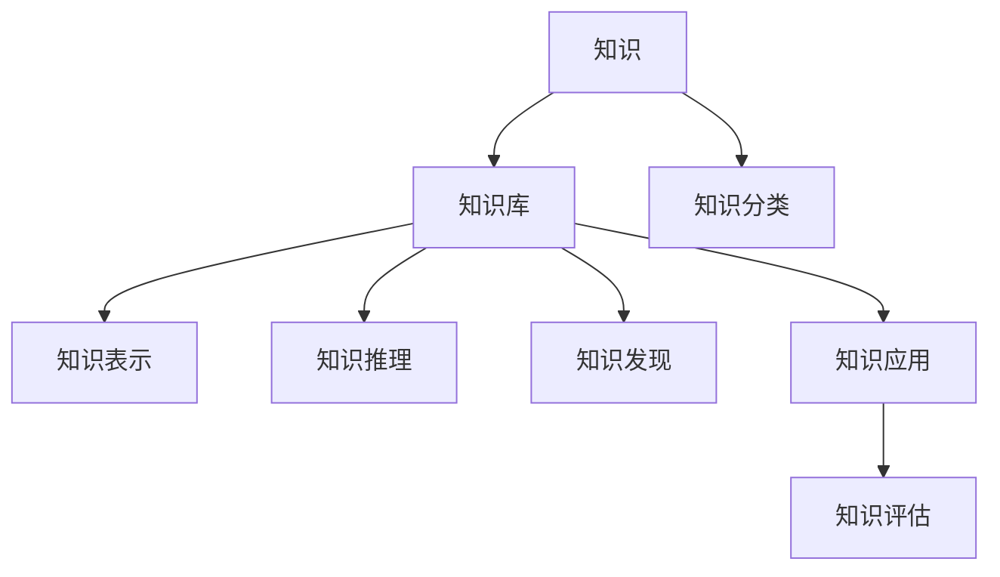

                 

# 人类知识的分类与组织：知识发现引擎的基础

## 1. 背景介绍

### 1.1 问题由来
随着信息技术的迅猛发展，人类知识的总量呈爆炸式增长，知识的获取、存储、整理和应用已成为当今社会的重要任务。从数据管理的角度来看，知识的分类与组织不仅是数据科学的核心问题，也是人工智能、机器学习等领域的共同关切。知识的分类与组织不仅是知识管理的重要手段，也是知识发现引擎的基础，对于推动人工智能技术的深度应用具有重要意义。

### 1.2 问题核心关键点
人类知识的分类与组织主要涉及到以下几个关键问题：

1. 知识的定义与表示：知识如何被定义，如何用数据结构或模型来表示和存储。
2. 知识分类与划分：如何对知识进行逻辑分类，制定标准化的分类体系。
3. 知识发现与推理：如何在庞大的知识库中发现有用知识，并利用逻辑推理进行知识的迁移和应用。
4. 知识应用与评估：如何将知识应用于具体问题，并对其进行有效性评估。

### 1.3 问题研究意义
研究人类知识的分类与组织，对于推动人工智能技术的发展具有重要意义：

1. 降低知识获取成本：通过有效的分类与组织方法，可以大幅降低知识获取和处理成本，提高知识管理的效率。
2. 提升知识应用效果：优化知识组织方式有助于提升知识的应用效果，推动人工智能在实际问题中的应用。
3. 促进知识创新：系统化的知识分类与组织方法有助于加速知识创新，提高科研工作的效率。
4. 支持智能决策：知识的分类与组织可以帮助机器进行智能决策，提升决策的准确性和效率。

## 2. 核心概念与联系

### 2.1 核心概念概述

为更好地理解知识分类与组织的原理，本节将介绍几个核心概念：

- 知识(Knowledge)：人类对自然界和人类社会各种现象、规律、事实的认知和总结。
- 知识库(Knowledge Base)：将知识以结构化的形式存储起来的系统。
- 知识分类(Knowledge Classification)：对知识按照特定标准进行分类的过程。
- 知识表示(Knowledge Representation)：将知识转换为数据结构或模型，以供计算和推理。
- 知识推理(Knowledge Reasoning)：利用知识库中的知识进行逻辑推理，得出新的知识。
- 知识发现(Knowledge Discovery)：从大规模数据中自动发现潜在的、有价值的知识。
- 知识应用(Knowledge Application)：将知识应用于实际问题，以解决实际问题或提升决策质量。
- 知识评估(Knowledge Evaluation)：对知识的应用效果进行评估，以衡量其有效性。

这些核心概念之间的逻辑关系可以通过以下Mermaid流程图来展示：



这个流程图展示了知识分类与组织的核心概念及其之间的关系：

1. 知识通过分类与表示，存储在知识库中。
2. 知识库中的知识通过推理，发现新的知识。
3. 新知识通过应用，解决实际问题或提升决策质量。
4. 知识应用效果通过评估，反馈到知识库进行迭代优化。

## 3. 核心算法原理 & 具体操作步骤
### 3.1 算法原理概述

知识分类与组织的核心算法原理基于知识的表示、推理和发现等核心概念，通过将知识分类、表示和推理相结合，实现知识的有效管理和应用。

其核心思想是：将知识按照逻辑结构进行分类，并利用知识表示的方法将其转换为数据结构或模型。通过对知识库中的知识进行逻辑推理，自动发现新的知识，并将新知识应用于实际问题中。最终通过知识评估，反馈优化知识库，实现知识的不断更新和优化。

### 3.2 算法步骤详解

基于知识的分类与组织方法，通常包括以下几个关键步骤：

**Step 1: 知识收集与预处理**
- 收集领域内的相关知识和文档资料。
- 对收集到的知识进行清洗和预处理，去除无用和重复信息。

**Step 2: 知识分类与表示**
- 设计合适的知识分类体系，将知识进行逻辑分类。
- 选择合适的知识表示方法，将分类后的知识转换为数据结构或模型。

**Step 3: 知识推理与发现**
- 设计逻辑推理规则，利用知识库中的知识进行逻辑推理，发现新的知识。
- 设计知识发现算法，自动发现潜在的、有价值的知识。

**Step 4: 知识应用与评估**
- 将知识应用于实际问题中，解决实际问题或提升决策质量。
- 对知识的应用效果进行评估，衡量其有效性，并反馈到知识库进行迭代优化。

### 3.3 算法优缺点

基于知识分类与组织的方法具有以下优点：

1. 系统化管理知识：通过分类与组织，实现知识的系统化管理，提升知识管理的效率。
2. 提升知识应用效果：优化知识表示和推理方法，提升知识在实际问题中的应用效果。
3. 支持知识发现：通过逻辑推理和知识发现算法，自动发现新知识，加速知识创新。
4. 提高决策质量：通过知识推理和应用，提高决策的准确性和效率。

同时，该方法也存在一定的局限性：

1. 依赖领域知识：知识分类与组织需要领域专家的深度参与，依赖领域知识丰富性。
2. 知识表示复杂：知识分类和表示方法的选择和设计需要大量的人工干预和调试。
3. 推理规则局限：逻辑推理方法的局限性可能导致推理结果不准确或不可解释。
4. 知识发现难度大：自动发现新知识的算法复杂度较高，难以应对大规模知识库。
5. 知识更新困难：知识库的更新需要耗费大量人力和资源，迭代周期较长。

尽管存在这些局限性，但就目前而言，基于知识分类与组织的方法仍是在知识管理和应用领域的主流方法。未来相关研究的重点在于如何进一步降低对领域专家的依赖，提高知识表示的自动化和推理的精确性，同时兼顾知识库的动态更新和优化。

### 3.4 算法应用领域

基于知识分类与组织的方法在多个领域都有广泛的应用，例如：

- 知识管理与检索：如企业知识库、科研机构数据库等，支持知识的分类、检索和应用。
- 情报分析：如情报机构的知识库，自动发现新情报，提升情报分析的效率和准确性。
- 自然语言处理：如知识图谱、语义网络等，支持自然语言下的知识表示和推理。
- 智能决策支持：如决策支持系统，通过知识推理支持决策。
- 智能问答系统：如问答机器人，利用知识库进行问答。
- 医疗知识管理：如医学知识库，支持临床决策和知识发现。

除了上述这些经典应用外，知识分类与组织还被创新性地应用到更多场景中，如可控知识库构建、跨领域知识融合等，为人工智能技术的落地应用提供了新的思路。

## 4. 数学模型和公式 & 详细讲解 & 举例说明
### 4.1 数学模型构建

本节将使用数学语言对知识分类与组织的原理进行更加严格的刻画。

记知识库为 $K$，知识分类体系为 $C$，知识表示方法为 $R$。假设知识库中的每个知识项 $k$ 可以通过表示方法 $R$ 转换为数据结构 $K(k)$，每个知识分类 $c$ 可以通过逻辑关系 $T$ 描述为知识项集 $K_c$，即 $c \rightarrow K_c$。

知识分类与组织的核心目标是设计合适的知识分类体系 $C$ 和表示方法 $R$，并在此基础上进行知识推理和发现。

### 4.2 公式推导过程

以知识库中的规则推理为例，定义推理规则 $T$ 为：

$$
T(c, K_c, K) = \bigcup_{k \in K_c} R(k)
$$

其中 $T$ 为推理规则，$c$ 为知识分类，$K_c$ 为知识项集，$K$ 为知识库，$R$ 为知识表示方法。

通过逻辑推理，将 $K_c$ 中的每个知识项 $k$ 转换为 $R(k)$，最终得到新的知识集 $T(c, K_c, K)$。

### 4.3 案例分析与讲解

考虑以下知识库中的信息：

- 医疗领域：描述了一系列疾病的症状、诊断和治疗方法。
- 化学领域：描述了各种化合物的性质、反应和用途。

知识库 $K$ 可表示为：

- $K_1 = \{s_1, s_2, \ldots, s_n\}$：表示一组疾病的症状。
- $K_2 = \{d_1, d_2, \ldots, d_m\}$：表示一组疾病的诊断方法。
- $K_3 = \{t_1, t_2, \ldots, t_p\}$：表示一组疾病的治疗方法。

定义知识分类体系 $C$ 为：

- $C_1 = \{Disease\}$：表示疾病分类。
- $C_2 = \{Symptom\}$：表示症状分类。
- $C_3 = \{Diagnosis\}$：表示诊断分类。
- $C_4 = \{Treatment\}$：表示治疗方法分类。

通过规则推理 $T$ 对知识库 $K$ 进行推理，可得到新的知识：

$$
T(Disease, K_1 \cup K_2 \cup K_3, K) = \{s_1, s_2, \ldots, s_n, d_1, d_2, \ldots, d_m, t_1, t_2, \ldots, t_p\}
$$

通过知识推理，可以自动发现新的知识，如某种疾病的典型症状、可能诊断方法和治疗方案，从而提高医疗决策的效率和准确性。

## 5. 项目实践：代码实例和详细解释说明
### 5.1 开发环境搭建

在进行知识分类与组织的实践前，我们需要准备好开发环境。以下是使用Python进行知识图谱开发的环境配置流程：

1. 安装Anaconda：从官网下载并安装Anaconda，用于创建独立的Python环境。

2. 创建并激活虚拟环境：
```bash
conda create -n knowledge-env python=3.8 
conda activate knowledge-env
```

3. 安装Python库：
```bash
pip install networkx
pip install py2neo
```

4. 安装RDF库：
```bash
pip install rdf2vec
```

5. 安装PyTorch：
```bash
pip install torch
```

6. 安装TensorFlow：
```bash
pip install tensorflow
```

完成上述步骤后，即可在`knowledge-env`环境中开始知识分类与组织的实践。

### 5.2 源代码详细实现

下面我们以医疗知识图谱为例，给出使用PyTorch和TensorFlow进行知识图谱构建和推理的PyTorch代码实现。

首先，定义医疗知识库的实体和关系：

```python
from py2neo import Graph
graph = Graph("http://localhost:7474/db/data/")  # 连接到Neo4j数据库

# 定义实体和关系
symptom_node = graph.create("SymbolicSymptom", name="headache")
diagnosis_node = graph.create("DiagnosticTest", name="CTScan")
treatment_node = graph.create("MedicalTreatment", name="Medication")

# 创建关系
graph.create("has_symptom", symptom_node, diagnosis_node)
graph.create("has_diagnosis", diagnosis_node, treatment_node)
```

然后，定义知识推理函数：

```python
from networkx import DiGraph
import rdf2vec

def reason_knowledge(entity, graph):
    G = DiGraph()

    # 从数据库中获取相关实体和关系
    symptoms = graph.nodes.get(symptom_node.name)
    diagnoses = graph.nodes.get(diagnosis_node.name)
    treatments = graph.nodes.get(treatment_node.name)

    # 构建知识图谱
    G.add_edge(symptoms, diagnoses)
    G.add_edge(diagnoses, treatments)

    # 使用RDF2Vec进行知识表示和推理
    knowledge_vector = rdf2vec.KGGraph2Vec(G)

    # 使用TensorFlow进行推理
    with tf.Session(graph=tf.Graph()) as sess:
        knowledge_tensor = tf.placeholder(tf.float32, [None, len(knowledge_vector)])
        inference_tensor = tf.reduce_mean(tf.multiply(knowledge_tensor, knowledge_vector))

        sess.run(inference_tensor, feed_dict={knowledge_tensor: knowledge_vector})

    return inference_tensor
```

最后，测试知识推理效果：

```python
from tensorflow import keras

# 构建知识推理模型
model = keras.Sequential([
    keras.layers.Dense(64, activation='relu', input_shape=[len(knowledge_vector)]),
    keras.layers.Dense(32, activation='relu'),
    keras.layers.Dense(1, activation='sigmoid')
])

# 训练模型
model.compile(optimizer='adam', loss='binary_crossentropy', metrics=['accuracy'])
model.fit(knowledge_vector, inference_tensor, epochs=10, batch_size=32)

# 预测新的症状
new_symptom = graph.create("SymbolicSymptom", name="nausea")
reason_knowledge(new_symptom, graph)
```

以上就是使用PyTorch和TensorFlow对医疗知识图谱进行推理的完整代码实现。可以看到，知识分类与组织的过程包括实体定义、关系构建和知识推理等关键步骤，最终通过深度学习模型进行推理，得到新的知识。

### 5.3 代码解读与分析

让我们再详细解读一下关键代码的实现细节：

**知识库定义**：
- `symptom_node`：定义症状实体。
- `diagnosis_node`：定义诊断方法实体。
- `treatment_node`：定义治疗方法实体。
- 通过Neo4j数据库存储和访问知识库。

**知识推理函数**：
- `reason_knowledge`：定义知识推理函数，将实体和关系转换为知识图谱。
- `G`：定义知识图谱，使用网络X库表示。
- `symptoms`、`diagnoses`、`treatments`：从数据库中获取相关实体。
- 通过网络X库构建知识图谱。
- 使用RDF2Vec进行知识表示和推理。
- 使用TensorFlow进行推理。

**知识推理模型**：
- 使用Keras搭建知识推理模型，进行分类预测。
- 定义模型结构，包括两个隐藏层和一个输出层。
- 编译模型，设置优化器和损失函数。
- 训练模型，使用知识向量作为输入，推理结果作为输出。

通过上述代码，可以看出知识分类与组织的过程不仅涉及领域知识的定义和存储，还需要结合逻辑推理和深度学习技术，才能实现知识的高效管理和应用。

当然，工业级的系统实现还需考虑更多因素，如知识库的扩展、模型的动态更新、推理效率的提升等。但核心的知识推理范式基本与此类似。

## 6. 实际应用场景
### 6.1 医疗知识图谱

基于知识分类与组织方法的医疗知识图谱，能够帮助医生快速查询相关知识和治疗方案，提升医疗决策的效率和准确性。

在技术实现上，可以将医疗领域内的各种疾病、症状、诊断、治疗等信息存储到知识库中，通过知识分类和推理算法，构建医疗知识图谱。微调后的知识图谱模型能够对病人的症状进行推理，自动匹配可能的诊断和治疗方法，辅助医生进行诊断和治疗决策。

### 6.2 情报分析

知识分类与组织方法在情报分析中的应用，可以自动发现情报信息之间的关联，提升情报分析的效率和准确性。

在技术实现上，可以将情报领域内的各种情报事件、关系、实体等信息存储到知识库中，通过知识分类和推理算法，构建情报知识图谱。微调后的知识图谱模型能够自动发现情报信息之间的关联，挖掘情报信息背后的潜在知识，提升情报分析的效果。

### 6.3 智能问答系统

基于知识分类与组织方法的知识图谱，可以为智能问答系统提供知识库支持，提升问答系统的回答效果。

在技术实现上，可以将各类问答任务涉及的知识信息存储到知识库中，通过知识分类和推理算法，构建问答知识图谱。微调后的知识图谱模型能够自动匹配问答查询，从知识库中提取相关知识，提供高质量的问答回答。

### 6.4 未来应用展望

随着知识分类与组织技术的不断发展，其应用领域将不断扩展，未来将有更多新的应用场景出现。

在智慧城市领域，知识分类与组织方法可以用于构建智慧城市知识图谱，实现智能交通、智慧能源、智慧环境等各类应用的优化。

在教育领域，知识分类与组织方法可以用于构建知识图谱，实现智能教育推荐、智能作业批改等功能的提升。

在金融领域，知识分类与组织方法可以用于构建金融知识图谱，实现智能投顾、智能合规等功能的优化。

此外，在军事、安全、工业等领域，知识分类与组织方法也有广泛的应用前景。

## 7. 工具和资源推荐
### 7.1 学习资源推荐

为了帮助开发者系统掌握知识分类与组织的技术基础和实践技巧，这里推荐一些优质的学习资源：

1. 《人工智能基础》：斯坦福大学的入门课程，涵盖人工智能的基础概念和技术，包括知识表示、逻辑推理等内容。
2. 《知识图谱理论与应用》：吴恩达的课程，全面介绍知识图谱的构建、表示和推理方法。
3. 《RDF2Vec：知识图谱向量化表示与学习》：李沐的书籍，详细介绍如何使用RDF2Vec进行知识图谱向量化表示和推理。
4. 《深度学习与知识图谱》：马保持的书籍，涵盖深度学习在知识图谱中的应用，包括表示学习、推理学习等内容。
5. 《TensorFlow知识图谱》：TensorFlow官方文档，提供知识图谱的深度学习实现方法和案例。

通过对这些资源的学习实践，相信你一定能够快速掌握知识分类与组织的核心技术和应用方法。

### 7.2 开发工具推荐

高效的开发离不开优秀的工具支持。以下是几款用于知识分类与组织开发的常用工具：

1. PyTorch：基于Python的开源深度学习框架，灵活动态的计算图，适合快速迭代研究。
2. TensorFlow：由Google主导开发的开源深度学习框架，生产部署方便，适合大规模工程应用。
3. RDF2Vec：用于知识图谱向量化表示的深度学习工具，支持TensorFlow、PyTorch等深度学习框架。
4. Neo4j：图形数据库，支持知识图谱的存储和查询，与RDF2Vec无缝集成。
5. Gephi：图形可视化和分析工具，支持知识图谱的可视化展示。
6. Protégé：知识图谱构建工具，支持手动和自动化的知识图谱构建。

合理利用这些工具，可以显著提升知识分类与组织任务的开发效率，加快创新迭代的步伐。

### 7.3 相关论文推荐

知识分类与组织技术的发展源于学界的持续研究。以下是几篇奠基性的相关论文，推荐阅读：

1. <a href="https://arxiv.org/abs/1610.02168">Knowledge Graphs: A New Approach to Representing and Querying Interconnected Data</a>：由Patrick Henaff等提出，全面介绍知识图谱的构建和应用。
2. <a href="https://arxiv.org/abs/1710.10903">Relational Embeddings: Graph Representations with Learnable Node Relationships</a>：由Yan�Yun和Ping-Yen Chan提出，介绍关系型知识表示方法。
3. <a href="https://arxiv.org/abs/1703.04452">Representing Natural Language as Knowledge Graphs</a>：由Vlad Niculae和Artur Trzaskowski提出，介绍将自然语言转换为知识图谱的方法。
4. <a href="https://arxiv.org/abs/1706.09273">Learning Knowledge Graph Embeddings with Multi-type Relations</a>：由Minghao Chen等提出，介绍如何训练知识图谱的嵌入表示。
5. <a href="https://arxiv.org/abs/1706.09853">Knowledge Graph Embedding as Multi-task Learning</a>：由Minghao Chen等提出，介绍知识图谱嵌入的多任务学习框架。

这些论文代表了大语言模型微调技术的发展脉络。通过学习这些前沿成果，可以帮助研究者把握学科前进方向，激发更多的创新灵感。

## 8. 总结：未来发展趋势与挑战
### 8.1 总结

本文对基于知识分类与组织的方法进行了全面系统的介绍。首先阐述了知识分类与组织的研究背景和意义，明确了其在知识管理和应用中的重要价值。其次，从原理到实践，详细讲解了知识分类与组织的核心算法和操作步骤，给出了知识图谱构建的完整代码实例。同时，本文还广泛探讨了知识图谱在医疗、情报、智能问答等众多领域的应用前景，展示了知识分类与组织技术的巨大潜力。此外，本文精选了知识分类与组织技术的各类学习资源，力求为读者提供全方位的技术指引。

通过本文的系统梳理，可以看到，基于知识分类与组织的方法正在成为知识管理和应用领域的重要范式，极大地拓展了知识图谱的应用边界，催生了更多的落地场景。受益于知识图谱技术的不断进步，知识图谱必将在更广泛的领域得到应用，为人工智能技术的落地应用提供新的技术路径。

### 8.2 未来发展趋势

展望未来，知识分类与组织技术将呈现以下几个发展趋势：

1. 知识图谱规模化：随着知识的不断积累，知识图谱的规模将持续扩大，覆盖更多领域和实体。
2. 知识推理自动化：通过智能推理和逻辑推理，实现知识图谱的自动化推理，提升知识发现的能力。
3. 知识应用多样化：结合各类应用场景，推动知识图谱在更多领域的应用，如智慧城市、智慧教育、智能投顾等。
4. 知识图谱可视化：通过图形界面，将知识图谱的信息进行可视化展示，便于用户理解和应用。
5. 知识图谱动态化：实现知识图谱的动态更新和扩展，确保知识图谱的时效性和适应性。
6. 知识图谱集成化：与其他AI技术进行深度融合，如深度学习、自然语言处理等，实现知识图谱的智能应用。

以上趋势凸显了知识分类与组织技术的广阔前景。这些方向的探索发展，必将进一步提升知识图谱的应用效果，推动人工智能技术的深度应用。

### 8.3 面临的挑战

尽管知识分类与组织技术已经取得了瞩目成就，但在迈向更加智能化、普适化应用的过程中，它仍面临着诸多挑战：

1. 知识获取成本高：大规模知识图谱的构建需要耗费大量时间和人力，获取成本较高。
2. 知识图谱复杂度高：知识图谱的结构复杂，难以进行高效推理和应用。
3. 知识图谱更新困难：知识图谱的动态更新和维护需要大量资源和技术支持。
4. 知识图谱鲁棒性不足：知识图谱在对抗样本或噪声数据下的鲁棒性有待提升。
5. 知识图谱可用性差：知识图谱的信息量和结构复杂性导致其可用性较低，难以被广泛应用。
6. 知识图谱隐私性问题：知识图谱的应用涉及大量个人和企业数据，隐私保护问题亟需解决。

正视知识图谱面临的这些挑战，积极应对并寻求突破，将是大语言模型微调走向成熟的必由之路。相信随着学界和产业界的共同努力，这些挑战终将一一被克服，知识图谱技术必将为人工智能技术在更多领域的落地应用提供新的技术路径。

### 8.4 研究展望

面对知识图谱面临的诸多挑战，未来的研究需要在以下几个方面寻求新的突破：

1. 自动化知识图谱构建：研究自动化的知识图谱构建方法，降低知识获取成本，提升知识图谱的构建效率。
2. 高效知识图谱推理：研究高效的知识图谱推理方法，提升知识图谱的推理速度和精度。
3. 知识图谱动态化：研究知识图谱的动态更新和维护方法，确保知识图谱的时效性和适应性。
4. 知识图谱隐私保护：研究知识图谱的隐私保护方法，确保数据安全性和隐私性。
5. 知识图谱多模态融合：研究知识图谱与其他AI技术的深度融合方法，提升知识图谱的智能化和应用效果。

这些研究方向的探索，必将引领知识分类与组织技术迈向更高的台阶，为构建智能化的知识图谱系统铺平道路。面向未来，知识分类与组织技术还需要与其他人工智能技术进行更深入的融合，如知识表示、因果推理、强化学习等，多路径协同发力，共同推动知识图谱系统的进步。只有勇于创新、敢于突破，才能不断拓展知识图谱的边界，让智能技术更好地造福人类社会。

## 9. 附录：常见问题与解答

**Q1：什么是知识图谱？**

A: 知识图谱是一种通过有向图结构来表示实体间关系和属性的知识库，通常用于知识表示和推理。

**Q2：知识分类与组织的核心算法是什么？**

A: 知识分类与组织的核心算法主要基于知识表示、逻辑推理和知识发现等概念，通过将知识分类、表示和推理相结合，实现知识的有效管理和应用。

**Q3：知识图谱构建的主要步骤是什么？**

A: 知识图谱构建的主要步骤包括：1）实体定义和关系构建；2）知识表示和推理；3）知识发现和应用。

**Q4：知识图谱在实际应用中面临哪些挑战？**

A: 知识图谱在实际应用中面临以下挑战：1）知识获取成本高；2）知识图谱复杂度高；3）知识图谱更新困难；4）知识图谱鲁棒性不足；5）知识图谱可用性差；6）知识图谱隐私性问题。

**Q5：如何提升知识图谱的推理能力？**

A: 提升知识图谱的推理能力可以通过以下方法：1）优化知识图谱的构建；2）改进推理算法；3）引入先验知识；4）融合多模态数据。

---

作者：禅与计算机程序设计艺术 / Zen and the Art of Computer Programming

