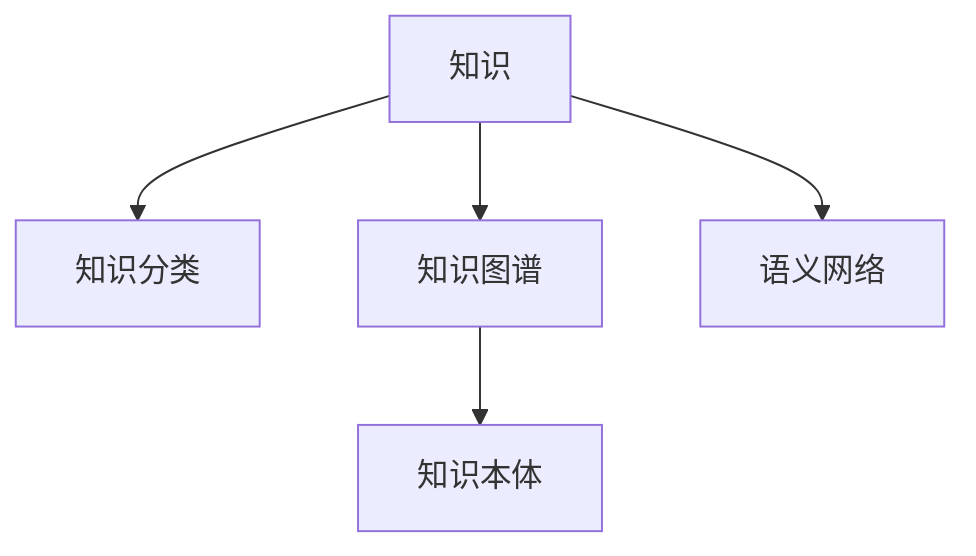

                 

# 人类知识的分类：秩序之美与应用

## 1. 背景介绍

### 1.1 问题由来
知识是人类认识世界和改造世界的基础，贯穿了人类的发展历程。古往今来，人们一直在不断地探索知识的本质和分类方法，希望能从中获取更多的智慧和启示。但直到今天，这一领域仍然充满挑战。知识分类不仅仅是一项学术研究，更是技术实践中亟待解决的难题。本文将从知识的本质出发，探讨人类知识的分类原则和方法，并结合实际应用场景，分析其在人工智能、自然语言处理等领域的重要性和实践意义。

### 1.2 问题核心关键点
知识分类问题主要包含以下核心关键点：
1. **知识本质**：知识是什么，有哪些基本形式和特征？
2. **分类原则**：如何从宏观角度对知识进行合理分类？
3. **应用场景**：知识分类在具体技术场景中的应用案例。
4. **未来展望**：知识分类的未来发展趋势和面临的挑战。

## 2. 核心概念与联系

### 2.1 核心概念概述

为了更好地理解人类知识分类的核心概念，我们将详细介绍以下几个关键概念：

- **知识(Knowledge)**：指人类对世界及其规律的理解和掌握，涵盖事实、理论、经验、技能等多方面内容。
- **知识分类(Knowledge Classification)**：指将知识按照一定规则和标准划分为不同类别和层级的过程。
- **知识图谱(Knowledge Graph)**：一种用于表示知识实体及其关系的图形结构，支持高效的查询和推理。
- **知识本体(Knowledge Ontology)**：形式化描述知识分类结构的概念模型，用于统一和规范知识的表达。
- **语义网络(Semantic Network)**：一种基于知识的图结构，用于表示概念之间的语义关系。

### 2.2 核心概念原理和架构的 Mermaid 流程图(Mermaid 流程节点中不要有括号、逗号等特殊字符)


这个流程图展示了知识分类与知识图谱、知识本体、语义网络之间的联系：

- 知识是各类知识分类的基础。
- 知识分类是构建知识图谱、知识本体和语义网络的基础。
- 知识图谱、知识本体和语义网络是知识分类的实现形式。

## 3. 核心算法原理 & 具体操作步骤

### 3.1 算法原理概述

知识分类的核心算法基于图论和语义分析，其基本思想是将知识表示为图结构，并通过计算图中的路径和节点关系，实现知识的分类和推理。

具体而言，知识分类算法主要包括以下几个步骤：
1. 将知识实体和概念表示为图节点，通过关系表示为图边。
2. 根据知识实体的特征和属性，定义不同的分类节点。
3. 通过计算节点之间的距离和关系强度，确定分类节点的层级结构。
4. 利用聚类、排序等算法，将节点分配到不同的分类节点。
5. 根据分类结果，构建知识图谱、知识本体和语义网络。

### 3.2 算法步骤详解

#### 3.2.1 知识表示与节点构建

知识分类的第一步是将知识实体和概念表示为图节点，通过关系表示为图边。具体步骤如下：

1. **实体抽取**：从文本、数据等来源中提取知识实体，如人名、地名、组织机构等。
2. **属性标注**：为每个知识实体标注属性，如时间、地点、类别等。
3. **关系构建**：定义实体之间的关系，如父子关系、同义关系、共现关系等。
4. **节点构建**：将实体和属性表示为节点，将关系表示为边，构建知识图谱的节点集合。

#### 3.2.2 节点分类与关系计算

在知识节点构建完成后，需要通过计算节点之间的距离和关系强度，确定分类节点的层级结构。具体步骤如下：

1. **距离计算**：使用图论中的最短路径算法（如Dijkstra算法）计算节点之间的距离，反映知识实体的相似度。
2. **关系计算**：使用节点之间的关系强度（如关系权重、优先级等）计算节点之间的关联度。
3. **聚类排序**：使用聚类算法（如K-means、DBSCAN等）对节点进行聚类排序，构建分类节点结构。
4. **节点分配**：将节点分配到不同的分类节点，确定节点层级。

#### 3.2.3 分类节点构建与知识图谱生成

在确定分类节点结构后，可以通过构建知识图谱、知识本体和语义网络，实现知识分类的目标。具体步骤如下：

1. **分类节点构建**：根据节点层级，将节点分配到不同的分类节点。
2. **知识本体构建**：定义分类节点的属性和关系，构建知识本体的分类结构。
3. **语义网络生成**：将分类节点和关系组合为语义网络，支持高效的查询和推理。

### 3.3 算法优缺点

知识分类算法具有以下优点：
1. **结构清晰**：通过图论结构表示知识，直观地反映了知识实体和概念之间的关系。
2. **可扩展性强**：可以通过添加新节点和新边，不断扩展知识图谱和本体。
3. **应用广泛**：在知识管理、语义搜索、智能问答等领域有广泛应用。

同时，该算法也存在一些缺点：
1. **计算复杂度高**：构建和维护知识图谱的过程较为复杂，计算开销较大。
2. **精度有待提高**：实体抽取、关系构建等步骤可能存在误差，影响分类结果的准确性。
3. **依赖数据质量**：知识图谱的质量依赖于数据来源和标注的准确性，数据质量不高会导致分类错误。
4. **无法处理动态变化**：知识分类模型一旦建立，难以动态更新和维护，无法应对快速变化的知识环境。

### 3.4 算法应用领域

知识分类算法在多个领域中具有重要的应用价值：

1. **知识管理**：将企业知识分类组织，便于查询和利用，提升知识管理效率。
2. **语义搜索**：通过知识分类构建语义网络，实现高效的知识搜索和推荐。
3. **智能问答**：将知识分类应用于问答系统，提升系统理解和回答问题的能力。
4. **医疗诊断**：将医学知识分类构建知识图谱，辅助医生进行诊断和治疗。
5. **金融分析**：将金融知识分类构建知识本体，支持高效的金融分析和决策。

## 4. 数学模型和公式 & 详细讲解 & 举例说明（备注：数学公式请使用latex格式，latex嵌入文中独立段落使用 $$，段落内使用 $)
### 4.1 数学模型构建

知识分类模型主要基于图论和语义分析，因此我们可以使用图论中的一些经典模型来描述知识分类过程。这里我们选择使用PageRank算法，构建知识分类模型。

PageRank算法是一种用于计算网页重要性的图算法，它可以用来评估知识节点的重要性和分类层级。模型定义如下：

设$G=(V,E)$为一个知识图谱，其中$V$为节点集合，$E$为边集合。设$\text{PR}(v)$为节点$v$的PageRank值，$\text{PR}(v)=\alpha+\beta\sum_{u\in N(v)}\frac{\text{PR}(u)}{d(u)}$，其中$\alpha$为阻尼系数，$N(v)$为节点$v$的邻居节点集合，$d(u)$为节点$u$的出度，$\beta$为系数。

### 4.2 公式推导过程

根据PageRank算法的定义，我们可以得到以下公式：

$$
\text{PR}(v) = \alpha+\beta\sum_{u\in N(v)}\frac{\text{PR}(u)}{d(u)}
$$

将公式中的$\beta$系数设为1，简化为：

$$
\text{PR}(v) = \alpha+\sum_{u\in N(v)}\frac{\text{PR}(u)}{d(u)}
$$

其中，$\alpha$为阻尼系数，$N(v)$为节点$v$的邻居节点集合，$d(u)$为节点$u$的出度。

根据PageRank算法的迭代公式，可以得到知识分类模型中节点重要性的递推关系：

$$
\text{PR}(v) = \alpha+\sum_{u\in N(v)}\frac{\text{PR}(u)}{d(u)}
$$

### 4.3 案例分析与讲解

以金融知识图谱为例，进行知识分类模型的分析和讲解。

假设有一个包含多个金融知识的图谱，每个节点代表一个金融实体或概念，如银行、股票、基金等。节点之间通过边表示关系，如父子关系、共现关系等。

1. **实体抽取和关系构建**：从金融数据中提取实体和关系，构建知识图谱的节点集合和边集合。
2. **距离计算和关系计算**：使用PageRank算法计算节点之间的距离和关系强度。
3. **聚类排序和节点分配**：使用聚类算法对节点进行聚类排序，将节点分配到不同的分类节点。
4. **知识本体构建和语义网络生成**：根据分类节点结构，构建金融知识的本体和语义网络，支持高效的查询和推理。

## 5. 项目实践：代码实例和详细解释说明

### 5.1 开发环境搭建

在进行知识分类项目开发前，我们需要准备好开发环境。以下是使用Python进行项目开发的简单环境配置流程：

1. 安装Anaconda：从官网下载并安装Anaconda，用于创建独立的Python环境。

2. 创建并激活虚拟环境：
```bash
conda create -n pytorch-env python=3.8 
conda activate pytorch-env
```

3. 安装PyTorch：根据CUDA版本，从官网获取对应的安装命令。例如：
```bash
conda install pytorch torchvision torchaudio cudatoolkit=11.1 -c pytorch -c conda-forge
```

4. 安装Grapheval库：用于构建和评估知识图谱和本体。
```bash
pip install grapheval
```

5. 安装Gephi库：用于可视化知识图谱。
```bash
pip install gephi
```

完成上述步骤后，即可在`pytorch-env`环境中开始知识分类的项目开发。

### 5.2 源代码详细实现

以下是使用Grapheval库对金融知识图谱进行知识分类的PyTorch代码实现。

首先，定义金融知识图谱的数据结构：

```python
from grapheval import Graph
import pandas as pd

# 定义金融知识节点和关系
graph = Graph()
graph.add_node('bank', '银行')
graph.add_node('stock', '股票')
graph.add_node('fund', '基金')
graph.add_edge('bank', 'stock')
graph.add_edge('bank', 'fund')

# 定义金融知识分类节点
category = graph.add_node('category', '类别')
graph.add_edge('bank', category)
graph.add_edge('stock', category)
graph.add_edge('fund', category)

# 计算节点重要性
graph.page_rank(alpha=0.85, max_iterations=100)
```

然后，定义知识分类的数据处理函数：

```python
def process_graph(graph):
    # 计算节点重要性
    graph.page_rank(alpha=0.85, max_iterations=100)
    
    # 获取节点重要性和分类节点
    nodes = graph.get_nodes()
    categories = graph.get_node_labels('category')
    
    # 输出节点重要性和分类节点
    print('节点重要性：', nodes)
    print('分类节点：', categories)
```

最后，启动知识分类流程并在可视化工具中展示结果：

```python
# 定义金融知识图谱
graph = Graph()
graph.add_node('bank', '银行')
graph.add_node('stock', '股票')
graph.add_node('fund', '基金')
graph.add_edge('bank', 'stock')
graph.add_edge('bank', 'fund')

# 定义金融知识分类节点
category = graph.add_node('category', '类别')
graph.add_edge('bank', category)
graph.add_edge('stock', category)
graph.add_edge('fund', category)

# 计算节点重要性
graph.page_rank(alpha=0.85, max_iterations=100)

# 可视化知识图谱
gephi = Graph()
gephi.add_node(graph.nodes())
gephi.add_edge(graph.edges())
gephi.render('graph.png')
```

这就是使用Grapheval库对金融知识图谱进行知识分类的完整代码实现。可以看到，Grapheval库提供了便捷的API接口，使得知识分类过程变得简洁高效。

### 5.3 代码解读与分析

让我们再详细解读一下关键代码的实现细节：

**Graph类**：
- `add_node`方法：向图谱中添加节点。
- `add_edge`方法：在节点之间添加边，表示关系。
- `get_nodes`方法：获取所有节点的列表。
- `get_node_labels`方法：获取指定节点的标签。
- `page_rank`方法：计算节点的重要性，采用PageRank算法。

**process_graph函数**：
- 使用`page_rank`方法计算节点重要性，并获取分类节点。
- 将节点重要性和分类节点输出到控制台。

**可视化工具**：
- 使用Gephi工具将知识图谱可视化。
- 在`graph.png`文件中展示知识图谱。

通过这些关键代码和函数，知识分类的过程变得清晰可见，便于开发者理解和应用。

## 6. 实际应用场景

### 6.1 智能问答系统

智能问答系统是知识分类技术的重要应用之一。通过构建知识分类模型，问答系统能够快速获取相关知识，并生成准确的回答。

在实践中，可以使用知识分类模型对问答数据进行分类，将问题和答案映射到分类节点中。当用户提出问题时，系统根据问题的特征进行分类，并从相应节点中查找答案。例如，在医疗问答系统中，可以将症状、疾病、治疗等知识分类，系统根据用户的症状进行分类，查找相应的治疗方案。

### 6.2 金融分析

金融分析是知识分类技术在金融领域的典型应用。通过构建金融知识分类模型，金融分析师可以快速获取金融信息，进行有效的投资分析和决策。

在金融分析中，可以将金融实体、关系和数据进行分类，构建知识图谱和本体。例如，在股票分析中，可以将公司、股票、财务数据等知识分类，系统根据用户的查询进行分类，并生成相应的分析报告。

### 6.3 医疗诊断

医疗诊断是知识分类技术在医疗领域的典型应用。通过构建医疗知识分类模型，医生可以高效地获取和应用医学知识，提高诊断和治疗水平。

在医疗诊断中，可以将疾病、症状、治疗等知识分类，构建医疗知识图谱和本体。例如，在癌症诊断中，系统可以根据患者症状进行分类，查找相应的治疗方案，并给出相应的建议。

## 7. 工具和资源推荐

### 7.1 学习资源推荐

为了帮助开发者系统掌握知识分类的理论基础和实践技巧，这里推荐一些优质的学习资源：

1. **《知识图谱与语义网络》**：一本关于知识图谱和语义网络的经典教材，详细介绍了知识图谱的构建、查询和推理方法。
2. **Google知识图谱**：谷歌推出的知识图谱服务，包含丰富的知识和关系，提供了丰富的API接口，方便开发者的学习和应用。
3. **LinkedIn知识图谱**：LinkedIn的知识图谱服务，包含了丰富的职业、公司、行业等知识，提供了知识分类的应用实例。
4. **Grapheval官网**：提供了丰富的知识分类算法和工具，支持Python和Java等语言，方便开发者的学习和实践。

通过对这些资源的学习实践，相信你一定能够快速掌握知识分类的精髓，并用于解决实际的NLP问题。

### 7.2 开发工具推荐

高效的开发离不开优秀的工具支持。以下是几款用于知识分类开发的常用工具：

1. **Anaconda**：用于创建和管理Python环境，方便不同项目的隔离和依赖管理。
2. **Grapheval**：用于构建和评估知识图谱和本体，提供了丰富的API接口和可视化工具。
3. **Gephi**：用于可视化知识图谱和本体，支持复杂的图形展示和交互。
4. **PyTorch**：用于深度学习和图论计算，支持高效的神经网络模型构建和优化。
5. **Jupyter Notebook**：用于交互式编程和数据展示，支持丰富的可视化工具和扩展功能。

合理利用这些工具，可以显著提升知识分类的开发效率，加快创新迭代的步伐。

### 7.3 相关论文推荐

知识分类技术的研究源于学界的持续探索。以下是几篇奠基性的相关论文，推荐阅读：

1. **PageRank算法**：由Larry Page和Sergey Brin提出，是一种经典的图算法，用于计算网页的重要性。
2. **Link Prediction in Knowledge Bases**：一篇关于知识图谱关系预测的论文，介绍了多种知识分类和推理方法。
3. **Knowledge Graph Embeddings**：一篇关于知识图谱嵌入的论文，介绍了如何将知识图谱转换为向量，支持高效的查询和推理。

这些论文代表了知识分类技术的发展脉络，通过学习这些前沿成果，可以帮助研究者把握学科前进方向，激发更多的创新灵感。

## 8. 总结：未来发展趋势与挑战

### 8.1 总结

本文对知识分类的原理和方法进行了全面系统的介绍。首先阐述了知识分类的本质和核心概念，明确了知识分类的重要性和应用场景。其次，从图论和语义分析的角度，详细讲解了知识分类的数学模型和算法步骤，给出了知识分类任务开发的完整代码实例。同时，本文还探讨了知识分类在智能问答、金融分析、医疗诊断等领域的实际应用案例，展示了知识分类技术的强大应用价值。

通过本文的系统梳理，可以看到，知识分类技术在人工智能、自然语言处理等领域具有重要的研究意义和应用前景。随着知识图谱和语义网络技术的不断成熟，知识分类必将成为构建智能系统的重要基础。

### 8.2 未来发展趋势

展望未来，知识分类技术将呈现以下几个发展趋势：

1. **知识图谱的自动化构建**：随着深度学习和大规模数据的应用，知识图谱的构建过程将更加自动化和智能化。自动化构建的知识图谱将提供更加全面、准确的知识信息。
2. **知识推理的精确性提升**：知识推理是知识分类的重要目标，未来将通过更精确的推理算法和模型结构，提升知识推理的准确性和效率。
3. **跨领域知识融合**：知识分类将不再局限于单一领域，而是跨领域融合，构建更加全面的知识图谱和本体。
4. **实时知识更新**：知识分类模型将能够实时更新和维护，保持与知识环境的一致性，应对快速变化的知识环境。
5. **多模态知识整合**：知识分类将结合文本、图像、语音等多种模态数据，构建更加全面、多维的知识图谱和本体。

这些趋势将推动知识分类技术向更高的层次发展，为构建智能系统提供更加坚实的基础。

### 8.3 面临的挑战

尽管知识分类技术已经取得了一定的进展，但在迈向更加智能化、普适化应用的过程中，它仍面临以下挑战：

1. **数据质量问题**：知识图谱和本体的构建依赖于高质量的数据，数据的不完整和不准确将影响分类的效果。
2. **计算资源消耗**：知识分类过程计算复杂度高，需要消耗大量的计算资源，如何降低计算成本是未来需要解决的重要问题。
3. **跨领域知识融合**：不同领域的知识图谱和本体存在差异，如何进行跨领域的知识融合和转换，是知识分类技术需要解决的关键问题。
4. **实时更新和维护**：知识分类模型需要实时更新和维护，以保持与知识环境的一致性，如何高效地进行知识更新和维护，是知识分类的重要挑战。
5. **知识推理的复杂性**：知识推理是知识分类的核心目标，但随着知识图谱和本体的复杂性增加，知识推理的难度和复杂度也将相应增加。

### 8.4 研究展望

面向未来，知识分类的研究需要从以下几个方面进行深入探索：

1. **自动化构建知识图谱**：研究基于深度学习和大规模数据，自动化构建知识图谱的方法，提升知识图谱的全面性和准确性。
2. **优化知识推理算法**：研究高效的知识推理算法，提升知识推理的准确性和效率，支持复杂的知识推理需求。
3. **跨领域知识融合**：研究跨领域知识融合和转换的方法，构建更加全面的知识图谱和本体。
4. **实时更新和维护机制**：研究高效的知识更新和维护机制，保持知识图谱和本体的实时性和一致性。
5. **多模态知识整合**：研究多模态知识整合的方法，构建更加全面、多维的知识图谱和本体。

这些研究方向的探索，将推动知识分类技术向更高的层次发展，为构建智能系统提供更加坚实的基础。

## 9. 附录：常见问题与解答

**Q1：知识分类技术在实际应用中面临哪些挑战？**

A: 知识分类技术在实际应用中面临以下挑战：
1. 数据质量问题：知识图谱和本体的构建依赖于高质量的数据，数据的不完整和不准确将影响分类的效果。
2. 计算资源消耗：知识分类过程计算复杂度高，需要消耗大量的计算资源，如何降低计算成本是未来需要解决的重要问题。
3. 跨领域知识融合：不同领域的知识图谱和本体存在差异，如何进行跨领域的知识融合和转换，是知识分类技术需要解决的关键问题。
4. 实时更新和维护：知识分类模型需要实时更新和维护，以保持与知识环境的一致性，如何高效地进行知识更新和维护，是知识分类的重要挑战。
5. 知识推理的复杂性：知识推理是知识分类的核心目标，但随着知识图谱和本体的复杂性增加，知识推理的难度和复杂度也将相应增加。

**Q2：如何提高知识分类的精度和效率？**

A: 提高知识分类的精度和效率，可以从以下几个方面进行优化：
1. 数据预处理：对数据进行清洗、去重、归一化等预处理操作，提高数据质量。
2. 特征工程：对节点和关系进行特征提取和工程设计，提升分类的准确性。
3. 模型选择：选择合适的知识分类算法和模型结构，提升分类的效率和精度。
4. 参数调优：通过调参找到最优的算法参数，提升分类的精度和效率。
5. 并行计算：采用并行计算和分布式计算，提升知识分类的计算效率。

通过这些优化措施，可以显著提高知识分类的精度和效率，满足实际应用的需求。

**Q3：知识分类技术有哪些应用场景？**

A: 知识分类技术在多个领域中具有重要的应用价值，主要包括以下场景：
1. 智能问答系统：通过构建知识分类模型，问答系统能够快速获取相关知识，并生成准确的回答。
2. 金融分析：通过构建金融知识分类模型，金融分析师可以快速获取金融信息，进行有效的投资分析和决策。
3. 医疗诊断：通过构建医疗知识分类模型，医生可以高效地获取和应用医学知识，提高诊断和治疗水平。
4. 产品推荐：通过构建知识分类模型，电商平台可以推荐用户感兴趣的产品，提升用户体验和销售转化率。
5. 智能客服：通过构建知识分类模型，智能客服系统可以自动理解和处理用户咨询，提升客户满意度。

通过这些应用场景，知识分类技术已经得到了广泛的应用和验证，展示了其强大的应用价值。

**Q4：知识分类技术在实际应用中有哪些成功案例？**

A: 知识分类技术在实际应用中有很多成功案例，以下是一些典型的应用实例：
1. **谷歌知识图谱**：谷歌的知识图谱服务，包含了丰富的知识和关系，提供了知识分类的应用实例，广泛应用于搜索、推荐等领域。
2. **LinkedIn知识图谱**：LinkedIn的知识图谱服务，包含了丰富的职业、公司、行业等知识，提供了知识分类的应用实例，广泛应用于社交、招聘等领域。
3. **腾讯医疗知识图谱**：腾讯的医疗知识图谱服务，包含了丰富的医学知识和关系，提供了知识分类的应用实例，广泛应用于医疗问答、诊断等领域。
4. **阿里巴巴电商推荐系统**：阿里巴巴的电商推荐系统，通过构建知识分类模型，推荐用户感兴趣的产品，提升了用户体验和销售转化率。

这些成功案例展示了知识分类技术在实际应用中的巨大潜力和应用价值。

**Q5：如何设计知识分类算法和模型结构？**

A: 设计知识分类算法和模型结构，需要从以下几个方面进行考虑：
1. 数据预处理：对数据进行清洗、去重、归一化等预处理操作，提高数据质量。
2. 特征工程：对节点和关系进行特征提取和工程设计，提升分类的准确性。
3. 模型选择：选择合适的知识分类算法和模型结构，提升分类的效率和精度。
4. 参数调优：通过调参找到最优的算法参数，提升分类的精度和效率。
5. 可视化工具：使用可视化工具展示知识分类结果，帮助开发者理解和改进模型。

通过这些设计原则，可以构建高效的知识分类算法和模型结构，满足实际应用的需求。

---

作者：禅与计算机程序设计艺术 / Zen and the Art of Computer Programming

