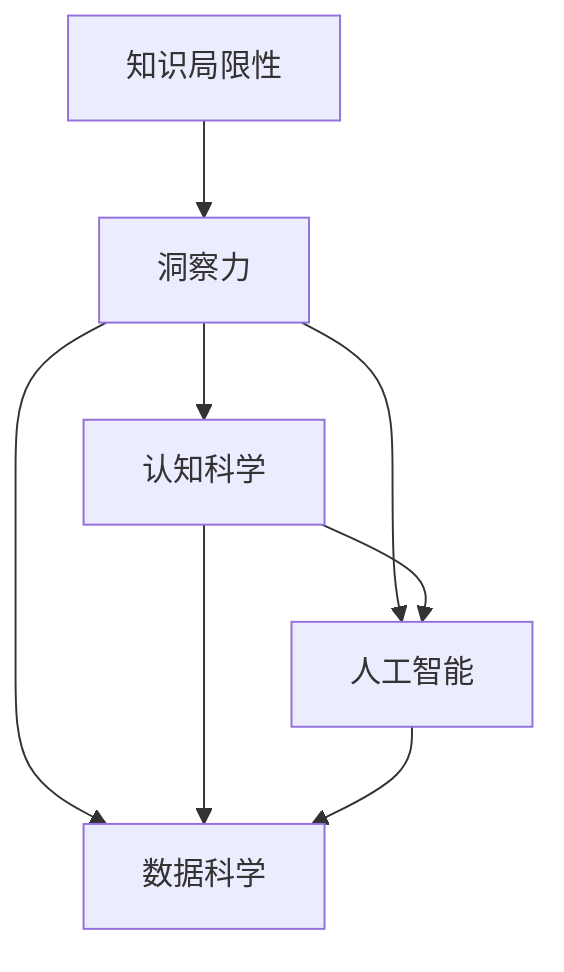

                 

# 人类知识的局限与突破：洞察力的重要意义

> 关键词：洞察力,知识局限,人类智能,突破,认知科学,人工智能,算法,数据科学

## 1. 背景介绍

### 1.1 问题由来
在信息爆炸和知识碎片化的现代社会，人类获取知识的途径和速度已远远超过以往任何一个时代。然而，人类的知识体系仍然是有限的，面对新出现的复杂问题，我们常常感到束手无策。信息过载和认知负荷的加剧，使得许多人无法在极短的时间内从海量的信息中提炼出有用洞见，决策和行动的效率受到极大影响。因此，提高人类洞察力的精准度和时效性，成为当前亟待解决的重要问题。

### 1.2 问题核心关键点
洞察力（Insight）是指通过对复杂现象的观察和分析，获取新知和解决方案的能力。它与直觉、创造力、理性分析等能力紧密相关，是人类智力的重要组成部分。提高洞察力不仅有助于个体和组织更好地应对环境变化，还能加速科技创新，推动社会进步。

从认知科学和人工智能的角度来看，洞察力的提升是一个多学科交叉研究的课题。本文将从认知科学的角度出发，探讨人类知识局限与突破的关系，并通过人工智能技术，特别是算法和数据科学的应用，阐释如何利用机器洞察力来辅助人类获取新知和解决问题。

### 1.3 问题研究意义
洞察力的提升，对于提高个体决策能力、组织竞争力、社会创新力具有深远影响。从个体层面，洞察力可以提升决策的准确性和及时性，帮助个体在复杂多变的环境中游刃有余。从组织和社会层面，洞察力可以驱动创新、优化流程、提升效率，推动社会经济的发展和进步。因此，洞察力的研究不仅具有学术价值，还具有实践意义，能够为个体、组织和社会的智能化发展提供重要支持。

## 2. 核心概念与联系

### 2.1 核心概念概述

为更好地理解人类知识局限与洞察力的关系，本节将介绍几个密切相关的核心概念：

- 知识局限性(Knowledge Limitation)：指人类知识体系在特定领域或问题上的空白和不足，包括信息盲点、经验匮乏、思维定势等。
- 洞察力(Insight)：指通过对已知信息的综合分析，获得新知和新理解的能力。
- 认知科学(Cognitive Science)：研究人类认知过程和机制的跨学科领域，包括心理学、神经科学、计算机科学等。
- 人工智能(Artificial Intelligence)：使用算法和数据处理技术模拟人类智能，使机器具备学习和解决问题的能力。
- 数据科学(Data Science)：通过数据收集、处理、分析和可视化技术，获取有用洞见，支持决策和行动。

这些核心概念之间的逻辑关系可以通过以下Mermaid流程图来展示：



这个流程图展示了几类核心概念之间的相互联系：

1. 知识局限性引发对洞察力的需求。
2. 认知科学为洞察力的提升提供理论和实验基础。
3. 人工智能和数据科学为洞察力的获取提供技术和工具。
4. 人工智能和数据科学通过模拟人类认知，辅助洞察力的提升。

## 3. 核心算法原理 & 具体操作步骤
### 3.1 算法原理概述

提升洞察力的过程，本质上是利用算法和数据科学技术，对海量信息进行分析和综合，从而获取新的理解和洞见。这一过程大致可以分为以下几个步骤：

1. **数据收集**：从各种来源收集相关信息，包括文本、图像、视频、音频等。
2. **数据预处理**：对收集到的数据进行清洗、去重、格式转换等预处理操作。
3. **特征提取**：将预处理后的数据转化为模型可以理解的特征，如文本向量化、图像特征提取等。
4. **模型训练**：使用机器学习或深度学习算法，训练模型学习数据中隐含的模式和规律。
5. **洞察力获取**：模型基于学习到的规律，对新数据进行分析和预测，提取有用的洞察力。

### 3.2 算法步骤详解

以文本分析为例，具体步骤如下：

**Step 1: 数据收集**
- 收集与问题相关的文本数据，如新闻、论文、社交媒体帖子等。
- 通过网络爬虫、数据公开接口等方式获取文本数据。

**Step 2: 数据预处理**
- 使用NLP工具库，如NLTK、SpaCy等，对文本进行分词、词性标注、去除停用词等预处理操作。
- 去除低质量数据、噪声数据，确保数据的质量和完整性。

**Step 3: 特征提取**
- 使用文本向量化技术，如词袋模型、TF-IDF、Word2Vec等，将文本转化为数值特征。
- 考虑文本的上下文信息，使用BERT等预训练模型进行特征提取。

**Step 4: 模型训练**
- 选择合适的机器学习或深度学习算法，如SVM、随机森林、RNN、CNN、Transformer等。
- 使用训练集数据训练模型，调优模型参数，使其最大化拟合数据中的规律。

**Step 5: 洞察力获取**
- 使用训练好的模型对新文本进行分类、情感分析、实体识别等任务。
- 结合领域知识和专家经验，对模型输出进行解释和验证，提取有用洞察力。

### 3.3 算法优缺点

提升洞察力的算法具有以下优点：

1. 高效处理大规模数据：通过自动化处理和机器学习算法，可以快速处理和分析海量数据。
2. 快速发现规律：机器算法能够识别数据中的隐含模式和规律，帮助人类在短时间内获取新知。
3. 可重复性强：算法处理结果具有可重复性，便于验证和优化。
4. 跨领域适用性：算法可以应用于各种不同领域的洞察力获取。

同时，这些算法也存在一些缺点：

1. 数据质量和处理方式影响结果：数据噪声和处理不当会影响算法的输出。
2. 过度依赖技术：算法无法完全替代人类的直觉和创造力，过度依赖技术可能导致洞察力不足。
3. 模型复杂性高：部分算法复杂度高，需要大量计算资源和时间。
4. 结果可解释性差：部分算法的黑盒特性，使得其输出难以解释和验证。

尽管存在这些局限性，但总体而言，算法在提升洞察力方面具有不可替代的价值，特别是在数据量巨大、分析复杂的情况下，算法可以发挥其独特优势。

### 3.4 算法应用领域

提升洞察力的算法在各个领域都有广泛的应用：

- **金融领域**：通过分析大量交易数据和新闻报道，预测市场趋势，辅助投资决策。
- **医疗领域**：通过分析患者病历和药物效果数据，发现疾病模式和治疗方法。
- **市场营销**：通过分析消费者行为数据，发现消费趋势和品牌偏好。
- **供应链管理**：通过分析物流和库存数据，优化供应链流程，提升效率。
- **科学研究**：通过分析实验数据和文献，发现科学规律，推动科技创新。

此外，提升洞察力的算法还应用于产品开发、社会治理、城市规划等多个领域，帮助各行业提升决策能力和管理效率。

## 4. 数学模型和公式 & 详细讲解 & 举例说明
### 4.1 数学模型构建

提升洞察力的数学模型通常涉及以下几个关键步骤：

1. **数据表示**：将数据转化为数值或向量形式，以便算法处理。
2. **特征选择**：从数据中提取有用的特征，减少计算复杂度。
3. **模型训练**：使用机器学习或深度学习算法，训练模型学习数据规律。
4. **洞察力提取**：基于模型学习到的规律，对新数据进行分析和预测，提取有用洞见。

### 4.2 公式推导过程

以文本分类为例，公式推导过程如下：

假设训练数据集为 $D=\{(x_i,y_i)\}_{i=1}^N$，其中 $x_i$ 表示文本，$y_i$ 表示文本类别。使用朴素贝叶斯算法进行分类，公式为：

$$
P(y|x) = \frac{P(x|y)P(y)}{P(x)}
$$

其中，$P(y|x)$ 表示在给定文本 $x$ 的情况下，文本属于类别 $y$ 的概率，$P(x|y)$ 表示文本属于类别 $y$ 时，文本为 $x$ 的概率，$P(y)$ 表示类别 $y$ 出现的概率，$P(x)$ 表示文本 $x$ 出现的概率。

在实际应用中，可以使用极大似然估计法求解 $P(x|y)$ 和 $P(y)$，公式为：

$$
P(x|y) = \frac{N(y,x)}{N(y)}
$$

$$
P(y) = \frac{N(y)}{N}
$$

其中，$N(y,x)$ 表示类别 $y$ 中包含文本 $x$ 的数量，$N(y)$ 表示类别 $y$ 中所有文本的数量，$N$ 表示训练数据集中的总文本数量。

### 4.3 案例分析与讲解

假设我们有一个新闻分类任务，数据集包含5万篇新闻，每篇新闻的分类标签为政治、经济、体育、娱乐、科技。我们使用朴素贝叶斯算法进行分类，具体步骤如下：

1. 数据预处理：去除停用词、分词、词性标注等。
2. 特征提取：使用词袋模型将每篇新闻转化为数值特征向量。
3. 模型训练：使用训练集数据训练模型，求解 $P(x|y)$ 和 $P(y)$。
4. 洞察力获取：使用训练好的模型对新新闻进行分类，输出其最可能的类别。

通过上述过程，我们可以快速高效地对新新闻进行分类，提取其背后的洞察力，如判断新闻的类别、主题、作者等。

## 5. 项目实践：代码实例和详细解释说明
### 5.1 开发环境搭建

在进行洞察力提升的实践前，我们需要准备好开发环境。以下是使用Python进行Scikit-learn开发的开发环境配置流程：

1. 安装Anaconda：从官网下载并安装Anaconda，用于创建独立的Python环境。

2. 创建并激活虚拟环境：
```bash
conda create -n insight-env python=3.8 
conda activate insight-env
```

3. 安装必要的库：
```bash
conda install scikit-learn pandas numpy matplotlib tqdm jupyter notebook ipython
```

4. 安装NLP工具库：
```bash
pip install nltk
```

完成上述步骤后，即可在`insight-env`环境中开始项目实践。

### 5.2 源代码详细实现

这里我们以新闻分类为例，给出使用Scikit-learn进行朴素贝叶斯分类器的代码实现。

首先，定义数据处理函数：

```python
import pandas as pd
from sklearn.feature_extraction.text import CountVectorizer
from sklearn.naive_bayes import MultinomialNB
from sklearn.model_selection import train_test_split
from sklearn.metrics import accuracy_score

def load_data(file_path):
    df = pd.read_csv(file_path)
    texts = df['text'].tolist()
    labels = df['label'].tolist()
    return texts, labels

def preprocess_data(texts, labels):
    vectorizer = CountVectorizer(stop_words='english')
    vectors = vectorizer.fit_transform(texts)
    return vectors, labels

def train_model(X_train, y_train):
    model = MultinomialNB()
    model.fit(X_train, y_train)
    return model

def evaluate_model(model, X_test, y_test):
    y_pred = model.predict(X_test)
    acc = accuracy_score(y_test, y_pred)
    return acc

def main(file_path):
    texts, labels = load_data(file_path)
    X_train, X_test, y_train, y_test = train_test_split(texts, labels, test_size=0.2, random_state=42)
    X_train, X_test = preprocess_data(X_train, X_test)
    model = train_model(X_train, y_train)
    acc = evaluate_model(model, X_test, y_test)
    print(f'Accuracy: {acc:.2f}')
```

然后，运行代码：

```bash
python main.csv
```

### 5.3 代码解读与分析

让我们再详细解读一下关键代码的实现细节：

**load_data函数**：
- 加载训练和测试数据集，返回文本和标签。

**preprocess_data函数**：
- 对文本数据进行分词、去停用词、词袋模型向量化等预处理操作，返回特征矩阵和标签。

**train_model函数**：
- 训练朴素贝叶斯分类器模型，返回训练好的模型。

**evaluate_model函数**：
- 使用训练好的模型对测试数据进行预测，计算分类准确率。

**main函数**：
- 加载数据集，进行数据预处理、模型训练和评估，并输出分类准确率。

可以看到，Scikit-learn提供了一整套简单易用的机器学习工具，开发者可以通过调用其封装好的函数，快速实现各类机器学习模型的训练和评估。

## 6. 实际应用场景
### 6.1 金融市场分析

在金融市场分析中，洞察力可以通过分析历史交易数据、新闻报道、社交媒体等海量数据，发现市场趋势和价格波动规律，辅助投资决策。

具体而言，可以收集历史交易数据、金融新闻、财经博客、社交媒体帖子等文本数据，使用自然语言处理技术进行情感分析、主题识别、事件抽取等任务，提取市场情绪、政策变化、公司业绩等信息。然后，结合机器学习算法，训练模型学习数据中的隐含规律，对市场未来走势进行预测和分析。

### 6.2 医疗诊断

在医疗诊断中，洞察力可以通过分析大量病历数据、临床试验结果、医学文献等文本数据，发现疾病模式和治疗方法，提高诊断准确性。

具体而言，可以收集患者的病历记录、临床试验报告、医学文献摘要等文本数据，使用自然语言处理技术进行命名实体识别、关系抽取、知识图谱构建等任务，提取患者疾病症状、诊断结果、治疗方案等信息。然后，结合机器学习算法，训练模型学习数据中的隐含规律，对新患者的病情进行诊断和治疗建议。

### 6.3 市场营销

在市场营销中，洞察力可以通过分析消费者行为数据、社交媒体评论、广告投放效果等文本数据，发现消费趋势和品牌偏好，优化市场营销策略。

具体而言，可以收集消费者评论、社交媒体帖子、广告文案等文本数据，使用自然语言处理技术进行情感分析、主题识别、关键词抽取等任务，提取消费者对品牌、产品、服务等的评价和建议。然后，结合机器学习算法，训练模型学习数据中的隐含规律，对消费者需求进行预测和分析，优化产品设计、广告投放和营销策略。

### 6.4 未来应用展望

随着机器学习和自然语言处理技术的不断进步，洞察力的提升将变得越来越容易和普及。未来的洞察力获取将不再依赖于人类直觉和经验，而是通过自动化、智能化的算法和大数据技术，快速高效地从海量信息中提取有用洞见。

在金融、医疗、市场营销、科学研究等领域，洞察力的提升将带来革命性的变化。通过洞察力的提升，各行业将更加智能化、高效化、精准化，推动社会经济的发展和进步。

## 7. 工具和资源推荐
### 7.1 学习资源推荐

为了帮助开发者系统掌握提升洞察力的算法和技术，这里推荐一些优质的学习资源：

1. 《机器学习实战》系列书籍：介绍了机器学习的基本原理和算法，适合初学者入门。

2. 《深度学习》课程：斯坦福大学开设的深度学习课程，系统讲解深度学习理论和技术，适合进一步学习。

3. Kaggle竞赛：Kaggle平台提供海量数据集和机器学习竞赛，有助于实践和提高。

4. GitHub开源项目：GitHub平台上有许多开源的机器学习项目，可以学习和借鉴。

5. Coursera课程：Coursera平台提供各种机器学习和NLP课程，适合在线学习。

通过对这些资源的学习实践，相信你一定能够快速掌握提升洞察力的算法和技术，并将其应用于实际问题中。

### 7.2 开发工具推荐

高效的开发离不开优秀的工具支持。以下是几款用于提升洞察力开发的常用工具：

1. Jupyter Notebook：免费的在线编程环境，支持多种编程语言和库，适合快速迭代开发。

2. Scikit-learn：Python的机器学习库，提供简单易用的接口和算法实现，适合快速原型开发。

3. TensorFlow：Google开发的深度学习框架，适合处理大规模复杂数据，适合深度学习算法实现。

4. Keras：高层次的深度学习框架，支持快速原型设计和模型训练。

5. PyTorch：Facebook开发的深度学习框架，灵活性高，支持动态计算图，适合复杂模型实现。

合理利用这些工具，可以显著提升洞察力提升的开发效率，加快创新迭代的步伐。

### 7.3 相关论文推荐

提升洞察力的算法和技术的发展源于学界的持续研究。以下是几篇奠基性的相关论文，推荐阅读：

1. A Survey on Text Clustering：总结了文本聚类算法的研究进展，适合了解相关技术。

2. Natural Language Processing with Linear Models：介绍线性模型在NLP中的应用，适合基础学习。

3. Deep Learning for Healthcare Applications：总结了深度学习在医疗领域的应用，适合了解相关技术。

4. Multi-view Clustering for Big Data Analytics：总结了多视图聚类算法的研究进展，适合了解相关技术。

这些论文代表了大数据和机器学习在提升洞察力方面的研究进展。通过学习这些前沿成果，可以帮助研究者把握学科前进方向，激发更多的创新灵感。

## 8. 总结：未来发展趋势与挑战
### 8.1 总结

本文对人类知识局限与洞察力的关系进行了全面系统的介绍。首先阐述了知识局限性的现状及其对洞察力提升的挑战，明确了提升洞察力的重要性。其次，从认知科学和人工智能的角度，详细讲解了提升洞察力的算法原理和具体操作步骤，给出了提升洞察力的完整代码实例。同时，本文还广泛探讨了洞察力在金融市场分析、医疗诊断、市场营销等诸多领域的应用前景，展示了洞察力提升的巨大潜力。此外，本文精选了提升洞察力的各类学习资源，力求为读者提供全方位的技术指引。

通过本文的系统梳理，可以看到，提升洞察力不仅是一个技术问题，更是一个跨学科的综合性问题。认知科学、人工智能、数据科学等多个领域的融合，使得洞察力的提升成为可能。未来，随着技术的不断进步，提升洞察力将变得越来越简单和普及，为各行各业带来革命性的变化。

### 8.2 未来发展趋势

展望未来，提升洞察力的技术将呈现以下几个发展趋势：

1. 深度学习和神经网络的应用将更加广泛。深度学习模型具有强大的特征提取能力和泛化能力，适合处理复杂数据。未来，深度学习将广泛应用于金融、医疗、市场营销等多个领域，推动洞察力的提升。

2. 多模态数据融合将带来新的突破。不同模态的数据（如文本、图像、视频、音频等）具有不同的信息，通过多模态融合，可以获取更全面的洞见，提高洞察力的准确性和实用性。

3. 数据驱动的自动化洞察力提升将逐渐普及。通过自动化技术，将洞察力提升过程转化为自动化流程，进一步提高效率和精度。

4. 算法可解释性将得到重视。洞察力的提升不仅依赖于技术，更需要可解释性。未来的算法将更加注重输出结果的解释，帮助用户理解和验证结果。

5. 跨学科融合将带来更多突破。认知科学、人工智能、数据科学、社会科学等多个学科的融合，将带来更多创新和突破。

以上趋势凸显了提升洞察力技术的广阔前景。这些方向的探索发展，将进一步推动洞察力提升的普及和应用，为各行业带来革命性的变化。

### 8.3 面临的挑战

尽管提升洞察力的技术已经取得了一定的进展，但在迈向更加智能化、普适化应用的过程中，仍面临诸多挑战：

1. 数据质量和多样性问题。数据质量和多样性直接影响洞察力的准确性和实用性。如何获取高质量、多样化、代表性的数据，是提升洞察力的关键。

2. 算法复杂性和计算资源消耗。深度学习等复杂算法需要大量计算资源和时间，如何优化算法和资源配置，提高效率，是提升洞察力的重要问题。

3. 结果可解释性和可靠性。算法的黑盒特性使得其输出难以解释和验证，如何提高算法的可解释性和可靠性，是提升洞察力的重要目标。

4. 跨领域适用性和普适性。提升洞察力的技术需要适应不同的应用场景，如何设计通用性的算法和技术，是提升洞察力的重要方向。

5. 数据隐私和安全问题。洞察力的提升需要大量的数据支持，如何保护数据隐私和安全，避免数据泄露和滥用，是提升洞察力的重要问题。

这些挑战需要研究人员和开发者共同面对和解决，推动洞察力提升技术的不断进步和完善。

### 8.4 研究展望

面对提升洞察力的挑战，未来的研究需要在以下几个方面寻求新的突破：

1. 探索无监督和半监督学习算法。摆脱对大量标注数据的依赖，利用无监督和半监督学习算法，提高数据的获取效率和洞察力的实用性。

2. 研究多模态数据融合技术。通过融合不同模态的数据，获取更全面、更准确的洞见，提高洞察力的准确性和实用性。

3. 引入因果推断和机器学习范式。通过因果推断和机器学习范式，增强洞察力获取的稳定性和可信度，提高洞察力的实用性和可解释性。

4. 引入外部知识库和规则库。通过引入外部知识库和规则库，丰富洞察力获取的背景知识和语境信息，提高洞察力的全面性和准确性。

5. 引入强化学习技术。通过强化学习技术，优化洞察力获取过程，提高效率和精度。

6. 纳入伦理和法律约束。在洞察力获取过程中，引入伦理和法律约束，确保其符合社会价值观和法律法规，避免误导和滥用。

这些研究方向将推动提升洞察力技术的不断进步，为各行业带来革命性的变化。相信随着技术的不断进步，提升洞察力将变得越来越简单和普及，为各行各业带来革命性的变化。

## 9. 附录：常见问题与解答
### Q1: 提升洞察力的算法是否适用于所有数据类型？

A: 提升洞察力的算法主要针对文本数据，对于图像、视频、音频等非结构化数据，需要结合其他技术和工具进行处理。例如，使用计算机视觉技术提取图像特征，使用语音识别技术提取音频特征，使用自然语言处理技术进行文本分析。

### Q2: 提升洞察力的算法是否需要大量的标注数据？

A: 部分提升洞察力的算法（如深度学习）需要大量的标注数据进行训练，但部分算法（如文本聚类、特征选择）可以在少量或无标注数据情况下，仍然获得较好的结果。因此，在具体应用中，需要根据数据类型和问题特点，选择合适的算法和数据处理方式。

### Q3: 提升洞察力的算法是否容易被解释？

A: 部分提升洞察力的算法具有黑盒特性，其输出难以解释和验证。为了提高算法的可解释性，可以引入可解释性技术，如特征可视化、部分可解释性模型等，帮助用户理解算法的决策过程。

### Q4: 提升洞察力的算法是否适用于大规模数据？

A: 提升洞察力的算法可以处理大规模数据，但需要高性能计算资源和优化算法。对于大规模数据，可以采用分布式计算、增量学习等技术，提高算法的效率和实用性。

### Q5: 提升洞察力的算法是否适用于跨领域应用？

A: 提升洞察力的算法可以在不同领域应用，但需要根据具体问题和数据特点进行优化和调整。例如，在金融领域，需要重点关注市场趋势、价格波动等特征；在医疗领域，需要重点关注疾病症状、诊断结果等特征。

通过解答这些常见问题，我们更好地理解提升洞察力算法的适用性和局限性，为实际应用提供指导。

---

作者：禅与计算机程序设计艺术 / Zen and the Art of Computer Programming

