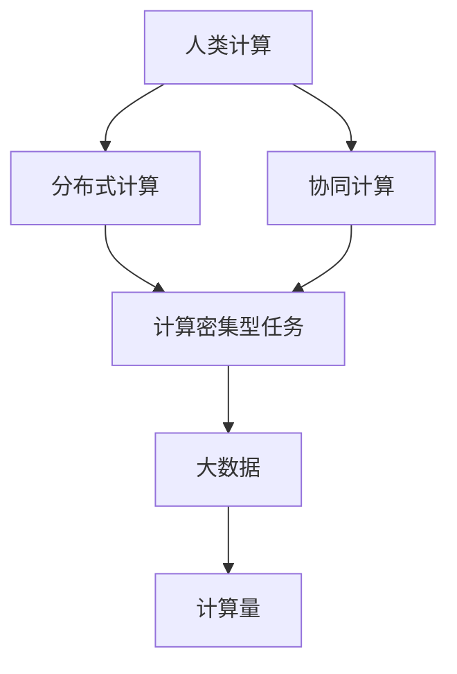

                 

# 人类计算的应用案例分析

> 关键词：人类计算,分布式计算,协同计算,计算密集型任务,大数据,计算量

## 1. 背景介绍

### 1.1 问题由来

随着科技的飞速发展，计算任务的需求日益增长。从早期的个人计算机到分布式集群，再到云服务和边缘计算，人类对于计算能力的需求在不断扩大。而传统集中式计算模式在处理大规模、复杂计算任务时，往往面临计算资源不足、数据传输延迟、系统扩展性差等问题。

### 1.2 问题核心关键点

人类计算（Human Computing）是一种全新的计算模式，利用人类的智能和计算资源来弥补现有计算模式的不足。它将计算任务分解为可人机协同解决的子任务，通过人的计算能力与计算机的计算能力相结合，实现高性能、高效率的计算。人类计算可以应用于多个领域，如科学计算、大数据分析、机器学习、游戏设计等，具有强大的应用前景。

## 2. 核心概念与联系

### 2.1 核心概念概述

为更好地理解人类计算的应用，本节将介绍几个密切相关的核心概念：

- **人类计算（Human Computing）**：利用人类智能和计算资源来解决计算密集型问题。
- **分布式计算（Distributed Computing）**：通过多台计算机协同工作来提高计算性能。
- **协同计算（Collaborative Computing）**：多个计算实体共同完成一个计算任务，共享计算资源和结果。
- **计算密集型任务（Computational Intensive Task）**：需要大量计算资源和时间才能完成的任务，如科学模拟、数据分析、机器学习训练等。
- **大数据（Big Data）**：需要处理、存储、分析海量数据的任务。
- **计算量（Computation Capacity）**：计算任务所需求的处理能力和计算资源。

这些核心概念之间的逻辑关系可以通过以下Mermaid流程图来展示：



这个流程图展示了一系列相关概念的逻辑关系：

1. 人类计算是分布式计算和协同计算的基础。
2. 分布式计算通过多台计算机协同工作，提高了计算密集型任务的计算能力。
3. 协同计算多个计算实体共同完成计算任务，提升了资源利用效率。
4. 计算密集型任务需要大量计算资源和时间。
5. 大数据指需要处理、存储、分析海量数据的任务，通常涉及复杂的计算过程。
6. 计算量描述了计算任务所需的处理能力和计算资源。

## 3. 核心算法原理 & 具体操作步骤

### 3.1 算法原理概述

人类计算的核心思想是将复杂的计算任务拆分为多个子任务，每个子任务由人机协同完成。基于此，人类计算的算法原理可归纳为以下几个步骤：

1. **任务分解**：将复杂的计算任务分解为多个子任务。
2. **人机协同**：将子任务分配给多个计算实体，其中人负责解决部分计算问题，机器负责处理剩余的计算任务。
3. **结果合并**：将各个计算实体的计算结果进行整合，形成最终输出。

### 3.2 算法步骤详解

以下是人类计算的基本算法步骤：

1. **任务定义**：
   - 根据计算任务的要求，定义任务分解的策略。
   - 确定每个子任务的计算要求和复杂度。

2. **任务分配**：
   - 将任务分解为多个子任务，分配给不同的计算实体。
   - 对于每个子任务，分配给合适的人类操作员或计算设备。

3. **协同计算**：
   - 操作员或计算设备协同工作，完成各自的任务。
   - 操作员可以通过手动计算、计算机辅助计算等方式解决部分子任务。

4. **结果合并**：
   - 将各个子任务的结果进行合并，形成最终输出。
   - 对于需要进行数值计算的任务，需要进行数值合并。

5. **结果评估**：
   - 对最终结果进行评估，确保其符合任务要求。
   - 使用误差评估、精度验证等方法评估结果的准确性。

### 3.3 算法优缺点

人类计算的优势在于其灵活性、资源利用率和协作性。但由于其依赖人的参与，也存在一定的局限性：

#### 优点：
1. **灵活性高**：可以根据任务需求灵活分配计算资源。
2. **资源利用率高**：能充分利用现有资源，降低成本。
3. **协作性强**：操作员和计算设备可协同完成复杂任务。

#### 缺点：
1. **受人为因素影响大**：操作员的计算能力和主观判断影响结果的准确性。
2. **时间成本高**：操作员和设备协同需要耗费大量时间。
3. **可扩展性差**：计算资源受限于人力，难以进行大规模扩展。

### 3.4 算法应用领域

人类计算已经在多个领域得到了应用，例如：

- **科学研究**：在生物、物理、化学等领域进行复杂模拟和数据分析。
- **大数据分析**：处理和分析海量数据集，如社交网络分析、基因组学研究等。
- **机器学习**：训练深度学习模型，优化模型参数，提升模型效果。
- **游戏设计**：优化游戏算法，提升游戏性能，解决游戏开发中的计算难题。
- **科学计算**：进行高性能科学计算，如气象预测、天气模拟等。

## 4. 数学模型和公式 & 详细讲解 & 举例说明

### 4.1 数学模型构建

人类计算的数学模型主要涉及任务分解、协同计算和结果合并三个方面。以下以一个简单的科学计算任务为例，构建人类计算的数学模型。

假设有如下科学计算任务：

- **输入**：一组数据集 $D$。
- **输出**：计算结果 $R$。

人类计算的数学模型可以表示为：

$$
R = f(D, H_1, H_2, ..., H_n)
$$

其中 $f$ 表示计算函数，$H_i$ 表示第 $i$ 个计算实体的计算结果。

### 4.2 公式推导过程

以一个简单的科学计算任务为例，设任务 $T$ 需要分解为 $n$ 个子任务，每个子任务的结果为 $H_i$。则任务 $T$ 的最终结果 $R$ 可以表示为：

$$
R = f(H_1, H_2, ..., H_n)
$$

假设每个子任务 $H_i$ 的计算复杂度为 $C_i$，计算时间消耗为 $T_i$，则整个任务 $T$ 的计算时间 $T_{total}$ 可以表示为：

$$
T_{total} = \sum_{i=1}^{n} T_i
$$

其中 $T_i = \frac{C_i}{R_i}$，$R_i$ 表示第 $i$ 个子任务的结果。

### 4.3 案例分析与讲解

假设某科研团队需要计算一组气象数据的模拟结果。该任务可以分解为多个子任务，每个子任务需要计算气象数据的局部区域。设每个子任务的结果分别为 $H_1, H_2, ..., H_n$，则最终结果 $R$ 可以通过计算函数 $f$ 进行合并：

$$
R = f(H_1, H_2, ..., H_n)
$$

假设有 $n$ 个计算设备参与协同计算，每个设备的计算能力为 $C_i$，计算时间消耗为 $T_i$，则计算时间 $T_{total}$ 可以表示为：

$$
T_{total} = \sum_{i=1}^{n} T_i
$$

其中 $T_i = \frac{C_i}{R_i}$，$R_i$ 表示第 $i$ 个子任务的结果。

在实际应用中，计算任务通常较为复杂，可以通过并行计算和优化算法来提高计算效率。例如，在计算气象模拟结果时，可以采用并行计算的方式，同时处理多个子任务，从而提高计算速度。

## 5. 项目实践：代码实例和详细解释说明

### 5.1 开发环境搭建

在进行人类计算项目实践前，我们需要准备好开发环境。以下是使用Python进行Dask开发的环境配置流程：

1. 安装Anaconda：从官网下载并安装Anaconda，用于创建独立的Python环境。

2. 创建并激活虚拟环境：
```bash
conda create -n dask-env python=3.8 
conda activate dask-env
```

3. 安装Dask：
```bash
conda install dask dask[complete]
```

4. 安装各类工具包：
```bash
pip install numpy pandas dask[complete]
```

完成上述步骤后，即可在`dask-env`环境中开始人类计算的实践。

### 5.2 源代码详细实现

下面以一个简单的科学计算任务为例，展示使用Dask进行人类计算的Python代码实现。

首先，定义任务分解的函数：

```python
import dask.distributed as dd

def decompose_task(input_data):
    # 将输入数据分为多个子任务
    n_subtasks = 10
    data_chunks = input_data.chunksize(n_subtasks)
    subtasks = [input_data[i:i+data_chunks] for i in range(0, input_data.size, data_chunks)]
    return subtasks

# 定义计算函数
def calculate_task(subtask):
    # 对子任务进行计算，返回计算结果
    result = subtask.compute()
    return result

# 定义任务合并函数
def merge_results(results):
    # 将各个子任务的结果进行合并，形成最终输出
    final_result = results[0]
    for i in range(1, len(results)):
        final_result = final_result + results[i]
    return final_result
```

然后，使用Dask将任务分解并分配给多个计算实体：

```python
# 创建一个Dask集群
cluster = dd.Client()

# 定义输入数据
input_data = dask.array.random.normal(size=1000)

# 分解任务
subtasks = decompose_task(input_data)

# 分配任务给计算实体
results = dask.distributed.map(calculate_task, subtasks, dask_key='compute')

# 合并结果
final_result = merge_results(results)
```

最后，运行并输出结果：

```python
final_result.compute()
```

以上就是使用Dask进行人类计算的完整代码实现。可以看到，Dask通过将任务分解和计算分配给不同的计算实体，实现了高效的人类计算。

### 5.3 代码解读与分析

让我们再详细解读一下关键代码的实现细节：

**decompose_task函数**：
- 该函数负责将输入数据分为多个子任务，每个子任务的大小为 $n_subtasks$。
- 通过Dask的chunksize方法，将输入数据分为 $n_subtasks$ 个大小相等的子任务。
- 返回一个子任务列表。

**calculate_task函数**：
- 该函数负责对单个子任务进行计算，返回计算结果。
- 使用Dask的compute方法，对子任务进行计算，并返回结果。

**merge_results函数**：
- 该函数负责将各个子任务的结果进行合并，形成最终输出。
- 使用Python的加号运算符将各个子任务的结果进行累加，形成最终结果。

**任务运行流程**：
- 创建一个Dask集群，用于分配计算资源。
- 定义输入数据，进行任务分解。
- 将任务分配给计算实体，并并行计算各个子任务。
- 对各个子任务的结果进行合并，形成最终结果。
- 输出最终结果。

## 6. 实际应用场景

### 6.1 科学研究

在科学研究中，计算密集型任务如分子动力学模拟、气候模型、天文学数据处理等，需要大量的计算资源和时间。利用人类计算，可以将任务分解为多个子任务，通过多个人工智能辅助计算，提升计算效率。例如，在分子动力学模拟中，可以将每个分子的计算任务分解为多个子任务，每个子任务由不同的人工智能辅助计算，从而加快模拟速度。

### 6.2 大数据分析

大数据分析需要处理和分析海量数据，计算任务复杂度较高。利用人类计算，可以将数据预处理、特征工程、模型训练等任务分解为多个子任务，通过多个人工智能辅助计算，提升数据分析效率。例如，在金融数据分析中，可以将数据预处理、特征提取、模型训练等任务分解为多个子任务，每个子任务由不同的人工智能辅助计算，从而加快数据分析速度。

### 6.3 游戏设计

游戏开发中的计算密集型任务，如复杂物理模拟、人工智能决策、实时渲染等，需要大量的计算资源和时间。利用人类计算，可以将任务分解为多个子任务，通过多个人工智能辅助计算，提升游戏性能。例如，在游戏物理引擎中，可以将每个物理对象的计算任务分解为多个子任务，每个子任务由不同的人工智能辅助计算，从而提升游戏物理引擎的计算效率。

### 6.4 未来应用展望

未来，随着人工智能技术的发展，人类计算将更广泛地应用于各个领域。以下是人类计算在几个未来领域的应用前景：

- **医疗健康**：利用人类计算进行疾病模拟、药物设计、基因组分析等，提升医疗健康水平。
- **智能交通**：利用人类计算进行交通流量模拟、路径规划、事故预警等，提升交通管理效率。
- **智能制造**：利用人类计算进行产品设计、生产调度、质量控制等，提升制造效率和产品质量。
- **智能农业**：利用人类计算进行农田监测、病虫害预测、资源管理等，提升农业生产效率。

## 7. 工具和资源推荐

### 7.1 学习资源推荐

为了帮助开发者系统掌握人类计算的理论基础和实践技巧，这里推荐一些优质的学习资源：

1. **《Human Computing: The Next Generation of Computing》**：一本关于人类计算的最新书籍，涵盖了人类计算的理论基础、应用案例和技术发展。
2. **Dask官方文档**：Dask的官方文档，提供了丰富的使用示例和API文档，是学习Dask的最佳资料。
3. **《Parallel Programming》**：一本关于并行计算的书籍，介绍了并行计算的理论基础和实现方法，适合学习人类计算的基本原理。
4. **《Computational Modeling in Biological and Physical Sciences》**：一本关于科学计算的书籍，介绍了科学计算的理论基础和应用案例，适合学习人类计算在科学研究中的应用。
5. **Kaggle竞赛平台**：一个数据科学竞赛平台，提供了大量的数据集和算法实现，适合学习人类计算的数据处理和算法优化。

通过对这些资源的学习实践，相信你一定能够快速掌握人类计算的精髓，并用于解决实际的科学计算问题。

### 7.2 开发工具推荐

高效的开发离不开优秀的工具支持。以下是几款用于人类计算开发的常用工具：

1. **Dask**：一个基于Python的并行计算框架，可以方便地进行任务分解和并行计算。
2. **TensorFlow**：一个由Google主导开发的深度学习框架，支持分布式计算，适合大规模工程应用。
3. **PySpark**：一个基于Python的分布式计算框架，适合大规模数据处理和大数据应用。
4. **Apache Flink**：一个基于Java的流处理框架，支持大规模数据流处理和高性能计算。
5. **Apache Spark**：一个基于Scala的分布式计算框架，适合大规模数据处理和大数据应用。

合理利用这些工具，可以显著提升人类计算的开发效率，加快创新迭代的步伐。

### 7.3 相关论文推荐

人类计算的发展源于学界的持续研究。以下是几篇奠基性的相关论文，推荐阅读：

1. **"Human Computing: The Next Generation of Computing"**：讨论了人类计算的理论基础和应用前景。
2. **"Parallel Programming"**：介绍了并行计算的理论基础和实现方法，适合学习人类计算的基本原理。
3. **"Computational Modeling in Biological and Physical Sciences"**：介绍了科学计算的理论基础和应用案例，适合学习人类计算在科学研究中的应用。
4. **"Human Computing in Science and Engineering"**：介绍了人类计算在科学研究和工程应用中的实际案例，适合学习人类计算的具体应用。
5. **"Human-Centered Computing: Opportunities and Challenges"**：讨论了人类计算面临的机遇和挑战，适合学习人类计算的现状和发展方向。

这些论文代表了大计算模式的理论发展，帮助我们更好地理解人类计算的潜力与局限。

## 8. 总结：未来发展趋势与挑战

### 8.1 总结

本文对人类计算的应用进行了全面系统的介绍。首先阐述了人类计算的理论基础和应用意义，明确了人类计算在解决计算密集型问题中的独特优势。其次，从原理到实践，详细讲解了人类计算的算法步骤和代码实现，给出了具体的项目实践示例。同时，本文还广泛探讨了人类计算在科学研究、大数据分析、游戏设计等多个领域的应用前景，展示了人类计算的广泛应用价值。此外，本文精选了人类计算的技术资源，力求为读者提供全方位的技术指引。

通过本文的系统梳理，可以看到，人类计算正在成为一种全新的计算模式，利用人的智能和计算资源解决计算密集型问题，具有强大的应用前景。未来，随着人工智能技术的发展，人类计算将更广泛地应用于各个领域，为人类社会带来深远影响。

### 8.2 未来发展趋势

展望未来，人类计算的发展趋势如下：

1. **技术融合加速**：人类计算将与人工智能、云计算、大数据等技术进一步融合，形成更加高效的计算模式。
2. **应用场景丰富**：人类计算将在科学研究、金融、医疗、交通等领域得到广泛应用，提升各行业的计算效率和决策质量。
3. **协作机制优化**：人类计算将逐步优化协作机制，提高操作员和计算设备的协同效率。
4. **计算资源多样化**：人类计算将利用多种计算资源，如人类智能、计算设备、云计算等，提升资源利用效率。
5. **跨学科发展**：人类计算将在多个学科交叉融合中得到发展，提升计算效率和应用广度。

以上趋势凸显了人类计算技术的广阔前景。这些方向的探索发展，必将引领人类计算技术迈向更高的台阶，为人类社会带来更多的创新和突破。

### 8.3 面临的挑战

尽管人类计算技术已经取得了初步成果，但在迈向更加智能化、普适化应用的过程中，它仍面临诸多挑战：

1. **人为因素影响**：操作员的计算能力和主观判断对结果的准确性有较大影响，难以消除主观偏差。
2. **协同效率问题**：操作员和计算设备的协同效率低下，难以适应复杂任务。
3. **资源利用率低**：计算资源分配不合理，导致资源浪费和效率低下。
4. **可扩展性差**：任务分解和协同计算难以进行大规模扩展，无法应对海量数据和复杂任务。
5. **安全性和隐私问题**：数据安全和隐私保护是计算过程中必须面对的问题，难以完全避免数据泄露和攻击。

这些挑战需要学术界和产业界共同努力，进一步优化算法和机制，提升人类计算的可靠性和效率。

### 8.4 研究展望

面对人类计算面临的挑战，未来的研究需要在以下几个方面寻求新的突破：

1. **优化任务分解和协同算法**：通过更高效的算法设计，提高操作员和计算设备的协同效率。
2. **引入人工智能技术**：利用人工智能技术，提升操作员的计算能力和决策效率。
3. **多学科融合**：在多个学科交叉融合中，探索新的计算模式和应用场景。
4. **数据安全和隐私保护**：在计算过程中，加强数据安全和隐私保护，确保数据安全和隐私保护。

这些研究方向的探索，必将引领人类计算技术迈向更高的台阶，为人类社会带来更多的创新和突破。面向未来，人类计算技术还需要与其他人工智能技术进行更深入的融合，共同推动人类计算的发展。

## 9. 附录：常见问题与解答

**Q1：人类计算是否适用于所有计算密集型任务？**

A: 人类计算适用于需要人类智能和计算资源解决的计算密集型任务，如科学计算、大数据分析、机器学习训练等。但对于一些特定的计算任务，如机器学习和深度学习中的复杂网络训练，人类计算的效率较低，需要更高效的计算资源。

**Q2：人类计算如何与人工智能技术结合？**

A: 人类计算可以通过引入人工智能技术，提高操作员的计算能力和决策效率。例如，在科学计算中，可以通过引入机器学习算法，优化计算过程中的参数设置和结果合并。在数据处理中，可以通过引入自然语言处理技术，提高数据预处理和特征提取的效率。

**Q3：人类计算在计算资源管理方面有哪些优势？**

A: 人类计算可以充分利用现有计算资源，避免资源浪费。例如，在科学研究中，可以利用闲置的计算设备和实验室资源，提升计算效率和资源利用率。在金融数据分析中，可以利用云计算平台和分布式计算框架，灵活分配计算资源。

**Q4：人类计算在哪些行业有广泛应用前景？**

A: 人类计算在科学研究、大数据分析、游戏设计、智能交通、智能制造、智能农业等多个行业具有广泛应用前景。这些行业中的计算密集型任务，可以利用人类计算进行高效处理和优化，提升行业效率和决策质量。

**Q5：如何优化人类计算的协同机制？**

A: 优化人类计算的协同机制，需要综合考虑任务分解、资源分配、操作员和计算设备的协同效率等因素。例如，在科学研究中，可以通过任务分解和并行计算，提升计算效率和资源利用率。在金融数据分析中，可以通过数据分块和任务分配，优化计算资源分配和协同计算。

以上Q&A内容旨在帮助读者更好地理解人类计算的原理和应用，进一步探索人类计算在各个领域的应用潜力。通过不断创新和优化，相信人类计算技术将为人类社会带来更多的创新和突破，提升各行业的计算效率和决策质量。

