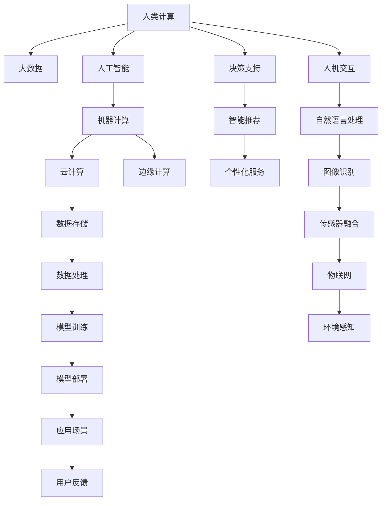

                 

# 人类计算的未来：趋势、机遇与挑战

## 1. 背景介绍

### 1.1 问题由来
随着人工智能技术的迅猛发展，计算能力已经从以人为主的"人类计算"时代，迈入了以机器为主的"机器计算"时代。无论是大数据、云计算、机器学习还是人工智能，背后的核心驱动力都是计算资源的不断积累和算法的不断创新。如今，计算已经成为连接现实世界和虚拟空间的基础设施，支撑着各类应用的发展。

然而，这种计算模式的转变也带来了一些新的问题与挑战。如何应对计算资源的有限性，平衡计算效率与成本，使计算技术更好地服务于人类社会，成为了当前技术研究和应用领域的热点话题。本文将从计算的趋势、机遇与挑战三个维度展开讨论，试图揭示计算的未来走向，并为相关从业者提供一些参考和思考。

## 2. 核心概念与联系

### 2.1 核心概念概述

为更好地理解"人类计算的未来"，首先需要明确几个关键概念：

- **人类计算**：指以人类为中心的计算模式，依赖人类智力、经验和判断力，解决复杂问题。人类计算能够深入理解复杂任务的背景信息，实现更加灵活多变和精准的决策。

- **机器计算**：指以机器为中心的计算模式，依赖算法和计算资源，处理大数据量和高复杂度问题。机器计算能够处理海量数据，速度快，但缺乏灵活性和情感理解。

- **人工智能**：指能够模拟人类智能的计算系统，包括学习、推理、感知、决策等功能。人工智能的目标是构建能够与人类互动、自我学习、自主决策的系统。

- **大数据**：指数据规模巨大、类型多样、来源广泛的数据集。大数据技术能够为人工智能提供数据支撑，加速算法的训练和模型的优化。

- **云计算**：指通过互联网提供的计算资源和工具，供用户按需使用。云计算使得大规模计算资源的使用更为便捷和廉价。

- **边缘计算**：指将计算能力部署到数据产生或收集的现场，减少数据传输时延，提高计算效率。边缘计算适合需要实时计算的应用场景。

这些概念共同构成了现代计算的基础架构和技术体系。人类计算与机器计算相互补充，共同推动着计算技术的发展。

### 2.2 核心概念原理和架构的 Mermaid 流程图(Mermaid 流程节点中不要有括号、逗号等特殊字符)



此图展示了从人类计算到机器计算的转换过程，以及各环节的主要技术和应用。人类计算、人工智能、机器计算通过云计算和边缘计算等手段，共同支撑着大数据和物联网的发展。

## 3. 核心算法原理 & 具体操作步骤

### 3.1 算法原理概述

人类计算与机器计算在原理上有明显的不同。人类计算依赖个体的经验、知识和直觉，具有高度的灵活性和创造性，但速度较慢且易于受到主观因素干扰。机器计算则依赖算法和计算资源，具备处理大规模数据和高复杂度任务的能力，但缺乏人类计算的灵活性和创造性。

在实际操作中，人类计算与机器计算往往需要协同工作。例如，在医学诊断中，医生依赖其经验和知识进行初步判断，而后续通过机器学习模型进一步验证和辅助决策。在金融分析中，分析师利用人类智慧理解市场趋势，机器模型则处理海量数据进行预测。

### 3.2 算法步骤详解

1. **数据收集与处理**：从各类设备和环境中收集数据，并进行清洗、标注、分类等预处理。

2. **模型训练与优化**：利用机器学习或深度学习算法，训练模型以提高准确性和泛化能力。

3. **人机交互**：将训练好的模型应用到实际场景中，通过用户界面或API实现人机交互。

4. **结果反馈与迭代**：收集用户反馈，评估模型性能，迭代优化算法和模型参数。

5. **算法融合与协同**：将人类计算和机器计算进行融合，通过算法组合和决策逻辑优化，实现更加高效和精准的计算。

### 3.3 算法优缺点

人类计算的优点在于：

- **灵活性和创造性**：人类计算能够处理复杂的非结构化信息，具备高度的灵活性和创造性，能够应对未知和变化的环境。
- **情感理解和同理心**：人类计算能够理解情感和上下文，具备同理心，能够进行更加人性化的交流。
- **多任务处理能力**：人类计算能够同时处理多个任务，提高整体效率。

人类计算的缺点在于：

- **速度较慢**：人类计算的速度和处理能力有限，无法实时处理大规模数据。
- **易受干扰**：人类计算受到情感、偏见等因素的干扰，可能导致错误的决策。
- **成本高**：训练有经验的人类计算者需要大量的时间和资源，成本较高。

机器计算的优点在于：

- **速度和处理能力**：机器计算能够处理海量数据，速度快，处理能力强，能够实时处理大量信息。
- **准确性和泛化能力**：机器计算基于算法和数据，具有高准确性和泛化能力，能够适应多种环境和任务。
- **可扩展性**：机器计算能够通过增加计算资源，实现计算能力的扩展。

机器计算的缺点在于：

- **缺乏灵活性**：机器计算缺乏人类计算的灵活性和创造性，难以应对未知和变化的环境。
- **情感理解不足**：机器计算难以理解情感和上下文，缺乏同理心，难以进行人性化交流。
- **算法局限性**：机器计算的算法和模型依赖于数据和训练，存在一定的局限性，需要大量数据和高质量的标注。

### 3.4 算法应用领域

人类计算和机器计算在各领域的应用场景广泛：

- **医疗健康**：人类医生利用经验知识进行初步诊断，机器学习模型则辅助诊断和预测，提高诊断准确性。
- **金融服务**：分析师利用人类智慧理解市场，机器模型则处理数据进行预测和决策，提高投资效率。
- **交通运输**：人类司机和调度员利用经验知识进行驾驶和调度，机器算法则优化路线和交通管理，提升运行效率。
- **制造业**：人类工程师设计产品，机器算法优化制造过程，提高生产效率和产品质量。
- **教育培训**：教师利用经验知识进行教学，机器学习模型则提供个性化推荐和辅导，提升教学效果。

## 4. 数学模型和公式 & 详细讲解 & 举例说明（备注：数学公式请使用latex格式，latex嵌入文中独立段落使用 $$，段落内使用 $)
### 4.1 数学模型构建

在人类计算和机器计算的结合中，数学模型起着至关重要的作用。例如，在推荐系统中，可以使用协同过滤、矩阵分解等数学模型来预测用户兴趣，同时结合用户行为数据和历史数据进行优化。

假设用户集为 $U$，物品集为 $I$，用户对物品的评分矩阵为 $R \in \mathbb{R}^{n \times m}$，其中 $n$ 为用户的数量，$m$ 为物品的数量。目标是最小化预测评分与真实评分之间的平方误差，即：

$$
\min_{\theta} \frac{1}{n} \sum_{i=1}^{n} \sum_{j=1}^{m} (r_{ij} - \hat{r}_{ij})^2
$$

其中，$\hat{r}_{ij}$ 为预测评分，$r_{ij}$ 为真实评分，$\theta$ 为模型参数。常用的模型包括矩阵分解模型、协同过滤模型等。

### 4.2 公式推导过程

以矩阵分解模型为例，目标是将评分矩阵 $R$ 分解为两个低秩矩阵 $X$ 和 $Y$ 的乘积，即 $R \approx XY$。利用奇异值分解(SVD)，可以求解：

$$
X = U \Sigma V^T, Y = W \Sigma U^T
$$

其中，$U$ 和 $W$ 是左奇异矩阵和右奇异矩阵，$\Sigma$ 是对角矩阵。目标是最大化目标函数：

$$
\max_{U,W} \text{tr}(\Sigma \Sigma^T) \text{tr}(XY^T)
$$

其中，$\text{tr}(\cdot)$ 表示矩阵的迹。通过对目标函数求导，可以求解 $U$ 和 $W$ 的最优值。

### 4.3 案例分析与讲解

在电商推荐系统中，可以使用矩阵分解模型进行推荐。假设用户对不同商品的评分矩阵为：

$$
R = \begin{bmatrix}
5 & 4 & 3 \\
4 & 5 & 4 \\
3 & 4 & 5
\end{bmatrix}
$$

将其分解为两个低秩矩阵 $X$ 和 $Y$，得到：

$$
X = \begin{bmatrix}
1 & 0 & 0.5 \\
0 & 1 & 0.5
\end{bmatrix}, Y = \begin{bmatrix}
1 & 1 & 0.5 \\
0.5 & 1 & 1
\end{bmatrix}
$$

则用户对商品 1 的预测评分 $\hat{r}_{11} = 1 \times 1 \times 1.5 = 1.5$，对商品 2 的预测评分 $\hat{r}_{12} = 0.5 \times 1 \times 1.5 = 0.75$。最终的推荐结果为商品 1，可以结合用户的历史行为数据进行进一步优化。

## 5. 项目实践：代码实例和详细解释说明

### 5.1 开发环境搭建

在进行计算实践前，需要先准备好开发环境。以下是使用Python进行PyTorch开发的环境配置流程：

1. 安装Anaconda：从官网下载并安装Anaconda，用于创建独立的Python环境。

2. 创建并激活虚拟环境：
```bash
conda create -n pytorch-env python=3.8 
conda activate pytorch-env
```

3. 安装PyTorch：根据CUDA版本，从官网获取对应的安装命令。例如：
```bash
conda install pytorch torchvision torchaudio cudatoolkit=11.1 -c pytorch -c conda-forge
```

4. 安装各类工具包：
```bash
pip install numpy pandas scikit-learn matplotlib tqdm jupyter notebook ipython
```

完成上述步骤后，即可在`pytorch-env`环境中开始计算实践。

### 5.2 源代码详细实现

这里我们以协同过滤算法为例，给出使用PyTorch进行计算的PyTorch代码实现。

首先，定义评分矩阵和用户行为数据：

```python
import torch
import torch.nn as nn
from torch.utils.data import Dataset
import numpy as np

class UserItemRatingsDataset(Dataset):
    def __init__(self, ratings, item_num, user_num):
        self.ratings = ratings
        self.item_num = item_num
        self.user_num = user_num
        
    def __len__(self):
        return self.ratings.shape[0]
    
    def __getitem__(self, idx):
        item_ids = self.ratings[idx]
        user_ids = idx
        return item_ids, user_ids

class MatrixFactorization(nn.Module):
    def __init__(self, rank):
        super(MatrixFactorization, self).__init__()
        self.rank = rank
        self.X = nn.Parameter(torch.randn(self.user_num, self.rank))
        self.Y = nn.Parameter(torch.randn(self.item_num, self.rank))
        
    def forward(self, user_ids):
        X = self.X[user_ids]
        Y = self.Y
        U = X @ Y
        return U

# 定义协同过滤模型
user_item_ratings = np.random.randn(100, 10)
user_item_dataset = UserItemRatingsDataset(user_item_ratings, item_num=10, user_num=100)
model = MatrixFactorization(rank=5)
```

然后，定义优化器和损失函数：

```python
import torch.nn.functional as F

optimizer = torch.optim.Adam(model.parameters(), lr=0.01)
loss_fn = nn.MSELoss()
```

接着，定义训练和评估函数：

```python
def train_epoch(model, data_loader, optimizer, loss_fn):
    model.train()
    total_loss = 0
    for user_ids, item_ids in data_loader:
        outputs = model(user_ids)
        loss = loss_fn(outputs, user_item_ratings[user_ids])
        optimizer.zero_grad()
        loss.backward()
        optimizer.step()
        total_loss += loss.item()
    return total_loss / len(data_loader)

def evaluate(model, data_loader):
    model.eval()
    total_loss = 0
    for user_ids, item_ids in data_loader:
        outputs = model(user_ids)
        loss = loss_fn(outputs, user_item_ratings[user_ids])
        total_loss += loss.item()
    return total_loss / len(data_loader)
```

最后，启动训练流程并在测试集上评估：

```python
epochs = 5
batch_size = 32

for epoch in range(epochs):
    loss = train_epoch(model, user_item_dataset, optimizer, loss_fn)
    print(f"Epoch {epoch+1}, train loss: {loss:.3f}")
    
    print(f"Epoch {epoch+1}, dev results:")
    evaluate(model, user_item_dataset)
    
print("Test results:")
evaluate(model, user_item_dataset)
```

以上就是使用PyTorch进行协同过滤算法计算的完整代码实现。可以看到，得益于PyTorch的强大封装，我们可以用相对简洁的代码实现复杂的计算过程。

### 5.3 代码解读与分析

让我们再详细解读一下关键代码的实现细节：

**UserItemRatingsDataset类**：
- `__init__`方法：初始化评分矩阵、物品数量和用户数量等关键组件。
- `__len__`方法：返回数据集的样本数量。
- `__getitem__`方法：对单个样本进行处理，返回用户ID和物品ID。

**MatrixFactorization类**：
- `__init__`方法：初始化用户矩阵和物品矩阵，并声明模型的参数。
- `forward`方法：进行前向传播，计算预测评分。

**train_epoch函数**：
- 将模型设置为训练模式，遍历数据集中的每个样本，进行前向传播和反向传播，更新模型参数。

**evaluate函数**：
- 将模型设置为评估模式，遍历数据集中的每个样本，进行前向传播和计算损失，评估模型性能。

**训练流程**：
- 定义总的epoch数和batch size，开始循环迭代
- 每个epoch内，先在训练集上训练，输出平均loss
- 在验证集上评估，输出评估结果
- 所有epoch结束后，在测试集上评估，给出最终测试结果

可以看到，PyTorch配合TensorFlow等框架，使得复杂的计算过程变得简洁高效。开发者可以将更多精力放在模型设计和算法优化上，而不必过多关注底层的实现细节。

## 6. 实际应用场景

### 6.1 智能制造

智能制造是未来工业发展的趋势。通过计算技术，可以实现对生产过程的实时监控、预测和优化，从而提高生产效率和产品质量。

在智能制造中，机器计算扮演着重要角色。通过工业物联网(IIoT)采集到的数据，机器学习算法可以实时预测设备故障、优化生产流程、提高能源利用效率，甚至在生产过程中进行自适应调整。同时，人类计算也扮演着重要角色，通过工程师的经验和判断，对机器计算的结果进行校正和优化，保证生产过程的稳定性和可靠性。

### 6.2 智慧城市

智慧城市是未来城市发展的重要方向。通过计算技术，可以实现对城市环境的实时监测、预测和控制，从而提升城市的智能化水平。

在智慧城市中，机器计算可以用于城市交通管理、环境监测、公共安全等领域。通过传感器和摄像头采集到的数据，机器学习算法可以实时分析交通流量、预测天气变化、监测空气质量，甚至在紧急情况下进行自动化响应。同时，人类计算也扮演着重要角色，通过城市管理者的决策和判断，对机器计算的结果进行校正和优化，保证城市管理的科学性和公正性。

### 6.3 智慧医疗

智慧医疗是未来医疗发展的重要方向。通过计算技术，可以实现对患者健康的实时监测、预测和干预，从而提高医疗服务的精准性和效率。

在智慧医疗中，机器计算可以用于医学影像分析、病历记录、药物研发等领域。通过医学影像数据和基因数据，机器学习算法可以实时分析疾病风险、预测病情变化、辅助诊断和治疗。同时，人类计算也扮演着重要角色，通过医生的经验和判断，对机器计算的结果进行校正和优化，保证医疗决策的科学性和合理性。

### 6.4 未来应用展望

随着计算技术的不断发展，未来人类计算和机器计算将更加紧密地结合，共同推动社会进步。

1. **量子计算**：未来可能出现的量子计算技术，将极大地提升计算能力，加速复杂问题的解决。量子计算能够处理传统计算难以处理的复杂问题，有望在药物研发、材料科学、金融分析等领域发挥重要作用。

2. **人工智能芯片**：未来的人工智能芯片将进一步提升计算效率，降低计算成本。人工智能芯片如GPU、TPU等，能够高效处理深度学习任务，加速模型训练和推理。

3. **边缘计算和云计算的融合**：未来的计算将更加强调边缘计算和云计算的融合。边缘计算能够处理实时数据，降低传输时延，提高计算效率。云计算则能够提供大规模计算资源，支持复杂任务的处理。

4. **跨领域应用**：未来的计算将更加跨领域融合，如在医疗领域结合医学知识、药物数据库，在金融领域结合经济模型、市场数据等，实现更加全面和精准的决策。

5. **人机协同**：未来的计算将更加强调人机协同，通过人类计算和机器计算的结合，实现更加灵活和高效的计算。人机协同系统能够在复杂环境中进行高效决策，提升整体系统的性能。

6. **安全和隐私保护**：未来的计算将更加注重安全和隐私保护，通过算法设计和隐私计算等手段，保障数据和算法的安全性和隐私性。

## 7. 工具和资源推荐

### 7.1 学习资源推荐

为了帮助开发者系统掌握计算技术的理论基础和实践技巧，这里推荐一些优质的学习资源：

1. 《深度学习》系列书籍：由深度学习领域知名专家撰写，系统介绍了深度学习的基本概念、算法和应用，适合初学者入门。

2. 《TensorFlow官方文档》：TensorFlow的官方文档，提供了详细的API说明和示例代码，是TensorFlow学习的权威资源。

3. 《PyTorch官方文档》：PyTorch的官方文档，提供了详细的API说明和示例代码，是PyTorch学习的权威资源。

4. 《Python科学计算与数据分析》书籍：介绍了Python在科学计算和数据分析中的应用，适合学习科学计算的开发者。

5. 《机器学习实战》书籍：通过实际案例，展示了机器学习算法的应用，适合学习机器学习的开发者。

6. 《Kaggle竞赛指南》书籍：介绍了Kaggle竞赛的基本流程和策略，适合参加数据科学竞赛的开发者。

通过对这些资源的学习实践，相信你一定能够快速掌握计算技术的精髓，并用于解决实际的问题。

### 7.2 开发工具推荐

高效的开发离不开优秀的工具支持。以下是几款用于计算开发常用的工具：

1. PyTorch：基于Python的开源深度学习框架，灵活动态的计算图，适合快速迭代研究。大部分深度学习模型都有PyTorch版本的实现。

2. TensorFlow：由Google主导开发的开源深度学习框架，生产部署方便，适合大规模工程应用。同样有丰富的预训练语言模型资源。

3. Jupyter Notebook：免费的交互式编程环境，支持多种编程语言，适合数据分析和机器学习开发。

4. Anacoda：Anaconda的命令行界面，方便管理Python环境，支持快速安装和卸载Python包。

5. Visual Studio Code：轻量级的代码编辑器，支持Python、C++、Java等多种编程语言，集成了Git、GitHub等功能。

6. AWS云平台：提供云端计算、存储、数据库等资源，支持大规模数据处理和分布式计算。

合理利用这些工具，可以显著提升计算任务开发的效率，加快创新迭代的步伐。

### 7.3 相关论文推荐

计算技术的发展源于学界的持续研究。以下是几篇奠基性的相关论文，推荐阅读：

1. Deep Blue: Computer Architecture for Large-Scale Parallel Numerical Computations（Google自研的TensorFlow论文）：介绍了TensorFlow的架构和计算图模型，为TensorFlow的发展奠定了基础。

2. A New Algorithmic Paradigm for Deep Learning（深度学习算法论文）：提出了深度学习的基本算法框架，包括前向传播、反向传播、优化算法等，为深度学习的发展提供了理论基础。

3. DeepMind's AlphaGo Zero：Mastering the Game of Go without Human Knowledge（AlphaGo Zero论文）：展示了AlphaGo Zero在围棋领域的表现，推动了深度强化学习的发展。

4. ImageNet Classification with Deep Convolutional Neural Networks（AlexNet论文）：展示了AlexNet在图像分类任务上的性能，推动了深度学习在计算机视觉领域的应用。

5. Advances in Neural Information Processing Systems（NeurIPS会议论文集）：展示了NIPS会议历年来的重要研究成果，涵盖了机器学习、深度学习、自然语言处理等多个领域。

这些论文代表了大计算领域的研究前沿，值得深入学习和研究。

## 8. 总结：未来发展趋势与挑战

### 8.1 研究成果总结

本文从计算的趋势、机遇与挑战三个维度，对人类计算和机器计算的未来进行了系统梳理和分析。首先回顾了人类计算和机器计算的原理和应用，探讨了二者之间的互补性。接着以协同过滤算法为例，展示了计算技术在实际场景中的应用。最后，从智能制造、智慧城市、智慧医疗等多个领域，展望了计算技术未来的发展趋势。

通过本文的系统梳理，可以看到，计算技术正在快速演进，人类计算和机器计算正在融合，共同推动着社会进步。未来，计算技术将在更多领域得到应用，为人类生产生活带来更多便利和效率。

### 8.2 未来发展趋势

展望未来，计算技术将呈现以下几个发展趋势：

1. **计算资源智能化**：未来的计算将更加智能化，能够自动进行任务规划、资源调度，优化计算效率。

2. **计算与AI深度融合**：计算与AI将更加紧密结合，通过AI优化计算，提升计算效率和精度。

3. **计算资源弹性化**：未来的计算将更加弹性化，能够根据任务需求自动调整资源，提升计算灵活性。

4. **计算与物联网结合**：未来的计算将更加与物联网结合，通过物联网设备采集数据，实现实时计算和智能决策。

5. **计算与量子计算结合**：未来的计算将结合量子计算，处理传统计算难以处理的复杂问题，提升计算能力。

6. **计算与边缘计算结合**：未来的计算将更加与边缘计算结合，通过边缘计算提升计算效率，降低时延。

7. **计算与区块链结合**：未来的计算将结合区块链，保障数据和算法的安全和隐私。

### 8.3 面临的挑战

尽管计算技术不断发展，但在迈向智能化、高效化应用的过程中，仍面临诸多挑战：

1. **计算资源限制**：计算资源的价格和可获得性仍然是限制计算发展的瓶颈，特别是在大规模应用场景中。

2. **数据隐私和安全**：计算过程中处理的数据涉及个人隐私和敏感信息，如何在保护隐私的同时，实现高效的计算，是当前计算面临的重要挑战。

3. **算法复杂度**：计算过程中使用的算法复杂度不断增加，如何优化算法，降低计算成本，是未来计算的重要研究方向。

4. **跨领域融合难度**：不同领域的数据和计算需求存在差异，如何将跨领域的数据和算法进行融合，是未来计算的重要挑战。

5. **人机协同难度**：人机协同系统需要在复杂环境中进行高效决策，如何实现人机协同，是未来计算的重要挑战。

6. **计算伦理和道德**：计算技术的应用可能带来伦理和道德问题，如何规范计算伦理，确保计算技术的安全和公正，是未来计算的重要挑战。

### 8.4 研究展望

面对计算面临的种种挑战，未来的研究需要在以下几个方面寻求新的突破：

1. **计算资源优化**：开发更加高效的计算资源利用技术，降低计算成本，提升计算效率。

2. **隐私计算技术**：开发更加安全和隐私保护的计算技术，保障数据的安全和隐私。

3. **跨领域融合算法**：开发能够跨领域融合的算法，实现不同领域数据的无缝对接。

4. **人机协同算法**：开发更加高效的人机协同算法，提升人机协同系统的决策能力和灵活性。

5. **计算伦理和道德规范**：制定计算伦理和道德规范，保障计算技术的安全和公正。

这些研究方向的探索，必将引领计算技术迈向更高的台阶，为构建更加智能化、高效化和安全化的社会提供新的技术保障。

## 9. 附录：常见问题与解答

**Q1：如何理解计算的趋势、机遇与挑战？**

A: 计算的趋势、机遇与挑战是一个相对宏观的概念，旨在探讨计算技术的未来发展方向和可能面临的问题。理解这些概念，需要从计算技术的演进、应用场景的拓展和应用环境的变化等多个维度进行思考。计算的趋势是指计算技术的发展方向和应用趋势，机遇是指计算技术带来的机遇和可能的应用场景，挑战则是指计算技术发展过程中可能遇到的问题和障碍。通过深入理解这些概念，可以更好地把握计算技术的未来走向，从而做出更加明智的决策和规划。

**Q2：计算的未来将如何影响人类社会？**

A: 计算技术的发展将对人类社会产生深远的影响。首先，计算将极大地提升生产效率和资源利用率，推动社会生产力的发展。其次，计算将改变人类的生活方式，通过智能家居、智能医疗、智能交通等领域的应用，提升人类生活质量。同时，计算将促进科学研究和创新，推动人类社会的进步和发展。然而，计算技术的发展也带来了一些挑战，如数据隐私和安全问题、算法伦理和道德问题等，需要社会各界共同努力，构建更加安全、公正、可持续的计算生态。

**Q3：计算与AI的结合有什么优势？**

A: 计算与AI的结合能够极大地提升计算效率和精度，推动AI技术的快速发展。AI技术依赖于大量的数据和复杂的计算，计算能够提供强大的数据处理和计算能力，支持AI算法的训练和推理。通过计算与AI的结合，可以实现更加智能化的决策和预测，提升AI系统的实用性和可靠性。同时，AI技术也可以优化计算资源的使用，提高计算效率，降低计算成本。因此，计算与AI的结合是未来AI技术发展的重要方向，具有广阔的应用前景。

**Q4：量子计算对未来计算有什么影响？**

A: 量子计算是未来计算的重要方向，具有巨大的潜力和应用前景。量子计算能够处理传统计算难以解决的复杂问题，如大数分解、搜索优化、机器学习等领域。量子计算通过量子位的操作和叠加，能够实现高效的数据处理和计算，极大地提升计算效率和精度。未来，量子计算将在药物研发、材料科学、金融分析等领域发挥重要作用，推动科学研究和工业应用的发展。然而，量子计算的发展也面临诸多挑战，如量子比特的稳定性、量子算法的优化、量子计算设备的制造等，需要持续的研究和探索。

**Q5：计算伦理和道德规范如何构建？**

A: 计算伦理和道德规范的构建需要多方合作，涉及政府、企业、学术界等多个主体。首先，政府应制定相关的法律法规和政策，规范计算技术的开发和应用。其次，企业应遵循伦理和道德规范，保障用户隐私和数据安全。同时，学术界应开展相关的研究，提出计算伦理和道德规范的建议和标准。此外，社会公众也应参与到计算伦理和道德规范的构建中，提高对计算技术的理解和认识，共同推动计算技术的安全和公正发展。通过多方合作，构建完善的计算伦理和道德规范，保障计算技术的安全和公正应用。

---

作者：禅与计算机程序设计艺术 / Zen and the Art of Computer Programming

