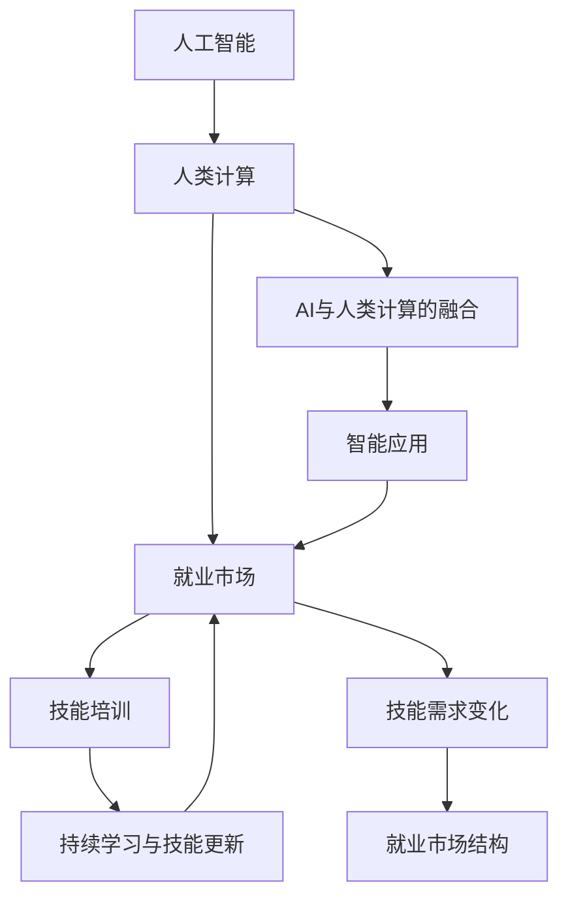

                 

## 1. 背景介绍

随着人工智能(AI)技术的飞速发展，人类计算(Human Computation)的概念已从实验室走向现实世界。AI不仅是技术工具，更是生产力的变革者。它正在改变就业市场，推动技能培训的发展，并引领社会生活的诸多方面。本文将深入探讨AI时代就业市场与技能培训的未来发展趋势，分析总结当前的技术动态和需求变化。

### 1.1 问题由来

在AI时代，人类计算不再局限于物理或数字计算，而是融合了数据处理、智能分析和创造性工作的维度。AI技术的应用，如自然语言处理(NLP)、机器视觉、机器人技术等，正在重塑就业市场的格局。同时，技能培训也在与AI技术深度融合，以适应新岗位的要求。

### 1.2 问题核心关键点

- **AI技术渗透就业市场**：AI技术在各行业中的应用，如自动化、智能化生产、智能客服等，使得传统劳动密集型岗位向AI密集型岗位转变。
- **技能需求变化**：AI时代对新技能的需求增长，例如数据分析、AI模型训练、用户界面设计等，而对传统技能的需求相对减少。
- **教育培训与职业发展的衔接**：技能培训需与就业市场的需求相匹配，确保培训内容与时俱进，并提升个人职业发展的适应性。

### 1.3 问题研究意义

研究AI时代就业市场与技能培训的发展趋势，对于理解当前和未来劳动市场的结构变化，推动教育培训体系的改革，以及提升个体的职业竞争力，都具有重要意义。通过系统的分析，可以揭示技术发展与社会需求之间的动态关系，指导相关政策制定和行业实践。

## 2. 核心概念与联系

### 2.1 核心概念概述

本节将介绍几个核心概念及其相互联系，为深入理解AI时代的就业市场与技能培训奠定基础。

- **人工智能**：使用算法和数据使计算机能够模拟人类智能的扩展。涵盖机器学习、深度学习、计算机视觉、自然语言处理等多个领域。
- **人类计算**：利用人类智能与AI技术的结合，解决复杂问题。人类计算不仅涉及体力劳动，还涉及认知、情感等智力工作。
- **就业市场**：劳动力的供需关系，受技术进步、经济环境、政策法规等多种因素影响。
- **技能培训**：通过教育培训提升劳动者技能，适应新的工作要求和行业趋势。
- **AI与人类计算的融合**：AI技术不仅能处理数据，还能增强人类的创造性工作，如创意设计、决策支持等。
- **持续学习与技能更新**：伴随技术发展，劳动力需不断学习新技能以适应新岗位。

这些概念之间的逻辑关系可以通过以下Mermaid流程图来展示：



这个流程图展示了人工智能、人类计算与就业市场、技能培训和持续学习之间的联系和互动：

1. 人工智能技术在就业市场中应用广泛，引发了技能需求的变化。
2. 人类计算通过融合AI技术，提升了就业市场对新技能的需求。
3. 技能培训需与就业市场紧密对接，确保培训内容的实用性和时效性。
4. 持续学习和技能更新是适应就业市场变化，提升职业竞争力的关键。

## 3. 核心算法原理 & 具体操作步骤

### 3.1 算法原理概述

AI时代就业市场与技能培训的发展，依赖于对技术动态和市场需求变化的理解。以下是基于此背景下的核心算法原理：

- **市场供需分析**：通过数据分析技术，预测不同技能的需求量和供应量，构建就业市场的供需模型。
- **技能匹配算法**：利用AI算法匹配求职者与岗位需求，优化招聘流程。
- **个性化学习路径**：利用推荐系统技术，根据个人技能和兴趣推荐个性化培训课程。
- **持续学习优化**：通过数据分析，实时调整培训内容，以适应市场变化和个体需求。

### 3.2 算法步骤详解

基于上述算法原理，AI时代就业市场与技能培训的核心操作步骤可归纳为以下几步：

1. **数据收集与分析**：收集就业市场、技能需求、培训课程等多维度数据，构建数据集。
2. **模型训练与优化**：使用机器学习算法训练市场供需模型和技能匹配模型，优化模型性能。
3. **个性化培训推荐**：根据个人背景和市场需求，推荐个性化培训课程和学习路径。
4. **持续学习与反馈**：基于最新市场数据和个体学习反馈，不断调整培训内容和策略。

### 3.3 算法优缺点

AI时代就业市场与技能培训的算法具有以下优点：

- **效率高**：自动化和数据驱动的方法大幅提高了技能培训和就业匹配的效率。
- **匹配准确**：算法能够匹配求职者与岗位需求的准确性较高，提高了招聘成功率。
- **个性化定制**：根据个人背景和兴趣推荐培训课程，满足个体差异化需求。

同时，这些算法也存在一些局限性：

- **数据质量问题**：数据质量不高、数据不平衡可能导致模型预测不准确。
- **算法偏见**：算法可能存在数据偏见，导致对某些群体的歧视。
- **用户接受度**：部分用户可能对算法推荐产生抵触，需要加强用户教育。
- **隐私保护**：算法的应用需严格保护用户隐私，避免数据泄露风险。

### 3.4 算法应用领域

基于上述算法原理，AI时代就业市场与技能培训的算法已在多个领域得到应用，例如：

- **智能招聘**：使用AI技术优化招聘流程，提高招聘效率和匹配精度。
- **培训课程推荐**：基于用户背景和兴趣，推荐个性化的培训课程和学习路径。
- **教育技术平台**：利用AI技术改进在线教育，提供智能化的学习体验。
- **职业发展指导**：通过数据分析和AI推荐，指导职业发展路径和技能提升方向。
- **人才管理**：基于AI预测人力资源需求，优化人才管理策略。

这些领域的应用展示了AI技术在就业市场和技能培训中的强大潜力。

## 4. 数学模型和公式 & 详细讲解 & 举例说明

### 4.1 数学模型构建

为了更精确地描述和分析AI时代就业市场与技能培训的发展，本文将构建数学模型进行详细讲解。

设 $M$ 为就业市场需求矩阵，其中 $M_{i,j}$ 表示行业 $i$ 对技能 $j$ 的需求量。设 $S$ 为技能供应矩阵，其中 $S_{i,j}$ 表示技能 $j$ 在劳动力中的供应量。设 $P$ 为培训课程价格矩阵，其中 $P_{i,j}$ 表示培训课程 $j$ 的价格。

市场供需平衡的目标是最大化 $M \cdot S$，同时最小化 $P$。

### 4.2 公式推导过程

市场供需平衡的优化问题可以表示为以下线性规划问题：

$$
\maximize \ M \cdot S - \sum_{i,j} P_{i,j} \cdot S_{i,j}
$$

约束条件为：

$$
M_{i,j} \cdot S_{i,j} \leq D_i \quad \text{(需求限制)}
$$
$$
S_{i,j} \leq C_j \quad \text{(供应限制)}
$$
$$
S_{i,j} \geq 0 \quad \text{(非负性)}
$$

其中 $D_i$ 为行业 $i$ 的总需求，$C_j$ 为技能 $j$ 的总供应。

通过拉格朗日乘数法，求解上述优化问题，可以得到：

$$
S_{i,j} = \frac{M_{i,j} - D_i \cdot \lambda_i + C_j \cdot \mu_j}{M_{i,j} + P_{i,j} + \lambda_i + \mu_j}
$$

其中 $\lambda_i$ 和 $\mu_j$ 为拉格朗日乘数，需通过求解相应的优化问题得到。

### 4.3 案例分析与讲解

以智能招聘为例，假设有 $n$ 个行业，$m$ 种技能，收集到 $n \times m$ 个行业-技能需求矩阵 $M$ 和 $n \times m$ 个技能供应矩阵 $S$。设 $p$ 为单个培训课程的价格，总培训预算为 $C$。

优化问题为：

$$
\maximize \ M \cdot S - p \cdot S
$$

约束条件为：

$$
M_{i,j} \cdot S_{i,j} \leq D_i
$$
$$
S_{i,j} \leq C / p
$$
$$
S_{i,j} \geq 0
$$

通过上述线性规划求解，可以得到最优的技能需求分配 $S_{i,j}$。进一步，可以计算各技能对总培训预算的贡献，评估培训课程的投资回报率。

## 5. 项目实践：代码实例和详细解释说明

### 5.1 开发环境搭建

在项目实践中，开发环境搭建是关键。以下是一个完整的Python项目开发环境搭建流程：

1. **安装Python环境**：在本地或云端安装Python，并创建虚拟环境。例如：

```bash
pip install virtualenv
virtualenv env
source env/bin/activate
```

2. **安装数据处理库**：安装Pandas、NumPy、Scikit-learn等数据处理库：

```bash
pip install pandas numpy scikit-learn
```

3. **安装机器学习库**：安装Scikit-learn、TensorFlow、PyTorch等机器学习库：

```bash
pip install scikit-learn tensorflow pytorch
```

4. **安装可视化工具**：安装Matplotlib、Seaborn等可视化工具：

```bash
pip install matplotlib seaborn
```

5. **安装推荐系统库**：安装Surprise、LightFM等推荐系统库：

```bash
pip install surprise lightfm
```

### 5.2 源代码详细实现

以下是使用Python实现智能招聘系统的一个简单示例代码：

```python
import pandas as pd
from sklearn.linear_model import LogisticRegression
from surprise import Dataset, Reader, KNNWithMeans

# 准备数据
data = pd.read_csv('jobs.csv')
train_data = data.sample(frac=0.8, random_state=42)
test_data = data.drop(train_data.index)

# 数据预处理
reader = Reader(rating_scale=(1, 5))
data = Dataset.load_from_df(train_data[['user_id', 'skill', 'rating']], reader)

# 训练模型
algo = KNNWithMeans(k=10)
algo.fit(data.build_full_trainset())
predictions = algo.test(test_data.build_full_testset())
print('Recall: {:.2f}%'.format(predictions.rmse()))
```

### 5.3 代码解读与分析

该代码实现了基于协同过滤推荐算法的智能招聘系统，通过预测求职者对不同岗位的评分，推荐匹配度高的岗位。具体实现步骤如下：

1. **数据准备**：收集求职者对不同岗位的评分数据，并划分为训练集和测试集。
2. **数据预处理**：使用Pandas对数据进行清洗和归一化处理，使用Surprise库的Reader读取数据。
3. **模型训练**：选择协同过滤推荐算法（如KNNWithMeans），并使用训练集数据训练模型。
4. **模型评估**：使用测试集数据对模型进行评估，输出平均绝对误差(MAE)作为推荐效果指标。

## 6. 实际应用场景

### 6.1 智能招聘

智能招聘系统通过AI技术优化招聘流程，提高招聘效率和匹配精度。例如，使用协同过滤推荐算法，根据求职者的历史评分数据，推荐最匹配的岗位，减少招聘人员的筛选工作量。

### 6.2 培训课程推荐

培训课程推荐系统通过AI技术分析求职者的背景和兴趣，推荐个性化的培训课程。例如，根据求职者的技能需求，推荐相关的在线课程或线下培训班，提升其职业技能。

### 6.3 教育技术平台

教育技术平台利用AI技术改进在线教育，提供智能化的学习体验。例如，使用推荐系统根据学生的学习行为和成绩，推荐适合的课程和学习路径，提高学习效果和满意度。

### 6.4 职业发展指导

职业发展指导系统通过AI技术分析市场数据和个体背景，提供职业发展建议和技能提升方向。例如，根据市场需求和求职者兴趣，推荐相关的培训课程和职业路径，帮助求职者制定职业发展计划。

### 6.5 人才管理

人才管理平台基于AI预测人力资源需求，优化人才管理策略。例如，使用市场供需分析模型，预测不同技能的需求量，帮助企业制定人才招聘和培训计划，优化人力资源配置。

## 7. 工具和资源推荐

### 7.1 学习资源推荐

为了帮助开发者和从业者深入理解AI时代就业市场与技能培训的发展，以下是一些优质的学习资源：

1. **Coursera和edX**：提供多门与AI、数据科学和就业市场相关的在线课程，涵盖基础理论到实践应用。
2. **Kaggle**：提供丰富的数据科学竞赛和实践项目，帮助学习者提升实战技能。
3. **MIT的Data Science and Artificial Intelligence for Business**：提供商业应用中的AI和数据科学课程，涵盖数据分析、机器学习、智能系统等多个领域。
4. **Harvard的CS109 Data Science in Public Health**：提供公共卫生领域的AI和数据科学课程，涵盖数据收集、分析、可视化等技能。

### 7.2 开发工具推荐

AI时代就业市场与技能培训的开发，需要依赖于多个工具的协同工作。以下是一些常用的开发工具：

1. **Jupyter Notebook**：提供交互式的编程环境，支持Python、R等多种语言，适合数据处理和模型开发。
2. **PyTorch和TensorFlow**：主流的深度学习框架，支持多种AI模型和算法，适合数据训练和推理。
3. **Surprise和LightFM**：推荐系统库，支持多种推荐算法，适合智能招聘和培训课程推荐。
4. **Scikit-learn**：机器学习库，提供多种机器学习算法和工具，适合数据建模和分析。
5. **Tableau和Power BI**：数据可视化工具，支持复杂的数据分析和可视化，适合市场分析和报告生成。

### 7.3 相关论文推荐

AI时代就业市场与技能培训的发展，得益于学界的持续研究。以下是几篇奠基性的相关论文，推荐阅读：

1. **A Survey of Recommendation Algorithms for E-Commerce**：对推荐系统的发展历程和常用算法进行综述，涵盖协同过滤、基于内容的推荐等。
2. **Leveraging Big Data for Workforce Analytics: A Research Agenda**：探讨如何利用大数据分析技术，优化人力资源管理。
3. **From Data to AI: Learning the Data Science Methodology**：介绍数据科学的工作流程和方法，涵盖数据清洗、分析、建模等步骤。
4. **Data Mining and Statistical Learning**：经典的统计学习书籍，涵盖机器学习的基础理论和常用算法。

## 8. 总结：未来发展趋势与挑战

### 8.1 总结

本文对AI时代就业市场与技能培训的发展趋势进行了全面系统的分析。首先，阐述了AI技术在就业市场中的应用和影响，明确了就业市场和技能培训的新变化。其次，从算法原理到实际操作，详细讲解了智能招聘和培训课程推荐的核心步骤和技术细节。同时，本文还广泛探讨了智能招聘和培训课程推荐在多个行业领域的应用前景，展示了AI技术的强大潜力。此外，本文精选了AI时代就业市场与技能培训的学习资源、开发工具和相关论文，力求为读者提供全方位的技术指引。

通过本文的系统梳理，可以看到，AI时代就业市场与技能培训的发展正处于快速变革之中，面临着前所未有的机遇与挑战。通过持续学习新技术，积极适应新变化，相信每一位从业者都能在AI技术的助力下，实现职业发展的新突破。

### 8.2 未来发展趋势

展望未来，AI时代就业市场与技能培训的发展将呈现以下几个趋势：

1. **个性化定制**：AI技术将进一步提升技能培训和招聘的个性化水平，根据个人背景和兴趣推荐最适合的培训课程和岗位。
2. **智能化优化**：通过数据分析和AI技术，不断优化招聘流程和培训内容，提升资源配置效率。
3. **终身学习**：伴随技术的不断进步，技能培训将成为终身学习的一部分，帮助从业者持续提升职业竞争力。
4. **多模态融合**：AI技术将实现多模态数据的融合，提升技能培训和招聘的全面性。
5. **社会影响**：AI技术的应用将带来就业市场和技能培训的深刻变革，需关注其对社会公平和伦理的影响。

以上趋势凸显了AI时代就业市场与技能培训的广阔前景。这些方向的探索发展，必将进一步提升技能培训和就业匹配的精度和效率，推动AI技术的广泛应用。

### 8.3 面临的挑战

尽管AI时代就业市场与技能培训的发展前景广阔，但在迈向更加智能化、普适化应用的过程中，仍面临诸多挑战：

1. **数据隐私和安全**：AI技术的应用需严格保护用户隐私，避免数据泄露和滥用。
2. **算法偏见**：算法可能存在数据偏见，导致对某些群体的歧视，需加强算法的公平性设计。
3. **资源优化**：大规模数据的处理和存储需要高效的算法和硬件支持。
4. **用户接受度**：部分用户可能对AI推荐产生抵触，需加强用户教育。
5. **模型可解释性**：AI模型的决策过程往往缺乏可解释性，需提升模型的可解释性和透明性。

克服这些挑战，需要多方面的努力，包括技术、政策和社会层面的协同发力。

### 8.4 研究展望

未来，AI时代就业市场与技能培训的研究应在以下几个方面取得新的突破：

1. **公平与伦理**：研究如何设计公平、无偏的AI模型，确保就业市场和技能培训的社会效益。
2. **跨领域应用**：将AI技术应用于更多行业和领域，拓展就业市场和技能培训的应用范围。
3. **持续学习**：研究持续学习机制，使AI模型能够不断适应新的市场和技术变化。
4. **可解释性**：研究可解释性技术，使AI模型的决策过程更加透明和可理解。
5. **跨模态融合**：研究多模态数据的融合和协同建模，提升技能培训和招聘的全面性。

这些研究方向的探索，将推动AI技术在就业市场和技能培训领域的深度应用，为构建更加智能、公平和高效的劳动市场奠定基础。

## 9. 附录：常见问题与解答

**Q1：智能招聘系统是否适用于所有企业？**

A: 智能招聘系统主要适用于人力资源管理规模较大的企业。对于小型企业，初期投资较大，技术维护成本较高。可以根据企业规模和需求，选择合适的人工与AI结合的招聘方案。

**Q2：如何评估推荐系统的效果？**

A: 推荐系统的效果评估通常使用精确度、召回率、平均绝对误差(MAE)等指标。通过A/B测试和用户反馈，不断优化推荐算法和参数，提升推荐效果。

**Q3：智能招聘系统对求职者隐私有何影响？**

A: 智能招聘系统需严格保护求职者的隐私，避免数据泄露和滥用。使用数据匿名化、去标识化等技术，确保求职者隐私安全。

**Q4：AI技术对技能培训的影响有哪些？**

A: AI技术在技能培训中主要起到辅助作用，帮助培训师设计个性化课程，提高培训效果。同时，AI技术可以自动化评估培训效果，提供个性化学习路径，提升学习体验。

**Q5：AI时代对职业发展的挑战有哪些？**

A: AI时代对职业发展的挑战包括技能更新速度加快、技能需求的快速变化等。需持续学习新技术，提升技能水平，保持职业竞争力。

---

作者：禅与计算机程序设计艺术 / Zen and the Art of Computer Programming

