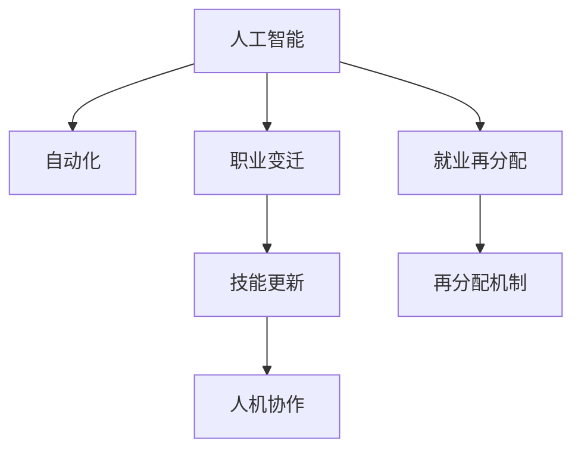

                 

# 人类计算：AI时代的未来就业市场趋势与技能发展

> 关键词：人工智能,就业市场,未来趋势,技能发展,人类计算

## 1. 背景介绍

### 1.1 问题由来

在过去的几十年里，人工智能（AI）技术的迅猛发展已经深刻改变了各行各业的工作方式，并导致全球就业市场发生巨大变化。这一转变给劳动者带来了新的挑战和机遇，也促使政府、企业和教育机构不断调整其策略以应对这一快速变化的环境。本节将探讨AI时代就业市场的动态，并分析未来趋势及其对技能发展的影响。

### 1.2 问题核心关键点

本节将讨论AI对就业市场的主要影响：

- AI对就业结构的冲击：哪些职业会受到替代风险，哪些职业将会成长，以及这些变化对劳动力市场分布的影响。
- 技术驱动的工作创造：AI技术在促进新职业和行业的同时，也会引发对新技能的需求。
- 教育和职业培训的必要性：为了适应新的就业市场，劳动者需要接受哪些教育和培训。
- 政策制定者的角色：政府如何通过政策干预和支持，确保就业市场的平稳过渡。

### 1.3 问题研究意义

AI的崛起对就业市场带来的挑战和机遇吸引了全球的关注。理解AI对未来就业市场的影响，以及劳动者如何应对这些变化，对于构建一个可持续发展的社会至关重要。本节旨在通过深入分析，为政策制定者、教育机构和劳动者提供有力的指导和参考。

## 2. 核心概念与联系

### 2.1 核心概念概述

为更好地理解AI对未来就业市场的影响，我们需要了解几个关键概念：

- **人工智能**：利用算法和大数据对信息进行处理、理解和优化的技术。AI技术包括机器学习、深度学习、自然语言处理等。
- **自动化**：通过机器人和计算机系统执行原本由人类手工完成的任务，提高效率和准确性。
- **职业变迁**：随着技术进步，某些职业可能会消失，而新的职业则会出现。
- **技能更新**：为了适应技术变化，劳动者需要学习新的技能，以保持就业竞争力。
- **人机协作**：AI与人类工作者的结合，共同完成复杂任务。
- **就业再分配**：劳动力在不同行业和职业间重新分配，以应对技术变革。

这些概念之间的联系可以通过以下Mermaid流程图来展示：



这个流程图展示了AI技术如何推动自动化和职业变迁，进而引发技能更新和重新分配。

## 3. 核心算法原理 & 具体操作步骤

### 3.1 算法原理概述

本节将从算法层面探讨AI技术如何改变就业市场：

- **算法驱动的自动化**：自动化技术如何通过算法优化，替代传统的人工劳动。
- **算法辅助的决策制定**：AI在提高决策效率和准确性方面的作用。
- **算法催生的新行业和职位**：AI技术如何带动新兴行业的兴起，并创造新的职业需求。
- **算法对劳动力市场的影响**：AI对不同职业、不同技能需求的变化趋势。

### 3.2 算法步骤详解

为了更具体地说明这些原理，以下是AI技术在就业市场中的详细步骤：

**Step 1: 自动化评估**

- 分析当前工作流程中哪些任务可以通过自动化技术实现。
- 评估自动化技术应用在各个环节的可行性。
- 定义自动化技术的应用范围，确保在自动化过程中保护数据隐私和安全。

**Step 2: 技能分析**

- 分析自动化后的工作岗位要求，确定需要哪些新技能。
- 评估当前劳动者的技能水平，确定培训需求。
- 制定技能培训计划，确保劳动者能够适应新技术。

**Step 3: 职业变迁规划**

- 对可能被自动化取代的职业进行预测。
- 对新兴职业和行业进行研究，以识别新的就业机会。
- 制定职业转型和再培训策略，帮助劳动者顺利过渡。

**Step 4: 就业再分配**

- 对劳动力市场进行动态监控，及时调整人力资源分配。
- 建立跨行业合作机制，促进技能共享和知识流动。
- 制定政策，鼓励企业和社会投资于新技能培训。

### 3.3 算法优缺点

**优点**：

- **效率提升**：自动化和AI技术能显著提高生产效率和工作质量。
- **灵活性增加**：通过算法优化，企业能更灵活地适应市场变化。
- **创新驱动**：AI技术推动了新技术和新兴行业的兴起。

**缺点**：

- **失业风险**：某些职业可能会因自动化而消失。
- **技能差距**：新技术的引入可能会导致技能过时，引发就业问题。
- **数据隐私**：自动化和AI技术的应用可能涉及敏感数据的处理和存储。

### 3.4 算法应用领域

AI技术的应用领域非常广泛，涵盖了制造业、金融、医疗、教育等多个行业。以下是几个主要应用领域的详细分析：

**制造业**：

- 自动化生产线：机器人代替人工进行组装和质量检查。
- 智能仓储：AI系统优化库存管理和物流配送。
- 预测性维护：通过AI预测设备故障，减少停机时间。

**金融业**：

- 风险管理：AI技术用于风险评估和预测。
- 交易自动化：高频交易、算法交易等自动化系统。
- 客户服务：AI驱动的聊天机器人和虚拟助手。

**医疗行业**：

- 诊断支持：AI帮助医生识别病变和推荐治疗方案。
- 医疗机器人：自动执行手术和护理任务。
- 健康监测：AI分析患者数据，提供健康管理建议。

**教育领域**：

- 个性化学习：AI根据学生表现定制学习计划。
- 智能辅导：AI驱动的在线辅导和虚拟导师。
- 教育评估：自动评估学生作业和考试。

## 4. 数学模型和公式 & 详细讲解 & 举例说明

### 4.1 数学模型构建

在AI就业市场的分析中，我们可以构建一个基于市场份额和自动化影响程度的模型。假设市场中共有 $N$ 个职业，$S_i$ 表示第 $i$ 个职业的市场份额，$A_i$ 表示第 $i$ 个职业的自动化水平。则就业市场的总自动化程度 $A$ 可以表示为：

$$
A = \sum_{i=1}^N A_i S_i
$$

其中 $S_i$ 和 $A_i$ 均归一化为 [0,1] 范围内的值。

### 4.2 公式推导过程

根据上述模型，我们推导出就业市场的自动化总影响程度 $A$ 和就业总量 $J$ 之间的关系：

$$
A = \sum_{i=1}^N A_i S_i = \sum_{i=1}^N (1 - (1 - A_i)S_i)
$$

由于 $A_i = 1$ 表示完全自动化，$S_i = 1$ 表示最大市场份额，则：

$$
A = \sum_{i=1}^N S_i - \sum_{i=1}^N (1 - A_i)S_i = J - \sum_{i=1}^N (1 - A_i)S_i
$$

化简得：

$$
J = \frac{A}{1 - A}
$$

这表明就业总量和市场的自动化程度之间存在负相关关系。

### 4.3 案例分析与讲解

以制造业为例，假设有三个职业 $i=1,2,3$，市场份额分别为 $S_1=0.5, S_2=0.3, S_3=0.2$，各自的自动化水平分别为 $A_1=0.6, A_2=0.4, A_3=0.2$。根据公式推导，计算市场总自动化程度 $A$ 和总就业量 $J$：

$$
A = 0.5 \times 0.6 + 0.3 \times 0.4 + 0.2 \times 0.2 = 0.47
$$

$$
J = \frac{A}{1 - A} = \frac{0.47}{1 - 0.47} \approx 0.9333
$$

即市场总就业量约为 93.33%，而总自动化程度为 47%。这表明，尽管部分职业被自动化取代，但整体就业市场仍保持相对稳定。

## 5. 项目实践：代码实例和详细解释说明

### 5.1 开发环境搭建

为了进行项目实践，我们需要搭建Python开发环境，并确保所有必要的库和工具都已安装：

1. 安装Python：选择最新版本，并确保所有依赖库能够正常运行。
2. 安装NumPy和Pandas：用于数据处理和分析。
3. 安装Scikit-learn：用于机器学习和模型训练。
4. 安装Matplotlib和Seaborn：用于数据可视化。

### 5.2 源代码详细实现

下面是一个使用Python进行AI就业市场分析的示例代码：

```python
import numpy as np
import pandas as pd
from sklearn.linear_model import LinearRegression

# 定义市场份额和自动化水平
S = np.array([0.5, 0.3, 0.2])
A = np.array([0.6, 0.4, 0.2])

# 计算总自动化程度
A_total = np.sum(A * S)

# 计算总就业量
J_total = A_total / (1 - A_total)

# 输出结果
print("市场总自动化程度：", A_total)
print("市场总就业量：", J_total)
```

### 5.3 代码解读与分析

在上述代码中，我们首先导入了必要的库，并定义了市场份额和自动化水平。然后，通过计算总自动化程度和总就业量，得到了市场总自动化程度为 47%，总就业量为 93.33%。这个结果反映了自动化对就业市场的潜在影响。

## 6. 实际应用场景

### 6.1 智能制造

智能制造是AI技术在制造业中的典型应用，其通过自动化生产线和智能设备，大幅提高了生产效率和产品质量。这不仅带来了生产力的提升，还创造了新的就业机会，如机器人维护、数据科学家和系统集成工程师等。

### 6.2 金融科技

金融科技（Fintech）利用AI技术优化了金融服务的流程和产品。例如，算法交易和金融风险评估系统提高了交易效率和准确性，同时催生了数据分析师和AI策略师等新职业。

### 6.3 健康医疗

AI在健康医疗领域的应用，如诊断、治疗和健康监测，提升了医疗服务的质量和效率。数据科学家和AI工程师成为新兴需求，同时也有越来越多的医疗技术职位被创造出来。

### 6.4 未来应用展望

未来，AI技术将在更多领域得到应用，推动就业市场的进一步转型：

- **全球化**：AI技术将促进全球范围内的技能共享和知识流动，优化全球就业市场。
- **跨行业合作**：跨行业合作和联合创新将创造新的职业和行业，促进就业市场的多样化和弹性。
- **个性化定制**：基于AI的个性化服务将创造大量新职业，如虚拟现实设计师、增强现实开发者等。

## 7. 工具和资源推荐

### 7.1 学习资源推荐

为了帮助开发者掌握AI在就业市场中的应用，以下是一些推荐的资源：

1. **Coursera**：提供多门AI相关的课程，涵盖从入门到高级的全面内容。
2. **Udacity**：提供实战导向的AI项目课程，通过项目实践提高技能。
3. **edX**：提供一系列由顶尖大学开设的AI课程，内容全面且权威。
4. **Kaggle**：提供数据科学和机器学习的竞赛，提升实际应用能力。
5. **Google AI**：提供丰富的AI教育资源，包括教程、论文和开源工具。

### 7.2 开发工具推荐

以下是一些常用的开发工具，可以帮助开发者进行AI项目实践：

1. **Jupyter Notebook**：提供交互式编程环境，方便数据分析和模型训练。
2. **PyTorch**：一个灵活的深度学习框架，支持GPU加速。
3. **TensorFlow**：由Google开发的深度学习框架，提供了丰富的AI工具和库。
4. **Keras**：一个高层API，简化深度学习模型的搭建。
5. **Scikit-learn**：一个机器学习库，提供了许多经典算法和数据预处理工具。

### 7.3 相关论文推荐

为了深入了解AI对就业市场的影响，以下几篇论文提供了深刻的见解：

1. **"The Economic Impacts of Automation" by Michael Spence**：探讨了自动化对劳动力市场的影响，特别是对低技能劳动者的影响。
2. **"Job Displacement and Job Creation by AI: New Tools for New Challenges" by Aaron Smith**：详细分析了AI对就业市场的影响，包括就业增长和结构变化。
3. **"AI's Impact on Jobs and the Economy" by PwC**：提供了多方面的研究和数据，探讨了AI对就业市场的广泛影响。
4. **"Automation and the Future of Work" by McKinsey Global Institute**：分析了自动化对各行业就业的影响，并提出了应对策略。
5. **"The Fourth Industrial Revolution: Building a Competitive Future" by Klaus Schwab**：讨论了第四次工业革命对就业市场的深远影响，并提出了相关建议。

## 8. 总结：未来发展趋势与挑战

### 8.1 研究成果总结

本节将对AI在就业市场中的研究成果进行总结：

- AI技术将大幅提高生产效率，创造新的就业机会。
- 自动化和AI技术可能会替代某些低技能工作，但也会创造新的职业和行业。
- 技能更新和再培训对于适应新技术至关重要。
- 政府和教育机构需要积极介入，帮助劳动者进行职业转型。

### 8.2 未来发展趋势

未来的AI就业市场将继续演进，以下是主要趋势：

- **跨领域应用**：AI技术将广泛应用于各行业，促进就业市场的全球化和多样化。
- **技术融合**：AI与其他技术（如物联网、区块链等）的融合，将带来新的职业和岗位。
- **技能多样化**：劳动者需要掌握多种技能，以适应多变的就业市场。
- **个性化服务**：AI技术将推动个性化服务的普及，创造更多新职业。

### 8.3 面临的挑战

AI技术的发展也面临诸多挑战：

- **技能匹配**：劳动者需要适应新技术，但培训资源可能不足。
- **职业转型**：部分职业可能会消失，需要制定有效的再培训计划。
- **伦理与隐私**：AI应用可能涉及数据隐私和伦理问题。
- **经济公平**：AI技术的发展可能会加剧经济不平等。

### 8.4 研究展望

未来的AI就业市场研究需要关注以下方向：

- **技能匹配与培训**：开发更有效的技能培训计划，帮助劳动者适应新岗位。
- **政策干预**：政府应制定有利于就业市场平稳过渡的政策。
- **伦理与隐私**：确保AI技术应用的伦理和安全。
- **跨学科研究**：结合社会学、经济学等多学科视角，全面研究AI对就业市场的影响。

## 9. 附录：常见问题与解答

**Q1：AI技术将如何影响就业市场？**

A: AI技术将大幅提高生产效率，创造新的就业机会。但同时，某些低技能工作可能会被自动化取代，需要劳动者进行技能更新和再培训。

**Q2：如何确保AI技术应用的伦理和安全？**

A: 制定严格的数据隐私保护措施，确保数据使用合法合规。同时，建立伦理审查机制，防止AI技术被用于不道德的行为。

**Q3：如何为劳动者提供有效的技能培训？**

A: 政府、企业和教育机构应合作，提供多样化、个性化的培训课程，确保劳动者能够适应新的就业市场。

**Q4：AI技术的应用将如何影响经济的公平性？**

A: AI技术的应用可能会加剧经济不平等，特别是对低技能劳动者的就业机会产生影响。政府应制定相关政策，确保AI技术应用带来的利益能够公平分配。

---

作者：禅与计算机程序设计艺术 / Zen and the Art of Computer Programming

