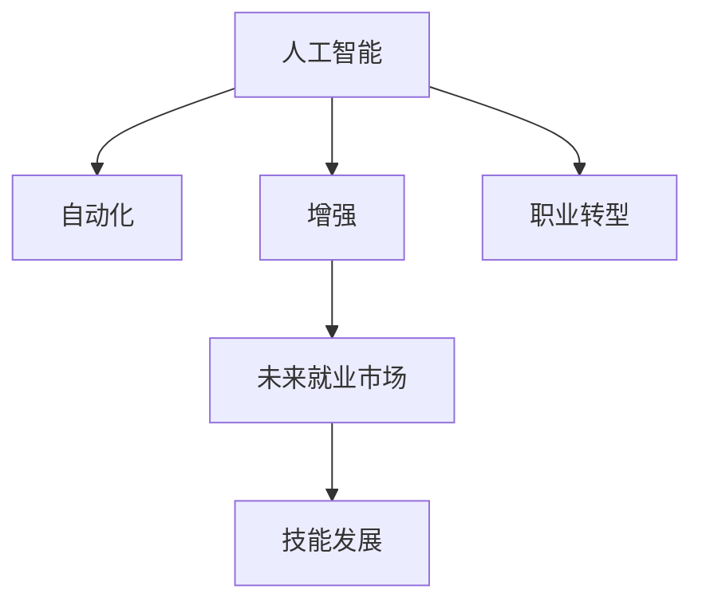

                 

# 人类计算：AI时代的未来就业市场趋势与技能发展

> 关键词：人工智能,自动化,未来就业,技能发展,劳动市场,职业转型

## 1. 背景介绍

### 1.1 问题由来
随着人工智能(AI)技术的快速发展，尤其是机器学习和深度学习技术的突破，AI已经开始在各行各业中广泛应用。从制造业的自动化生产线，到金融行业的智能投顾；从医疗领域的精准诊断，到媒体领域的智能内容生成，AI技术正逐步改变着我们的生产生活方式。然而，这一进程也带来了一系列就业市场的深远影响，引发了关于未来就业趋势和技能发展的广泛讨论。

### 1.2 问题核心关键点
AI技术的应用主要体现在两个方面：自动化和增强。自动化导致传统需要人工介入的任务逐渐被机器取代，而增强则意味着AI技术为人类提供了更高效的工具，提升了工作效率和质量。这些变化将对就业市场产生双重影响：一方面，某些低技能劳动岗位可能被自动化取代；另一方面，新的AI相关岗位和技能需求将不断涌现，要求劳动力市场进行调整以适应这一变化。

### 1.3 问题研究意义
理解AI时代就业市场的趋势与技能需求，对于政策制定者、教育机构、以及劳动者本身都具有重要意义：
- 政策制定者需制定适应未来就业市场的政策，如再培训、就业转换计划等。
- 教育机构需调整课程设置，培养符合未来需求的新型人才。
- 劳动者需提前准备，提升自身技能，以适应未来工作环境的变化。

本文将重点探讨AI技术如何影响未来就业市场，以及劳动者应如何发展技能以适应这些变化。

## 2. 核心概念与联系

### 2.1 核心概念概述

为更好地理解AI技术对就业市场的影响，本节将介绍几个关键概念：

- **人工智能(AI)**：通过模拟人类智能过程的技术体系，包括机器学习、深度学习、自然语言处理、计算机视觉等子领域。
- **自动化**：通过机器和算法自动执行原本由人类完成的任务，降低人工成本，提升效率。
- **增强**：通过AI技术为人类提供更高效率的工具，增强人类工作的质量和效果。
- **未来就业市场**：指在AI技术广泛应用背景下的劳动市场，其结构、需求、供求关系等都将发生显著变化。
- **技能发展**：指在AI时代，劳动者需具备的新技能和能力，包括技术技能、跨学科能力、软技能等。
- **职业转型**：指劳动者基于就业市场变化，从原有岗位向新岗位的过渡和转换过程。

这些概念之间的逻辑关系可以通过以下Mermaid流程图来展示：



这个流程图展示了大语言模型的核心概念及其之间的关系：

1. AI技术推动自动化和增强，带来就业市场结构性变化。
2. 未来的就业市场将更加注重技能发展，而非单纯的劳动力供应。
3. 职业转型将成为劳动者适应新就业环境的重要路径。

## 3. 核心算法原理 & 具体操作步骤

### 3.1 算法原理概述

AI技术对就业市场的影响，主要通过以下几个机制来实现：

1. **自动化替代低技能工作**：通过机器学习算法和自动化流程，替代那些重复性强、可程序化的低技能工作。
2. **增强工具提升工作效率**：AI技术为人类提供高效的工具，提升工作效率和质量，同时创造新的岗位需求。
3. **数据驱动决策**：AI技术通过对海量数据的分析，辅助企业决策，优化业务流程，提升整体竞争力。

### 3.2 算法步骤详解

以下是AI技术影响就业市场的主要步骤：

**Step 1: 识别自动化和增强机会**
- 分析当前业务流程，识别可以自动化或增强的环节。
- 利用机器学习模型预测自动化替代的可能性，如通过RPA（机器人流程自动化）评估任务的可自动化程度。

**Step 2: 评估自动化和增强的影响**
- 评估自动化和增强对就业市场的影响，包括岗位的消失和新增。
- 预测自动化和增强后，企业生产成本的变化和盈利能力的提升。

**Step 3: 制定技能发展计划**
- 分析未来就业市场对新技能的需求，如数据分析、编程、人工智能应用等。
- 制定教育培训计划，帮助劳动者提升相关技能。

**Step 4: 推动职业转型**
- 提供职业转换的资源和支持，如再培训、职业咨询等。
- 促进劳动者向高技能、高附加值岗位的过渡。

### 3.3 算法优缺点

AI技术在提升生产效率和经济效益的同时，也带来了一些问题和挑战：

**优点**：
- **提高生产力**：自动化和增强工具可以大幅提高生产效率和质量。
- **降低成本**：通过减少人工介入，降低企业的运营成本。
- **创造新岗位**：AI技术的应用也会带来新的岗位需求，如AI产品经理、数据科学家等。

**缺点**：
- **岗位消失风险**：自动化可能替代部分低技能岗位，导致失业风险。
- **技能差距**：新技能需求的快速增长，可能导致现有劳动力的技能不匹配。
- **伦理和隐私问题**：AI技术的使用可能引发隐私泄露、偏见歧视等伦理问题。

### 3.4 算法应用领域

AI技术对就业市场的影响广泛而深远，涉及多个领域：

- **制造业**：自动化生产线和机器人流程自动化，减少人工干预，提升生产效率。
- **服务业**：AI客服、智能推荐、数据分析等，增强服务质量和客户体验。
- **医疗**：智能诊断、个性化治疗、药物研发等，提升医疗服务的精准度和效率。
- **金融**：智能投顾、风险控制、欺诈检测等，优化金融决策，提升风险管理能力。
- **教育**：智能辅导、课程个性化、学习数据分析等，提升教育质量和效率。

这些领域中，AI技术的广泛应用，不仅带来了自动化和增强的机会，也带来了对新技能和岗位的需求。

## 4. 数学模型和公式 & 详细讲解  
### 4.1 数学模型构建

AI技术对就业市场的影响可以通过数学模型来刻画。以下是一个简化的模型框架：

设就业市场的劳动力总数为 $L$，其中低技能劳动力为 $L_{low}$，高技能劳动力为 $L_{high}$。AI技术的自动化和增强效果可以通过以下模型来描述：

$$
\begin{cases}
L_{new} = L_{low} - \alpha \cdot L_{low} \\
L_{old} = L_{high} + \beta \cdot L_{low}
\end{cases}
$$

其中，$\alpha$ 为自动化率，$\beta$ 为增强率。模型中假设低技能劳动力被自动化替代的比例为 $\alpha$，而高技能劳动力通过增强工具得到提升的比例为 $\beta$。$L_{new}$ 和 $L_{old}$ 分别表示新旧岗位的劳动力数量。

### 4.2 公式推导过程

通过上述模型，我们可以计算出新旧岗位的劳动力数量：

- 新岗位劳动力：
$$
L_{new} = L_{low} - \alpha \cdot L_{low} = L_{low}(1-\alpha)
$$
- 旧岗位劳动力：
$$
L_{old} = L_{high} + \beta \cdot L_{low} = L_{high} + \beta \cdot L_{low}
$$

由于劳动力总数 $L = L_{new} + L_{old}$，因此可以得到：

$$
L_{old} = L - L_{new} = L - L_{low}(1-\alpha)
$$

将 $L_{new}$ 和 $L_{old}$ 表达式代入上述等式，可以得到：

$$
L_{high} + \beta \cdot L_{low} = L - L_{low}(1-\alpha)
$$

化简后得到：

$$
L_{high} = L - (1-\alpha-\beta) \cdot L_{low}
$$

这意味着高技能劳动力将在就业市场中占主导地位，而低技能劳动力的减少比例将由 $\alpha$ 和 $\beta$ 决定。

### 4.3 案例分析与讲解

假设某行业总劳动力为10000人，其中低技能劳动力为5000人，高技能劳动力为5000人。自动化和增强率分别为 $\alpha=0.5$ 和 $\beta=0.3$。

- 新岗位劳动力：
$$
L_{new} = 5000(1-0.5) = 2500
$$
- 旧岗位劳动力：
$$
L_{old} = 5000 + 0.3 \cdot 5000 = 8500
$$

因此，未来该行业的就业市场将主要依赖高技能劳动力，低技能劳动力的减少比例为50%。这要求劳动者需要提升技能，以适应未来就业市场的需求。

## 5. 项目实践：代码实例和详细解释说明
### 5.1 开发环境搭建

在进行就业市场模拟和技能发展计划的制定时，我们需要一个高效的平台进行数据分析和模拟。以下是Python环境搭建的基本步骤：

1. 安装Python和相关的库，如NumPy、Pandas、Matplotlib等。
2. 安装Jupyter Notebook，用于编写和运行Python代码。
3. 安装相关数据分析库，如SciPy、scikit-learn等。
4. 安装机器学习库，如TensorFlow、PyTorch等。
5. 安装可视化工具，如Seaborn、Bokeh等，用于数据可视化。

### 5.2 源代码详细实现

以下是一个使用Python进行就业市场模拟的示例代码：

```python
import numpy as np
import pandas as pd
import matplotlib.pyplot as plt
from sklearn.linear_model import LinearRegression

# 设定初始参数
L_total = 10000
L_low = 5000
L_high = 5000
alpha = 0.5
beta = 0.3

# 计算新旧岗位劳动力数量
L_new = L_low * (1 - alpha)
L_old = L_high + beta * L_low

# 计算高技能劳动力数量
L_high_new = L_total - (1 - alpha - beta) * L_low

# 输出计算结果
print("新岗位劳动力数量：", L_new)
print("旧岗位劳动力数量：", L_old)
print("高技能劳动力数量：", L_high_new)
```

### 5.3 代码解读与分析

上述代码实现了就业市场模拟的基本过程，主要分为以下几个步骤：

1. **设定初始参数**：设定总劳动力数、低技能劳动力数、高技能劳动力数、自动化率、增强率。
2. **计算新旧岗位劳动力数量**：根据自动化和增强率计算新岗位劳动力数量和旧岗位劳动力数量。
3. **计算高技能劳动力数量**：根据总劳动力数和新旧岗位劳动力数量计算高技能劳动力数量。
4. **输出结果**：打印计算结果。

## 6. 实际应用场景

### 6.1 智能制造

智能制造的自动化和增强，正在逐步替代传统制造业中的大量低技能岗位。例如，智能生产线可以自动完成焊接、装配等任务，减少人工干预，提升生产效率。同时，智能管理系统通过数据分析，优化生产计划和库存管理，提高企业整体效率。这要求制造业工人需要掌握相关的自动化和增强工具，提升自身技能，适应新的工作环境。

### 6.2 金融服务

金融服务行业正在广泛应用AI技术，智能投顾、风险控制、欺诈检测等应用不断涌现。AI技术提高了金融决策的准确性和效率，同时也创造了新的岗位需求。例如，数据科学家、AI工程师、风险分析师等岗位需求大幅增加。这要求金融从业者提升数据分析和编程技能，以便更好地应对未来工作环境的变化。

### 6.3 医疗健康

AI技术在医疗健康领域的应用，包括智能诊断、个性化治疗、药物研发等。例如，AI辅助诊断系统可以辅助医生进行疾病诊断，提高诊断的准确性和效率。同时，AI技术也在医疗管理和数据分析中发挥重要作用。这要求医疗从业者掌握相关的AI应用技能，提升自身的技术水平。

## 7. 工具和资源推荐
### 7.1 学习资源推荐

为了帮助开发者和从业者提升技能，以下是一些优质的学习资源：

1. **Coursera和edX**：提供大量AI和机器学习课程，适合不同层次的学习者。
2. **Kaggle**：提供数据科学竞赛平台，通过实践提升技能。
3. **Udacity**：提供AI相关课程和纳米学位，系统学习AI技术。
4. **DeepLearning.AI**：由Andrew Ng教授创立的AI教育平台，提供多门AI课程。
5. **GitHub**：提供丰富的AI开源项目和代码示例，方便学习和实践。

### 7.2 开发工具推荐

高效的工具是提升工作效率和技能水平的重要保障。以下是几款常用的开发工具：

1. **Jupyter Notebook**：用于编写和运行Python代码，支持代码块和数据分析。
2. **TensorFlow和PyTorch**：领先的深度学习框架，提供强大的计算能力和丰富的API。
3. **Scikit-learn**：数据科学和机器学习库，提供各种模型和工具。
4. **Pandas和NumPy**：数据处理和分析库，方便数据清洗和预处理。
5. **Bokeh和Matplotlib**：数据可视化工具，支持多种图表类型。

### 7.3 相关论文推荐

为了深入理解AI技术对就业市场的影响，以下是几篇重要的相关论文：

1. **The Future of Employment: How Susceptible Are Jobs to Computerisation?**：由Oxford University和Deloitte合作发布的报告，详细分析了AI对就业市场的影响。
2. **Artificial Intelligence and Economic Growth**：由MIT的《Science Review》发表的论文，探讨AI技术对经济增长的影响。
3. **Human-Centered AI**：由MIT的AI实验室发布的报告，强调AI技术应以人为中心，推动社会进步。

## 8. 总结：未来发展趋势与挑战

### 8.1 总结

本文对AI技术对就业市场的影响进行了全面系统的分析。通过数学模型和案例分析，揭示了自动化和增强技术对劳动力市场结构的深远影响，以及未来就业市场对新技能的需求。通过对实际应用场景的讨论，展示了AI技术在多个行业中的应用前景和挑战。同时，推荐了相关的学习资源和开发工具，帮助从业者提升技能，适应未来工作环境。

### 8.2 未来发展趋势

展望未来，AI技术对就业市场的影响将更加广泛和深刻。以下是几个主要趋势：

1. **自动化替代加速**：随着技术的进步，自动化将进一步取代低技能工作，推动就业市场结构向高技能岗位倾斜。
2. **技能需求多样化**：未来就业市场将需要更多跨学科的技能，如数据分析、编程、AI应用等。
3. **人机协作兴起**：AI技术将更多地作为辅助工具，与人类协作，提升工作效率和质量。
4. **终身学习成为常态**：为了适应快速变化的技术环境，终身学习将成为新常态。
5. **新岗位和行业出现**：AI技术将创造新的岗位和行业，带来更多就业机会。

### 8.3 面临的挑战

尽管AI技术带来了诸多机遇，但也面临诸多挑战：

1. **技能匹配问题**：新技能需求与现有劳动力的技能匹配存在差距，需要更多的教育和培训。
2. **社会公平问题**：AI技术的应用可能导致社会不平等加剧，需要政策干预和调整。
3. **伦理和隐私问题**：AI技术的使用可能引发隐私泄露、偏见歧视等问题，需要加强监管和伦理约束。
4. **就业市场波动**：自动化和增强技术的广泛应用可能导致就业市场的剧烈波动，需要政策应对。

### 8.4 研究展望

未来的研究需要在以下几个方面寻求新的突破：

1. **终身学习体系**：建立终身学习体系，提供灵活的培训和教育机会，帮助劳动者提升技能。
2. **跨学科技能培训**：开发跨学科的技能培训课程，培养具有多种技能的复合型人才。
3. **伦理和隐私保护**：制定伦理和隐私保护的法律法规，保障AI技术应用的安全性和公正性。
4. **政策和监管框架**：制定适应未来就业市场的政策框架，提供就业转换和再培训的资源。

这些研究方向的探索，将有助于应对AI时代带来的挑战，推动AI技术更好地服务于社会和经济的发展。

## 9. 附录：常见问题与解答

**Q1: 如何评估AI对就业市场的影响？**

A: 评估AI对就业市场的影响，可以通过以下步骤：
1. 分析当前业务流程，识别可自动化的环节。
2. 利用机器学习模型预测自动化替代的可能性，如通过RPA评估任务的可自动化程度。
3. 计算自动化前后劳动力需求的变化。

**Q2: 如何提升劳动者的技能以适应未来工作环境？**

A: 提升劳动者的技能，可以通过以下方法：
1. 参加培训课程和在线学习，提升技术技能。
2. 获取证书和认证，提升专业资格。
3. 参与项目实践，积累实际经验。
4. 跨学科学习，提升综合素质。

**Q3: AI技术在金融行业的应用有哪些？**

A: AI技术在金融行业的应用包括：
1. 智能投顾，通过数据分析和机器学习，提供个性化的投资建议。
2. 风险控制，利用AI模型进行风险评估和管理。
3. 欺诈检测，通过机器学习算法识别和预防欺诈行为。
4. 客户服务，通过AI客服和智能推荐，提升客户体验。

**Q4: 智能制造中的自动化和增强工具有哪些？**

A: 智能制造中的自动化和增强工具包括：
1. 机器人流程自动化（RPA），自动完成重复性工作。
2. 智能生产线，通过传感器和机器学习优化生产过程。
3. 智能管理系统，通过数据分析优化生产计划和库存管理。
4. 预测性维护，通过机器学习预测设备故障。

通过这些常见问题的解答，相信读者可以更全面地理解AI技术对就业市场的影响，以及如何提升自身技能以适应未来工作环境的变化。

---

作者：禅与计算机程序设计艺术 / Zen and the Art of Computer Programming

