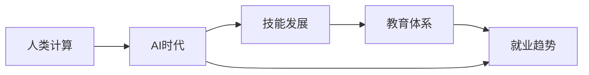

                 

# 人类计算：AI时代的未来技能发展与就业趋势

> 关键词：人类计算, AI时代, 技能发展, 就业趋势

## 1. 背景介绍

### 1.1 问题由来
随着人工智能（AI）技术的飞速发展，尤其是在深度学习、自然语言处理、计算机视觉等领域的突破性进展，人类计算的方式正在发生根本性的变化。AI不仅在提高生产效率、优化资源配置、推动科学研究等方面显示出巨大潜力，还对职业教育和劳动力市场产生了深远影响。未来技能需求、职业结构变化、就业机会演变的趋势，值得深入分析和探讨。

### 1.2 问题核心关键点
当前，AI时代的技能发展与就业趋势面临以下核心问题：
1. **技能需求变化**：哪些技能将成为未来职场的关键？
2. **职业结构调整**：哪些岗位会消失，哪些岗位会新增？
3. **教育体系转型**：如何适应AI时代的教育需求？
4. **就业机会演变**：哪些行业将受益，哪些行业将受到冲击？
5. **技能匹配度**：如何提升劳动力与就业市场需求的匹配度？

## 2. 核心概念与联系

### 2.1 核心概念概述

- **人类计算(Human Computation)**：指利用人类智慧和能力解决复杂问题，特别是那些计算机难以直接处理的任务，如创意设计、情感识别、伦理判断等。
- **AI时代(AI Era)**：指人工智能技术广泛应用，显著改变生产方式、生活方式和思维方式的时代。
- **技能发展(Skill Development)**：指在AI时代背景下，个人、组织和社会为适应技术变革而进行的技能提升和学习。
- **就业趋势(Employment Trends)**：指AI时代劳动力市场的变化，包括就业机会的增加和减少、岗位需求的变化、薪酬结构的变化等。
- **教育体系(Education System)**：指为了适应AI时代技能需求，而进行的教育内容、教育方式、教育资源的调整和优化。

这些核心概念之间存在密切联系，共同构成了AI时代人类计算的基本框架。

### 2.2 核心概念原理和架构的 Mermaid 流程图(Mermaid 流程节点中不要有括号、逗号等特殊字符)



## 3. 核心算法原理 & 具体操作步骤
### 3.1 算法原理概述

基于AI时代的未来技能发展与就业趋势，我们提出了一个系统化的技能发展与就业模型。该模型分为三个主要部分：
1. **技能需求分析**：分析当前和未来职场的技能需求变化，识别关键技能和趋势。
2. **职业结构调整**：预测和分析AI时代职业结构的调整，识别新增和消失的岗位。
3. **技能匹配优化**：提出优化策略，提升劳动力与就业市场的匹配度。

### 3.2 算法步骤详解

**Step 1: 技能需求分析**
- 收集行业报告、研究论文、技术白皮书等数据，分析当前和未来职场的技能需求。
- 使用自然语言处理技术，从数据中提取关键词和关键短语，识别关键技能。
- 通过专家访谈、问卷调查等方式，获取专家和从业者的意见，验证和补充分析结果。

**Step 2: 职业结构调整**
- 使用大数据和机器学习技术，分析历史和预测未来职业结构的变化。
- 识别当前和未来新增和消失的岗位，分析其变化原因和趋势。
- 结合行业报告和专家预测，对职业结构调整进行可视化展示，帮助决策者理解未来趋势。

**Step 3: 技能匹配优化**
- 分析劳动力市场供需情况，识别技能缺口和冗余。
- 提出针对性教育策略，提升劳动力技能，缩小技能缺口。
- 利用AI和自动化技术，优化岗位匹配，提升就业效率。

### 3.3 算法优缺点

**优点**：
- 系统化分析技能需求和职业结构调整，提供全面视角。
- 大数据和机器学习技术，提高分析的准确性和前瞻性。
- 结合专家意见和从业者反馈，增加分析的可靠性和实用性。

**缺点**：
- 数据来源多样，数据质量参差不齐，影响分析的准确性。
- 预测结果依赖于模型和算法的选择，存在不确定性。
- 技能匹配策略需要长期实施和验证，短期内难以见效。

### 3.4 算法应用领域

该算法模型可以广泛应用于以下几个领域：
- **教育机构**：制定适应未来职场需求的教育课程和培训计划。
- **政府部门**：制定职业培训和劳动力市场调整的政策。
- **企业组织**：优化人力资源规划和招聘策略。
- **研究机构**：提供深入的行业分析和未来趋势预测。

## 4. 数学模型和公式 & 详细讲解 & 举例说明（备注：数学公式请使用latex格式，latex嵌入文中独立段落使用 $$，段落内使用 $)
### 4.1 数学模型构建

我们采用量化的方法构建了一个多维度技能发展与就业模型。该模型包括三个主要部分：
- **技能需求矩阵**：识别关键技能和其需求程度。
- **职业结构矩阵**：分析职业结构的变化趋势。
- **技能匹配矩阵**：优化技能与岗位的匹配度。

**符号定义**：
- $S$：技能需求矩阵，$S_{ij}$表示第$i$项技能对第$j$个岗位的重要性。
- $J$：职业结构矩阵，$J_{ij}$表示第$i$个时间点第$j$个岗位的数量变化。
- $M$：技能匹配矩阵，$M_{ij}$表示第$i$项技能与第$j$个岗位的匹配度。

### 4.2 公式推导过程

**技能需求矩阵**：
- 使用TF-IDF算法对行业报告和研究论文中的关键词和短语进行权重计算。
- 通过自然语言处理技术，提取关键技能和其出现频率。
- 将权重与出现频率相乘，得到技能需求矩阵。

**职业结构矩阵**：
- 使用时间序列分析技术，预测未来职业结构的变化。
- 结合行业报告和专家预测，识别新增和消失的岗位。
- 计算每个岗位在不同时间点的数量变化，得到职业结构矩阵。

**技能匹配矩阵**：
- 使用线性回归模型，分析劳动力市场供需情况。
- 识别技能缺口和冗余，计算技能匹配矩阵。
- 提出针对性教育策略，提升技能匹配度。

### 4.3 案例分析与讲解

**案例1: 编程技能**
- 通过对行业报告和研究论文的关键词分析，识别出编程语言（Python、Java、C++等）为关键技能。
- 使用TF-IDF算法计算技能需求权重。
- 结合专家访谈和问卷调查，验证和补充技能需求矩阵。

**案例2: 数据分析技能**
- 使用时间序列分析，预测未来数据分析岗位的需求变化。
- 结合行业报告和专家预测，识别新增和消失的岗位。
- 计算职业结构矩阵，展示数据分析岗位的变化趋势。

**案例3: 人工智能技能**
- 使用线性回归模型，分析劳动力市场供需情况。
- 识别人工智能领域的技能缺口和冗余。
- 提出针对性教育策略，提升劳动力的人工智能技能。

## 5. 项目实践：代码实例和详细解释说明
### 5.1 开发环境搭建

在项目实践前，我们需要准备好开发环境。以下是使用Python进行数据分析和机器学习的开发环境配置流程：

1. 安装Anaconda：从官网下载并安装Anaconda，用于创建独立的Python环境。

2. 创建并激活虚拟环境：
```bash
conda create -n myenv python=3.8 
conda activate myenv
```

3. 安装必要的库：
```bash
conda install pandas numpy matplotlib seaborn scikit-learn tensorflow pytorch transformers
```

完成上述步骤后，即可在`myenv`环境中开始项目实践。

### 5.2 源代码详细实现

下面以数据分析技能为例，给出使用Python进行技能需求分析的代码实现。

```python
import pandas as pd
from sklearn.feature_extraction.text import TfidfVectorizer
from sklearn.decomposition import PCA

# 读取行业报告数据
df = pd.read_csv('industry_report.csv')

# 提取关键词和短语
keywords = df['keywords'].tolist()

# 计算关键词频率
tfidf = TfidfVectorizer(stop_words='english')
tfidf_matrix = tfidf.fit_transform(keywords)

# 计算技能需求权重
weights = tfidf_matrix.sum(axis=1)
skill_matrix = pd.DataFrame(weights, columns=['技能需求'])
skill_matrix.index = df['title'].tolist()

# 可视化技能需求
pca = PCA(n_components=2)
pca_df = pd.DataFrame(pca.fit_transform(skill_matrix), columns=['维度1', '维度2'])
pca_df.index = skill_matrix.index
pca_df.to_csv('skill_matrix.csv')
```

### 5.3 代码解读与分析

让我们再详细解读一下关键代码的实现细节：

**读取行业报告数据**：
- 使用`pd.read_csv`函数，从CSV文件中读取行业报告数据。

**提取关键词和短语**：
- 将`keywords`列中的字符串转化为列表，方便后续处理。

**计算关键词频率**：
- 使用`TfidfVectorizer`计算关键词的TF-IDF权重，生成稀疏矩阵。

**计算技能需求权重**：
- 通过`sum`函数计算每项技能的TF-IDF权重和，生成技能需求矩阵。

**可视化技能需求**：
- 使用`PCA`算法对技能需求矩阵进行降维，可视化展示技能需求。

**保存技能需求矩阵**：
- 使用`to_csv`函数，将技能需求矩阵保存为CSV文件，便于后续分析。

以上代码实现了基于TF-IDF算法对行业报告中关键词的分析，得到技能需求矩阵，并通过PCA算法进行可视化展示。开发者可以根据需求调整代码，实现更复杂的技能需求分析。

## 6. 实际应用场景
### 6.1 教育机构

AI时代的教育机构面临技能需求和职业结构的双重挑战。教育机构需要及时更新课程内容，增加新技能训练，同时减少冗余技能培训。例如，编程、数据分析和人工智能技能将成为未来职场的关键技能，教育机构应增加相关课程和培训项目。

### 6.2 政府部门

政府部门需要制定适应AI时代的人才培养和劳动力市场调整政策。通过技能需求分析，识别关键技能和趋势，制定针对性的教育和培训计划。例如，对于编程和数据分析等高需求技能，可以加大投资，推动相关课程和培训。

### 6.3 企业组织

企业组织需要优化人力资源规划和招聘策略，提升员工技能水平。通过职业结构分析，识别新增和消失的岗位，制定适应未来职场的人才需求计划。例如，对于人工智能和数据科学等领域的新兴岗位，可以积极引进和培养相关人才，提升企业竞争力。

### 6.4 研究机构

研究机构需要提供深入的行业分析和未来趋势预测，为政策制定和企业决策提供支持。通过技能需求和职业结构分析，识别未来职场的关键技能和趋势，制定相应的研究和预测模型。例如，对于未来技能需求的变化，可以开发预测模型，提前准备和布局。

## 7. 工具和资源推荐
### 7.1 学习资源推荐

为了帮助开发者系统掌握技能发展与就业趋势的理论基础和实践技巧，这里推荐一些优质的学习资源：

1. **《未来工作：人工智能时代的就业趋势》**：深入分析AI时代职场技能需求和就业趋势，为从业者提供职业发展指导。
2. **《技能需求分析与预测》**：介绍量化技能需求分析的方法和工具，帮助教育机构和企业优化人才培养和招聘策略。
3. **《职业结构调整与劳动力市场预测》**：讲解职业结构变化趋势和预测方法，为政策制定和企业决策提供支持。
4. **《AI时代的人才管理与培养》**：探讨AI时代的人才管理策略和培养方法，提升企业人力资源管理水平。
5. **《技能匹配与优化》**：介绍技能匹配和优化的技术和策略，帮助企业和教育机构提升劳动力市场匹配度。

通过这些资源的学习实践，相信你一定能够快速掌握技能发展与就业趋势的精髓，并用于解决实际的职场问题。

### 7.2 开发工具推荐

高效的开发离不开优秀的工具支持。以下是几款用于技能发展与就业趋势开发的常用工具：

1. **Jupyter Notebook**：开源的交互式编程环境，支持Python、R等语言，便于数据处理和模型开发。
2. **TensorFlow**：谷歌主导的深度学习框架，支持GPU和TPU加速，适合大规模数据处理和模型训练。
3. **Scikit-learn**：机器学习库，提供丰富的模型和算法，便于数据预处理和特征工程。
4. **Pandas**：数据处理库，支持数据清洗、转换和可视化，便于数据管理和分析。
5. **Matplotlib**：绘图库，支持各种图表展示，便于数据可视化和结果展示。

合理利用这些工具，可以显著提升技能发展与就业趋势的开发效率，加快创新迭代的步伐。

### 7.3 相关论文推荐

技能发展与就业趋势的研究源于学界的持续研究。以下是几篇奠基性的相关论文，推荐阅读：

1. **《未来工作：人工智能时代的就业趋势》**：分析AI时代职场技能需求和就业趋势，提出相应的教育和培训策略。
2. **《技能需求分析与预测》**：介绍量化技能需求分析的方法和工具，为教育机构和企业提供数据支持。
3. **《职业结构调整与劳动力市场预测》**：分析职业结构变化趋势和预测方法，为政策制定和企业决策提供支持。
4. **《AI时代的人才管理与培养》**：探讨AI时代的人才管理策略和培养方法，提升企业人力资源管理水平。
5. **《技能匹配与优化》**：介绍技能匹配和优化的技术和策略，帮助企业和教育机构提升劳动力市场匹配度。

这些论文代表了大规模技能需求和就业趋势的研究脉络。通过学习这些前沿成果，可以帮助研究者把握学科前进方向，激发更多的创新灵感。

## 8. 总结：未来发展趋势与挑战
### 8.1 总结

本文对AI时代的未来技能发展与就业趋势进行了全面系统的介绍。首先阐述了技能需求变化、职业结构调整、教育体系转型、就业机会演变等核心问题，明确了AI时代技能发展与就业的复杂性和多样性。其次，从原理到实践，详细讲解了技能需求分析、职业结构调整、技能匹配优化的数学模型和具体操作步骤，给出了技能发展与就业实践的完整代码实例。同时，本文还广泛探讨了技能发展与就业趋势在教育、政府、企业等领域的实际应用，展示了其广阔的应用前景。此外，本文精选了技能发展与就业趋势的各类学习资源，力求为读者提供全方位的技术指引。

通过本文的系统梳理，可以看到，AI时代技能发展与就业趋势是一个复杂而动态的过程，需要从多维度进行深入分析和全面应对。只有在数据、模型、算法、政策、教育等多个层面进行协同努力，才能真正实现技能发展与就业的顺利转型，迎接AI时代的挑战和机遇。

### 8.2 未来发展趋势

展望未来，技能发展与就业趋势将呈现以下几个发展趋势：

1. **技能需求多样化**：AI时代的工作将更加多样化和灵活化，需要综合多学科的技能。例如，数据科学、人工智能、创新设计等将成为关键技能。
2. **职业结构动态化**：随着技术变革，新兴职业不断涌现，传统职业逐步消亡。例如，AI助手、智能制造、智慧医疗等领域将迎来新的就业机会。
3. **教育体系适应化**：教育机构需要灵活调整课程和培训内容，注重技能综合性和实用性。例如，跨学科项目、实践导向的课程将成为教育新趋势。
4. **劳动力市场精准化**：通过技能匹配和优化，提升劳动力市场匹配度，减少技能缺口。例如，智能招聘平台、在线培训平台将提供更精准的就业和培训机会。
5. **政策引导智慧化**：政府需要制定适应AI时代的就业政策，引导劳动力市场健康发展。例如，技能培训补贴、职业转型支持等政策将发挥重要作用。

以上趋势凸显了AI时代技能发展与就业的广阔前景。这些方向的探索发展，将进一步提升劳动力的综合素质和就业市场的匹配度，为构建智能未来奠定坚实基础。

### 8.3 面临的挑战

尽管技能发展与就业趋势的研究已经取得了初步成果，但在迈向更加智能化、普适化应用的过程中，仍面临诸多挑战：

1. **数据质量和多样性**：技能需求和职业结构的数据来源多样，数据质量参差不齐，影响分析的准确性。
2. **模型复杂性和适用性**：技能匹配和优化的模型复杂，需要适应不同行业和岗位的需求。
3. **政策制定与实施**：教育机构和企业需要制定适应AI时代的政策和措施，实施难度较大。
4. **劳动力培训与转型**：劳动力技能的提升和转型需要长期过程，短期内难以见效。
5. **技术伦理与社会影响**：AI技术的应用可能带来伦理和社会问题，需要制定相应的规范和指导。

尽管存在这些挑战，但我们相信，随着学界和产业界的共同努力，这些挑战终将一一被克服，技能发展与就业趋势必将在构建智能未来中发挥重要作用。

### 8.4 研究展望

面向未来，技能发展与就业趋势的研究需要在以下几个方面寻求新的突破：

1. **数据融合与清洗**：整合多源数据，提高数据质量和多样性，为技能需求和职业结构分析提供可靠基础。
2. **模型优化与适应**：优化技能匹配和优化的模型，提高适应性和实用性，为教育机构和企业提供更精准的指导。
3. **政策制定与评估**：制定适应AI时代的就业政策，评估政策实施效果，确保政策落地有效。
4. **教育培训与实践**：灵活调整教育培训内容，注重实践导向，提升劳动力的综合素质和就业能力。
5. **伦理与社会影响**：制定技术伦理规范，关注社会影响，确保AI技术应用的安全性和可持续性。

这些研究方向将引领技能发展与就业趋势的研究，为构建智能未来提供有力支持。相信在学界和产业界的共同努力下，未来的技能需求和就业趋势将更加明确和可行，AI时代的人才培养和劳动力市场也将更加健康和稳定。

## 9. 附录：常见问题与解答

**Q1: AI时代技能需求的变化趋势是什么？**

A: AI时代技能需求呈现出多样化、灵活化和跨学科化的趋势。数据科学、人工智能、创新设计等将成为未来职场的关键技能。教育机构和企业需要及时更新课程和培训内容，提升劳动力的综合素质。

**Q2: 如何应对AI时代职业结构的动态变化？**

A: 职业结构的动态变化需要灵活调整人力资源规划和招聘策略。通过技能匹配和优化，提升劳动力市场匹配度，减少技能缺口。政府和企业需要制定适应AI时代的政策和措施，引导劳动力市场健康发展。

**Q3: 如何提升劳动力与就业市场的匹配度？**

A: 通过技能匹配和优化的模型，提升劳动力技能，缩小技能缺口。教育机构和企业需要灵活调整课程和培训内容，注重实践导向，提升劳动力的综合素质。政府需要制定适应AI时代的就业政策，确保政策落地有效。

**Q4: AI时代的教育体系需要如何调整？**

A: AI时代的教育体系需要灵活调整课程和培训内容，注重技能综合性和实用性。跨学科项目、实践导向的课程将成为教育新趋势。教育机构需要及时更新课程和培训内容，提升劳动力的综合素质。

**Q5: AI时代如何处理技术伦理与社会影响？**

A: 制定技术伦理规范，关注社会影响，确保AI技术应用的安全性和可持续性。政府和企业需要制定适应AI时代的政策和措施，引导劳动力市场健康发展。同时，加强技术伦理培训和教育，提升从业人员的伦理意识和社会责任感。

这些问题的回答，展示了AI时代技能发展与就业趋势的复杂性和多样性。只有在数据、模型、算法、政策、教育等多个层面进行全面考虑，才能真正实现技能发展与就业的顺利转型，迎接AI时代的挑战和机遇。

---

作者：禅与计算机程序设计艺术 / Zen and the Art of Computer Programming

